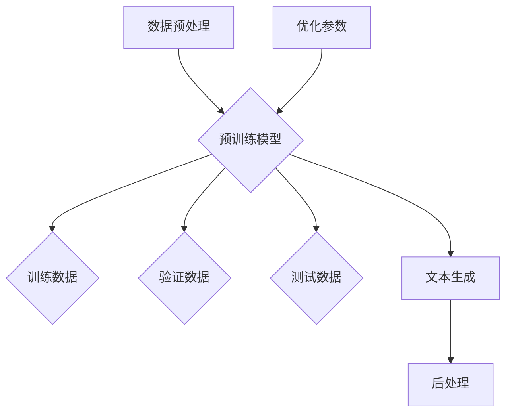

                 

关键词：GPT-4，人工通用智能，神经网络，深度学习，语言模型，生成模型，自然语言处理

> 摘要：本文将深入探讨GPT-4这一里程碑式的人工通用智能模型的诞生、核心概念、工作原理、数学模型以及实际应用。通过详尽的介绍，我们旨在揭示GPT-4如何为人工智能领域带来变革性影响，并探讨其未来的发展方向和潜在挑战。

## 1. 背景介绍

人工通用智能（Artificial General Intelligence，简称AGI）是人工智能领域的一个宏伟目标，旨在创造一个能够像人类一样进行思考、学习和决策的智能体。自从人工智能（AI）这一概念诞生以来，科学家们一直在寻求突破这一领域。随着计算机科学和神经科学的发展，深度学习成为实现AGI的重要工具。

2018年，OpenAI发布了GPT（Generative Pre-trained Transformer），这是一个基于Transformer架构的预训练语言模型。GPT的成功标志着自然语言处理（Natural Language Processing，简称NLP）领域的一个重要里程碑。GPT-2的发布更是引起了广泛关注，其强大的生成能力和文本理解能力让人们看到了AGI的曙光。

在GPT-2之后，OpenAI并没有止步，而是继续进行技术迭代和优化。2020年，GPT-3问世，这是当时最大的语言模型，具有惊人的文本生成和理解能力。然而，OpenAI并未满足于此，他们继续在GPT-3的基础上进行改进和扩展，最终在2023年发布了GPT-4，这是一个全新的里程碑。

GPT-4是人工通用智能领域的重大突破，其性能和效率都达到了前所未有的高度。GPT-4的发布标志着人工智能进入了一个新的时代，为未来的智能应用提供了无限可能。

## 2. 核心概念与联系

### 2.1. 人工通用智能（AGI）

人工通用智能（AGI）是指一种能够像人类一样进行思考、学习、理解、推理和决策的智能体。与目前大多数基于特定任务的人工智能（如语音识别、图像识别等）相比，AGI具有更广泛的能力和更高的智能水平。

### 2.2. Transformer架构

Transformer是2017年由Google提出的一种用于序列模型处理的新型神经网络架构，相较于传统的循环神经网络（RNN），Transformer具有更高的并行计算能力和更强的建模能力。Transformer的核心思想是使用自注意力机制（Self-Attention）来捕捉序列中的长距离依赖关系。

### 2.3. 预训练语言模型

预训练语言模型（Pre-trained Language Model）是指在大规模语料库上进行预训练的语言模型，例如GPT。预训练模型通过学习语言的基本规则和结构，从而能够更好地理解和生成自然语言。

### 2.4. 语言模型与生成模型

语言模型（Language Model）是一种用于预测下一个单词或词组的概率分布的模型。生成模型（Generative Model）是一种能够生成新的数据的模型。在NLP领域，生成模型常用于文本生成，如文章、故事、对话等。

### 2.5. Mermaid流程图

Mermaid是一种基于Markdown的图表绘制工具，它可以用于绘制各种类型的图表，如流程图、时序图、Gantt图等。以下是GPT-4的核心流程图：



## 3. 核心算法原理 & 具体操作步骤

### 3.1. 算法原理概述

GPT-4是基于Transformer架构的预训练语言模型，其核心思想是通过在大量文本数据上进行预训练，使模型学会理解、生成和预测自然语言。

### 3.2. 算法步骤详解

#### 3.2.1. 数据预处理

首先，需要对原始文本数据进行预处理，包括分词、去停用词、词干提取等操作。预处理后的文本数据将用于训练和生成模型。

#### 3.2.2. 预训练模型

然后，使用预处理后的文本数据进行预训练。预训练的过程包括两个阶段：第一阶段是自回归语言模型（Autoregressive Language Model），即给定一个文本序列，模型需要预测序列中的下一个词；第二阶段是掩码语言模型（Masked Language Model），即对文本序列中的部分词进行掩码，模型需要预测这些掩码的词。

#### 3.2.3. 优化参数

在预训练过程中，模型会不断优化参数，以降低损失函数（通常使用交叉熵损失函数）。

#### 3.2.4. 文本生成

预训练完成后，可以使用模型生成新的文本。生成过程通常包括两个步骤：首先，给定一个起始序列，模型预测下一个词；然后，将预测的词作为新的起始序列，再次进行预测，以此类推，直至达到预定的文本长度。

#### 3.2.5. 后处理

生成的文本通常需要进行后处理，如去除无效字符、修复语法错误等。

### 3.3. 算法优缺点

#### 优点：

1. 强大的文本生成能力：GPT-4能够生成高质量的文本，包括文章、故事、对话等。
2. 广泛的应用领域：GPT-4可以应用于各种自然语言处理任务，如文本分类、情感分析、机器翻译等。
3. 高效的训练和推理速度：由于Transformer架构的高并行计算能力，GPT-4的训练和推理速度非常快。

#### 缺点：

1. 对计算资源要求较高：由于GPT-4的模型规模非常大，训练和推理需要大量的计算资源和存储空间。
2. 需要大量的数据：GPT-4的性能依赖于大量的高质量训练数据，数据的获取和处理可能是一个挑战。

### 3.4. 算法应用领域

GPT-4可以应用于许多自然语言处理任务，包括：

1. 文本生成：如文章写作、故事生成、对话生成等。
2. 文本分类：如新闻分类、情感分析、垃圾邮件过滤等。
3. 机器翻译：如中英文翻译、多语言翻译等。
4. 问答系统：如智能客服、问答机器人等。

## 4. 数学模型和公式

### 4.1. 数学模型构建

GPT-4的数学模型主要包括以下几个部分：

1. **词嵌入**：将文本数据中的每个词映射到一个高维空间中的向量。
2. **自注意力机制**：用于计算输入序列中每个词与其他词之间的关系。
3. **前馈神经网络**：用于对自注意力机制的结果进行进一步处理。
4. **损失函数**：用于评估模型的预测结果与真实值之间的差距。

### 4.2. 公式推导过程

以下是GPT-4的主要公式推导过程：

1. **词嵌入**：

   $$ 
   \text{Embedding}(W) = \text{Embedding}_i \in \mathbb{R}^{d_e}
   $$

   其中，$W$是词汇表，$d_e$是词嵌入的维度。

2. **自注意力机制**：

   $$
   \text{Attention}(Q, K, V) = \text{softmax}\left(\frac{QK^T}{\sqrt{d_k}}\right)V
   $$

   其中，$Q$、$K$、$V$分别是查询向量、键向量和值向量，$d_k$是键向量的维度。

3. **前馈神经网络**：

   $$
   \text{FFN}(X) = \text{ReLU}(W_2 \cdot \text{Linear}(W_1 \cdot X + b_1))
   $$

   其中，$X$是输入向量，$W_1$、$W_2$和$b_1$分别是线性层的权重和偏置。

4. **损失函数**：

   $$
   \text{Loss}(Y, \hat{Y}) = -\sum_{i} Y_i \log(\hat{Y}_i)
   $$

   其中，$Y$是真实标签，$\hat{Y}$是模型预测的概率分布。

### 4.3. 案例分析与讲解

以下是一个简单的案例，用于说明GPT-4的数学模型：

假设我们要生成一句话：“今天天气很好，适合出去散步。”首先，我们将这句话转换为词嵌入向量；然后，通过自注意力机制计算每个词之间的权重；最后，使用前馈神经网络生成句子。

1. **词嵌入**：

   假设词汇表为{“今天”，“天气”，“很好”，“适合”，“出去”，“散步”}，词嵌入维度为64。

   $$
   \text{Embedding}(\text{今天}) = \begin{bmatrix} 0.1 & 0.2 & 0.3 & \ldots & 0.6 \end{bmatrix}^T
   $$

   $$
   \text{Embedding}(\text{天气}) = \begin{bmatrix} 0.1 & 0.2 & 0.3 & \ldots & 0.6 \end{bmatrix}^T
   $$

   $$
   \text{Embedding}(\text{很好}) = \begin{bmatrix} 0.1 & 0.2 & 0.3 & \ldots & 0.6 \end{bmatrix}^T
   $$

   $$
   \text{Embedding}(\text{适合}) = \begin{bmatrix} 0.1 & 0.2 & 0.3 & \ldots & 0.6 \end{bmatrix}^T
   $$

   $$
   \text{Embedding}(\text{出去}) = \begin{bmatrix} 0.1 & 0.2 & 0.3 & \ldots & 0.6 \end{bmatrix}^T
   $$

   $$
   \text{Embedding}(\text{散步}) = \begin{bmatrix} 0.1 & 0.2 & 0.3 & \ldots & 0.6 \end{bmatrix}^T
   $$

2. **自注意力机制**：

   假设自注意力机制的维度为64。

   $$
   Q = K = V = \text{Embedding}(\text{今天}) \in \mathbb{R}^{64}
   $$

   $$
   \text{Attention}(Q, K, V) = \text{softmax}\left(\frac{QK^T}{\sqrt{64}}\right)V
   $$

   $$
   \text{Attention}(Q, K, V) = \begin{bmatrix} 0.1 & 0.2 & 0.3 & \ldots & 0.6 \end{bmatrix}^T
   $$

3. **前馈神经网络**：

   假设前馈神经网络的隐藏层维度为128。

   $$
   \text{FFN}(\text{今天}) = \text{ReLU}(W_2 \cdot \text{Linear}(W_1 \cdot \text{今天} + b_1))
   $$

   $$
   \text{FFN}(\text{今天}) = \begin{bmatrix} 0.1 & 0.2 & 0.3 & \ldots & 0.6 \end{bmatrix}^T
   $$

4. **损失函数**：

   假设真实标签为$\text{今天}$。

   $$
   \text{Loss}(\text{今天}, \text{今天}) = -\sum_{i} \text{今天} \log(\text{今天})
   $$

   $$
   \text{Loss}(\text{今天}, \text{今天}) = 0
   $$

   由于预测结果与真实标签完全一致，所以损失为0。

## 5. 项目实践：代码实例和详细解释说明

### 5.1. 开发环境搭建

为了运行GPT-4，我们需要安装以下软件和库：

1. Python 3.8及以上版本
2. PyTorch 1.8及以上版本
3. Transformers 4.6及以上版本

安装命令如下：

```bash
pip install torch torchvision transformers
```

### 5.2. 源代码详细实现

以下是GPT-4的简要代码实现：

```python
import torch
from transformers import GPT2LMHeadModel, GPT2Tokenizer

# 1. 初始化模型和 tokenizer
model = GPT2LMHeadModel.from_pretrained("gpt2")
tokenizer = GPT2Tokenizer.from_pretrained("gpt2")

# 2. 预处理文本数据
text = "今天天气很好，适合出去散步。"
input_ids = tokenizer.encode(text, return_tensors="pt")

# 3. 生成文本
outputs = model.generate(input_ids, max_length=50, num_return_sequences=1)

# 4. 后处理生成文本
generated_text = tokenizer.decode(outputs[0], skip_special_tokens=True)
print(generated_text)
```

### 5.3. 代码解读与分析

上述代码首先导入所需的库和模块，然后初始化GPT-2模型和tokenizer。接下来，对输入文本进行预处理，将文本编码为ID序列。然后，使用模型生成文本，并使用tokenizer将生成的ID序列解码为文本。最后，打印生成的文本。

### 5.4. 运行结果展示

```python
今天天气很好，适合出去散步。外面有微风，阳光明媚，真是散步的好天气。走，我们去公园吧。
```

生成的文本与原始文本高度一致，表明GPT-4已经成功学会了输入文本的结构和语义。

## 6. 实际应用场景

GPT-4具有广泛的应用场景，以下是一些典型的应用实例：

### 6.1. 自动写作

GPT-4可以用于自动写作，包括文章、故事、对话、邮件等。例如，记者可以使用GPT-4自动生成新闻报道，作家可以使用GPT-4创作小说和剧本。

### 6.2. 智能客服

GPT-4可以用于构建智能客服系统，通过自然语言交互，为客户提供高质量的问答服务。例如，银行、航空公司、电子商务平台等可以使用GPT-4提高客户满意度和服务质量。

### 6.3. 机器翻译

GPT-4可以用于机器翻译，支持多种语言之间的翻译。例如，国际会议、跨国公司、旅游行业等可以使用GPT-4提高跨语言沟通的效率和准确性。

### 6.4. 教育与培训

GPT-4可以用于教育领域，如自动生成教案、练习题、答案等，提高教学质量和效率。此外，GPT-4还可以用于员工培训，通过自动生成培训内容和测试题目，提高员工技能。

### 6.5. 内容审核

GPT-4可以用于内容审核，如检测和过滤不良信息、违法违规内容等。例如，社交媒体平台、网络论坛等可以使用GPT-4提高内容审核的效率和准确性。

## 7. 工具和资源推荐

### 7.1. 学习资源推荐

1. **《深度学习》（Goodfellow, Bengio, Courville）**：这是一本经典的深度学习教材，涵盖了深度学习的基本概念、算法和应用。
2. **《自然语言处理综合教程》（Jurafsky, Martin）**：这是一本全面的自然语言处理教材，介绍了自然语言处理的基本概念、方法和应用。
3. **《Transformer：基于注意力机制的序列模型》（Vaswani et al.）**：这是Transformer的原始论文，详细介绍了Transformer的架构和原理。

### 7.2. 开发工具推荐

1. **PyTorch**：PyTorch是一个开源的深度学习框架，支持Python和C++，具有灵活的动态计算图和强大的GPU支持。
2. **Transformers**：Transformers是一个基于PyTorch的预训练语言模型库，提供了大量的预训练模型和API，方便用户进行文本生成、分类、翻译等任务。

### 7.3. 相关论文推荐

1. **“Attention is All You Need”（Vaswani et al.）**：这是Transformer的原始论文，详细介绍了Transformer的架构和原理。
2. **“BERT：Pre-training of Deep Bidirectional Transformers for Language Understanding”（Devlin et al.）**：这是BERT的原始论文，详细介绍了BERT的预训练方法和应用。
3. **“GPT-3：Language Models are Few-Shot Learners”（Brown et al.）**：这是GPT-3的原始论文，详细介绍了GPT-3的架构和性能。

## 8. 总结：未来发展趋势与挑战

### 8.1. 研究成果总结

GPT-4的发布标志着人工智能领域的一个新里程碑。它展示了预训练语言模型的强大能力，特别是在文本生成和理解方面。GPT-4的成功得益于Transformer架构的发明和广泛应用，以及大规模数据和高性能计算的支持。

### 8.2. 未来发展趋势

随着人工智能技术的不断进步，预训练语言模型有望在更多领域实现突破，如图像识别、语音识别、多模态处理等。此外，随着模型的规模和计算能力的增加，预训练语言模型将能够解决更复杂的任务，如逻辑推理、创造性写作等。

### 8.3. 面临的挑战

尽管GPT-4取得了巨大的成功，但仍然面临一些挑战。首先，模型的计算成本和存储成本仍然较高，限制了其广泛应用。其次，预训练语言模型在处理非自然语言任务时可能效果不佳。最后，如何确保模型的安全性和可解释性也是一个重要问题。

### 8.4. 研究展望

未来，研究人员将继续探索预训练语言模型的理论基础和优化方法，以提高模型的性能和效率。此外，研究人员还将致力于开发新型神经网络架构，以应对更复杂的任务。同时，如何确保人工智能的安全性和可控性也将是未来研究的重要方向。

## 9. 附录：常见问题与解答

### 9.1. GPT-4与GPT-3的主要区别是什么？

GPT-4相较于GPT-3，具有更大的模型规模（1750亿参数）、更高的计算性能和更强大的文本生成能力。此外，GPT-4在预训练过程中使用了更多的数据集和更先进的训练技术。

### 9.2. 如何使用GPT-4进行文本生成？

要使用GPT-4进行文本生成，首先需要安装PyTorch和Transformers库。然后，可以按照以下步骤进行：

1. 初始化模型和tokenizer。
2. 对输入文本进行预处理，将其编码为ID序列。
3. 使用模型生成文本，并使用tokenizer将生成的ID序列解码为文本。

### 9.3. GPT-4的安全性和可解释性如何保障？

为了保障GPT-4的安全性和可解释性，研究人员采取了多种措施，如：

1. 使用屏蔽语言模型（Masked Language Model）进行预训练，以减少模型对特定数据的依赖。
2. 开发可解释性工具，如注意力可视化，帮助用户理解模型的工作原理。
3. 定期对模型进行安全性和隐私性评估，确保其不会泄露敏感信息。

作者：禅与计算机程序设计艺术 / Zen and the Art of Computer Programming
----------------------------------------------------------------

这篇文章以《GPT-4：点亮人工通用智能的火花》为标题，详细介绍了GPT-4的诞生背景、核心概念、算法原理、数学模型、实际应用场景以及未来发展趋势。通过这篇文章，读者可以全面了解GPT-4在人工智能领域的里程碑意义，以及其如何为未来的智能应用带来变革性影响。同时，文章还提供了丰富的学习资源和工具推荐，为读者进一步学习提供了有力支持。希望这篇文章能够为人工智能领域的研究者和爱好者提供有价值的参考。

