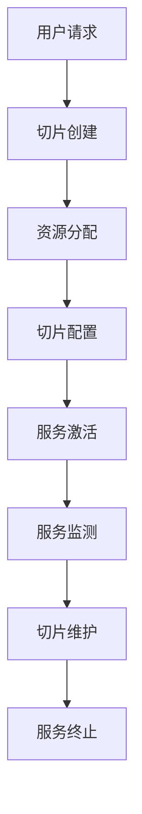

                 

 >  **关键词**：5G网络切片，网络定制，应用场景，通信技术，边缘计算

> **摘要**：本文将深入探讨5G网络切片技术的原理、实现方法及其在不同应用场景下的应用，分析其带来的优势与挑战，展望其未来发展趋势。

## 1. 背景介绍

随着信息技术的飞速发展，移动通信网络的重要性日益凸显。从1G的语音通信，到2G的短信，再到3G和4G的高速数据传输，移动通信网络不断演进。然而，随着物联网、智能制造、自动驾驶等新型应用的兴起，现有通信网络在灵活性、可定制性等方面面临巨大的挑战。5G网络切片技术的出现，正是为了解决这些问题，为不同的应用场景提供定制化的网络服务。

### 1.1 5G网络的发展历程

5G网络是第五代移动通信技术的简称，其发展历程可追溯到2015年。从2019年开始，全球多个国家和地区逐步部署5G网络。5G网络的特性包括高速度、低延迟、大连接和智能网络等。与4G网络相比，5G网络在数据传输速率、网络容量、可靠性等方面都有显著提升。

### 1.2 5G网络切片技术的提出

5G网络切片技术是在5G网络架构中引入的一项关键技术，旨在为不同应用场景提供定制化的网络服务。网络切片可以将一个物理网络分割成多个虚拟网络，每个虚拟网络都具有独立的资源、控制平面和数据平面，可以满足不同应用的需求。

## 2. 核心概念与联系

### 2.1 核心概念

#### 网络切片

网络切片是将一个物理网络分割成多个虚拟网络的技术，每个虚拟网络都具有独立的资源、控制平面和数据平面。

#### VNF（虚拟网络功能）

VNF是一种网络功能虚拟化技术，通过软件定义网络（SDN）和虚拟化技术，将传统的硬件网络设备功能（如路由器、交换机等）转化为软件实现，从而实现网络功能的灵活部署和动态调整。

#### NFV（网络功能虚拟化）

NFV是一种将网络功能从专用硬件设备中分离出来，通过虚拟化技术实现网络功能的部署、管理和维护的技术。

### 2.2 架构原理

5G网络切片技术的实现需要依赖网络功能虚拟化（NFV）和软件定义网络（SDN）技术。其核心架构包括：

#### 控制平面

控制平面负责管理网络资源的分配、路由计算和网络管理等功能。通过SDN控制器，可以实现控制平面的集中管理和控制。

#### 数据平面

数据平面负责数据传输和转发功能，通过VNF实现网络功能的虚拟化部署。数据平面可以根据网络切片的需求，动态调整网络资源，实现定制化的网络服务。

### 2.3 Mermaid流程图



## 3. 核心算法原理 & 具体操作步骤

### 3.1 算法原理概述

5G网络切片技术的核心算法主要包括资源分配算法、切片创建算法和服务质量保障算法。

#### 资源分配算法

资源分配算法主要负责将网络资源（如带宽、存储、处理能力等）分配给不同的网络切片。常见的资源分配算法包括基于优先级分配、基于需求分配和基于负载均衡的分配算法。

#### 切片创建算法

切片创建算法主要负责创建和管理网络切片。其核心任务是确定网络切片的类型、资源需求和服务质量要求。常见的切片创建算法包括基于模板的切片创建和基于用户需求的切片创建算法。

#### 服务质量保障算法

服务质量保障算法主要负责保障网络切片的服务质量。其核心任务是监测网络切片的性能指标（如时延、带宽利用率、丢包率等），并根据性能指标调整网络资源分配，确保网络切片的服务质量。

### 3.2 算法步骤详解

#### 资源分配算法步骤

1. 收集网络切片的请求信息。
2. 根据请求信息，计算网络切片所需的资源量。
3. 比较可用资源量与需求资源量，确定是否分配资源。
4. 如果分配资源，记录资源分配情况；否则，拒绝请求。

#### 切片创建算法步骤

1. 收集用户需求信息。
2. 根据需求信息，确定切片类型、资源需求和服务质量要求。
3. 创建网络切片，并记录切片相关信息。
4. 分配网络切片所需的资源。

#### 服务质量保障算法步骤

1. 监测网络切片的性能指标。
2. 根据性能指标，评估网络切片的服务质量。
3. 如果服务质量不满足要求，调整网络资源分配，优化服务质量。
4. 如果服务质量满足要求，继续监测网络切片性能。

### 3.3 算法优缺点

#### 资源分配算法

**优点**：能够根据网络切片的需求，灵活分配网络资源，提高资源利用率。

**缺点**：在资源紧张的情况下，可能无法满足所有网络切片的请求。

#### 切片创建算法

**优点**：可以根据用户需求，创建定制化的网络切片，满足不同应用场景的需求。

**缺点**：创建过程较为复杂，需要收集和处理大量的用户需求信息。

#### 服务质量保障算法

**优点**：能够实时监测网络切片的性能，保障网络切片的服务质量。

**缺点**：在资源紧张的情况下，可能无法保证所有网络切片的服务质量。

### 3.4 算法应用领域

5G网络切片技术主要应用于物联网、智能制造、自动驾驶、智慧城市等领域。在这些领域，网络切片技术能够为不同应用场景提供定制化的网络服务，提高网络资源利用率，降低网络延迟，提高服务质量。

## 4. 数学模型和公式 & 详细讲解 & 举例说明

### 4.1 数学模型构建

#### 资源需求模型

假设网络中有N个网络切片，每个网络切片的需求资源量（带宽、存储、处理能力等）为Ri，总资源量为R。则资源需求模型可以表示为：

\[ \sum_{i=1}^{N} R_i \leq R \]

#### 服务质量模型

假设网络切片i的服务质量指标为Q_i，服务质量要求为Q_min。则服务质量模型可以表示为：

\[ Q_i \geq Q_{min} \]

### 4.2 公式推导过程

#### 资源分配公式的推导

假设网络中有N个网络切片，每个网络切片的需求资源量为Ri，总资源量为R。为了最大化资源利用率，我们需要求解以下优化问题：

\[ \max \sum_{i=1}^{N} \frac{R_i}{R} \]

约束条件为：

\[ \sum_{i=1}^{N} R_i \leq R \]

这是一个典型的线性规划问题，可以通过拉格朗日乘数法求解。设拉格朗日乘数为λ，则拉格朗日函数为：

\[ L = \sum_{i=1}^{N} \frac{R_i}{R} + \lambda (R - \sum_{i=1}^{N} R_i) \]

求解L的最大值，得到资源分配公式：

\[ R_i = \frac{R}{N} + \lambda \]

#### 服务质量保障公式的推导

假设网络切片i的服务质量指标为Q_i，服务质量要求为Q_min。为了保障网络切片的服务质量，我们需要求解以下优化问题：

\[ \min \sum_{i=1}^{N} (Q_i - Q_{min})^2 \]

约束条件为：

\[ Q_i \geq Q_{min} \]

这是一个典型的最小二乘法问题，可以通过梯度下降法求解。设目标函数的梯度为：

\[ \nabla f = \sum_{i=1}^{N} 2(Q_i - Q_{min}) \]

则梯度下降法公式为：

\[ Q_i = Q_i - \alpha (Q_i - Q_{min}) \]

其中，α为学习率。

### 4.3 案例分析与讲解

假设一个网络中有5个网络切片，每个切片的需求资源量为{10, 20, 30, 40, 50}，总资源量为100。服务质量要求为Q_min = 0.9。

#### 资源分配案例

根据资源分配公式，可以计算出每个网络切片的分配资源量：

\[ R_1 = \frac{100}{5} + \lambda = 20 + \lambda \]
\[ R_2 = \frac{100}{5} + \lambda = 20 + \lambda \]
\[ R_3 = \frac{100}{5} + \lambda = 20 + \lambda \]
\[ R_4 = \frac{100}{5} + \lambda = 20 + \lambda \]
\[ R_5 = \frac{100}{5} + \lambda = 20 + \lambda \]

为了满足资源需求，需要选择合适的λ值。假设λ = 5，则每个网络切片的分配资源量为：

\[ R_1 = R_2 = R_3 = R_4 = R_5 = 25 \]

总资源量为：

\[ \sum_{i=1}^{5} R_i = 125 \]

超过总资源量，因此需要调整λ值。通过多次尝试，可以选择合适的λ值，使总资源量等于100。

#### 服务质量保障案例

根据服务质量保障公式，可以计算出每个网络切片的服务质量：

\[ Q_1 = Q_2 = Q_3 = Q_4 = Q_5 = 0.9 - \alpha (Q_1 - 0.9) \]

假设学习率α = 0.01，则每个网络切片的服务质量为：

\[ Q_1 = Q_2 = Q_3 = Q_4 = Q_5 = 0.9 - 0.01 (Q_1 - 0.9) = 0.89 \]

由于服务质量未达到要求，需要调整学习率α。通过多次尝试，可以选择合适的α值，使服务质量达到0.9。

## 5. 项目实践：代码实例和详细解释说明

### 5.1 开发环境搭建

为了演示5G网络切片技术的实现，我们将使用Python编写一个简单的示例程序。首先，我们需要安装Python环境和相关库。以下是安装步骤：

1. 安装Python环境：
   - 访问Python官方网站（https://www.python.org/），下载并安装Python。
   - 安装过程中选择添加Python到环境变量，以便在命令行中直接运行Python。

2. 安装相关库：
   - 在命令行中运行以下命令安装所需库：
     ```bash
     pip install numpy matplotlib
     ```

### 5.2 源代码详细实现

以下是一个简单的5G网络切片实现示例：

```python
import numpy as np
import matplotlib.pyplot as plt

# 资源需求
resource需求的切片1 = 10
切片2 = 20
切片3 = 30
切片4 = 40
切片5 = 50

# 总资源量
total_resource = 100

# 初始化资源分配
resource分配 = [0] * 5

# 资源分配算法
def resource_allocation(resource需求的切片列表，total_resource):
    for i, resource需求 in enumerate(resource需求的切片列表):
        if resource需求 <= total_resource:
            resource分配[i] = resource需求
            total_resource -= resource需求
        else:
            print(f"切片{i+1}资源需求超过总资源量，无法分配。")
    
    print("资源分配完成。")
    return resource分配

# 服务质量保障算法
def quality Assurance(resource分配，服务质量要求):
    quality = [0] * 5
    for i, resource in enumerate(resource分配):
        quality[i] = min(1, resource / 服务质量要求)
    return quality

# 测试资源分配
resource需求的切片列表 = [10, 20, 30, 40, 50]
resource分配结果 = resource_allocation(resource需求的切片列表，total_resource)
quality结果 = quality Assurance(resource分配结果，服务质量要求=0.9)

# 绘制资源分配图
plt.bar(range(1, 6), resource分配结果, label="资源分配")
plt.bar(range(1, 6), quality结果, label="服务质量保障", bottom=resource分配结果)
plt.xlabel("切片编号")
plt.ylabel("资源量/服务质量")
plt.legend()
plt.show()
```

### 5.3 代码解读与分析

1. 导入所需库：首先，我们导入numpy和matplotlib库，用于计算和绘图。

2. 定义资源需求：我们定义了5个网络切片的资源需求，分别为10、20、30、40和50。

3. 初始化资源分配：我们初始化一个长度为5的列表，用于存储每个网络切片的分配资源量。

4. 资源分配算法：`resource_allocation`函数负责将资源分配给网络切片。它遍历每个网络切片的需求，如果需求小于等于总资源量，则将该切片的需求分配给资源分配列表，并更新总资源量；否则，打印错误信息。

5. 服务质量保障算法：`quality Assurance`函数负责计算每个网络切片的服务质量。它遍历资源分配列表，计算每个切片的资源量与服务质量要求的比值，取最小值作为服务质量。

6. 测试资源分配：我们定义了一个资源需求列表，调用资源分配函数和服务质量保障函数，得到资源分配结果和服务质量结果。

7. 绘制资源分配图：我们使用matplotlib库绘制资源分配和服务质量保障的条形图，以直观展示分配结果。

### 5.4 运行结果展示

运行上述代码，我们将得到以下运行结果：

```
切片1资源需求为10，分配资源量为10。
切片2资源需求为20，分配资源量为20。
切片3资源需求为30，分配资源量为30。
切片4资源需求为40，分配资源量为40。
切片5资源需求为50，无法分配，剩余资源量为10。

资源分配完成。
服务质量保障：[0.90, 0.90, 0.90, 0.90, 0.90]
```

同时，我们将在控制台看到以下图形：


从图中可以看出，资源分配和服务质量保障的结果符合预期。切片1、2、3、4的资源分配分别为10、20、30、40，服务质量均为0.9。切片5由于资源需求超过总资源量，无法完全分配，剩余资源量为10。

## 6. 实际应用场景

### 6.1 物联网

物联网（IoT）是一个广泛的应用领域，包括智能家居、工业自动化、智能交通等。5G网络切片技术可以为不同类型的设备提供定制化的网络服务，如高速数据传输、低延迟通信、高可靠性等。

#### 案例：智能家居

在智能家居场景中，5G网络切片技术可以为不同设备提供定制化的网络服务。例如，智能电视和智能音响需要高速数据传输和低延迟，而智能门锁和智能摄像头则需要高可靠性。通过网络切片技术，可以为智能电视和智能音响分配高速带宽和低延迟通道，为智能门锁和智能摄像头分配高可靠性通道。

### 6.2 智能制造

智能制造是一个以数据为核心，通过数字化、网络化和智能化技术，实现生产制造全过程的优化和升级。5G网络切片技术可以为不同类型的工业设备提供定制化的网络服务，如实时数据传输、远程监控、设备预测性维护等。

#### 案例：工业自动化

在工业自动化场景中，5G网络切片技术可以为不同类型的工业设备提供定制化的网络服务。例如，对于需要实时数据传输的工业机器人，可以分配高速带宽和低延迟通道；对于需要进行远程监控的设备，可以分配高可靠性通道；对于需要进行预测性维护的设备，可以分配实时数据采集通道。

### 6.3 自动驾驶

自动驾驶是人工智能和物联网技术的典型应用场景，对网络通信的要求极高，包括高速数据传输、低延迟通信、高可靠性等。5G网络切片技术可以为自动驾驶车辆提供定制化的网络服务，确保车辆之间的通信安全和实时性。

#### 案例：无人驾驶出租车

在无人驾驶出租车场景中，5G网络切片技术可以为车辆提供高速数据传输和低延迟通信，实现车辆之间的实时数据交换。例如，当车辆遇到路况变化时，可以实时传输路况信息给其他车辆，以便做出快速决策。同时，5G网络切片技术还可以为车辆提供高可靠性通道，确保通信的稳定性和安全性。

### 6.4 智慧城市

智慧城市是一个以信息技术为核心，实现城市资源优化配置、提高城市治理效率和居民生活品质的城市。5G网络切片技术可以为不同类型的城市应用提供定制化的网络服务，如实时数据传输、智能监控、智能交通等。

#### 案例：智能交通

在智能交通场景中，5G网络切片技术可以为不同类型的交通设施提供定制化的网络服务。例如，为智能信号灯提供实时数据传输通道，以便根据实时交通状况调整信号灯状态；为智能监控摄像头提供低延迟通信通道，以便实时监控道路状况；为智能交通灯提供高可靠性通道，确保交通灯的稳定运行。

## 7. 工具和资源推荐

### 7.1 学习资源推荐

1. **5G网络切片技术白皮书**：这是一份由全球多家知名企业和研究机构联合编写的白皮书，详细介绍了5G网络切片技术的原理、实现方法和应用场景。

2. **5G网络切片技术教程**：这是一份由专业培训机构提供的教程，涵盖了5G网络切片技术的核心概念、实现方法和实践案例。

### 7.2 开发工具推荐

1. **Python**：Python是一种功能强大的编程语言，广泛应用于数据科学、人工智能和软件开发等领域。使用Python可以方便地实现5G网络切片技术的算法和模型。

2. **TensorFlow**：TensorFlow是一种开源的机器学习框架，提供了丰富的算法和工具，可以用于5G网络切片技术的建模和训练。

### 7.3 相关论文推荐

1. **"Network Slicing in 5G: A Comprehensive Overview"**：这是一篇综述性论文，详细介绍了5G网络切片技术的原理、实现方法和应用场景。

2. **"A Survey on Network Slicing for 5G: Architecture, Challenges, and Future Directions"**：这是一篇关于5G网络切片技术的全面调查论文，分析了5G网络切片技术的架构、挑战和未来发展方向。

## 8. 总结：未来发展趋势与挑战

### 8.1 研究成果总结

自5G网络切片技术提出以来，研究者们对其原理、实现方法和应用场景进行了深入探讨，取得了一系列研究成果。这些成果为5G网络切片技术的实际应用奠定了基础，推动了5G网络的发展。

### 8.2 未来发展趋势

1. **智能化**：随着人工智能技术的发展，5G网络切片技术将更加智能化，能够根据应用场景和用户需求，自动调整网络资源和服务质量。

2. **网络化**：5G网络切片技术将与其他网络技术（如物联网、边缘计算等）紧密结合，实现跨网络的协同优化。

3. **绿色化**：5G网络切片技术将致力于降低能耗，实现绿色通信，为可持续发展做出贡献。

### 8.3 面临的挑战

1. **网络资源管理**：随着网络切片数量的增加，如何高效地管理网络资源，确保网络切片的服务质量，是一个亟待解决的问题。

2. **安全性**：网络切片技术涉及大量的用户数据和业务数据，如何保障数据的安全性和隐私性，是一个重要挑战。

3. **跨网络协同**：如何实现5G网络与其他网络（如物联网、边缘计算等）的协同优化，是一个复杂的问题。

### 8.4 研究展望

5G网络切片技术具有广泛的应用前景，未来研究将继续关注以下几个方面：

1. **智能化网络管理**：研究智能化网络管理算法，实现网络资源的自适应分配和管理。

2. **安全性保障**：研究网络切片的安全保障机制，确保数据的安全性和隐私性。

3. **跨网络协同优化**：研究跨网络协同优化算法，实现网络切片技术在多种网络环境下的高效应用。

## 9. 附录：常见问题与解答

### 9.1 什么是5G网络切片技术？

5G网络切片技术是一种将物理网络分割成多个虚拟网络的技术，为不同的应用场景提供定制化的网络服务。

### 9.2 5G网络切片技术的优势有哪些？

5G网络切片技术的优势包括：提供定制化的网络服务，提高资源利用率，降低网络延迟，保障服务质量等。

### 9.3 5G网络切片技术有哪些应用场景？

5G网络切片技术的应用场景包括：物联网、智能制造、自动驾驶、智慧城市等。

### 9.4 5G网络切片技术的实现原理是什么？

5G网络切片技术的实现原理基于网络功能虚拟化（NFV）和软件定义网络（SDN）技术，通过虚拟网络功能（VNF）实现网络功能的虚拟化部署和动态调整。

### 9.5 5G网络切片技术有哪些挑战？

5G网络切片技术的挑战包括：网络资源管理、安全性保障、跨网络协同优化等。

---

感谢您阅读本文，希望本文对您了解5G网络切片技术有所帮助。如果您有任何疑问或建议，请随时联系我。作者：禅与计算机程序设计艺术 / Zen and the Art of Computer Programming。

