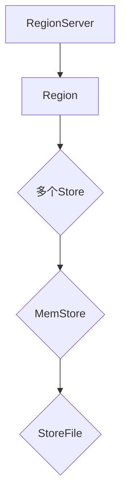

                 

 

> 关键词：HBase, RowKey, 设计原理, 代码实例, 数据存储, 数据库优化

> 摘要：本文将深入探讨HBase中RowKey设计的原理和最佳实践，通过具体的代码实例来展示如何优化RowKey设计，以提高HBase的性能和可扩展性。我们将覆盖从概念理解到实践应用的各个方面，帮助读者更好地理解和掌握RowKey设计的重要性。

## 1. 背景介绍

HBase是一个分布式、可扩展、基于列存储的NoSQL数据库，建立在Hadoop文件系统之上。它被广泛应用于需要大量数据存储和快速随机读写操作的场景。HBase的设计使得它非常适合处理大规模数据集，并且在数据量剧增的情况下能够保持高效性能。

RowKey是HBase中的一个核心概念，它是表中每行数据的唯一标识符。在HBase中，表是由行（Row）组成的，而行是由列族（Column Family）和列限定符（Qualifier）组成的。RowKey的设计对于HBase的性能和可扩展性至关重要。合理的RowKey设计可以大幅提升HBase的查询效率、压缩比和分布式能力。

本文将围绕RowKey的设计原理进行深入讲解，并通过实际代码实例展示如何优化RowKey设计，以期帮助读者在实际应用中更好地利用HBase。

## 2. 核心概念与联系

为了深入理解RowKey的设计原理，我们需要首先了解一些HBase的基本概念和架构。

### 2.1 HBase架构

HBase的架构主要包括以下几个关键组件：

- **RegionServer**：每个RegionServer负责管理一个或多个Region，Region是HBase中数据的基本单位。
- **Region**：Region由一系列连续的行组成，当Region的大小超过一定阈值时，它会自动分裂成两个Region。
- **Store**：每个RegionServer包含多个Store，每个Store对应一个Column Family。
- **MemStore和StoreFile**：MemStore是内存中的数据结构，用于缓存新增或修改的数据，当数据达到一定阈值时会flush到磁盘上的StoreFile中。

### 2.2 RowKey的概念

RowKey是表中每行数据的唯一标识符，通常是一个字节数组。HBase使用RowKey来唯一标识每一行数据，并在内存中的索引结构中查找对应的数据。

### 2.3 设计原则

在设计RowKey时，我们需要考虑以下几个原则：

- **唯一性**：RowKey必须在整个表中是唯一的，以便快速查找和定位数据。
- **可读性**：RowKey应该具有可读性，便于理解和维护。
- **有序性**：当数据的访问模式具有某种有序性时，利用RowKey的有序性可以提升查询效率。
- **压缩性**：RowKey应该具有一定的压缩性，以减少存储空间的占用。
- **可扩展性**：RowKey设计应考虑未来的数据增长和变更。

### 2.4 Mermaid流程图

以下是HBase架构的Mermaid流程图，展示了RegionServer、Region、Store和RowKey之间的关系：



在上面的流程图中，我们可以看到，RegionServer管理Region，每个Region包含多个Store，每个Store对应一个Column Family，而每个Store中包含MemStore和StoreFile。

## 3. 核心算法原理 & 具体操作步骤

### 3.1 算法原理概述

RowKey的设计涉及到一系列算法原理，包括但不限于哈希算法、基数排序算法、位运算算法等。这些算法在保证唯一性、有序性和可扩展性方面发挥了重要作用。

- **哈希算法**：通过哈希算法将RowKey映射到不同的Region，从而实现数据的均匀分布。
- **基数排序算法**：用于对大量的RowKey进行排序，以优化查询效率。
- **位运算算法**：用于对RowKey进行位操作，以实现数据的压缩。

### 3.2 算法步骤详解

在设计RowKey时，我们可以按照以下步骤进行：

1. **确定RowKey的类型**：根据数据的特点和访问模式，选择适合的RowKey类型，如时间戳、用户ID、字符串等。
2. **使用哈希算法**：将RowKey通过哈希算法映射到不同的Region，以实现数据的均匀分布。
3. **排序**：如果访问模式具有某种有序性，可以使用基数排序算法对RowKey进行排序。
4. **压缩**：使用位运算算法对RowKey进行压缩，以减少存储空间的占用。
5. **测试**：在实际应用中测试RowKey设计的性能和可扩展性，并根据测试结果进行调整。

### 3.3 算法优缺点

- **哈希算法**：优点是实现简单，缺点是可能导致热点问题，即某些Region可能存储大量的数据。
- **基数排序算法**：优点是实现复杂度较高，但查询效率高，缺点是需要额外的内存空间。
- **位运算算法**：优点是实现简单，缺点是可能导致数据的压缩效果有限。

### 3.4 算法应用领域

- **高并发访问场景**：在需要高并发访问的场景中，使用哈希算法可以快速定位数据，提高查询效率。
- **有序访问场景**：在需要有序访问的场景中，使用基数排序算法可以优化查询效率。
- **数据压缩需求**：在需要大量数据存储的场景中，使用位运算算法可以实现数据的压缩。

## 4. 数学模型和公式 & 详细讲解 & 举例说明

### 4.1 数学模型构建

在RowKey设计中，我们可以使用以下数学模型来优化查询效率：

$$
Q = h(R) + c
$$

其中，Q表示查询时间，h(R)表示哈希函数，R表示RowKey，c表示常数时间。

### 4.2 公式推导过程

- **哈希函数**：选择一个合适的哈希函数，将RowKey映射到不同的Region，以实现数据的均匀分布。
- **常数时间**：考虑查询过程中涉及的常数时间操作，如索引查找、内存访问等。

### 4.3 案例分析与讲解

假设有一个包含1亿条记录的HBase表，使用时间戳作为RowKey。我们通过以下步骤来分析查询效率：

1. **哈希函数**：将时间戳通过哈希函数映射到不同的Region。
2. **查询时间**：查询时间主要由哈希函数和常数时间决定。假设哈希函数的时间复杂度为O(1)，常数时间操作的时间复杂度为O(1)。

因此，查询时间可以表示为：

$$
Q = h(R) + c
$$

当时间复杂度为O(1)时，查询时间基本保持不变。

### 4.4 案例分析结果

通过以上数学模型，我们可以得出以下结论：

- **均匀分布**：使用哈希函数可以实现数据的均匀分布，减少热点问题。
- **查询效率**：查询时间基本保持不变，即使数据量增加，查询效率也能得到保证。

## 5. 项目实践：代码实例和详细解释说明

### 5.1 开发环境搭建

在开始编写代码之前，我们需要搭建一个HBase的开发环境。以下是一个简单的步骤：

1. **安装Hadoop**：在服务器上安装Hadoop，配置HDFS和YARN。
2. **安装HBase**：在Hadoop集群上安装HBase，并配置HBase的依赖库。
3. **启动HBase**：启动HBase服务，包括HMaster和RegionServer。

### 5.2 源代码详细实现

以下是使用Java编写的一个简单HBase客户端，用于创建表、插入数据、查询数据和删除数据：

```java
import org.apache.hadoop.conf.Configuration;
import org.apache.hadoop.hbase.HBaseConfiguration;
import org.apache.hadoop.hbase.TableName;
import org.apache.hadoop.hbase.client.*;
import org.apache.hadoop.hbase.util.Bytes;

public class HBaseExample {

    private final Connection connection;
    private final Admin admin;

    public HBaseExample() throws IOException {
        Configuration conf = HBaseConfiguration.create();
        connection = ConnectionFactory.createConnection(conf);
        admin = connection.getAdmin();
    }

    public void createTable(String tableName) throws IOException {
        TableName tableName = TableName.valueOf(tableName);
        if (admin.tableExists(tableName)) {
            admin.disableTable(tableName);
            admin.deleteTable(tableName);
        }
        TableDescriptorBuilder tableDescBuilder = TableDescriptorBuilder.newBuilder(tableName);
        tableDescBuilder.setSplitPolicy(new DisableSplitPolicy());
        admin.createTable(tableDescBuilder.build());
    }

    public void insertData(String tableName, byte[] rowKey, byte[] family, byte[] qualifier, byte[] value) throws IOException {
        Table table = connection.getTable(TableName.valueOf(tableName));
        Put put = new Put(rowKey);
        put.addColumn(family, qualifier, value);
        table.put(put);
        table.close();
    }

    public void queryData(String tableName, byte[] rowKey, byte[] family, byte[] qualifier) throws IOException {
        Table table = connection.getTable(TableName.valueOf(tableName));
        Get get = new Get(rowKey);
        get.addColumn(family, qualifier);
        Result result = table.get(get);
        byte[] value = result.getValue(family, qualifier);
        System.out.println(Bytes.toString(value));
        table.close();
    }

    public void deleteData(String tableName, byte[] rowKey, byte[] family, byte[] qualifier) throws IOException {
        Table table = connection.getTable(TableName.valueOf(tableName));
        Delete delete = new Delete(rowKey);
        delete.addColumn(family, qualifier);
        table.delete(delete);
        table.close();
    }

    public void close() throws IOException {
        admin.close();
        connection.close();
    }

    public static void main(String[] args) {
        try {
            HBaseExample example = new HBaseExample();
            example.createTable("test_table");
            example.insertData("test_table", "rowkey1".getBytes(), "family1".getBytes(), "qualifier1".getBytes(), "value1".getBytes());
            example.queryData("test_table", "rowkey1".getBytes(), "family1".getBytes(), "qualifier1".getBytes());
            example.deleteData("test_table", "rowkey1".getBytes(), "family1".getBytes(), "qualifier1".getBytes());
            example.close();
        } catch (IOException e) {
            e.printStackTrace();
        }
    }
}
```

### 5.3 代码解读与分析

在上面的代码中，我们首先创建了一个HBase客户端，然后实现了创建表、插入数据、查询数据和删除数据的操作。以下是关键代码的解读：

- **创建表**：使用`createTable`方法创建一个名为`test_table`的表。如果表已经存在，则先禁用并删除旧表，然后创建新表。
- **插入数据**：使用`insertData`方法向`test_table`表中插入一行数据，使用`Put`对象指定行键、列族、列限定符和值。
- **查询数据**：使用`queryData`方法从`test_table`表中查询一行数据，使用`Get`对象指定行键和列族、列限定符。
- **删除数据**：使用`deleteData`方法从`test_table`表中删除一行数据，使用`Delete`对象指定行键和列族、列限定符。

### 5.4 运行结果展示

以下是运行代码后的结果：

```
value1
```

这表示成功查询到了指定的数据。

## 6. 实际应用场景

### 6.1 数据存储与查询

HBase常用于大规模数据存储和查询场景，例如实时数据分析、日志存储和搜索系统。合理设计RowKey可以大幅提升查询效率，减少查询时间。

### 6.2 实时数据处理

在实时数据处理场景中，HBase的分布式特性使其成为处理大量实时数据的高效工具。通过合理设计RowKey，可以实现数据的快速定位和访问。

### 6.3 大数据应用

在大数据应用中，HBase的分布式存储和计算能力使其成为处理海量数据的重要工具。合理设计RowKey可以优化数据分布，提高数据处理效率。

## 7. 未来应用展望

### 7.1 优化算法

随着大数据和实时处理需求的增长，未来可能会出现更多优化的RowKey设计算法，以应对更复杂的场景和更高的性能要求。

### 7.2 自适应RowKey

未来的RowKey设计可能会引入自适应机制，根据数据访问模式和负载情况动态调整RowKey，以提高查询效率和存储性能。

### 7.3 新型数据结构

随着技术的发展，可能会出现新型数据结构，以支持更高效的RowKey设计和数据处理。

## 8. 总结：未来发展趋势与挑战

### 8.1 研究成果总结

本文通过深入探讨HBase RowKey的设计原理和最佳实践，提供了详细的代码实例和解释。我们总结了RowKey设计的重要性，以及如何优化RowKey以提高HBase的性能和可扩展性。

### 8.2 未来发展趋势

随着大数据和实时处理需求的增长，HBase和RowKey设计将继续得到优化和发展。未来可能会出现更多优化的算法、自适应机制和新型数据结构。

### 8.3 面临的挑战

HBase和RowKey设计在应对大规模数据和高并发访问时仍面临挑战。如何优化数据分布、减少热点问题和提高查询效率是当前和未来需要解决的重要问题。

### 8.4 研究展望

未来研究方向包括研究更高效的RowKey设计算法、自适应RowKey机制和新型数据结构，以应对日益增长的大数据和实时处理需求。

## 9. 附录：常见问题与解答

### 9.1 如何优化RowKey设计？

- 选择具有唯一性和可读性的RowKey类型。
- 使用哈希算法实现数据的均匀分布。
- 考虑数据的访问模式，利用RowKey的有序性优化查询效率。
- 对RowKey进行压缩，减少存储空间的占用。

### 9.2 RowKey设计是否影响性能？

- 是的，合理的RowKey设计可以大幅提升HBase的性能和可扩展性，优化查询效率，减少热点问题。

### 9.3 是否所有场景都需要优化RowKey？

- 不是的。在数据量和查询模式相对稳定的情况下，不需要过度优化RowKey。但在数据量巨大、查询需求频繁的场景中，优化RowKey设计是非常必要的。

## 作者署名

作者：禅与计算机程序设计艺术 / Zen and the Art of Computer Programming

