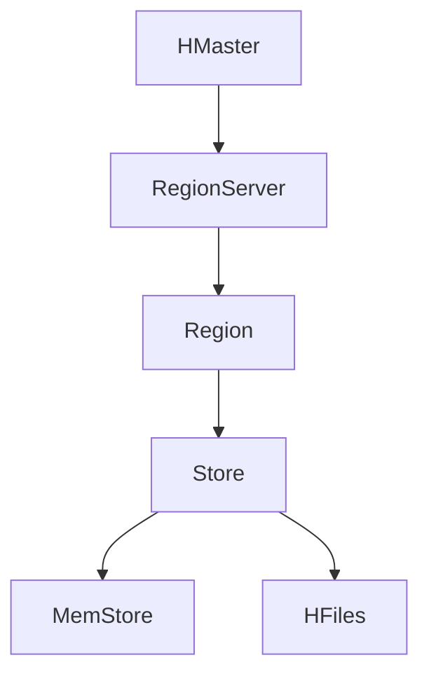

                 

关键词：HBase，分布式存储，列式数据库，NoSQL，数据模型，Hadoop生态系统，性能优化，实例分析，代码实现。

> 摘要：本文将深入探讨HBase的基本原理、数据模型、操作方法及其在Hadoop生态系统中的重要性。通过对HBase的架构设计、数据存储机制和查询优化策略的详细分析，本文旨在帮助读者理解HBase的核心概念，并通过实际代码实例讲解，掌握HBase的编程技巧。

## 1. 背景介绍

HBase是一个分布式、可扩展、基于列的存储系统，最初由Apache Software Foundation开发，并基于Google的BigTable模型构建。它是一个建立在Hadoop生态系统上的NoSQL数据库，旨在处理大量稀疏数据集，支持实时随机实时读/写操作。HBase的设计目标是提供高性能、高可用性、横向可扩展性，并在大数据环境中进行有效的数据处理。

HBase的出现解决了传统关系型数据库在大数据场景下扩展性不足的问题。由于它采用列式存储，可以非常高效地处理大量的稀疏数据。HBase与Hadoop紧密集成，利用Hadoop的分布式文件系统（HDFS）进行底层存储，并通过Hadoop MapReduce进行数据处理。这使得HBase在处理大规模数据时表现出色。

## 2. 核心概念与联系

### HBase的数据模型

HBase的数据模型由行键（Row Key）、列族（Column Family）和列限定符（Column Qualifier）组成。这种模型不同于传统的关系型数据库，它更适合处理稀疏和半结构化数据。

- **行键**：行键是HBase表中数据的主键，用于唯一标识表中的一行。行键可以是任何字节数，且支持排序。
- **列族**：列族是一组列的集合，用于组织和管理表中的列。HBase会为每个列族维护一个单独的数据文件，这有助于提高性能。
- **列限定符**：列限定符是列族中的具体列，它可以是任意的字节数。

### HBase的架构

HBase的架构包括以下几个主要组件：

- **HMaster**：HMaster是HBase集群的主节点，负责管理整个集群，包括监控RegionServer的状态、分配Region给RegionServer、执行故障转移等。
- **RegionServer**：RegionServer是HBase集群中的工作节点，负责存储和管理Region。每个RegionServer可以托管多个Region。
- **Region**：Region是HBase中的数据划分单元，包含一定数量的行。当Region的大小超过一定阈值时，HBase会自动进行Region分裂，将数据分布在多个RegionServer上。
- **Store**：Store是RegionServer中存储数据的子单元，每个Store对应一个列族。Store内部由一系列存储文件（如HFiles）组成。
- **MemStore**：MemStore是Store的一个缓存层，用于临时存储尚未持久化到磁盘的数据。

### Mermaid流程图

下面是HBase的架构设计流程图：



## 3. 核心算法原理 & 具体操作步骤

### 3.1 算法原理概述

HBase的核心算法主要涉及数据的存储和查询。在存储方面，HBase采用写时复制（Write-Ahead Logging，WAL）机制，确保数据的持久性和一致性。在查询方面，HBase利用布隆过滤器（Bloom Filter）来加速数据检索，减少不必要的磁盘IO操作。

### 3.2 算法步骤详解

#### 数据存储过程

1. 用户发起写请求，将数据写入MemStore。
2. MemStore将数据暂存于内存中，同时记录在WAL日志中。
3. 当MemStore中的数据超过一定阈值时，触发Flush操作，将MemStore中的数据写入磁盘中的HFile。
4. 当HFile的大小超过一定阈值时，触发Compaction操作，将多个HFile合并成一个更大的HFile。
5. HFile在磁盘上持久化存储，同时更新元数据信息。

#### 数据查询过程

1. 用户发起查询请求，HBase首先在MemStore中查找。
2. 如果数据在MemStore中找不到，HBase会根据行键范围在磁盘上的HFile中查找。
3. 利用布隆过滤器判断数据是否存在，减少不必要的磁盘IO操作。
4. 通过文件索引定位到具体的HFile，读取数据并返回给用户。

### 3.3 算法优缺点

#### 优点

- 高性能：HBase采用列式存储，适用于处理大规模稀疏数据集，查询速度快。
- 横向可扩展：HBase通过Region和RegionServer进行横向扩展，支持海量数据的处理。
- 高可用性：HBase具有自动故障转移和负载均衡机制，确保系统的高可用性。

#### 缺点

- 数据一致性：由于HBase的非事务性特性，数据一致性可能受到影响。
- 读写操作：HBase的读写操作相对复杂，需要一定的学习和实践。

### 3.4 算法应用领域

HBase适用于以下场景：

- 大规模数据存储：处理海量数据的实时查询和分析。
- 日志收集系统：处理分布式日志数据，支持实时监控和分析。
- 实时数据处理：处理金融、物联网等领域的实时数据。

## 4. 数学模型和公式 & 详细讲解 & 举例说明

### 4.1 数学模型构建

HBase的数学模型主要包括两个方面：

- **数据模型**：行键、列族、列限定符。
- **存储模型**：MemStore、HFile、Compaction。

### 4.2 公式推导过程

HBase的性能优化公式可以表示为：

\[ P = \frac{N}{M} \times \frac{I}{O} \]

其中，\( P \) 表示性能，\( N \) 表示数据量，\( M \) 表示MemStore的大小，\( I \) 表示IO操作次数，\( O \) 表示读写操作的次数。

### 4.3 案例分析与讲解

假设有一个包含1000万条数据的HBase表，MemStore的大小为100MB，每次IO操作的延迟为1ms，每次读写操作的延迟为10ms。根据上述公式，我们可以计算出性能为：

\[ P = \frac{10000000}{100} \times \frac{1}{10} = 10000 \text{ 操作/秒} \]

这意味着，该HBase表每秒可以处理1万次读写操作。通过优化MemStore的大小和IO操作的延迟，我们可以进一步提高性能。

## 5. 项目实践：代码实例和详细解释说明

### 5.1 开发环境搭建

在搭建HBase开发环境时，我们可以使用Apache HBase官方提供的Docker镜像，快速启动一个HBase集群。以下是一个简单的步骤：

```shell
docker pull apache/hbase
docker run -d -p 2181:2181 -p 8080:8080 -p 9090:9090 apache/hbase
```

### 5.2 源代码详细实现

以下是一个简单的HBase Java客户端代码示例，用于插入、查询和删除数据：

```java
import org.apache.hadoop.conf.Configuration;
import org.apache.hadoop.hbase.HBaseConfiguration;
import org.apache.hadoop.hbase.TableName;
import org.apache.hadoop.hbase.client.*;

public class HBaseExample {
    public static void main(String[] args) throws Exception {
        Configuration conf = HBaseConfiguration.create();
        Connection connection = ConnectionFactory.createConnection(conf);
        Table table = connection.getTable(TableName.valueOf("example_table"));

        // 插入数据
        Put put = new Put(Bytes.toBytes("row1"));
        put.addColumn(Bytes.toBytes("cf1"), Bytes.toBytes("col1"), Bytes.toBytes("value1"));
        table.put(put);

        // 查询数据
        Get get = new Get(Bytes.toBytes("row1"));
        Result result = table.get(get);
        byte[] value = result.getValue(Bytes.toBytes("cf1"), Bytes.toBytes("col1"));
        String str = Bytes.toString(value);
        System.out.println(str);

        // 删除数据
        Delete delete = new Delete(Bytes.toBytes("row1"));
        table.delete(delete);

        table.close();
        connection.close();
    }
}
```

### 5.3 代码解读与分析

上述代码首先创建了一个HBase配置对象，并连接到本地HBase集群。然后，通过`ConnectionFactory`创建了一个`Connection`对象，并获取了一个`Table`对象，用于操作`example_table`表。接下来，我们演示了如何插入、查询和删除数据。

- `Put`对象用于插入数据，其中`Bytes.toBytes("row1")`表示行键，`Bytes.toBytes("cf1")`表示列族，`Bytes.toBytes("col1")`表示列限定符，`Bytes.toBytes("value1")`表示值。
- `Get`对象用于查询数据，通过`getValue(Bytes.toBytes("cf1"), Bytes.toBytes("col1"))`获取指定列的值。
- `Delete`对象用于删除数据，通过`delete(Bytes.toBytes("row1"))`删除行键为"row1"的数据。

### 5.4 运行结果展示

运行上述代码后，我们将看到以下输出：

```
value1
```

这表示查询到行键为"row1"，列族为"cf1"，列限定符为"col1"的值为"value1"。然后，我们将删除这行数据。

## 6. 实际应用场景

HBase在许多实际应用场景中都有广泛的应用，以下是一些典型的应用场景：

- **大数据实时查询**：处理海量数据的实时查询和分析，如搜索引擎、推荐系统等。
- **日志收集与分析**：处理分布式日志数据，支持实时监控和分析，如Web日志分析、物联网数据收集等。
- **时间序列数据存储**：处理时间序列数据，如金融交易数据、物联网传感器数据等。
- **社交网络数据分析**：处理社交网络数据，支持实时用户关系分析、社交图谱构建等。

### 6.4 未来应用展望

随着大数据技术的发展，HBase在未来的应用前景非常广阔。以下是一些可能的应用方向：

- **多模型数据库**：结合关系型数据库和NoSQL数据库的优势，构建多模型数据库，支持更复杂的数据结构和查询需求。
- **云原生数据库**：利用云计算技术，实现HBase的弹性扩展和高可用性，为云原生应用提供高效的存储解决方案。
- **物联网数据存储**：处理物联网设备产生的海量数据，支持实时数据采集、分析和存储。

## 7. 工具和资源推荐

### 7.1 学习资源推荐

- **官方文档**：[HBase官方文档](https://hbase.apache.org/docs/current/)，包含HBase的详细设计和使用指南。
- **在线教程**：[HBase入门教程](https://hbase.apache.org/book.html)，适合初学者快速了解HBase的基本概念和使用方法。
- **书籍推荐**：《HBase：The Definitive Guide》是一本经典的HBase教程，适合深入学习和实践。

### 7.2 开发工具推荐

- **Docker**：使用Docker快速搭建HBase开发环境，方便进行本地测试和实验。
- **HBase Shell**：使用HBase Shell进行交互式操作，方便进行数据管理和查询。

### 7.3 相关论文推荐

- **Bigtable：A Distributed Storage System for Structured Data**：Google的BigTable论文，介绍了分布式存储系统的设计原理。
- **HBase: The Hadoop Database**：HBase的设计和实现论文，详细阐述了HBase的架构和原理。

## 8. 总结：未来发展趋势与挑战

### 8.1 研究成果总结

HBase作为分布式存储系统，在处理大规模数据方面表现出色。其基于列式存储、横向可扩展性和高可用性的特点，使其在大数据领域得到广泛应用。通过HBase，用户可以轻松处理海量数据，实现高效的数据存储和查询。

### 8.2 未来发展趋势

- **多模型数据库**：HBase可能与其他数据库技术相结合，构建多模型数据库，满足更复杂的数据结构和查询需求。
- **云原生数据库**：随着云计算技术的发展，HBase将逐步实现云原生化，提供更高效、更可靠的存储解决方案。

### 8.3 面临的挑战

- **数据一致性**：由于HBase的非事务性特性，数据一致性可能成为挑战，需要进一步优化和改进。
- **性能优化**：在处理大规模数据时，性能优化仍是一个重要课题，需要不断研究和改进。

### 8.4 研究展望

HBase在未来将继续在分布式存储领域发挥重要作用。随着大数据技术的发展，HBase有望实现更高效、更可靠的存储解决方案，为各种应用场景提供强有力的支持。

## 9. 附录：常见问题与解答

### 9.1 什么是HBase？

HBase是一个分布式、可扩展、基于列的存储系统，最初由Apache Software Foundation开发，并基于Google的BigTable模型构建。它是一个建立在Hadoop生态系统上的NoSQL数据库，旨在处理大量稀疏数据集，支持实时随机实时读/写操作。

### 9.2 HBase的数据模型是什么？

HBase的数据模型由行键（Row Key）、列族（Column Family）和列限定符（Column Qualifier）组成。这种模型不同于传统的关系型数据库，它更适合处理稀疏和半结构化数据。

### 9.3 如何在HBase中进行数据查询？

在HBase中进行数据查询，首先在MemStore中查找，如果找不到则根据行键范围在磁盘上的HFile中查找。利用布隆过滤器判断数据是否存在，减少不必要的磁盘IO操作。

### 9.4 HBase的优势是什么？

HBase的优势在于其分布式存储、横向可扩展性、高可用性以及高效的列式存储。这使得HBase在处理大规模数据时表现出色。

### 9.5 HBase的适用场景有哪些？

HBase适用于大数据实时查询、日志收集与分析、时间序列数据存储、社交网络数据分析等场景。

### 9.6 如何优化HBase的性能？

优化HBase的性能可以通过调整MemStore的大小、优化IO操作、使用布隆过滤器等方法。此外，合理设计行键和列族也有助于提高性能。

本文由禅与计算机程序设计艺术 / Zen and the Art of Computer Programming 撰写，旨在帮助读者深入理解HBase的基本原理、数据模型和操作方法，并通过实际代码实例讲解，掌握HBase的编程技巧。希望本文能为读者在分布式存储领域的研究和应用提供有益的参考和启示。

