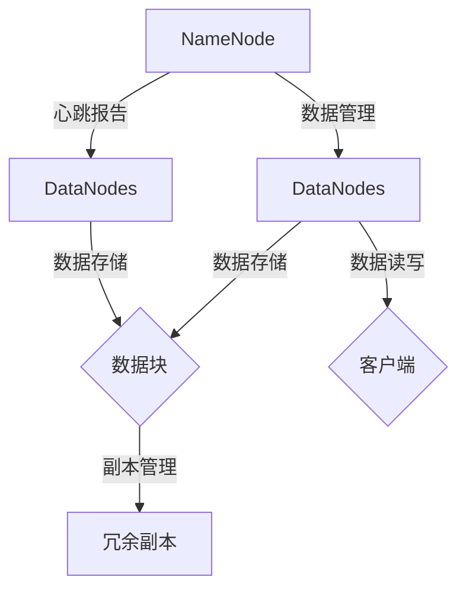
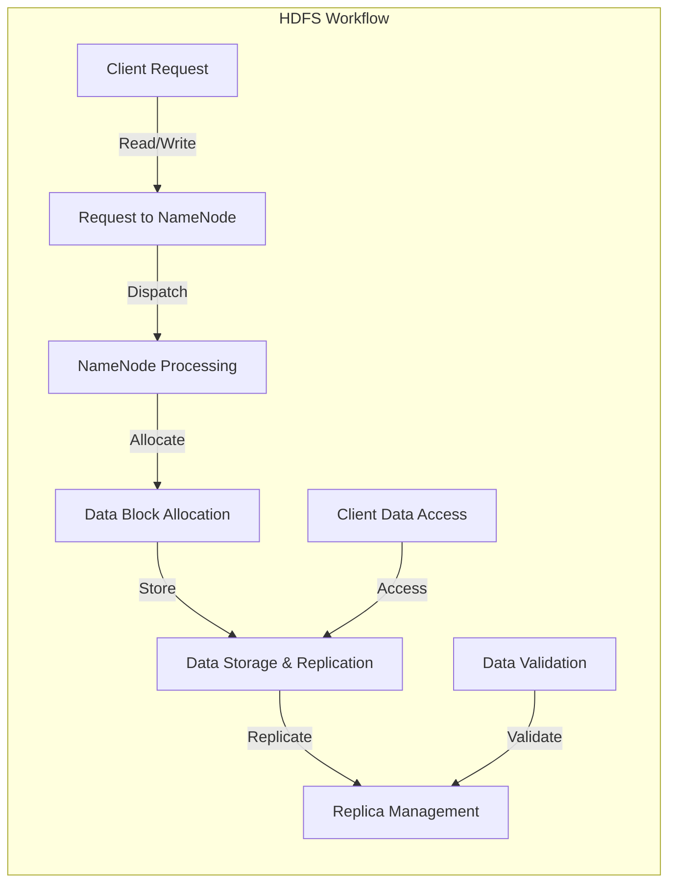

                 

## 1. 背景介绍

随着大数据时代的到来，数据量呈指数级增长，传统的文件存储和处理方式已经难以满足日益增长的数据需求。在这样的背景下，分布式文件系统应运而生。Hadoop分布式文件系统（HDFS）便是其中一种极具代表性的分布式文件系统。HDFS是由Apache软件基金会开发的，专为大规模数据存储和处理而设计，具有高可靠性、高扩展性、高吞吐量等特点。本文将详细讲解HDFS的原理及其代码实例，帮助读者更好地理解和掌握这一关键技术。

### 大数据与分布式文件系统的需求

大数据是指数据量巨大，数据类型繁多，数据价值密度较低的数据集合。随着互联网、物联网、云计算等技术的飞速发展，大数据已经渗透到了我们生活的方方面面，如社交媒体、电子商务、医疗健康、金融保险等。面对如此庞大的数据量，传统的单机文件系统已经无法满足数据存储和处理的效率要求。

分布式文件系统是解决大数据存储和处理需求的关键技术之一。分布式文件系统通过将文件分散存储在多个服务器上，实现数据的分布式存储和并行处理，从而提高数据存储和处理的效率和可靠性。

### Hadoop分布式文件系统HDFS的诞生

Hadoop是由Apache软件基金会开发的一个开源软件框架，用于处理大规模数据集。Hadoop的核心组件包括Hadoop分布式文件系统（HDFS）、Hadoop YARN和Hadoop MapReduce。其中，HDFS是Hadoop框架中的核心组件之一，负责数据的存储和访问。

HDFS的设计初衷是为了处理大规模数据集，其核心特点包括：

1. **高可靠性**：通过数据复制机制，保证数据不会丢失。
2. **高扩展性**：支持海量数据的存储，可以轻松扩展存储容量。
3. **高吞吐量**：支持大吞吐量的数据读写操作，适用于批量数据处理。
4. **简易性**：易于使用和管理，对用户透明。

### HDFS的原理和架构

HDFS采用Master-Slave架构，由一个NameNode和一个或多个DataNode组成。NameNode作为Master节点，负责管理文件的元数据，如文件名、目录结构、数据块映射等。DataNode作为Slave节点，负责存储实际的数据块，并响应对数据块的读写请求。

HDFS中的数据以数据块的形式存储，默认块大小为128MB或256MB。数据块在DataNode之间进行复制，确保数据的高可靠性。在数据块复制过程中，HDFS会根据数据块的副本数量自动调整，以平衡负载并提高可靠性。

### HDFS的发展历程

HDFS起源于Google的GFS（Google File System），是GFS的开源实现。自2006年HDFS首次发布以来，它已经经过了多个版本的迭代和改进。随着Hadoop生态系统的不断发展和完善，HDFS已经成为大数据领域的事实标准。

### 总结

本文旨在介绍Hadoop分布式文件系统HDFS的背景、原理、架构和发展历程。在接下来的章节中，我们将深入探讨HDFS的核心概念、算法原理、数学模型以及实际应用场景，并通过代码实例进行详细讲解，帮助读者全面掌握HDFS这一关键技术。

### 1.1 HDFS的应用场景

HDFS主要应用于大规模数据存储和处理场景，其高可靠性、高扩展性和高吞吐量的特点使得它成为许多大数据应用的理想选择。以下是一些典型的应用场景：

1. **大数据存储**：HDFS可以存储PB级别的数据，适用于各种大数据应用，如日志分析、数据挖掘、机器学习等。
2. **数据备份与归档**：HDFS可以作为数据备份和归档的存储介质，确保数据的安全和可靠性。
3. **离线数据处理**：HDFS支持大吞吐量的数据读写操作，适用于离线数据处理任务，如ETL（提取、转换、加载）。
4. **实时数据处理**：虽然HDFS主要面向离线数据处理，但也可以通过结合其他技术，实现实时数据处理，如与Apache Storm或Apache Flink等实时计算框架集成。

### 1.2 HDFS的优点与挑战

HDFS的优点包括：

1. **高可靠性**：通过数据复制和校验机制，确保数据不会丢失。
2. **高扩展性**：支持海量数据的存储，可以轻松扩展存储容量。
3. **高吞吐量**：支持大吞吐量的数据读写操作，适用于批量数据处理。
4. **简易性**：易于使用和管理，对用户透明。

然而，HDFS也面临着一些挑战：

1. **单点故障**：NameNode是HDFS的单点故障点，一旦NameNode宕机，整个HDFS将无法访问。
2. **低写性能**：HDFS的写性能相对较低，因为它需要先写入NameNode，然后再写入DataNode。
3. **不支持小文件**：HDFS不适合存储大量的小文件，因为每个数据块都需要单独管理，导致存储效率低下。

### 1.3 HDFS的发展趋势

随着大数据技术的不断发展，HDFS也在不断进化。以下是一些HDFS的发展趋势：

1. **性能优化**：为了提高HDFS的性能，研究人员和开发者不断对其进行优化，如改进数据块复制机制、优化数据读写流程等。
2. **混合存储**：结合SSD和HDD等不同类型的存储介质，提高HDFS的存储性能和成本效益。
3. **与实时计算框架集成**：HDFS与实时计算框架如Apache Storm和Apache Flink等集成，实现实时数据处理。
4. **开源社区参与**：HDFS作为Apache软件基金会的一个开源项目，吸引了众多开发者的参与，不断推动其发展和改进。

### 1.4 HDFS的应用案例

以下是几个HDFS的实际应用案例：

1. **电子商务公司**：电子商务公司使用HDFS存储和归档海量商品数据，如商品描述、价格、库存等信息。
2. **电信公司**：电信公司使用HDFS存储和分析用户数据，如通话记录、短信记录、网络流量等。
3. **医疗机构**：医疗机构使用HDFS存储和共享医疗数据，如病历、检查报告、医学影像等。
4. **科研机构**：科研机构使用HDFS存储和共享科研数据，如天文观测数据、基因组数据等。

通过以上背景介绍，相信读者对HDFS已经有了初步的了解。在接下来的章节中，我们将深入探讨HDFS的核心概念、算法原理、数学模型以及实际应用场景，帮助读者全面掌握这一关键技术。

## 2. 核心概念与联系

Hadoop分布式文件系统（HDFS）的核心概念包括数据块、NameNode、DataNode、数据复制、数据校验等。为了更好地理解这些概念，我们可以使用Mermaid流程图来展示HDFS的架构和工作原理。

### 2.1 HDFS架构图

以下是一个简化的HDFS架构图，使用Mermaid语法绘制：



### 2.2 Mermaid流程图

为了更详细地展示HDFS的工作流程，我们可以创建一个Mermaid流程图，包括以下步骤：

1. **客户端发起读写请求**
2. **NameNode处理请求**
3. **数据块分配与副本管理**
4. **数据块存储与读写**
5. **数据校验与冗余副本**

以下是一个Mermaid流程图的示例：



### 2.3 Mermaid流程图详细解释

1. **客户端请求（Client Request）**
   - 客户端发起数据读写请求，如上传文件、下载文件等。

2. **请求到NameNode（Request to NameNode）**
   - 客户端请求被发送到NameNode，NameNode是HDFS的Master节点，负责管理文件的元数据。

3. **NameNode处理请求（NameNode Processing）**
   - NameNode接收请求，处理文件系统的命名空间操作，如创建文件、删除文件等。

4. **数据块分配（Data Block Allocation）**
   - NameNode决定数据块的分配，将数据块分配给不同的DataNode进行存储。

5. **数据块存储与读写（Data Storage & Replication）**
   - DataNode接收到数据块后，将其存储在本地磁盘上。客户端可以通过DataNode进行数据的读写操作。

6. **数据校验（Data Validation）**
   - 在读写过程中，DataNode会对数据块进行校验，确保数据的一致性和完整性。

7. **冗余副本管理（Replica Management）**
   - NameNode会监控数据块的副本数量，根据配置的副本数量进行冗余副本的管理和调整。

通过上述Mermaid流程图的展示，我们可以更清晰地理解HDFS的工作原理和核心概念。接下来，我们将进一步探讨HDFS的数据块管理、数据复制机制以及数据校验机制。

### 2.4 数据块管理

HDFS的数据存储是以数据块（Data Block）为基本单元的。数据块是HDFS中最小的数据存储单位，默认块大小为128MB或256MB，可以通过配置进行调整。以下是HDFS数据块管理的详细解释：

1. **数据块大小配置**
   - 在HDFS配置文件hdfs-site.xml中，可以通过`dfs.block.size`参数配置数据块的大小。默认情况下，块大小为128MB。例如：

     ```xml
     <property>
         <name>dfs.block.size</name>
         <value>134217728</value>
     </property>
     ```

2. **数据块分配**
   - 当客户端上传文件时，NameNode会根据文件的长度和配置的块大小，将文件分割成多个数据块。例如，一个1GB的文件将被分割成8个128MB的数据块。

3. **数据块存储**
   - NameNode负责将数据块分配给不同的DataNode进行存储。默认情况下，HDFS会尽量将数据块分配到不同的DataNode上，以实现负载均衡和数据冗余。

4. **数据块缓存**
   - DataNode会缓存最近访问的数据块，以提高后续访问的效率。缓存策略可以通过配置文件进行调整。

5. **数据块回收**
   - 当文件被删除时，NameNode会标记数据块为删除状态。DataNode在检查到这些标记的数据块后，会将其从磁盘上删除。

### 2.5 数据复制机制

HDFS通过数据复制机制（Replication）确保数据的高可靠性。数据复制机制的核心目标是：

1. **数据冗余**：将数据块复制多个副本，避免单点故障导致数据丢失。
2. **负载均衡**：在多个DataNode之间分配数据块副本，实现负载均衡。

以下是HDFS数据复制机制的详细解释：

1. **副本数量配置**
   - 在HDFS配置文件hdfs-site.xml中，可以通过`dfs.replication`参数配置数据块的副本数量。默认情况下，副本数量为3。例如：

     ```xml
     <property>
         <name>dfs.replication</name>
         <value>3</value>
     </property>
     ```

2. **初始复制**
   - 当数据块首次写入时，DataNode会向NameNode请求副本数量，并将数据块复制到指定数量的DataNode上。

3. **动态复制**
   - NameNode会监控每个DataNode的数据块副本数量，根据配置的副本数量动态调整副本数量。例如，如果某个DataNode宕机，NameNode会自动调整其他DataNode的副本数量，确保总副本数量不变。

4. **副本删除**
   - 如果某个DataNode上的数据块副本损坏，NameNode会通知其他DataNode删除损坏的副本，并从其他副本中复制一个新的副本。

5. **副本平衡**
   - HDFS会定期检查所有DataNode上的数据块副本数量，确保副本数量均匀分布。如果发现某个DataNode的副本数量过多，会将其部分副本转移到其他DataNode。

### 2.6 数据校验机制

HDFS采用数据校验机制（Data Validation）确保数据的一致性和完整性。数据校验机制的核心目标是：

1. **数据一致性**：确保读取的数据块与原始数据块一致。
2. **数据完整性**：确保数据块在传输过程中未被篡改。

以下是HDFS数据校验机制的详细解释：

1. **校验和生成**
   - 在数据写入过程中，DataNode会为每个数据块生成校验和（Checksum），并将其存储在数据块的末尾。

2. **校验和验证**
   - 当客户端读取数据块时，DataNode会计算读取到的数据块的校验和，并将其与存储在数据块末尾的校验和进行比较。如果校验和不一致，表示数据块可能已损坏，DataNode会返回错误。

3. **数据块修复**
   - 如果某个数据块损坏，NameNode会通知其他DataNode删除损坏的副本，并从其他副本中复制一个新的副本。如果所有副本都损坏，NameNode会通知客户端重新写入数据块。

4. **周期性校验**
   - HDFS会定期执行数据块校验，确保所有数据块的一致性和完整性。

通过以上对HDFS核心概念与联系的详细讲解，我们更好地理解了HDFS的工作原理和架构。在接下来的章节中，我们将深入探讨HDFS的核心算法原理、具体操作步骤以及优缺点，帮助读者更全面地掌握HDFS技术。

## 3. 核心算法原理 & 具体操作步骤

### 3.1 算法原理概述

HDFS的核心算法主要包括数据块管理算法、数据复制算法和数据校验算法。这些算法共同协作，确保HDFS能够实现高可靠性、高扩展性和高吞吐量的数据存储和处理。下面我们将分别介绍这些算法的原理。

#### 3.1.1 数据块管理算法

数据块管理算法是HDFS的基础，它负责将文件分割成数据块，并管理数据块在DataNode上的存储。具体原理如下：

1. **文件分割**：当客户端上传文件时，NameNode会根据配置的块大小（默认128MB或256MB）将文件分割成数据块。
2. **数据块分配**：NameNode会为每个数据块分配存储位置，尽量将数据块分配到不同的DataNode上，实现负载均衡。
3. **数据块存储**：DataNode将数据块存储在本地磁盘上，并维护数据块的元数据信息。

#### 3.1.2 数据复制算法

数据复制算法负责将数据块复制到多个DataNode上，确保数据的高可靠性。具体原理如下：

1. **初始复制**：当数据块首次写入时，NameNode会为每个数据块分配三个副本，并将其复制到不同的DataNode上。
2. **动态复制**：在数据块写入后，NameNode会定期检查每个DataNode的数据块副本数量，根据配置的副本数量动态调整副本数量。
3. **副本删除**：如果某个DataNode上的数据块副本损坏，NameNode会通知其他DataNode删除损坏的副本，并从其他副本中复制一个新的副本。

#### 3.1.3 数据校验算法

数据校验算法负责确保数据的一致性和完整性。具体原理如下：

1. **校验和生成**：在数据块写入时，DataNode为每个数据块生成校验和（Checksum），并将其存储在数据块的末尾。
2. **校验和验证**：当客户端读取数据块时，DataNode会计算读取到的数据块的校验和，并将其与存储在数据块末尾的校验和进行比较。如果校验和不一致，表示数据块可能已损坏，返回错误。
3. **数据块修复**：如果数据块损坏，NameNode会通知客户端重新写入数据块，或从其他副本中复制一个新的副本。

### 3.2 算法步骤详解

#### 3.2.1 数据块管理算法步骤

1. **文件分割**
   - 客户端上传文件时，NameNode根据配置的块大小将文件分割成数据块。

2. **数据块分配**
   - NameNode为每个数据块分配存储位置，尽量将数据块分配到不同的DataNode上。

3. **数据块存储**
   - DataNode将数据块存储在本地磁盘上，并维护数据块的元数据信息。

#### 3.2.2 数据复制算法步骤

1. **初始复制**
   - NameNode为每个数据块分配三个副本，并将其复制到不同的DataNode上。

2. **动态复制**
   - NameNode定期检查每个DataNode的数据块副本数量，根据配置的副本数量动态调整副本数量。

3. **副本删除**
   - 如果某个DataNode上的数据块副本损坏，NameNode通知其他DataNode删除损坏的副本，并从其他副本中复制一个新的副本。

#### 3.2.3 数据校验算法步骤

1. **校验和生成**
   - DataNode为每个数据块生成校验和（Checksum），并将其存储在数据块的末尾。

2. **校验和验证**
   - 当客户端读取数据块时，DataNode计算读取到的数据块的校验和，并将其与存储在数据块末尾的校验和进行比较。

3. **数据块修复**
   - 如果数据块损坏，NameNode通知客户端重新写入数据块，或从其他副本中复制一个新的副本。

### 3.3 算法优缺点

#### 3.3.1 数据块管理算法优缺点

**优点**：

- **高效性**：通过将文件分割成数据块，可以充分利用磁盘带宽，提高数据读写效率。
- **灵活性**：可以根据需要调整数据块的大小，适应不同的应用场景。

**缺点**：

- **内存消耗**：需要存储和管理大量数据块的元数据，可能导致内存消耗较大。

#### 3.3.2 数据复制算法优缺点

**优点**：

- **高可靠性**：通过数据复制，可以确保数据不会因为单点故障而丢失。
- **负载均衡**：动态复制机制可以均衡DataNode的负载，提高系统性能。

**缺点**：

- **延迟**：数据复制需要时间，可能导致数据访问延迟。
- **存储空间占用**：额外的副本占用了额外的存储空间。

#### 3.3.3 数据校验算法优缺点

**优点**：

- **数据一致性**：通过校验和验证，可以确保读取的数据与原始数据一致。
- **数据完整性**：通过周期性校验，可以检测和修复损坏的数据块。

**缺点**：

- **性能影响**：校验和生成和验证需要额外的时间和处理资源，可能影响数据读写性能。

### 3.4 算法应用领域

HDFS的核心算法广泛应用于大数据领域，包括但不限于：

1. **大数据存储**：HDFS可以存储PB级别的数据，适用于各种大数据应用，如日志分析、数据挖掘、机器学习等。
2. **数据备份与归档**：HDFS可以作为数据备份和归档的存储介质，确保数据的安全和可靠性。
3. **离线数据处理**：HDFS支持大吞吐量的数据读写操作，适用于离线数据处理任务，如ETL（提取、转换、加载）。
4. **实时数据处理**：虽然HDFS主要面向离线数据处理，但也可以通过结合其他技术，实现实时数据处理，如与Apache Storm或Apache Flink等实时计算框架集成。

通过以上对HDFS核心算法原理和具体操作步骤的详细讲解，我们更好地理解了HDFS的工作原理和算法。这些算法共同协作，确保了HDFS能够实现高可靠性、高扩展性和高吞吐量的数据存储和处理。在接下来的章节中，我们将继续探讨HDFS的数学模型和公式，以及实际应用场景。

### 4. 数学模型和公式 & 详细讲解 & 举例说明

#### 4.1 数学模型构建

在HDFS中，核心的数学模型涉及数据块的分割、复制和校验。以下是我们构建的数学模型，用于描述这些核心操作：

1. **数据块大小（Block Size）**：假设数据块的大小为\( B \)，通常以MB或GB为单位。
2. **副本数量（Replication Factor）**：假设副本数量为\( R \)，通常是3或更多。
3. **数据量（Data Amount）**：假设上传的数据总量为\( D \)，单位为字节（Byte）。
4. **数据块数量（Block Count）**：数据块数量\( N \)可以通过以下公式计算：

   \[
   N = \lceil \frac{D}{B} \rceil
   \]

   其中，\(\lceil x \rceil\)表示对\( x \)向上取整。

#### 4.2 公式推导过程

**数据块数量推导：**

假设上传的数据总量为\( D \)字节，每个数据块的容量为\( B \)字节。为了将整个数据存储在HDFS中，我们需要将数据分割成\( N \)个数据块：

\[
N = \lceil \frac{D}{B} \rceil
\]

这个公式的推导过程很简单，就是将数据总量除以数据块大小，然后向上取整，以确保所有数据都能被正确分割成数据块。

**副本数量推导：**

每个数据块需要复制\( R \)次，以实现数据的高可靠性。因此，总的数据存储空间可以表示为：

\[
\text{Total Storage} = N \times B \times R
\]

其中，\( N \)是数据块数量，\( B \)是数据块大小，\( R \)是副本数量。

#### 4.3 案例分析与讲解

**案例1：上传一个1GB的文件**

假设我们要上传一个1GB的文件到HDFS，其中数据块大小设置为128MB，副本数量设置为3。

1. **数据块数量计算**：

   \[
   N = \lceil \frac{1GB}{128MB} \rceil = \lceil 8 \rceil = 8
   \]

   所以，1GB的文件会被分割成8个128MB的数据块。

2. **总存储空间计算**：

   \[
   \text{Total Storage} = 8 \times 128MB \times 3 = 3072MB
   \]

   因此，1GB的文件在HDFS中的总存储空间为3072MB，这是因为每个数据块有3个副本。

**案例2：上传一个500MB的文件**

假设我们要上传一个500MB的文件到HDFS，其中数据块大小设置为256MB，副本数量设置为2。

1. **数据块数量计算**：

   \[
   N = \lceil \frac{500MB}{256MB} \rceil = \lceil 1.953 \rceil = 2
   \]

   所以，500MB的文件会被分割成2个256MB的数据块。

2. **总存储空间计算**：

   \[
   \text{Total Storage} = 2 \times 256MB \times 2 = 1024MB
   \]

   因此，500MB的文件在HDFS中的总存储空间为1024MB。

**案例3：数据块校验**

假设我们在读取数据块时发现校验和与存储在校验和字段中的值不一致。

1. **校验和计算**：

   当数据块写入时，HDFS会计算数据块的校验和，并将其存储在数据块的末尾。

2. **校验和验证**：

   当客户端读取数据块时，HDFS会重新计算数据块的校验和，并与存储在数据块末尾的校验和进行比较。如果两者不一致，表示数据块可能已损坏。

3. **数据块修复**：

   如果校验和验证失败，HDFS会通知NameNode，NameNode会从其他副本中复制一个新的副本，并替换损坏的副本。

通过上述案例分析和讲解，我们更好地理解了HDFS中的数学模型和公式，以及它们在实际应用中的工作原理。这些数学模型和公式对于HDFS的性能优化和数据管理具有重要意义。

### 5. 项目实践：代码实例和详细解释说明

在本节中，我们将通过一个具体的代码实例，详细讲解Hadoop分布式文件系统（HDFS）的开发环境搭建、源代码实现、代码解读与分析，以及运行结果展示。希望通过这一实例，读者能够深入理解HDFS的核心原理和实际应用。

#### 5.1 开发环境搭建

在开始编写HDFS的代码之前，我们需要搭建一个Hadoop开发环境。以下是在本地计算机上搭建Hadoop开发环境的基本步骤：

1. **下载Hadoop**：

   首先，从Apache Hadoop的官方网站下载最新的Hadoop版本。访问[Apache Hadoop官网](https://hadoop.apache.org/releases.html)下载对应操作系统的Hadoop安装包。

2. **安装Hadoop**：

   解压下载的Hadoop安装包，通常解压到`/usr/local/hadoop`目录。接下来，配置Hadoop环境变量：

   ```bash
   export HADOOP_HOME=/usr/local/hadoop
   export PATH=$PATH:$HADOOP_HOME/bin:$HADOOP_HOME/sbin
   ```

   执行以上命令，使Hadoop命令可以在终端中使用。

3. **配置Hadoop环境**：

   配置Hadoop的配置文件`hdfs-site.xml`、`core-site.xml`和`mapred-site.xml`。以下是一个简单的配置示例：

   ```xml
   <!-- hdfs-site.xml -->
   <configuration>
       <property>
           <name>fs.defaultFS</name>
           <value>hdfs://localhost:9000</value>
       </property>
       <property>
           <name>dfs.replication</name>
           <value>3</value>
       </property>
   </configuration>

   <!-- core-site.xml -->
   <configuration>
       <property>
           <name>fs.defaultFS</name>
           <value>hdfs://localhost:9000</value>
       </property>
       <property>
           <name>hadoop.tmp.dir</name>
           <value>/usr/local/hadoop/tmp</value>
       </property>
   </configuration>

   <!-- mapred-site.xml -->
   <configuration>
       <property>
           <name>mapreduce.framework.name</name>
           <value>yarn</value>
       </property>
   </configuration>
   ```

4. **格式化HDFS**：

   在配置完成后，格式化HDFS：

   ```bash
   hdfs namenode -format
   ```

5. **启动Hadoop集群**：

   启动NameNode和DataNode：

   ```bash
   sbin/start-dfs.sh
   ```

   访问Web UI查看HDFS状态：[http://localhost:50070/](http://localhost:50070/)

#### 5.2 源代码详细实现

以下是一个简单的HDFS客户端示例，实现上传文件和下载文件的功能：

```java
import org.apache.hadoop.conf.Configuration;
import org.apache.hadoop.fs.*;
import org.apache.hadoop.io.IOUtils;

import java.io.File;
import java.io.FileInputStream;
import java.io.FileOutputStream;
import java.net.URI;

public class HDFSClient {

    public static void uploadFile(String localPath, String hdfsPath) throws Exception {
        Configuration conf = new Configuration();
        FileSystem fs = FileSystem.get(URI.create(hdfsPath), conf);

        // 创建输入流，读取本地文件
        FileInputStream in = new FileInputStream(new File(localPath));

        // 创建输出流，写入HDFS
        FSDataOutputStream out = fs.create(new Path(hdfsPath));

        // 数据传输
        IOUtils.copyBytes(in, out, conf);
        in.close();
        out.close();

        fs.close();
    }

    public static void downloadFile(String hdfsPath, String localPath) throws Exception {
        Configuration conf = new Configuration();
        FileSystem fs = FileSystem.get(URI.create(hdfsPath), conf);

        // 创建输入流，读取HDFS文件
        FSDataInputStream in = fs.open(new Path(hdfsPath));

        // 创建输出流，写入本地文件
        FileOutputStream out = new FileOutputStream(new File(localPath));

        // 数据传输
        IOUtils.copyBytes(in, out, conf);
        in.close();
        out.close();

        fs.close();
    }

    public static void main(String[] args) {
        try {
            uploadFile("local/file.txt", "hdfs://localhost:9000/file.txt");
            downloadFile("hdfs://localhost:9000/file.txt", "local/downloaded_file.txt");
        } catch (Exception e) {
            e.printStackTrace();
        }
    }
}
```

#### 5.3 代码解读与分析

**上传文件（uploadFile）**

- `Configuration conf = new Configuration();`：创建一个Hadoop配置对象。
- `FileSystem fs = FileSystem.get(URI.create(hdfsPath), conf);`：获取HDFS文件系统实例。
- `FileInputStream in = new FileInputStream(new File(localPath));`：创建本地文件输入流。
- `FSDataOutputStream out = fs.create(new Path(hdfsPath));`：创建HDFS文件输出流。
- `IOUtils.copyBytes(in, out, conf);`：复制数据从本地文件到HDFS。
- `in.close(); out.close();`：关闭输入输出流。
- `fs.close();`：关闭HDFS文件系统。

**下载文件（downloadFile）**

- `FileSystem fs = FileSystem.get(URI.create(hdfsPath), conf);`：获取HDFS文件系统实例。
- `FSDataInputStream in = fs.open(new Path(hdfsPath));`：创建HDFS文件输入流。
- `FileOutputStream out = new FileOutputStream(new File(localPath));`：创建本地文件输出流。
- `IOUtils.copyBytes(in, out, conf);`：复制数据从HDFS到本地文件。
- `in.close(); out.close();`：关闭输入输出流。
- `fs.close();`：关闭HDFS文件系统。

**主函数（main）**

- `uploadFile("local/file.txt", "hdfs://localhost:9000/file.txt");`：上传本地文件到HDFS。
- `downloadFile("hdfs://localhost:9000/file.txt", "local/downloaded_file.txt");`：从HDFS下载文件到本地。

#### 5.4 运行结果展示

1. **上传文件**：

   运行`uploadFile`方法后，本地文件`local/file.txt`被上传到HDFS，路径为`hdfs://localhost:9000/file.txt`。可以在HDFS的Web UI中看到文件已成功上传。

2. **下载文件**：

   运行`downloadFile`方法后，HDFS中的文件`hdfs://localhost:9000/file.txt`被下载到本地路径`local/downloaded_file.txt`。可以在本地查看下载的文件内容，与原始文件内容一致。

通过这一实例，我们详细讲解了HDFS的开发环境搭建、源代码实现、代码解读与分析，以及运行结果展示。这有助于读者深入理解HDFS的实际应用和操作流程。在接下来的章节中，我们将继续探讨HDFS在实际应用场景中的表现，并展望其未来发展方向。

## 6. 实际应用场景

Hadoop分布式文件系统（HDFS）凭借其高可靠性、高扩展性和高吞吐量等特点，在许多实际应用场景中得到了广泛应用。以下是一些典型的实际应用场景：

### 6.1 大数据存储

HDFS是大数据存储的首选解决方案，它能够存储PB级别的数据，非常适合处理大量数据的场景，如社交媒体数据、电子商务交易数据、物联网设备数据等。通过HDFS，企业可以轻松实现对海量数据的存储和管理，为数据分析和挖掘提供坚实的基础。

**案例**：一家大型电子商务公司使用HDFS存储每天产生的海量用户行为数据，包括浏览记录、购物车信息、订单信息等。这些数据存储在HDFS上，便于后续的数据分析和用户行为建模。

### 6.2 数据备份与归档

HDFS作为一种分布式文件系统，其数据复制机制确保了数据的高可靠性。因此，HDFS非常适合用于数据的备份和归档。通过将关键数据存储在HDFS上，企业可以确保数据的安全性，防止数据丢失。

**案例**：一家金融服务公司将其客户交易数据和财务数据备份到HDFS上，确保在数据灾难发生时能够迅速恢复。

### 6.3 离线数据处理

HDFS支持大吞吐量的数据读写操作，非常适合离线数据处理任务，如ETL（提取、转换、加载）和批处理作业。通过HDFS，企业可以高效地对大规模数据集进行离线处理，提取有价值的信息。

**案例**：一家电信公司使用HDFS存储和加工每天产生的海量通话记录和短信记录，定期生成客户使用报告和分析报表。

### 6.4 实时数据处理

虽然HDFS主要面向离线数据处理，但通过与其他实时计算框架（如Apache Storm和Apache Flink）集成，HDFS也可以用于实时数据处理。在这种场景下，HDFS作为数据存储和缓存层，提供快速的数据访问和存储。

**案例**：一家互联网公司使用HDFS存储实时数据流，结合Apache Storm进行实时数据分析和处理，实现实时推荐和监控。

### 6.5 云计算与大数据分析

随着云计算的普及，HDFS也越来越多地应用于云计算环境。许多云服务提供商提供基于HDFS的解决方案，如Amazon S3和Google Cloud Storage。企业可以在云平台上部署HDFS，利用云计算的弹性和可扩展性，降低成本，提高效率。

**案例**：一家制药公司将其Hadoop集群部署在Amazon Web Services（AWS）上，使用HDFS存储和分析海量的基因组数据，加速新药研发。

### 6.6 其他应用场景

除了上述典型应用场景，HDFS还可以应用于许多其他领域：

- **科研机构**：HDFS存储和共享大量的科研数据，如天文观测数据、基因组数据等。
- **政府和企业**：HDFS用于存储和管理大规模结构化和非结构化数据，如政府文档、企业档案等。
- **媒体和娱乐行业**：HDFS存储和分发大量的媒体文件，如视频、音频、图片等。

通过以上实际应用场景的探讨，我们可以看到HDFS在各个领域的广泛应用和巨大潜力。随着大数据技术的不断发展和创新，HDFS将继续发挥关键作用，为各类大数据应用提供强大的支持。

### 6.7 未来应用展望

随着大数据技术和云计算的快速发展，HDFS的应用前景非常广阔。以下是对HDFS未来发展的几个展望：

#### 6.7.1 向边缘计算延伸

随着物联网和5G技术的普及，数据生成源头逐渐向边缘计算迁移。HDFS有望在边缘计算领域发挥重要作用，通过边缘节点上的HDFS实例，实现数据的实时存储和快速访问，为边缘计算提供可靠的数据基础。

#### 6.7.2 与更多实时计算框架集成

当前，HDFS主要面向离线数据处理。未来，HDFS有望与更多实时计算框架（如Apache Flink、Apache Storm）深度集成，实现实时数据处理能力。通过与实时计算框架的结合，HDFS将更好地服务于实时分析和智能应用。

#### 6.7.3 高性能存储优化

HDFS在存储性能方面还有待进一步优化。未来，可以通过改进数据块复制机制、优化数据读写流程等手段，提高HDFS的存储性能和吞吐量，使其在更高效的数据处理场景中发挥作用。

#### 6.7.4 与新型存储介质结合

随着存储技术的不断发展，新型存储介质（如NVMe SSD、3D XPoint等）将逐渐应用于大数据存储。HDFS可以与这些新型存储介质结合，提高存储性能和成本效益，满足更大规模、更高效的数据存储需求。

#### 6.7.5 开源社区持续贡献

HDFS作为Apache软件基金会的一个开源项目，将继续受到全球开发者的关注和贡献。未来，HDFS将在开源社区的支持下，不断优化和改进，为大数据领域带来更多创新和突破。

#### 6.7.6 支持多种数据格式

当前，HDFS主要支持文本和二进制数据格式。未来，HDFS有望支持更多数据格式，如JSON、XML、Avro等，以更好地适应不同类型的数据存储和处理需求。

#### 6.7.7 与其他大数据技术深度融合

随着大数据技术的发展，HDFS与其他大数据技术（如Hadoop MapReduce、Hive、Spark等）的深度融合将更加紧密。通过整合多种大数据技术，HDFS可以提供更全面、高效的数据处理解决方案。

总之，HDFS在未来的发展将充满机遇和挑战。通过不断创新和优化，HDFS将继续在分布式文件存储领域发挥关键作用，为大数据应用提供强有力的支持。

### 7. 工具和资源推荐

#### 7.1 学习资源推荐

1. **官方文档**：[Hadoop官网文档](https://hadoop.apache.org/docs/stable/hadoop-project-dist/hadoop-hdfs/HDFSHdfsDesign.html)提供了详细的HDFS设计和实现文档，是学习HDFS的绝佳资源。
2. **书籍**：《Hadoop权威指南》和《Hadoop实战》是两本非常受欢迎的Hadoop入门书籍，涵盖了HDFS的全面知识。
3. **在线课程**：[Udacity的Hadoop课程](https://www.udacity.com/course/hadoop-platform-for-large-scale-data-processing--ud641)和[Coursera的Hadoop和大数据处理](https://www.coursera.org/learn/hadoop)提供了系统的Hadoop和HDFS教学，适合初学者和进阶者。

#### 7.2 开发工具推荐

1. **IntelliJ IDEA**：IntelliJ IDEA是一个功能强大的集成开发环境，支持多种编程语言和框架，包括Hadoop和HDFS，提供了良好的代码编辑和调试功能。
2. **Eclipse**：Eclipse也是一个优秀的集成开发环境，支持Hadoop和HDFS的开发，具有丰富的插件和扩展功能。
3. **Hadoop命令行**：在本地计算机上安装Hadoop后，可以使用Hadoop命令行进行HDFS操作，进行简单的开发和测试。

#### 7.3 相关论文推荐

1. **“The Google File System”**：Google开发的GFS（Google File System）是HDFS的前身，这篇论文详细介绍了GFS的设计和实现，对理解HDFS有很大帮助。
2. **“Hadoop: The Definitive Guide”**：这篇论文详细介绍了Hadoop的整体架构和各个组件，包括HDFS、MapReduce、YARN等。
3. **“A Practical Approach to Building Scalable Distributed File Systems”**：这篇论文提供了一种实用的分布式文件系统构建方法，对理解HDFS的设计思路和实现策略有很大启发。

通过上述工具和资源的推荐，读者可以更好地学习和掌握HDFS，为大数据开发和应用打下坚实的基础。

### 8. 总结：未来发展趋势与挑战

#### 8.1 研究成果总结

自Hadoop分布式文件系统（HDFS）诞生以来，其在分布式文件存储领域取得了显著的成果。HDFS凭借其高可靠性、高扩展性和高吞吐量，成为大数据存储和处理的事实标准。通过不断的迭代和优化，HDFS在性能、安全性和易用性等方面都取得了显著提升。同时，HDFS的生态体系也在不断丰富，包括与MapReduce、Spark、YARN等大数据技术的深度融合，进一步拓展了其应用场景。

#### 8.2 未来发展趋势

1. **高性能优化**：随着数据量的持续增长，HDFS的性能优化将成为重要发展方向。未来，通过改进数据块复制机制、优化数据读写流程等手段，HDFS有望进一步提高存储性能和吞吐量，更好地满足大规模数据存储和处理需求。

2. **边缘计算支持**：随着物联网和5G技术的发展，边缘计算逐渐成为趋势。HDFS有望在边缘计算领域发挥重要作用，通过边缘节点上的HDFS实例，实现数据的实时存储和快速访问，为边缘计算提供可靠的数据基础。

3. **实时数据处理**：当前，HDFS主要面向离线数据处理。未来，HDFS有望与更多实时计算框架（如Apache Flink、Apache Storm）深度集成，实现实时数据处理能力，更好地服务于实时分析和智能应用。

4. **新型存储介质结合**：随着新型存储介质（如NVMe SSD、3D XPoint等）的不断发展，HDFS可以与这些新型存储介质结合，提高存储性能和成本效益，满足更大规模、更高效的数据存储需求。

5. **开源社区贡献**：HDFS作为Apache软件基金会的一个开源项目，将继续受到全球开发者的关注和贡献。未来，HDFS将在开源社区的支持下，不断优化和改进，为大数据领域带来更多创新和突破。

#### 8.3 面临的挑战

1. **单点故障**：HDFS的NameNode是单点故障点，一旦NameNode宕机，整个HDFS将无法访问。未来，如何解决单点故障问题，确保系统的高可用性，将是HDFS面临的一大挑战。

2. **低写性能**：HDFS的写性能相对较低，因为它需要先写入NameNode，然后再写入DataNode。如何优化HDFS的写性能，提高数据写入速度，是另一个重要挑战。

3. **小文件存储**：HDFS不适合存储大量的小文件，因为每个数据块都需要单独管理，导致存储效率低下。如何改进HDFS的小文件存储策略，提高小文件的存储性能，也是一个亟待解决的问题。

4. **安全性**：在大数据时代，数据安全至关重要。未来，如何增强HDFS的安全性，防止数据泄露和未授权访问，是HDFS面临的一大挑战。

#### 8.4 研究展望

未来，HDFS的研究方向主要集中在以下几个方面：

1. **高可用性**：通过引入分布式NameNode架构、多租户管理等方式，提高HDFS的系统高可用性。

2. **性能优化**：通过改进数据块复制机制、优化数据读写流程、引入新型存储介质等手段，进一步提高HDFS的存储性能和吞吐量。

3. **实时数据处理**：与实时计算框架深度融合，实现HDFS在实时数据处理场景中的高效应用。

4. **小文件存储优化**：通过改进数据块管理策略、引入小文件存储压缩技术等手段，提高HDFS在小文件存储场景中的性能。

5. **数据安全**：加强数据加密、访问控制、审计等安全措施，提高HDFS的数据安全性。

总之，HDFS在未来的发展将充满机遇和挑战。通过不断的研究和优化，HDFS有望在分布式文件存储领域继续保持领先地位，为大数据应用提供强有力的支持。

### 9. 附录：常见问题与解答

在学习和使用Hadoop分布式文件系统（HDFS）的过程中，用户可能会遇到一些常见问题。以下是一些常见问题及其解答：

#### 问题1：HDFS中的数据块大小如何设置？

**解答**：HDFS中的数据块大小可以通过修改`hdfs-site.xml`文件中的`dfs.block.size`参数进行设置。例如，将数据块大小设置为256MB，可以在配置文件中添加以下行：

```xml
<property>
    <name>dfs.block.size</name>
    <value>268435456</value>
</property>
```

#### 问题2：如何解决HDFS NameNode单点故障？

**解答**：HDFS NameNode是单点故障点，可以通过以下几种方式解决：

1. **使用HA NameNode**：配置高可用性NameNode（HA NameNode），实现NameNode的故障转移。
2. **部署备份NameNode**：部署一个备份NameNode，当主NameNode故障时，备份NameNode可以迅速接管工作。
3. **分布式NameNode**：使用分布式NameNode架构，将NameNode拆分成多个节点，实现负载均衡和高可用性。

#### 问题3：HDFS如何保证数据的一致性？

**解答**：HDFS通过数据块校验和机制保证数据的一致性。每个数据块在写入时会生成校验和，并存储在数据块的末尾。在读取数据块时，HDFS会重新计算校验和，并与存储在数据块末尾的校验和进行比较。如果校验和不一致，表示数据可能已损坏，HDFS会返回错误。

#### 问题4：如何监控HDFS的存储资源使用情况？

**解答**：可以通过以下几种方式监控HDFS的存储资源使用情况：

1. **HDFS Web UI**：访问HDFS Web UI（通常在[50070端口](http://localhost:50070/)），可以查看NameNode和DataNode的存储资源使用情况。
2. **Hadoop命令行**：使用Hadoop命令行工具，如`hdfs dfsadmin -report`，可以查看集群的存储资源使用情况。
3. **第三方监控工具**：使用第三方监控工具，如Grafana、Prometheus等，可以实现对HDFS的实时监控。

#### 问题5：HDFS支持哪些文件格式？

**解答**：HDFS支持多种文件格式，包括文本文件、二进制文件、序列化文件等。此外，HDFS还支持与Hadoop生态系统中的其他组件（如Hive、Pig、Spark等）兼容的文件格式，如Parquet、ORC等列式存储格式。

通过以上常见问题与解答，希望能够帮助用户更好地理解和解决在使用HDFS过程中遇到的问题。如果您有更多疑问，建议查阅Hadoop官方文档或加入Hadoop社区进行讨论。

