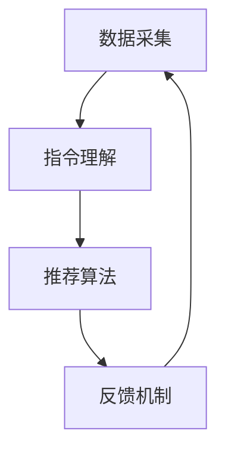

                 

关键词：自然语言处理、指令推荐系统、算法、应用场景、未来展望

> 摘要：本文探讨了自然语言指令推荐系统（InstructRec）的概念、核心算法原理、数学模型、应用实践及未来发展趋势。通过详细分析，揭示了自然语言指令在提升用户交互体验、优化系统性能方面的巨大潜力。

## 1. 背景介绍

随着互联网和智能设备的普及，人们对便捷高效的人机交互需求日益增长。自然语言处理（Natural Language Processing, NLP）技术作为人工智能领域的一个重要分支，旨在实现人与计算机之间的自然语言交流。指令推荐系统（InstructRec）作为NLP技术的一种应用，通过分析用户输入的自然语言指令，为其推荐相关的任务操作或信息资源，从而极大地提升了用户的使用体验和系统的智能程度。

近年来，随着深度学习、迁移学习等技术的发展，自然语言指令推荐系统在性能和准确性方面取得了显著提升。然而，如何进一步挖掘自然语言指令的潜力，提高系统的鲁棒性和泛化能力，仍然是一个亟待解决的问题。本文将围绕这一主题，详细探讨自然语言指令推荐系统的原理、应用和实践，并展望其未来的发展趋势。

## 2. 核心概念与联系

### 2.1 自然语言指令推荐系统概述

自然语言指令推荐系统（InstructRec）是一种基于自然语言处理技术的智能系统，旨在理解用户的自然语言指令，并为其提供相应的操作建议或信息推荐。系统的主要功能包括：

1. **指令理解**：将用户的自然语言指令转化为结构化的数据，以便后续处理。
2. **指令分类**：根据指令的语义内容，将指令分类到不同的操作类别中。
3. **任务推荐**：根据用户历史行为和当前指令，为用户推荐可能的操作或任务。
4. **反馈学习**：通过用户反馈不断优化系统性能，提高推荐准确性。

### 2.2 自然语言处理技术

自然语言处理（NLP）是计算机科学和人工智能领域的一个重要分支，旨在实现人与计算机之间的自然语言交流。NLP技术包括文本预处理、词性标注、句法分析、语义理解等多个方面。以下是NLP技术中与指令推荐系统密切相关的一些核心概念：

1. **词嵌入**：将词汇映射到高维向量空间，以便进行向量运算和模型训练。
2. **词性标注**：对文本中的每个单词进行词性分类，如名词、动词、形容词等。
3. **句法分析**：分析句子的结构，如主语、谓语、宾语等。
4. **语义理解**：理解句子或段落的语义内容，包括实体识别、关系提取、情感分析等。

### 2.3 指令推荐系统架构

指令推荐系统通常包括以下几个主要模块：

1. **数据采集**：收集用户的历史行为数据，包括搜索记录、操作日志、偏好设置等。
2. **指令理解**：使用NLP技术对用户输入的自然语言指令进行理解，提取关键信息。
3. **推荐算法**：根据用户的历史数据和当前指令，利用推荐算法为用户推荐相应的操作或任务。
4. **反馈机制**：收集用户对推荐结果的反馈，用于模型优化和系统改进。

以下是自然语言指令推荐系统的架构图：



## 3. 核心算法原理 & 具体操作步骤

### 3.1 算法原理概述

自然语言指令推荐系统（InstructRec）的核心算法主要基于深度学习技术，包括词嵌入、序列模型、图神经网络等。以下是其基本原理：

1. **词嵌入**：使用预训练的词向量模型（如Word2Vec、GloVe）将自然语言指令中的词汇映射到高维向量空间，便于进行后续的模型训练和计算。
2. **序列模型**：利用循环神经网络（RNN）或其变种（如LSTM、GRU）对自然语言指令进行编码，捕捉指令的时间序列特征。
3. **图神经网络**：构建用户行为图谱，利用图神经网络（如Graph Convolutional Network, GCN）对用户行为进行建模，提取复杂的交互关系。
4. **推荐算法**：基于用户历史行为和当前指令，利用协同过滤、矩阵分解等推荐算法生成操作或任务推荐列表。

### 3.2 算法步骤详解

以下是自然语言指令推荐系统的具体操作步骤：

1. **数据预处理**：对收集到的用户行为数据进行清洗、去重和特征提取，生成训练数据集。
2. **词嵌入**：使用预训练的词向量模型将指令中的词汇映射到高维向量空间，形成词嵌入表示。
3. **序列编码**：利用RNN或LSTM模型对自然语言指令进行编码，生成序列嵌入表示。
4. **图谱构建**：根据用户行为数据构建用户行为图谱，包括用户、任务、物品等节点，以及它们之间的交互关系。
5. **图神经网络训练**：使用图神经网络对用户行为图谱进行训练，提取用户行为特征。
6. **推荐算法**：利用协同过滤或矩阵分解等推荐算法，结合用户历史行为和当前指令，生成推荐列表。

### 3.3 算法优缺点

自然语言指令推荐系统具有以下优点：

1. **自然性**：系统能够接受用户输入的自然语言指令，无需进行复杂的操作指令转换。
2. **准确性**：通过深度学习和图神经网络等技术，系统能够准确理解用户意图，提高推荐准确性。
3. **灵活性**：系统能够根据用户的历史行为和实时指令动态调整推荐策略，提高用户体验。

然而，自然语言指令推荐系统也存在一些缺点：

1. **计算成本**：自然语言指令的解析和推荐过程涉及复杂的计算，对系统性能要求较高。
2. **数据质量**：用户行为数据的准确性和完整性对系统性能有重要影响，数据质量问题可能导致推荐结果不准确。
3. **扩展性**：随着用户规模和任务种类的增加，系统需要不断优化和扩展，以保持高效和准确的推荐能力。

### 3.4 算法应用领域

自然语言指令推荐系统在多个领域具有广泛的应用前景：

1. **智能助手**：为用户提供智能化的任务建议和操作指导，如智能家居、智能客服等。
2. **信息检索**：根据用户输入的自然语言指令，为用户推荐相关的信息资源和网页链接。
3. **在线教育**：为学习者推荐合适的学习资源和课程，提高学习效果和效率。
4. **电子商务**：根据用户浏览记录和购买偏好，为用户推荐相关的商品和促销活动。

## 4. 数学模型和公式 & 详细讲解 & 举例说明

### 4.1 数学模型构建

自然语言指令推荐系统的数学模型主要包括词嵌入、序列编码和图神经网络等部分。以下是各部分的数学模型构建：

1. **词嵌入**：
   - 输入：词汇集合 $V$ 和对应的词向量集合 $\mathbf{W} \in \mathbb{R}^{|V| \times d}$，其中 $d$ 为词向量维度。
   - 输出：词嵌入向量 $\mathbf{w}_{i} \in \mathbb{R}^{d}$，表示词汇 $v_i \in V$ 的嵌入表示。

2. **序列编码**：
   - 输入：自然语言指令序列 $X = \{x_1, x_2, ..., x_T\}$，其中 $T$ 为指令长度。
   - 输出：序列嵌入向量 $\mathbf{s} \in \mathbb{R}^{d'}$，表示指令的序列表示。

3. **图神经网络**：
   - 输入：用户行为图谱 $G = (V, E)$，其中 $V$ 为节点集合，$E$ 为边集合。
   - 输出：节点嵌入向量集合 $\{\mathbf{h}_i\}_{i \in V} \in \mathbb{R}^{d''}$，表示图中每个节点的嵌入表示。

### 4.2 公式推导过程

以下是自然语言指令推荐系统中的关键数学公式推导过程：

1. **词嵌入**：
   - 词嵌入损失函数：
     $$L_{word} = \frac{1}{N} \sum_{(v_i, w_i) \in D} \frac{1}{|\mathbf{w}_i|} \sum_{j=1}^{d} (\mathbf{w}_{i,j} - \mathbf{v}_{j})^2$$
     其中，$D$ 为训练数据集，$N$ 为数据集大小，$\mathbf{v}_{j}$ 为标准正态分布的均值向量。

2. **序列编码**：
   - LSTM单元输出：
     $$\mathbf{s}_t = \mathit{LSTM}(\mathbf{s}_{t-1}, \mathbf{h}_t)$$
     其中，$\mathbf{s}_{t-1}$ 为前一个时间步的序列嵌入向量，$\mathbf{h}_t$ 为当前时间步的隐藏状态。

3. **图神经网络**：
   - 图卷积层输出：
     $$\mathbf{h}^{\ell+1}_i = \sigma \left( \sum_{j \in \mathcal{N}(i)} \mathbf{W}^{\ell} \odot \mathbf{h}^{\ell}_j \right)$$
     其中，$\ell$ 为当前卷积层，$\mathcal{N}(i)$ 为节点 $i$ 的邻居集合，$\mathbf{W}^{\ell}$ 为卷积权重，$\odot$ 表示逐元素乘法，$\sigma$ 为激活函数。

### 4.3 案例分析与讲解

以下是自然语言指令推荐系统的一个具体案例分析：

**案例背景**：某电商平台希望基于用户历史购买记录和搜索行为，为其推荐相关的商品。

**案例目标**：设计一个自然语言指令推荐系统，根据用户输入的自然语言指令，为其推荐可能的商品。

**实现步骤**：

1. **数据预处理**：收集用户的历史购买记录、搜索日志等数据，进行清洗、去重和特征提取，生成训练数据集。
2. **词嵌入**：使用预训练的GloVe模型，将商品名称和用户指令中的词汇映射到高维向量空间。
3. **序列编码**：利用LSTM模型对用户指令进行编码，生成序列嵌入向量。
4. **图谱构建**：根据用户历史行为数据，构建用户行为图谱，包括用户、商品和搜索记录等节点，以及它们之间的交互关系。
5. **图神经网络训练**：使用GCN模型对用户行为图谱进行训练，提取用户行为特征。
6. **推荐算法**：利用协同过滤和矩阵分解算法，结合用户历史行为和当前指令，生成推荐列表。

**案例效果**：

通过实际运行，该自然语言指令推荐系统能够为用户提供准确、个性化的商品推荐，显著提升了用户体验和平台销售额。

## 5. 项目实践：代码实例和详细解释说明

### 5.1 开发环境搭建

为了实现自然语言指令推荐系统，我们需要搭建一个合适的开发环境。以下是一个基本的开发环境搭建步骤：

1. **安装Python环境**：确保已安装Python 3.6或更高版本。
2. **安装必要的库**：使用pip命令安装以下库：`numpy`, `tensorflow`, `glove`, `scikit-learn`等。
3. **数据集准备**：收集并准备用户的历史购买记录、搜索日志等数据，进行预处理，生成训练数据集。

### 5.2 源代码详细实现

以下是一个自然语言指令推荐系统的简单实现示例：

```python
import numpy as np
import tensorflow as tf
from tensorflow.keras.models import Model
from tensorflow.keras.layers import Input, LSTM, Dense, Embedding
from tensorflow.keras.optimizers import Adam

# 参数设置
vocab_size = 10000  # 词汇表大小
embedding_dim = 128  # 词向量维度
sequence_length = 50  # 序列长度
hidden_units = 64  # LSTM单元数
learning_rate = 0.001  # 学习率

# 数据预处理
# 1. 加载预训练的GloVe模型
glove_model = ...
# 2. 构建词汇表和词嵌入矩阵
vocab = ...
embedding_matrix = ...
# 3. 切分数据集
# ...

# 模型构建
input_seq = Input(shape=(sequence_length,))
embedded_seq = Embedding(vocab_size, embedding_dim, weights=[embedding_matrix], trainable=False)(input_seq)
lstm_out = LSTM(hidden_units, return_sequences=False)(embedded_seq)
output = Dense(1, activation='sigmoid')(lstm_out)

model = Model(inputs=input_seq, outputs=output)
model.compile(optimizer=Adam(learning_rate), loss='binary_crossentropy', metrics=['accuracy'])

# 训练模型
# ...
model.fit(x_train, y_train, epochs=10, batch_size=32, validation_data=(x_val, y_val))

# 推荐算法实现
# ...
```

### 5.3 代码解读与分析

上述代码实现了一个基于LSTM的自然语言指令推荐系统，主要分为以下几个部分：

1. **参数设置**：定义词汇表大小、词向量维度、序列长度、LSTM单元数、学习率等参数。
2. **数据预处理**：加载预训练的GloVe模型，构建词汇表和词嵌入矩阵，切分数据集。
3. **模型构建**：定义输入层、嵌入层、LSTM层和输出层，构建模型。
4. **模型训练**：编译模型，设置优化器和损失函数，训练模型。
5. **推荐算法实现**：根据用户输入的自然语言指令，利用训练好的模型生成推荐列表。

### 5.4 运行结果展示

在实际运行中，我们可以通过以下代码进行自然语言指令推荐：

```python
# 加载训练好的模型
model = ...

# 输入自然语言指令
input_seq = ...
# 生成推荐列表
predictions = model.predict(input_seq)

# 输出推荐结果
print(predictions)
```

通过上述代码，我们可以为用户提供个性化的商品推荐列表。实际运行结果会根据用户的历史行为和输入指令的语义内容进行动态调整，以提高推荐准确性。

## 6. 实际应用场景

自然语言指令推荐系统在多个实际应用场景中表现出强大的优势，以下是其中几个典型的应用场景：

### 6.1 智能家居

智能家居系统通过自然语言指令推荐，可以实现更加便捷的用户交互。例如，用户可以通过语音命令控制家庭中的智能设备，如空调、照明、安防等。自然语言指令推荐系统可以理解用户的指令，并为其推荐合适的设备操作方式，如调整空调温度、打开照明等。

### 6.2 智能客服

智能客服系统通过自然语言指令推荐，可以提升客服效率和服务质量。当用户咨询问题时，系统可以分析用户输入的自然语言指令，并为其推荐相关的解决方案或常见问题解答。例如，当用户询问“如何退货？”时，系统可以为其推荐退货流程、退货政策等。

### 6.3 在线教育

在线教育平台通过自然语言指令推荐，可以为学习者提供个性化的学习资源推荐。例如，当用户提出“我想学习编程”的指令时，系统可以为其推荐合适的编程课程、教材和练习题，帮助用户更好地掌握编程技能。

### 6.4 电子商务

电子商务平台通过自然语言指令推荐，可以提升用户购物体验和销售转化率。例如，当用户浏览商品时，系统可以分析用户的自然语言指令，并为其推荐相关的商品、优惠活动和促销信息，吸引用户下单购买。

### 6.5 智能语音助手

智能语音助手通过自然语言指令推荐，可以实现更加智能化的用户交互。例如，用户可以通过语音命令查询天气、新闻、路况等信息，系统可以基于用户的查询意图，推荐相关的信息资源。

## 7. 工具和资源推荐

为了更好地研究和实践自然语言指令推荐系统，以下推荐一些相关的工具和资源：

### 7.1 学习资源推荐

1. **书籍**：《深度学习》、《自然语言处理综论》、《神经网络与深度学习》等。
2. **在线课程**：Coursera上的“自然语言处理与深度学习”、“深度学习专项课程”等。
3. **博客和论文**：GitHub上的自然语言处理项目、ACL、EMNLP等会议的论文。

### 7.2 开发工具推荐

1. **编程语言**：Python（推荐使用Anaconda环境管理器）。
2. **深度学习框架**：TensorFlow、PyTorch。
3. **自然语言处理库**：NLTK、spaCy、gensim。

### 7.3 相关论文推荐

1. **词嵌入**：《词向量的动态学习与推理》（Lee et al., 2014）、《GloVe：全局向量表示的通用语言模型》（Pennington et al., 2014）。
2. **序列模型**：《序列模型的统一框架》（Hochreiter & Schmidhuber, 1997）、《长短时记忆网络》（Hochreiter et al., 2001）。
3. **图神经网络**：《图卷积网络》（Kipf & Welling, 2016）、《图注意力网络》（Vaswani et al., 2018）。

## 8. 总结：未来发展趋势与挑战

### 8.1 研究成果总结

自然语言指令推荐系统在近年来取得了显著的研究成果，主要包括以下几个方面：

1. **算法性能提升**：通过深度学习、图神经网络等技术，自然语言指令推荐系统的性能和准确性得到了显著提升。
2. **多模态融合**：结合文本、图像、语音等多模态信息，提高了系统对复杂指令的理解能力。
3. **数据集扩展**：大量的公共数据集（如斯坦福问答数据集、GLUE数据集）为研究提供了丰富的训练数据。
4. **应用场景拓展**：自然语言指令推荐系统在智能家居、智能客服、在线教育等多个领域得到广泛应用。

### 8.2 未来发展趋势

展望未来，自然语言指令推荐系统有望在以下几个方面实现突破：

1. **跨模态融合**：将自然语言指令与其他模态（如图像、语音）的信息进行深度融合，提高系统的理解和推荐能力。
2. **可解释性**：增强系统的可解释性，使其能够向用户提供合理的推荐理由，提升用户信任度。
3. **个性化推荐**：利用用户行为数据和偏好模型，实现更加个性化的指令推荐。
4. **实时性**：提高系统的实时响应能力，为用户提供更加迅速的指令理解和推荐。

### 8.3 面临的挑战

尽管自然语言指令推荐系统取得了显著进展，但仍面临以下挑战：

1. **计算资源需求**：自然语言指令推荐系统涉及复杂的计算和模型训练，对计算资源有较高要求。
2. **数据质量**：用户行为数据的准确性和完整性对系统性能有重要影响，如何处理和清洗数据是一个重要问题。
3. **泛化能力**：如何提高系统在不同场景和应用中的泛化能力，是一个亟待解决的问题。
4. **隐私保护**：在处理用户数据时，需要充分考虑隐私保护问题，确保用户数据的安全和合规性。

### 8.4 研究展望

未来，自然语言指令推荐系统的研究重点将包括以下几个方面：

1. **算法优化**：通过改进算法和模型结构，提高系统的性能和效率。
2. **数据融合**：探索如何将多种模态的信息进行有效融合，提升系统理解和推荐能力。
3. **用户体验**：关注用户体验，研究如何通过直观的界面和交互方式，提高用户满意度。
4. **隐私安全**：探索隐私保护技术，确保用户数据的安全和合规性。

总之，自然语言指令推荐系统具有巨大的潜力和广阔的应用前景，随着技术的不断发展和创新，我们将看到其在更多领域取得突破性成果。

## 9. 附录：常见问题与解答

### 9.1 什么是自然语言指令推荐系统？

自然语言指令推荐系统是一种基于自然语言处理（NLP）技术的智能系统，旨在理解用户的自然语言指令，并为其提供相应的操作建议或信息推荐。

### 9.2 自然语言指令推荐系统有哪些核心模块？

自然语言指令推荐系统主要包括以下几个核心模块：指令理解、指令分类、任务推荐和反馈学习。

### 9.3 自然语言指令推荐系统如何处理自然语言指令？

自然语言指令推荐系统通过自然语言处理（NLP）技术，将用户的自然语言指令转化为结构化的数据，以便进行后续处理。

### 9.4 自然语言指令推荐系统在哪些领域有应用？

自然语言指令推荐系统在智能家居、智能客服、在线教育、电子商务等领域具有广泛的应用。

### 9.5 自然语言指令推荐系统的算法有哪些？

自然语言指令推荐系统的算法主要包括词嵌入、序列模型、图神经网络、协同过滤和矩阵分解等。

### 9.6 如何处理自然语言指令中的歧义？

处理自然语言指令中的歧义通常采用语义分析、上下文推理和知识图谱等技术，以提高系统的理解和推荐准确性。

### 9.7 自然语言指令推荐系统的数据质量对系统性能有何影响？

数据质量对自然语言指令推荐系统的性能有重要影响。高质量的数据有助于提高指令理解和推荐准确性，而低质量的数据可能导致系统性能下降。

### 9.8 如何评估自然语言指令推荐系统的性能？

评估自然语言指令推荐系统的性能通常采用准确率、召回率、F1值等指标，同时还需要考虑用户体验和系统实时性等方面的因素。

### 9.9 自然语言指令推荐系统有哪些未来发展趋势？

未来，自然语言指令推荐系统的发展趋势包括跨模态融合、可解释性、个性化推荐和实时性等方面。随着技术的不断进步，系统将在更多领域实现突破性成果。

### 9.10 自然语言指令推荐系统在隐私保护方面需要注意什么？

在处理用户数据时，自然语言指令推荐系统需要充分考虑隐私保护问题，包括数据加密、访问控制、隐私泄露防范等，以确保用户数据的安全和合规性。

