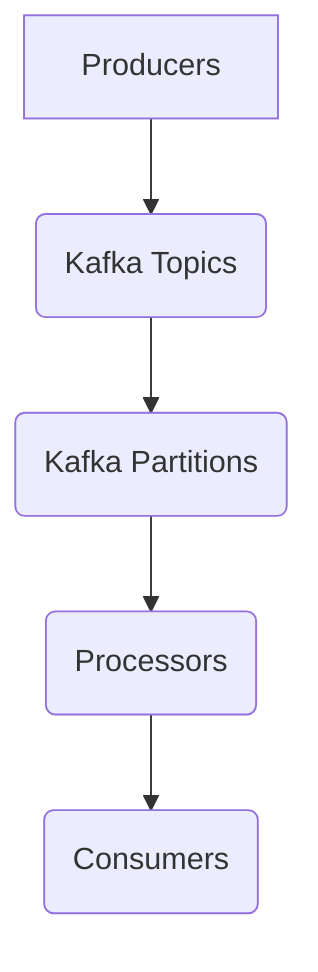

                 

在当今的分布式系统中，Kafka Streams 作为 Apache Kafka 生态系统的一部分，已经成为处理大规模实时数据流的核心工具之一。本文旨在深入探讨 Kafka Streams 的原理，并提供详细的代码实例讲解，以帮助读者更好地理解其工作方式及其在实际应用中的价值。

## 文章关键词
- Kafka Streams
- 分布式流处理
- 实时数据流
- 事件驱动架构
- Apache Kafka

## 文章摘要
本文将首先介绍 Kafka Streams 的背景和核心概念，然后详细解释其工作原理和架构。接下来，通过具体的代码实例，将展示如何使用 Kafka Streams 处理实时数据流，并提供性能优化技巧。最后，我们将讨论 Kafka Streams 的未来发展方向和应用场景。

## 1. 背景介绍
Apache Kafka 是一个分布式流处理平台，主要用于构建实时数据流管道和流处理应用程序。Kafka Streams 是 Kafka 官方提供的流处理库，它基于 Java 实现了基于 Kafka 的流处理功能。Kafka Streams 提供了一个简单且强大的 API，使得开发者能够轻松地将现有的 Java 应用程序转换为流处理应用程序，从而处理实时数据流。

### 1.1 Kafka Streams 的起源
Kafka Streams 的开发灵感来自于 Twitter 的内部流处理系统，名为 SummingBird。随着时间的推移，Twitter 团队将 SummingBird 的核心功能贡献给了 Apache Kafka 项目，最终演变成了 Kafka Streams。

### 1.2 Kafka Streams 的优势
- **易于集成**：Kafka Streams 可以轻松地与 Kafka 进行集成，无需额外的部署和配置。
- **高性能**：Kafka Streams 利用 Java 的异步编程模型，实现了高性能的流处理能力。
- **易用性**：提供简洁的 API，使得开发者能够专注于业务逻辑，而无需关注底层复杂性。

## 2. 核心概念与联系
在深入探讨 Kafka Streams 的原理之前，我们需要了解一些核心概念，并绘制一个 Mermaid 流程图来展示这些概念之间的联系。

### 2.1 核心概念
- **Kafka Topic**：Kafka 中的主题，用于存储消息。
- **Kafka Partition**：Kafka 中主题的分区，用于实现并行处理。
- **Kafka Producer**：生产者，用于发送消息到 Kafka Topic。
- **Kafka Consumer**：消费者，用于从 Kafka Topic 中接收消息。
- **Kafka Streams Processor**：Kafka Streams 的处理单元，用于处理实时数据流。

### 2.2 Mermaid 流程图


## 3. 核心算法原理 & 具体操作步骤

### 3.1 算法原理概述
Kafka Streams 的核心算法原理是基于窗口操作（Windowing）和状态维护（State Management）的实时数据处理。

### 3.2 算法步骤详解
#### 3.2.1 窗口操作
窗口操作是 Kafka Streams 中的核心概念之一。它允许我们将时间序列数据划分为不同的时间段，以便进行聚合操作。窗口类型包括：
- **固定窗口（Fixed Window）**：窗口大小固定，适用于时间戳相近的事件。
- **滑动窗口（Sliding Window）**：窗口大小固定，但可以随着时间的推移滑动。
- **会话窗口（Session Window）**：根据用户活动的时间段来定义窗口。

#### 3.2.2 状态维护
Kafka Streams 通过状态机（State Machine）来维护处理过程中的状态。每个处理器实例都维护一个或多个状态，用于存储聚合结果。状态可以是简单的计数器，也可以是复杂的对象。

### 3.3 算法优缺点
#### 优点
- **高效性**：利用 Kafka 的分布式架构，实现了高效的数据处理能力。
- **可扩展性**：支持水平扩展，可以处理大规模数据流。

#### 缺点
- **复杂性**：对于初学者来说，理解 Kafka Streams 的内部机制可能有一定的难度。
- **性能瓶颈**：在某些情况下，数据流的速度可能会成为性能瓶颈。

### 3.4 算法应用领域
Kafka Streams 适用于多种应用场景，包括：
- **实时数据分析**：用于处理实时数据流，实现实时监控和预警。
- **事件驱动架构**：作为事件驱动架构的一部分，实现异步数据处理。
- **大数据处理**：与大数据技术（如 Hadoop 和 Spark）集成，实现大规模数据处理。

## 4. 数学模型和公式 & 详细讲解 & 举例说明
### 4.1 数学模型构建
Kafka Streams 中的数学模型主要包括窗口函数和状态更新函数。

#### 窗口函数
$$
WindowFunction(T, W) = \sum_{t \in W} T(t)
$$
其中，\(T\) 表示时间序列数据，\(W\) 表示窗口。

#### 状态更新函数
$$
StateUpdateFunction(S, E) = S + E
$$
其中，\(S\) 表示状态，\(E\) 表示事件。

### 4.2 公式推导过程
窗口函数和状态更新函数的组合可以推导出多种聚合操作，如求和、计数、平均值等。

### 4.3 案例分析与讲解
假设我们有一个订单流，需要计算每个订单的总金额。订单流的数据结构如下：

| 时间戳 | 订单ID | 订单金额 |
| ------ | ------ | -------- |
| 1      | 1001   | 100      |
| 2      | 1002   | 200      |
| 3      | 1001   | 300      |
| 4      | 1003   | 400      |

#### 求和
使用窗口函数和状态更新函数，我们可以计算出每个订单的总金额：

$$
\text{总金额} = WindowFunction(\text{订单金额}, \text{窗口}) = \sum_{t \in \text{窗口}} \text{订单金额}(t)
$$
$$
\text{状态更新} = StateUpdateFunction(\text{总金额}, \text{订单金额}) = \text{总金额} + \text{订单金额}
$$

## 5. 项目实践：代码实例和详细解释说明
### 5.1 开发环境搭建
在开始之前，确保已经安装了 Java 和 Maven。然后，通过以下命令下载 Kafka Streams 的依赖：

```shell
mvn install:install-file -Dfile=https://www.apache.org/dist/kafka/streams/kafka-streams-assembly-2.4.1.jar -DgroupId=org.apache.kafka -DartifactId=kafka-streams -Dversion=2.4.1 -Dclassifier=assembly -Dpackaging=jar
```

### 5.2 源代码详细实现
以下是一个简单的 Kafka Streams 代码实例，用于计算订单流中的每个订单的总金额：

```java
import org.apache.kafka.common.serialization.Serdes;
import org.apache.kafka.streams.KafkaStreams;
import org.apache.kafka.streams.StreamsBuilder;
import org.apache.kafka.streams.StreamsConfig;
import org.apache.kafka.streams.kstream.KStream;
import org.apache.kafka.streams.kstream.KTable;

import java.util.Properties;

public class OrderStreamProcessor {
    public static void main(String[] args) {
        // 配置 Kafka Streams
        Properties config = new Properties();
        config.put(StreamsConfig.APPLICATION_ID_CONFIG, "order-stream-processor");
        config.put(StreamsConfig.BOOTSTRAP_SERVERS_CONFIG, "localhost:9092");
        config.put(StreamsConfig.DEFAULT_KEY_SERDE_CLASS_CONFIG, Serdes.String().getClass());
        config.put(StreamsConfig.DEFAULT_VALUE_SERDE_CLASS_CONFIG, Serdes.Double().getClass());

        // 创建流构建器
        StreamsBuilder builder = new StreamsBuilder();

        // 创建一个 KStream 对象，用于处理订单流
        KStream<String, Double> orderStream = builder.stream("order-topic");

        // 使用窗口聚合计算每个订单的总金额
        KTable<String, Double> totalAmountTable = orderStream
                .groupByKey()
                .windowedBy(TimeWindows.of(Duration.ofMinutes(5)))
                .reduce((total, amount) -> total + amount);

        // 将结果写入 Kafka 主题
        totalAmountTable.toStream().to("total-amount-topic");

        // 创建 Kafka Streams 实例并启动
        KafkaStreams streams = new KafkaStreams(builder.build(), config);
        streams.start();

        // 等待流处理完成
        streams.waitForShutdown();
    }
}
```

### 5.3 代码解读与分析
上述代码实例中，我们首先配置了 Kafka Streams 的各项参数，然后创建了一个 KStream 对象，用于处理订单流。接着，使用窗口聚合功能计算每个订单的总金额，并将结果写入另一个 Kafka 主题。

### 5.4 运行结果展示
运行上述代码后，可以在 Kafka 的控制台中看到生成的 `total-amount-topic` 主题。主题中的消息包含了每个订单在 5 分钟窗口内的总金额。

## 6. 实际应用场景
### 6.1 实时数据处理
Kafka Streams 适用于各种实时数据处理场景，如金融交易监控、物流跟踪等。

### 6.2 用户行为分析
Kafka Streams 可以用于实时分析用户行为，如网站点击流分析、电商用户行为分析等。

### 6.3 日志分析
Kafka Streams 可以用于实时分析日志数据，如错误日志、访问日志等。

## 7. 未来应用展望
随着大数据和实时数据处理技术的不断发展，Kafka Streams 在未来将继续发挥重要作用。预计会出现更多与 Kafka Streams 集成的开源工具和框架，进一步简化流处理应用程序的开发。

## 8. 工具和资源推荐
### 8.1 学习资源推荐
- 《Kafka Streams: Building Real-Time Applications Using Apache Kafka》
- Apache Kafka 官方文档
- Apache Kafka Streams 官方文档

### 8.2 开发工具推荐
- IntelliJ IDEA
- Eclipse
- Maven

### 8.3 相关论文推荐
- Twitter 的 SummingBird 论文
- Apache Kafka Streams 的官方论文

## 9. 总结：未来发展趋势与挑战
### 9.1 研究成果总结
Kafka Streams 已经成为实时数据处理领域的重要工具，其在性能、易用性和可扩展性方面取得了显著成果。

### 9.2 未来发展趋势
预计 Kafka Streams 将继续与更多大数据技术集成，如 Apache Flink、Apache Spark 等。此外，Kafka Streams 的 API 可能会进一步简化，以降低学习曲线。

### 9.3 面临的挑战
Kafka Streams 在性能优化和资源管理方面仍面临挑战。同时，随着数据流规模的不断扩大，如何保证系统的稳定性和可靠性也是一个重要问题。

### 9.4 研究展望
未来，Kafka Streams 的研究将重点关注性能优化、资源管理和系统集成等方面。同时，随着边缘计算和物联网技术的发展，Kafka Streams 也将在这些领域发挥重要作用。

## 附录：常见问题与解答
### Q: Kafka Streams 与 Apache Flink 有何区别？
A: Kafka Streams 和 Apache Flink 都是基于 Kafka 的流处理框架。Kafka Streams 专注于提供简单、易于使用的 API，而 Flink 提供了更丰富的功能，如窗口操作、动态调整和容错机制。两者各有优势，适用于不同的场景。

### Q: Kafka Streams 的性能如何？
A: Kafka Streams 的性能非常优秀，能够处理大规模数据流。然而，性能会受到网络延迟、数据流规模和硬件资源等因素的影响。通过合理配置和优化，可以进一步提升性能。

### Q: 如何保证 Kafka Streams 的可靠性？
A: Kafka Streams 提供了容错机制，如检查点（Checkpoints）和状态恢复（State Restores）。通过配置适当的检查点间隔和恢复策略，可以确保系统的可靠性。

## 作者署名
作者：禅与计算机程序设计艺术 / Zen and the Art of Computer Programming

---

本文详细介绍了 Kafka Streams 的原理和代码实例，旨在帮助读者深入理解其工作方式及其在实际应用中的价值。希望本文能为您的 Kafka Streams 学习之旅提供有益的参考。

