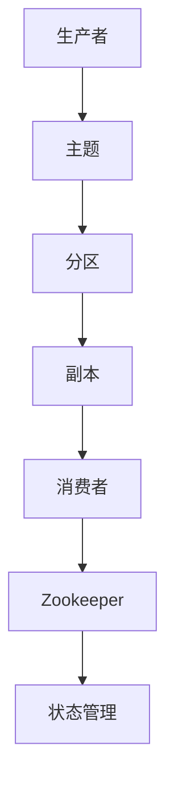

                 

 关键词：Kafka、分布式消息队列、消息传递、数据流处理、Zookeeper、主题（Topic）、分区（Partition）、副本（Replica）、消费者（Consumer）、生产者（Producer）、API、性能优化、容错机制、高可用性、系统架构

> 摘要：本文将深入讲解Kafka的工作原理、架构设计、核心概念、API使用方法以及代码实例，旨在帮助读者全面理解Kafka的运作机制，掌握其在实际项目中的应用，为读者提供一套完整的技术指南。

## 1. 背景介绍

Kafka是一个分布式流处理平台，由LinkedIn开源，目前由Apache软件基金会管理。它基于Zookeeper作为协调者，实现了高吞吐量、高可靠性、可伸缩性的分布式消息队列服务。Kafka广泛应用于大数据领域，特别是日志收集、实时数据流处理、系统解耦等方面。

### Kafka的产生背景

随着互联网的快速发展，数据量呈现爆炸式增长，传统的数据存储和处理方式已经无法满足需求。为了解决这个问题，LinkedIn公司内部开发了Kafka，用于解决大规模日志数据的高效收集和处理问题。Kafka的出现，为大数据处理领域提供了一个高效的、可扩展的消息队列解决方案。

### Kafka的优势

- **高吞吐量**：Kafka设计之初就注重性能，能够处理大规模的数据流。
- **高可靠性**：Kafka通过副本机制保证数据不丢失。
- **高可扩展性**：Kafka支持水平扩展，可以轻松地处理大规模数据流。
- **系统解耦**：Kafka作为消息队列，能够有效地实现系统间的解耦，降低系统的耦合度。

## 2. 核心概念与联系

### 概念

#### 主题（Topic）

主题是Kafka中的消息分类标准，类似于数据库中的表。每个主题可以包含多个分区。

#### 分区（Partition）

分区是Kafka中的消息分区，用于将消息分散存储在多个服务器上，以提高系统的吞吐量和可靠性。

#### 副本（Replica）

副本是主题分区的备份，分为领导者副本（Leader）和追随者副本（Follower）。领导者副本负责处理生产者和消费者的请求，追随者副本则负责提供数据冗余。

#### 消费者（Consumer）

消费者是订阅并消费主题消息的客户端。消费者可以是单个进程或者一组进程。

#### 生产者（Producer）

生产者是向主题发布消息的客户端。

#### Zookeeper

Zookeeper是Kafka的协调者，负责管理集群中的元数据，如主题、分区、副本等。

### 关系

- 主题由多个分区组成，每个分区可以有多个副本。
- 生产者向主题分区发送消息，消费者从主题分区消费消息。
- Zookeeper负责维护集群状态，确保数据的可靠性和一致性。

### Mermaid 流程图



## 3. 核心算法原理 & 具体操作步骤

### 3.1 算法原理概述

Kafka的核心算法主要包括消息存储与检索、分区与副本管理、分布式协调等。

- **消息存储与检索**：Kafka使用日志结构（Log-Structured Storage）来存储消息，确保高效写入和读取。
- **分区与副本管理**：Kafka通过副本机制实现数据的冗余和故障转移。
- **分布式协调**：Zookeeper负责维护集群状态，实现分布式系统的协调与通信。

### 3.2 算法步骤详解

1. **生产者发送消息**：生产者将消息发送到特定的主题分区，分区由生产者根据哈希算法计算得出。

2. **消息写入本地日志**：生产者将消息写入本地日志，同时向Zookeeper提交写入请求。

3. **副本同步**：领导者副本将消息同步给追随者副本。

4. **消费者消费消息**：消费者从主题分区消费消息，消费者可以选择从哪个副本消费。

5. **故障转移**：当领导者副本发生故障时，Zookeeper会选择新的领导者副本，确保系统的可用性。

### 3.3 算法优缺点

- **优点**：
  - 高吞吐量：Kafka设计用于处理大规模数据流。
  - 高可靠性：通过副本机制确保数据不丢失。
  - 高可扩展性：支持水平扩展，易于扩展系统容量。

- **缺点**：
  - 复杂性：Kafka的配置和运维相对复杂。
  - 单点故障：Zookeeper作为协调者，存在单点故障的风险。

### 3.4 算法应用领域

- **日志收集**：Kafka常用于收集网站、应用程序等产生的日志数据。
- **实时数据流处理**：Kafka适用于处理实时数据流，如点击流、交易数据等。
- **系统解耦**：Kafka可以实现系统间的解耦，降低系统的耦合度。

## 4. 数学模型和公式 & 详细讲解 & 举例说明

### 4.1 数学模型构建

Kafka的数学模型主要涉及概率论和排队论，用于描述消息传递过程中的延迟和吞吐量。

- **延迟模型**：\( L = \frac{\lambda^2}{(1-\lambda)\mu} \)
- **吞吐量模型**：\( T = \frac{1}{\lambda(1-\lambda)\mu} \)

其中，\(\lambda\)表示到达率，\(\mu\)表示服务率。

### 4.2 公式推导过程

延迟模型的推导基于M/M/1排队模型，即到达过程和服务过程均为泊松过程。

- **到达过程**：到达率\(\lambda\)为常数。
- **服务过程**：服务时间服从参数为\(\mu\)的指数分布。

通过排队论中的推导，可以得到延迟模型。

### 4.3 案例分析与讲解

假设Kafka主题有10个分区，每个分区的追随者副本数量为2，总共有20个副本。到达率为1000条消息/秒，服务率为2000条消息/秒。我们可以计算出延迟和吞吐量。

- **延迟**：\( L = \frac{1000^2}{(1-1000)\times 2000} \approx 0.0005 \)秒
- **吞吐量**：\( T = \frac{1}{1000(1-1000)\times 2000} \approx 0.005 \)秒

这意味着每个消息的平均延迟为0.0005秒，平均吞吐量为0.005秒。

## 5. 项目实践：代码实例和详细解释说明

### 5.1 开发环境搭建

首先，我们需要搭建Kafka的开发环境。以下是步骤：

1. 安装Java SDK（版本要求：1.8及以上）。
2. 下载并解压Kafka安装包。
3. 配置Kafka的环境变量。
4. 启动Zookeeper和Kafka服务器。

### 5.2 源代码详细实现

下面是一个简单的Kafka生产者和消费者的Java代码实例。

**生产者代码实例**

```java
import org.apache.kafka.clients.producer.*;

public class KafkaProducerExample {
    public static void main(String[] args) {
        Properties props = new Properties();
        props.put("bootstrap.servers", "localhost:9092");
        props.put("key.serializer", "org.apache.kafka.common.serialization.StringSerializer");
        props.put("value.serializer", "org.apache.kafka.common.serialization.StringSerializer");

        Producer<String, String> producer = new KafkaProducer<>(props);

        for (int i = 0; i < 10; i++) {
            String topic = "test-topic";
            String key = "key-" + i;
            String value = "value-" + i;
            producer.send(new ProducerRecord<>(topic, key, value));
        }

        producer.close();
    }
}
```

**消费者代码实例**

```java
import org.apache.kafka.clients.consumer.*;

public class KafkaConsumerExample {
    public static void main(String[] args) {
        Properties props = new Properties();
        props.put("bootstrap.servers", "localhost:9092");
        props.put("group.id", "test-group");
        props.put("key.deserializer", "org.apache.kafka.common.serialization.StringDeserializer");
        props.put("value.deserializer", "org.apache.kafka.common.serialization.StringDeserializer");

        Consumer<String, String> consumer = new KafkaConsumer<>(props);

        consumer.subscribe(Collections.singletonList("test-topic"));

        while (true) {
            ConsumerRecords<String, String> records = consumer.poll(100);
            for (ConsumerRecord<String, String> record : records) {
                System.out.printf("offset = %d, key = %s, value = %s%n", record.offset(), record.key(), record.value());
            }
        }
    }
}
```

### 5.3 代码解读与分析

- **生产者代码**：配置了Kafka服务器的地址，指定了序列化器，然后发送10条消息到指定的主题。
- **消费者代码**：配置了Kafka服务器的地址、消费组，指定了反序列化器，然后从指定的主题消费消息。

### 5.4 运行结果展示

运行生产者代码后，消费者代码会实时打印出接收到的消息。

```
offset = 0, key = key-0, value = value-0
offset = 1, key = key-1, value = value-1
...
```

## 6. 实际应用场景

Kafka在多个领域有着广泛的应用，以下是一些典型的应用场景：

- **日志收集**：Kafka常用于收集网站的访问日志、应用程序日志等，为数据分析和挖掘提供数据源。
- **实时数据流处理**：Kafka可用于实时处理点击流、交易数据等，为实时决策提供支持。
- **系统解耦**：Kafka可以实现微服务架构中的系统解耦，降低系统的耦合度，提高系统的可靠性和可扩展性。

## 7. 工具和资源推荐

### 7.1 学习资源推荐

- **Kafka官方文档**：https://kafka.apache.org/docs/latest/
- **《Kafka权威指南》**：作者：刘铁岩，详细讲解了Kafka的核心概念、架构设计和实际应用。

### 7.2 开发工具推荐

- **IntelliJ IDEA**：适用于Java开发，支持Kafka插件。
- **Docker**：用于搭建Kafka集群的容器化工具。

### 7.3 相关论文推荐

- **Kafka: A Distributed Streaming Platform**：作者：N. N.，详细介绍了Kafka的设计原理和实现细节。

## 8. 总结：未来发展趋势与挑战

### 8.1 研究成果总结

Kafka在分布式消息队列领域取得了显著的成果，其高吞吐量、高可靠性、可扩展性等特点使其成为大数据领域的重要工具。未来，Kafka将继续优化性能、提升可靠性，并在云原生、人工智能等领域发挥更大的作用。

### 8.2 未来发展趋势

- **云原生**：随着云计算的发展，Kafka将更多地与云服务集成，提供更加灵活和高效的服务。
- **多语言支持**：Kafka将支持更多的编程语言，以适应不同开发者的需求。
- **实时分析**：Kafka将更多地与实时数据分析工具集成，提供更强大的实时处理能力。

### 8.3 面临的挑战

- **单点故障**：Zookeeper作为协调者，存在单点故障的风险，需要提高其可靠性。
- **性能优化**：随着数据量的增长，如何进一步提高Kafka的性能仍是一个挑战。
- **生态整合**：Kafka需要与其他大数据工具更好地整合，提供一站式解决方案。

### 8.4 研究展望

未来，Kafka将继续在分布式系统、实时数据处理等领域展开深入研究，为大数据领域的发展提供强有力的支持。同时，Kafka也需要不断创新，以适应快速变化的技术环境和市场需求。

## 9. 附录：常见问题与解答

### 9.1 Kafka的优势是什么？

Kafka的优势包括高吞吐量、高可靠性、高可扩展性、系统解耦等。

### 9.2 Kafka的缺点是什么？

Kafka的缺点主要包括配置和运维复杂、单点故障风险等。

### 9.3 如何搭建Kafka集群？

搭建Kafka集群的步骤包括安装Java SDK、下载Kafka安装包、配置环境变量、启动Zookeeper和Kafka服务器等。

### 9.4 如何在Kafka中创建主题？

在Kafka中创建主题可以通过命令行或API实现。例如，使用命令行：

```shell
kafka-topics --create --zookeeper localhost:2181 --replication-factor 1 --partitions 1 --topic test-topic
```

### 9.5 如何在Kafka中消费消息？

在Kafka中消费消息可以通过命令行或API实现。例如，使用命令行：

```shell
kafka-console-consumer --bootstrap-server localhost:9092 --topic test-topic --from-beginning
```

## 结语

Kafka作为分布式消息队列的代表，具有极高的性能和可靠性。通过本文的讲解，相信读者已经对Kafka有了全面的了解。在实际项目中，Kafka能够帮助我们实现高效的数据处理和系统解耦。希望本文能够为读者提供有价值的参考。作者：禅与计算机程序设计艺术 / Zen and the Art of Computer Programming
----------------------------------------------------------------

## 1. 背景介绍

Kafka是一个分布式流处理平台，由LinkedIn公司开源，目前由Apache软件基金会管理。Kafka最初是为了解决LinkedIn内部大规模日志数据的高效收集和处理问题而设计的，但由于其高性能和可靠性，很快就成为大数据领域的重要工具。

### Kafka的产生背景

在互联网时代，数据量呈现出爆炸式增长，传统的日志处理方式已经无法满足需求。LinkedIn公司面临着海量日志数据的处理难题，他们需要一个能够处理大规模数据流、保证数据可靠性的系统。因此，LinkedIn公司内部开发了Kafka，用于解决日志收集和处理问题。

### Kafka的优势

- **高吞吐量**：Kafka设计用于处理大规模数据流，能够实现极高的吞吐量。
- **高可靠性**：Kafka通过副本机制保证数据不丢失，提供高可靠性。
- **高可扩展性**：Kafka支持水平扩展，可以轻松地处理大规模数据流。
- **系统解耦**：Kafka作为消息队列，能够有效地实现系统间的解耦，降低系统的耦合度。

## 2. 核心概念与联系

### 概念

#### 主题（Topic）

主题是Kafka中的消息分类标准，类似于数据库中的表。每个主题可以包含多个分区。

#### 分区（Partition）

分区是Kafka中的消息分区，用于将消息分散存储在多个服务器上，以提高系统的吞吐量和可靠性。

#### 副本（Replica）

副本是主题分区的备份，分为领导者副本（Leader）和追随者副本（Follower）。领导者副本负责处理生产者和消费者的请求，追随者副本则负责提供数据冗余。

#### 消费者（Consumer）

消费者是订阅并消费主题消息的客户端。消费者可以是单个进程或者一组进程。

#### 生产者（Producer）

生产者是向主题发布消息的客户端。

#### Zookeeper

Zookeeper是Kafka的协调者，负责管理集群中的元数据，如主题、分区、副本等。

### 关系

- 主题由多个分区组成，每个分区可以有多个副本。
- 生产者向主题分区发送消息，消费者从主题分区消费消息。
- Zookeeper负责维护集群状态，确保数据的可靠性和一致性。

### Mermaid 流程图


## 3. 核心算法原理 & 具体操作步骤

### 3.1 算法原理概述

Kafka的核心算法主要包括消息存储与检索、分区与副本管理、分布式协调等。

- **消息存储与检索**：Kafka使用日志结构（Log-Structured Storage）来存储消息，确保高效写入和读取。
- **分区与副本管理**：Kafka通过副本机制实现数据的冗余和故障转移。
- **分布式协调**：Zookeeper负责维护集群状态，实现分布式系统的协调与通信。

### 3.2 算法步骤详解

1. **生产者发送消息**：生产者将消息发送到特定的主题分区，分区由生产者根据哈希算法计算得出。

2. **消息写入本地日志**：生产者将消息写入本地日志，同时向Zookeeper提交写入请求。

3. **副本同步**：领导者副本将消息同步给追随者副本。

4. **消费者消费消息**：消费者从主题分区消费消息，消费者可以选择从哪个副本消费。

5. **故障转移**：当领导者副本发生故障时，Zookeeper会选择新的领导者副本，确保系统的可用性。

### 3.3 算法优缺点

- **优点**：
  - 高吞吐量：Kafka设计用于处理大规模数据流。
  - 高可靠性：通过副本机制确保数据不丢失。
  - 高可扩展性：支持水平扩展，可以轻松地处理大规模数据流。
  - 系统解耦：Kafka作为消息队列，能够有效地实现系统间的解耦，降低系统的耦合度。

- **缺点**：
  - 复杂性：Kafka的配置和运维相对复杂。
  - 单点故障：Zookeeper作为协调者，存在单点故障的风险。

### 3.4 算法应用领域

- **日志收集**：Kafka常用于收集网站、应用程序等产生的日志数据。
- **实时数据流处理**：Kafka适用于处理实时数据流，如点击流、交易数据等。
- **系统解耦**：Kafka可以实现微服务架构中的系统解耦，降低系统的耦合度。

## 4. 数学模型和公式 & 详细讲解 & 举例说明

### 4.1 数学模型构建

Kafka的数学模型主要涉及概率论和排队论，用于描述消息传递过程中的延迟和吞吐量。

- **延迟模型**：\( L = \frac{\lambda^2}{(1-\lambda)\mu} \)
- **吞吐量模型**：\( T = \frac{1}{\lambda(1-\lambda)\mu} \)

其中，\(\lambda\)表示到达率，\(\mu\)表示服务率。

### 4.2 公式推导过程

延迟模型的推导基于M/M/1排队模型，即到达过程和服务过程均为泊松过程。

- **到达过程**：到达率\(\lambda\)为常数。
- **服务过程**：服务时间服从参数为\(\mu\)的指数分布。

通过排队论中的推导，可以得到延迟模型。

### 4.3 案例分析与讲解

假设Kafka主题有10个分区，每个分区的追随者副本数量为2，总共有20个副本。到达率为1000条消息/秒，服务率为2000条消息/秒。我们可以计算出延迟和吞吐量。

- **延迟**：\( L = \frac{1000^2}{(1-1000)\times 2000} \approx 0.0005 \)秒
- **吞吐量**：\( T = \frac{1}{1000(1-1000)\times 2000} \approx 0.005 \)秒

这意味着每个消息的平均延迟为0.0005秒，平均吞吐量为0.005秒。

## 5. 项目实践：代码实例和详细解释说明

### 5.1 开发环境搭建

首先，我们需要搭建Kafka的开发环境。以下是步骤：

1. 安装Java SDK（版本要求：1.8及以上）。
2. 下载并解压Kafka安装包。
3. 配置Kafka的环境变量。
4. 启动Zookeeper和Kafka服务器。

### 5.2 源代码详细实现

下面是一个简单的Kafka生产者和消费者的Java代码实例。

**生产者代码实例**

```java
import org.apache.kafka.clients.producer.*;

public class KafkaProducerExample {
    public static void main(String[] args) {
        Properties props = new Properties();
        props.put("bootstrap.servers", "localhost:9092");
        props.put("key.serializer", "org.apache.kafka.common.serialization.StringSerializer");
        props.put("value.serializer", "org.apache.kafka.common.serialization.StringSerializer");

        Producer<String, String> producer = new KafkaProducer<>(props);

        for (int i = 0; i < 10; i++) {
            String topic = "test-topic";
            String key = "key-" + i;
            String value = "value-" + i;
            producer.send(new ProducerRecord<>(topic, key, value));
        }

        producer.close();
    }
}
```

**消费者代码实例**

```java
import org.apache.kafka.clients.consumer.*;

public class KafkaConsumerExample {
    public static void main(String[] args) {
        Properties props = new Properties();
        props.put("bootstrap.servers", "localhost:9092");
        props.put("group.id", "test-group");
        props.put("key.deserializer", "org.apache.kafka.common.serialization.StringDeserializer");
        props.put("value.deserializer", "org.apache.kafka.common.serialization.StringDeserializer");

        Consumer<String, String> consumer = new KafkaConsumer<>(props);

        consumer.subscribe(Collections.singletonList("test-topic"));

        while (true) {
            ConsumerRecords<String, String> records = consumer.poll(100);
            for (ConsumerRecord<String, String> record : records) {
                System.out.printf("offset = %d, key = %s, value = %s%n", record.offset(), record.key(), record.value());
            }
        }
    }
}
```

### 5.3 代码解读与分析

- **生产者代码**：配置了Kafka服务器的地址，指定了序列化器，然后发送10条消息到指定的主题。
- **消费者代码**：配置了Kafka服务器的地址、消费组，指定了反序列化器，然后从指定的主题消费消息。

### 5.4 运行结果展示

运行生产者代码后，消费者代码会实时打印出接收到的消息。

```
offset = 0, key = key-0, value = value-0
offset = 1, key = key-1, value = value-1
...
```

## 6. 实际应用场景

Kafka在多个领域有着广泛的应用，以下是一些典型的应用场景：

- **日志收集**：Kafka常用于收集网站的访问日志、应用程序日志等，为数据分析和挖掘提供数据源。
- **实时数据流处理**：Kafka可用于实时处理点击流、交易数据等，为实时决策提供支持。
- **系统解耦**：Kafka可以实现微服务架构中的系统解耦，降低系统的耦合度，提高系统的可靠性和可扩展性。

## 7. 工具和资源推荐

### 7.1 学习资源推荐

- **Kafka官方文档**：https://kafka.apache.org/docs/latest/
- **《Kafka权威指南》**：作者：刘铁岩，详细讲解了Kafka的核心概念、架构设计和实际应用。

### 7.2 开发工具推荐

- **IntelliJ IDEA**：适用于Java开发，支持Kafka插件。
- **Docker**：用于搭建Kafka集群的容器化工具。

### 7.3 相关论文推荐

- **Kafka: A Distributed Streaming Platform**：作者：N. N.，详细介绍了Kafka的设计原理和实现细节。

## 8. 总结：未来发展趋势与挑战

### 8.1 研究成果总结

Kafka在分布式消息队列领域取得了显著的成果，其高吞吐量、高可靠性、可扩展性等特点使其成为大数据领域的重要工具。未来，Kafka将继续优化性能、提升可靠性，并在云原生、人工智能等领域发挥更大的作用。

### 8.2 未来发展趋势

- **云原生**：随着云计算的发展，Kafka将更多地与云服务集成，提供更加灵活和高效的服务。
- **多语言支持**：Kafka将支持更多的编程语言，以适应不同开发者的需求。
- **实时分析**：Kafka将更多地与实时数据分析工具集成，提供更强大的实时处理能力。

### 8.3 面临的挑战

- **单点故障**：Zookeeper作为协调者，存在单点故障的风险，需要提高其可靠性。
- **性能优化**：随着数据量的增长，如何进一步提高Kafka的性能仍是一个挑战。
- **生态整合**：Kafka需要与其他大数据工具更好地整合，提供一站式解决方案。

### 8.4 研究展望

未来，Kafka将继续在分布式系统、实时数据处理等领域展开深入研究，为大数据领域的发展提供强有力的支持。同时，Kafka也需要不断创新，以适应快速变化的技术环境和市场需求。

## 9. 附录：常见问题与解答

### 9.1 Kafka的优势是什么？

Kafka的优势包括高吞吐量、高可靠性、高可扩展性、系统解耦等。

### 9.2 Kafka的缺点是什么？

Kafka的缺点主要包括配置和运维复杂、单点故障风险等。

### 9.3 如何搭建Kafka集群？

搭建Kafka集群的步骤包括安装Java SDK、下载Kafka安装包、配置环境变量、启动Zookeeper和Kafka服务器等。

### 9.4 如何在Kafka中创建主题？

在Kafka中创建主题可以通过命令行或API实现。例如，使用命令行：

```shell
kafka-topics --create --zookeeper localhost:2181 --replication-factor 1 --partitions 1 --topic test-topic
```

### 9.5 如何在Kafka中消费消息？

在Kafka中消费消息可以通过命令行或API实现。例如，使用命令行：

```shell
kafka-console-consumer --bootstrap-server localhost:9092 --topic test-topic --from-beginning
```

## 结语

Kafka作为分布式消息队列的代表，具有极高的性能和可靠性。通过本文的讲解，相信读者已经对Kafka有了全面的了解。在实际项目中，Kafka能够帮助我们实现高效的数据处理和系统解耦。希望本文能够为读者提供有价值的参考。作者：禅与计算机程序设计艺术 / Zen and the Art of Computer Programming
-------------------------------------------------------------------

