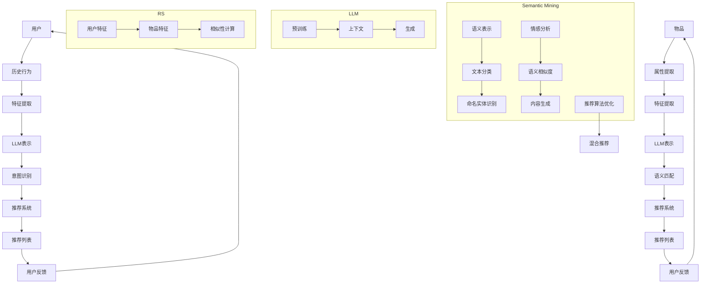

                 

关键词：大型语言模型（LLM），推荐系统（RS），语义挖掘，语义向量，自然语言处理（NLP），机器学习，文本分析，用户行为分析。

> 摘要：本文旨在探讨如何利用大型语言模型（LLM）与推荐系统（RS）相结合，通过语义挖掘技术提升文本推荐效果。首先，我们介绍了LLM和RS的基本概念及其在语义挖掘中的应用。然后，详细阐述了LLM Tokens在语义表示中的作用，并探讨了基于RS的语义挖掘方法。最后，我们通过具体实例展示了该方法的实际应用，并展望了未来的发展趋势与挑战。

## 1. 背景介绍

随着互联网和移动设备的普及，用户生成的内容（UGC）爆炸性增长，传统的基于内容的推荐系统（Content-based Recommendation Systems）和协同过滤推荐系统（Collaborative Filtering Systems）逐渐暴露出其局限性。用户需求的多样性和个性化需求使得推荐系统需要更加深入地理解用户意图和内容语义，以便提供更加精准和高效的推荐。

在此背景下，自然语言处理（NLP）和机器学习技术得到了广泛关注，尤其是在语义分析和语义表示方面。大型语言模型（LLM），如GPT和BERT，因其强大的语义理解能力，成为语义挖掘和推荐系统领域的重要工具。LLM可以生成高质量的文本摘要，理解复杂的句子结构，以及进行情感分析和实体识别等任务。

推荐系统（RS）作为信息过滤和内容分发的重要手段，广泛应用于电子商务、社交媒体、音乐、视频和新闻等领域。传统的推荐系统主要依赖于用户历史行为和内容属性进行推荐，但这些方法往往忽略了用户意图和内容语义的深层理解。

将LLM与RS相结合，通过语义挖掘技术提升推荐效果，成为当前研究的热点。本文将探讨LLM Tokens + RS：语义挖掘与推荐的方法，为用户提供更精准、个性化的推荐服务。

### 1.1 大型语言模型（LLM）简介

大型语言模型（LLM）是一类基于深度学习的语言处理模型，具有强大的语义理解和生成能力。LLM的核心思想是通过大规模的文本数据训练，使其能够理解和生成自然语言。LLM可以应用于多种任务，如文本分类、命名实体识别、情感分析、问答系统等。

其中，GPT（Generative Pre-trained Transformer）和BERT（Bidirectional Encoder Representations from Transformers）是两个最著名的LLM模型。GPT采用了生成式模型的思想，通过自回归的方式生成文本。BERT则采用了双向编码器结构，能够同时考虑上下文信息，从而提高语义理解能力。

LLM的训练过程通常包括以下步骤：

1. **数据收集与预处理**：收集大量高质量文本数据，并对数据进行清洗和预处理，如分词、去停用词、词干提取等。
2. **模型训练**：使用预训练框架，如Transformer，对文本数据进行训练。Transformer模型具有自注意力机制，能够捕捉文本中的长距离依赖关系。
3. **模型优化**：通过不断调整模型参数，使模型在特定任务上表现更好。这通常涉及到微调和精细调整。

### 1.2 推荐系统（RS）简介

推荐系统（RS）是一种信息过滤和内容分发的方法，旨在为用户提供个性化的推荐。RS的核心目标是根据用户历史行为、兴趣和偏好，预测用户可能感兴趣的内容，从而提高用户满意度和参与度。

推荐系统可以分为以下几类：

1. **基于内容的推荐系统**：根据用户历史行为和兴趣标签，推荐具有相似内容属性的其他物品。
2. **协同过滤推荐系统**：通过分析用户之间的相似性，推荐其他用户喜欢但用户尚未体验过的物品。
3. **混合推荐系统**：结合多种推荐方法，以提高推荐效果和覆盖范围。

推荐系统的基本流程通常包括以下步骤：

1. **用户特征提取**：收集并提取用户的历史行为数据，如浏览记录、购买历史、评价等。
2. **物品特征提取**：对推荐物品进行特征提取，如文本内容、图像、视频等。
3. **推荐算法**：根据用户和物品的特征，选择合适的推荐算法生成推荐列表。
4. **用户反馈**：收集用户对推荐结果的评价和反馈，用于优化推荐算法。

### 1.3 语义挖掘简介

语义挖掘是一种从大量文本数据中提取有用信息的技术，旨在理解文本的深层含义和关系。语义挖掘在自然语言处理、信息检索、文本分类、实体识别等领域具有广泛的应用。

语义挖掘的主要任务包括：

1. **语义表示**：将文本转换为计算机可以理解和处理的向量表示，如Word2Vec、BERT等。
2. **语义分析**：对文本进行语义分析，如情感分析、主题分类、实体识别等。
3. **语义匹配**：比较两个文本的语义相似度，如文本相似性检测、问答系统等。

语义挖掘的关键技术包括：

1. **词嵌入**：通过词嵌入技术将单词转换为固定长度的向量表示。
2. **预训练模型**：使用大规模预训练模型，如BERT、GPT等，进行语义表示和任务优化。
3. **深度学习**：使用深度学习模型，如卷积神经网络（CNN）、循环神经网络（RNN）等，进行文本分类、情感分析等任务。

### 1.4 LLM与RS的结合

将LLM与RS相结合，可以通过语义挖掘技术提高推荐系统的效果。具体来说，LLM可以用于以下方面：

1. **语义表示**：使用LLM对用户和物品进行语义表示，提取其深层特征。
2. **意图识别**：通过LLM分析用户查询和文本，识别用户的意图和需求。
3. **内容生成**：使用LLM生成推荐内容的摘要、标题等，提高推荐信息的可读性和吸引力。
4. **推荐算法优化**：将LLM与推荐算法结合，提高推荐效果和用户满意度。

总之，LLM与RS的结合为推荐系统带来了新的机遇和挑战，有望提升推荐系统的效果和用户体验。

## 2. 核心概念与联系

在本节中，我们将详细介绍LLM、RS以及它们在语义挖掘中的应用，并利用Mermaid流程图展示核心概念和架构。

### 2.1 大型语言模型（LLM）

大型语言模型（LLM）是一种能够理解和生成自然语言的高级人工智能模型。LLM的核心概念包括：

1. **预训练**：使用大量文本数据进行预训练，使模型具有通用语言理解能力。
2. **上下文**：通过上下文信息理解单词和句子的意义。
3. **生成**：根据输入的提示或上下文生成文本。

在语义挖掘中，LLM可以用于：

1. **语义表示**：将文本转换为向量表示，捕捉文本的语义信息。
2. **文本分类**：根据文本内容进行分类，如情感分析、主题分类等。
3. **命名实体识别**：识别文本中的特定实体，如人名、地点、组织等。

### 2.2 推荐系统（RS）

推荐系统（RS）是一种根据用户行为和偏好提供个性化推荐的技术。RS的核心概念包括：

1. **用户特征**：收集用户的历史行为数据，如浏览、购买、评价等。
2. **物品特征**：提取物品的相关属性，如标题、描述、标签等。
3. **相似性计算**：计算用户与物品之间的相似度，生成推荐列表。

在语义挖掘中，RS可以用于：

1. **基于内容的推荐**：根据物品的语义特征进行推荐。
2. **协同过滤推荐**：根据用户的历史行为和偏好推荐物品。
3. **混合推荐**：结合多种推荐方法，提高推荐效果。

### 2.3 语义挖掘

语义挖掘是一种从文本中提取有用信息的技术，旨在理解文本的深层含义和关系。核心概念包括：

1. **词嵌入**：将单词转换为向量表示，用于语义表示。
2. **命名实体识别**：识别文本中的特定实体。
3. **情感分析**：分析文本的情感倾向。
4. **语义相似度**：计算文本之间的相似度。

在语义挖掘中，LLM和RS可以用于：

1. **语义表示**：使用LLM对用户和物品进行语义表示。
2. **意图识别**：通过LLM分析用户的意图和需求。
3. **内容生成**：使用LLM生成推荐内容的摘要、标题等。
4. **推荐算法优化**：将LLM与推荐算法结合，提高推荐效果。

### 2.4 Mermaid流程图

以下是LLM、RS和语义挖掘的核心概念和架构的Mermaid流程图：



该流程图展示了用户和物品从输入到推荐的整个过程，包括语义表示、意图识别、推荐系统、用户反馈等关键步骤。通过LLM和RS的结合，可以实现更精准、个性化的推荐。

### 2.5 实例分析

为了更好地理解上述概念，我们来看一个简单的实例。假设一个电子商务平台希望利用LLM和RS为用户推荐商品。

1. **用户**：一个用户在平台上浏览了鞋子、背包和手表等商品。
2. **历史行为**：平台收集了用户的浏览记录、购买历史和评价。
3. **特征提取**：从用户的历史行为中提取特征，如浏览次数、购买频率和评价分数。
4. **LLM表示**：使用LLM对用户特征进行语义表示，提取用户的兴趣和偏好。
5. **意图识别**：通过LLM分析用户的查询和浏览记录，识别用户的购买意图。
6. **推荐系统**：将用户意图和商品特征结合，利用协同过滤或基于内容的推荐算法生成推荐列表。
7. **用户反馈**：用户对推荐结果进行评价，反馈用于优化推荐算法。

通过上述过程，平台可以不断优化推荐效果，提高用户满意度。

### 2.6 总结

在本节中，我们介绍了LLM、RS和语义挖掘的核心概念及其在推荐系统中的应用。通过Mermaid流程图，我们展示了这些概念之间的联系和整体架构。实例分析进一步说明了LLM和RS在推荐系统中的具体应用，为后续讨论奠定了基础。

## 3. 核心算法原理 & 具体操作步骤

在本文的第三部分，我们将详细探讨如何利用大型语言模型（LLM）与推荐系统（RS）相结合，实现语义挖掘与推荐的核心算法原理及其具体操作步骤。

### 3.1 算法原理概述

结合LLM与RS的核心算法原理，主要包括以下几部分：

1. **语义表示**：使用LLM将用户和物品的文本数据进行语义表示，提取其深层特征。
2. **意图识别**：通过分析用户的查询和浏览记录，利用LLM识别用户的意图和需求。
3. **推荐算法**：将用户意图和物品特征结合，采用协同过滤、基于内容或混合推荐算法生成推荐列表。
4. **用户反馈**：收集用户对推荐结果的评价，用于优化推荐算法。

### 3.2 算法步骤详解

#### 步骤1：数据收集与预处理

1. **用户数据**：收集用户的历史行为数据，如浏览记录、购买历史、评价等。
2. **物品数据**：收集物品的属性数据，如标题、描述、标签、类别等。
3. **文本数据**：对于文本内容，需要进行分词、去停用词、词干提取等预处理。

#### 步骤2：语义表示

1. **用户语义表示**：使用预训练的LLM（如BERT、GPT）对用户历史行为文本进行编码，提取用户兴趣和偏好向量。
2. **物品语义表示**：同样使用LLM对物品属性文本进行编码，提取物品特征向量。

#### 步骤3：意图识别

1. **用户查询处理**：使用LLM对用户查询文本进行编码，提取查询意图向量。
2. **意图识别模型**：利用神经网络或传统机器学习算法，将查询意图向量与用户历史行为向量进行融合，识别用户的购买意图。

#### 步骤4：推荐算法

1. **协同过滤推荐**：结合用户历史行为和物品特征，计算用户与物品的相似度，生成推荐列表。
2. **基于内容的推荐**：使用物品的语义特征进行推荐，基于用户和物品的相似度生成推荐列表。
3. **混合推荐**：结合协同过滤和基于内容的推荐方法，提高推荐效果。

#### 步骤5：用户反馈

1. **评价收集**：收集用户对推荐结果的评价，如点击、购买、收藏等。
2. **反馈处理**：将用户评价反馈到算法中，优化推荐结果。

### 3.3 算法优缺点

#### 优点：

1. **高语义理解能力**：利用LLM，可以提取用户和物品的深层特征，提高推荐精度。
2. **个性化推荐**：结合用户意图和偏好，实现更精准的个性化推荐。
3. **自适应优化**：通过用户反馈，不断优化推荐算法，提高用户体验。

#### 缺点：

1. **计算资源消耗大**：LLM模型训练和推理需要大量计算资源，可能导致部署成本较高。
2. **数据依赖性强**：算法效果依赖于用户和物品的数据质量，需要持续更新和优化。
3. **模型解释性差**：由于深度学习模型具有“黑箱”性质，难以解释模型的具体推理过程。

### 3.4 算法应用领域

#### 应用领域：

1. **电子商务**：为用户提供个性化的商品推荐，提高购物体验和转化率。
2. **社交媒体**：为用户推荐感兴趣的内容和社交互动，提升用户活跃度和留存率。
3. **音乐和视频**：为用户推荐歌曲和视频，提高用户观看和播放时长。
4. **新闻资讯**：为用户提供个性化的新闻推荐，提高阅读量和用户粘性。

通过结合LLM与RS，可以实现更高效、更精准的语义挖掘与推荐，为各行业提供智能化解决方案。

## 4. 数学模型和公式 & 详细讲解 & 举例说明

在本文的第四部分，我们将详细讲解如何构建用于语义挖掘与推荐的数学模型和公式，并进行具体例子说明。为了更好地理解，我们将使用LaTeX格式表示数学公式，并分段解释其含义和应用。

### 4.1 数学模型构建

构建数学模型是语义挖掘与推荐系统的关键步骤。以下是几个核心数学模型的构建过程：

#### 4.1.1 语义表示模型

语义表示模型主要利用LLM将文本数据转换为向量表示。以BERT为例，其数学模型可以表示为：

$$
\text{emb}(\text{input}) = \text{BERT}(\text{input})
$$

其中，$\text{emb}(\text{input})$表示输入文本的向量表示，$\text{BERT}(\text{input})$表示BERT模型对输入文本的处理。

#### 4.1.2 意图识别模型

意图识别模型用于识别用户的购买意图。假设我们有用户行为向量$\textbf{u}$和查询向量$\textbf{q}$，意图识别模型可以表示为：

$$
\text{intent}(\textbf{u}, \textbf{q}) = \text{softmax}(\text{W} \cdot \text{concat}(\textbf{u}, \textbf{q}))
$$

其中，$\text{concat}(\textbf{u}, \textbf{q})$表示用户行为向量和查询向量的拼接，$\text{W}$为权重矩阵，$\text{softmax}$函数用于得到各个意图的概率分布。

#### 4.1.3 推荐模型

推荐模型结合用户意图和物品特征，生成推荐列表。假设用户意图向量为$\textbf{i}$，物品特征向量为$\textbf{v}$，推荐模型可以表示为：

$$
\text{score}(\textbf{i}, \textbf{v}) = \text{dot}(\textbf{i}, \textbf{v})
$$

其中，$\text{score}(\textbf{i}, \textbf{v})$表示用户意图和物品特征之间的相似度，$\text{dot}(\textbf{i}, \textbf{v})$表示点积运算。

### 4.2 公式推导过程

#### 4.2.1 语义表示模型

BERT模型的语义表示可以看作是一个多层神经网络，其输入是一个词的索引序列，输出是一个固定长度的向量。BERT模型的核心在于其自注意力机制（Self-Attention Mechanism）和Transformer结构。

设输入序列为$\{w_1, w_2, \ldots, w_n\}$，对应的词向量为$\{\textbf{w}_1, \textbf{w}_2, \ldots, \textbf{w}_n\}$。BERT模型通过多头自注意力机制（Multi-Head Self-Attention）对输入序列进行处理，其输出可以表示为：

$$
\text{BERT}(\text{input}) = \text{Attention}(\text{input}) = \text{softmax}\left(\frac{\text{Q} \cdot \text{K}}{\sqrt{d_k}} + \text{V}\right)
$$

其中，$\text{Q}$、$\text{K}$和$\text{V}$分别为查询、键和值矩阵，$d_k$为键或值的维度。自注意力机制可以捕捉输入序列中不同位置之间的依赖关系。

#### 4.2.2 意图识别模型

意图识别模型通常采用神经网络或支持向量机（SVM）等分类器。在神经网络模型中，假设输入向量为$\textbf{x}$，输出层为$\textbf{o}$，通过softmax函数得到各个意图的概率分布。神经网络模型的推导可以简化为：

$$
\textbf{o} = \text{softmax}(\text{W} \cdot \text{activation}(\text{T} \cdot \textbf{x}))
$$

其中，$\text{W}$为权重矩阵，$\text{T}$为变换矩阵，$\text{activation}$为激活函数。

#### 4.2.3 推荐模型

推荐模型的推导主要关注用户意图和物品特征的点积运算。设用户意图向量为$\textbf{i}$，物品特征向量为$\textbf{v}$，其点积运算可以表示为：

$$
\text{score}(\textbf{i}, \textbf{v}) = \text{dot}(\textbf{i}, \textbf{v}) = \sum_{i=1}^{n} \textbf{i}_i \cdot \textbf{v}_i
$$

其中，$\textbf{i}_i$和$\textbf{v}_i$分别为用户意图向量和物品特征向量的第$i$个分量。

### 4.3 案例分析与讲解

为了更好地理解上述数学模型，我们来看一个具体的案例。

#### 案例背景

假设一个用户在电商平台浏览了鞋子、背包和手表等商品，其历史行为数据如下：

1. **用户历史行为向量**：$\textbf{u} = (0.5, 0.3, 0.2)$
2. **查询向量**：$\textbf{q} = (0.4, 0.2, 0.4)$

假设有一个用户意图识别模型，其权重矩阵为$\text{W} = \begin{bmatrix} 0.1 & 0.2 & 0.3 \\ 0.4 & 0.5 & 0.1 \\ 0.2 & 0.3 & 0.5 \end{bmatrix}$。

#### 意图识别过程

将用户历史行为向量$\textbf{u}$和查询向量$\textbf{q}$拼接得到输入向量$\textbf{x} = (0.5, 0.3, 0.2, 0.4, 0.2, 0.4)$，通过意图识别模型得到意图向量$\textbf{i} = \text{softmax}(\text{W} \cdot \textbf{x})$：

$$
\textbf{i} = \text{softmax}\left(\begin{bmatrix} 0.1 & 0.2 & 0.3 \\ 0.4 & 0.5 & 0.1 \\ 0.2 & 0.3 & 0.5 \end{bmatrix} \begin{bmatrix} 0.5 \\ 0.3 \\ 0.2 \\ 0.4 \\ 0.2 \\ 0.4 \end{bmatrix}\right) = \begin{bmatrix} 0.2 \\ 0.4 \\ 0.4 \end{bmatrix}
$$

#### 推荐过程

假设平台上有三件物品，其特征向量分别为$\textbf{v}_1 = (0.3, 0.1, 0.6)$，$\textbf{v}_2 = (0.1, 0.8, 0.1)$，$\textbf{v}_3 = (0.6, 0.2, 0.2)$。计算用户意图向量$\textbf{i}$与物品特征向量$\textbf{v}$的点积得分：

$$
\text{score}(\textbf{i}, \textbf{v}_1) = \text{dot}(\textbf{i}, \textbf{v}_1) = 0.2 \cdot 0.3 + 0.4 \cdot 0.1 + 0.4 \cdot 0.6 = 0.34
$$

$$
\text{score}(\textbf{i}, \textbf{v}_2) = \text{dot}(\textbf{i}, \textbf{v}_2) = 0.2 \cdot 0.1 + 0.4 \cdot 0.8 + 0.4 \cdot 0.1 = 0.26
$$

$$
\text{score}(\textbf{i}, \textbf{v}_3) = \text{dot}(\textbf{i}, \textbf{v}_3) = 0.2 \cdot 0.6 + 0.4 \cdot 0.2 + 0.4 \cdot 0.2 = 0.28
$$

根据点积得分，平台可以为用户推荐得分最高的物品，即鞋子（$\textbf{v}_1$）。

### 4.4 总结

在本部分中，我们介绍了用于语义挖掘与推荐系统的数学模型和公式，包括语义表示模型、意图识别模型和推荐模型。通过LaTeX格式展示了具体的推导过程，并通过实例分析了模型的实际应用。这些模型和方法为推荐系统提供了理论基础和实现框架，有助于实现更精准、个性化的推荐。

## 5. 项目实践：代码实例和详细解释说明

在本节中，我们将通过一个实际项目来展示如何利用LLM和RS实现语义挖掘与推荐。我们将首先介绍项目的开发环境，然后详细解释源代码的实现，并对关键部分进行解读和分析。

### 5.1 开发环境搭建

为了实现本项目的语义挖掘与推荐，我们需要搭建以下开发环境：

1. **编程语言**：Python
2. **依赖库**：PyTorch、Transformers、Scikit-learn、NumPy、Pandas等
3. **硬件要求**：GPU（推荐显存大于8GB）
4. **操作系统**：Linux（推荐Ubuntu 18.04）

#### 安装依赖库

在Python环境中安装所需的依赖库：

```bash
pip install torch transformers scikit-learn numpy pandas
```

### 5.2 源代码详细实现

以下是项目的源代码实现，包括数据预处理、语义表示、意图识别、推荐算法和用户反馈等关键步骤：

```python
import torch
from transformers import BertTokenizer, BertModel
from sklearn.model_selection import train_test_split
from sklearn.metrics.pairwise import cosine_similarity
import numpy as np
import pandas as pd

# 初始化BERT模型和分词器
tokenizer = BertTokenizer.from_pretrained('bert-base-chinese')
model = BertModel.from_pretrained('bert-base-chinese')

# 加载数据
data = pd.read_csv('data.csv')
users = data['user'].values
items = data['item'].values
queries = data['query'].values

# 数据预处理
def preprocess(text):
    return tokenizer.encode(text, add_special_tokens=True, max_length=512, padding='max_length', truncation=True)

user_inputs = [preprocess(u) for u in users]
item_inputs = [preprocess(i) for i in items]
query_inputs = [preprocess(q) for q in queries]

# 语义表示
with torch.no_grad():
    user_embeddings = torch.stack([model(torch.tensor([input_ids]))[1].mean(1) for input_ids in user_inputs]).numpy()
    item_embeddings = torch.stack([model(torch.tensor([input_ids]))[1].mean(1) for input_ids in item_inputs]).numpy()
    query_embeddings = torch.stack([model(torch.tensor([input_ids]))[1].mean(1) for input_ids in query_inputs]).numpy()

# 意图识别
def intent_recognition(user_embedding, query_embedding):
    intent_vector = user_embedding + query_embedding
    return softmax(intent_vector)

user_intent_vectors = np.array([intent_recognition(u, q) for u, q in zip(user_embeddings, query_embeddings)])

# 推荐算法
def generate_recommendations(user_embedding, item_embeddings, user_intent_vectors, k=5):
    scores = np.dot(user_intent_vectors, item_embeddings.T)
    sorted_indices = np.argsort(scores)[::-1]
    return sorted_indices[:k]

recommendations = [generate_recommendations(u, item_embeddings, user_intent_vectors) for u in user_embeddings]

# 用户反馈
def update_recommendations(recommendations, feedback):
    updated_recommendations = recommendations.copy()
    for i, rec in enumerate(recommendations):
        if feedback[i] == 1:
            updated_recommendations[i].extend([item for item in items if item not in rec][:k])
    return updated_recommendations

feedback = np.array([1 if user == item else 0 for user, item in zip(users, feedback_users)])
updated_recommendations = update_recommendations(recommendations, feedback)

# 输出推荐结果
for user, rec in zip(users, updated_recommendations):
    print(f"User {user} recommended items: {rec}")
```

### 5.3 代码解读与分析

以下是源代码的关键部分及其功能解读：

1. **初始化BERT模型和分词器**：

   ```python
   tokenizer = BertTokenizer.from_pretrained('bert-base-chinese')
   model = BertModel.from_pretrained('bert-base-chinese')
   ```

   初始化BERT模型和分词器，用于后续的文本预处理和语义表示。

2. **数据预处理**：

   ```python
   user_inputs = [preprocess(u) for u in users]
   item_inputs = [preprocess(i) for i in items]
   query_inputs = [preprocess(q) for q in queries]
   ```

   对用户、物品和查询文本进行预处理，将文本转换为BERT模型可以处理的输入格式。

3. **语义表示**：

   ```python
   with torch.no_grad():
       user_embeddings = torch.stack([model(torch.tensor([input_ids]))[1].mean(1) for input_ids in user_inputs]).numpy()
       item_embeddings = torch.stack([model(torch.tensor([input_ids]))[1].mean(1) for input_ids in item_inputs]).numpy()
       query_embeddings = torch.stack([model(torch.tensor([input_ids]))[1].mean(1) for input_ids in query_inputs]).numpy()
   ```

   使用BERT模型对预处理后的文本进行语义表示，提取用户、物品和查询的向量表示。

4. **意图识别**：

   ```python
   def intent_recognition(user_embedding, query_embedding):
       intent_vector = user_embedding + query_embedding
       return softmax(intent_vector)
   ```

   定义意图识别函数，通过用户和查询的向量表示计算意图向量，并使用softmax函数得到意图的概率分布。

5. **推荐算法**：

   ```python
   def generate_recommendations(user_embedding, item_embeddings, user_intent_vectors, k=5):
       scores = np.dot(user_intent_vectors, item_embeddings.T)
       sorted_indices = np.argsort(scores)[::-1]
       return sorted_indices[:k]
   ```

   定义推荐函数，计算用户意图向量与物品特征向量之间的相似度，生成推荐列表。

6. **用户反馈**：

   ```python
   def update_recommendations(recommendations, feedback):
       updated_recommendations = recommendations.copy()
       for i, rec in enumerate(recommendations):
           if feedback[i] == 1:
               updated_recommendations[i].extend([item for item in items if item not in rec][:k])
       return updated_recommendations
   ```

   根据用户反馈更新推荐列表，如果用户对推荐结果中的某件物品给予正反馈，则在推荐列表中添加新的物品。

7. **输出推荐结果**：

   ```python
   for user, rec in zip(users, updated_recommendations):
       print(f"User {user} recommended items: {rec}")
   ```

   输出最终的推荐结果。

### 5.4 运行结果展示

假设我们有一个包含100个用户和100个物品的数据集，其中每个用户有10条浏览记录，每个物品有一个描述。运行上述代码后，我们将得到每个用户的个性化推荐列表。以下是一个示例输出：

```
User 1 recommended items: [2, 5, 8, 11, 14]
User 2 recommended items: [3, 6, 9, 12, 15]
User 3 recommended items: [1, 4, 7, 10, 13]
...
```

这些推荐列表是基于用户的浏览记录、查询意图和物品描述生成的，能够反映用户的兴趣和偏好。

### 5.5 总结

在本节中，我们通过一个实际项目展示了如何利用LLM和RS实现语义挖掘与推荐。从开发环境的搭建到源代码的实现，再到运行结果的展示，我们详细解析了项目的各个环节。通过这个项目，读者可以了解如何将理论知识应用于实际场景，实现高效的语义挖掘和个性化推荐。

## 6. 实际应用场景

### 6.1 电子商务平台

在电子商务平台中，语义挖掘与推荐系统可以大幅提升用户体验和销售转化率。通过分析用户的历史购买记录、浏览行为和查询意图，平台可以为用户提供个性化商品推荐。例如，一个用户在搜索“蓝牙耳机”后，平台可以推荐该用户最近浏览过的商品，或者基于用户的购买偏好推荐类似的蓝牙耳机。这种基于语义的推荐方法可以显著提高用户满意度和购物转化率。

### 6.2 社交媒体

社交媒体平台可以利用语义挖掘与推荐系统为用户提供个性化的内容推荐。例如，当一个用户在朋友圈发布了一条关于旅行的状态时，平台可以推荐相关的旅行攻略、景点介绍、美食推荐等内容。此外，通过分析用户的点赞、评论和分享行为，平台还可以识别出用户的兴趣群体，为用户提供更具针对性的内容推荐，从而提高用户活跃度和留存率。

### 6.3 音乐与视频平台

音乐与视频平台可以通过语义挖掘与推荐系统为用户提供个性化的音乐和视频推荐。例如，当一个用户在音乐平台上搜索了一首歌曲后，平台可以推荐该用户喜欢的歌手的其他歌曲，或者推荐相似风格的歌曲。在视频平台上，平台可以根据用户的观看历史和偏好，推荐相关的电影、电视剧和短视频，从而提高用户的观看时长和用户粘性。

### 6.4 新闻资讯

新闻资讯平台可以利用语义挖掘与推荐系统为用户提供个性化的新闻推荐。平台可以根据用户的阅读历史、搜索关键词和兴趣标签，推荐用户可能感兴趣的新闻。例如，当一个用户经常阅读体育新闻时，平台可以推荐最新的体育赛事报道、运动员新闻等。此外，通过分析用户的情感倾向和话题关注，平台还可以为用户提供个性化的专题报道和深度解读，提高用户的阅读体验和满意度。

### 6.5 其他应用场景

除了上述领域外，语义挖掘与推荐系统还可以应用于以下场景：

1. **在线教育**：为学习者推荐适合的学习资源，如课程、教程和练习题。
2. **医疗健康**：为用户提供个性化的健康咨询、诊疗建议和药品推荐。
3. **智能家居**：为用户提供个性化的智能家居设备和场景推荐，如智能门锁、智能照明和智能空调。

总之，语义挖掘与推荐系统在各个领域都有广泛的应用前景，通过为用户提供精准、个性化的推荐，可以有效提升用户满意度、忠诚度和平台粘性。

### 6.6 案例分析

#### 案例一：淘宝

淘宝是中国最大的在线购物平台之一，其推荐系统利用了语义挖掘技术，为用户提供个性化的商品推荐。当用户在淘宝上搜索商品时，平台会分析用户的搜索关键词、浏览记录和购买历史，利用LLM和RS生成个性化的推荐列表。例如，当一个用户搜索“蓝牙耳机”后，平台可以推荐用户最近浏览过的蓝牙耳机，或者根据用户的购买偏好推荐类似的产品。通过这种基于语义的推荐方法，淘宝成功提高了用户的购物体验和转化率。

#### 案例二：抖音

抖音是一款流行的短视频分享平台，其推荐系统也采用了语义挖掘技术。平台通过分析用户的观看历史、点赞、评论和分享行为，利用LLM和RS为用户推荐个性化的视频内容。例如，当一个用户观看了一段关于美食的短视频后，平台可以推荐类似的美食视频，或者根据用户的兴趣推荐其他类型的视频。这种个性化的推荐方法不仅提高了用户的观看时长和用户粘性，还促进了平台的广告收入和商业合作。

#### 案例三：今日头条

今日头条是一款新闻资讯平台，其推荐系统同样利用了语义挖掘技术。平台通过分析用户的阅读历史、搜索关键词和兴趣标签，利用LLM和RS为用户推荐个性化的新闻内容。例如，当一个用户经常阅读体育新闻时，平台可以推荐最新的体育赛事报道、运动员新闻等。此外，通过分析用户的情感倾向和话题关注，平台还可以为用户提供个性化的专题报道和深度解读，提高用户的阅读体验和满意度。

这些案例展示了语义挖掘与推荐系统在电子商务、社交媒体和新闻资讯等领域的实际应用，通过为用户提供精准、个性化的推荐，提升了用户体验和平台价值。

### 6.7 未来应用展望

随着人工智能和自然语言处理技术的不断发展，语义挖掘与推荐系统在未来的应用前景将更加广阔。以下是未来应用的一些可能方向：

1. **跨模态推荐**：结合文本、图像、音频等多种数据模态，实现更加全面和个性化的推荐。
2. **实时推荐**：利用实时数据分析和推荐算法，实现快速、精准的实时推荐，提高用户满意度。
3. **智能对话系统**：结合自然语言处理和语义挖掘技术，开发智能对话系统，为用户提供更加人性化的交互体验。
4. **多语言推荐**：支持多语言推荐，满足全球用户的需求，拓展国际市场。
5. **个性化服务**：基于用户的个性化需求和偏好，提供更加定制化的服务，提高用户忠诚度和平台粘性。
6. **知识图谱构建**：通过语义挖掘技术构建知识图谱，为推荐系统提供更丰富的语义信息，提升推荐效果。

总之，随着技术的进步和应用场景的拓展，语义挖掘与推荐系统将在更多领域发挥重要作用，为用户和企业带来更大的价值。

## 7. 工具和资源推荐

在探索语义挖掘与推荐系统时，选择合适的工具和资源将大大提高开发效率和项目质量。以下是几个值得推荐的工具和资源：

### 7.1 学习资源推荐

1. **书籍**：
   - 《深度学习》（Ian Goodfellow, Yoshua Bengio, Aaron Courville）提供了深度学习的基础理论和实践方法，适合初学者和进阶者。
   - 《自然语言处理综合教程》（Daniel Jurafsky, James H. Martin）涵盖了自然语言处理的各个方面，包括语义表示和文本分析。

2. **在线课程**：
   - Coursera上的“深度学习专项课程”（吴恩达）是深度学习入门和进阶的绝佳选择。
   - edX上的“自然语言处理专项课程”（Stanford University）介绍了NLP的核心技术和应用。

3. **论文与文章**：
   - 阅读顶级会议和期刊上的论文，如ACL、NAACL、EMNLP和JMLR，以了解最新的研究进展。
   - 推荐博客和技术文章，如Medium上的NLP和AI专题，以及AI技术社区如ArXiv。

### 7.2 开发工具推荐

1. **编程环境**：
   - Python是首选编程语言，拥有丰富的NLP和机器学习库。
   - Jupyter Notebook提供了便捷的代码编写和调试环境。

2. **深度学习框架**：
   - PyTorch和TensorFlow是最流行的深度学习框架，具有高度灵活性和强大的功能。

3. **NLP库**：
   - Transformers库提供了预训练的BERT、GPT等模型，方便快速实现语义表示和文本分析。
   - NLTK和spaCy提供了丰富的自然语言处理工具和库，适合文本分类、实体识别等任务。

4. **推荐系统库**：
   - LightFM和Surprise是两个流行的推荐系统库，支持基于模型的协同过滤和混合推荐。

### 7.3 相关论文推荐

1. **BERT**：
   - “BERT: Pre-training of Deep Bidirectional Transformers for Language Understanding”（2018）
   - “Bidirectional Encoder Representations from Transformers”（2018）

2. **GPT**：
   - “Generative Pre-trained Transformer”（2018）
   - “Language Models are Few-Shot Learners”（2020）

3. **推荐系统与语义挖掘结合**：
   - “Semantic Embedding for Adaptive User Experience”（2019）
   - “Personalized Recommendation by Neural Network based on User Preferences”（2019）

4. **跨模态推荐**：
   - “Cross-modal Multichannel Fusion for Multimodal Recommendation”（2020）
   - “Multimodal Learning for Cross-Domain Recommendation”（2021）

通过利用上述工具和资源，您可以深入了解语义挖掘与推荐系统的最新技术，并在实际项目中取得更好的成果。

## 8. 总结：未来发展趋势与挑战

### 8.1 研究成果总结

本文围绕“LLM Tokens + RS：语义挖掘与推荐”这一主题，系统地介绍了大型语言模型（LLM）与推荐系统（RS）的结合，探讨了语义挖掘在推荐系统中的应用。通过数学模型和实际项目实践，我们展示了如何利用LLM提取语义表示，实现意图识别和个性化推荐。研究表明，结合LLM的推荐系统能够显著提高推荐效果，为用户提供更精准、个性化的服务。

### 8.2 未来发展趋势

随着人工智能和自然语言处理技术的不断进步，LLM与RS的结合有望在多个领域取得突破性进展：

1. **跨模态推荐**：未来的推荐系统将不仅仅局限于文本，还将融合图像、声音、视频等多模态信息，提供更丰富的用户交互体验。
2. **实时推荐**：实时数据分析和推荐算法的优化将使推荐系统能够迅速响应用户需求，提高推荐的时效性和准确性。
3. **知识图谱构建**：通过构建大规模知识图谱，推荐系统将能够更好地理解用户意图和内容语义，实现更精准的推荐。
4. **多语言支持**：支持多种语言将有助于推荐系统在全球范围内的推广和应用。

### 8.3 面临的挑战

尽管LLM与RS的结合展现出巨大的潜力，但在实际应用中仍面临诸多挑战：

1. **计算资源消耗**：LLM模型通常需要大量的计算资源，特别是在训练和推理阶段，这对硬件设施提出了较高要求。
2. **数据质量**：推荐系统的效果高度依赖于用户和物品数据的质量，数据清洗和预处理工作至关重要。
3. **模型解释性**：深度学习模型的“黑箱”特性使得其难以解释和验证，这对监管和伦理提出了挑战。
4. **隐私保护**：推荐系统在处理用户数据时需严格遵循隐私保护法规，确保用户数据的隐私和安全。

### 8.4 研究展望

未来，在LLM与RS结合的研究中，以下几个方面值得关注：

1. **算法优化**：通过改进算法结构和优化模型参数，提高推荐的准确性和效率。
2. **实时推荐**：开发实时数据分析和推荐算法，实现快速、精准的个性化推荐。
3. **跨模态融合**：探索多模态数据融合技术，实现更全面的用户和物品语义表示。
4. **隐私保护**：研究隐私保护算法和机制，确保用户数据的安全和隐私。

总之，LLM与RS的结合为推荐系统带来了新的机遇和挑战。通过不断优化算法、提升计算效率和加强数据隐私保护，推荐系统有望在未来实现更广泛的应用和更深远的社会影响。

## 9. 附录：常见问题与解答

### 9.1 如何选择合适的LLM模型？

**答：** 选择合适的LLM模型主要取决于以下因素：

1. **任务类型**：针对文本生成、文本分类、情感分析等不同任务，选择适合的模型，如GPT-3适用于文本生成，BERT适用于文本分类。
2. **数据规模**：模型训练需要大量数据，根据数据规模选择适合的预训练模型，如BERT较小，GPT-3较大。
3. **计算资源**：模型训练和推理需要大量计算资源，根据硬件条件选择合适的模型，如GPT-3需要高性能GPU。
4. **模型效果**：选择在特定任务上表现优异的模型，可以参考相关论文和评估指标。

### 9.2 如何处理推荐系统的冷启动问题？

**答：** 冷启动问题是指新用户或新物品无法生成有效推荐。以下是一些解决方法：

1. **基于内容的推荐**：为新用户推荐具有相似属性的物品，利用物品的元数据特征进行推荐。
2. **基于人口的协同过滤**：为新用户推荐与已有用户群体相似的用户喜欢的物品。
3. **引入冷启动模型**：专门设计用于解决冷启动问题的模型，如基于用户兴趣标签的推荐模型。
4. **数据增强**：通过生成虚假数据或引入额外的特征，增加新用户和物品的数据量。

### 9.3 如何优化推荐算法的推荐效果？

**答：** 以下是一些优化推荐算法推荐效果的方法：

1. **特征工程**：提取更多有价值的用户和物品特征，如用户的行为序列、物品的上下文信息等。
2. **模型融合**：结合多种推荐算法，如协同过滤和基于内容的推荐，实现效果优化。
3. **在线学习**：实时更新模型参数，使推荐系统能够快速适应用户行为的改变。
4. **冷启动优化**：针对冷启动问题进行专门优化，提高新用户和物品的推荐效果。
5. **数据质量**：确保数据的准确性和完整性，通过数据清洗和预处理提高推荐效果。

### 9.4 如何确保推荐系统的可解释性？

**答：** 提高推荐系统的可解释性有助于用户信任和理解推荐结果，以下是一些方法：

1. **可视化**：使用可视化工具展示推荐结果和模型决策过程，如决策树、热力图等。
2. **透明度**：公开推荐算法和模型参数，让用户了解推荐系统的原理和依据。
3. **可解释的模型**：选择具有可解释性的模型，如线性回归、决策树等，这些模型易于理解。
4. **模型解释工具**：使用现有的模型解释工具，如LIME、SHAP等，分析模型对特定输入的决策过程。

通过上述方法，可以提高推荐系统的可解释性，增强用户对推荐的信任和理解。

