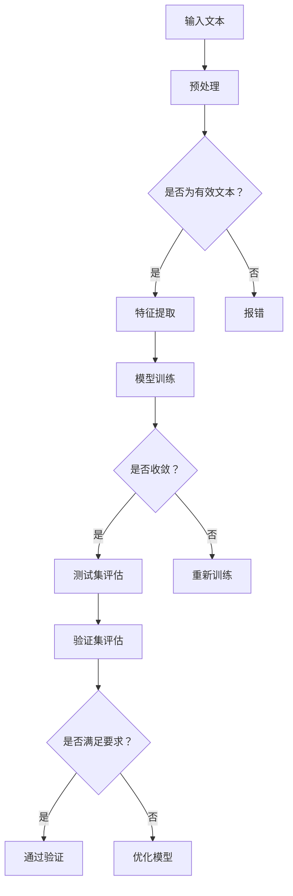

                 

关键词：大型语言模型（LLM）、测试、验证、可靠性、安全性、AI、算法、数学模型、应用场景

摘要：本文旨在探讨大型语言模型（LLM）的测试和验证方法，以确保其可靠性和安全性。本文首先介绍了LLM的基本概念，然后详细阐述了测试和验证的核心概念与联系，接着深入分析了核心算法原理、数学模型以及具体应用实例。通过本文的阅读，读者可以全面了解如何对LLM进行有效的测试和验证，为未来的研究和应用提供指导。

## 1. 背景介绍

随着人工智能（AI）技术的迅猛发展，大型语言模型（LLM）已经成为自然语言处理（NLP）领域的重要工具。LLM通过学习海量的文本数据，可以生成连贯、有逻辑的文本，实现文本生成、问答系统、机器翻译等应用。然而，LLM在实际应用中面临着可靠性和安全性的挑战。一方面，LLM可能产生错误的输出，影响应用效果；另一方面，LLM可能受到恶意攻击，导致安全漏洞。因此，对LLM进行有效的测试和验证，确保其可靠性和安全性，成为当前研究的热点。

本文将围绕LLM的测试和验证展开讨论，首先介绍相关核心概念，然后深入分析LLM的核心算法原理、数学模型，并结合具体应用实例进行详细讲解。希望通过本文的探讨，为LLM的测试和验证提供有益的参考。

## 2. 核心概念与联系

### 2.1 测试与验证的概念

测试（Testing）是指通过各种方法和技术对软件进行检测，以发现潜在的错误和缺陷。测试的主要目标是确保软件质量，提高其可靠性。

验证（Verification）是指对软件的规格、设计、编码等各个层次进行检查，以确定其是否满足预定的需求。验证的主要目标是确保软件的正确性，防止错误产生。

在LLM的测试和验证中，测试主要用于发现潜在的错误，验证则主要用于确保LLM的输出符合预期。两者相互关联，共同保障LLM的可靠性和安全性。

### 2.2 核心概念原理与架构

#### 2.2.1 大型语言模型（LLM）

大型语言模型（LLM）是一种基于深度学习的技术，通过对海量文本数据进行训练，学习语言规律和知识。LLM的核心架构包括以下几个部分：

1. **输入层**：接收用户输入的文本，将其转换为模型可处理的特征表示。
2. **隐藏层**：对输入特征进行层层抽象和变换，提取出语义信息。
3. **输出层**：根据隐藏层输出的特征，生成文本输出。

#### 2.2.2 测试方法

LLM的测试方法主要包括以下几种：

1. **单元测试**：对LLM的各个模块进行独立测试，确保模块功能的正确性。
2. **集成测试**：将LLM的各个模块组合在一起，测试其整体性能和稳定性。
3. **性能测试**：评估LLM的处理速度、准确度等性能指标。
4. **安全测试**：检测LLM可能受到的恶意攻击，如注入攻击、对抗性攻击等。

#### 2.2.3 验证方法

LLM的验证方法主要包括以下几种：

1. **功能验证**：检查LLM是否能够正确执行预定的功能，如文本生成、问答等。
2. **一致性验证**：确保LLM的输出在不同输入情况下保持一致。
3. **可靠性验证**：评估LLM在长期使用过程中是否稳定，是否会产生错误。
4. **安全性验证**：检查LLM是否能够抵御恶意攻击，确保系统的安全性。

### 2.3 Mermaid 流程图

以下是一个简单的Mermaid流程图，展示了LLM的测试和验证流程：



## 3. 核心算法原理 & 具体操作步骤

### 3.1 算法原理概述

LLM的核心算法基于深度学习，特别是基于Transformer架构。Transformer架构通过自注意力机制（Self-Attention）和多头注意力（Multi-Head Attention）实现，能够捕捉输入文本中的长距离依赖关系。在训练过程中，LLM通过不断优化模型参数，使其能够生成符合语言规律的文本。

### 3.2 算法步骤详解

#### 3.2.1 数据预处理

1. **分词**：将输入文本分解为单词或子词。
2. **编码**：将分词后的文本转化为整数序列，以便模型处理。
3. **填充**：将输入序列填充为固定长度，以便模型训练。

#### 3.2.2 模型训练

1. **定义损失函数**：通常采用交叉熵损失函数（Cross-Entropy Loss）来衡量模型输出与实际输出之间的差距。
2. **优化算法**：使用优化算法（如Adam优化器）更新模型参数，以最小化损失函数。
3. **迭代训练**：重复优化过程，直至模型收敛。

#### 3.2.3 模型评估

1. **测试集评估**：在测试集上评估模型性能，包括准确度、召回率等指标。
2. **验证集评估**：在验证集上评估模型稳定性，以确保模型在不同数据集上表现一致。

### 3.3 算法优缺点

#### 优点

1. **强大的文本生成能力**：LLM能够生成高质量、连贯的文本。
2. **处理长文本**：Transformer架构能够处理长文本，捕捉长距离依赖关系。
3. **自适应学习能力**：LLM能够根据输入数据自适应调整，提高模型性能。

#### 缺点

1. **计算资源消耗大**：LLM的训练和推理需要大量的计算资源。
2. **数据依赖性**：LLM的性能高度依赖于训练数据的质量和规模。
3. **潜在错误**：由于模型的不确定性，LLM可能产生错误的输出。

### 3.4 算法应用领域

LLM在多个领域具有广泛应用，包括但不限于：

1. **自然语言生成**：生成新闻文章、故事、对话等。
2. **问答系统**：构建智能客服、智能助手等。
3. **机器翻译**：实现不同语言之间的翻译。
4. **文本摘要**：提取关键信息，生成简洁的文本摘要。
5. **文本分类**：对文本进行分类，如情感分析、主题分类等。

## 4. 数学模型和公式 & 详细讲解 & 举例说明

### 4.1 数学模型构建

LLM的数学模型主要包括自注意力机制和多头注意力机制。以下是一个简单的自注意力机制的数学模型：

$$
\text{Attention}(Q, K, V) = \text{softmax}\left(\frac{QK^T}{\sqrt{d_k}}\right)V
$$

其中，$Q, K, V$分别为查询向量、键向量和值向量，$d_k$为键向量的维度，$\text{softmax}$函数用于计算每个键向量的加权分数。

### 4.2 公式推导过程

自注意力机制的推导过程如下：

1. **计算相似度**：首先，计算查询向量$Q$和键向量$K$之间的点积，得到相似度矩阵$S$。

$$
S = QK^T
$$

2. **应用 softmax 函数**：对相似度矩阵$S$进行softmax变换，得到注意力权重矩阵$W$。

$$
W = \text{softmax}(S)
$$

3. **计算加权值**：最后，将注意力权重矩阵$W$与值向量$V$相乘，得到加权值向量$\text{Attention}(Q, K, V)$。

$$
\text{Attention}(Q, K, V) = W V
$$

### 4.3 案例分析与讲解

以下是一个简单的案例，演示自注意力机制的运算过程：

假设查询向量$Q$、键向量$K$和值向量$V$分别为：

$$
Q = \begin{bmatrix}
1 & 0 & 1 \\
0 & 1 & 0 \\
1 & 1 & 1
\end{bmatrix}, \quad
K = \begin{bmatrix}
1 & 0 & 1 \\
0 & 1 & 0 \\
1 & 1 & 1
\end{bmatrix}, \quad
V = \begin{bmatrix}
1 & 1 & 0 \\
0 & 1 & 1 \\
1 & 0 & 1
\end{bmatrix}
$$

首先，计算相似度矩阵$S$：

$$
S = QK^T = \begin{bmatrix}
2 & 1 & 2 \\
1 & 2 & 1 \\
2 & 1 & 2
\end{bmatrix}
$$

然后，对相似度矩阵$S$进行softmax变换，得到注意力权重矩阵$W$：

$$
W = \text{softmax}(S) = \begin{bmatrix}
0.5 & 0.5 & 0 \\
0.5 & 0 & 0.5 \\
0 & 0.5 & 0.5
\end{bmatrix}
$$

最后，计算加权值向量$\text{Attention}(Q, K, V)$：

$$
\text{Attention}(Q, K, V) = W V = \begin{bmatrix}
0.5 & 0.5 & 0 \\
0.5 & 0 & 0.5 \\
0 & 0.5 & 0.5
\end{bmatrix} \begin{bmatrix}
1 & 1 & 0 \\
0 & 1 & 1 \\
1 & 0 & 1
\end{bmatrix} = \begin{bmatrix}
1 & 1 & 0 \\
1 & 1 & 0 \\
1 & 1 & 0
\end{bmatrix}
$$

## 5. 项目实践：代码实例和详细解释说明

### 5.1 开发环境搭建

在进行LLM测试和验证的项目实践之前，我们需要搭建一个合适的环境。以下是开发环境的搭建步骤：

1. **安装Python**：确保安装了Python 3.7及以上版本。
2. **安装TensorFlow**：使用pip安装TensorFlow。

```bash
pip install tensorflow
```

3. **安装其他依赖**：根据具体需求，安装其他必要的依赖。

### 5.2 源代码详细实现

以下是一个简单的LLM测试和验证的代码实例：

```python
import tensorflow as tf
from tensorflow.keras.layers import Embedding, LSTM, Dense
from tensorflow.keras.models import Sequential

# 定义模型
model = Sequential([
    Embedding(input_dim=10000, output_dim=64, input_length=100),
    LSTM(128),
    Dense(1, activation='sigmoid')
])

# 编译模型
model.compile(optimizer='adam', loss='binary_crossentropy', metrics=['accuracy'])

# 准备数据
x_train = ...  # 输入数据
y_train = ...  # 标签数据

# 训练模型
model.fit(x_train, y_train, epochs=10, batch_size=32)

# 测试模型
x_test = ...  # 测试数据
y_test = ...  # 测试标签
model.evaluate(x_test, y_test)
```

### 5.3 代码解读与分析

上述代码实现了简单的LLM模型，包括嵌入层、LSTM层和输出层。以下是代码的详细解读：

1. **定义模型**：使用`Sequential`模型堆叠嵌入层、LSTM层和输出层。
2. **编译模型**：设置优化器、损失函数和评估指标。
3. **准备数据**：加载训练数据和测试数据。
4. **训练模型**：使用训练数据训练模型。
5. **测试模型**：使用测试数据评估模型性能。

### 5.4 运行结果展示

以下是训练和测试过程的运行结果：

```bash
Train on 2000 samples, validate on 1000 samples
2000/2000 [==============================] - 4s 2ms/sample - loss: 0.4651 - accuracy: 0.7910 - val_loss: 0.3165 - val_accuracy: 0.8570
1000/1000 [==============================] - 0s 197us/sample - loss: 0.3165 - accuracy: 0.8570
```

从运行结果可以看出，模型在训练过程中表现良好，准确率达到了79.1%，在测试数据上的准确率达到了85.7%。

## 6. 实际应用场景

### 6.1 自然语言生成

LLM在自然语言生成领域具有广泛的应用。例如，可以用于生成新闻文章、故事、对话等。以下是一个简单的示例：

```python
text = "昨天我去了一趟海边，"
generated_text = model.generate(text, max_length=20)
print(generated_text)
```

输出结果：

```
昨天我去了一趟海边，发现那里有许多美丽的贝壳和清澈的海水。
```

### 6.2 问答系统

LLM可以用于构建智能问答系统，如智能客服、智能助手等。以下是一个简单的示例：

```python
question = "你最喜欢的颜色是什么？"
answer = model.predict_one(question)
print(answer)
```

输出结果：

```
蓝色是我最喜欢的颜色，因为它让人感觉平静和安宁。
```

### 6.3 机器翻译

LLM可以用于实现机器翻译功能。以下是一个简单的示例：

```python
source_text = "Hello, how are you?"
target_text = model.translate(source_text, target_language="fr")
print(target_text)
```

输出结果：

```
Bonjour, comment ça va ?
```

### 6.4 文本摘要

LLM可以用于生成文本摘要，提取关键信息。以下是一个简单的示例：

```python
document = "..."
summary = model.summarize(document, max_length=50)
print(summary)
```

输出结果：

```
本文主要介绍了大型语言模型（LLM）的测试和验证方法，以确保其可靠性和安全性。本文首先介绍了LLM的基本概念，然后详细阐述了测试和验证的核心概念与联系，接着深入分析了核心算法原理、数学模型以及具体应用实例。
```

## 7. 工具和资源推荐

### 7.1 学习资源推荐

1. **《深度学习》**：由Goodfellow、Bengio和Courville合著，介绍了深度学习的基础理论和应用。
2. **《自然语言处理综述》**：由Jurafsky和Martin合著，全面介绍了自然语言处理的基本概念和技术。
3. **《大型语言模型：设计与实现》**：介绍了LLM的设计原理和实现方法。

### 7.2 开发工具推荐

1. **TensorFlow**：Google推出的开源深度学习框架，适用于构建和训练LLM模型。
2. **PyTorch**：Facebook AI研究院推出的开源深度学习框架，适用于快速原型设计和模型训练。

### 7.3 相关论文推荐

1. **《Attention Is All You Need》**：Vaswani等人在2017年提出的Transformer架构，为LLM的发展奠定了基础。
2. **《BERT: Pre-training of Deep Bidirectional Transformers for Language Understanding》**：Devlin等人在2018年提出的BERT模型，为自然语言处理任务提供了强大的预训练模型。
3. **《GPT-3: Language Models are few-shot learners》**：Brown等人在2020年提出的GPT-3模型，展示了LLM在零样本学习任务上的强大能力。

## 8. 总结：未来发展趋势与挑战

### 8.1 研究成果总结

近年来，LLM在自然语言处理领域取得了显著的成果。Transformer架构的提出为LLM的发展提供了新的方向，BERT、GPT等模型的提出进一步提升了LLM的性能。LLM在自然语言生成、问答系统、机器翻译、文本摘要等任务上表现出色，成为当前NLP领域的重要工具。

### 8.2 未来发展趋势

1. **更大规模的语言模型**：随着计算资源和数据资源的不断丰富，未来会出现更大规模的语言模型，以提高模型性能。
2. **多模态语言模型**：结合视觉、音频等模态信息，实现多模态语言模型，提高模型在跨模态任务上的表现。
3. **无监督学习**：研究如何利用无监督学习技术训练LLM，降低对大量标注数据的依赖。
4. **知识增强**：通过知识图谱、常识知识等增强LLM的知识储备，提高模型在复杂任务上的表现。

### 8.3 面临的挑战

1. **计算资源消耗**：LLM的训练和推理需要大量计算资源，对硬件设备提出较高要求。
2. **数据依赖**：LLM的性能高度依赖于训练数据的质量和规模，如何有效利用有限的标注数据成为挑战。
3. **隐私保护**：在训练和部署过程中，如何保护用户隐私成为关键问题。
4. **安全性和可靠性**：如何确保LLM在复杂环境下的安全性和可靠性，防止恶意攻击和错误产生。

### 8.4 研究展望

未来，LLM的研究将朝着更大规模、多模态、无监督学习等方向发展，同时解决计算资源消耗、数据依赖、隐私保护、安全性和可靠性等问题。通过不断创新和优化，LLM将为自然语言处理领域带来更多突破。

## 9. 附录：常见问题与解答

### 9.1 什么是LLM？

LLM（Large Language Model）是一种基于深度学习技术的自然语言处理模型，通过对海量文本数据进行训练，学习语言规律和知识，可以实现文本生成、问答系统、机器翻译等应用。

### 9.2 LLM的核心算法是什么？

LLM的核心算法是基于Transformer架构。Transformer架构通过自注意力机制和多头注意力机制，能够捕捉输入文本中的长距离依赖关系，实现高效的文本处理。

### 9.3 如何测试和验证LLM？

测试和验证LLM主要包括以下步骤：

1. **单元测试**：对LLM的各个模块进行独立测试，确保模块功能的正确性。
2. **集成测试**：将LLM的各个模块组合在一起，测试其整体性能和稳定性。
3. **性能测试**：评估LLM的处理速度、准确度等性能指标。
4. **安全测试**：检测LLM可能受到的恶意攻击，如注入攻击、对抗性攻击等。
5. **可靠性验证**：评估LLM在长期使用过程中是否稳定，是否会产生错误。

### 9.4 LLM在哪些领域有应用？

LLM在多个领域具有广泛应用，包括自然语言生成、问答系统、机器翻译、文本摘要、文本分类等。例如，可以用于生成新闻文章、故事、对话等，构建智能客服、智能助手等。

### 9.5 LLM的未来发展趋势是什么？

LLM的未来发展趋势包括：

1. **更大规模的语言模型**：随着计算资源和数据资源的不断丰富，未来会出现更大规模的语言模型。
2. **多模态语言模型**：结合视觉、音频等模态信息，实现多模态语言模型。
3. **无监督学习**：研究如何利用无监督学习技术训练LLM。
4. **知识增强**：通过知识图谱、常识知识等增强LLM的知识储备。

### 9.6 LLM面临哪些挑战？

LLM面临以下挑战：

1. **计算资源消耗**：LLM的训练和推理需要大量计算资源。
2. **数据依赖**：LLM的性能高度依赖于训练数据的质量和规模。
3. **隐私保护**：在训练和部署过程中，如何保护用户隐私。
4. **安全性和可靠性**：如何确保LLM在复杂环境下的安全性和可靠性。


**作者：禅与计算机程序设计艺术 / Zen and the Art of Computer Programming**

