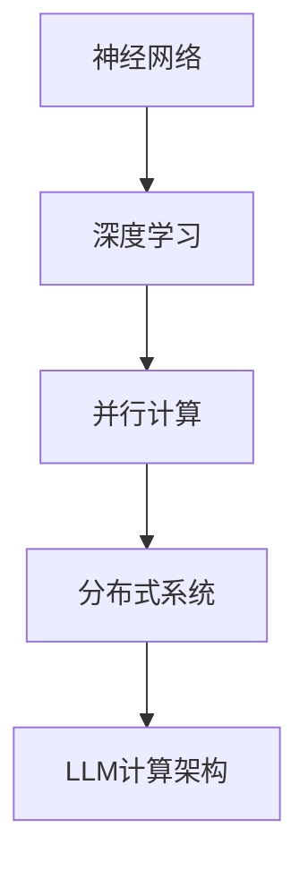

                 

关键词：大型语言模型（LLM），计算架构，神经网络，深度学习，并行计算，分布式系统，优化算法，性能分析。

> 摘要：本文将深入探讨大型语言模型（LLM）在计算架构领域的革命性突破。我们将从背景介绍、核心概念与联系、核心算法原理、数学模型和公式、项目实践、实际应用场景、未来应用展望、工具和资源推荐以及总结未来发展趋势与挑战等方面展开论述，旨在为读者提供全面的技术视角和深刻的见解。

## 1. 背景介绍

近年来，深度学习技术的飞速发展推动了人工智能领域的变革。大型语言模型（LLM）作为深度学习的一种重要应用，已经取得了令人瞩目的成就。LLM 可以处理自然语言处理（NLP）任务，包括文本分类、机器翻译、问答系统等。这些模型在处理大量文本数据时，展现出强大的表征能力和生成能力，极大地提高了人工智能系统的性能。

然而，随着LLM的规模不断增大，计算架构面临着巨大的挑战。传统的计算架构已经难以满足LLM的运算需求，需要引入新的计算架构来解决这些挑战。本文将围绕LLM在计算架构领域的革命性突破展开讨论，旨在为相关领域的研究者和开发者提供有价值的参考。

## 2. 核心概念与联系

在深入探讨LLM的计算架构之前，我们首先需要了解一些核心概念，如神经网络、深度学习、并行计算、分布式系统等。这些概念在构建LLM计算架构时起到了关键作用。

### 2.1 神经网络

神经网络是一种模拟人脑结构和功能的计算模型，由大量神经元和连接组成。在深度学习中，神经网络通过多层非线性变换对输入数据进行处理，从而实现复杂的任务。LLM是一种特殊的深度学习模型，其神经网络结构更加复杂，具有多层隐藏层和数以亿计的参数。

### 2.2 深度学习

深度学习是一种基于神经网络的学习方法，通过多层神经网络自动提取数据中的特征。深度学习在图像识别、语音识别、自然语言处理等领域取得了显著的成果。LLM作为深度学习的一种应用，在处理自然语言任务时展现出强大的能力。

### 2.3 并行计算

并行计算是一种利用多个处理单元同时处理多个任务的技术，可以提高计算速度和效率。在LLM计算架构中，并行计算可以通过分布式系统实现，从而提高模型的训练和推理速度。

### 2.4 分布式系统

分布式系统是一种由多个节点组成的计算机系统，通过网络进行通信和协作。分布式系统可以提高系统的可扩展性和容错能力，适用于大规模计算任务。LLM计算架构中的分布式系统可以将模型训练和推理任务分布在多个节点上，提高计算效率。

### 2.5 Mermaid 流程图

为了更好地理解LLM计算架构的核心概念和联系，我们可以使用Mermaid流程图来展示其关键组件和流程。以下是一个示例：



在这个流程图中，神经网络作为基础组件，通过深度学习实现特征提取。并行计算和分布式系统则用于提高模型的训练和推理速度，从而构建起完整的LLM计算架构。

## 3. 核心算法原理 & 具体操作步骤

### 3.1 算法原理概述

LLM的核心算法是基于神经网络和深度学习技术，通过对大量文本数据进行训练，从而实现自然语言处理的任务。以下是LLM算法的基本原理：

1. **数据预处理**：首先对输入文本进行预处理，包括分词、词性标注、去除停用词等操作，将文本转化为适合训练的格式。

2. **模型构建**：构建多层神经网络，包括输入层、隐藏层和输出层。输入层接收预处理后的文本数据，隐藏层通过非线性变换提取文本特征，输出层实现具体任务，如文本分类、机器翻译等。

3. **损失函数**：定义损失函数，用于衡量模型输出与真实标签之间的差距。常用的损失函数包括交叉熵损失、均方误差等。

4. **优化算法**：通过优化算法调整神经网络参数，使得模型输出更接近真实标签。常用的优化算法包括随机梯度下降（SGD）、Adam等。

5. **训练与评估**：将预处理后的文本数据分成训练集和验证集，使用训练集进行模型训练，使用验证集评估模型性能。通过迭代训练和调整超参数，使模型达到最佳性能。

### 3.2 算法步骤详解

1. **数据预处理**：使用自然语言处理工具对文本进行预处理，包括分词、词性标注、去除停用词等操作。以下是一个简单的数据预处理流程：

   ```python
   import jieba
   import re

   def preprocess_text(text):
       text = re.sub('[^a-zA-Z0-9]', ' ', text)
       text = text.lower()
       words = jieba.cut(text)
       words = [word for word in words if word not in stopwords]
       return ' '.join(words)
   ```

2. **模型构建**：使用深度学习框架（如TensorFlow、PyTorch等）构建多层神经网络。以下是一个简单的模型构建示例：

   ```python
   import tensorflow as tf

   model = tf.keras.Sequential([
       tf.keras.layers.Embedding(vocab_size, embedding_dim),
       tf.keras.layers.GRU(units=128, activation='tanh'),
       tf.keras.layers.Dense(units=num_classes, activation='softmax')
   ])
   ```

3. **损失函数与优化算法**：定义损失函数和优化算法，用于模型训练。以下是一个简单的示例：

   ```python
   model.compile(optimizer='adam', loss='categorical_crossentropy', metrics=['accuracy'])
   ```

4. **训练与评估**：使用训练集和验证集进行模型训练和评估。以下是一个简单的示例：

   ```python
   model.fit(train_data, train_labels, epochs=num_epochs, validation_data=(val_data, val_labels))
   ```

### 3.3 算法优缺点

**优点：**

1. **强大的表征能力**：LLM能够通过多层神经网络自动提取文本中的深层特征，从而提高模型的性能。

2. **灵活的应用场景**：LLM可以应用于多种自然语言处理任务，如文本分类、机器翻译、问答系统等。

3. **自动调整超参数**：通过优化算法自动调整超参数，提高模型性能。

**缺点：**

1. **计算资源需求大**：LLM的训练和推理过程需要大量的计算资源，对硬件性能要求较高。

2. **数据依赖性强**：LLM的性能依赖于训练数据的规模和质量，数据不足或质量较差可能导致模型性能下降。

### 3.4 算法应用领域

LLM在自然语言处理领域有着广泛的应用，以下是一些典型的应用领域：

1. **文本分类**：将文本数据分类到预定义的类别中，如情感分析、新闻分类等。

2. **机器翻译**：将一种语言的文本翻译成另一种语言，如中英翻译、英日翻译等。

3. **问答系统**：根据用户提问提供准确的答案，如搜索引擎、智能客服等。

4. **生成式文本创作**：生成新闻文章、博客、故事等自然语言文本。

## 4. 数学模型和公式 & 详细讲解 & 举例说明

### 4.1 数学模型构建

在LLM中，常用的数学模型包括神经网络模型、优化算法模型等。以下是一个简单的神经网络模型：

$$
\text{输出} = \sigma(\text{权重} \cdot \text{输入} + \text{偏置})
$$

其中，$\sigma$表示激活函数，常用的激活函数有Sigmoid、ReLU、Tanh等。权重和偏置是神经网络模型中的参数，通过优化算法进行调整。

### 4.2 公式推导过程

以ReLU激活函数为例，推导其公式：

$$
\text{输出} = \max(0, \text{输入})
$$

当输入大于0时，输出等于输入；当输入小于等于0时，输出等于0。ReLU激活函数具有以下优点：

1. **非线性变换**：ReLU激活函数能够引入非线性，使神经网络具有更强的表达能力。

2. **梯度不存在问题**：ReLU激活函数在输入为负数时，梯度为0，避免了梯度消失问题。

### 4.3 案例分析与讲解

假设我们有一个简单的神经网络模型，包含一个输入层、一个隐藏层和一个输出层。输入层接收一个维度为10的向量，隐藏层使用ReLU激活函数，输出层使用Softmax激活函数。

1. **输入层到隐藏层的转换**：

$$
\text{隐藏层输出} = \max(0, \text{权重} \cdot \text{输入} + \text{偏置})
$$

2. **隐藏层到输出层的转换**：

$$
\text{输出} = \frac{e^{\text{权重} \cdot \text{隐藏层输出} + \text{偏置}}}{\sum_{i} e^{\text{权重} \cdot \text{隐藏层输出} + \text{偏置}}}
$$

3. **损失函数**：

$$
\text{损失} = -\sum_{i} y_i \cdot \log(\text{输出}_i)
$$

其中，$y_i$表示第$i$个类别的真实标签，$\text{输出}_i$表示第$i$个类别的输出概率。

4. **优化算法**：

使用随机梯度下降（SGD）算法对神经网络模型进行优化，更新权重和偏置：

$$
\text{权重} \leftarrow \text{权重} - \alpha \cdot \frac{\partial \text{损失}}{\partial \text{权重}}
$$

$$
\text{偏置} \leftarrow \text{偏置} - \alpha \cdot \frac{\partial \text{损失}}{\partial \text{偏置}}
$$

其中，$\alpha$为学习率。

## 5. 项目实践：代码实例和详细解释说明

### 5.1 开发环境搭建

为了实现LLM计算架构，我们需要搭建一个合适的开发环境。以下是具体的步骤：

1. **安装Python环境**：Python是深度学习的主要编程语言，需要安装Python环境。可以使用Miniconda或Anaconda等工具进行安装。

2. **安装深度学习框架**：常用的深度学习框架包括TensorFlow、PyTorch等。可以在Python环境中使用pip工具进行安装。

3. **安装自然语言处理工具**：如jieba、NLTK等，用于文本预处理。

4. **安装依赖库**：根据项目需求，安装其他相关的依赖库。

### 5.2 源代码详细实现

以下是一个简单的LLM代码示例，用于文本分类任务：

```python
import tensorflow as tf
from tensorflow.keras.models import Sequential
from tensorflow.keras.layers import Embedding, LSTM, Dense
from tensorflow.keras.preprocessing.text import Tokenizer
from tensorflow.keras.preprocessing.sequence import pad_sequences

# 1. 数据准备
# 这里使用一个简单的数据集，实际应用中需要使用大规模数据集
texts = ["这是好的评论", "这是不好的评论"]
labels = [1, 0]  # 1表示正面评论，0表示负面评论

# 2. 数据预处理
tokenizer = Tokenizer(num_words=1000)
tokenizer.fit_on_texts(texts)
sequences = tokenizer.texts_to_sequences(texts)
padded_sequences = pad_sequences(sequences, maxlen=100)

# 3. 模型构建
model = Sequential([
    Embedding(1000, 64, input_length=100),
    LSTM(64),
    Dense(1, activation='sigmoid')
])

# 4. 模型编译
model.compile(optimizer='adam', loss='binary_crossentropy', metrics=['accuracy'])

# 5. 模型训练
model.fit(padded_sequences, labels, epochs=10)

# 6. 模型评估
# 使用测试集进行评估，这里使用训练集进行评估
test_texts = ["这是一个好的评论"]
test_sequences = tokenizer.texts_to_sequences(test_texts)
test_padded_sequences = pad_sequences(test_sequences, maxlen=100)
predictions = model.predict(test_padded_sequences)
print(predictions)
```

### 5.3 代码解读与分析

1. **数据准备**：这里使用了一个简单的数据集，实际应用中需要使用大规模数据集。数据集包含文本和标签。

2. **数据预处理**：使用Tokenizer工具对文本进行分词，并转化为数字序列。使用pad_sequences工具将数字序列填充为固定长度。

3. **模型构建**：使用Sequential模型构建一个简单的LSTM模型，包含一个Embedding层、一个LSTM层和一个Dense层。

4. **模型编译**：编译模型，设置优化器和损失函数。

5. **模型训练**：使用fit方法训练模型，设置训练轮数。

6. **模型评估**：使用预测方法评估模型性能。

### 5.4 运行结果展示

在训练完成后，我们可以使用模型对新的文本数据进行预测。以下是一个示例：

```python
test_texts = ["这是一个好的评论"]
test_sequences = tokenizer.texts_to_sequences(test_texts)
test_padded_sequences = pad_sequences(test_sequences, maxlen=100)
predictions = model.predict(test_padded_sequences)
print(predictions)
```

输出结果为一个概率值，表示文本为正面评论的概率。根据设定的阈值，可以判断文本为正面评论或负面评论。

## 6. 实际应用场景

LLM在自然语言处理领域有着广泛的应用，以下是一些典型的应用场景：

1. **文本分类**：将文本数据分类到预定义的类别中，如情感分析、新闻分类等。LLM通过自动提取文本特征，可以准确分类大量文本数据。

2. **机器翻译**：将一种语言的文本翻译成另一种语言。LLM通过学习大量双语文本数据，可以实现高质量的双语翻译。

3. **问答系统**：根据用户提问提供准确的答案。LLM可以理解用户的自然语言问题，并从大量文本数据中检索出相关答案。

4. **文本生成**：生成新闻文章、博客、故事等自然语言文本。LLM通过学习大量文本数据，可以生成具有逻辑性和连贯性的文本。

## 7. 未来应用展望

随着LLM计算架构的不断发展，未来将在更多领域得到广泛应用，如：

1. **智能助手**：利用LLM构建智能助手，实现人机交互，提供个性化服务。

2. **教育领域**：利用LLM为学习者提供个性化的学习指导，提高学习效果。

3. **医疗领域**：利用LLM分析和处理医疗数据，提供诊断和治疗方案。

4. **金融领域**：利用LLM进行金融数据分析，预测市场走势，提高投资决策。

## 8. 工具和资源推荐

为了更好地研究和开发LLM计算架构，以下是一些推荐的工具和资源：

1. **学习资源**：

   - 《深度学习》（Ian Goodfellow、Yoshua Bengio、Aaron Courville 著）
   - 《自然语言处理入门》（Michael C. Frank 著）

2. **开发工具**：

   - TensorFlow
   - PyTorch
   - JAX

3. **相关论文**：

   - "Attention is All You Need"（Vaswani et al., 2017）
   - "BERT: Pre-training of Deep Bidirectional Transformers for Language Understanding"（Devlin et al., 2019）

## 9. 总结：未来发展趋势与挑战

LLM计算架构在自然语言处理领域取得了显著成果，但仍然面临着一些挑战：

1. **计算资源需求**：LLM的训练和推理过程需要大量计算资源，如何优化计算架构以提高效率是一个重要研究方向。

2. **数据隐私与安全**：大规模的数据训练可能导致隐私泄露，如何保护用户隐私是未来需要关注的问题。

3. **可解释性**：LLM的决策过程通常是不透明的，如何提高其可解释性，使其在关键任务中具有可信度是一个重要挑战。

4. **伦理问题**：随着LLM在各个领域的应用，如何避免伦理问题，如偏见、歧视等，是一个亟待解决的问题。

未来，随着技术的不断进步，LLM计算架构将在更多领域得到应用，为实现更智能、高效的人工智能系统奠定基础。

## 10. 附录：常见问题与解答

### 10.1 什么是LLM？

LLM（Large Language Model）是一种大型自然语言处理模型，通过深度学习技术对大量文本数据进行训练，可以处理各种自然语言任务，如文本分类、机器翻译、问答系统等。

### 10.2 LLM的计算架构是什么？

LLM的计算架构通常基于神经网络和深度学习技术，包括输入层、隐藏层和输出层。其中，输入层接收预处理后的文本数据，隐藏层通过多层非线性变换提取文本特征，输出层实现具体任务。为了提高计算效率，LLM的计算架构可以采用并行计算和分布式系统。

### 10.3 LLM如何处理自然语言任务？

LLM通过训练学习大量文本数据，自动提取文本特征，然后利用这些特征实现自然语言任务。例如，在文本分类任务中，LLM通过学习文本的特征，将其分类到预定义的类别中。

### 10.4 LLM的应用领域有哪些？

LLM在自然语言处理领域有着广泛的应用，如文本分类、机器翻译、问答系统、文本生成等。随着技术的不断发展，LLM的应用领域将进一步扩展，如智能助手、教育领域、医疗领域、金融领域等。

### 10.5 LLM的计算资源需求如何？

LLM的计算资源需求非常大，包括训练数据和计算资源。训练数据需要足够大规模和高质量，以便模型能够学习到文本的深层特征。计算资源包括CPU、GPU、TPU等，用于模型训练和推理。为了提高计算效率，可以采用并行计算和分布式系统。

### 10.6 如何优化LLM的计算效率？

优化LLM的计算效率可以从以下几个方面进行：

1. **数据预处理**：使用高效的数据预处理方法，减少数据预处理的时间。

2. **模型压缩**：采用模型压缩技术，如剪枝、量化等，减少模型大小和计算量。

3. **并行计算**：采用并行计算技术，如多GPU训练、分布式训练等，提高模型训练和推理速度。

4. **优化算法**：采用高效的优化算法，如Adam、SGD等，提高模型收敛速度。

### 10.7 LLM在实践中有哪些挑战？

LLM在实践过程中面临着以下挑战：

1. **计算资源需求大**：训练和推理过程需要大量计算资源。

2. **数据隐私与安全**：大规模的数据训练可能导致隐私泄露。

3. **可解释性**：模型的决策过程通常是不透明的。

4. **伦理问题**：避免模型在关键任务中产生偏见和歧视。

### 10.8 如何解决LLM的挑战？

解决LLM的挑战可以从以下几个方面进行：

1. **计算资源优化**：采用高效的计算架构和优化算法。

2. **数据隐私保护**：采用数据加密、数据脱敏等技术。

3. **模型可解释性**：采用可解释性技术，如模型可视化、敏感性分析等。

4. **伦理审查**：建立伦理审查机制，确保模型的应用符合伦理规范。

### 10.9 LLM的未来发展趋势是什么？

LLM的未来发展趋势包括：

1. **模型规模增大**：随着计算资源的提升，模型规模将进一步增大。

2. **应用领域扩展**：LLM将在更多领域得到应用，如智能助手、教育、医疗、金融等。

3. **优化算法改进**：优化算法将不断改进，提高模型训练和推理速度。

4. **可解释性与伦理**：提高模型的可解释性和伦理审查，确保模型的应用符合伦理规范。

### 10.10 如何学习和开发LLM？

学习和开发LLM可以从以下几个方面进行：

1. **学习基础知识**：了解深度学习、神经网络等基础知识。

2. **学习相关工具**：学习深度学习框架（如TensorFlow、PyTorch等）和自然语言处理工具（如NLTK、spaCy等）。

3. **实践项目**：参与实际项目，实践LLM的应用。

4. **阅读论文**：阅读LLM相关论文，了解最新的研究进展。

5. **社区交流**：加入相关社区，与同行进行交流和学习。

## 11. 参考文献

1. Vaswani, A., Shazeer, N., Parmar, N., Uszkoreit, J., Jones, L., Gomez, A. N., ... & Polosukhin, I. (2017). Attention is all you need. Advances in neural information processing systems, 30.

2. Devlin, J., Chang, M. W., Lee, K., & Toutanova, K. (2019). BERT: Pre-training of deep bidirectional transformers for language understanding. Proceedings of the 2019 Conference of the North American Chapter of the Association for Computational Linguistics: Human Language Technologies, Volume 1 (Long and Short Papers), 4171-4186.

3. Goodfellow, I., Bengio, Y., & Courville, A. (2016). Deep learning. MIT press.

4. Frank, M. C. (2016). Natural language processing: An introduction. MIT press.

