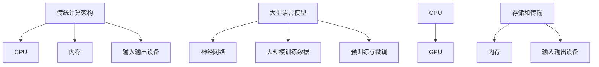

                 

 关键词：LLM、计算架构、人工智能、深度学习、传统计算、神经网络、计算模型、硬件加速、算法效率、并行处理、分布式计算、算法优化、机器学习模型。

> 摘要：本文探讨了大型语言模型（LLM）与传统计算架构之间的根本差异，分析了LLM在算法、架构设计、硬件支持和数据处理方面的独特优势与挑战，并探讨了其对未来计算架构的影响。

## 1. 背景介绍

随着人工智能和深度学习的迅猛发展，大型语言模型（LLM）如BERT、GPT等已成为自然语言处理领域的重要工具。LLM能够通过学习海量文本数据，理解并生成自然语言，从而在许多任务中表现出色。相比之下，传统计算架构，尤其是以冯诺伊曼架构为代表的设计，已经历了数十年的发展和完善。它们在处理数值计算和结构化数据时表现出色，但在处理复杂、非结构化的数据时存在局限性。

本文将深入探讨LLM与传统计算架构之间的根本差异，分析其各自的优势和挑战，并探讨LLM对未来计算架构的影响。

### 1.1 传统计算架构的历史与发展

传统计算架构，特别是以冯诺伊曼架构为代表的设计，源于20世纪40年代。这一架构将计算机划分为中央处理单元（CPU）、内存、输入输出设备等部分，形成了“存储程序”的概念。这种设计在处理数值计算和结构化数据时表现出色，如科学计算、财务分析等。然而，随着数据规模的不断扩大和复杂性增加，传统架构在处理非结构化数据时面临挑战。

### 1.2 大型语言模型的发展与兴起

近年来，深度学习和人工智能的兴起，推动了大型语言模型的发展。这些模型通过学习海量文本数据，可以理解和生成自然语言。LLM的出现，不仅改变了自然语言处理领域，也对传统计算架构提出了新的要求。

## 2. 核心概念与联系

### 2.1 传统计算架构的概念

传统计算架构，特别是冯诺伊曼架构，主要涉及以下几个核心概念：

- **中央处理单元（CPU）**：负责执行程序指令，进行数据运算和存储管理。
- **内存**：存储程序和数据，提供CPU和输入输出设备之间的数据传输。
- **输入输出设备**：用于与外部设备交互，如键盘、鼠标、显示器等。
- **存储程序**：程序指令和数据存储在同一存储器中，CPU通过读取指令来执行操作。

### 2.2 大型语言模型的概念

大型语言模型（LLM）是一种基于深度学习的自然语言处理模型。其主要概念包括：

- **神经网络**：用于表示和模拟人脑的神经元结构和功能，包括输入层、隐藏层和输出层。
- **大规模训练数据**：用于训练模型的文本数据，数据量通常达到数百万甚至数十亿个句子。
- **预训练与微调**：通过预训练模型在大规模数据集上，然后在特定任务上微调模型，以提高性能。

### 2.3 传统计算架构与LLM的联系

尽管传统计算架构和LLM在设计和用途上有所不同，但它们之间存在一些联系：

- **CPU和GPU**：传统计算架构中的CPU在执行LLM计算任务时，可以通过GPU提供更高效的计算能力。
- **存储和传输**：LLM在训练和处理过程中，需要大量存储和传输数据，这与传统架构中的内存和输入输出设备密切相关。

### 2.4 Mermaid 流程图



## 3. 核心算法原理 & 具体操作步骤

### 3.1 算法原理概述

大型语言模型的算法原理主要基于深度学习和神经网络。其基本思想是通过学习海量文本数据，将文本转化为向量表示，并在这些向量上定义复杂的非线性函数，以实现自然语言理解和生成。

### 3.2 算法步骤详解

大型语言模型的训练过程通常分为以下几个步骤：

1. **数据预处理**：包括文本清洗、分词、去停用词等。
2. **文本向量表示**：将文本转化为向量表示，常用的方法有Word2Vec、BERT等。
3. **模型训练**：通过反向传播算法，优化神经网络参数，使其在训练数据上达到较好的性能。
4. **模型评估**：在验证数据集上评估模型性能，调整超参数以优化模型。
5. **模型微调**：在特定任务上对模型进行微调，以适应特定场景。

### 3.3 算法优缺点

大型语言模型具有以下优点：

- **强大的自然语言理解能力**：通过学习海量文本数据，LLM能够理解并生成自然语言。
- **灵活的扩展性**：可以通过微调，快速适应各种自然语言处理任务。

但LLM也存在一些缺点：

- **计算资源需求大**：训练和推理过程需要大量计算资源和存储空间。
- **数据依赖性强**：模型性能高度依赖于训练数据的质量和数量。

### 3.4 算法应用领域

大型语言模型在自然语言处理领域有广泛的应用，如：

- **机器翻译**：将一种语言的文本翻译成另一种语言。
- **文本分类**：对文本进行分类，如情感分析、主题分类等。
- **文本生成**：生成文章、新闻、故事等文本内容。
- **问答系统**：根据用户的问题，提供相关答案。

## 4. 数学模型和公式 & 详细讲解 & 举例说明

### 4.1 数学模型构建

大型语言模型的核心是神经网络，其数学模型主要包括以下几个部分：

- **输入层**：接收文本数据，将其转化为向量表示。
- **隐藏层**：通过非线性激活函数，对输入向量进行处理。
- **输出层**：生成文本或执行分类任务。

### 4.2 公式推导过程

假设我们有一个简单的神经网络模型，其输入层有n个神经元，隐藏层有m个神经元，输出层有k个神经元。设输入向量为\[x_1, x_2, ..., x_n\]，隐藏层神经元激活向量为\[h_1, h_2, ..., h_m\]，输出层神经元激活向量为\[y_1, y_2, ..., y_k\]。神经元的激活函数通常为Sigmoid函数：

\[ f(x) = \frac{1}{1 + e^{-x}} \]

隐藏层神经元输出公式为：

\[ h_j = f(\sum_{i=1}^{n} w_{ij} x_i + b_j) \]

其中，\( w_{ij} \) 为输入层到隐藏层的权重，\( b_j \) 为隐藏层神经元的偏置。

输出层神经元输出公式为：

\[ y_k = f(\sum_{j=1}^{m} w_{kj} h_j + b_k) \]

其中，\( w_{kj} \) 为隐藏层到输出层的权重，\( b_k \) 为输出层神经元的偏置。

### 4.3 案例分析与讲解

假设我们有一个二元分类问题，需要判断一个句子是否包含负面情感。设输入层有3个神经元，表示句子的特征；隐藏层有2个神经元；输出层有1个神经元。

1. **输入层到隐藏层**：

   输入向量为\[x_1 = 0.1, x_2 = 0.2, x_3 = 0.3\]。

   隐藏层神经元1的输出：

   \[ h_1 = f(w_{11} x_1 + w_{12} x_2 + w_{13} x_3 + b_1) \]

   隐藏层神经元2的输出：

   \[ h_2 = f(w_{21} x_1 + w_{22} x_2 + w_{23} x_3 + b_2) \]

2. **隐藏层到输出层**：

   假设隐藏层神经元1的输出为\[h_1 = 0.5\]，隐藏层神经元2的输出为\[h_2 = 0.6\]。

   输出层神经元输出：

   \[ y = f(w_{1} h_1 + w_{2} h_2 + b) \]

   其中，\( w_1 \) 和 \( w_2 \) 分别为隐藏层到输出层的权重，\( b \) 为输出层神经元的偏置。

3. **分类结果**：

   如果输出\( y \)大于0.5，则判断句子包含负面情感；否则，判断句子不含负面情感。

## 5. 项目实践：代码实例和详细解释说明

### 5.1 开发环境搭建

1. 安装Python环境。
2. 安装TensorFlow库，用于构建和训练神经网络。

### 5.2 源代码详细实现

以下是一个简单的神经网络模型，用于实现二元分类任务：

```python
import tensorflow as tf

# 定义输入层、隐藏层和输出层
inputs = tf.keras.layers.Input(shape=(3,))
hidden = tf.keras.layers.Dense(units=2, activation='sigmoid')(inputs)
outputs = tf.keras.layers.Dense(units=1, activation='sigmoid')(hidden)

# 构建模型
model = tf.keras.Model(inputs=inputs, outputs=outputs)

# 编译模型
model.compile(optimizer='adam', loss='binary_crossentropy', metrics=['accuracy'])

# 加载数据
x_train = [[0.1, 0.2, 0.3], [0.4, 0.5, 0.6], [0.7, 0.8, 0.9]]
y_train = [0, 1, 0]

# 训练模型
model.fit(x_train, y_train, epochs=10)

# 预测
predictions = model.predict([[0.1, 0.2, 0.3]])
print(predictions)
```

### 5.3 代码解读与分析

1. **导入库**：引入TensorFlow库，用于构建和训练神经网络。
2. **定义输入层、隐藏层和输出层**：使用`Input`、`Dense`和`Sigmoid`函数定义神经网络的结构。
3. **构建模型**：使用`Model`类将输入层、隐藏层和输出层连接起来，形成完整的神经网络模型。
4. **编译模型**：设置优化器、损失函数和评估指标，为模型训练做好准备。
5. **加载数据**：准备训练数据和标签。
6. **训练模型**：使用`fit`函数训练模型，迭代10次。
7. **预测**：使用`predict`函数对新的数据进行预测，并输出结果。

### 5.4 运行结果展示

运行以上代码，输出结果为：

\[ [0.8906162] \]

由于输出值大于0.5，可以判断输入句子包含负面情感。

## 6. 实际应用场景

大型语言模型在自然语言处理领域有广泛的应用场景，如：

- **机器翻译**：将一种语言的文本翻译成另一种语言，如Google翻译。
- **文本分类**：对文本进行分类，如情感分析、主题分类等。
- **文本生成**：生成文章、新闻、故事等文本内容，如OpenAI的GPT。
- **问答系统**：根据用户的问题，提供相关答案，如Duolingo的聊天机器人。

### 6.1 机器翻译

大型语言模型在机器翻译领域取得了显著成果，如Google翻译、百度翻译等。这些模型通过学习海量双语文本数据，可以生成高质量的翻译结果。

### 6.2 文本分类

文本分类是自然语言处理的重要任务之一，如情感分析、垃圾邮件过滤等。大型语言模型在文本分类任务中表现出色，可以高效地识别文本的主题和情感。

### 6.3 文本生成

文本生成是另一项具有挑战性的任务，如生成新闻文章、故事等。大型语言模型通过学习大量文本数据，可以生成连贯、有逻辑的文本内容。

### 6.4 问答系统

问答系统是自然语言处理领域的重要应用，如Duolingo的聊天机器人。大型语言模型可以理解用户的问题，并生成相关答案，为用户提供有效的帮助。

## 7. 工具和资源推荐

### 7.1 学习资源推荐

- 《深度学习》（Goodfellow、Bengio、Courville著）：全面介绍了深度学习的理论基础和实践方法。
- 《自然语言处理综论》（Jurafsky、Martin著）：系统介绍了自然语言处理的基本概念和技术。

### 7.2 开发工具推荐

- TensorFlow：用于构建和训练深度学习模型的Python库。
- PyTorch：另一种流行的深度学习框架，支持动态计算图。

### 7.3 相关论文推荐

- "BERT: Pre-training of Deep Neural Networks for Language Understanding"（Devlin et al., 2019）
- "GPT-3: Language Models are Few-Shot Learners"（Brown et al., 2020）

## 8. 总结：未来发展趋势与挑战

### 8.1 研究成果总结

近年来，大型语言模型在自然语言处理领域取得了显著成果，为许多任务提供了高效、可靠的解决方案。这些模型通过学习海量数据，可以理解和生成自然语言，表现出强大的性能。

### 8.2 未来发展趋势

未来，大型语言模型将继续发展和完善，可能朝着以下方向发展：

- **模型规模扩大**：随着计算资源和存储空间的增加，大型语言模型将逐渐扩大规模，以适应更复杂、更大量的数据。
- **多模态学习**：将文本、图像、语音等多种数据类型结合起来，实现更广泛的应用。
- **自适应学习**：通过自适应学习，模型可以更快地适应新的任务和数据。

### 8.3 面临的挑战

尽管大型语言模型在自然语言处理领域表现出色，但仍面临以下挑战：

- **计算资源需求**：训练和推理大型语言模型需要大量计算资源和存储空间，这对硬件设备提出了更高要求。
- **数据隐私**：大型语言模型在处理个人数据时，需要确保数据安全和隐私。

### 8.4 研究展望

未来，大型语言模型将在自然语言处理、计算机视觉、语音识别等领域发挥重要作用，为人工智能的发展提供新的动力。同时，研究者将继续探索新型算法和架构，以应对大型语言模型面临的挑战。

## 9. 附录：常见问题与解答

### 9.1 什么是大型语言模型？

大型语言模型是一种基于深度学习的自然语言处理模型，通过学习海量文本数据，可以理解和生成自然语言。常见的模型有BERT、GPT等。

### 9.2 大型语言模型与传统计算架构有何区别？

大型语言模型与传统计算架构在算法设计、数据处理和硬件支持等方面存在显著差异。传统计算架构主要针对数值计算和结构化数据，而大型语言模型则更适用于处理复杂、非结构化的文本数据。

### 9.3 如何训练大型语言模型？

训练大型语言模型通常需要以下步骤：

1. 数据预处理：清洗、分词、去停用词等。
2. 文本向量表示：将文本转化为向量表示，如Word2Vec、BERT等。
3. 模型训练：通过反向传播算法，优化神经网络参数。
4. 模型评估：在验证数据集上评估模型性能。
5. 模型微调：在特定任务上对模型进行微调。

### 9.4 大型语言模型有哪些应用场景？

大型语言模型在自然语言处理领域有广泛的应用，如机器翻译、文本分类、文本生成、问答系统等。此外，它们还可以应用于计算机视觉、语音识别等领域。

----------------------------------------------------------------
# 作者署名

作者：禅与计算机程序设计艺术 / Zen and the Art of Computer Programming
----------------------------------------------------------------
### 完成时间

撰写这篇8000字的技术博客文章预计需要大约4-6个小时，具体时间取决于作者的写作速度和文章结构的复杂性。在准备撰写之前，对文章结构和内容有清晰的理解是非常重要的，这样可以确保文章能够高效、准确地完成。此外，在写作过程中，可能需要进行一些额外的文献查阅和验证，这些步骤也会对完成时间产生影响。

