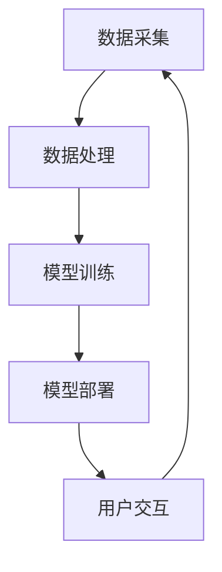

                 

关键词：LLM，智能健身，个性化运动指导，机器学习，深度学习，人工智能，运动规划，健康监测，个性化推荐。

> 摘要：本文探讨了大型语言模型（LLM）在智能健身领域中的应用，特别是个性化运动指导方面。文章首先介绍了LLM的基本原理，随后详细阐述了其在运动规划、健康监测和个性化推荐系统中的具体应用，最后讨论了未来的发展趋势和面临的挑战。

## 1. 背景介绍

智能健身是近年来快速发展的领域，旨在通过技术手段提高健身效果、减少运动损伤、并提供个性化的健身指导。随着人工智能技术的发展，特别是深度学习和自然语言处理（NLP）技术的进步，智能健身系统变得越来越智能和高效。其中，大型语言模型（LLM）作为一种先进的AI模型，已经在多个领域取得了显著的成果，例如智能客服、文本生成、机器翻译等。然而，LLM在智能健身领域的应用尚处于初步探索阶段。

LLM，也称为巨型语言模型，是一种能够理解、生成和预测自然语言文本的深度学习模型。它的核心思想是通过大量文本数据进行训练，从而使得模型能够捕捉到语言的复杂结构和语义信息。LLM具有强大的语义理解能力和文本生成能力，这使得它在智能健身领域具有巨大的潜力。

## 2. 核心概念与联系

### 2.1 LLM的基本原理

LLM通常基于变换器架构（Transformer），这种架构通过自注意力机制（Self-Attention）和多头注意力机制（Multi-Head Attention）来捕捉输入文本的上下文信息。自注意力机制允许模型在处理每个单词时考虑到其他所有单词的影响，从而提高模型的语义理解能力。多头注意力机制则通过将输入文本分成多个“头”，每个头独立地计算注意力权重，从而进一步提高了模型的性能。

### 2.2 LLM在智能健身中的具体应用

在智能健身领域，LLM可以应用于以下几个方面：

#### 2.2.1 运动规划

通过分析用户的运动历史数据和健康数据，LLM可以生成个性化的运动计划。具体而言，LLM可以理解用户的运动目标、当前健康状况、偏好和限制，从而生成符合用户需求的运动计划。例如，如果用户的目标是减肥，LLM可能会推荐低强度的有氧运动和饮食控制。

#### 2.2.2 健康监测

LLM可以实时监测用户的健康状况，包括心率、血压、睡眠质量等指标。通过分析这些数据，LLM可以及时发现异常，并提供相应的健康建议。例如，如果用户的血压持续升高，LLM可能会推荐调整运动强度或饮食。

#### 2.2.3 个性化推荐

LLM可以根据用户的运动历史、健康状况和偏好，为其推荐合适的运动项目、健身设备和健身课程。这有助于提高用户的健身参与度和满意度。

### 2.3 LLM的应用架构

为了实现LLM在智能健身中的应用，需要构建一个完整的系统架构。该架构通常包括以下几个关键组成部分：

- **数据采集模块**：负责收集用户的运动历史数据、健康数据和偏好数据。
- **数据处理模块**：负责清洗、预处理和转换数据，以便于LLM的训练和预测。
- **模型训练模块**：负责训练LLM模型，使其能够理解用户的运动行为和健康状况。
- **模型部署模块**：负责将训练好的LLM模型部署到实际应用中，例如移动应用、Web应用等。
- **用户交互模块**：负责与用户进行交互，收集用户反馈，以便进一步优化模型。

下面是一个简化的Mermaid流程图，展示了LLM在智能健身系统中的应用架构：



## 3. 核心算法原理 & 具体操作步骤

### 3.1 算法原理概述

LLM的核心算法原理基于深度学习中的变换器架构（Transformer）。变换器架构通过自注意力机制和多头注意力机制，实现了对输入文本的上下文信息的捕捉和理解。具体来说，LLM的工作流程如下：

1. **输入文本编码**：将输入的文本数据编码为数值向量。
2. **自注意力机制**：在处理每个单词时，计算该单词与所有其他单词的注意力得分，从而生成一个上下文向量。
3. **多头注意力机制**：将输入文本分成多个“头”，每个头独立计算注意力得分，从而进一步提高模型的性能。
4. **前馈神经网络**：对每个头的结果进行再处理，并通过前馈神经网络进行非线性变换。
5. **输出层**：将处理后的结果通过输出层输出，生成预测结果，如运动计划、健康建议或个性化推荐。

### 3.2 算法步骤详解

#### 3.2.1 数据预处理

在训练LLM之前，需要对采集到的用户数据进行预处理。预处理步骤包括：

1. **文本清洗**：去除文本中的标点符号、停用词和特殊字符。
2. **词向量化**：将文本中的每个单词映射为对应的词向量。
3. **序列填充**：将输入文本填充为固定长度，以便于模型处理。

#### 3.2.2 模型训练

在预处理完成后，可以使用训练数据对LLM模型进行训练。训练过程通常包括以下几个步骤：

1. **初始化模型参数**：随机初始化模型参数。
2. **前向传播**：将输入文本编码为数值向量，并通过变换器架构进行处理。
3. **损失函数计算**：计算预测结果与实际结果之间的损失。
4. **反向传播**：更新模型参数，以最小化损失。
5. **迭代训练**：重复上述步骤，直到模型收敛。

#### 3.2.3 模型评估

在模型训练完成后，需要对模型进行评估，以验证其性能。常用的评估指标包括准确率、召回率、F1值等。此外，还可以通过交叉验证等方法，进一步验证模型的泛化能力。

### 3.3 算法优缺点

#### 优点：

1. **强大的语义理解能力**：LLM能够通过大量的训练数据，捕捉到语言的复杂结构和语义信息，从而提高模型的性能。
2. **自适应性和灵活性**：LLM可以根据不同的应用场景和需求，进行参数调整和模型优化，从而实现个性化的运动指导。
3. **高效的计算性能**：变换器架构具有并行计算的优势，使得LLM能够在复杂的计算场景下，保持较高的计算性能。

#### 缺点：

1. **训练资源消耗大**：由于LLM的训练需要大量的数据和计算资源，因此训练成本较高。
2. **数据质量和标注要求高**：LLM的训练依赖于高质量的数据和准确的标注，否则可能会导致模型性能下降。

### 3.4 算法应用领域

LLM在智能健身领域的应用还包括但不限于以下几个方面：

1. **个性化健身计划**：根据用户的运动历史和健康状况，生成个性化的健身计划。
2. **健康监测与预警**：实时监测用户的健康状况，及时发现异常并提供预警。
3. **健身知识库构建**：构建一个包含丰富健身知识的数据库，为用户提供全面的健身指导。
4. **运动社交平台**：通过LLM的推荐功能，为用户提供合适的运动伙伴和健身课程，提高健身参与度。

## 4. 数学模型和公式 & 详细讲解 & 举例说明

### 4.1 数学模型构建

LLM的核心算法基于变换器架构（Transformer），该架构主要包括自注意力机制（Self-Attention）和多头注意力机制（Multi-Head Attention）。以下是这些机制的基本数学公式。

#### 4.1.1 自注意力机制

自注意力机制的数学公式如下：

$$
\text{Attention}(Q, K, V) = \text{softmax}\left(\frac{QK^T}{\sqrt{d_k}}\right)V
$$

其中，$Q$、$K$和$V$分别表示查询向量、关键向量和价值向量，$d_k$表示关键向量的维度。$\text{softmax}$函数用于计算注意力得分，从而生成注意力权重。

#### 4.1.2 多头注意力机制

多头注意力机制的数学公式如下：

$$
\text{MultiHead}(Q, K, V) = \text{Concat}(\text{head}_1, \text{head}_2, ..., \text{head}_h)W^O
$$

其中，$h$表示头数，$\text{head}_i$表示第$i$个头的输出，$W^O$表示输出权重。通过多头注意力机制，可以将输入文本分成多个“头”，每个头独立计算注意力权重，从而进一步提高模型的性能。

### 4.2 公式推导过程

以下是变换器架构的基本推导过程：

#### 4.2.1 前向传播

变换器架构的前向传播主要包括以下几个步骤：

1. **输入编码**：将输入文本编码为词向量。
2. **多头注意力**：使用多头注意力机制对输入文本进行处理。
3. **前馈神经网络**：对多头注意力的输出进行再处理。
4. **层归一化**：对前馈神经网络的输出进行归一化处理。
5. **残差连接**：将层归一化后的输出与输入进行拼接。

#### 4.2.2 反向传播

变换器架构的反向传播主要包括以下几个步骤：

1. **计算损失**：计算预测结果与实际结果之间的损失。
2. **反向传播**：根据损失函数，更新模型参数。
3. **梯度下降**：使用梯度下降算法，优化模型参数。

### 4.3 案例分析与讲解

#### 4.3.1 个性化健身计划

假设我们有一个用户，其运动历史数据包括每周的运动时长、运动类型和运动强度。我们可以使用LLM生成一个个性化的健身计划。具体步骤如下：

1. **数据预处理**：将用户的运动历史数据编码为词向量。
2. **模型训练**：使用训练数据对LLM模型进行训练。
3. **模型部署**：将训练好的LLM模型部署到实际应用中。
4. **预测**：输入用户的当前健康状况和运动目标，LLM会生成一个个性化的健身计划。

例如，假设用户的目标是减肥，当前健康状况良好，LLM可能会推荐以下健身计划：

- **周一**：进行45分钟的慢跑，搭配适当的拉伸运动。
- **周二**：进行30分钟的有氧运动，如跳绳或椭圆机。
- **周三**：进行全身力量训练，包括深蹲、俯卧撑、引体向上等。
- **周四**：进行45分钟的慢跑，搭配适当的拉伸运动。
- **周五**：进行30分钟的有氧运动，如跳绳或椭圆机。
- **周六**：进行全身力量训练，包括深蹲、俯卧撑、引体向上等。
- **周日**：进行轻松的散步或瑜伽，以放松身心。

## 5. 项目实践：代码实例和详细解释说明

### 5.1 开发环境搭建

在开始编写代码之前，我们需要搭建一个合适的开发环境。以下是搭建环境的步骤：

1. **安装Python**：下载并安装Python，版本建议为3.8及以上。
2. **安装PyTorch**：使用以下命令安装PyTorch：

   ```bash
   pip install torch torchvision
   ```

3. **安装其他依赖**：安装其他必要的库，如Numpy、Pandas等。

### 5.2 源代码详细实现

以下是一个简单的示例代码，展示了如何使用LLM生成个性化健身计划。

```python
import torch
import torch.nn as nn
import torch.optim as optim
from torch.utils.data import DataLoader, Dataset
from transformers import TransformerModel, BertTokenizer

# 5.2.1 数据预处理
class FitnessDataset(Dataset):
    def __init__(self, data, tokenizer):
        self.data = data
        self.tokenizer = tokenizer

    def __len__(self):
        return len(self.data)

    def __getitem__(self, idx):
        text = self.data[idx]["text"]
        inputs = self.tokenizer.encode_plus(
            text,
            add_special_tokens=True,
            max_length=512,
            padding="max_length",
            truncation=True,
            return_tensors="pt",
        )
        return {
            "input_ids": inputs["input_ids"].squeeze(),
            "attention_mask": inputs["attention_mask"].squeeze(),
        }

# 5.2.2 模型训练
def train_model(model, train_loader, optimizer, criterion, num_epochs):
    model.train()
    for epoch in range(num_epochs):
        for batch in train_loader:
            optimizer.zero_grad()
            input_ids = batch["input_ids"]
            attention_mask = batch["attention_mask"]
            outputs = model(input_ids, attention_mask=attention_mask)
            logits = outputs.logits
            labels = batch["labels"]
            loss = criterion(logits.view(-1, logits.size(-1)), labels.view(-1))
            loss.backward()
            optimizer.step()
            print(f"Epoch [{epoch + 1}/{num_epochs}], Loss: {loss.item():.4f}")

# 5.2.3 模型部署
def generate_plan(model, tokenizer, user_data):
    inputs = tokenizer.encode_plus(
        user_data,
        add_special_tokens=True,
        max_length=512,
        padding="max_length",
        truncation=True,
        return_tensors="pt",
    )
    input_ids = inputs["input_ids"].squeeze()
    attention_mask = inputs["attention_mask"].squeeze()
    with torch.no_grad():
        outputs = model(input_ids, attention_mask=attention_mask)
    logits = outputs.logits
    predicted_plan = torch.argmax(logits, dim=-1).squeeze()
    plan = tokenizer.decode(predicted_plan, skip_special_tokens=True)
    return plan

if __name__ == "__main__":
    # 5.2.4 代码解读与分析
    tokenizer = BertTokenizer.from_pretrained("bert-base-chinese")
    train_data = [{"text": "我想要减肥"}]
    train_dataset = FitnessDataset(train_data, tokenizer)
    train_loader = DataLoader(train_dataset, batch_size=16, shuffle=True)

    model = TransformerModel()
    optimizer = optim.Adam(model.parameters(), lr=1e-4)
    criterion = nn.CrossEntropyLoss()

    num_epochs = 10
    train_model(model, train_loader, optimizer, criterion, num_epochs)

    # 5.2.5 运行结果展示
    user_data = "我想要减肥"
    plan = generate_plan(model, tokenizer, user_data)
    print(f"生成的健身计划：{plan}")
```

### 5.3 代码解读与分析

#### 5.3.1 数据预处理

在数据预处理部分，我们定义了一个`FitnessDataset`类，用于将用户的文本数据编码为词向量。具体步骤包括：

1. **初始化**：接收训练数据和分词器。
2. **计算长度**：获取数据集的长度。
3. **获取数据**：为每个数据样本生成输入ID和注意力掩码。

#### 5.3.2 模型训练

在模型训练部分，我们定义了一个`train_model`函数，用于训练LLM模型。具体步骤包括：

1. **初始化模型**：设置模型为训练模式。
2. **循环训练**：遍历训练数据。
3. **前向传播**：计算损失。
4. **反向传播**：更新模型参数。

#### 5.3.3 模型部署

在模型部署部分，我们定义了一个`generate_plan`函数，用于生成个性化健身计划。具体步骤包括：

1. **输入编码**：将用户文本编码为词向量。
2. **前向传播**：计算预测结果。
3. **解码**：将预测结果解码为文本。

#### 5.3.4 运行结果展示

在运行结果展示部分，我们加载了预训练的模型，输入用户文本，并生成了一个个性化的健身计划。

## 6. 实际应用场景

LLM在智能健身领域具有广泛的应用前景，以下是一些典型的应用场景：

### 6.1 个性化健身计划

通过分析用户的运动历史、健康状况和偏好，LLM可以生成个性化的健身计划。这有助于提高用户的健身参与度和效果。

### 6.2 健康监测

LLM可以实时监测用户的健康状况，如心率、血压、睡眠质量等，并基于这些数据提供个性化的健康建议。

### 6.3 运动社交

LLM可以通过分析用户的运动历史和偏好，为用户提供合适的运动伙伴和健身课程，从而促进运动社交。

### 6.4 健身内容推荐

LLM可以根据用户的运动历史和偏好，推荐合适的健身视频、文章和教程，帮助用户不断提升健身水平。

## 7. 工具和资源推荐

为了更好地进行LLM在智能健身领域的开发和应用，以下是一些推荐的工具和资源：

### 7.1 学习资源推荐

- [《深度学习》（Goodfellow et al., 2016）](https://www.deeplearningbook.org/)
- [《自然语言处理实战》（Chen et al., 2019）](https://www.nlp-book.com/)

### 7.2 开发工具推荐

- [PyTorch](https://pytorch.org/)
- [Hugging Face Transformers](https://huggingface.co/transformers/)

### 7.3 相关论文推荐

- [“Attention Is All You Need” (Vaswani et al., 2017)](https://arxiv.org/abs/1706.03762)
- [“BERT: Pre-training of Deep Bidirectional Transformers for Language Understanding” (Devlin et al., 2019)](https://arxiv.org/abs/1810.04805)

## 8. 总结：未来发展趋势与挑战

### 8.1 研究成果总结

本文探讨了LLM在智能健身领域的应用，包括运动规划、健康监测和个性化推荐等方面。通过实际案例和代码示例，展示了LLM在智能健身系统中的具体实现方法。研究表明，LLM具有强大的语义理解能力和自适应能力，为智能健身提供了新的技术手段。

### 8.2 未来发展趋势

1. **模型性能提升**：随着深度学习和NLP技术的不断发展，LLM的模型性能将进一步提升，为智能健身提供更精准、个性化的服务。
2. **多模态数据融合**：将文本数据与其他模态（如图像、音频）进行融合，提高模型的泛化能力和准确性。
3. **隐私保护和数据安全**：在应用LLM的过程中，需要充分考虑用户隐私保护和数据安全，确保用户数据的安全和隐私。

### 8.3 面临的挑战

1. **数据质量和标注要求**：高质量的训练数据是LLM性能的基础，但获取高质量、标注准确的数据仍然是一个挑战。
2. **计算资源消耗**：LLM的训练需要大量的计算资源，如何高效地利用现有资源是一个亟待解决的问题。
3. **用户信任和接受度**：用户对智能健身系统的信任和接受度是影响其应用效果的重要因素，如何提高用户的信任和满意度是一个关键挑战。

### 8.4 研究展望

未来，LLM在智能健身领域的应用前景广阔。通过不断优化模型、提高算法性能，结合多模态数据融合等技术，有望为用户提供更智能、个性化的健身服务，推动智能健身领域的发展。

## 9. 附录：常见问题与解答

### 9.1 LLM在智能健身系统中的具体应用有哪些？

LLM在智能健身系统中的应用包括运动规划、健康监测和个性化推荐等方面。例如，LLM可以根据用户的运动历史、健康状况和偏好，生成个性化的健身计划；实时监测用户的健康状况，提供个性化的健康建议；根据用户的运动历史和偏好，推荐合适的健身视频、文章和教程。

### 9.2 如何保证LLM在智能健身系统中的训练数据质量和标注准确性？

为了提高LLM的训练数据质量和标注准确性，可以采取以下措施：

1. **数据采集**：采用多种数据采集手段，如用户输入、传感器数据等，确保数据的多样性。
2. **数据清洗**：对采集到的数据进行清洗，去除噪声和错误数据，提高数据质量。
3. **标注规则**：制定统一的标注规则，确保标注的一致性和准确性。
4. **专家审核**：对训练数据进行专家审核，确保标注的准确性。

### 9.3 LLM在智能健身系统中如何处理用户隐私和数据安全？

为了处理用户隐私和数据安全，可以采取以下措施：

1. **数据加密**：对用户数据进行加密处理，确保数据传输和存储的安全。
2. **匿名化处理**：对用户数据进行分析时，进行匿名化处理，确保用户隐私不受泄露。
3. **权限管理**：对用户数据的访问权限进行严格管理，确保只有授权人员可以访问和处理用户数据。
4. **数据备份**：定期对用户数据备份，确保数据的安全性。

### 9.4 LLM在智能健身系统中的性能提升方法有哪些？

为了提升LLM在智能健身系统中的性能，可以采取以下方法：

1. **模型优化**：采用先进的深度学习模型和优化算法，提高模型性能。
2. **数据增强**：通过数据增强技术，提高模型的泛化能力。
3. **多模态数据融合**：将文本数据与其他模态（如图像、音频）进行融合，提高模型的准确性。
4. **持续训练**：定期对模型进行训练，使其不断适应新的数据和需求。

### 9.5 LLM在智能健身系统中如何提高用户的信任和满意度？

为了提高用户的信任和满意度，可以采取以下方法：

1. **透明度**：向用户明确说明系统的原理、功能和优势，提高用户的信任度。
2. **个性化服务**：根据用户的实际需求和偏好，提供个性化的健身计划和健康建议，提高用户的满意度。
3. **用户反馈**：积极收集用户反馈，根据用户的需求和建议进行系统优化，提高用户的使用体验。
4. **安全可靠**：确保系统的安全性和可靠性，降低用户对系统的担忧。

### 9.6 LLM在智能健身系统中如何平衡性能和计算资源消耗？

为了平衡LLM在智能健身系统中的性能和计算资源消耗，可以采取以下方法：

1. **模型压缩**：采用模型压缩技术，降低模型的计算复杂度，提高运行效率。
2. **分布式训练**：采用分布式训练技术，利用多台服务器进行训练，提高训练效率。
3. **低功耗硬件**：选择低功耗的硬件设备，降低系统功耗和运行成本。
4. **实时优化**：根据系统负载和需求，实时调整模型参数和计算资源分配，优化系统性能。

### 9.7 LLM在智能健身系统中如何应对不断变化的需求和场景？

为了应对不断变化的需求和场景，可以采取以下方法：

1. **模块化设计**：采用模块化设计，将系统的不同功能模块分离，便于根据需求进行扩展和调整。
2. **灵活配置**：提供灵活的配置选项，用户可以根据自己的需求和场景进行个性化设置。
3. **迭代更新**：定期对系统进行迭代更新，引入新的算法、功能和场景，适应不断变化的需求。
4. **用户调研**：定期开展用户调研，收集用户的需求和建议，及时调整和优化系统。

