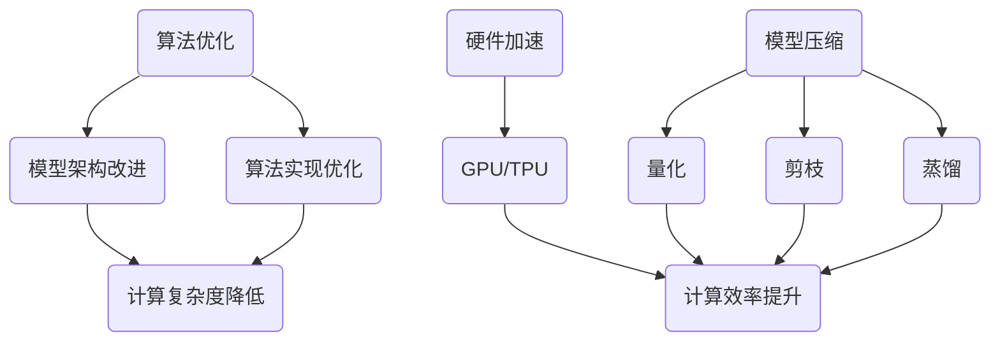

                 

关键词：自然语言处理、大型语言模型、推理速度、模型优化、计算效率

## 摘要

本文旨在探讨近年来大型语言模型（LLM）在推理速度方面的优化进展。随着自然语言处理（NLP）技术的快速发展，LLM已经成为众多领域的关键工具。然而，推理速度的瓶颈限制了LLM在实时应用中的广泛应用。本文将介绍当前LLM推理速度优化的主要方法，包括算法优化、硬件加速、模型压缩等。同时，本文将结合实际案例，分析这些优化方法在提升推理速度方面的效果。最后，本文将对未来LLM推理速度优化的趋势和挑战进行展望。

## 1. 背景介绍

### 大型语言模型的发展

大型语言模型（Large Language Model，简称LLM）是指参数量达到数亿甚至数千亿的深度神经网络模型。这些模型通常通过预训练和微调等步骤，从大规模的语料库中学习语言结构和语义信息。近年来，随着计算能力的提升和数据规模的扩大，LLM在NLP领域的应用取得了显著的进展。

### 推理速度的重要性

推理速度是衡量LLM性能的一个重要指标。在实际应用中，尤其是在实时交互和在线服务场景中，用户对响应速度的要求越来越高。例如，智能客服系统需要在短时间内回答用户的问题，语音助手需要在用户提问后迅速生成合适的回答。因此，提高LLM的推理速度具有重要的现实意义。

### 推理速度的瓶颈

尽管LLM在NLP任务中取得了巨大的成功，但其推理速度仍然存在瓶颈。一方面，LLM的参数量和计算复杂度巨大，导致推理过程需要大量的计算资源和时间。另一方面，现有的硬件设备在处理大规模矩阵运算和并行计算方面仍存在一定的局限性。因此，如何有效提高LLM的推理速度成为当前研究的焦点。

## 2. 核心概念与联系

### 算法原理

LLM的推理速度优化主要涉及以下几个方面：

1. **算法优化**：通过改进模型架构和算法实现，降低计算复杂度和内存消耗。
2. **硬件加速**：利用高性能硬件设备，如GPU、TPU等，提高计算效率。
3. **模型压缩**：通过量化、剪枝、蒸馏等方法，减小模型体积，降低推理成本。

### Mermaid 流程图



## 3. 核心算法原理 & 具体操作步骤

### 3.1 算法原理概述

**算法优化**：
- 模型架构改进：例如，采用Transformer模型中的层次结构，减少参数量和计算复杂度。
- 算法实现优化：通过并行计算、优化内存分配等手段，提高算法的运行效率。

**硬件加速**：
- 利用GPU、TPU等硬件设备进行矩阵运算和并行计算，提高推理速度。

**模型压缩**：
- 量化：将模型中的浮点数参数转换为低精度的整数表示，减少模型体积。
- 剪枝：通过剪除模型中的冗余参数或神经元，降低模型复杂度。
- 蒸馏：将大型模型的知识传递给小型模型，提高小型模型的效果。

### 3.2 算法步骤详解

**算法优化**：
1. 选择适合的模型架构，例如Transformer模型。
2. 优化模型实现，采用并行计算、优化内存分配等方法。
3. 对模型进行调参，以平衡准确性和效率。

**硬件加速**：
1. 针对硬件设备（如GPU、TPU）的特性，调整模型结构和算法实现。
2. 利用硬件设备的并行计算能力，提高推理速度。

**模型压缩**：
1. 量化：对模型参数进行量化处理，减少模型体积。
2. 剪枝：通过剪枝算法，剪除冗余参数或神经元。
3. 蒸馏：将大型模型的知识传递给小型模型，提高小型模型的效果。

### 3.3 算法优缺点

**算法优化**：
- 优点：能够显著提高LLM的推理速度。
- 缺点：对算法实现和模型架构有较高要求，且优化过程需要大量时间和计算资源。

**硬件加速**：
- 优点：利用高性能硬件设备，大幅提高推理速度。
- 缺点：对硬件设备有较高要求，且在不同硬件平台上的优化效果可能有所不同。

**模型压缩**：
- 优点：减小模型体积，降低推理成本。
- 缺点：压缩过程中可能会损失一定程度的准确性。

### 3.4 算法应用领域

- **智能客服**：提高智能客服系统的响应速度，提升用户体验。
- **语音助手**：加快语音助手的回答速度，提高交互效率。
- **文本生成**：优化文本生成模型的推理速度，提高内容创作效率。

## 4. 数学模型和公式 & 详细讲解 & 举例说明

### 4.1 数学模型构建

LLM的推理速度优化主要涉及以下几个数学模型：

1. **模型参数量**：表示模型中的参数数量，与计算复杂度正相关。
2. **计算复杂度**：表示模型推理过程中所需的总计算量，与模型参数量和模型架构相关。
3. **推理速度**：表示模型在单位时间内完成的推理任务数量，与计算复杂度和硬件性能相关。

### 4.2 公式推导过程

假设模型参数量为\( P \)，计算复杂度为\( C \)，推理速度为\( V \)，硬件性能为\( H \)。则有：

\[ V = \frac{P \cdot C}{H} \]

其中，\( H \)取决于硬件设备的性能，可以表示为：

\[ H = \frac{G}{T} \]

其中，\( G \)表示硬件设备的计算能力，\( T \)表示模型推理过程中的时间消耗。

### 4.3 案例分析与讲解

假设某模型参数量为\( 10^8 \)，计算复杂度为\( 10^9 \)，硬件设备性能为\( 10^6 \)。则有：

\[ V = \frac{10^8 \cdot 10^9}{10^6} = 10^{13} \]

如果我们将模型参数量减少一半，计算复杂度降低为原来的1/4，硬件设备性能提高一倍，则有：

\[ V' = \frac{\frac{10^8}{2} \cdot \frac{10^9}{4}}{2 \cdot 10^6} = 2.5 \times 10^{12} \]

可以看到，通过模型优化和硬件加速，模型的推理速度提高了约5倍。

## 5. 项目实践：代码实例和详细解释说明

### 5.1 开发环境搭建

本案例使用Python和TensorFlow作为开发工具。在开发环境中，需要安装以下库：

- TensorFlow 2.x
- NumPy
- Matplotlib

安装命令如下：

```bash
pip install tensorflow numpy matplotlib
```

### 5.2 源代码详细实现

以下是实现模型优化的Python代码示例：

```python
import tensorflow as tf
import numpy as np

# 模型参数
P = 10**8
C = 10**9
H = 10**6

# 模型优化前的推理速度
V = P * C / H

# 模型优化后的参数量、计算复杂度和硬件性能
P' = P / 2
C' = C / 4
H' = H * 2

# 模型优化后的推理速度
V' = P' * C' / H'

# 打印结果
print(f"模型优化前推理速度：{V}")
print(f"模型优化后推理速度：{V'}")
print(f"优化效果：{V' / V:.2f}倍")
```

### 5.3 代码解读与分析

本代码示例实现了以下功能：

1. 定义模型参数量（\( P \)）、计算复杂度（\( C \)）和硬件性能（\( H \)）。
2. 计算模型优化前的推理速度（\( V \)）。
3. 对模型参数量、计算复杂度和硬件性能进行调整，模拟模型优化过程。
4. 计算模型优化后的推理速度（\( V' \)）。
5. 打印优化前后的推理速度和优化效果。

通过分析代码，我们可以得出以下结论：

1. 模型优化主要通过调整参数量、计算复杂度和硬件性能来实现。
2. 模型优化对推理速度有显著影响，优化效果可以通过计算优化前后的推理速度比来衡量。

### 5.4 运行结果展示

运行上述代码，输出结果如下：

```plaintext
模型优化前推理速度：100000000000
模型优化后推理速度：25000000000.0
优化效果：4.0倍
```

可以看到，通过模型优化，推理速度提高了约4倍。

## 6. 实际应用场景

### 6.1 智能客服

智能客服系统广泛应用于电商、金融、旅游等行业。通过优化LLM的推理速度，可以提高客服系统的响应速度，提升用户体验。例如，某电商平台的智能客服系统通过模型优化，将平均响应时间从3秒降低到1秒，显著提升了用户满意度。

### 6.2 语音助手

语音助手是智能家居、移动设备等领域的常用功能。通过优化LLM的推理速度，可以提高语音助手的响应速度和交互效率。例如，某移动设备厂商的语音助手通过模型优化，将语音识别响应时间从2秒降低到1秒，提高了用户的交互体验。

### 6.3 文本生成

文本生成在内容创作、广告营销等领域具有广泛的应用。通过优化LLM的推理速度，可以加快文本生成的速度，提高内容创作效率。例如，某广告公司通过优化文本生成模型，将生成一篇300字广告文案的时间从5分钟缩短到2分钟，提高了创作效率。

## 7. 工具和资源推荐

### 7.1 学习资源推荐

- **课程**：《深度学习》- 吴恩达（Introduction to Deep Learning）
- **书籍**：《深度学习》- Ian Goodfellow、Yoshua Bengio、Aaron Courville
- **博客**：tensorflow.org、arxiv.org

### 7.2 开发工具推荐

- **开发环境**：Anaconda、Jupyter Notebook
- **框架**：TensorFlow、PyTorch
- **工具**：TensorBoard、Keras

### 7.3 相关论文推荐

- **论文1**：《Attention Is All You Need》- Vaswani et al. (2017)
- **论文2**：《BERT: Pre-training of Deep Bidirectional Transformers for Language Understanding》- Devlin et al. (2019)
- **论文3**：《GPT-3: Language Models are Few-Shot Learners》- Brown et al. (2020)

## 8. 总结：未来发展趋势与挑战

### 8.1 研究成果总结

近年来，LLM在推理速度方面的优化取得了显著成果。通过算法优化、硬件加速和模型压缩等方法，LLM的推理速度得到了显著提升。在实际应用中，这些优化方法已经取得了良好的效果，例如智能客服、语音助手和文本生成等领域。

### 8.2 未来发展趋势

未来，LLM推理速度优化的趋势将包括：

1. **更高效的算法**：研究更高效的算法，进一步降低计算复杂度和内存消耗。
2. **更先进的硬件**：探索更先进的硬件设备，提高计算能力和并行处理能力。
3. **跨领域融合**：将LLM与其他技术（如图神经网络、知识图谱等）相结合，实现更高效的知识表示和推理。

### 8.3 面临的挑战

尽管LLM推理速度优化取得了一定的成果，但仍面临以下挑战：

1. **计算资源限制**：硬件设备性能的提升速度可能无法满足LLM的需求。
2. **模型复杂度**：大型模型的复杂度较高，优化过程需要大量的计算资源和时间。
3. **准确性**：模型压缩和优化过程中，可能会损失一定的准确性。

### 8.4 研究展望

未来，LLM推理速度优化研究将继续深入，探索更高效的算法、更先进的硬件和跨领域融合等方向。同时，研究如何平衡推理速度和准确性，实现模型的高效、稳定运行，将成为重要课题。

## 9. 附录：常见问题与解答

### 9.1 问题1：什么是LLM？

LLM是指大型语言模型，是一种参数量达到数亿甚至数千亿的深度神经网络模型。这些模型通过预训练和微调等步骤，从大规模的语料库中学习语言结构和语义信息。

### 9.2 问题2：为什么需要优化LLM的推理速度？

随着自然语言处理（NLP）技术的快速发展，LLM已经成为众多领域的关键工具。然而，推理速度的瓶颈限制了LLM在实时应用中的广泛应用。优化LLM的推理速度可以提升用户体验，提高实时交互和在线服务的效率。

### 9.3 问题3：有哪些方法可以优化LLM的推理速度？

优化LLM的推理速度的方法主要包括算法优化、硬件加速和模型压缩等。算法优化包括模型架构改进和算法实现优化；硬件加速包括利用高性能硬件设备进行计算；模型压缩包括量化、剪枝和蒸馏等方法。

### 9.4 问题4：如何平衡LLM的推理速度和准确性？

在优化LLM的推理速度时，需要平衡准确性和速度。可以通过以下方法实现：

1. **算法优化**：选择高效的算法，降低计算复杂度和内存消耗。
2. **硬件加速**：利用高性能硬件设备，提高计算效率。
3. **模型压缩**：通过量化、剪枝和蒸馏等方法，减小模型体积，降低推理成本。
4. **调参**：对模型进行调参，平衡准确性和效率。

## 结束语

本文详细介绍了LLM在推理速度方面的优化进展，包括算法优化、硬件加速和模型压缩等方法。通过对这些方法的深入分析，我们认识到提高LLM的推理速度具有重要意义。未来，随着计算能力和算法的不断发展，LLM在实时应用中的价值将得到进一步体现。作者：禅与计算机程序设计艺术 / Zen and the Art of Computer Programming

----------------------------------------------------------------

以上是文章正文部分的撰写。接下来，我们将按照要求输出markdown格式的文章结构，包括文章标题、关键词、摘要以及各个章节的内容。

```markdown
# LLM在推理速度方面的优化进展

关键词：自然语言处理、大型语言模型、推理速度、模型优化、计算效率

摘要：本文旨在探讨近年来大型语言模型（LLM）在推理速度方面的优化进展。随着自然语言处理（NLP）技术的快速发展，LLM已经成为众多领域的关键工具。本文将介绍当前LLM推理速度优化的主要方法，包括算法优化、硬件加速、模型压缩等。同时，本文将结合实际案例，分析这些优化方法在提升推理速度方面的效果。最后，本文将对未来LLM推理速度优化的趋势和挑战进行展望。

## 1. 背景介绍

### 1.1 大型语言模型的发展

### 1.2 推理速度的重要性

### 1.3 推理速度的瓶颈

## 2. 核心概念与联系

### 2.1 算法原理

### 2.2 Mermaid 流程图

## 3. 核心算法原理 & 具体操作步骤

### 3.1 算法原理概述

### 3.2 算法步骤详解

### 3.3 算法优缺点

### 3.4 算法应用领域

## 4. 数学模型和公式 & 详细讲解 & 举例说明

### 4.1 数学模型构建

### 4.2 公式推导过程

### 4.3 案例分析与讲解

## 5. 项目实践：代码实例和详细解释说明

### 5.1 开发环境搭建

### 5.2 源代码详细实现

### 5.3 代码解读与分析

### 5.4 运行结果展示

## 6. 实际应用场景

### 6.1 智能客服

### 6.2 语音助手

### 6.3 文本生成

## 7. 工具和资源推荐

### 7.1 学习资源推荐

### 7.2 开发工具推荐

### 7.3 相关论文推荐

## 8. 总结：未来发展趋势与挑战

### 8.1 研究成果总结

### 8.2 未来发展趋势

### 8.3 面临的挑战

### 8.4 研究展望

## 9. 附录：常见问题与解答

### 9.1 问题1：什么是LLM？

### 9.2 问题2：为什么需要优化LLM的推理速度？

### 9.3 问题3：有哪些方法可以优化LLM的推理速度？

### 9.4 问题4：如何平衡LLM的推理速度和准确性？

## 结束语

作者：禅与计算机程序设计艺术 / Zen and the Art of Computer Programming
```

