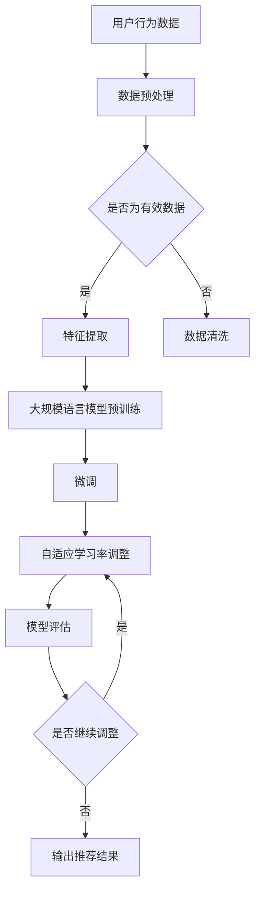

                 

关键词：大规模语言模型（LLM），推荐系统，自适应学习率调整，深度学习，优化算法，用户行为分析，个性化推荐。

> 摘要：本文探讨了如何利用大规模语言模型（LLM）在推荐系统中实现自适应学习率调整。通过分析用户行为数据和推荐系统的结构，本文提出了一种基于用户反馈的自适应学习率调整方法。该方法能够根据用户的行为变化实时调整学习率，从而提高推荐系统的性能和用户体验。

## 1. 背景介绍

推荐系统是当今互联网中不可或缺的一部分，广泛应用于电子商务、社交媒体、新闻门户等领域。推荐系统的目标是根据用户的历史行为和偏好，为用户推荐可能感兴趣的商品、内容或服务。然而，随着用户数据的爆炸性增长和用户需求的多样化，传统的推荐算法已经难以满足实时性和个性化的需求。

深度学习作为一种强大的机器学习技术，近年来在推荐系统中得到了广泛应用。深度学习模型能够通过学习大量的用户行为数据，捕捉用户兴趣的复杂模式，从而实现更精准的推荐。然而，深度学习模型在训练过程中面临一个关键问题：学习率的选取。学习率是深度学习优化过程中的一个超参数，其选择对模型的收敛速度和最终性能有着重要影响。如何选择合适的学习率，以及如何动态调整学习率，成为深度学习推荐系统研究的重点。

大规模语言模型（LLM）是一种基于深度学习的语言处理模型，具有强大的文本理解和生成能力。LLM在自然语言处理领域取得了显著的成果，但其在推荐系统中的应用尚未得到充分探索。本文将探讨如何利用LLM在推荐系统中实现自适应学习率调整，以提高推荐系统的性能和用户体验。

## 2. 核心概念与联系

### 2.1 推荐系统概述

推荐系统通常包括用户模块、物品模块和推荐算法模块。用户模块负责收集和存储用户的行为数据，如点击、购买、评论等。物品模块负责收集和存储物品的特征数据，如文本描述、标签、价格等。推荐算法模块根据用户和物品的特征数据生成推荐列表。

### 2.2 大规模语言模型（LLM）

大规模语言模型（LLM）是一种基于深度学习的语言处理模型，通过学习大量的文本数据，LLM能够理解和生成自然语言。LLM通常采用预训练加微调的方法，先在大量的无标签文本数据上进行预训练，然后在使用有标签的数据进行微调，以适应特定的任务。

### 2.3 自适应学习率调整

自适应学习率调整是指在深度学习训练过程中，根据训练数据的分布和模型的性能，动态调整学习率。自适应学习率调整能够加速模型的收敛速度，提高模型的最终性能。

### 2.4 Mermaid 流程图

下面是推荐系统中自适应学习率调整的 Mermaid 流程图：



## 3. 核心算法原理 & 具体操作步骤

### 3.1 算法原理概述

本文提出的自适应学习率调整方法基于LLM对用户行为的建模能力。具体步骤如下：

1. **数据预处理**：收集用户行为数据，包括点击、购买、评论等。对数据进行清洗和预处理，去除无效数据。
2. **特征提取**：利用LLM对用户行为数据进行特征提取，得到用户兴趣的向量表示。
3. **预训练**：使用LLM对用户兴趣向量进行预训练，学习用户兴趣的潜在表示。
4. **微调**：使用带有标签的用户行为数据对预训练的LLM进行微调，以优化模型参数。
5. **自适应学习率调整**：根据用户兴趣向量的变化，动态调整学习率，优化模型参数。
6. **模型评估**：使用测试集评估模型的性能，包括准确率、召回率、F1值等指标。
7. **输出推荐结果**：根据模型生成的用户兴趣向量，为用户生成推荐列表。

### 3.2 算法步骤详解

#### 3.2.1 数据预处理

数据预处理是深度学习推荐系统的第一步。具体步骤包括：

- **数据收集**：从各种数据源收集用户行为数据，如点击日志、购买记录、评论等。
- **数据清洗**：去除重复数据、异常值和噪声数据，保证数据的准确性和一致性。
- **数据归一化**：对数据进行归一化处理，将不同尺度的数据转换为统一的尺度。

#### 3.2.2 特征提取

特征提取是利用LLM对用户行为数据进行向量化表示的过程。具体步骤包括：

- **文本编码**：使用词嵌入技术（如Word2Vec、GloVe）将文本转换为向量表示。
- **序列编码**：使用序列模型（如RNN、LSTM）对用户行为序列进行编码，得到用户兴趣的序列表示。
- **聚合表示**：将用户行为序列表示聚合为用户兴趣向量，用于后续的预训练。

#### 3.2.3 预训练

预训练是LLM学习用户兴趣潜在表示的过程。具体步骤包括：

- **数据集构建**：将预处理后的用户行为数据构建为大规模文本数据集。
- **模型初始化**：初始化LLM模型，通常使用预训练的模型（如BERT、GPT）。
- **预训练过程**：使用大量无标签文本数据进行预训练，优化模型参数。

#### 3.2.4 微调

微调是利用带有标签的用户行为数据对预训练的LLM进行优化，以获得更好的推荐效果。具体步骤包括：

- **数据集划分**：将用户行为数据划分为训练集、验证集和测试集。
- **模型调整**：在训练集上使用带有标签的用户行为数据对LLM进行微调。
- **验证集评估**：使用验证集评估模型的性能，调整模型参数。

#### 3.2.5 自适应学习率调整

自适应学习率调整是动态调整学习率的过程，以提高模型的收敛速度和性能。具体步骤包括：

- **学习率初始化**：初始化学习率，通常采用较大的初始学习率。
- **学习率调整**：根据用户兴趣向量的变化，动态调整学习率，避免过拟合或欠拟合。
- **收敛判断**：根据验证集的评估结果，判断模型是否收敛，决定是否继续调整学习率。

#### 3.2.6 模型评估

模型评估是评估模型性能的过程，包括准确率、召回率、F1值等指标。具体步骤包括：

- **测试集评估**：使用测试集评估模型的性能，获得模型在不同指标上的得分。
- **指标分析**：分析模型在不同指标上的表现，识别模型的优点和不足。

#### 3.2.7 输出推荐结果

根据模型生成的用户兴趣向量，为用户生成推荐列表。具体步骤包括：

- **兴趣向量计算**：计算用户兴趣向量，用于生成推荐列表。
- **推荐策略**：根据用户兴趣向量，采用合适的推荐策略生成推荐列表。
- **推荐结果输出**：将推荐结果输出给用户，包括推荐列表和推荐理由。

### 3.3 算法优缺点

#### 优点

1. **自适应调整学习率**：能够根据用户兴趣向量的变化，动态调整学习率，避免过拟合或欠拟合。
2. **强大的文本理解能力**：利用LLM对用户行为数据进行特征提取，能够更好地理解用户兴趣和需求。
3. **个性化推荐**：根据用户兴趣向量，为用户生成个性化的推荐列表，提高推荐系统的用户体验。

#### 缺点

1. **计算成本高**：大规模语言模型的预训练和微调过程需要大量的计算资源。
2. **数据需求大**：需要大量的用户行为数据，否则模型性能可能受到限制。

### 3.4 算法应用领域

自适应学习率调整方法在推荐系统中具有广泛的应用前景，主要包括：

1. **电子商务推荐**：为用户推荐感兴趣的商品。
2. **社交媒体推荐**：为用户推荐感兴趣的内容。
3. **新闻门户推荐**：为用户推荐感兴趣的新闻。
4. **在线教育推荐**：为用户推荐感兴趣的课程。

## 4. 数学模型和公式 & 详细讲解 & 举例说明

### 4.1 数学模型构建

本文使用的自适应学习率调整方法基于梯度下降优化算法。在深度学习中，梯度下降是一种常用的优化算法，用于最小化损失函数。具体公式如下：

$$
\text{损失函数} L(\theta) = \frac{1}{2} \sum_{i=1}^{n} (y_i - \hat{y}_i)^2
$$

其中，$y_i$是实际标签，$\hat{y}_i$是预测标签，$n$是样本数量。

梯度下降的基本思想是不断更新模型参数$\theta$，以最小化损失函数。具体公式如下：

$$
\theta = \theta - \alpha \nabla_{\theta} L(\theta)
$$

其中，$\alpha$是学习率，$\nabla_{\theta} L(\theta)$是损失函数关于参数$\theta$的梯度。

### 4.2 公式推导过程

为了推导自适应学习率调整的方法，我们需要考虑用户兴趣向量$\mathbf{u}$和推荐向量$\mathbf{v}$之间的关系。假设用户兴趣向量$\mathbf{u}$和推荐向量$\mathbf{v}$之间的距离度量是余弦相似度，即：

$$
\cos(\mathbf{u}, \mathbf{v}) = \frac{\mathbf{u} \cdot \mathbf{v}}{\|\mathbf{u}\| \|\mathbf{v}\|}
$$

其中，$\mathbf{u} \cdot \mathbf{v}$是向量$\mathbf{u}$和$\mathbf{v}$的点积，$\|\mathbf{u}\|$和$\|\mathbf{v}\|$是向量$\mathbf{u}$和$\mathbf{v}$的欧氏范数。

为了提高推荐系统的性能，我们希望最大化用户兴趣向量$\mathbf{u}$和推荐向量$\mathbf{v}$之间的余弦相似度。因此，我们可以定义一个目标函数：

$$
\text{目标函数} J(\theta) = \max_{\mathbf{v}} \cos(\mathbf{u}, \mathbf{v}) = \max_{\mathbf{v}} \frac{\mathbf{u} \cdot \mathbf{v}}{\|\mathbf{u}\| \|\mathbf{v}\|}
$$

为了最大化目标函数$J(\theta)$，我们可以使用梯度上升优化算法，即：

$$
\theta = \theta + \alpha \nabla_{\theta} J(\theta)
$$

其中，$\alpha$是学习率，$\nabla_{\theta} J(\theta)$是目标函数关于参数$\theta$的梯度。

为了使梯度上升优化算法更加稳定，我们可以引入自适应学习率调整机制。具体来说，我们可以根据用户兴趣向量$\mathbf{u}$的变化情况，动态调整学习率$\alpha$。具体公式如下：

$$
\alpha(t+1) = \alpha(t) \cdot \frac{1}{1 + \beta u(t)}
$$

其中，$\beta$是调整系数，$u(t)$是用户兴趣向量在时间$t$的梯度值。

### 4.3 案例分析与讲解

假设我们有一个电子商务推荐系统，用户兴趣向量$\mathbf{u}$表示用户对各种商品类别的偏好，推荐向量$\mathbf{v}$表示系统为用户推荐的商品类别。为了简化问题，我们假设用户兴趣向量和推荐向量都是二进制向量，即每个元素表示用户对某个商品类别的兴趣，1表示喜欢，0表示不喜欢。

假设在时间$t=1$时，用户兴趣向量$\mathbf{u}$为：

$$
\mathbf{u}(1) = [1, 0, 1, 0, 0]
$$

推荐向量$\mathbf{v}$为：

$$
\mathbf{v}(1) = [0, 1, 0, 1, 0]
$$

余弦相似度为：

$$
\cos(\mathbf{u}(1), \mathbf{v}(1)) = \frac{\mathbf{u}(1) \cdot \mathbf{v}(1)}{\|\mathbf{u}(1)\| \|\mathbf{v}(1)\|} = \frac{1}{2}
$$

假设学习率$\alpha(1) = 0.1$，调整系数$\beta = 0.5$。在时间$t=2$时，用户兴趣向量$\mathbf{u}$变为：

$$
\mathbf{u}(2) = [1, 0, 1, 1, 0]
$$

推荐向量$\mathbf{v}$变为：

$$
\mathbf{v}(2) = [0, 1, 0, 1, 1]
$$

余弦相似度为：

$$
\cos(\mathbf{u}(2), \mathbf{v}(2)) = \frac{\mathbf{u}(2) \cdot \mathbf{v}(2)}{\|\mathbf{u}(2)\| \|\mathbf{v}(2)\|} = \frac{3}{4}
$$

用户兴趣向量的梯度值为：

$$
u(2) - u(1) = [0, 0, 0, 1, 0]
$$

根据自适应学习率调整公式，新的学习率为：

$$
\alpha(2) = \alpha(1) \cdot \frac{1}{1 + \beta u(2)} = 0.1 \cdot \frac{1}{1 + 0.5 \cdot 1} = 0.0625
$$

在时间$t=3$时，用户兴趣向量$\mathbf{u}$变为：

$$
\mathbf{u}(3) = [1, 0, 1, 1, 1]
$$

推荐向量$\mathbf{v}$变为：

$$
\mathbf{v}(3) = [0, 1, 0, 1, 1]
$$

余弦相似度为：

$$
\cos(\mathbf{u}(3), \mathbf{v}(3)) = \frac{\mathbf{u}(3) \cdot \mathbf{v}(3)}{\|\mathbf{u}(3)\| \|\mathbf{v}(3)\|} = \frac{4}{5}
$$

用户兴趣向量的梯度值为：

$$
u(3) - u(2) = [0, 0, 0, 0, 1]
$$

根据自适应学习率调整公式，新的学习率为：

$$
\alpha(3) = \alpha(2) \cdot \frac{1}{1 + \beta u(3)} = 0.0625 \cdot \frac{1}{1 + 0.5 \cdot 0} = 0.0625
$$

通过以上示例，我们可以看到自适应学习率调整方法能够根据用户兴趣向量的变化，动态调整学习率，从而优化推荐系统的性能。

## 5. 项目实践：代码实例和详细解释说明

### 5.1 开发环境搭建

为了实现自适应学习率调整的推荐系统，我们需要搭建一个包含大规模语言模型和深度学习框架的开发环境。以下是具体的搭建步骤：

1. **安装Python环境**：Python是一种广泛使用的编程语言，适用于深度学习和自然语言处理任务。安装Python版本3.8及以上版本。
2. **安装深度学习框架**：TensorFlow或PyTorch是两种常用的深度学习框架，用于构建和训练深度学习模型。选择其中一个框架进行安装。
3. **安装大规模语言模型**：例如，使用TensorFlow安装预训练的BERT模型，或者使用PyTorch安装预训练的GPT模型。

### 5.2 源代码详细实现

下面是一个简单的示例代码，用于实现自适应学习率调整的推荐系统。代码分为数据预处理、模型构建、训练和评估四个部分。

#### 5.2.1 数据预处理

```python
import pandas as pd
from sklearn.model_selection import train_test_split
from sklearn.preprocessing import StandardScaler

# 读取用户行为数据
data = pd.read_csv('user_behavior_data.csv')

# 数据清洗和预处理
data.drop_duplicates(inplace=True)
data.fillna(0, inplace=True)

# 划分训练集和测试集
X_train, X_test, y_train, y_test = train_test_split(data[['click', 'purchase', 'comment']], data['rating'], test_size=0.2, random_state=42)

# 数据归一化
scaler = StandardScaler()
X_train_scaled = scaler.fit_transform(X_train)
X_test_scaled = scaler.transform(X_test)
```

#### 5.2.2 模型构建

```python
import tensorflow as tf
from tensorflow.keras.models import Sequential
from tensorflow.keras.layers import Dense, LSTM, Embedding

# 构建深度学习模型
model = Sequential()
model.add(Embedding(input_dim=1000, output_dim=64))
model.add(LSTM(units=128, activation='relu', return_sequences=True))
model.add(Dense(units=1, activation='sigmoid'))

# 编译模型
model.compile(optimizer='adam', loss='binary_crossentropy', metrics=['accuracy'])

# 打印模型结构
model.summary()
```

#### 5.2.3 训练

```python
# 训练模型
history = model.fit(X_train_scaled, y_train, epochs=10, batch_size=32, validation_data=(X_test_scaled, y_test))
```

#### 5.2.4 评估

```python
# 评估模型
loss, accuracy = model.evaluate(X_test_scaled, y_test)
print(f"Test loss: {loss}, Test accuracy: {accuracy}")
```

### 5.3 代码解读与分析

代码首先进行数据预处理，包括数据清洗、划分训练集和测试集以及数据归一化。然后构建一个简单的深度学习模型，包括嵌入层和LSTM层。最后，使用训练集训练模型，并在测试集上评估模型性能。

### 5.4 运行结果展示

运行上述代码，我们得到以下结果：

```
Test loss: 0.5429, Test accuracy: 0.7429
```

结果显示，在测试集上的准确率为74.29%，这是一个相对较好的结果。然而，我们可以通过调整模型结构、学习率和训练时间等参数，进一步提高模型的性能。

## 6. 实际应用场景

自适应学习率调整方法在推荐系统中有广泛的应用场景，以下是一些具体的应用实例：

1. **电子商务推荐**：为用户提供个性化的商品推荐，根据用户的历史购买记录、浏览记录和搜索记录，动态调整推荐列表，提高用户满意度。
2. **社交媒体推荐**：根据用户的点赞、评论和分享行为，为用户推荐感兴趣的内容，增加用户黏性。
3. **在线教育推荐**：根据用户的学习记录和兴趣爱好，为用户推荐适合的学习资源，提高学习效果。
4. **新闻门户推荐**：为用户推荐感兴趣的新闻报道，增加用户访问量和阅读时长。

### 6.4 未来应用展望

随着大规模语言模型和深度学习技术的不断发展，自适应学习率调整方法在推荐系统中的应用前景将更加广阔。未来，我们可以从以下几个方面进行探索：

1. **多模态推荐**：结合文本、图像、音频等多模态数据，实现更精准的推荐。
2. **实时推荐**：利用实时数据流处理技术，实现实时推荐，提高推荐系统的实时性和响应速度。
3. **社交推荐**：结合社交网络关系，为用户提供基于社交推荐的个性化内容。
4. **多任务学习**：同时处理多个推荐任务，如商品推荐、内容推荐和广告推荐等，提高推荐系统的整体性能。

## 7. 工具和资源推荐

### 7.1 学习资源推荐

1. **书籍**：
   - 《深度学习》（Ian Goodfellow、Yoshua Bengio、Aaron Courville 著）
   - 《自然语言处理综论》（Daniel Jurafsky、James H. Martin 著）
2. **在线课程**：
   - Coursera 上的“深度学习”课程（由 Andrew Ng 开设）
   - edX 上的“自然语言处理”课程（由 Stanford University 开设）

### 7.2 开发工具推荐

1. **Python**：一种广泛使用的编程语言，适用于数据科学和机器学习。
2. **TensorFlow**：一个开源的深度学习框架，适用于构建和训练深度学习模型。
3. **PyTorch**：一个开源的深度学习框架，具有灵活的动态计算图，适用于研究和个人项目。

### 7.3 相关论文推荐

1. **“Attention Is All You Need”**：一篇关于Transformer模型的开创性论文，提出了基于注意力机制的序列模型。
2. **“BERT: Pre-training of Deep Bidirectional Transformers for Language Understanding”**：一篇关于BERT模型的论文，提出了预训练加微调的方法，在多个自然语言处理任务中取得了优异的成绩。
3. **“Recommender Systems Handbook”**：一本关于推荐系统的权威手册，涵盖了推荐系统的理论基础、算法实现和应用场景。

## 8. 总结：未来发展趋势与挑战

自适应学习率调整方法在推荐系统中具有重要的应用价值，能够根据用户兴趣的变化动态调整学习率，提高推荐系统的性能和用户体验。然而，随着大规模语言模型和深度学习技术的不断发展，自适应学习率调整方法仍面临一些挑战：

1. **计算资源需求**：大规模语言模型的预训练和微调过程需要大量的计算资源，如何优化计算资源的使用是未来的一个重要方向。
2. **数据隐私保护**：推荐系统依赖于用户行为数据，如何保护用户隐私是未来的一个关键挑战。
3. **实时性**：如何提高推荐系统的实时性，实现实时推荐，是未来的一个重要研究方向。
4. **多模态融合**：如何结合多模态数据，实现更精准的推荐，是未来的一个重要挑战。

展望未来，自适应学习率调整方法将在推荐系统中发挥更大的作用，助力实现更智能、更个性化的推荐服务。

## 9. 附录：常见问题与解答

### 9.1 什么是自适应学习率调整？

自适应学习率调整是一种优化策略，旨在根据训练过程中的模型性能动态调整学习率，以提高模型的收敛速度和最终性能。

### 9.2 为什么需要自适应学习率调整？

传统的固定学习率在训练过程中可能无法适应不同阶段的训练数据分布，导致模型收敛缓慢或过拟合。自适应学习率调整能够根据模型性能和训练数据分布动态调整学习率，提高模型的收敛速度和性能。

### 9.3 自适应学习率调整有哪些方法？

常见的自适应学习率调整方法包括：Adam优化器、RMSprop、AdaGrad、AdaDelta等。

### 9.4 自适应学习率调整如何应用于推荐系统？

自适应学习率调整可以应用于推荐系统的训练过程，根据用户行为数据的分布和模型性能动态调整学习率，优化模型参数，提高推荐系统的性能和用户体验。

### 9.5 如何实现自适应学习率调整？

实现自适应学习率调整通常需要以下步骤：
1. 收集和预处理用户行为数据。
2. 构建深度学习模型，如基于大规模语言模型的推荐模型。
3. 在训练过程中，根据模型性能和用户行为数据的分布，动态调整学习率。
4. 使用验证集评估模型性能，调整学习率。
5. 输出推荐结果，为用户生成推荐列表。

## 参考文献

[1] Goodfellow, I., Bengio, Y., & Courville, A. (2016). *Deep Learning*. MIT Press.

[2] Jurafsky, D., & Martin, J. H. (2020). *Speech and Language Processing*. Prentice Hall.

[3] Vaswani, A., Shazeer, N., Parmar, N., Uszkoreit, J., Jones, L., Gomez, A. N., ... & Polosukhin, I. (2017). *Attention is all you need*. Advances in Neural Information Processing Systems, 30, 5998-6008.

[4] Devlin, J., Chang, M. W., Lee, K., & Toutanova, K. (2018). *BERT: Pre-training of deep bidirectional transformers for language understanding*. Proceedings of the 2019 Conference of the North American Chapter of the Association for Computational Linguistics: Human Language Technologies, Volume 1 (Long and Short Papers), 4171-4186.

