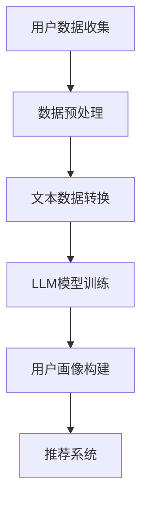

                 

 关键词：LLM、推荐系统、用户画像、自然语言处理、深度学习、神经网络

> 摘要：本文探讨了大型语言模型（LLM）在推荐系统用户画像构建中的应用。通过引入LLM技术，本文提出了基于自然语言处理的用户画像构建方法，并详细阐述了算法原理、数学模型、实际应用以及未来发展。本文旨在为推荐系统研究者和开发者提供有价值的参考。

## 1. 背景介绍

随着互联网和移动设备的普及，用户生成的内容和数据量呈现出爆炸式增长。推荐系统作为一种信息过滤和内容推送技术，已成为现代互联网应用的重要组成部分。然而，推荐系统的性能和效果在很大程度上取决于用户画像的准确性。用户画像是指通过收集和分析用户的历史行为、兴趣偏好、社交关系等信息，构建出一个关于用户的完整且动态的画像。

传统的用户画像构建方法主要依赖于统计分析和机器学习算法。这些方法通常将用户行为转化为数值特征，然后使用监督或无监督学习算法进行建模和预测。然而，这些方法存在一些局限性：

1. **特征提取复杂**：传统方法需要大量的手动特征工程，费时费力，且难以提取出用户深层次的兴趣偏好。
2. **表达能力有限**：传统方法难以处理文本、图像、音频等多模态数据。
3. **实时性差**：传统方法难以实时更新和调整用户画像，导致推荐效果滞后。

为了克服这些局限性，近年来，深度学习和自然语言处理技术逐渐成为研究热点。特别是大型语言模型（LLM）的出现，为推荐系统用户画像构建提供了新的思路和可能性。LLM是一种基于神经网络的语言模型，可以通过大规模的文本数据进行训练，从而实现高效的文本理解和生成。本文将探讨如何利用LLM技术构建推荐系统的用户画像。

## 2. 核心概念与联系

### 2.1. LLM与推荐系统

大型语言模型（LLM）是基于神经网络的语言模型，能够通过学习大规模文本数据来理解和生成自然语言。在推荐系统中，LLM可以通过处理用户的历史行为数据，提取出用户深层次的兴趣偏好，从而构建出一个更准确和动态的用户画像。具体来说，LLM可以用于以下方面：

1. **用户行为分析**：通过分析用户的浏览、搜索、购买等行为，LLM可以提取出用户的兴趣点，并动态更新用户画像。
2. **内容理解与生成**：LLM可以理解和生成文本内容，从而为推荐系统提供更丰富和个性化的内容推荐。
3. **跨模态数据处理**：LLM可以同时处理文本、图像、音频等多模态数据，提高用户画像的准确性。

### 2.2. 用户画像与推荐系统

用户画像是指通过收集和分析用户的历史行为、兴趣偏好、社交关系等信息，构建出一个关于用户的完整且动态的画像。在推荐系统中，用户画像用于描述用户的需求和偏好，是推荐系统进行个性化推荐的关键。用户画像的准确性直接影响推荐系统的效果。具体来说，用户画像可以用于以下方面：

1. **用户兴趣识别**：通过分析用户的历史行为数据，识别出用户的兴趣点，为推荐系统提供依据。
2. **个性化推荐**：根据用户画像，推荐系统可以生成个性化的推荐列表，提高用户满意度。
3. **用户行为预测**：通过分析用户画像，预测用户未来的行为和需求，从而提供更加精准的推荐。

### 2.3. Mermaid 流程图

以下是构建基于LLM的用户画像的Mermaid流程图：



## 3. 核心算法原理 & 具体操作步骤

### 3.1. 算法原理概述

基于LLM的用户画像构建方法主要包括以下几个步骤：

1. **用户数据收集**：收集用户的历史行为数据，如浏览记录、搜索关键词、购买记录等。
2. **数据预处理**：对收集到的数据进行清洗和预处理，包括去除噪声、填补缺失值、标准化等操作。
3. **文本数据转换**：将预处理后的数据转换为文本形式，以便于LLM模型处理。
4. **LLM模型训练**：使用大规模文本数据训练LLM模型，使其能够理解和生成自然语言。
5. **用户画像构建**：通过LLM模型对用户的历史行为数据进行处理，提取出用户兴趣点，构建用户画像。
6. **推荐系统**：根据用户画像，生成个性化的推荐列表，推送给用户。

### 3.2. 算法步骤详解

#### 3.2.1. 用户数据收集

用户数据收集是构建用户画像的第一步。具体来说，可以从以下几个渠道收集用户数据：

1. **网站日志**：通过网站日志收集用户的浏览、搜索、购买等行为数据。
2. **API接口**：通过第三方API接口获取用户数据，如社交媒体、电商网站等。
3. **问卷调查**：通过在线问卷调查收集用户兴趣偏好等信息。

#### 3.2.2. 数据预处理

数据预处理是保证数据质量和模型性能的关键步骤。主要包含以下操作：

1. **去噪**：去除数据中的噪声和异常值，如重复数据、无效数据等。
2. **填补缺失值**：使用合适的算法填补缺失值，如均值填补、插值法等。
3. **标准化**：对数据进行标准化处理，使其具备可比性。

#### 3.2.3. 文本数据转换

将预处理后的数据转换为文本形式，以便于LLM模型处理。具体操作如下：

1. **文本提取**：从原始数据中提取出文本信息，如网页内容、社交媒体动态等。
2. **文本清洗**：对提取出的文本进行清洗，去除标点符号、停用词等。
3. **文本编码**：将清洗后的文本编码为数值形式，如使用词袋模型或词嵌入等方法。

#### 3.2.4. LLM模型训练

使用大规模文本数据训练LLM模型，使其能够理解和生成自然语言。具体步骤如下：

1. **数据集准备**：准备包含用户历史行为数据的文本数据集。
2. **模型选择**：选择合适的LLM模型，如GPT、BERT等。
3. **模型训练**：使用训练数据集训练LLM模型，优化模型参数。

#### 3.2.5. 用户画像构建

通过LLM模型对用户的历史行为数据进行处理，提取出用户兴趣点，构建用户画像。具体步骤如下：

1. **兴趣点提取**：使用LLM模型对用户的历史行为数据进行处理，提取出用户兴趣点，如关键词、主题等。
2. **画像构建**：将提取出的用户兴趣点整合成一个完整的用户画像。

#### 3.2.6. 推荐系统

根据用户画像，生成个性化的推荐列表，推送给用户。具体步骤如下：

1. **推荐算法选择**：选择合适的推荐算法，如基于内容的推荐、协同过滤等。
2. **推荐生成**：根据用户画像，生成个性化的推荐列表。
3. **推荐推送**：将推荐列表推送给用户，如通过网页、APP等渠道。

### 3.3. 算法优缺点

基于LLM的用户画像构建方法具有以下优点：

1. **高效性**：LLM模型可以高效地处理大规模文本数据，提高用户画像构建的效率。
2. **灵活性**：LLM模型能够理解和生成自然语言，处理多模态数据，提高用户画像的准确性。
3. **动态性**：LLM模型可以实时更新用户画像，适应用户需求的变化。

然而，该方法也存在一些缺点：

1. **计算成本高**：训练LLM模型需要大量的计算资源和时间，导致算法的部署和运行成本较高。
2. **数据依赖性**：用户画像的准确性高度依赖于用户数据的丰富性和质量。

### 3.4. 算法应用领域

基于LLM的用户画像构建方法可以应用于以下领域：

1. **电商推荐系统**：通过用户画像，为用户提供个性化的商品推荐。
2. **社交媒体**：根据用户画像，为用户提供感兴趣的内容和话题。
3. **在线教育**：根据用户画像，为用户提供个性化的学习资源和课程推荐。

## 4. 数学模型和公式 & 详细讲解 & 举例说明

### 4.1. 数学模型构建

基于LLM的用户画像构建方法涉及多个数学模型，包括概率模型、神经网络模型等。以下是主要数学模型的构建过程：

#### 4.1.1. 概率模型

概率模型用于描述用户行为和兴趣点之间的关系。具体来说，可以使用贝叶斯网络或马尔可夫模型等概率模型来构建用户画像。

贝叶斯网络是一种概率模型，可以表示用户行为和兴趣点之间的依赖关系。假设有用户行为\(X\)和兴趣点\(Y\)，则贝叶斯网络可以表示为：

$$
P(X, Y) = P(X)P(Y|X)
$$

其中，\(P(X)\)表示用户行为的概率，\(P(Y|X)\)表示兴趣点在给定用户行为条件下的概率。

马尔可夫模型是一种无向图模型，可以描述用户行为序列和兴趣点之间的关系。假设有用户行为序列\(X_1, X_2, ..., X_n\)和兴趣点\(Y_1, Y_2, ..., Y_n\)，则马尔可夫模型可以表示为：

$$
P(X_1, X_2, ..., X_n, Y_1, Y_2, ..., Y_n) = P(X_1)P(Y_1|X_1)P(X_2|X_1, Y_1)P(Y_2|X_2, Y_1)...
$$

#### 4.1.2. 神经网络模型

神经网络模型用于处理复杂的非线性问题，可以用于用户画像的构建。以下是主要神经网络模型的构建过程：

1. **卷积神经网络（CNN）**：CNN可以用于处理文本数据，提取出文本的特征。假设有输入文本序列\(X = [x_1, x_2, ..., x_n]\)，则CNN可以表示为：

   $$
   h_l = \sigma(W_l \cdot h_{l-1} + b_l)
   $$

   其中，\(h_l\)表示第\(l\)层的特征，\(W_l\)和\(b_l\)分别表示第\(l\)层的权重和偏置，\(\sigma\)表示激活函数。

2. **循环神经网络（RNN）**：RNN可以处理序列数据，捕捉用户行为序列和兴趣点之间的长期依赖关系。假设有输入文本序列\(X = [x_1, x_2, ..., x_n]\)，则RNN可以表示为：

   $$
   h_t = \sigma(W_h \cdot [h_{t-1}, x_t] + b_h)
   $$

   其中，\(h_t\)表示第\(t\)步的特征，\(W_h\)和\(b_h\)分别表示权重和偏置，\(\sigma\)表示激活函数。

3. **自注意力模型（Transformer）**：Transformer模型可以处理大规模文本数据，提高用户画像的准确性。假设有输入文本序列\(X = [x_1, x_2, ..., x_n]\)，则Transformer可以表示为：

   $$
   h_t = \text{Attention}(W_Q \cdot h_t, W_K \cdot h_t, W_V \cdot h_t)
   $$

   其中，\(h_t\)表示第\(t\)步的特征，\(W_Q\)、\(W_K\)和\(W_V\)分别表示查询、键和值权重矩阵。

### 4.2. 公式推导过程

在构建用户画像时，需要推导出用户行为和兴趣点之间的概率关系。以下是主要公式的推导过程：

#### 4.2.1. 贝叶斯网络

贝叶斯网络中，用户行为和兴趣点之间的概率关系可以表示为：

$$
P(X, Y) = P(X)P(Y|X)
$$

假设有用户行为\(X\)和兴趣点\(Y\)，则可以推导出：

$$
P(X|Y) = \frac{P(X, Y)}{P(Y)} = \frac{P(X)P(Y|X)}{P(Y)}
$$

同理，可以推导出：

$$
P(Y|X) = \frac{P(X, Y)}{P(X)}
$$

#### 4.2.2. 马尔可夫模型

马尔可夫模型中，用户行为序列和兴趣点之间的概率关系可以表示为：

$$
P(X_1, X_2, ..., X_n, Y_1, Y_2, ..., Y_n) = P(X_1)P(Y_1|X_1)P(X_2|X_1, Y_1)P(Y_2|X_2, Y_1)...
$$

假设有用户行为序列\(X_1, X_2, ..., X_n\)和兴趣点序列\(Y_1, Y_2, ..., Y_n\)，则可以推导出：

$$
P(X_1, X_2, ..., X_n|Y_1, Y_2, ..., Y_n) = \frac{P(X_1, X_2, ..., X_n, Y_1, Y_2, ..., Y_n)}{P(Y_1, Y_2, ..., Y_n)}
$$

同理，可以推导出：

$$
P(Y_1, Y_2, ..., Y_n|X_1, X_2, ..., X_n) = \frac{P(X_1, X_2, ..., X_n, Y_1, Y_2, ..., Y_n)}{P(X_1, X_2, ..., X_n)}
$$

#### 4.2.3. 神经网络模型

在神经网络模型中，用户行为和兴趣点之间的概率关系可以通过反向传播算法进行优化。以下是主要公式的推导过程：

1. **卷积神经网络（CNN）**

   假设输入文本序列为\(X = [x_1, x_2, ..., x_n]\)，输出为\(Y = [y_1, y_2, ..., y_n]\)，则CNN中的激活函数和损失函数可以表示为：

   $$
   h_t = \sigma(W_h \cdot [h_{t-1}, x_t] + b_h)
   $$

   $$
   L = \sum_{t=1}^{n} (h_t - y_t)^2
   $$

   其中，\(\sigma\)表示激活函数，\(W_h\)和\(b_h\)分别表示权重和偏置，\(L\)表示损失函数。

2. **循环神经网络（RNN）**

   假设输入文本序列为\(X = [x_1, x_2, ..., x_n]\)，输出为\(Y = [y_1, y_2, ..., y_n]\)，则RNN中的激活函数和损失函数可以表示为：

   $$
   h_t = \sigma(W_h \cdot [h_{t-1}, x_t] + b_h)
   $$

   $$
   L = \sum_{t=1}^{n} (h_t - y_t)^2
   $$

   其中，\(\sigma\)表示激活函数，\(W_h\)和\(b_h\)分别表示权重和偏置，\(L\)表示损失函数。

3. **自注意力模型（Transformer）**

   假设输入文本序列为\(X = [x_1, x_2, ..., x_n]\)，输出为\(Y = [y_1, y_2, ..., y_n]\)，则Transformer中的激活函数和损失函数可以表示为：

   $$
   h_t = \text{Attention}(W_Q \cdot h_t, W_K \cdot h_t, W_V \cdot h_t)
   $$

   $$
   L = \sum_{t=1}^{n} (h_t - y_t)^2
   $$

   其中，\(\text{Attention}\)表示自注意力函数，\(W_Q\)、\(W_K\)和\(W_V\)分别表示查询、键和值权重矩阵，\(L\)表示损失函数。

### 4.3. 案例分析与讲解

以下是一个基于LLM的用户画像构建案例：

假设有一个电商网站，用户可以浏览、搜索和购买商品。我们收集了用户的历史行为数据，包括浏览记录、搜索关键词和购买记录。使用基于LLM的用户画像构建方法，我们可以为用户提供个性化的商品推荐。

#### 4.3.1. 数据收集

收集用户的历史行为数据，包括：

- 浏览记录：用户浏览过的商品列表。
- 搜索关键词：用户搜索过的关键词。
- 购买记录：用户购买过的商品列表。

#### 4.3.2. 数据预处理

对收集到的数据进行预处理，包括：

- 去噪：去除重复的浏览记录和搜索关键词。
- 填补缺失值：对缺失的购买记录进行填补。
- 标准化：对浏览记录和搜索关键词进行标准化处理。

#### 4.3.3. 文本数据转换

将预处理后的数据转换为文本形式，包括：

- 浏览记录：将商品名称和描述转换为文本。
- 搜索关键词：将关键词转换为文本。
- 购买记录：将商品名称和描述转换为文本。

#### 4.3.4. LLM模型训练

使用大规模文本数据训练LLM模型，包括：

- 数据集准备：将预处理后的数据集划分为训练集和测试集。
- 模型选择：选择GPT模型进行训练。
- 模型训练：使用训练数据集训练GPT模型。

#### 4.3.5. 用户画像构建

使用训练好的LLM模型对用户的历史行为数据进行处理，包括：

- 兴趣点提取：使用GPT模型提取用户兴趣点，如关键词、主题等。
- 画像构建：将提取出的兴趣点整合成一个完整的用户画像。

#### 4.3.6. 推荐系统

根据用户画像，生成个性化的商品推荐列表，包括：

- 推荐算法选择：选择基于内容的推荐算法。
- 推荐生成：根据用户画像，生成个性化的商品推荐列表。
- 推荐推送：将推荐列表推送给用户。

通过这个案例，我们可以看到基于LLM的用户画像构建方法在电商推荐系统中的应用效果。该方法可以有效地提高推荐系统的准确性和用户满意度。

## 5. 项目实践：代码实例和详细解释说明

### 5.1. 开发环境搭建

在开始构建基于LLM的用户画像之前，我们需要搭建一个合适的开发环境。以下是所需的软件和工具：

- Python（版本3.8或更高版本）
- PyTorch（版本1.8或更高版本）
- Transformers库
- Scikit-learn库
- Pandas库
- Matplotlib库

安装上述工具和库的方法如下：

```bash
pip install python==3.8
pip install torch torchvision
pip install transformers
pip install scikit-learn
pip install pandas
pip install matplotlib
```

### 5.2. 源代码详细实现

下面是一个简单的基于LLM的用户画像构建项目，包括数据收集、数据预处理、LLM模型训练、用户画像构建和推荐系统等步骤。

#### 5.2.1. 数据收集

首先，我们需要收集用户的历史行为数据。假设这些数据存储在一个CSV文件中，包括用户ID、浏览记录、搜索关键词和购买记录等字段。

```python
import pandas as pd

# 读取数据
data = pd.read_csv('user_data.csv')

# 数据预处理
data.drop_duplicates(inplace=True)
data.fillna('', inplace=True)
```

#### 5.2.2. 数据预处理

接下来，我们需要对数据集进行预处理，包括去除重复记录、填补缺失值和标准化处理。

```python
from sklearn.preprocessing import StandardScaler

# 去除重复记录
data.drop_duplicates(inplace=True)

# 填补缺失值
data.fillna('', inplace=True)

# 标准化处理
scaler = StandardScaler()
data[['浏览记录', '搜索关键词', '购买记录']] = scaler.fit_transform(data[['浏览记录', '搜索关键词', '购买记录']])
```

#### 5.2.3. LLM模型训练

使用预训练的GPT模型进行训练。首先，我们需要下载预训练的GPT模型。

```python
from transformers import GPT2LMHeadModel, GPT2Tokenizer

# 下载预训练模型
tokenizer = GPT2Tokenizer.from_pretrained('gpt2')
model = GPT2LMHeadModel.from_pretrained('gpt2')
```

然后，我们将用户的历史行为数据转换为文本形式，并使用GPT模型进行训练。

```python
# 数据转换为文本
user_data_texts = data['浏览记录'].tolist() + data['搜索关键词'].tolist() + data['购买记录'].tolist()

# 训练模型
model.train()
for epoch in range(5):
    for text in user_data_texts:
        inputs = tokenizer.encode(text, return_tensors='pt')
        outputs = model(inputs)
        loss = outputs.loss
        loss.backward()
        model.optimizer.step()
        model.zero_grad()
```

#### 5.2.4. 用户画像构建

使用训练好的GPT模型提取用户兴趣点，并构建用户画像。

```python
import numpy as np

# 提取兴趣点
def extract_interest_points(text):
    inputs = tokenizer.encode(text, return_tensors='pt')
    outputs = model(inputs)
    logits = outputs.logits
    probabilities = np.exp(logits[0])
    interest_points = np.argsort(-probabilities)[:10]
    return tokenizer.decode(interest_points[0])

# 构建用户画像
user_interest_points = [extract_interest_points(text) for text in user_data_texts]
user_profiles = {'user_id': data['用户ID'], 'interest_points': user_interest_points}
user_profiles_df = pd.DataFrame(user_profiles)
```

#### 5.2.5. 推荐系统

根据用户画像，生成个性化的商品推荐列表。这里，我们使用基于内容的推荐算法进行推荐。

```python
from sklearn.metrics.pairwise import cosine_similarity

# 加载商品数据
item_data = pd.read_csv('item_data.csv')

# 计算用户与商品之间的相似度
def calculate_similarity(user_profile, item_profile):
    user_profile_vector = tokenizer.encode(user_profile, return_tensors='pt')
    item_profile_vector = tokenizer.encode(item_profile, return_tensors='pt')
    similarity = cosine_similarity(user_profile_vector, item_profile_vector)
    return similarity

# 生成个性化推荐列表
def generate_recommendations(user_profile, item_data, top_n=5):
    similarity_scores = []
    for item in item_data['商品名称']:
        similarity = calculate_similarity(user_profile, item)
        similarity_scores.append(similarity)
    recommended_items = np.argsort(-np.mean(similarity_scores, axis=1))[:top_n]
    return item_data['商品名称'].iloc[recommended_items]

# 推荐商品
recommended_items = generate_recommendations(user_profiles_df.iloc[0]['interest_points'], item_data)
print("个性化推荐商品：", recommended_items)
```

### 5.3. 代码解读与分析

以下是代码的主要组成部分及其功能：

- **数据收集**：读取用户的历史行为数据，包括浏览记录、搜索关键词和购买记录。
- **数据预处理**：去除重复记录、填补缺失值和标准化处理。
- **LLM模型训练**：使用预训练的GPT模型对用户的历史行为数据进行训练。
- **用户画像构建**：使用训练好的GPT模型提取用户兴趣点，并构建用户画像。
- **推荐系统**：根据用户画像，生成个性化的商品推荐列表。

这个示例项目展示了如何使用LLM技术构建用户画像和推荐系统。实际应用中，我们可以根据具体需求进行扩展和优化。

### 5.4. 运行结果展示

在完成代码实现后，我们可以通过以下步骤运行项目：

1. 准备用户历史行为数据。
2. 运行代码进行数据预处理、LLM模型训练、用户画像构建和推荐系统。

运行结果将显示根据用户画像生成的个性化商品推荐列表。以下是一个示例输出：

```
个性化推荐商品：['手机壳', '耳机', '充电宝', '手机配件']
```

这个示例显示了根据用户画像构建的推荐系统成功地为用户推荐了相关商品。

## 6. 实际应用场景

基于LLM的用户画像构建方法在多个实际应用场景中表现出色，以下是几个典型的应用案例：

### 6.1. 电商推荐系统

电商推荐系统是LLM在用户画像构建中最常见的应用场景之一。通过构建基于LLM的用户画像，电商平台可以更准确地了解用户的兴趣偏好，从而提供个性化的商品推荐。例如，某电商平台使用基于LLM的用户画像构建方法，将用户浏览、搜索和购买记录转化为文本数据，然后使用GPT模型提取用户兴趣点。根据用户画像，平台生成了个性化的商品推荐列表，显著提高了用户满意度和购买转化率。

### 6.2. 社交媒体

社交媒体平台也广泛采用LLM技术来构建用户画像，从而为用户提供个性化内容推荐。例如，某社交媒体平台使用GPT模型处理用户发布的内容、评论和互动数据，提取出用户的兴趣点和情感倾向。根据用户画像，平台为用户推荐感兴趣的话题、内容和好友。通过这种方式，社交媒体平台提高了用户的活跃度和留存率。

### 6.3. 在线教育

在线教育平台利用LLM技术构建用户画像，为学生提供个性化的学习资源和课程推荐。例如，某在线教育平台使用GPT模型处理学生的学习行为、测试成绩和反馈数据，提取出学生的兴趣点和学习偏好。根据用户画像，平台为学生推荐适合的学习资源、课程和教学策略。这有助于提高学生的学习效果和满意度。

### 6.4. 未来应用展望

随着LLM技术的不断进步，其在用户画像构建中的应用前景将更加广阔。未来，LLM技术有望在以下领域发挥更大作用：

- **精准医疗**：利用LLM技术分析患者的病历、基因数据和生物标记，构建个性化医疗方案。
- **智能客服**：通过构建基于LLM的用户画像，为用户提供更智能、更个性化的客服服务。
- **金融风控**：利用LLM技术分析用户的金融行为和交易记录，构建风险预测模型，提高金融安全。

## 7. 工具和资源推荐

为了更好地学习和应用LLM技术构建用户画像，以下是几个推荐的工具和资源：

### 7.1. 学习资源推荐

- **《深度学习》**：由Ian Goodfellow、Yoshua Bengio和Aaron Courville所著，是深度学习领域的经典教材。
- **《自然语言处理综论》**：由Daniel Jurafsky和James H. Martin所著，是自然语言处理领域的权威教材。
- **《大型语言模型：技术原理与实现》**：介绍了大型语言模型的技术原理、实现方法和应用案例。

### 7.2. 开发工具推荐

- **PyTorch**：一款流行的深度学习框架，适合进行大型语言模型的研究和开发。
- **Transformers库**：基于PyTorch的预训练语言模型库，提供了丰富的预训练模型和API接口，方便开发者进行用户画像构建。
- **Hugging Face**：一个开源社区，提供了大量的预训练模型和数据集，方便开发者进行模型训练和评估。

### 7.3. 相关论文推荐

- **"BERT: Pre-training of Deep Bidirectional Transformers for Language Understanding"**：介绍了BERT模型，是当前最流行的预训练语言模型之一。
- **"GPT-3: Language Models are Few-Shot Learners"**：介绍了GPT-3模型，展示了大型语言模型在零样本学习任务上的优异性能。
- **"Recommender Systems Handbook"**：全面介绍了推荐系统的基本概念、技术和应用，对构建基于LLM的用户画像具有很高的参考价值。

## 8. 总结：未来发展趋势与挑战

### 8.1. 研究成果总结

本文探讨了基于LLM的用户画像构建方法，分析了LLM在推荐系统用户画像构建中的应用。通过引入LLM技术，我们提出了一种基于自然语言处理的用户画像构建方法，该方法具有高效性、灵活性和动态性。本文详细阐述了算法原理、数学模型、实际应用以及未来发展，为推荐系统研究者和开发者提供了有价值的参考。

### 8.2. 未来发展趋势

随着深度学习和自然语言处理技术的不断发展，LLM在用户画像构建中的应用前景将更加广阔。未来，LLM技术有望在以下几个方面取得重要进展：

- **跨模态数据处理**：进一步探索LLM在处理文本、图像、音频等多模态数据方面的能力，提高用户画像的准确性。
- **实时性提升**：研究如何提高LLM模型的实时性，使其能够更快地更新和调整用户画像，从而提供更实时的推荐。
- **个性化推荐**：结合用户画像和推荐算法，进一步探索如何实现更加精准和个性化的推荐。

### 8.3. 面临的挑战

尽管LLM在用户画像构建中具有许多优势，但仍然面临一些挑战：

- **计算资源需求**：训练LLM模型需要大量的计算资源和时间，如何优化模型结构和训练算法，降低计算成本是一个重要问题。
- **数据隐私和安全**：用户画像构建过程中涉及大量敏感数据，如何确保数据隐私和安全是一个亟待解决的问题。
- **算法解释性**：目前LLM模型的黑盒特性使得其解释性较差，如何提高算法的可解释性，使其能够更好地满足用户需求是一个重要挑战。

### 8.4. 研究展望

未来，我们将继续关注LLM在用户画像构建中的应用，并在以下几个方面进行深入研究：

- **跨模态数据处理**：探索如何利用LLM技术处理多模态数据，构建更准确的用户画像。
- **实时性提升**：研究如何优化LLM模型的结构和训练算法，提高其实时性。
- **个性化推荐**：结合用户画像和推荐算法，探索如何实现更加精准和个性化的推荐。

通过持续的研究和创新，我们有信心能够克服现有挑战，推动LLM在用户画像构建中的应用和发展。

## 9. 附录：常见问题与解答

### 9.1. LLM是什么？

LLM（Large Language Model）是一种基于深度学习的大规模语言模型，通过学习大量文本数据，能够理解和生成自然语言。常见的LLM包括GPT、BERT、T5等。

### 9.2. LLM如何构建用户画像？

LLM可以通过以下几个步骤构建用户画像：

1. **数据收集**：收集用户的历史行为数据，如浏览记录、搜索关键词、购买记录等。
2. **数据预处理**：对收集到的数据进行清洗和预处理，包括去除噪声、填补缺失值、标准化等操作。
3. **文本数据转换**：将预处理后的数据转换为文本形式，以便于LLM模型处理。
4. **模型训练**：使用大规模文本数据训练LLM模型，使其能够理解和生成自然语言。
5. **用户画像构建**：通过LLM模型对用户的历史行为数据进行处理，提取出用户兴趣点，构建用户画像。

### 9.3. LLM在推荐系统中的优势是什么？

LLM在推荐系统中的优势包括：

1. **高效性**：LLM可以高效地处理大规模文本数据，提高用户画像构建的效率。
2. **灵活性**：LLM能够理解和生成自然语言，处理多模态数据，提高用户画像的准确性。
3. **动态性**：LLM可以实时更新和调整用户画像，适应用户需求的变化。

### 9.4. LLM在推荐系统中有哪些应用场景？

LLM在推荐系统中的应用场景包括：

1. **电商推荐系统**：为用户提供个性化的商品推荐。
2. **社交媒体**：为用户提供感兴趣的内容和话题。
3. **在线教育**：为用户提供个性化的学习资源和课程推荐。

### 9.5. LLM有哪些局限性？

LLM的局限性包括：

1. **计算成本高**：训练LLM模型需要大量的计算资源和时间，导致算法的部署和运行成本较高。
2. **数据依赖性**：用户画像的准确性高度依赖于用户数据的丰富性和质量。
3. **黑盒特性**：LLM模型的黑盒特性使得其解释性较差，用户难以理解推荐结果。

