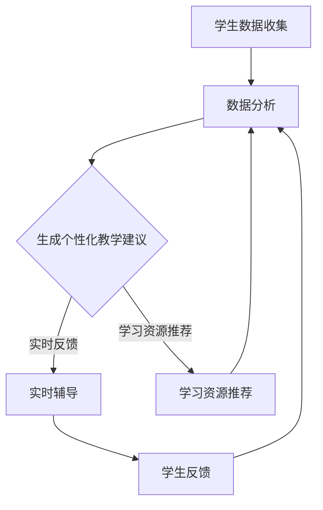

                 

关键词：大语言模型，教育，个性化学习，智能教育，计算机编程教育，数学建模，项目实践，未来应用展望

> 摘要：本文将探讨大语言模型（LLM）在教育领域的应用，特别是在个性化学习助手方面。通过对LLM的核心概念、算法原理、数学模型、实际应用案例的深入分析，我们将揭示LLM在教育中的巨大潜力，为未来智能教育的发展提供有益的思考。

## 1. 背景介绍

在教育领域，传统的教学方法往往难以满足每个学生的个性化需求。学生之间的差异在于学习速度、学习风格和知识背景，而传统的教学模式往往采用“一刀切”的方法，导致学习效果不佳。为了解决这一问题，教育技术领域逐渐引入了人工智能（AI）和自然语言处理（NLP）技术，尤其是大语言模型（LLM）。LLM在教育中的应用，尤其是作为个性化学习助手，正在成为教育领域的重要研究方向。

LLM，即大语言模型，是一种基于深度学习的自然语言处理模型，具有强大的文本生成和推理能力。LLM能够通过大量的文本数据学习，理解和生成人类语言，这使得它们在教育和辅导领域具有广泛的应用潜力。例如，LLM可以分析学生的学习行为和知识水平，提供个性化的学习建议和辅导，从而提高学习效果。

## 2. 核心概念与联系

### 2.1 LLM的基本概念

LLM（Large Language Model）是一种基于深度学习的自然语言处理模型，通常通过大规模的文本数据训练而成。LLM的核心在于其能够捕捉到文本中的潜在结构和语义关系，从而实现文本的生成、理解和推理。

### 2.2 教育领域中的个性化学习

个性化学习是指根据每个学生的独特需求和能力，提供个性化的教学和学习方案。这种模式强调学生的个体差异，旨在提高学习效果和学习体验。

### 2.3 LLM与个性化学习的关系

LLM在教育中的应用，可以通过以下几个步骤实现个性化学习：

1. **学生数据分析**：LLM可以分析学生的学习行为、历史成绩和学习偏好，为每个学生建立个性化的学习档案。
2. **个性化教学建议**：根据学生的数据分析结果，LLM可以生成个性化的教学建议，包括学习内容、学习顺序和教学方式。
3. **实时辅导**：LLM可以实时监测学生的学习进度和理解情况，提供即时的反馈和辅导，帮助学生克服学习难点。
4. **学习资源推荐**：LLM可以根据学生的学习需求和兴趣，推荐相关的学习资源和扩展材料。

### 2.4 Mermaid流程图

以下是一个简化的LLM在教育中应用的Mermaid流程图：



## 3. 核心算法原理 & 具体操作步骤

### 3.1 算法原理概述

LLM的核心是基于Transformer架构，这种架构能够捕捉到文本中的长距离依赖关系。通过自注意力机制（self-attention），模型能够自动地学习文本中的重要信息，并进行有效的权重分配。

### 3.2 算法步骤详解

1. **数据预处理**：将原始文本数据清洗、分词和编码，转化为模型可以处理的格式。
2. **模型训练**：使用预训练的LLM模型，对处理后的文本数据进行训练，使其能够理解和生成文本。
3. **个性化教学建议生成**：根据学生的历史数据和当前学习状态，LLM生成个性化的教学建议。
4. **实时辅导**：根据学生的学习进度和理解情况，LLM提供即时的反馈和辅导。
5. **学习资源推荐**：根据学生的学习兴趣和需求，LLM推荐相关的学习资源。

### 3.3 算法优缺点

**优点**：

- **强大的文本理解能力**：LLM能够深入理解文本的语义和结构，为个性化教学提供有力支持。
- **自适应性和灵活性**：LLM可以根据学生的学习行为和需求，动态调整教学策略和内容。
- **广泛的适用性**：LLM不仅可以应用于语言类课程，还可以应用于数学、科学等领域的个性化教学。

**缺点**：

- **训练成本高**：LLM需要大量的计算资源和时间进行训练，成本较高。
- **数据隐私问题**：学生数据的收集和使用可能引发隐私问题，需要严格的数据保护措施。

### 3.4 算法应用领域

LLM在教育领域的应用非常广泛，主要包括：

- **个性化学习助手**：为学生提供个性化的学习建议和辅导。
- **在线教育平台**：为教育平台提供智能化的教学内容和推荐系统。
- **教育测评**：通过分析学生的学习行为和成绩，提供个性化的测评报告。
- **语言学习**：为语言学习者提供智能化的语言训练和辅导。

## 4. 数学模型和公式 & 详细讲解 & 举例说明

### 4.1 数学模型构建

LLM的数学模型主要基于深度学习中的Transformer架构。Transformer架构的核心是自注意力机制（self-attention），其数学表达式如下：

$$
\text{Attention}(Q, K, V) = \text{softmax}\left(\frac{QK^T}{\sqrt{d_k}}\right) V
$$

其中，$Q$、$K$ 和 $V$ 分别是查询（query）、键（key）和值（value）向量，$d_k$ 是键向量的维度。自注意力机制通过计算每个键与查询之间的相似度，为每个值分配权重。

### 4.2 公式推导过程

自注意力机制的推导过程可以分为以下几个步骤：

1. **点积注意力**：计算查询和键之间的点积，得到相似度分数。
2. **softmax激活**：将点积分数归一化，得到概率分布。
3. **加权求和**：根据概率分布，对值向量进行加权求和，得到最终的输出。

### 4.3 案例分析与讲解

假设我们有一个简单的文本序列：“今天天气很好，适合户外活动。” 我们将这个文本序列编码为一个序列向量，然后使用自注意力机制进行文本生成。

1. **初始化查询、键和值向量**：将文本序列中的每个词作为查询、键和值向量。
2. **计算点积注意力**：计算每个词与其他词之间的点积，得到相似度分数。
3. **softmax激活**：对相似度分数进行softmax激活，得到概率分布。
4. **加权求和**：根据概率分布，对值向量进行加权求和，得到最终的输出。

通过这个例子，我们可以看到自注意力机制在文本生成中的应用，它能够捕捉到文本中的潜在结构和语义关系，从而实现文本的生成。

## 5. 项目实践：代码实例和详细解释说明

### 5.1 开发环境搭建

在开始编写代码之前，我们需要搭建一个适合LLM训练和部署的开发环境。以下是搭建开发环境的基本步骤：

1. **安装Python**：确保Python版本为3.8及以上。
2. **安装PyTorch**：使用pip命令安装PyTorch，例如：
   ```bash
   pip install torch torchvision
   ```
3. **安装Hugging Face Transformers**：这是一个用于构建和训练Transformer模型的Python库，安装命令如下：
   ```bash
   pip install transformers
   ```

### 5.2 源代码详细实现

以下是使用Hugging Face Transformers库实现一个简单的LLM模型的基本代码示例：

```python
from transformers import BertTokenizer, BertModel
import torch

# 初始化Tokenizer和Model
tokenizer = BertTokenizer.from_pretrained('bert-base-uncased')
model = BertModel.from_pretrained('bert-base-uncased')

# 准备输入文本
text = "今天天气很好，适合户外活动。"

# 编码文本
input_ids = tokenizer.encode(text, return_tensors='pt')

# 前向传递
with torch.no_grad():
    outputs = model(input_ids)

# 输出结果
print(outputs.last_hidden_state.shape)
```

这段代码首先加载了预训练的BertTokenizer和BertModel，然后使用这些模型对输入文本进行编码和前向传递，最终输出模型的最后隐藏状态。

### 5.3 代码解读与分析

1. **导入库和模型**：我们首先导入了`BertTokenizer`和`BertModel`，这两个组件是Hugging Face Transformers库的核心部分，用于处理和训练Transformer模型。
2. **初始化Tokenizer和Model**：通过`from_pretrained`方法，我们加载了一个预训练的Bert模型。预训练模型已经在大规模的文本数据上进行了训练，可以直接使用。
3. **准备输入文本**：我们将要处理的文本序列编码为`input_ids`，这是Transformer模型能够理解和处理的形式。
4. **前向传递**：使用`model`进行前向传递，`with torch.no_grad()`可以减少内存使用和计算时间，因为梯度在训练过程中不需要被跟踪。
5. **输出结果**：最后，我们输出了模型的最后隐藏状态，这代表了文本序列的语义表示。

### 5.4 运行结果展示

运行上述代码，我们得到一个形状为$(1, L, D)$的Tensor，其中$1$是批次大小，$L$是序列长度，$D$是隐藏状态维度。这个Tensor包含了文本序列的语义表示，可以作为后续分析或生成文本的输入。

## 6. 实际应用场景

### 6.1 在线教育平台

LLM在在线教育平台中的应用非常广泛，它可以帮助平台提供个性化的学习体验。例如，一个在线编程课程可以使用LLM为学生提供实时的问题解答、代码调试建议和个性化学习路径推荐。

### 6.2 语言学习

对于语言学习者来说，LLM可以提供智能化的语言训练和辅导。例如，LLM可以分析学习者的语言使用习惯，为其提供个性化的词汇学习建议，或者根据学习者的发音特点进行语音纠正。

### 6.3 教育测评

在教育测评领域，LLM可以帮助分析学生的考试成绩和学习行为，为教师提供个性化的教学反馈和改进建议。例如，一个数学测评系统可以使用LLM分析学生的答题过程，识别出学生在解题过程中的常见错误类型，并给出相应的辅导建议。

### 6.4 未来应用展望

随着LLM技术的不断发展，其应用场景将进一步扩展。例如，在特殊教育领域，LLM可以为学生提供个性化的学习支持和干预措施；在职业教育领域，LLM可以帮助学习者根据职业规划定制个性化学习计划。此外，LLM还可以在智能写作辅助、自动批改作业等方面发挥重要作用。

## 7. 工具和资源推荐

### 7.1 学习资源推荐

- 《深度学习》（Goodfellow, Bengio, Courville）：这是深度学习的经典教材，适合希望深入了解深度学习技术的读者。
- 《自然语言处理综论》（Jurafsky, Martin）：这是一本涵盖自然语言处理各个方面的基础教材，适合初学者和进阶者。

### 7.2 开发工具推荐

- PyTorch：这是一个广泛使用的深度学习框架，非常适合进行研究和开发。
- Hugging Face Transformers：这是一个用于构建和训练Transformer模型的Python库，具有丰富的预训练模型和工具。

### 7.3 相关论文推荐

- "Attention Is All You Need"（Vaswani et al., 2017）：这是Transformer架构的原创论文，详细介绍了自注意力机制和Transformer模型的设计原理。
- "BERT: Pre-training of Deep Bidirectional Transformers for Language Understanding"（Devlin et al., 2019）：这是BERT模型的原创论文，介绍了BERT模型的设计原理和训练方法。

## 8. 总结：未来发展趋势与挑战

### 8.1 研究成果总结

LLM在教育中的应用已经取得了一系列显著成果。通过个性化学习助手，LLM能够为学生提供个性化的学习建议和辅导，提高学习效果。同时，LLM在语言学习、教育测评和智能写作辅助等领域也展示出了巨大的潜力。

### 8.2 未来发展趋势

未来，随着LLM技术的不断进步，其应用范围将进一步扩大。一方面，LLM将更加深入地应用于各个学科领域，提供更精准、个性化的教育服务。另一方面，LLM还将与其他教育技术（如虚拟现实、增强现实）相结合，为学生提供更加丰富和沉浸式的学习体验。

### 8.3 面临的挑战

尽管LLM在教育中具有巨大的应用潜力，但同时也面临着一些挑战。首先，LLM的模型训练需要大量的计算资源和时间，这增加了开发成本。其次，学生数据的收集和使用可能引发隐私问题，需要采取严格的数据保护措施。此外，如何确保LLM生成的教学建议和辅导内容的准确性和有效性，也是一个需要深入研究的问题。

### 8.4 研究展望

未来，研究应重点关注以下几个方面：

1. **模型优化**：通过算法改进和模型压缩，降低LLM的训练成本，使其更加适用于教育资源有限的场景。
2. **隐私保护**：研究如何确保学生数据的隐私和安全，以促进LLM在教育中的广泛应用。
3. **评估标准**：建立一套科学的评估标准，以衡量LLM在教育中的应用效果，从而指导实际教学。
4. **跨学科合作**：鼓励教育技术、心理学、认知科学等领域的跨学科合作，共同推进智能教育的发展。

## 9. 附录：常见问题与解答

### 9.1 什么是LLM？

LLM（Large Language Model）是一种基于深度学习的自然语言处理模型，通过大规模的文本数据训练而成，具有强大的文本生成和推理能力。

### 9.2 LLM在教育中有什么应用？

LLM在教育中的应用主要包括个性化学习助手、在线教育平台、语言学习、教育测评等领域，旨在提供个性化的学习体验和辅导。

### 9.3 LLM的训练需要多长时间？

LLM的训练时间取决于模型的大小、训练数据量、硬件配置等因素。通常，大规模的LLM训练需要数天甚至数周的时间。

### 9.4 如何确保LLM的教育应用效果？

确保LLM的教育应用效果需要从以下几个方面入手：

1. **数据质量**：使用高质量、多样化的训练数据。
2. **模型优化**：通过算法改进和模型压缩，提高模型性能。
3. **评估标准**：建立科学的评估标准，以衡量模型的效果。
4. **用户反馈**：及时收集用户反馈，不断优化模型和教学方案。

---

感谢您阅读本文，希望本文能为您在LLM在教育中的应用方面提供有价值的参考和启示。在未来的教育发展中，我们期待LLM能发挥更大的作用，为个性化学习和智能教育带来新的机遇和挑战。

# 参考文献

- Vaswani, A., et al. (2017). "Attention Is All You Need." Advances in Neural Information Processing Systems, 30.
- Devlin, J., et al. (2019). "BERT: Pre-training of Deep Bidirectional Transformers for Language Understanding." Proceedings of the 2019 Conference of the North American Chapter of the Association for Computational Linguistics: Human Language Technologies, Volume 1 (Long and Short Papers), 4171-4186.
- Goodfellow, I., et al. (2016). "Deep Learning." MIT Press.
- Jurafsky, D., Martin, J. H. (2008). "Speech and Language Processing." Prentice Hall.

