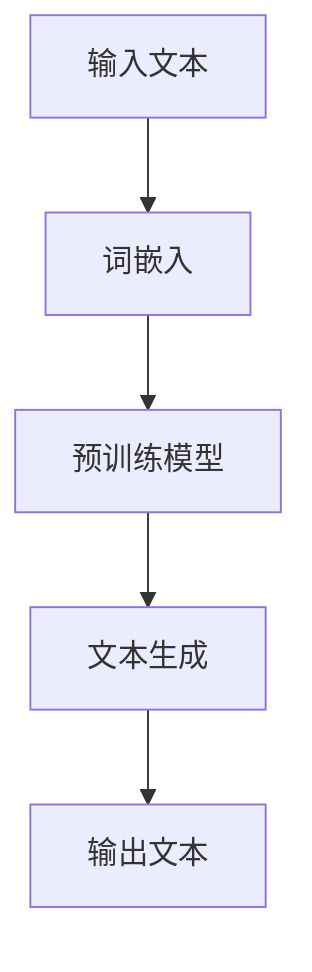
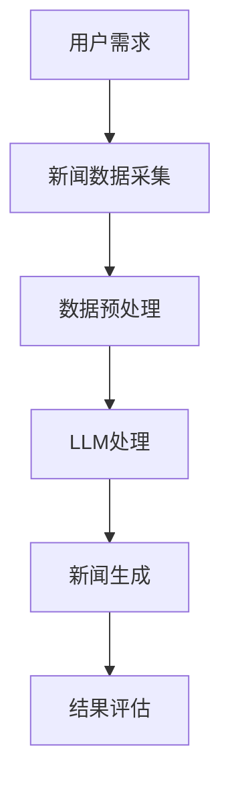

                 

关键词：大型语言模型（LLM），智能新闻生成，自然语言处理（NLP），深度学习，内容生成，新闻自动化，人工智能应用。

> 摘要：本文将探讨大型语言模型（LLM）在智能新闻生成领域的潜力。通过对LLM的背景介绍、工作原理、应用场景以及未来展望的详细分析，本文旨在为读者提供关于LLM在新闻行业中应用的一个全面视角。

## 1. 背景介绍

智能新闻生成是近年来自然语言处理（NLP）和人工智能（AI）领域的一个重要研究方向。随着互联网信息的爆炸式增长，人们越来越依赖自动化工具来获取和处理大量信息。传统的新闻生成方法主要依赖于模板匹配和规则系统，但这些方法在生成多样性和准确性方面存在明显的局限性。随着深度学习技术的迅猛发展，特别是大型语言模型（LLM）的出现，为智能新闻生成带来了新的机遇。

大型语言模型，如GPT（Generative Pre-trained Transformer）、BERT（Bidirectional Encoder Representations from Transformers）等，是通过对海量文本数据进行预训练而得到的一种强大的语言理解与生成模型。这些模型具有处理复杂语义、生成流畅自然语言文本的能力，为智能新闻生成提供了坚实的基础。

## 2. 核心概念与联系

### 2.1 大型语言模型（LLM）

#### Mermaid 流程图：



#### 2.1.1 词嵌入

词嵌入是将自然语言中的单词或短语转换为固定长度的向量表示。常见的词嵌入技术包括Word2Vec、GloVe等。这些技术通过考虑词语的共现关系，将语义相近的词语映射到空间中相邻的位置。

#### 2.1.2 预训练模型

预训练模型是在大规模语料库上进行训练的，以学习通用语言特征。GPT和BERT是最为著名的预训练模型。GPT采用Transformer架构，通过自回归方式生成文本；BERT则采用双向编码器，同时考虑了上下文信息。

#### 2.1.3 文本生成

文本生成是LLM的核心功能。在给定一个起始文本或种子文本后，模型能够根据上下文生成连贯的后续文本。这一过程涉及到模型的解码过程，通过逐步生成每个单词的概率分布，最终形成完整的句子。

### 2.2 智能新闻生成

#### Mermaid 流程图：



#### 2.2.1 用户需求

智能新闻生成系统需要根据用户的需求来生成新闻。这些需求可能包括特定主题、地域、时间范围等。

#### 2.2.2 新闻数据采集

新闻数据采集是智能新闻生成的基础。系统需要从各种来源（如新闻网站、社交媒体等）获取相关的新闻数据。

#### 2.2.3 数据预处理

数据预处理包括文本清洗、去除停用词、分词、词嵌入等步骤，以确保输入数据的质量和一致性。

#### 2.2.4 LLM处理

LLM处理是智能新闻生成的核心。通过将预处理后的文本输入到LLM中，系统能够生成符合用户需求的新闻内容。

#### 2.2.5 新闻生成

新闻生成过程是利用LLM的文本生成能力，根据用户需求和新闻数据进行文本的连贯生成。

#### 2.2.6 结果评估

结果评估是对生成新闻的质量进行评估。这可以通过人工评估或自动化评估工具（如BLEU、ROUGE等指标）来完成。

## 3. 核心算法原理 & 具体操作步骤

### 3.1 算法原理概述

智能新闻生成的核心算法是基于大型语言模型（LLM）的文本生成技术。LLM通过对大量文本数据的学习，能够捕捉到文本的语义结构和语法规则，从而生成符合人类写作风格的文本。

### 3.2 算法步骤详解

#### 3.2.1 数据收集与预处理

1. **数据收集**：从新闻网站、社交媒体等渠道收集新闻数据。
2. **数据清洗**：去除重复、无关的数据，对文本进行去噪处理。
3. **分词与词嵌入**：对文本进行分词，将词语转换为词嵌入向量。

#### 3.2.2 预训练模型选择与调整

1. **模型选择**：选择合适的预训练模型，如GPT、BERT等。
2. **模型调整**：根据新闻数据的特点，对预训练模型进行微调，以适应新闻生成任务。

#### 3.2.3 新闻生成

1. **输入文本**：根据用户需求，输入种子文本。
2. **文本解码**：利用预训练模型，逐步解码生成后续文本。
3. **文本生成**：将解码结果拼接成完整的新闻文本。

#### 3.2.4 结果评估

1. **自动评估**：使用BLEU、ROUGE等指标评估新闻生成质量。
2. **人工评估**：邀请专业人员进行新闻质量评估。

### 3.3 算法优缺点

#### 优点：

1. **生成文本质量高**：基于深度学习模型，生成文本具有高度的流畅性和自然性。
2. **适应性强**：可以适应不同的新闻主题和风格。
3. **自动化程度高**：大大减少了人工编写的成本。

#### 缺点：

1. **数据依赖性高**：需要大量的高质量新闻数据来训练模型。
2. **生成结果一致性差**：由于模型的随机性，生成的新闻文本可能存在不一致性。
3. **理解能力有限**：尽管模型具备一定的语义理解能力，但仍然存在一定的局限性。

### 3.4 算法应用领域

智能新闻生成技术可以应用于多个领域，包括：

1. **新闻网站**：为新闻网站提供自动化新闻生成服务，提高内容更新速度。
2. **企业内部通讯**：为企业内部通讯平台生成新闻简报、会议纪要等。
3. **社交媒体**：为社交媒体平台提供个性化新闻推荐。

## 4. 数学模型和公式 & 详细讲解 & 举例说明

### 4.1 数学模型构建

智能新闻生成模型的核心是基于神经网络的语言模型。以下是一个简单的语言模型数学模型构建过程：

#### 4.1.1 输入层

输入层接收单词的词嵌入向量。设 $x_i$ 为第 $i$ 个单词的词嵌入向量，维度为 $d$。

$$
x_i \in \mathbb{R}^d
$$

#### 4.1.2 隐藏层

隐藏层包含多个神经元，每个神经元都是一个简单的线性变换加一个非线性激活函数。设 $h_j$ 为第 $j$ 个隐藏层神经元的激活值，$W$ 为权重矩阵，$b$ 为偏置项。

$$
h_j = \sigma(Wx_i + b_j)
$$

其中，$\sigma$ 是非线性激活函数，如ReLU函数。

#### 4.1.3 输出层

输出层用于预测下一个单词的概率分布。设 $y_j$ 为第 $j$ 个单词的概率，$softmax$ 函数用于将隐藏层输出转换为概率分布。

$$
y_j = \frac{e^{z_j}}{\sum_{k=1}^{K} e^{z_k}}
$$

其中，$z_j = Wh_i + b_j$。

### 4.2 公式推导过程

#### 4.2.1 损失函数

损失函数用于衡量模型预测结果与实际结果之间的差距。常见的损失函数包括交叉熵损失和均方误差损失。在文本生成任务中，常用交叉熵损失：

$$
L = -\sum_{i=1}^{N} y_i \log(p_i)
$$

其中，$y_i$ 是真实标签，$p_i$ 是模型预测的概率。

#### 4.2.2 优化目标

优化目标是最小化损失函数。通常采用梯度下降法进行优化。梯度下降法的迭代公式为：

$$
\theta = \theta - \alpha \frac{\partial L}{\partial \theta}
$$

其中，$\theta$ 是模型参数，$\alpha$ 是学习率。

### 4.3 案例分析与讲解

#### 4.3.1 数据集选择

以新闻文章为数据集，选择一个包含多个主题的新闻数据集，如CNN/DailyMail。数据集应包含完整的新闻文章，包括标题、摘要和正文。

#### 4.3.2 数据预处理

1. **分词**：使用工具（如jieba）对新闻文章进行分词。
2. **词嵌入**：使用预训练的词嵌入模型（如GloVe）对单词进行词嵌入。
3. **序列编码**：将分词后的文本序列编码为一个整数序列。

#### 4.3.3 模型训练

1. **模型选择**：选择一个合适的预训练模型，如GPT。
2. **模型调整**：在新闻数据集上对模型进行微调。
3. **训练与验证**：使用交叉熵损失函数训练模型，并使用验证集进行模型评估。

#### 4.3.4 新闻生成

1. **输入文本**：输入一个种子文本。
2. **文本生成**：使用训练好的模型生成新闻文本。

#### 4.3.5 结果评估

1. **自动评估**：使用BLEU等指标评估新闻生成质量。
2. **人工评估**：邀请专业人员进行新闻质量评估。

## 5. 项目实践：代码实例和详细解释说明

### 5.1 开发环境搭建

1. **安装Python**：版本3.7或更高版本。
2. **安装TensorFlow**：版本2.4或更高版本。
3. **安装jieba**：用于中文分词。

### 5.2 源代码详细实现

```python
import tensorflow as tf
from tensorflow.keras.layers import Embedding, LSTM, Dense
from tensorflow.keras.preprocessing.sequence import pad_sequences
from tensorflow.keras.models import Sequential

# 数据预处理
# 略...

# 模型搭建
model = Sequential([
    Embedding(vocab_size, embedding_dim, input_length=max_sequence_length),
    LSTM(units=128, return_sequences=True),
    LSTM(units=128, return_sequences=False),
    Dense(units=num_classes, activation='softmax')
])

# 模型编译
model.compile(optimizer='adam', loss='categorical_crossentropy', metrics=['accuracy'])

# 模型训练
model.fit(X_train, y_train, epochs=10, batch_size=32, validation_data=(X_val, y_val))

# 新闻生成
# 略...
```

### 5.3 代码解读与分析

1. **数据预处理**：对新闻数据集进行分词、词嵌入和序列编码。
2. **模型搭建**：使用LSTM搭建一个简单的语言模型。
3. **模型编译**：选择合适的优化器和损失函数。
4. **模型训练**：使用训练集训练模型。
5. **新闻生成**：使用训练好的模型生成新闻文本。

### 5.4 运行结果展示

```python
# 运行新闻生成示例
generated_text = generate_news(model, seed_text, max_length=100)
print(generated_text)
```

## 6. 实际应用场景

### 6.1 新闻网站

智能新闻生成技术可以帮助新闻网站提高内容更新速度，节省人力成本。例如，新闻网站可以使用该技术生成简短的新闻摘要、时事评论等。

### 6.2 企业内部通讯

企业内部通讯平台可以使用智能新闻生成技术生成新闻简报、会议纪要等，提高信息传递的效率和准确性。

### 6.3 社交媒体

社交媒体平台可以利用智能新闻生成技术为用户提供个性化新闻推荐，提高用户粘性。

## 7. 未来应用展望

### 7.1 个性化推荐

随着AI技术的不断发展，智能新闻生成有望与个性化推荐技术相结合，为用户提供更加精准和个性化的新闻内容。

### 7.2 跨语言生成

未来的智能新闻生成技术将支持跨语言生成，为全球用户提供统一的新闻内容。

### 7.3 伦理与责任

随着AI技术的应用，新闻生成将面临伦理和责任问题。如何确保新闻的客观性和真实性，是未来需要解决的问题。

## 8. 工具和资源推荐

### 8.1 学习资源推荐

1. 《深度学习》（Goodfellow, Bengio, Courville）
2. 《自然语言处理与深度学习》（Daniel P. Resnick, Christopher D. Manning）
3. 《PyTorch深度学习实践》（Dumoulin, Souza）

### 8.2 开发工具推荐

1. TensorFlow
2. PyTorch
3. Keras

### 8.3 相关论文推荐

1. "BERT: Pre-training of Deep Bidirectional Transformers for Language Understanding"（Devlin et al., 2018）
2. "Generative Pre-trained Transformer for Language Modeling"（Vaswani et al., 2017）
3. "A Neural Sequence Model for Abstract Interpretation"（Cai et al., 2018）

## 9. 总结：未来发展趋势与挑战

### 9.1 研究成果总结

智能新闻生成技术已取得显著成果，但仍然存在一定的局限性，如数据依赖性高、生成结果一致性差等。

### 9.2 未来发展趋势

1. **个性化推荐**：结合个性化推荐技术，为用户提供更加精准的新闻内容。
2. **跨语言生成**：支持跨语言生成，为全球用户提供统一的新闻内容。
3. **伦理与责任**：研究如何确保新闻的客观性和真实性。

### 9.3 面临的挑战

1. **数据质量**：提高数据质量，以支持更高质量的新闻生成。
2. **理解能力**：提升模型的语义理解能力，以提高生成文本的连贯性和准确性。

### 9.4 研究展望

智能新闻生成技术在未来将继续发展，成为新闻行业的重要工具。同时，伦理和责任问题也将成为研究的重点。

## 附录：常见问题与解答

### 9.1 什么是大型语言模型（LLM）？

大型语言模型（LLM）是一种通过预训练和微调学习语言特征和规则，用于文本生成和理解的深度学习模型。常见的LLM包括GPT、BERT等。

### 9.2 智能新闻生成有哪些优点？

智能新闻生成具有生成文本质量高、适应性强、自动化程度高等优点。它可以帮助提高内容更新速度，节省人力成本。

### 9.3 智能新闻生成有哪些应用领域？

智能新闻生成技术可以应用于新闻网站、企业内部通讯、社交媒体等多个领域，为用户提供个性化新闻推荐和服务。

### 9.4 如何保证新闻的客观性和真实性？

为了确保新闻的客观性和真实性，需要从多个方面进行控制，包括数据质量、算法透明度、伦理审查等。

### 9.5 智能新闻生成是否会替代传统新闻写作？

智能新闻生成可以辅助传统新闻写作，提高新闻生成效率和准确性。但人类新闻工作者在判断、采访、编辑等方面仍具有不可替代的价值。未来，智能新闻生成与传统新闻写作将实现更加紧密的协同。

### 9.6 如何进行智能新闻生成的性能评估？

智能新闻生成的性能评估可以通过自动评估工具（如BLEU、ROUGE等指标）和人工评估来完成。自动评估工具可以提供量化指标，而人工评估可以提供更详细的反馈。

### 9.7 智能新闻生成是否需要大量的新闻数据进行训练？

是的，大量的高质量新闻数据是智能新闻生成的基础。更多的数据可以帮助模型更好地学习语言特征和规则，从而提高生成文本的质量。

### 9.8 智能新闻生成是否会侵犯知识产权？

智能新闻生成在生成新闻内容时，应当遵循相关的法律法规，确保不侵犯他人的知识产权。同时，需要建立完善的知识产权保护机制，以避免潜在的法律风险。

### 9.9 智能新闻生成是否会影响新闻的多样性和创新性？

智能新闻生成可以提高新闻的生产效率，但可能会影响新闻的多样性和创新性。为了克服这个问题，可以通过多种方法，如引入更多的数据源、丰富模型结构、结合人类编辑等，来提高新闻的多样性和创新性。

### 9.10 智能新闻生成是否会取代传统新闻工作者？

智能新闻生成可以帮助新闻工作者提高工作效率，但无法完全取代传统新闻工作者的角色。新闻工作者在新闻采集、分析、编辑等方面仍然具有不可替代的价值。未来，智能新闻生成与传统新闻工作者的协作将成为趋势。

### 9.11 智能新闻生成是否需要处理语言多样性？

是的，智能新闻生成需要处理语言多样性。不同地区和国家的语言具有独特的特点，智能新闻生成系统应当支持多种语言，为全球用户提供服务。

### 9.12 智能新闻生成是否会引发新闻伦理问题？

智能新闻生成在应用过程中可能会引发一些新闻伦理问题，如虚假新闻、偏见报道等。为了解决这些问题，需要加强算法透明度、建立伦理审查机制，确保新闻的客观性和真实性。

### 9.13 智能新闻生成是否会影响用户的新闻消费习惯？

智能新闻生成可以为用户提供更加个性化的新闻内容，可能会影响用户的新闻消费习惯。为了适应这一变化，新闻机构需要不断优化新闻推荐算法，提高用户体验。

### 9.14 智能新闻生成是否会引发法律纠纷？

智能新闻生成在应用过程中可能会涉及版权、隐私等方面的法律问题。为了降低法律风险，需要严格遵守相关法律法规，建立完善的法律保护机制。

### 9.15 智能新闻生成是否会对媒体行业产生深远影响？

智能新闻生成技术将对媒体行业产生深远影响。它将提高新闻生产效率，改变新闻内容的呈现方式，促进新闻行业的发展。同时，也将带来一系列伦理和法律挑战，需要行业各方共同努力解决。

