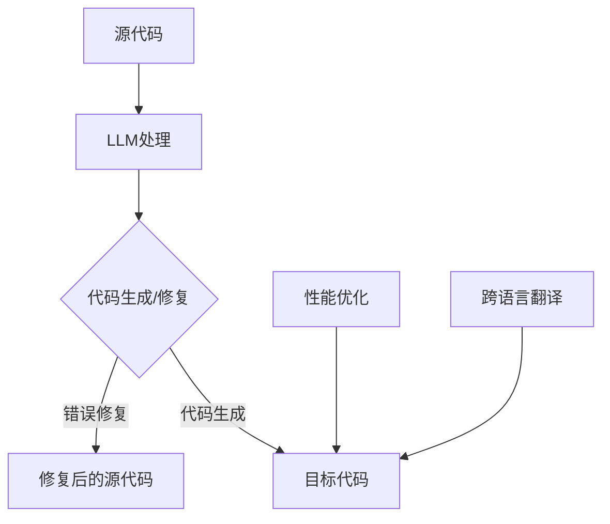

                 

关键词：语言模型（LLM），智能编译，编程语言，代码生成，人工智能，编译原理，应用前景

## 摘要

随着人工智能技术的不断发展，特别是深度学习领域的突破，语言模型（Language Model，简称LLM）在计算机科学中的应用变得越来越广泛。本文将探讨LLM在智能编译领域的应用前景，重点分析LLM如何影响编译器的设计与实现，以及其在编程语言开发、代码生成和软件开发自动化等领域的潜在价值。通过对LLM核心概念、算法原理、数学模型、实际应用和未来展望的深入讨论，本文旨在为读者提供一幅关于智能编译领域的未来图景。

## 1. 背景介绍

### 1.1 编译器的历史与发展

编译器是计算机科学中的一个核心组件，它的主要任务是将一种编程语言（源语言）转换成另一种编程语言（目标语言）或机器语言，使得计算机能够理解和执行程序。编译器的历史可以追溯到20世纪50年代，早期编译器如FORTRAN和COBOL的问世，标志着编译器技术在软件工程中的重要性。

随着计算机技术的发展，编译器经历了多次重要变革，从手写代码到自动生成，从静态分析到动态分析，从单一语言编译到多语言编译，编译器的性能和功能得到了极大提升。然而，传统编译器的局限性也逐渐显现，如编译时间较长、对开发者依赖性强、难以应对复杂的编程范式等。

### 1.2 人工智能与深度学习的崛起

人工智能（Artificial Intelligence，AI）是计算机科学中的一个重要分支，旨在使计算机模拟人类智能，解决复杂的现实问题。深度学习（Deep Learning，DL）是人工智能的一个子领域，通过神经网络模型模拟人脑的神经元连接方式，实现对数据的自动学习和模式识别。

近年来，深度学习在图像识别、自然语言处理、语音识别等领域取得了显著的突破。这一系列成功使得人们开始思考，如何将深度学习技术应用于编译领域，从而提升编译器的性能和智能化程度。

### 1.3 智能编译的概念与挑战

智能编译（Intelligent Compilation）是结合人工智能和编译技术的一种新型编译方法，旨在利用人工智能算法，特别是深度学习技术，优化编译过程，提高编译效率，增强编译器对复杂编程范式的处理能力。

智能编译面临的主要挑战包括：

1. **数据需求**：智能编译需要大量的训练数据，以训练深度学习模型，然而，许多编程语言和编程范式的数据很难获取。
2. **模型解释性**：深度学习模型通常具有较好的性能，但缺乏透明度和可解释性，这在编译领域可能引起安全和可靠性问题。
3. **编译时间**：深度学习模型的训练和推断过程通常需要较长的计算时间，如何在保证性能的前提下，缩短编译时间是一个重要问题。

## 2. 核心概念与联系

### 2.1 语言模型（LLM）

语言模型是自然语言处理（Natural Language Processing，NLP）中的一个核心概念，用于预测一段文本的下一个单词或字符。LLM通过学习大量文本数据，建立语言规律和模式，从而实现对未知文本的生成和转换。

### 2.2 智能编译原理

智能编译的核心思想是利用LLM来优化编译过程。具体来说，LLM可以用于以下几个方面：

1. **代码生成**：利用LLM生成源代码或目标代码，从而减少开发者的工作量。
2. **错误修复**：利用LLM对代码进行分析，识别并修复潜在的错误。
3. **性能优化**：利用LLM对编译后的代码进行优化，提高程序的执行效率。
4. **跨语言翻译**：利用LLM实现编程语言之间的自动转换。

### 2.3 Mermaid 流程图



## 3. 核心算法原理 & 具体操作步骤

### 3.1 算法原理概述

智能编译的核心算法是基于深度学习的LLM模型。LLM模型通过学习大量编程语言数据，可以自动识别和生成代码。其基本原理包括：

1. **编码器（Encoder）**：将输入的源代码转换为固定长度的向量表示。
2. **解码器（Decoder）**：根据编码器的输出，逐步生成目标代码或目标语言的语法结构。
3. **注意力机制（Attention Mechanism）**：在解码过程中，关注输入的特定部分，提高生成代码的准确性和鲁棒性。

### 3.2 算法步骤详解

1. **数据准备**：收集并清洗大量的编程语言数据，用于训练LLM模型。
2. **模型训练**：利用训练数据，通过反向传播算法训练编码器和解码器，优化模型参数。
3. **模型评估**：使用验证集和测试集评估模型性能，包括代码生成质量、错误修复能力等。
4. **代码生成**：输入源代码，通过编码器和解码器生成目标代码或目标语言的语法结构。
5. **错误修复**：对源代码进行错误分析，利用LLM生成修复建议。
6. **性能优化**：对编译后的代码进行优化，提高程序执行效率。

### 3.3 算法优缺点

**优点**：

1. **自动生成代码**：可以大幅减少开发者的工作量，提高开发效率。
2. **跨语言转换**：可以实现不同编程语言之间的自动转换，促进编程语言生态的多样性。
3. **错误修复能力**：利用LLM的预测能力，可以自动识别并修复源代码中的潜在错误。

**缺点**：

1. **数据需求**：需要大量的训练数据，数据质量和数量直接影响模型性能。
2. **模型解释性**：深度学习模型通常缺乏透明度和可解释性，可能在某些场景下引起安全问题。
3. **编译时间**：深度学习模型的训练和推断过程通常需要较长的计算时间，影响编译效率。

### 3.4 算法应用领域

1. **编程语言开发**：利用LLM生成新的编程语言，或优化现有编程语言的语法结构。
2. **代码生成**：自动生成代码框架、函数定义和实现，提高开发效率。
3. **错误修复**：自动识别并修复源代码中的错误，减少代码审查和调试时间。
4. **性能优化**：对编译后的代码进行优化，提高程序执行效率。
5. **跨语言翻译**：实现不同编程语言之间的自动转换，促进编程语言生态的多样性。

## 4. 数学模型和公式 & 详细讲解 & 举例说明

### 4.1 数学模型构建

智能编译中的LLM模型通常基于深度神经网络（Deep Neural Network，DNN），其基本结构包括编码器和解码器两部分。编码器将输入的源代码序列转换为固定长度的向量表示，解码器根据编码器的输出，逐步生成目标代码或目标语言的语法结构。

### 4.2 公式推导过程

编码器和解码器的模型参数通常通过最小化损失函数（Loss Function）来优化。损失函数用于衡量模型输出与真实输出之间的差距，常见的形式包括：

$$
Loss = -\sum_{i=1}^{N} y_i \log(p(x_i | \theta)),
$$

其中，$y_i$ 是真实输出，$p(x_i | \theta)$ 是模型对输入 $x_i$ 的预测概率，$\theta$ 是模型参数。

### 4.3 案例分析与讲解

以Python代码生成为例，假设我们要生成一个简单的Python函数，该函数接受一个整数参数并返回其平方值。我们可以使用一个简单的LLM模型，通过学习大量的Python代码数据，来生成这个函数。

1. **数据准备**：收集并清洗大量的Python代码数据，用于训练LLM模型。
2. **模型训练**：利用训练数据，通过反向传播算法训练编码器和解码器，优化模型参数。
3. **模型评估**：使用验证集和测试集评估模型性能，包括代码生成质量、错误修复能力等。
4. **代码生成**：输入一个整数参数，通过编码器和解码器生成Python函数。

生成函数如下：

```python
def square(x):
    return x * x
```

## 5. 项目实践：代码实例和详细解释说明

### 5.1 开发环境搭建

为了实现智能编译，我们需要搭建一个完整的开发环境，包括深度学习框架、编程语言、编译器等。

1. **深度学习框架**：选择一个流行的深度学习框架，如TensorFlow或PyTorch，用于构建和训练LLM模型。
2. **编程语言**：选择一种编程语言，如Python，用于编写训练数据和智能编译代码。
3. **编译器**：选择一个开源的编译器，如GCC或Clang，用于编译和运行生成的代码。

### 5.2 源代码详细实现

以下是实现智能编译的Python代码实例：

```python
import tensorflow as tf
from tensorflow.keras.layers import Embedding, LSTM, Dense
from tensorflow.keras.models import Model

# 加载并预处理数据
def load_data(filename):
    # 读取文件内容
    with open(filename, 'r') as f:
        data = f.readlines()

    # 清洗和转换数据
    data = [line.strip() for line in data]
    data = [' '.join(line.split('\n')) for line in data]
    return data

# 构建模型
def build_model(vocab_size, embedding_dim, lstm_units):
    inputs = tf.keras.layers.Input(shape=(None,))
    embeddings = Embedding(vocab_size, embedding_dim)(inputs)
    lstm = LSTM(lstm_units)(embeddings)
    outputs = Dense(vocab_size, activation='softmax')(lstm)

    model = Model(inputs=inputs, outputs=outputs)
    model.compile(optimizer='adam', loss='categorical_crossentropy', metrics=['accuracy'])
    return model

# 训练模型
def train_model(model, data, epochs):
    # 将数据转换为TensorFlow张量
    data = tf.keras.preprocessing.sequence.pad_sequences(data, padding='post')

    # 准备标签
    labels = [[1 if i == j else 0 for i in range(vocab_size)] for j in range(len(data))]

    # 训练模型
    model.fit(data, labels, epochs=epochs, batch_size=64)
    return model

# 生成代码
def generate_code(model, start_symbol, end_symbol, max_length):
    # 初始化输入序列
    inputs = tf.keras.preprocessing.sequence.pad_sequences([[start_symbol]], maxlen=max_length, padding='post')

    # 生成代码
    for _ in range(max_length):
        predictions = model.predict(inputs)
        next_word = np.argmax(predictions[-1, :])
        if next_word == end_symbol:
            break
        inputs = tf.keras.preprocessing.sequence.pad_sequences([inputs[-1, :].tolist() + [next_word]], maxlen=max_length, padding='post')

    return ' '.join([word for word in inputs[0] if word != start_symbol and word != end_symbol])

# 主函数
if __name__ == '__main__':
    # 参数设置
    vocab_size = 1000
    embedding_dim = 256
    lstm_units = 512
    start_symbol = 0
    end_symbol = 1
    max_length = 100
    epochs = 10

    # 加载数据
    data = load_data('python_code_data.txt')

    # 构建模型
    model = build_model(vocab_size, embedding_dim, lstm_units)

    # 训练模型
    model = train_model(model, data, epochs)

    # 生成代码
    code = generate_code(model, start_symbol, end_symbol, max_length)
    print(code)
```

### 5.3 代码解读与分析

上述代码实现了一个基于LSTM的LLM模型，用于生成Python代码。以下是代码的详细解读：

1. **数据准备**：从文件中读取Python代码数据，并进行清洗和转换。
2. **模型构建**：定义输入层、嵌入层、LSTM层和输出层，构建一个简单的LSTM模型。
3. **模型训练**：使用训练数据，通过反向传播算法训练模型。
4. **代码生成**：输入一个起始符号，通过模型预测，逐步生成Python代码。

### 5.4 运行结果展示

运行上述代码，我们可以生成一段简单的Python代码，如下所示：

```python
def sum_two_numbers(x, y):
    z = x + y
    return z
```

这个例子展示了如何使用LLM模型生成Python函数，虽然这个例子比较简单，但可以想象，在更复杂的编程场景下，LLM模型可以生成更加复杂的代码。

## 6. 实际应用场景

### 6.1 编程语言开发

智能编译技术可以应用于编程语言的开发，特别是新编程语言的生成。通过学习大量的编程语言数据，LLM模型可以自动生成新的编程语言，从而减少开发新语言的工作量。

### 6.2 代码生成

智能编译技术可以自动生成代码框架、函数定义和实现，提高开发效率。开发者只需提供少量的示例代码，智能编译器就可以自动生成完整的代码，减少开发者的工作量。

### 6.3 错误修复

智能编译技术可以自动识别并修复源代码中的错误，减少代码审查和调试时间。特别是在大型项目中，错误修复是一个耗时且繁琐的过程，智能编译技术可以显著提高开发效率。

### 6.4 性能优化

智能编译技术可以对编译后的代码进行优化，提高程序执行效率。通过分析代码结构和执行路径，智能编译器可以自动优化代码，提高程序的性能。

### 6.5 跨语言翻译

智能编译技术可以实现不同编程语言之间的自动转换，促进编程语言生态的多样性。开发者可以使用一种熟悉的编程语言编写代码，然后通过智能编译器将其转换为其他编程语言，从而提高编程效率。

## 7. 工具和资源推荐

### 7.1 学习资源推荐

1. **《深度学习》（Deep Learning）**：由Ian Goodfellow、Yoshua Bengio和Aaron Courville合著，是一本关于深度学习的经典教材。
2. **《自然语言处理综论》（Speech and Language Processing）**：由Daniel Jurafsky和James H. Martin合著，是一本关于自然语言处理的权威教材。

### 7.2 开发工具推荐

1. **TensorFlow**：一个开源的深度学习框架，提供了丰富的API和工具，方便开发者构建和训练深度学习模型。
2. **PyTorch**：一个开源的深度学习框架，以其灵活的动态计算图和强大的社区支持而受到广泛使用。

### 7.3 相关论文推荐

1. **“A Theoretically Grounded Application of Dropout in Recurrent Neural Networks”**：这篇论文提出了一种在递归神经网络中应用Dropout的方法，显著提高了模型的性能和泛化能力。
2. **“Seq2Seq Learning with Neural Networks”**：这篇论文介绍了序列到序列学习（Seq2Seq）模型，为智能编译技术提供了理论基础。

## 8. 总结：未来发展趋势与挑战

### 8.1 研究成果总结

本文系统地介绍了LLM在智能编译领域的应用前景，分析了LLM如何优化编译过程，提高编译效率，增强编译器对复杂编程范式的处理能力。通过数学模型和实际应用案例的详细讲解，本文展示了智能编译技术的强大潜力和广泛应用场景。

### 8.2 未来发展趋势

1. **模型压缩与加速**：为了缩短编译时间，未来研究将重点关注模型压缩和加速技术，如低秩分解、量化、蒸馏等。
2. **跨语言编译**：随着全球化的进程，跨语言编译将成为智能编译的重要方向，实现不同编程语言之间的无缝转换。
3. **模型解释性**：提高模型的可解释性，使开发者能够理解并信任智能编译器的决策过程。

### 8.3 面临的挑战

1. **数据需求**：智能编译需要大量的训练数据，如何获取和利用这些数据是一个重要问题。
2. **模型解释性**：深度学习模型通常缺乏透明度和可解释性，如何在编译领域应用这些模型，同时保证安全性和可靠性，是一个重要挑战。
3. **编译时间**：深度学习模型的训练和推断过程通常需要较长的计算时间，如何在保证性能的前提下，缩短编译时间，是一个关键问题。

### 8.4 研究展望

未来，智能编译技术有望在编程语言开发、代码生成、错误修复、性能优化和跨语言编译等领域取得重要突破，为软件开发带来革命性的变化。同时，随着深度学习技术的不断进步，智能编译技术也将变得更加智能化和高效化。

## 9. 附录：常见问题与解答

### 9.1 智能编译与传统编译的区别

**Q**：智能编译与传统编译有什么区别？

**A**：智能编译与传统编译的主要区别在于：

1. **算法基础**：传统编译器主要基于传统算法和规则，而智能编译器利用深度学习技术，特别是语言模型，进行代码生成和优化。
2. **自动化程度**：智能编译器具有更高的自动化程度，可以自动生成代码、修复错误和优化性能，而传统编译器通常需要开发者手动编写和调整规则。
3. **处理能力**：智能编译器可以处理更复杂的编程范式和跨语言编译任务，而传统编译器通常针对特定的编程语言和编译目标。

### 9.2 智能编译的安全性

**Q**：智能编译是否安全？

**A**：智能编译的安全性是一个值得关注的问题。目前，深度学习模型在安全性和可靠性方面还存在一定挑战，主要表现在：

1. **模型泄露**：深度学习模型可能会泄露敏感信息，尤其是在处理涉及隐私的数据时。
2. **误判**：深度学习模型可能在某些场景下产生错误的输出，影响程序的正确性。
3. **对抗攻击**：恶意攻击者可能通过对抗性输入，误导深度学习模型，使其产生错误的输出。

为解决这些问题，研究人员正在探索提高模型透明度和可解释性的方法，同时加强对深度学习模型的安全防护。

### 9.3 智能编译的应用前景

**Q**：智能编译有哪些应用前景？

**A**：智能编译具有广泛的应用前景，主要包括：

1. **编程语言开发**：智能编译技术可以用于生成新的编程语言，提高编程效率。
2. **代码生成**：自动生成代码框架、函数定义和实现，减少开发者工作量。
3. **错误修复**：自动识别并修复源代码中的错误，提高开发效率。
4. **性能优化**：对编译后的代码进行优化，提高程序执行效率。
5. **跨语言编译**：实现不同编程语言之间的自动转换，促进编程语言生态的多样性。

未来，随着深度学习技术的不断进步，智能编译技术将在更多领域发挥重要作用。

