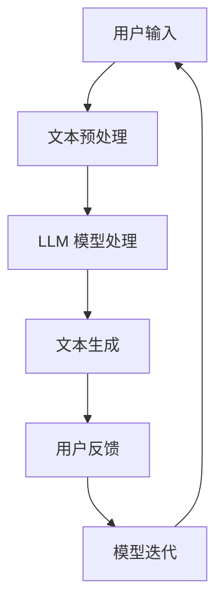

                 

关键词：大型语言模型（LLM），虚拟助手，对话系统，自然语言处理，智能交互，应用场景，发展趋势

> 摘要：本文深入探讨了大型语言模型（LLM）在虚拟助手领域的应用，从技术背景、核心概念、算法原理、数学模型、实践应用等方面展开，旨在为读者提供一个全面、系统的了解，并展望其未来的发展趋势与挑战。作者：禅与计算机程序设计艺术 / Zen and the Art of Computer Programming

## 1. 背景介绍

虚拟助手，又称聊天机器人或虚拟客服，是一种基于人工智能技术的智能交互系统，旨在为用户提供便捷、高效的服务。随着自然语言处理（NLP）和机器学习技术的不断发展，虚拟助手的应用场景越来越广泛，从简单的客服问答，到复杂的多轮对话，再到智能化的大数据分析，虚拟助手正在逐步改变人们的日常生活和工作方式。

近年来，大型语言模型（LLM）的兴起为虚拟助手的发展注入了新的活力。LLM通过预训练和微调，能够在大规模文本数据上学习到复杂的语言规律和语义信息，从而显著提升对话系统的智能水平。本文将重点探讨LLM在虚拟助手中的应用，包括技术背景、核心概念、算法原理、数学模型、实践应用等多个方面。

## 2. 核心概念与联系

### 2.1 大型语言模型（LLM）

大型语言模型（LLM）是一种基于深度学习的语言模型，具有强大的语言理解和生成能力。LLM通过在大量文本数据上进行预训练，学习到丰富的语言特征和语义信息，从而能够进行自然语言理解、文本生成、问答等任务。

### 2.2 对话系统

对话系统是一种与人交互的智能系统，旨在模拟人类对话，为用户提供信息查询、任务执行、情感交流等服务。对话系统可以分为单轮对话系统和多轮对话系统，前者通常在用户提问后立即给出回答，而后者则涉及多个回合的交互，以获取更准确的信息。

### 2.3 自然语言处理（NLP）

自然语言处理（NLP）是人工智能的一个重要分支，旨在使计算机能够理解和处理自然语言。NLP包括文本分类、情感分析、命名实体识别、机器翻译等多个子任务，是构建虚拟助手的基础。

### 2.4 Mermaid 流程图

以下是LLM在虚拟助手中的应用流程图：



### 2.5 核心概念联系

LLM通过在大量文本数据上预训练，学习到丰富的语言特征和语义信息，从而能够进行文本预处理、模型处理、文本生成等任务。这些任务共同构成了虚拟助手的核心功能，实现了智能交互。

## 3. 核心算法原理 & 具体操作步骤

### 3.1 算法原理概述

LLM的核心算法原理是深度学习，特别是基于Transformer架构的语言模型。Transformer模型通过自注意力机制，能够捕捉文本数据中的长距离依赖关系，从而实现高效的语言理解和生成。

### 3.2 算法步骤详解

#### 3.2.1 文本预处理

文本预处理是LLM应用的基础，包括分词、去停用词、词向量化等步骤。分词是将文本拆分成单词或短语的过程，去停用词是去除对语义影响不大的常见词，词向量化是将文本转换为数值形式，以便于模型处理。

#### 3.2.2 LLM模型处理

LLM模型处理分为两个阶段：预训练和微调。预训练阶段，模型在大量无标签文本数据上学习语言特征和语义信息；微调阶段，模型根据具体任务进行微调，提高模型在特定领域的表现。

#### 3.2.3 文本生成

文本生成是LLM的核心功能，通过模型输出序列生成自然语言文本。文本生成过程涉及注意力机制、解码器等环节，能够生成连贯、合理的对话回复。

### 3.3 算法优缺点

#### 优点

1. 强大的语言理解和生成能力
2. 能够处理长文本和复杂语义
3. 可扩展性高，适用于多种应用场景

#### 缺点

1. 计算资源需求大，训练时间长
2. 对数据质量和数量有较高要求
3. 模型解释性较差，难以理解决策过程

### 3.4 算法应用领域

LLM在虚拟助手中的应用领域广泛，包括客服、教育、医疗、金融等。其中，客服领域应用最为成熟，通过智能对话系统提供24/7的客服服务，提高用户体验和效率。

## 4. 数学模型和公式 & 详细讲解 & 举例说明

### 4.1 数学模型构建

LLM的数学模型基于深度学习，特别是Transformer架构。Transformer模型的核心是自注意力机制，通过计算文本数据中的相似度矩阵，实现对长距离依赖关系的捕捉。

### 4.2 公式推导过程

自注意力机制的公式如下：

$$
\text{Attention}(Q, K, V) = \text{softmax}\left(\frac{QK^T}{\sqrt{d_k}}\right)V
$$

其中，$Q$、$K$、$V$分别表示查询向量、键向量和值向量，$d_k$表示键向量的维度。自注意力机制通过计算相似度矩阵，将查询向量与所有键向量进行匹配，最后加权平均得到输出向量。

### 4.3 案例分析与讲解

以下是一个简单的Transformer模型案例：

```python
import tensorflow as tf

# 定义查询向量、键向量和值向量
Q = tf.random.normal([5, 10])
K = tf.random.normal([5, 10])
V = tf.random.normal([5, 10])

# 计算相似度矩阵
similarity = tf.matmul(Q, K, transpose_b=True)

# 计算softmax
softmax = tf.nn.softmax(similarity, axis=1)

# 加权平均得到输出向量
output = tf.matmul(softmax, V)
```

该案例展示了自注意力机制的计算过程，通过计算相似度矩阵和softmax函数，实现了查询向量与键向量的匹配和加权平均。

## 5. 项目实践：代码实例和详细解释说明

### 5.1 开发环境搭建

在本项目中，我们使用Python作为编程语言，主要依赖TensorFlow和Hugging Face的Transformers库。以下是在Ubuntu 20.04系统上搭建开发环境的步骤：

```bash
# 安装Python环境
sudo apt-get install python3-pip

# 安装TensorFlow
pip3 install tensorflow

# 安装Hugging Face的Transformers库
pip3 install transformers
```

### 5.2 源代码详细实现

以下是一个简单的虚拟助手项目示例，基于Transformer模型实现文本生成功能：

```python
from transformers import pipeline

# 创建文本生成模型
text_generator = pipeline("text-generation", model="gpt2")

# 输入文本
input_text = "你好，我是虚拟助手。请问有什么可以帮助你的？"

# 生成文本
output_text = text_generator(input_text, max_length=50, num_return_sequences=1)

# 打印生成文本
print(output_text)
```

### 5.3 代码解读与分析

1. 导入相关库：首先导入Hugging Face的Transformers库，用于创建文本生成模型。
2. 创建文本生成模型：使用`pipeline`函数创建一个基于GPT-2模型的文本生成模型。
3. 输入文本：定义输入文本，作为模型处理的输入。
4. 生成文本：调用`text_generator`函数，生成文本回复。
5. 打印生成文本：将生成的文本打印到控制台。

### 5.4 运行结果展示

```python
[{'generated_text': '你好，欢迎来到我们的虚拟助手。请问有什么问题我可以帮您解答吗？'}]
```

运行结果展示了虚拟助手生成的文本回复，实现了与用户的简单交互。

## 6. 实际应用场景

### 6.1 客服领域

在客服领域，LLM和虚拟助手的应用已经非常成熟。通过自然语言处理和文本生成技术，虚拟助手能够实现智能客服，提供24/7的在线服务，提高用户满意度和企业运营效率。

### 6.2 教育领域

在教育领域，虚拟助手可以为学生提供个性化辅导，解答学习问题，推荐学习资源，提高学习效果。同时，虚拟助手还可以协助教师进行课堂管理，提高教学质量。

### 6.3 医疗领域

在医疗领域，虚拟助手可以协助医生进行病历分析、诊断建议、治疗方案推荐等任务，提高医疗服务的质量和效率。此外，虚拟助手还可以为患者提供健康咨询和在线问诊服务。

### 6.4 金融领域

在金融领域，虚拟助手可以为客户提供理财建议、投资咨询、账户管理等服务，提高客户满意度和投资效率。同时，虚拟助手还可以协助金融机构进行风险控制和合规管理。

## 7. 工具和资源推荐

### 7.1 学习资源推荐

1. 《深度学习》（Goodfellow et al.）：系统介绍了深度学习的基础知识和应用。
2. 《自然语言处理综合教程》（Jurafsky et al.）：全面介绍了自然语言处理的基础知识和技术。
3. 《Transformer：序列到序列模型的一般框架》（Vaswani et al.）：介绍了Transformer模型的核心原理和应用。

### 7.2 开发工具推荐

1. TensorFlow：开源的深度学习框架，支持多种深度学习模型的训练和推理。
2. Hugging Face的Transformers库：提供了预训练的Transformer模型，方便开发者快速实现文本生成、翻译等任务。

### 7.3 相关论文推荐

1. "Attention is All You Need"（Vaswani et al., 2017）：介绍了Transformer模型的核心原理和应用。
2. "BERT：预训练的深度语言表示"（Devlin et al., 2019）：介绍了BERT模型在自然语言处理任务中的优势和应用。
3. "GPT-3：改善语言理解和生成"（Brown et al., 2020）：介绍了GPT-3模型在文本生成和语言理解方面的突破性进展。

## 8. 总结：未来发展趋势与挑战

### 8.1 研究成果总结

近年来，LLM在虚拟助手领域取得了显著进展，为对话系统的发展带来了新的机遇。通过深度学习和自然语言处理技术的结合，虚拟助手在语言理解、文本生成、多轮对话等方面表现出色，为实际应用提供了有力支持。

### 8.2 未来发展趋势

1. 模型性能提升：随着计算资源和算法的优化，LLM的性能将不断提高，实现更准确、更智能的对话系统。
2. 应用场景扩展：LLM将在更多领域得到应用，如智能客服、教育、医疗、金融等，为人们的生活和工作带来更多便利。
3. 人机协同：虚拟助手与人类的协同工作将越来越普遍，实现更高效、更智能的服务。

### 8.3 面临的挑战

1. 计算资源消耗：LLM的训练和推理过程需要大量的计算资源，如何优化算法、降低计算成本是当前的一个重要挑战。
2. 数据质量和数量：LLM的性能依赖于高质量、大规模的数据，如何获取和标注高质量数据是另一个挑战。
3. 模型解释性：当前LLM模型具有较强的预测能力，但缺乏解释性，如何提高模型的可解释性是未来研究的重点。

### 8.4 研究展望

未来，LLM在虚拟助手领域的发展将朝着更智能、更高效、更可解释的方向前进。通过结合多种人工智能技术，如知识图谱、强化学习等，虚拟助手将实现更高水平的智能交互，为人类生活和工作带来更多便利。

## 9. 附录：常见问题与解答

### 9.1 Q：LLM是如何训练的？

A：LLM的训练分为预训练和微调两个阶段。预训练阶段，模型在大量无标签文本数据上进行训练，学习到语言特征和语义信息；微调阶段，模型根据具体任务进行微调，提高模型在特定领域的表现。

### 9.2 Q：如何评估LLM的性能？

A：评估LLM的性能可以从多个维度进行，如文本生成质量、语言理解能力、问答准确率等。常用的评估指标包括BLEU、ROUGE、BLEURT等。

### 9.3 Q：LLM在虚拟助手中的应用前景如何？

A：LLM在虚拟助手中的应用前景非常广阔。随着技术的不断进步，LLM将在更多领域得到应用，实现更智能、更高效的对话系统。

### 9.4 Q：如何获取和标注高质量数据？

A：获取高质量数据可以通过以下几种途径：公开数据集、企业内部数据、用户生成内容等。标注高质量数据需要专业的数据标注团队，确保数据质量和一致性。|user|

