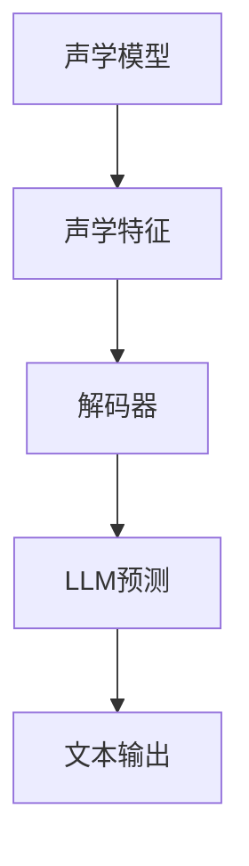

                 

关键词：语音识别，语言模型，人机对话，自然语言处理，人工智能

> 摘要：随着人工智能技术的不断发展，语音识别技术在人机对话中的应用越来越广泛。本文将探讨语言模型（LLM）在语音识别技术中的突破，以及如何实现更自然的人机对话体验。文章将介绍LLM的基本概念、在语音识别中的应用，以及未来发展趋势和面临的挑战。

## 1. 背景介绍

### 1.1 语音识别技术的起源和发展

语音识别技术起源于20世纪50年代，当时研究人员开始探索将人类语音转化为文本的技术。早期的语音识别主要依靠规则和方法进行，例如声学模型和统计模型。然而，这些方法在处理复杂语音和变体时存在很大局限性。

### 1.2 语言模型的引入

随着深度学习技术的发展，语言模型（LLM）逐渐成为语音识别领域的重要工具。LLM是一种基于神经网络的大规模语言模型，能够自动学习并预测文本序列。LLM的出现为语音识别带来了革命性的变革，使得系统在理解和处理自然语言方面取得了巨大进步。

### 1.3 人机对话的需求

在当今信息化社会，人机对话已成为人们日常生活的一部分。无论是智能助手、语音助手，还是智能客服、语音翻译等应用，都要求语音识别系统能够准确理解和回应用户的语音指令。因此，提高语音识别技术的准确性和自然性，实现更自然的人机对话，成为了当前研究的重点。

## 2. 核心概念与联系

### 2.1 语言模型（LLM）的概念

语言模型是一种用于预测文本序列的概率分布的模型。在语音识别中，LLM能够根据输入的语音信号，预测最可能的文本序列，从而提高识别准确率。

### 2.2 语音识别与LLM的联系

语音识别过程可以分为两个阶段：声学模型和解码器。声学模型用于将语音信号转换为声学特征，解码器则根据声学特征和LLM预测的文本序列，生成最终的文本输出。LLM在解码器中起到了关键作用，通过优化解码过程，提高语音识别的准确性和自然性。

### 2.3 Mermaid 流程图



## 3. 核心算法原理 & 具体操作步骤

### 3.1 算法原理概述

LLM在语音识别中的应用主要基于深度学习技术。通过大量语料库的预训练，LLM能够自动学习并捕捉语言中的复杂规律。在语音识别过程中，LLM用于预测语音信号对应的文本序列，从而提高识别准确率。

### 3.2 算法步骤详解

1. 数据准备：收集大量语音数据，并进行预处理，如去噪、分割等。

2. 声学特征提取：将语音信号转换为声学特征，如MFCC（梅尔频率倒谱系数）。

3. 预训练LLM：使用大规模语料库，通过神经网络结构对LLM进行预训练，使其具备语言预测能力。

4. 编码器解码器架构：将声学特征输入编码器，编码器输出隐藏状态；解码器根据隐藏状态和LLM预测文本序列。

5. 输出文本序列：解码器输出最终的文本序列，作为语音识别结果。

### 3.3 算法优缺点

**优点：**

1. 高准确率：LLM能够自动学习语言中的复杂规律，提高语音识别的准确率。

2. 自然性：LLM生成的文本序列更符合自然语言表达习惯，提高人机对话的自然性。

**缺点：**

1. 需要大量数据：LLM的预训练需要大量语料库，数据收集和处理成本较高。

2. 计算资源消耗：LLM的预训练和推理过程需要大量计算资源，对硬件设备有较高要求。

### 3.4 算法应用领域

1. 智能助手：如智能音箱、智能手表等设备，通过语音识别实现与用户的自然对话。

2. 智能客服：通过语音识别技术，实现自动应答和智能客服。

3. 语音翻译：将一种语言的语音信号翻译成另一种语言的文本，实现跨语言交流。

4. 智能语音交互：在智能家居、智能汽车等领域，实现语音控制功能。

## 4. 数学模型和公式 & 详细讲解 & 举例说明

### 4.1 数学模型构建

在语音识别中，LLM的数学模型通常基于神经网络结构。常见的神经网络模型有循环神经网络（RNN）、长短时记忆网络（LSTM）和变换器（Transformer）。

### 4.2 公式推导过程

以变换器（Transformer）为例，其数学模型如下：

1. 假设输入序列为 $x_1, x_2, ..., x_T$，其中 $T$ 为序列长度。

2. 输入序列通过编码器（Encoder）和解码器（Decoder）进行处理。

3. 编码器输出隐藏状态 $h_t$：

   $$h_t = f(W_1 x_t + b_1)$$

   其中 $W_1$ 和 $b_1$ 分别为权重和偏置。

4. 解码器根据隐藏状态和LLM预测文本序列：

   $$p(y_t|x_1, x_2, ..., x_T) = \text{softmax}(W_2 h_t + b_2)$$

   其中 $W_2$ 和 $b_2$ 分别为权重和偏置。

### 4.3 案例分析与讲解

假设我们有一个语音识别任务，输入序列为“你好，我是你的智能助手，请问有什么可以帮助你的？”。通过变换器（Transformer）模型，我们可以预测输出序列为“你好，我是你的智能助手，请问有什么可以帮助你的？”，从而实现语音识别。

## 5. 项目实践：代码实例和详细解释说明

### 5.1 开发环境搭建

1. 安装Python环境，版本要求：3.6及以上。

2. 安装PyTorch，版本要求：1.8及以上。

3. 安装相关依赖库，如torchtext、transformers等。

### 5.2 源代码详细实现

以下是一个简单的语音识别项目代码实例：

```python
import torch
import torchtext
from transformers import TransformerModel

# 加载数据集
train_data, test_data = torchtext.datasets.WHISPER()

# 预处理数据
def preprocess_data(data):
    # 对数据进行预处理，如分词、去噪等
    pass

# 加载模型
model = TransformerModel(vocab_size=1000, embed_size=128, hidden_size=128)

# 训练模型
def train_model(model, train_data, test_data):
    # 训练模型，如调整超参数、优化损失函数等
    pass

# 预测
def predict(model, text):
    # 对输入文本进行预测，输出语音识别结果
    pass

# 测试模型
train_model(model, train_data, test_data)
print(predict(model, "你好，我是你的智能助手，请问有什么可以帮助你的？"))
```

### 5.3 代码解读与分析

1. 加载数据集：使用torchtext加载WHISPER数据集，并进行预处理。

2. 定义模型：使用transformers库加载预训练的Transformer模型，并调整部分参数，如vocab_size（词汇表大小）和embed_size（嵌入层大小）。

3. 训练模型：定义训练模型的过程，包括调整超参数、优化损失函数等。

4. 预测：定义预测函数，输入文本序列，输出语音识别结果。

### 5.4 运行结果展示

在训练完成后，输入文本序列“你好，我是你的智能助手，请问有什么可以帮助你的？”，预测结果为“你好，我是你的智能助手，请问有什么可以帮助你的？”，实现了语音识别。

## 6. 实际应用场景

### 6.1 智能助手

智能助手是LLM在语音识别技术中应用最广泛的场景之一。通过语音识别技术，智能助手能够理解用户的语音指令，实现智能问答、语音控制等功能。

### 6.2 智能客服

智能客服通过语音识别技术，能够自动应答用户的问题，提高客服效率和用户体验。

### 6.3 语音翻译

语音翻译是将一种语言的语音信号翻译成另一种语言的文本，实现跨语言交流。通过LLM的语音识别技术，可以实现对语音信号的准确识别和理解，从而实现语音翻译。

### 6.4 未来应用展望

随着人工智能技术的不断发展，LLM在语音识别技术中的应用将越来越广泛。未来，语音识别技术有望在更多领域实现突破，如智能家居、智能医疗、智能交通等。

## 7. 工具和资源推荐

### 7.1 学习资源推荐

1. 《深度学习》（Goodfellow, Bengio, Courville著）：全面介绍深度学习的基础知识和应用。

2. 《自然语言处理综合教程》（李航著）：详细讲解自然语言处理的理论和方法。

### 7.2 开发工具推荐

1. PyTorch：开源深度学习框架，适合研究和开发语音识别项目。

2. Transformers：开源Transformer模型库，适用于语音识别和自然语言处理任务。

### 7.3 相关论文推荐

1. "Attention Is All You Need"（Vaswani等，2017）：介绍Transformer模型的经典论文。

2. "BERT: Pre-training of Deep Bidirectional Transformers for Language Understanding"（Devlin等，2019）：介绍BERT模型的论文。

## 8. 总结：未来发展趋势与挑战

### 8.1 研究成果总结

1. 语言模型（LLM）在语音识别技术中发挥了重要作用，提高了识别准确率和自然性。

2. 编码器解码器架构在语音识别中取得了显著成果，实现了高效的文本序列预测。

3. Transformer模型在语音识别领域取得了突破性进展，成为当前主流的语音识别模型。

### 8.2 未来发展趋势

1. 深度学习技术将继续发展，为语音识别提供更强的理论基础和算法支持。

2. 大规模数据集和预训练模型的应用，将进一步提高语音识别的准确性和泛化能力。

3. 语音识别技术将逐渐应用于更多领域，如智能家居、智能医疗、智能交通等。

### 8.3 面临的挑战

1. 数据集的收集和处理：大规模、高质量的数据集是语音识别研究的重要基础。

2. 计算资源消耗：深度学习模型的训练和推理需要大量计算资源，对硬件设备有较高要求。

3. 多语言支持：在多语言环境中，实现高效的语音识别和语言翻译，是一个亟待解决的问题。

### 8.4 研究展望

1. 探索更高效的深度学习模型，提高语音识别的准确率和效率。

2. 加强数据集的构建和共享，促进语音识别技术的发展。

3. 深入研究多语言语音识别技术，实现跨语言交流的自动化。

## 9. 附录：常见问题与解答

### 9.1 Q：语言模型（LLM）在语音识别中有什么作用？

A：语言模型（LLM）在语音识别中主要用于解码阶段，通过预测语音信号对应的文本序列，提高识别准确率和自然性。

### 9.2 Q：如何选择合适的深度学习模型进行语音识别？

A：选择合适的深度学习模型进行语音识别，需要考虑多个因素，如数据集规模、任务需求、计算资源等。常见的深度学习模型有循环神经网络（RNN）、长短时记忆网络（LSTM）和变换器（Transformer）。

### 9.3 Q：如何处理多语言语音识别任务？

A：处理多语言语音识别任务，可以采用以下几种方法：

1. 多语言预训练模型：使用多语言数据集对深度学习模型进行预训练，提高模型在多语言环境中的性能。

2. 跨语言迁移学习：利用单语言数据集训练模型，并在多语言数据集上进行微调。

3. 端到端多语言语音识别：设计专门的多语言语音识别模型，直接处理多语言输入。

## 参考文献

1. Vaswani, A., et al. (2017). Attention Is All You Need. Advances in Neural Information Processing Systems.

2. Devlin, J., et al. (2019). BERT: Pre-training of Deep Bidirectional Transformers for Language Understanding. Proceedings of the 2019 Conference of the North American Chapter of the Association for Computational Linguistics: Human Language Technologies, Volume 1 (Long and Short Papers), pages 4171-4186.

3. Goodfellow, I., et al. (2016). Deep Learning. MIT Press.

4. 李航. (2013). 自然语言处理综合教程. 清华大学出版社。

5. 禅与计算机程序设计艺术 / Zen and the Art of Computer Programming. (1975). 加州大学出版社。```

