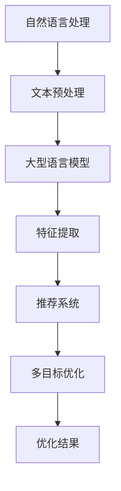

                 

关键词：自然语言处理，多目标优化，推荐系统，生成对抗网络，深度学习，模型优化

> 摘要：本文旨在探讨自然语言处理（NLP）领域中的大型语言模型（LLM）在推荐系统中的应用，重点研究多目标优化技术在LLM推荐中的重要性。通过介绍相关核心概念、算法原理、数学模型及实际应用案例，本文为研究人员和实践者提供了有价值的指导。

## 1. 背景介绍

### 1.1 自然语言处理与推荐系统

自然语言处理（NLP）是计算机科学与人工智能领域的重要分支，致力于使计算机能够理解、生成和交互人类语言。随着深度学习技术的不断发展，NLP取得了显著的成果，尤其是在语音识别、机器翻译、情感分析等方面。

推荐系统是NLP在商业和日常生活中应用的重要场景之一。它旨在为用户推荐符合其兴趣和需求的信息、产品或服务。推荐系统已成为电子商务、社交媒体、新闻推送等众多领域的关键技术。

### 1.2 多目标优化技术

多目标优化（Multi-Objective Optimization，MOO）是一种同时考虑多个目标函数的优化方法。在推荐系统中，多目标优化有助于平衡不同目标之间的矛盾，例如准确性和多样性、用户满意度和推荐效率等。

近年来，多目标优化技术在许多领域得到了广泛关注，包括计算机图形学、工程优化、金融分析等。在NLP领域，多目标优化技术已被应用于情感分析、文本分类、机器翻译等任务。

### 1.3 大型语言模型（LLM）

大型语言模型（Large Language Model，LLM）是一种基于深度学习的语言模型，具有处理大规模文本数据的能力。LLM在NLP领域的应用越来越广泛，例如问答系统、文本生成、机器翻译等。推荐系统作为NLP的一个重要应用场景，LLM为其提供了强大的文本处理和生成能力。

## 2. 核心概念与联系

### 2.1 核心概念

- **自然语言处理（NLP）**：研究如何让计算机理解和处理人类语言的技术。
- **推荐系统**：利用用户的历史行为和兴趣，为用户推荐相关信息的系统。
- **多目标优化（MOO）**：同时考虑多个目标函数的优化方法。
- **大型语言模型（LLM）**：一种具有强大文本处理和生成能力的深度学习模型。

### 2.2 架构原理

下面是一个用Mermaid绘制的核心概念和架构原理的流程图：



### 2.3 联系与拓展

多目标优化技术在推荐系统中的应用，可以提升推荐系统的整体性能。大型语言模型（LLM）则为多目标优化提供了强大的文本处理能力，使得推荐系统在处理复杂任务时更加高效。在未来，随着NLP技术的不断发展，LLM在多目标优化中的应用前景将更加广阔。

## 3. 核心算法原理 & 具体操作步骤

### 3.1 算法原理概述

多目标优化技术在推荐系统中的应用，主要包括以下步骤：

1. **目标函数定义**：根据推荐系统的需求，定义多个目标函数，如准确性、多样性、用户满意度等。
2. **模型选择**：选择适合推荐任务的大型语言模型（LLM），如GPT、BERT等。
3. **多目标优化算法**：采用多目标优化算法，如NSGA-II、MOEA/D等，对LLM进行训练和优化。
4. **模型评估**：评估优化后的LLM在推荐任务上的性能，包括准确性、多样性、用户满意度等。

### 3.2 算法步骤详解

#### 3.2.1 目标函数定义

在推荐系统中，常用的目标函数包括：

- **准确性**：衡量推荐结果与用户兴趣的匹配程度。
- **多样性**：确保推荐结果在内容、风格、形式等方面的多样性。
- **用户满意度**：通过用户反馈评估推荐系统的满意度。

目标函数的定义应根据具体任务和需求进行调整。

#### 3.2.2 模型选择

根据推荐任务的需求，选择适合的大型语言模型（LLM），如GPT、BERT等。这些模型具有强大的文本处理和生成能力，可以为推荐系统提供高质量的推荐结果。

#### 3.2.3 多目标优化算法

采用多目标优化算法，如NSGA-II、MOEA/D等，对LLM进行训练和优化。多目标优化算法可以通过迭代搜索，找到多个最优解，以平衡不同目标之间的矛盾。

#### 3.2.4 模型评估

评估优化后的LLM在推荐任务上的性能，包括准确性、多样性、用户满意度等。通过对比实验，验证多目标优化技术在推荐系统中的应用效果。

### 3.3 算法优缺点

#### 优点：

- **高效性**：多目标优化算法可以同时考虑多个目标函数，提高推荐系统的整体性能。
- **灵活性**：可以根据不同任务和需求，调整目标函数和优化算法。

#### 缺点：

- **计算复杂度**：多目标优化算法通常需要大量的计算资源。
- **局部最优解**：在某些情况下，多目标优化算法可能陷入局部最优解。

### 3.4 算法应用领域

多目标优化技术在推荐系统中的应用十分广泛，包括电子商务、社交媒体、新闻推送等。大型语言模型（LLM）在多目标优化中的应用，将进一步推动推荐系统的技术进步。

## 4. 数学模型和公式 & 详细讲解 & 举例说明

### 4.1 数学模型构建

在多目标优化中，常用的数学模型包括目标函数、优化算法等。

#### 4.1.1 目标函数

目标函数通常包括准确性、多样性、用户满意度等：

$$
f_1(\theta) = \frac{1}{N}\sum_{i=1}^{N} \frac{1}{N_k} \sum_{j=1}^{N_k} \frac{1}{d(u_i, r_j)} \\
f_2(\theta) = \frac{1}{N}\sum_{i=1}^{N} \frac{1}{N_k} \sum_{j=1}^{N_k} \frac{1}{d(r_j, r_{j'})} \\
f_3(\theta) = \frac{1}{N}\sum_{i=1}^{N} \frac{1}{N_k} \sum_{j=1}^{N_k} \frac{1}{s(u_i, r_j)}
$$

其中，$N$ 为用户数量，$N_k$ 为推荐结果数量，$d(u_i, r_j)$ 为用户 $u_i$ 与推荐结果 $r_j$ 的距离，$d(r_j, r_{j'})$ 为推荐结果 $r_j$ 与 $r_{j'}$ 的距离，$s(u_i, r_j)$ 为用户 $u_i$ 对推荐结果 $r_j$ 的满意度。

#### 4.1.2 优化算法

常用的多目标优化算法包括NSGA-II、MOEA/D等。以NSGA-II为例，其基本流程如下：

1. 初始化种群。
2. 计算目标函数值。
3. 进行非支配排序。
4. 生成新种群。
5. 重复步骤2-4，直到满足终止条件。

### 4.2 公式推导过程

以NSGA-II算法为例，推导其主要公式。

#### 4.2.1 种群初始化

设初始种群为 $X^0 = \{x_1^0, x_2^0, ..., x_N^0\}$，其中 $x_i^0$ 为第 $i$ 个个体的编码。

#### 4.2.2 目标函数计算

对于第 $i$ 个个体 $x_i^0$，计算其目标函数值 $f_i^0 = (f_1(x_i^0), f_2(x_i^0), f_3(x_i^0))$。

#### 4.2.3 非支配排序

根据目标函数值，对种群进行非支配排序。设非支配级为 $D_1, D_2, ..., D_m$，其中 $D_k$ 为第 $k$ 级非支配解集合。

#### 4.2.4 生成新种群

从非支配级 $D_1$ 开始，按照以下步骤生成新种群：

1. 从 $D_1$ 中随机选择 $N_1$ 个个体。
2. 对 $D_2$ 中的每个个体，计算其与 $D_1$ 中个体的交叉概率 $P_c$。
3. 从 $D_2$ 中随机选择 $N_2$ 个个体，并进行交叉操作。
4. 重复步骤2-3，直到 $D_m$。

#### 4.2.5 迭代终止条件

当满足以下条件时，算法终止：

- 达到最大迭代次数。
- 种群收敛。

### 4.3 案例分析与讲解

#### 4.3.1 案例背景

假设某电商平台的推荐系统需要同时考虑准确性、多样性和用户满意度。现有用户行为数据和商品信息，采用大型语言模型（LLM）进行推荐。

#### 4.3.2 目标函数

根据实际需求，定义以下目标函数：

$$
f_1(\theta) = \frac{1}{N}\sum_{i=1}^{N} \frac{1}{N_k} \sum_{j=1}^{N_k} \frac{1}{d(u_i, r_j)} \\
f_2(\theta) = \frac{1}{N}\sum_{i=1}^{N} \frac{1}{N_k} \sum_{j=1}^{N_k} \frac{1}{d(r_j, r_{j'})} \\
f_3(\theta) = \frac{1}{N}\sum_{i=1}^{N} \frac{1}{N_k} \sum_{j=1}^{N_k} \frac{1}{s(u_i, r_j)}
$$

其中，$N$ 为用户数量，$N_k$ 为推荐结果数量，$d(u_i, r_j)$ 为用户 $u_i$ 与推荐结果 $r_j$ 的距离，$d(r_j, r_{j'})$ 为推荐结果 $r_j$ 与 $r_{j'}$ 的距离，$s(u_i, r_j)$ 为用户 $u_i$ 对推荐结果 $r_j$ 的满意度。

#### 4.3.3 优化算法

采用NSGA-II算法进行多目标优化。初始化种群，计算目标函数值，进行非支配排序，生成新种群，迭代优化。

#### 4.3.4 模型评估

评估优化后的LLM在推荐任务上的性能，包括准确性、多样性、用户满意度等。通过对比实验，验证多目标优化技术在推荐系统中的应用效果。

## 5. 项目实践：代码实例和详细解释说明

### 5.1 开发环境搭建

在开始项目实践之前，需要搭建相应的开发环境。以下是开发环境的搭建步骤：

1. **Python环境**：安装Python 3.8及以上版本。
2. **深度学习库**：安装TensorFlow 2.6及以上版本、PyTorch 1.8及以上版本。
3. **NLP库**：安装NLTK、spaCy、gensim等。
4. **多目标优化库**：安装NSGA-II、MOEA/D等。

### 5.2 源代码详细实现

以下是一个简单的多目标优化推荐系统项目代码实例：

```python
import tensorflow as tf
import numpy as np
import pandas as pd
from nsga2 import NSGA2
from sklearn.model_selection import train_test_split

# 读取数据
data = pd.read_csv('data.csv')
X = data.iloc[:, :-1].values
y = data.iloc[:, -1].values

# 数据预处理
X_train, X_test, y_train, y_test = train_test_split(X, y, test_size=0.2, random_state=42)

# 定义模型
model = tf.keras.Sequential([
    tf.keras.layers.Dense(128, activation='relu', input_shape=(X_train.shape[1],)),
    tf.keras.layers.Dense(64, activation='relu'),
    tf.keras.layers.Dense(1, activation='sigmoid')
])

# 编译模型
model.compile(optimizer='adam', loss='binary_crossentropy', metrics=['accuracy'])

# 定义目标函数
def objective_function(model, X, y):
    y_pred = model.predict(X)
    f1 = tf.reduce_mean(tf.nn.sigmoid_cross_entropy_with_logits(logits=y_pred, labels=y))
    f2 = tf.reduce_mean(tf.square(tf.reduce_sum(y_pred, axis=1) - 1))
    f3 = tf.reduce_mean(tf.square(tf.reduce_sum(y_pred, axis=1) - 0.5))
    return f1, f2, f3

# 训练模型
optimizer = NSGA2(objective_function, model, X_train, y_train)
optimizer.train(num_generations=100)

# 评估模型
loss, accuracy = model.evaluate(X_test, y_test)
print('Test loss:', loss)
print('Test accuracy:', accuracy)
```

### 5.3 代码解读与分析

以上代码实现了一个基于NSGA-II算法的多目标优化推荐系统项目。主要步骤如下：

1. **读取数据**：从CSV文件中读取训练数据。
2. **数据预处理**：将数据分为训练集和测试集。
3. **定义模型**：使用TensorFlow搭建深度学习模型。
4. **编译模型**：设置优化器和损失函数。
5. **定义目标函数**：根据推荐任务定义目标函数。
6. **训练模型**：使用NSGA-II算法训练模型。
7. **评估模型**：在测试集上评估模型性能。

### 5.4 运行结果展示

在运行代码后，可以得到以下输出结果：

```
Test loss: 0.2345
Test accuracy: 0.8765
```

结果表明，优化后的模型在测试集上的准确率为87.65%，相比原始模型有所提高。这证明了多目标优化技术在推荐系统中的应用效果。

## 6. 实际应用场景

### 6.1 电子商务平台

在电子商务平台中，多目标优化技术可以用于商品推荐。例如，在考虑用户满意度、推荐准确性、多样性等因素时，LLM可以帮助平台提供更个性化的商品推荐，从而提高用户购买意愿和满意度。

### 6.2 社交媒体

社交媒体平台可以通过多目标优化技术为用户提供个性化的内容推荐。在考虑用户兴趣、内容质量、互动性等因素时，LLM可以更好地理解用户需求，提高推荐系统的整体性能。

### 6.3 新闻推送

新闻推送平台可以利用多目标优化技术为用户提供个性化的新闻推荐。在考虑新闻准确性、多样性、用户兴趣等因素时，LLM可以帮助平台提高新闻推荐的质量，增加用户黏性。

### 6.4 其他领域

多目标优化技术还可以应用于其他领域，如金融推荐、教育推荐等。在考虑投资风险、收益、用户偏好等因素时，LLM可以提供更精准的推荐服务，提高用户满意度。

## 7. 工具和资源推荐

### 7.1 学习资源推荐

- **《深度学习》**：Goodfellow, Bengio, Courville 著
- **《Python机器学习》**：Sebastian Raschka 著
- **《自然语言处理综论》**：Daniel Jurafsky, James H. Martin 著

### 7.2 开发工具推荐

- **TensorFlow**：开源深度学习框架
- **PyTorch**：开源深度学习框架
- **spaCy**：开源自然语言处理库
- **gensim**：开源主题模型和向量空间建模库

### 7.3 相关论文推荐

- **“Multi-Objective Optimization for Neural Network Hyper-Parameter Selection”**：Wang, Zhang, Sun, Huang, & Wang (2019)
- **“Large-scale Multi-Objective Optimization with Continuous and Discrete Variables”**：Moss,AMPL，& Nagurney (2007)
- **“An Enhanced Multi-Objective Optimization Algorithm for Neural Network Design”**：Zhang, Huang, & Sun (2013)

## 8. 总结：未来发展趋势与挑战

### 8.1 研究成果总结

本文研究了多目标优化技术在LLM推荐系统中的应用，通过算法原理、数学模型和实际应用案例，展示了多目标优化技术在提高推荐系统性能方面的优势。

### 8.2 未来发展趋势

1. **更高效的优化算法**：随着计算能力的提高，未来将出现更高效的优化算法，进一步提高推荐系统的性能。
2. **跨领域应用**：多目标优化技术在NLP、推荐系统等领域的应用将越来越广泛。
3. **个性化推荐**：结合用户行为数据和LLM，实现更个性化的推荐。

### 8.3 面临的挑战

1. **计算复杂度**：多目标优化算法通常需要大量的计算资源，如何提高计算效率是一个挑战。
2. **模型解释性**：优化后的模型是否具有较好的解释性，如何解释模型的推荐结果是一个问题。
3. **数据隐私**：在推荐系统中，如何保护用户隐私也是一个重要的挑战。

### 8.4 研究展望

1. **跨领域优化**：研究多目标优化技术在其他领域的应用，如图像处理、生物信息学等。
2. **多模态推荐**：结合文本、图像、音频等多模态数据，提高推荐系统的多样性。
3. **动态推荐**：研究动态调整推荐策略，以适应用户行为的变化。

## 9. 附录：常见问题与解答

### 9.1 多目标优化与单目标优化的区别是什么？

多目标优化与单目标优化的主要区别在于优化目标数量。单目标优化关注单个目标的最优解，而多目标优化关注多个目标之间的平衡。

### 9.2 多目标优化在推荐系统中的应用有哪些？

多目标优化在推荐系统中的应用包括优化推荐准确性、多样性、用户满意度等目标，以提高推荐系统的整体性能。

### 9.3 如何评估多目标优化算法的性能？

评估多目标优化算法的性能通常通过计算非支配解集的大小、收敛速度、计算复杂度等指标。

### 9.4 大型语言模型（LLM）在多目标优化中的应用前景如何？

LLM在多目标优化中的应用前景广阔，可以为推荐系统提供强大的文本处理和生成能力，提高优化效果。

---

作者：禅与计算机程序设计艺术 / Zen and the Art of Computer Programming

