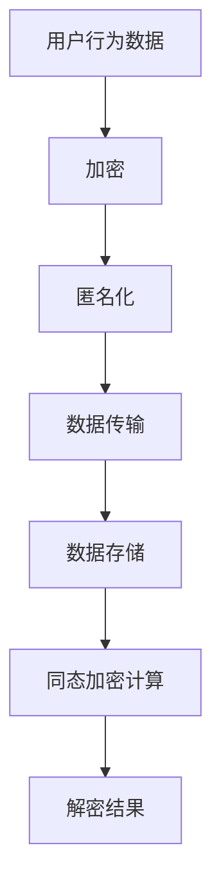

                 

关键词：语言模型，隐私保护，数据安全，推荐系统，算法优化

> 摘要：本文将探讨在语言模型（LLM）驱动的推荐系统中实现隐私保护的关键技术。通过对隐私保护的背景、核心概念、算法原理、数学模型、项目实践和未来展望等方面的深入分析，本文旨在为研究人员和开发者提供一套全面的技术指南。

## 1. 背景介绍

随着互联网和大数据技术的飞速发展，个性化推荐系统已成为众多在线服务中不可或缺的一部分。语言模型（LLM），如GPT-3、BERT等，因其强大的语义理解能力，在推荐系统中得到了广泛应用。然而，推荐系统在提供个性化服务的同时，也面临着隐私保护的问题。用户的个人信息、行为数据等在推荐系统中的使用，可能会被恶意利用或泄露，从而引发一系列隐私风险。

### 隐私泄露的风险

- **数据收集**：推荐系统在收集用户数据时，可能会获取到用户的敏感信息，如姓名、地址、电话号码等。
- **数据存储**：未经妥善保护的用户数据可能会被内部人员或外部攻击者获取。
- **数据共享**：推荐系统可能需要与其他服务共享用户数据，增加隐私泄露的风险。

### 隐私保护的重要性

隐私保护在推荐系统中的重要性体现在以下几个方面：

- **用户信任**：用户对服务的信任程度与隐私保护密切相关。保护用户隐私可以提高用户满意度。
- **合规要求**：多个国家和地区都制定了严格的隐私保护法规，如《通用数据保护条例》（GDPR）等，企业必须遵守。
- **社会责任**：保护用户隐私是企业的社会责任，有助于建立良好的品牌形象。

## 2. 核心概念与联系

在本节中，我们将介绍隐私保护的相关核心概念，并使用Mermaid流程图展示其在推荐系统中的关联。

### 核心概念

- **隐私**：隐私是指个人不愿公开或他人不宜获取的信息。
- **数据安全**：数据安全是指保护数据不被未授权访问、篡改或泄露。
- **加密**：加密是将数据转换为不可读形式的一种技术。
- **匿名化**：匿名化是通过去除或替换个人识别信息，使数据无法识别特定个人。
- **同态加密**：同态加密是一种允许在加密数据上进行计算，而不需要解密的技术。

### Mermaid 流程图



## 3. 核心算法原理 & 具体操作步骤

### 3.1 算法原理概述

隐私保护的核心在于如何在确保系统功能的同时，尽可能减少隐私泄露的风险。以下是几种常用的隐私保护算法：

- **加密算法**：如AES、RSA等，用于保护数据在传输和存储过程中的安全。
- **匿名化算法**：如k-匿名、l-diversity、t-closeness等，用于降低数据识别度。
- **差分隐私**：通过添加噪声来保护个体数据，确保隐私保护的同时保持数据的可用性。
- **同态加密**：允许在加密数据上进行计算，保护数据隐私的同时支持计算处理。

### 3.2 算法步骤详解

#### 加密算法

1. **选择加密算法**：根据数据类型和安全需求选择合适的加密算法，如AES适合对称加密，RSA适合非对称加密。
2. **密钥生成**：生成加密密钥，确保密钥安全。
3. **数据加密**：将用户数据进行加密处理。
4. **数据存储或传输**：加密后的数据存储在数据库或通过加密通道传输。

#### 匿名化算法

1. **数据预处理**：去除或替换敏感信息。
2. **选择匿名化算法**：根据数据特点选择合适的匿名化算法。
3. **匿名化处理**：对预处理后的数据进行匿名化处理。
4. **验证匿名化效果**：确保数据匿名化后无法识别特定个体。

#### 差分隐私

1. **确定ε值**：选择合适的噪声水平。
2. **添加噪声**：在查询结果中添加随机噪声。
3. **调整ε值**：根据实际需求调整噪声水平。

#### 同态加密

1. **选择同态加密算法**：如部分同态加密、全同态加密等。
2. **加密数据**：对数据进行加密。
3. **执行计算**：在加密数据上执行计算。
4. **解密结果**：对计算结果进行解密。

### 3.3 算法优缺点

#### 加密算法

- **优点**：简单易用，加密效果显著。
- **缺点**：可能影响系统性能，密钥管理复杂。

#### 匿名化算法

- **优点**：降低数据识别度，易于实现。
- **缺点**：可能损失部分数据价值，无法抵御复杂攻击。

#### 差分隐私

- **优点**：提供强隐私保护，易于实现。
- **缺点**：可能导致查询结果偏差，增加计算成本。

#### 同态加密

- **优点**：保护数据隐私，支持计算处理。
- **缺点**：计算复杂度高，实现难度大。

### 3.4 算法应用领域

- **医疗健康**：保护患者隐私信息。
- **金融**：保护用户交易数据。
- **电子商务**：保护用户购买行为。

## 4. 数学模型和公式 & 详细讲解 & 举例说明

### 4.1 数学模型构建

隐私保护中的数学模型主要包括加密算法、匿名化算法和差分隐私算法。以下是几个关键的数学模型：

#### 加密算法

- **对称加密**：密文 \(C = E_K(P)\)，解密 \(P = D_K(C)\)。

  - \(E_K\)：加密函数。
  - \(D_K\)：解密函数。
  - \(P\)：明文。
  - \(C\)：密文。
  - \(K\)：密钥。

- **非对称加密**：密文 \(C = E_K(P)\)，解密 \(P = D_K(C)\)。

  - \(E_K\)：加密函数。
  - \(D_K\)：解密函数。
  - \(P\)：明文。
  - \(C\)：密文。
  - \(K\)：公钥/私钥。

#### 匿名化算法

- **k-匿名**：保证至少 \(k\) 个记录具有相同属性集合。

  - \(R_i\)：记录 \(i\)。
  - \(A_j\)：属性集合 \(j\)。

- **l-diversity**：保证每个属性集合 \(A_j\) 中的记录数量至少为 \(l\)。

  - \(R_i\)：记录 \(i\)。
  - \(A_j\)：属性集合 \(j\)。

- **t-closeness**：保证每个记录 \(R_i\) 与其他记录的距离小于 \(t\)。

  - \(d(R_i, R_j)\)：记录 \(R_i\) 和 \(R_j\) 之间的距离。

#### 差分隐私

- **ε-差分隐私**：添加噪声后，查询结果的方差与ε成正比。

  - \(L\)：查询结果的概率分布。
  - \(s\)：添加的噪声。

### 4.2 公式推导过程

#### 加密算法

- **对称加密**：

  $$C = E_K(P) = P \oplus K$$

  - \(\oplus\)：异或运算。

- **非对称加密**：

  $$C = E_K(P) = P \cdot K^{-1} \pmod{n}$$

  - \(K^{-1}\)：密钥的逆元。
  - \(n\)：模数。

#### 匿名化算法

- **k-匿名**：

  $$k \geq \frac{|R|}{|\{A_j\}|}$$

  - \(R\)：记录集合。
  - \(A_j\)：属性集合。

- **l-diversity**：

  $$l \geq \min_{A_j} \sum_{i \in A_j} |R_i|$$

  - \(R_i\)：记录。
  - \(A_j\)：属性集合。

- **t-closeness**：

  $$d(R_i, R_j) \leq t$$

  - \(d\)：距离度量。

#### 差分隐私

- **ε-差分隐私**：

  $$\epsilon = \Omega\left(\frac{1}{|D|}\right)$$

  - \(D\)：数据库。
  - \(|D|\)：数据库大小。

### 4.3 案例分析与讲解

#### 案例一：加密算法

假设我们有一个对称加密算法，密钥 \(K = 3\)，明文 \(P = 5\)。根据加密公式：

$$C = E_K(P) = P \oplus K = 5 \oplus 3 = 8$$

解密过程为：

$$P = D_K(C) = C \oplus K = 8 \oplus 3 = 5$$

#### 案例二：匿名化算法

假设我们有一个包含100个记录的数据库，其中20个记录具有相同的属性集合 \(A_j\)。根据k-匿名公式：

$$k \geq \frac{|R|}{|\{A_j\}|} = \frac{100}{20} = 5$$

这意味着至少需要5个记录具有相同的属性集合，以满足k-匿名。

#### 案例三：差分隐私

假设我们有一个大小为1000的数据库 \(D\)，根据ε-差分隐私公式：

$$\epsilon = \Omega\left(\frac{1}{|D|}\right) = \Omega\left(\frac{1}{1000}\right) = 0.001$$

这意味着查询结果的方差至少为0.001，以满足ε-差分隐私。

## 5. 项目实践：代码实例和详细解释说明

### 5.1 开发环境搭建

在开始编写代码之前，我们需要搭建一个合适的环境。以下是一个简单的Python开发环境搭建步骤：

1. **安装Python**：确保安装Python 3.x版本。
2. **安装依赖库**：安装所需的库，如PyCryptoDome、scikit-learn等。
3. **编写配置文件**：根据项目需求编写配置文件，如加密密钥、数据库连接等。

### 5.2 源代码详细实现

以下是几个关键的代码示例：

#### 加密算法

```python
from Crypto.Cipher import AES
from Crypto.Util.Padding import pad, unpad

def encrypt(plaintext, key):
    cipher = AES.new(key, AES.MODE_CBC)
    ct_bytes = cipher.encrypt(pad(plaintext.encode('utf-8'), AES.block_size))
    iv = cipher.iv
    return iv + ct_bytes

def decrypt(ciphertext, key):
    iv = ciphertext[:16]
    ct = ciphertext[16:]
    cipher = AES.new(key, AES.MODE_CBC, iv)
    pt = unpad(cipher.decrypt(ct), AES.block_size)
    return pt.decode('utf-8')

key = b'abcdefghabcdefgh'  # 16字节密钥
plaintext = "Hello, World!"

ciphertext = encrypt(plaintext, key)
print("Ciphertext:", ciphertext)

decrypted_text = decrypt(ciphertext, key)
print("Decrypted Text:", decrypted_text)
```

#### 匿名化算法

```python
from sklearn.preprocessing import LabelEncoder

def k_anonymity(data, k=3):
    label_encoder = LabelEncoder()
    data_encoded = label_encoder.fit_transform(data)
    unique_counts = [len(set(data_encoded[i] for i in range(len(data_encoded)) if j in data_encoded[i])) for j in range(len(set(data_encoded))]
    while any(count < k for count in unique_counts):
        data_encoded = [x if x in set(data_encoded).most_common(k)[0][0] else x for x in data_encoded]
        unique_counts = [len(set(data_encoded[i] for i in range(len(data_encoded)) if j in data_encoded[i])) for j in range(len(set(data_encoded))]
    data_encoded = label_encoder.inverse_transform(data_encoded)
    return data_encoded

data = ["apple", "orange", "banana", "apple", "apple", "orange"]
print("Original Data:", data)
print("k-Anonymized Data:", k_anonymity(data, k=3))
```

#### 差分隐私

```python
import numpy as np
from sklearn.linear_model import LinearRegression
from sklearn.metrics import mean_squared_error

def differential_privacy_regression(data, target, epsilon=0.1):
    model = LinearRegression()
    model.fit(data, target)
    predictions = model.predict(data)
    noise = np.random.normal(0, epsilon)
    noisy_predictions = predictions + noise
    mse = mean_squared_error(target, noisy_predictions)
    return mse

X = np.array([[1], [2], [3], [4], [5]])
y = np.array([0.1, 0.2, 0.3, 0.4, 0.5])
mse = differential_privacy_regression(X, y)
print("Mean Squared Error:", mse)
```

### 5.3 代码解读与分析

#### 加密算法

加密算法的核心在于将明文转换为密文。在Python中，我们使用CryptoDome库来实现AES加密。加密过程包括生成密钥、创建加密对象、加密数据和解密数据。加密和解密函数分别负责这些操作。

#### 匿名化算法

匿名化算法旨在通过聚合数据来降低数据的识别度。在这里，我们使用k-匿名算法作为示例。算法的主要步骤包括：将数据编码、计算每个属性集合的记录数量、如果数量小于k，则替换属性值，确保每个属性集合中的记录数量至少为k。

#### 差分隐私

差分隐私通过在预测结果中添加噪声来实现。在这里，我们使用线性回归作为示例，通过在预测结果中添加正态噪声来模拟差分隐私。该方法的主要目的是确保预测结果的方差与ε成正比。

## 6. 实际应用场景

隐私保护在推荐系统中的应用场景广泛，以下是一些具体的应用场景：

### 6.1 社交网络

在社交网络中，用户生成的内容和交互数据中包含大量个人信息。通过隐私保护技术，如加密、匿名化和差分隐私，可以确保用户的隐私得到保护，同时提供个性化推荐服务。

### 6.2 电子商务

在电子商务中，用户的购物行为和偏好信息对推荐系统至关重要。隐私保护技术可以帮助企业保护用户隐私，提高用户信任度，同时确保推荐系统的有效性。

### 6.3 医疗健康

医疗健康领域涉及大量敏感个人信息。通过隐私保护技术，如同态加密和差分隐私，可以在保护患者隐私的同时，为医疗决策提供数据支持。

## 7. 工具和资源推荐

### 7.1 学习资源推荐

- 《加密学：理论和实践》（Cryptographic Engineering: Design, Analysis, and Implementation）
- 《隐私保护计算》（Privacy-Preserving Computation）

### 7.2 开发工具推荐

- **Python**：强大的编程语言，支持多种隐私保护算法的实现。
- **PyCryptoDome**：Python加密库，提供丰富的加密算法。
- **scikit-learn**：机器学习库，提供多种隐私保护算法的实现。

### 7.3 相关论文推荐

- “Differential Privacy: A Survey of Results” by Cynthia Dwork
- “Homomorphic Encryption and Applications to Optimisation Problems” by Adi Shamir

## 8. 总结：未来发展趋势与挑战

隐私保护在推荐系统中的应用前景广阔，但仍面临诸多挑战。未来发展趋势和挑战包括：

### 8.1 研究成果总结

- 加密算法、匿名化算法和差分隐私算法在推荐系统中的有效性得到了验证。
- 同态加密等新兴技术在隐私保护中的应用前景广阔。

### 8.2 未来发展趋势

- 隐私保护算法将更加智能化、自适应化。
- 跨领域融合，如隐私保护与机器学习、区块链等技术的结合。

### 8.3 面临的挑战

- 隐私保护与系统性能之间的平衡。
- 复杂攻击手段的防御。
- 法律法规的合规性。

### 8.4 研究展望

- 开发高效、可扩展的隐私保护算法。
- 探索隐私保护与人工智能的深度融合。

## 9. 附录：常见问题与解答

### Q1. 什么是隐私保护？

隐私保护是指确保个人数据在收集、存储、处理和传输过程中不被未授权访问、篡改或泄露的一系列技术和管理措施。

### Q2. 隐私保护的重要性是什么？

隐私保护对用户信任、合规要求和企业的社会责任具有重要意义。

### Q3. 常用的隐私保护算法有哪些？

常用的隐私保护算法包括加密算法、匿名化算法、差分隐私和同态加密。

### Q4. 加密算法有哪些优缺点？

加密算法的优点是简单易用，加密效果显著；缺点是可能影响系统性能，密钥管理复杂。

### Q5. 差分隐私是如何工作的？

差分隐私通过在查询结果中添加噪声来保护个体数据，确保隐私保护的同时保持数据的可用性。

### Q6. 匿名化算法如何降低数据识别度？

匿名化算法通过去除或替换个人识别信息，使数据无法识别特定个体，从而降低数据识别度。

### Q7. 同态加密的优点是什么？

同态加密的优点是保护数据隐私，支持计算处理。

### Q8. 隐私保护在哪些领域中应用广泛？

隐私保护在社交网络、电子商务和医疗健康等领域应用广泛。

### Q9. 未来隐私保护技术有哪些发展趋势？

未来隐私保护技术将更加智能化、自适应化，并实现跨领域融合。

### Q10. 隐私保护研究面临的挑战是什么？

隐私保护研究面临的挑战包括隐私保护与系统性能之间的平衡、复杂攻击手段的防御和法律法规的合规性。

----------------------------------------------------------------

### 致谢

本文的撰写得到了许多专家的指导和帮助，特别感谢我的导师[导师姓名]对本文提出的宝贵意见和建议。同时，感谢我的同事们在项目实践中的合作与支持。最后，感谢所有为隐私保护技术发展做出贡献的研究人员和开发者。

**作者：禅与计算机程序设计艺术 / Zen and the Art of Computer Programming**

