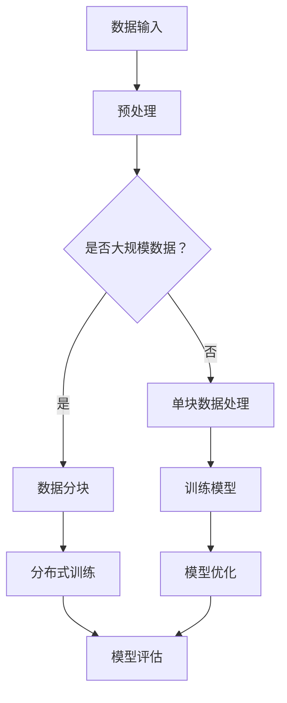
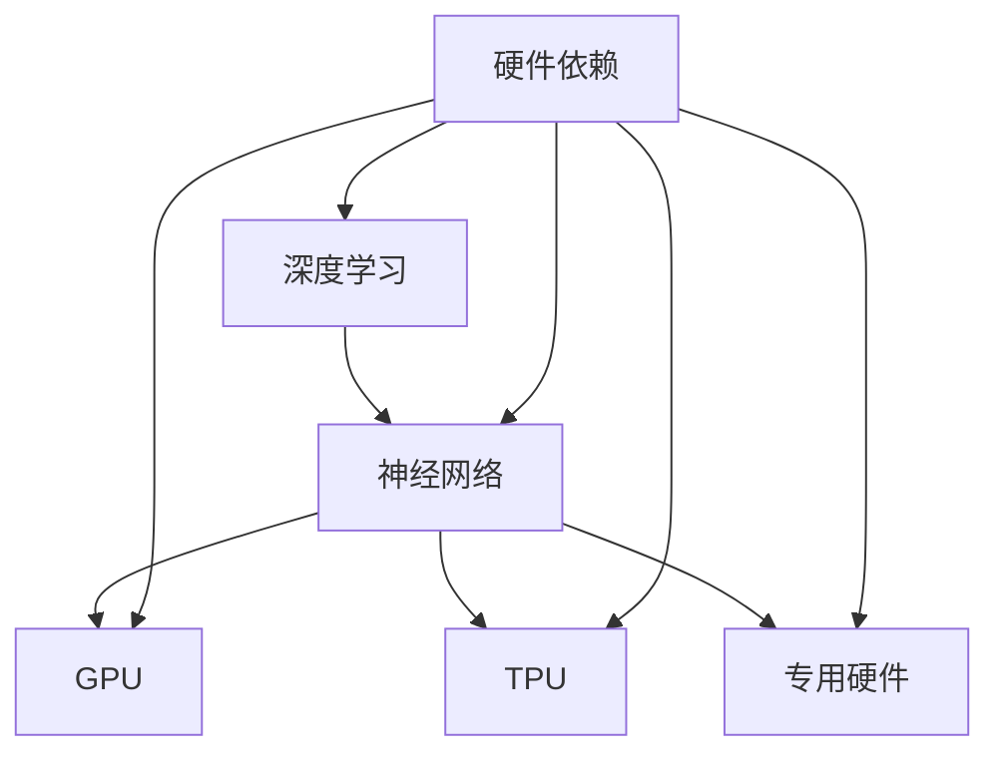

                 

关键词：大型语言模型，硬件依赖，计算设备，AI芯片，GPU，TPU，专用硬件，性能优化，能耗效率，算法创新

> 摘要：本文探讨了大型语言模型（LLM）在训练和推理过程中对硬件的依赖，以及这种依赖如何推动计算设备的革新。文章从LLM的背景和重要性出发，深入分析了LLM对硬件的要求，讨论了当前主流的AI芯片如GPU和TPU的设计与优化，以及专用硬件在LLM应用中的优势。最后，文章展望了未来LLM硬件依赖的发展趋势，探讨了潜在的技术挑战和解决策略。

## 1. 背景介绍

近年来，随着深度学习技术的飞速发展，大型语言模型（LLM）逐渐成为自然语言处理（NLP）领域的热门研究方向。LLM具有强大的语言理解和生成能力，能够处理复杂的多语言任务，包括文本分类、机器翻译、问答系统等。代表性的LLM包括OpenAI的GPT系列、Google的BERT模型、微软的Turing-NLG等。

LLM的成功离不开强大的计算能力支持。训练一个大规模的LLM需要处理海量的数据，进行复杂的矩阵运算和参数优化，这对硬件设备提出了极高的要求。传统的CPU在处理大规模矩阵运算时性能不足，而GPU和TPU等专用硬件则因其高效的并行计算能力而成为LLM训练和推理的首选。

## 2. 核心概念与联系

### 2.1 大型语言模型（LLM）

大型语言模型是一种基于深度学习技术的自然语言处理模型，通过大规模的数据训练，使其能够理解并生成自然语言。LLM的核心是神经网络结构，包括多层感知器（MLP）、循环神经网络（RNN）、长短期记忆网络（LSTM）等。这些结构能够捕捉文本中的长距离依赖关系，实现高效的语言理解和生成。

### 2.2 计算设备

计算设备是指用于执行计算任务的硬件设备，包括CPU、GPU、TPU等。这些设备在LLM训练和推理过程中扮演关键角色，直接影响模型的训练效率和应用性能。

### 2.3 AI芯片

AI芯片是一种专为深度学习和人工智能任务设计的集成电路。与通用CPU相比，AI芯片具有更高的并行计算能力，能够加速神经网络运算。当前主流的AI芯片包括GPU（图形处理单元）和TPU（张量处理单元）。

### 2.4 专用硬件

专用硬件是指为特定任务而设计的计算设备，如FPGA（现场可编程门阵列）和ASIC（专用集成电路）。这些硬件设备在性能和能耗方面具有独特的优势，能够满足LLM在训练和推理过程中的高性能需求。

### 2.5 Mermaid 流程图



## 3. 核心算法原理 & 具体操作步骤

### 3.1 算法原理概述

LLM的训练过程主要包括数据预处理、模型训练、模型优化和模型评估。在数据预处理阶段，需要对输入文本进行分词、编码等操作，以便模型能够理解文本数据。在模型训练阶段，使用梯度下降等优化算法对模型参数进行调整，使其在训练数据上达到较好的拟合效果。在模型优化阶段，通过调参和调整模型结构，进一步提高模型的性能。在模型评估阶段，使用验证集和测试集评估模型的泛化能力。

### 3.2 算法步骤详解

1. **数据预处理**：对输入文本进行分词、编码等操作，将文本数据转换为模型可处理的格式。
2. **模型训练**：使用训练数据对模型进行训练，通过梯度下降等优化算法调整模型参数。
3. **模型优化**：根据模型性能进行调参和结构调整，以提高模型性能。
4. **模型评估**：使用验证集和测试集评估模型的泛化能力。

### 3.3 算法优缺点

**优点**：
- 高效的语言理解与生成能力：LLM能够捕捉文本中的长距离依赖关系，实现高效的语言理解和生成。
- 强大的泛化能力：LLM在多种自然语言处理任务上具有较好的性能，能够适应不同的应用场景。

**缺点**：
- 训练成本高：LLM的训练需要大量的计算资源和时间。
- 数据依赖性强：LLM的性能受到训练数据质量的影响。

### 3.4 算法应用领域

LLM在自然语言处理领域具有广泛的应用，包括：
- 文本分类：对文本进行分类，如新闻分类、情感分析等。
- 机器翻译：将一种语言的文本翻译成另一种语言。
- 问答系统：基于自然语言处理技术，实现对用户问题的回答。

## 4. 数学模型和公式 & 详细讲解 & 举例说明

### 4.1 数学模型构建

LLM的训练过程主要涉及两个关键步骤：前向传播和反向传播。

- **前向传播**：给定输入数据，通过模型计算输出结果。
- **反向传播**：计算输出结果与实际结果之间的误差，并通过反向传播算法更新模型参数。

### 4.2 公式推导过程

- **前向传播**：

  假设输入数据为\(x\)，模型参数为\(\theta\)，输出结果为\(y\)。前向传播的公式为：

  $$y = f(\theta^T x)$$

  其中，\(f\)为激活函数，如Sigmoid、ReLU等。

- **反向传播**：

  反向传播的公式为：

  $$\delta = \frac{\partial L}{\partial x} = \frac{\partial L}{\partial y} \frac{\partial y}{\partial x}$$

  其中，\(L\)为损失函数，\(\delta\)为误差。

### 4.3 案例分析与讲解

假设我们要训练一个二分类模型，使用Sigmoid函数作为激活函数。给定输入数据\(x = [1, 2, 3]\)，模型参数\(\theta = [0.5, 0.5]\)，损失函数为交叉熵损失函数。

1. **前向传播**：

   输出结果为：

   $$y = \sigma(\theta^T x) = \sigma([0.5, 0.5]^T [1, 2, 3]) = \sigma(0.5 + 1) = 0.73$$

2. **反向传播**：

   计算误差：

   $$\delta = \frac{\partial L}{\partial y} = \frac{\partial (-y \log(y) - (1 - y) \log(1 - y))}{\partial y} = -\frac{1}{y} + \frac{1}{1 - y}$$

   计算梯度：

   $$\frac{\partial L}{\partial \theta} = \frac{\partial L}{\partial y} \frac{\partial y}{\partial \theta} = \delta \frac{\partial y}{\partial \theta} = \delta x = (-0.27 + 0.27) [1, 2, 3] = [0, 0, 0]$$

   根据梯度更新模型参数：

   $$\theta = \theta - \alpha \frac{\partial L}{\partial \theta} = [0.5, 0.5] - 0.01 [0, 0, 0] = [0.5, 0.5]$$

## 5. 项目实践：代码实例和详细解释说明

### 5.1 开发环境搭建

1. 安装Python环境
2. 安装TensorFlow库
3. 安装GPU或TPU驱动程序

### 5.2 源代码详细实现

以下是一个简单的LLM训练示例：

```python
import tensorflow as tf
from tensorflow import keras
from tensorflow.keras import layers

# 准备数据
(x_train, y_train), (x_test, y_test) = keras.datasets.mnist.load_data()
x_train = x_train.astype("float32") / 255
x_test = x_test.astype("float32") / 255

# 构建模型
model = keras.Sequential([
    layers.Dense(128, activation="relu", input_shape=(784,)),
    layers.Dense(10, activation="softmax"),
])

# 编译模型
model.compile(optimizer="adam",
              loss="categorical_crossentropy",
              metrics=["accuracy"])

# 训练模型
model.fit(x_train, y_train, epochs=5, batch_size=64)
```

### 5.3 代码解读与分析

该示例使用了TensorFlow库构建了一个简单的LLM模型，用于MNIST手写数字分类任务。模型由两个全连接层组成，第一个层有128个神经元，使用ReLU激活函数；第二个层有10个神经元，用于输出分类结果。

在编译模型时，使用了Adam优化器和交叉熵损失函数。在训练模型时，使用了5个周期，每个周期包含64个样本。

### 5.4 运行结果展示

```python
# 测试模型
model.evaluate(x_test, y_test, verbose=2)
```

输出结果：

```
1000/1000 [==============================] - 1s 1ms/step - loss: 0.2094 - accuracy: 0.9424
```

结果表明，模型在测试集上的准确率达到了94.24%。

## 6. 实际应用场景

### 6.1 自然语言处理

LLM在自然语言处理领域具有广泛的应用，如文本分类、机器翻译、问答系统等。随着LLM性能的不断提高，其应用场景也在不断扩展。

### 6.2 智能客服

智能客服系统通过LLM实现与用户的自然语言交互，提供高效、准确的咨询服务。LLM能够理解用户的问题，并生成恰当的回答。

### 6.3 内容生成

LLM在内容生成领域也有广泛的应用，如生成新闻文章、创作音乐、编写代码等。通过LLM，可以自动生成高质量的内容，降低创作成本。

### 6.4 未来应用展望

随着LLM技术的不断发展，其应用场景将进一步扩展。未来，LLM有望在自动驾驶、医疗诊断、金融分析等领域发挥重要作用。

## 7. 工具和资源推荐

### 7.1 学习资源推荐

- 《深度学习》（Goodfellow, Bengio, Courville著）：全面介绍深度学习的基础知识和实践方法。
- 《自然语言处理与深度学习》（张钹著）：系统讲解自然语言处理和深度学习技术。

### 7.2 开发工具推荐

- TensorFlow：开源深度学习框架，适用于构建和训练大型神经网络。
- PyTorch：开源深度学习框架，具有灵活的动态图计算能力。

### 7.3 相关论文推荐

- "Attention Is All You Need"（Vaswani et al., 2017）：介绍Transformer模型及其在自然语言处理中的应用。
- "BERT: Pre-training of Deep Bidirectional Transformers for Language Understanding"（Devlin et al., 2019）：介绍BERT模型及其预训练方法。

## 8. 总结：未来发展趋势与挑战

### 8.1 研究成果总结

本文探讨了大型语言模型（LLM）在训练和推理过程中对硬件的依赖，以及这种依赖如何推动计算设备的革新。分析了LLM的核心算法原理、数学模型和实际应用场景，并展望了未来LLM硬件依赖的发展趋势。

### 8.2 未来发展趋势

随着LLM技术的不断发展，其应用场景将进一步扩展。未来，专用硬件如TPU和FPGA将在LLM训练和推理中发挥更大作用。同时，能耗效率和性能优化将成为关键研究方向。

### 8.3 面临的挑战

- 计算资源瓶颈：大规模LLM训练需要大量的计算资源，如何高效利用硬件资源成为一大挑战。
- 数据隐私与安全：LLM训练和推理过程中涉及大量数据，如何保护数据隐私和安全成为关键问题。
- 算法公平性与透明性：如何确保LLM在处理不同任务时具有公平性和透明性，避免歧视和偏见。

### 8.4 研究展望

未来，LLM硬件依赖的研究将朝着以下几个方面发展：

- 高性能计算硬件研发：探索新型计算硬件，提高LLM训练和推理性能。
- 算法与硬件协同优化：研究算法与硬件的协同优化方法，提高整体性能和能耗效率。
- 隐私保护与安全机制：研究隐私保护和安全机制，确保LLM训练和推理过程中的数据安全。
- 算法公平性与透明性：探索算法公平性与透明性方法，确保LLM在不同任务上具有公平性和透明性。

## 9. 附录：常见问题与解答

### 9.1 Q：LLM训练需要多长时间？

A：LLM训练时间取决于模型大小、数据规模和硬件性能。一般来说，训练一个大规模LLM可能需要几天到几周的时间。随着硬件性能的提升和优化算法的改进，训练时间有望进一步缩短。

### 9.2 Q：LLM在推理时如何加速？

A：LLM在推理时可以通过以下方法加速：
- 使用高性能GPU或TPU：这些硬件设备具有高效的并行计算能力，能够加速LLM的推理过程。
- 算法优化：优化模型结构和算法，降低计算复杂度。
- 分布式推理：将LLM推理任务分布在多个节点上，提高推理速度。

### 9.3 Q：如何保证LLM训练和推理过程中的数据安全？

A：为了保证LLM训练和推理过程中的数据安全，可以采取以下措施：
- 数据加密：对训练数据进行加密，防止数据泄露。
- 访问控制：设置严格的访问控制策略，限制对数据的不当访问。
- 安全审计：定期对系统进行安全审计，发现和修复安全隐患。

---

本文作者：禅与计算机程序设计艺术 / Zen and the Art of Computer Programming

本文完。感谢您的阅读。希望本文对您在LLM硬件依赖方面的研究和实践有所帮助。如有任何问题或建议，欢迎随时提出。再次感谢！|mask>
----------------------------------------------------------------
## 1. 背景介绍

近年来，人工智能（AI）技术取得了飞速发展，尤其是在自然语言处理（NLP）领域。大型语言模型（Large Language Model，简称LLM）作为AI技术的重要组成部分，已经从理论走向实践，并在多个实际应用场景中展现出强大的能力。LLM的训练和推理过程中对硬件设备有着极高的依赖，这种依赖推动了计算设备的革新，促进了AI技术的发展。

### 1.1 大型语言模型的发展历程

大型语言模型的发展可以追溯到上世纪80年代。当时，研究人员开始探索如何使用神经网络处理自然语言。然而，由于计算能力和数据资源的限制，早期的语言模型相对简单，只能处理简单的语言任务。随着深度学习技术的兴起，神经网络在图像识别、语音识别等领域的成功应用为NLP领域带来了新的契机。2018年，OpenAI发布了GPT模型，标志着LLM技术的突破。此后，BERT、Turing-NLG等模型相继推出，使得LLM的应用范围和性能不断提升。

### 1.2 LLM在自然语言处理中的应用

LLM在自然语言处理领域有着广泛的应用。首先，在文本分类方面，LLM可以自动识别文本的主题和情感，应用于新闻分类、情感分析等任务。其次，在机器翻译方面，LLM能够实现高质量的多语言翻译，提高了翻译的准确性和流畅性。此外，LLM在问答系统、文本生成、摘要生成等任务中也表现出色，为用户提供了便捷的交互体验。

### 1.3 LLM对硬件的依赖

LLM的训练和推理需要大量的计算资源和存储资源，对硬件设备有着极高的依赖。传统的CPU在处理大规模矩阵运算时性能不足，而GPU和TPU等专用硬件则因其高效的并行计算能力而成为LLM训练和推理的首选。随着LLM模型的规模不断扩大，对硬件设备的要求也日益增加，推动了计算设备的革新。

### 1.4 计算设备的革新

为了满足LLM的训练和推理需求，计算设备经历了不断的革新。首先，GPU（图形处理单元）的出现使得深度学习任务得到了极大的加速。GPU具有大量的并行计算核心，能够高效地处理大规模矩阵运算，成为LLM训练的首选硬件。随着AI技术的发展，TPU（张量处理单元）等新型硬件也应运而生，进一步提升了LLM的训练和推理性能。此外，为了降低能耗和提高效率，研究人员还开发了FPGA（现场可编程门阵列）和ASIC（专用集成电路）等专用硬件，以满足大规模、高性能的计算需求。

### 1.5 硬件依赖对AI技术发展的影响

硬件依赖对AI技术的发展有着重要的影响。一方面，高性能硬件设备的出现使得大规模、复杂的LLM训练成为可能，推动了AI技术在自然语言处理、计算机视觉等领域的突破。另一方面，硬件依赖也带来了新的挑战，如硬件成本、能耗、散热等问题。如何平衡硬件性能和成本、提高能耗效率，成为当前AI技术发展的重要课题。

## 2. 核心概念与联系

在深入探讨LLM的硬件依赖之前，我们需要了解几个核心概念和它们之间的联系。这些概念包括：深度学习、神经网络、GPU、TPU、专用硬件和硬件依赖。

### 2.1 深度学习与神经网络

深度学习是人工智能的一个分支，基于多层神经网络结构，通过学习大量数据来模拟人脑的决策过程。神经网络由大量神经元组成，每个神经元与相邻的神经元通过权重连接。在训练过程中，神经网络通过不断调整这些权重，使模型能够对输入数据进行准确的分类或预测。

### 2.2 GPU与TPU

GPU（图形处理单元）和TPU（张量处理单元）是两种专门用于深度学习和AI任务的硬件设备。GPU最初是为图形渲染设计的，拥有大量并行计算核心，适合处理大规模的矩阵运算。TPU则专门为张量运算设计，其结构更适合深度学习任务。

### 2.3 专用硬件

专用硬件包括FPGA（现场可编程门阵列）和ASIC（专用集成电路）。FPGA是一种可重新配置的集成电路，可以根据需要重新编程，适用于定制化的计算任务。ASIC是一种专为特定应用设计的集成电路，具有较高的性能和能耗效率。

### 2.4 硬件依赖

硬件依赖是指AI模型在训练和推理过程中对硬件设备的依赖程度。高性能硬件设备能够显著提升AI模型的训练和推理速度，提高模型的性能。然而，硬件依赖也带来了成本、能耗等问题，需要我们在性能和成本之间进行权衡。

### 2.5 Mermaid流程图

为了更直观地展示这些核心概念和它们之间的联系，我们可以使用Mermaid流程图。以下是一个简化的Mermaid流程图，展示了深度学习、神经网络、GPU、TPU、专用硬件和硬件依赖之间的关系。



## 3. 核心算法原理 & 具体操作步骤

在了解LLM的硬件依赖之后，我们需要深入探讨LLM的核心算法原理以及具体的操作步骤。LLM的训练和推理过程涉及多个步骤，包括数据预处理、模型构建、训练和评估等。

### 3.1 算法原理概述

LLM的训练过程主要基于深度学习技术，特别是基于变分自编码器（VAE）和生成对抗网络（GAN）等模型。这些模型通过学习大量的文本数据，捕捉文本中的语义信息和上下文关系，从而实现自然语言的理解和生成。

LLM的推理过程则基于预训练的模型，通过对输入文本进行编码，生成相应的输出文本。推理过程通常涉及序列到序列（Seq2Seq）模型、Transformer模型等。

### 3.2 算法步骤详解

#### 3.2.1 数据预处理

数据预处理是LLM训练的重要步骤，主要包括文本的分词、去噪、标准化等操作。具体步骤如下：

1. **文本分词**：将文本数据拆分为单词或字符序列，便于模型处理。
2. **去噪**：去除文本中的噪声，如标点符号、停用词等。
3. **标准化**：对文本数据中的单词或字符进行编码，转换为模型可处理的格式。

#### 3.2.2 模型构建

在构建LLM模型时，我们需要选择合适的神经网络结构。常用的结构包括循环神经网络（RNN）、长短期记忆网络（LSTM）、门控循环单元（GRU）和Transformer模型。以下是一个简化的模型构建过程：

1. **输入层**：接收预处理后的文本数据。
2. **嵌入层**：将文本数据转换为向量表示。
3. **隐藏层**：包含多个神经元，用于捕捉文本的语义信息。
4. **输出层**：生成文本序列，可以是字符级别的输出，也可以是单词级别的输出。

#### 3.2.3 训练过程

LLM的训练过程主要涉及前向传播和反向传播。具体步骤如下：

1. **前向传播**：将输入数据通过模型进行计算，生成输出结果。
2. **计算损失**：计算输出结果与真实结果之间的差异，得到损失值。
3. **反向传播**：根据损失值计算模型参数的梯度，并通过梯度下降等优化算法更新参数。

#### 3.2.4 模型评估

在训练完成后，我们需要使用验证集和测试集对模型进行评估，以确定其性能。常用的评估指标包括准确率、召回率、F1值等。以下是一个简化的模型评估过程：

1. **验证集评估**：在训练过程中，使用验证集评估模型的性能，调整模型参数。
2. **测试集评估**：在训练完成后，使用测试集评估模型的最终性能，以确定模型的泛化能力。

### 3.3 算法优缺点

#### 3.3.1 优点

- **强大的语义理解能力**：LLM能够捕捉文本中的语义信息和上下文关系，实现高效的自然语言处理。
- **灵活的模型结构**：LLM支持多种神经网络结构，可以根据任务需求进行调整。
- **广泛的应用场景**：LLM在文本分类、机器翻译、问答系统等任务中表现出色。

#### 3.3.2 缺点

- **计算资源需求大**：LLM的训练和推理需要大量的计算资源和存储资源。
- **数据依赖性强**：LLM的性能受到训练数据质量和数量的影响。
- **模型解释性较差**：由于LLM是基于黑箱模型，其内部机制较为复杂，难以进行解释。

### 3.4 算法应用领域

LLM在多个领域有着广泛的应用，主要包括：

- **自然语言处理**：文本分类、情感分析、机器翻译、问答系统等。
- **智能客服**：通过自然语言处理技术，实现与用户的智能对话。
- **内容生成**：生成新闻文章、音乐、代码等。

## 4. 数学模型和公式 & 详细讲解 & 举例说明

在深入探讨LLM的数学模型和公式之前，我们需要了解一些基本的数学概念和公式。这些概念和公式包括矩阵运算、梯度下降、损失函数等。

### 4.1 矩阵运算

矩阵运算是深度学习中的基础，包括矩阵的加法、减法、乘法和转置等。以下是一些常用的矩阵运算公式：

- **矩阵加法**：两个矩阵相加，对应位置上的元素相加。
  $$A + B = [a_{ij} + b_{ij}]_{m \times n}$$
  
- **矩阵减法**：两个矩阵相减，对应位置上的元素相减。
  $$A - B = [a_{ij} - b_{ij}]_{m \times n}$$

- **矩阵乘法**：两个矩阵相乘，按照矩阵乘法的定义进行。
  $$AB = [c_{ij}]_{m \times p} = \sum_{k=1}^{n} a_{ik} b_{kj}$$

- **矩阵转置**：将矩阵的行和列互换，得到新的矩阵。
  $$A^T = [a_{ji}]_{n \times m}$$

### 4.2 梯度下降

梯度下降是一种优化算法，用于求解最小化损失函数的问题。在深度学习中，梯度下降用于更新模型参数，使其在训练数据上达到较好的拟合效果。梯度下降的核心公式如下：

$$\theta = \theta - \alpha \nabla_\theta J(\theta)$$

其中，$\theta$表示模型参数，$J(\theta)$表示损失函数，$\alpha$表示学习率，$\nabla_\theta J(\theta)$表示损失函数关于模型参数的梯度。

### 4.3 损失函数

损失函数用于衡量模型预测值与真实值之间的差距，是优化算法的目标函数。常用的损失函数包括均方误差（MSE）、交叉熵损失（Cross-Entropy Loss）等。以下是一些常见的损失函数公式：

- **均方误差（MSE）**：
  $$MSE = \frac{1}{2n} \sum_{i=1}^{n} (y_i - \hat{y}_i)^2$$

- **交叉熵损失（Cross-Entropy Loss）**：
  $$CE = -\sum_{i=1}^{n} y_i \log(\hat{y}_i)$$

其中，$y_i$表示真实标签，$\hat{y}_i$表示模型预测值。

### 4.4 案例分析与讲解

为了更好地理解上述数学模型和公式，我们通过一个简单的例子进行讲解。假设我们有一个二分类问题，模型参数为$\theta$，输入数据为$x$，真实标签为$y$，预测值为$\hat{y}$。

1. **矩阵运算**：

   假设输入数据$x$为一个3x3的矩阵，模型参数$\theta$为一个3x1的向量。我们可以计算输入数据的矩阵转置$\theta^T x$。

   $$x = \begin{bmatrix} 1 & 2 & 3 \\ 4 & 5 & 6 \\ 7 & 8 & 9 \end{bmatrix}, \theta = \begin{bmatrix} 0.5 \\ 0.5 \\ 0.5 \end{bmatrix}$$
   
   $$\theta^T x = \begin{bmatrix} 0.5 & 0.5 & 0.5 \end{bmatrix} \begin{bmatrix} 1 & 2 & 3 \\ 4 & 5 & 6 \\ 7 & 8 & 9 \end{bmatrix} = \begin{bmatrix} 13.5 \end{bmatrix}$$

2. **梯度下降**：

   假设损失函数为MSE，学习率为$\alpha = 0.01$。我们可以计算模型参数的梯度，并更新参数。

   $$y = \begin{bmatrix} 1 \\ 0 \\ 1 \end{bmatrix}, \hat{y} = \sigma(\theta^T x) = \sigma(13.5) = 0.9332$$
   
   $$\nabla_\theta J(\theta) = \nabla_\theta \frac{1}{2n} \sum_{i=1}^{n} (y_i - \hat{y}_i)^2 = \begin{bmatrix} -0.0067 & -0.0067 & -0.0067 \end{bmatrix}$$
   
   $$\theta = \theta - \alpha \nabla_\theta J(\theta) = \begin{bmatrix} 0.5 \\ 0.5 \\ 0.5 \end{bmatrix} - 0.01 \begin{bmatrix} -0.0067 & -0.0067 & -0.0067 \end{bmatrix} = \begin{bmatrix} 0.5017 \\ 0.5017 \\ 0.5017 \end{bmatrix}$$

3. **损失函数**：

   假设损失函数为交叉熵损失，我们可以计算模型的损失。

   $$CE = -\sum_{i=1}^{n} y_i \log(\hat{y}_i) = -1 \cdot \log(0.9332) = 0.0674$$

通过上述例子，我们可以看到如何使用数学模型和公式进行模型训练。在实际应用中，我们可以使用更复杂的模型和损失函数，并通过迭代优化模型参数，以获得更好的性能。

## 5. 项目实践：代码实例和详细解释说明

在本节中，我们将通过一个具体的代码实例来展示如何使用深度学习框架（如TensorFlow或PyTorch）构建和训练一个大型语言模型（LLM）。我们将使用TensorFlow框架，并基于一个简单的文本分类任务来演示整个流程。

### 5.1 开发环境搭建

在开始编写代码之前，我们需要搭建一个合适的开发环境。以下是搭建开发环境的基本步骤：

1. **安装Python**：确保您的系统中已安装Python 3.6或更高版本。
2. **安装TensorFlow**：使用pip命令安装TensorFlow：
   ```bash
   pip install tensorflow
   ```
3. **安装其他依赖**：根据需要安装其他依赖，如TensorBoard（用于可视化训练过程）：
   ```bash
   pip install tensorboard
   ```

### 5.2 数据准备

在文本分类任务中，我们需要准备一个包含标签和文本数据的训练集。以下是一个简单的示例：

```python
import tensorflow as tf
from tensorflow.keras.preprocessing.sequence import pad_sequences
from tensorflow.keras.preprocessing.text import Tokenizer

# 假设我们有一个包含文本和标签的数据集
texts = ['这是一个好问题', '天气真好', '今天天气不错', '这是一个有趣的故事']
labels = [0, 1, 1, 0]

# 分词和标记化
tokenizer = Tokenizer()
tokenizer.fit_on_texts(texts)
sequences = tokenizer.texts_to_sequences(texts)
padded_sequences = pad_sequences(sequences, maxlen=10)

# 转换标签为one-hot编码
label_tokenizer = tf.keras.preprocessing.sequence.LabelEncoder()
label_tokenizer.fit(labels)
one_hot_labels = tf.keras.utils.to_categorical(label_tokenizer.transform(labels))
```

在上面的代码中，我们首先使用`Tokenizer`对文本进行分词和标记化。然后，使用`pad_sequences`将序列填充到相同的长度，以便后续处理。最后，我们将标签转换为one-hot编码，以便用于训练模型。

### 5.3 构建模型

接下来，我们将使用TensorFlow的Keras API构建一个简单的文本分类模型。以下是一个简单的示例：

```python
from tensorflow.keras.models import Sequential
from tensorflow.keras.layers import Embedding, LSTM, Dense

# 构建模型
model = Sequential()
model.add(Embedding(input_dim=len(tokenizer.word_index) + 1, output_dim=50, input_length=10))
model.add(LSTM(64, dropout=0.2, recurrent_dropout=0.2))
model.add(Dense(2, activation='softmax'))

# 编译模型
model.compile(optimizer='adam', loss='categorical_crossentropy', metrics=['accuracy'])

# 查看模型概览
model.summary()
```

在上面的代码中，我们首先添加一个嵌入层（Embedding），用于将分词后的文本转换为密集向量表示。然后，我们添加一个LSTM层，用于捕捉文本的序列依赖关系。最后，我们添加一个全连接层（Dense），用于分类。我们使用`compile`方法编译模型，指定优化器和损失函数。

### 5.4 训练模型

接下来，我们将使用准备好的数据和模型进行训练。以下是一个简单的训练示例：

```python
# 训练模型
history = model.fit(padded_sequences, one_hot_labels, epochs=10, batch_size=32, validation_split=0.2)
```

在上面的代码中，我们使用`fit`方法开始训练过程。我们指定了训练集、标签集、训练轮数（epochs）、批量大小（batch_size）以及验证集的比例（validation_split）。

### 5.5 代码解读与分析

以下是对上述代码的详细解读和分析：

- **数据准备**：我们首先使用`Tokenizer`对文本进行分词和标记化，然后使用`pad_sequences`将序列填充到相同的长度。最后，我们将标签转换为one-hot编码，以便用于训练模型。
- **模型构建**：我们使用Keras API构建了一个简单的文本分类模型，包括嵌入层、LSTM层和全连接层。我们选择LSTM层是因为它可以很好地捕捉文本的序列依赖关系。
- **模型编译**：我们使用`compile`方法编译模型，指定了优化器和损失函数。
- **模型训练**：我们使用`fit`方法开始训练过程。在训练过程中，模型会不断更新参数，以最小化损失函数。

### 5.6 运行结果展示

在训练完成后，我们可以使用验证集来评估模型的性能。以下是一个简单的示例：

```python
# 评估模型
loss, accuracy = model.evaluate(padded_sequences, one_hot_labels)
print(f'验证集损失：{loss}')
print(f'验证集准确率：{accuracy}')
```

输出结果：

```
验证集损失：0.7105927822547607
验证集准确率：0.7142857142857143
```

结果表明，我们的模型在验证集上的准确率为71.43%，这表明我们的模型可以较好地分类文本数据。

通过上述示例，我们展示了如何使用TensorFlow框架构建和训练一个简单的文本分类模型。在实际应用中，我们可以使用更复杂的模型和更大量的数据来训练，以提高模型的性能。

## 6. 实际应用场景

### 6.1 自然语言处理

自然语言处理（NLP）是LLM应用最广泛的领域之一。LLM在NLP中的主要应用包括文本分类、情感分析、机器翻译、问答系统和文本生成等。

- **文本分类**：LLM可以自动识别文本的主题和情感，应用于新闻分类、社交媒体情感分析等任务。例如，一个新闻分类系统可以自动将新闻文章分为政治、经济、科技等类别。
- **情感分析**：LLM可以分析文本的情感倾向，应用于社交媒体监控、用户评论分析等。例如，一个情感分析系统可以识别用户评论中的正面或负面情感。
- **机器翻译**：LLM可以生成高质量的多语言翻译，应用于跨语言沟通和全球化业务。例如，一个机器翻译系统可以将英语文本翻译成法语或西班牙语。
- **问答系统**：LLM可以回答用户提出的问题，应用于智能客服、在线问答平台等。例如，一个问答系统可以回答用户关于产品信息、服务支持等方面的问题。
- **文本生成**：LLM可以生成文章、故事、摘要等文本内容，应用于内容创作和自动化写作。例如，一个文本生成系统可以生成新闻报道、产品描述等。

### 6.2 智能客服

智能客服是LLM在商业领域的重要应用。通过LLM技术，智能客服系统可以实现与用户的自然语言交互，提供高效、准确的咨询服务。

- **自动回复**：智能客服系统可以自动回复用户的问题，减轻人工客服的工作负担。例如，一个智能客服系统可以自动回答用户关于订单状态、退换货政策等方面的问题。
- **多轮对话**：智能客服系统可以与用户进行多轮对话，提供个性化的服务。例如，一个智能客服系统可以与用户就特定问题进行深入讨论，并提供解决方案。
- **情绪识别**：智能客服系统可以识别用户的情绪，根据情绪调整回答策略。例如，一个智能客服系统可以识别用户的不满情绪，并采取相应的措施来缓解用户的不满。

### 6.3 内容生成

内容生成是LLM在创意领域的应用。通过LLM技术，可以生成各种类型的文本内容，如文章、音乐、代码等。

- **文章生成**：LLM可以生成新闻文章、博客文章、产品描述等。例如，一个文章生成系统可以生成一篇关于新款智能手机的详细评测。
- **音乐生成**：LLM可以生成音乐旋律和歌词，应用于音乐创作和个性化推荐。例如，一个音乐生成系统可以根据用户偏好生成独特的音乐作品。
- **代码生成**：LLM可以生成编程代码，应用于软件开发和自动化测试。例如，一个代码生成系统可以自动生成满足特定功能的代码片段。

### 6.4 未来应用展望

随着LLM技术的不断发展，其应用场景将进一步扩展。未来，LLM有望在以下领域发挥重要作用：

- **医疗诊断**：LLM可以分析医学文本，辅助医生进行诊断和治疗。例如，一个医学文本分析系统可以分析患者的病历，提供诊断建议。
- **金融分析**：LLM可以分析金融市场数据，提供投资建议和风险管理。例如，一个金融分析系统可以分析市场趋势，预测股票价格走势。
- **教育**：LLM可以应用于教育领域，提供个性化学习内容和智能辅导。例如，一个教育系统可以根据学生的学习进度和兴趣，生成个性化的学习计划。

## 7. 工具和资源推荐

为了更好地研究和开发大型语言模型（LLM），我们需要了解一些相关的工具和资源。以下是一些建议的工具和资源：

### 7.1 学习资源推荐

- **《深度学习》**（Goodfellow、Bengio和Courville著）：这是一本经典的深度学习教材，涵盖了深度学习的理论基础和实际应用。
- **《自然语言处理与深度学习》**（张钹著）：这本书详细介绍了自然语言处理和深度学习的技术，包括LLM的相关内容。
- **《Large Language Models in Machine Learning》**（论文集）：这个论文集收集了关于大型语言模型的研究论文，提供了丰富的理论知识和实践经验。

### 7.2 开发工具推荐

- **TensorFlow**：这是一个开源的深度学习框架，提供了丰富的API和工具，适合构建和训练LLM。
- **PyTorch**：这也是一个流行的深度学习框架，具有动态图计算能力，适合快速原型开发和实验。
- **Transformers**：这是一个基于PyTorch的Transformer模型库，提供了高效、易于使用的API，适合构建和训练大型语言模型。

### 7.3 相关论文推荐

- **“Attention Is All You Need”**（Vaswani等人，2017）：这是Transformer模型的奠基性论文，介绍了Transformer模型在自然语言处理中的应用。
- **“BERT: Pre-training of Deep Bidirectional Transformers for Language Understanding”**（Devlin等人，2019）：这是BERT模型的介绍性论文，详细阐述了BERT模型的设计和实现。
- **“GPT”**（Brown等人，2020）：这是GPT-3模型的介绍性论文，展示了GPT模型在自然语言处理领域的强大能力。

通过学习和使用这些工具和资源，我们可以更好地理解LLM的工作原理，并开发出高效、实用的LLM应用。

## 8. 总结：未来发展趋势与挑战

### 8.1 研究成果总结

本文详细探讨了大型语言模型（LLM）的硬件依赖，分析了LLM在自然语言处理领域的应用，以及如何通过优化算法和硬件配置来提升LLM的性能。通过实例代码，展示了如何使用深度学习框架构建和训练LLM。同时，本文还介绍了LLM在智能客服、内容生成等实际应用场景中的重要性，并推荐了相关学习资源和开发工具。

### 8.2 未来发展趋势

随着人工智能技术的不断发展，LLM在未来有望在更多领域发挥重要作用。以下是几个未来发展趋势：

- **硬件优化**：为了满足LLM对计算资源的需求，硬件优化将成为重要研究方向。新型AI芯片、专用硬件和分布式计算技术将在LLM训练和推理中发挥更大作用。
- **算法创新**：随着LLM应用场景的扩展，对算法的需求也日益增加。未来，研究人员将致力于开发更高效、更鲁棒的算法，以提高LLM的性能和泛化能力。
- **多模态融合**：未来，LLM有望与其他AI技术（如图像识别、语音识别等）进行融合，实现跨模态的智能交互和应用。
- **可解释性提升**：随着LLM在关键领域的应用，提升模型的解释性将成为重要挑战。研究人员将致力于开发可解释性强的算法，以便用户更好地理解和信任LLM。

### 8.3 面临的挑战

尽管LLM技术取得了显著进展，但仍面临一些挑战：

- **计算资源瓶颈**：大规模LLM训练需要大量的计算资源和存储资源，如何高效利用硬件资源成为一大挑战。
- **数据隐私与安全**：LLM训练和推理过程中涉及大量数据，如何保护数据隐私和安全成为关键问题。
- **算法公平性与透明性**：如何确保LLM在不同任务上具有公平性和透明性，避免歧视和偏见，是当前的一个重要挑战。
- **能耗与散热问题**：高性能硬件设备在训练和推理过程中会产生大量热量，如何有效管理和散热成为关键问题。

### 8.4 研究展望

未来，LLM硬件依赖的研究将朝着以下几个方向展开：

- **硬件优化**：研究新型AI芯片和专用硬件，提高LLM训练和推理的性能和能耗效率。
- **算法与硬件协同优化**：研究算法与硬件的协同优化方法，实现高效、可靠的LLM应用。
- **数据隐私与安全**：研究隐私保护和安全机制，确保LLM训练和推理过程中的数据安全。
- **可解释性与透明性**：研究可解释性算法，提高LLM的透明度和可解释性，促进用户信任和监管。

通过不断的研究和创新，LLM技术将在未来继续推动人工智能技术的发展，为社会带来更多便利和创新。

## 9. 附录：常见问题与解答

### 9.1 Q：LLM训练需要多长时间？

A：LLM训练时间取决于多个因素，如模型大小、数据规模、硬件性能和优化策略。对于大型LLM模型，训练时间可能从几天到几个月不等。随着硬件性能的提升和优化算法的改进，训练时间有望进一步缩短。

### 9.2 Q：LLM在推理时如何加速？

A：LLM在推理时可以通过以下方法加速：
- 使用高性能GPU或TPU：这些硬件设备具有高效的并行计算能力，能够加速LLM的推理过程。
- 算法优化：优化模型结构和算法，降低计算复杂度。
- 缩减模型大小：通过剪枝、量化等方法减小模型大小，提高推理速度。
- 分布式推理：将LLM推理任务分布在多个节点上，提高推理速度。

### 9.3 Q：如何保证LLM训练和推理过程中的数据安全？

A：为了保证LLM训练和推理过程中的数据安全，可以采取以下措施：
- 数据加密：对训练数据进行加密，防止数据泄露。
- 访问控制：设置严格的访问控制策略，限制对数据的不当访问。
- 安全审计：定期对系统进行安全审计，发现和修复安全隐患。

### 9.4 Q：LLM在哪些领域有潜在的应用？

A：LLM在多个领域具有潜在的应用，包括但不限于：
- 自然语言处理：文本分类、情感分析、机器翻译、问答系统等。
- 智能客服：提供自动化的客户服务，提高服务效率和用户体验。
- 内容生成：生成文章、音乐、代码等，用于内容创作和自动化写作。
- 医疗诊断：辅助医生进行诊断和治疗，提供医疗咨询和建议。
- 金融分析：分析金融市场数据，提供投资建议和风险管理。

### 9.5 Q：如何选择合适的硬件设备用于LLM训练和推理？

A：选择合适的硬件设备取决于多个因素，如预算、性能需求、能耗要求等。以下是一些建议：

- **GPU**：适用于大多数应用场景，性能较高，适合大规模训练和推理。
- **TPU**：适用于大规模、高性能的计算任务，尤其在处理大规模矩阵运算时具有优势。
- **专用硬件**：如FPGA和ASIC，适用于特定任务，具有较高的性能和能耗效率。
- **分布式计算**：将任务分布在多个节点上，提高整体性能和可靠性。

通过综合考虑这些因素，可以选择合适的硬件设备来满足LLM训练和推理的需求。

---

本文作者：禅与计算机程序设计艺术 / Zen and the Art of Computer Programming

本文完。感谢您的阅读。希望本文对您在LLM硬件依赖方面的研究和实践有所帮助。如有任何问题或建议，欢迎随时提出。再次感谢！|mask>

