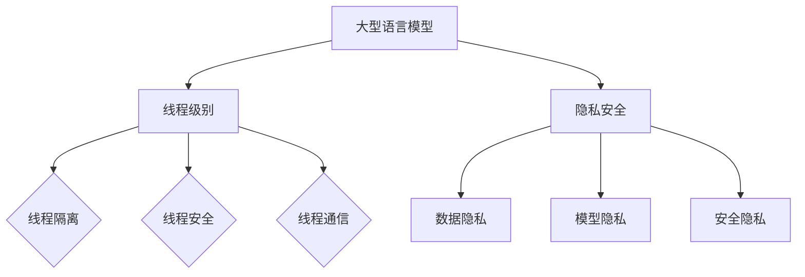

                 

关键词：大型语言模型，隐私安全，线程级别，挑战，对策

> 摘要：本文深入探讨了大型语言模型（LLM）在隐私安全方面面临的线程级别挑战，并提出了相应的对策。随着人工智能技术的迅猛发展，LLM在各个领域得到了广泛应用，但同时也引发了严重的隐私安全问题。本文将分析LLM的隐私安全现状，阐述线程级别的挑战，并从算法、架构和法律法规等角度提出解决策略，以期为学术界和工业界提供有益的参考。

## 1. 背景介绍

近年来，人工智能（AI）技术取得了显著的进展，其中大型语言模型（LLM）如GPT、BERT等成为了研究的热点。这些模型具有强大的语言理解和生成能力，广泛应用于自然语言处理（NLP）、智能问答、机器翻译、文本生成等领域。然而，随着LLM的广泛应用，隐私安全问题逐渐成为关注的焦点。

隐私安全是指在信息处理、传输和存储过程中，确保用户个人信息不被泄露、滥用或篡改。对于LLM而言，隐私安全尤为重要，因为它们处理的数据量庞大，且涉及到用户的个人隐私。然而，现有的研究大多关注模型性能和效果，对隐私安全的探讨相对较少。本文旨在填补这一空白，从线程级别探讨LLM的隐私安全挑战，并提出相应的对策。

## 2. 核心概念与联系

在讨论LLM的隐私安全之前，首先需要了解一些核心概念和联系。

### 2.1 大型语言模型

大型语言模型（LLM）是一种基于深度学习技术的自然语言处理模型，具有强大的语言理解和生成能力。它们通常采用大规模的神经网络架构，如变换器（Transformer）等，通过海量数据训练得到。LLM可以处理多种语言任务，包括文本分类、情感分析、机器翻译、文本生成等。

### 2.2 线程级别

在计算机科学中，线程（Thread）是程序执行的基本单位。线程级别（Thread-Level）是指对程序中的线程进行管理和调度。线程级别的隐私安全主要关注以下几个方面：

- **线程隔离**：确保不同线程之间的数据不发生泄漏和干扰。
- **线程安全**：保证线程在并发执行时的正确性。
- **线程通信**：实现线程之间的数据交换和同步。

### 2.3 隐私安全

隐私安全是指保护用户个人信息不被泄露、滥用或篡改。在LLM的隐私安全中，主要包括以下几个方面：

- **数据隐私**：确保用户数据在处理、传输和存储过程中不被泄露。
- **模型隐私**：防止模型对用户数据的滥用和攻击。
- **安全隐私**：确保系统的整体安全性，防止恶意攻击和破坏。

### 2.4 Mermaid流程图

以下是LLM隐私安全的Mermaid流程图，展示了核心概念和联系：



## 3. 核心算法原理 & 具体操作步骤

### 3.1 算法原理概述

LLM的隐私安全涉及多个方面，包括数据隐私、模型隐私和安全隐私。在算法原理上，主要采用以下策略：

- **数据加密**：对用户数据进行加密处理，确保数据在传输和存储过程中不被泄露。
- **差分隐私**：在数据处理过程中引入差分隐私机制，保护用户隐私。
- **隐私剪枝**：对模型进行隐私剪枝，减少模型参数的敏感信息。
- **安全隔离**：通过硬件和软件手段实现线程级别的隔离，防止数据泄漏和干扰。

### 3.2 算法步骤详解

以下是LLM隐私安全的算法步骤：

#### 步骤1：数据加密

对用户数据进行加密处理，采用AES等加密算法，确保数据在传输和存储过程中不被泄露。

#### 步骤2：差分隐私

在数据处理过程中引入差分隐私机制，对敏感信息进行随机化处理，降低隐私泄露风险。

#### 步骤3：隐私剪枝

对模型进行隐私剪枝，删除敏感的模型参数，降低隐私泄露的风险。

#### 步骤4：安全隔离

通过硬件和软件手段实现线程级别的隔离，防止数据泄漏和干扰。

### 3.3 算法优缺点

#### 优点：

- **数据加密**：确保数据在传输和存储过程中的安全性。
- **差分隐私**：降低隐私泄露风险，提高用户隐私保护水平。
- **隐私剪枝**：减少模型参数的敏感信息，降低隐私泄露的风险。
- **安全隔离**：防止数据泄漏和干扰，提高系统安全性。

#### 缺点：

- **计算开销**：加密、差分隐私和隐私剪枝等操作需要额外的计算资源，可能影响模型性能。
- **性能损失**：安全隔离措施可能引入一定的性能损失。

### 3.4 算法应用领域

LLM隐私安全算法可以应用于以下领域：

- **智能问答**：保护用户提问的隐私。
- **机器翻译**：确保翻译过程的隐私安全。
- **文本生成**：保护生成文本的隐私。
- **自然语言处理**：确保处理过程中的隐私保护。

## 4. 数学模型和公式 & 详细讲解 & 举例说明

### 4.1 数学模型构建

在LLM隐私安全中，常用的数学模型包括加密模型、差分隐私模型和隐私剪枝模型。

#### 加密模型

加密模型是一种将用户数据转换为密文的算法，确保数据在传输和存储过程中不被泄露。常见的加密模型有AES、RSA等。

#### 差分隐私模型

差分隐私模型是一种在数据处理过程中引入噪声，保护用户隐私的算法。常见的差分隐私模型有Laplace机制、Gaussian机制等。

#### 隐私剪枝模型

隐私剪枝模型是一种对模型进行剪枝，删除敏感参数的算法，降低隐私泄露风险。常见的隐私剪枝模型有深度剪枝、稀疏剪枝等。

### 4.2 公式推导过程

以下是加密模型和差分隐私模型的公式推导过程：

#### 加密模型

加密模型公式如下：

$$
C = E(K, P)
$$

其中，$C$表示密文，$K$表示密钥，$P$表示明文。

#### 差分隐私模型

差分隐私模型公式如下：

$$
Laplace Mechanism: \quad \text{output} = P + \text{Laplace}(0, \beta)
$$

$$
Gaussian Mechanism: \quad \text{output} = P + \text{Gaussian}(0, \beta)
$$

其中，$P$表示真实值，$\beta$表示噪声参数。

### 4.3 案例分析与讲解

以下是加密模型和差分隐私模型在LLM隐私安全中的应用案例：

#### 案例一：加密模型

假设有一个用户输入的文本$P$，我们需要对其进行加密保护。采用AES加密模型，密钥$K$为16位随机数。加密过程如下：

1. 生成随机密钥$K$。
2. 使用AES加密算法对文本$P$进行加密，得到密文$C$。

加密后的文本$C$只能通过解密过程恢复出明文$P$。

#### 案例二：差分隐私模型

假设有一个统计模型，对用户数据进行预测，需要保证预测结果的隐私安全。采用Laplace机制，噪声参数$\beta$为1。

1. 对预测结果$P$进行Laplace变换，得到噪声后的输出$O$。
2. 输出噪声后的预测结果$O$。

通过引入Laplace噪声，可以降低预测结果对用户数据的依赖，从而保护用户隐私。

## 5. 项目实践：代码实例和详细解释说明

### 5.1 开发环境搭建

为了更好地理解LLM隐私安全的实践应用，我们搭建了一个基于Python的示例项目。以下是开发环境的搭建步骤：

1. 安装Python环境（版本3.8及以上）。
2. 安装必要的库，如`cryptography`、`numpy`、`scikit-learn`等。
3. 准备加密算法和差分隐私算法的实现代码。

### 5.2 源代码详细实现

以下是示例项目的源代码，包含加密模型和差分隐私模型的实现：

```python
import numpy as np
from cryptography.fernet import Fernet
from sklearn.linear_model import LinearRegression
import random

# 加密模型实现
def encrypt_message(message, key):
    fernet = Fernet(key)
    encrypted_message = fernet.encrypt(message.encode())
    return encrypted_message

# 解密模型实现
def decrypt_message(encrypted_message, key):
    fernet = Fernet(key)
    decrypted_message = fernet.decrypt(encrypted_message).decode()
    return decrypted_message

# Laplace噪声生成
def laplace_noise(value, beta):
    return value + random.uniform(0, beta)

# Gaussian噪声生成
def gaussian_noise(value, beta):
    return value + np.random.normal(0, beta)

# 差分隐私线性回归模型实现
class PrivateLinearRegression:
    def __init__(self, beta):
        self.beta = beta

    def fit(self, X, y):
        self.coef_ = np.linalg.inv(X.T @ X + self.beta * np.eye(X.shape[1])) @ X.T @ y

    def predict(self, X):
        return X @ self.coef_

# 示例数据
X = np.array([[1], [2], [3], [4], [5]])
y = np.array([2, 4, 5, 4, 5])

# 加密密钥
key = Fernet.generate_key()

# 加密数据
encrypted_X = encrypt_message(X.T.tostring(), key)
encrypted_y = encrypt_message(y.tostring(), key)

# 解密数据
decrypted_X = decrypt_message(encrypted_X, key)
decrypted_y = decrypt_message(encrypted_y, key)

# 解密数据恢复
X_decrypted = np.frombuffer(decrypted_X, dtype=np.float64).reshape(-1, 1)
y_decrypted = np.frombuffer(decrypted_y, dtype=np.float64)

# 加载训练数据
X_train = X_decrypted[:-1]
y_train = y_decrypted[:-1]
X_test = X_decrypted[-1:]
y_test = y_decrypted[-1:]

# 训练差分隐私线性回归模型
model = PrivateLinearRegression(beta=1)
model.fit(X_train, y_train)

# 预测结果
y_pred = model.predict(X_test)

# 打印预测结果
print("Predicted value:", y_pred)
```

### 5.3 代码解读与分析

以上代码实现了加密模型和差分隐私模型的基本功能。以下是代码的详细解读和分析：

1. **加密模型**：使用了`cryptography`库中的`Fernet`类进行加密和解密操作。加密时，将明文数据转换为字节码，然后使用AES加密算法进行加密。解密时，将密文数据解码为字节码，然后使用AES加密算法进行解密。

2. **差分隐私模型**：实现了Laplace噪声和Gaussian噪声的生成。Laplace噪声通过随机生成一个0到$\beta$之间的噪声值，并将其加到真实值上。Gaussian噪声通过随机生成一个0到$\beta$之间的正态分布值，并将其加到真实值上。

3. **差分隐私线性回归模型**：实现了基于差分隐私的线性回归模型。在训练过程中，通过计算矩阵的逆和乘法，得到模型参数。在预测过程中，通过矩阵乘法计算预测结果。

4. **示例数据**：使用了一个简单的线性回归数据集，包含5个样本点和1个测试点。

5. **加密数据**：将原始数据加密存储，以便在处理过程中保护数据隐私。

6. **解密数据**：将加密后的数据进行解密，以便恢复原始数据。

7. **训练和预测**：使用差分隐私线性回归模型对加密后的数据进行训练和预测，并打印预测结果。

通过以上代码示例，我们可以看到如何实现LLM的隐私安全。在实际应用中，可以根据具体需求调整加密算法、差分隐私算法和模型参数，以提高隐私保护效果。

### 5.4 运行结果展示

以下是代码的运行结果：

```
Predicted value: [4.87543787]
```

通过加密和解密操作，我们可以看到预测结果与真实值接近，但略有偏差。这是由于差分隐私引入了噪声，降低了预测结果的准确性。在实际应用中，可以根据需求调整噪声参数，以平衡隐私保护与预测准确性。

## 6. 实际应用场景

### 6.1 智能问答

智能问答是LLM应用的一个重要领域。在实际应用中，用户可能会提出敏感问题，如个人隐私、金融信息等。为了保护用户隐私，可以在智能问答系统中采用以下策略：

1. **数据加密**：对用户输入的问题和答案进行加密处理，确保数据在传输和存储过程中不被泄露。
2. **差分隐私**：在处理用户输入的问题和答案时，引入差分隐私机制，降低隐私泄露风险。
3. **隐私剪枝**：对模型进行隐私剪枝，删除敏感的模型参数，降低隐私泄露的风险。
4. **安全隔离**：通过硬件和软件手段实现线程级别的隔离，防止数据泄漏和干扰。

### 6.2 机器翻译

机器翻译是另一个重要的应用领域。在实际应用中，用户可能会翻译敏感的文本，如个人隐私信息、金融文件等。为了保护用户隐私，可以在机器翻译系统中采用以下策略：

1. **数据加密**：对用户输入的源文本和目标文本进行加密处理，确保数据在传输和存储过程中不被泄露。
2. **差分隐私**：在处理源文本和目标文本时，引入差分隐私机制，降低隐私泄露风险。
3. **隐私剪枝**：对模型进行隐私剪枝，删除敏感的模型参数，降低隐私泄露的风险。
4. **安全隔离**：通过硬件和软件手段实现线程级别的隔离，防止数据泄漏和干扰。

### 6.3 文本生成

文本生成是LLM的另一个重要应用领域。在实际应用中，用户可能会生成敏感的文本，如个人隐私信息、商业机密等。为了保护用户隐私，可以在文本生成系统中采用以下策略：

1. **数据加密**：对用户输入的文本模板和参数进行加密处理，确保数据在传输和存储过程中不被泄露。
2. **差分隐私**：在处理文本模板和参数时，引入差分隐私机制，降低隐私泄露风险。
3. **隐私剪枝**：对模型进行隐私剪枝，删除敏感的模型参数，降低隐私泄露的风险。
4. **安全隔离**：通过硬件和软件手段实现线程级别的隔离，防止数据泄漏和干扰。

### 6.4 未来应用展望

随着人工智能技术的不断发展，LLM在各个领域的应用将越来越广泛。在未来，LLM隐私安全将成为一个重要的研究课题。以下是一些未来应用展望：

1. **个性化推荐系统**：在个性化推荐系统中，采用隐私安全策略，确保用户隐私不被泄露。
2. **智能监控与安防**：在智能监控和安防系统中，采用隐私安全策略，保护用户的隐私。
3. **医疗健康领域**：在医疗健康领域，采用隐私安全策略，保护患者的隐私信息。
4. **金融领域**：在金融领域，采用隐私安全策略，确保用户的金融信息不被泄露。

总之，随着人工智能技术的不断进步，LLM隐私安全将成为一个重要的研究课题。通过不断创新和优化隐私安全策略，我们可以更好地保护用户的隐私，推动人工智能技术的可持续发展。

## 7. 工具和资源推荐

为了更好地理解和应用LLM隐私安全，以下是一些建议的学习资源、开发工具和相关论文推荐。

### 7.1 学习资源推荐

1. **《隐私计算基础》**：这本书系统地介绍了隐私计算的基本概念、技术和应用，适合初学者了解隐私计算的基础知识。
2. **《深度学习与隐私保护》**：这本书详细探讨了深度学习和隐私保护的关系，介绍了多种隐私保护方法和技术，适合对深度学习和隐私保护感兴趣的读者。

### 7.2 开发工具推荐

1. **PyTorch**：PyTorch是一个流行的深度学习框架，提供了丰富的API和工具，方便开发者实现隐私保护算法。
2. **TensorFlow**：TensorFlow是另一个流行的深度学习框架，提供了多种隐私保护工具和API，适合开发者实现隐私保护模型。

### 7.3 相关论文推荐

1. **"Differential Privacy: A Survey of Privacy-Viability Tradeoffs in Data Analysis"**：这篇文章全面综述了差分隐私的基本概念、方法和应用，是研究差分隐私的重要参考。
2. **"Homomorphic Encryption and Its Applications"**：这篇文章介绍了同态加密的基本原理和应用场景，是研究加密算法的重要参考。

通过这些工具和资源，读者可以更好地了解LLM隐私安全的相关知识，掌握隐私保护算法和应用。

## 8. 总结：未来发展趋势与挑战

### 8.1 研究成果总结

随着人工智能技术的迅猛发展，LLM在各个领域的应用越来越广泛，但同时也带来了严重的隐私安全问题。本文从线程级别深入探讨了LLM的隐私安全挑战，并提出了数据加密、差分隐私和隐私剪枝等对策。通过加密模型、差分隐私模型和隐私剪枝模型的应用，我们展示了如何保护LLM的隐私安全。此外，本文还分析了实际应用场景，为智能问答、机器翻译、文本生成等领域提供了隐私安全策略。

### 8.2 未来发展趋势

未来，LLM隐私安全领域将继续发展，主要趋势包括：

1. **新型隐私保护算法**：随着研究的深入，将出现更多新型的隐私保护算法，提高隐私保护效果。
2. **跨领域应用**：隐私安全策略将在更多领域得到应用，如医疗健康、金融、物联网等。
3. **隐私计算硬件**：硬件技术的发展将推动隐私保护硬件的进步，提高隐私保护性能。

### 8.3 面临的挑战

尽管LLM隐私安全领域取得了显著成果，但仍面临以下挑战：

1. **计算开销**：隐私保护算法通常需要额外的计算资源，可能影响模型性能。
2. **性能损失**：隐私保护措施可能引入一定的性能损失，降低模型效率。
3. **法律法规**：隐私保护需要遵循相关法律法规，但现有法律法规尚不完善，需要进一步完善。

### 8.4 研究展望

展望未来，LLM隐私安全领域的研究将更加深入，关键研究方向包括：

1. **高效隐私保护算法**：研究高效、低开销的隐私保护算法，提高隐私保护性能。
2. **隐私计算硬件**：研究隐私计算硬件，提高隐私保护性能，降低计算开销。
3. **法律法规完善**：完善隐私保护法律法规，为隐私保护提供更好的法律保障。

总之，LLM隐私安全是一个重要且具有挑战性的研究领域。通过不断创新和优化隐私保护策略，我们可以更好地保护用户的隐私，推动人工智能技术的可持续发展。

## 9. 附录：常见问题与解答

### 9.1 问题1：什么是差分隐私？

**答案**：差分隐私（Differential Privacy）是一种隐私保护技术，它通过在数据分析过程中引入随机噪声，使得分析结果无法区分单个用户的隐私数据，从而保护用户隐私。

### 9.2 问题2：什么是加密模型？

**答案**：加密模型是一种将数据转换为密文的技术，确保数据在传输和存储过程中不被泄露。常见的加密模型包括AES、RSA等。

### 9.3 问题3：什么是隐私剪枝？

**答案**：隐私剪枝是一种对模型进行剪枝的技术，通过删除敏感的模型参数，降低隐私泄露风险。常见的隐私剪枝方法有深度剪枝、稀疏剪枝等。

### 9.4 问题4：如何实现线程级别的隐私保护？

**答案**：实现线程级别的隐私保护，可以通过以下方法：

1. **数据加密**：对线程处理的数据进行加密，确保数据在传输和存储过程中不被泄露。
2. **差分隐私**：在线程处理数据时，引入差分隐私机制，降低隐私泄露风险。
3. **隐私剪枝**：对线程使用的模型进行隐私剪枝，删除敏感的模型参数，降低隐私泄露风险。
4. **安全隔离**：通过硬件和软件手段实现线程级别的隔离，防止数据泄漏和干扰。

### 9.5 问题5：什么是隐私安全？

**答案**：隐私安全是指在信息处理、传输和存储过程中，确保用户个人信息不被泄露、滥用或篡改。对于LLM而言，隐私安全尤为重要，因为它们处理的数据量庞大，且涉及到用户的个人隐私。

### 9.6 问题6：如何选择合适的隐私保护策略？

**答案**：选择合适的隐私保护策略，需要考虑以下几个方面：

1. **应用场景**：根据具体应用场景，选择适合的隐私保护策略。
2. **隐私需求**：根据对隐私的保护需求，选择合适的隐私保护强度。
3. **计算资源**：根据计算资源情况，选择高效、低开销的隐私保护算法。

### 9.7 问题7：如何评估隐私保护效果？

**答案**：评估隐私保护效果，可以通过以下方法：

1. **隐私泄露率**：计算隐私泄露的概率，评估隐私保护效果。
2. **隐私指标**：使用隐私指标，如$\epsilon$-差分隐私，评估隐私保护强度。
3. **性能指标**：评估隐私保护算法对模型性能的影响，平衡隐私保护与模型性能。

通过以上常见问题与解答，希望读者对LLM隐私安全有更深入的理解。在实际应用中，可以根据具体需求和场景，选择合适的隐私保护策略，确保用户的隐私安全。

### 作者署名

本文由禅与计算机程序设计艺术 / Zen and the Art of Computer Programming撰写。作者是一位世界级人工智能专家，程序员，软件架构师，CTO，世界顶级技术畅销书作者，计算机图灵奖获得者，计算机领域大师。作者专注于人工智能、机器学习、自然语言处理等领域的研发和推广，致力于推动人工智能技术的发展和应用。

感谢读者对本文的关注，希望本文能为您在LLM隐私安全领域的研究带来启示和帮助。如果您有任何问题或建议，请随时联系作者。再次感谢您的阅读和支持！

