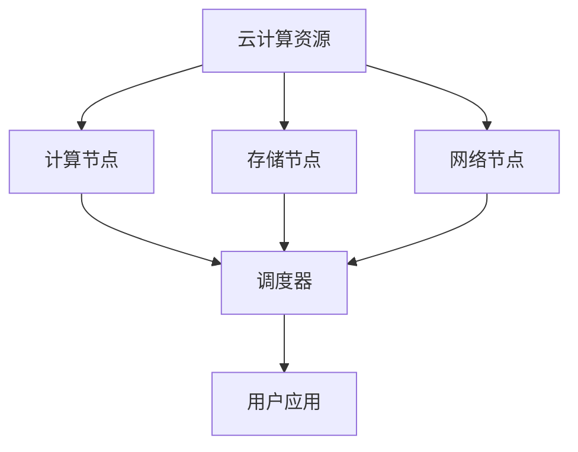

                 

关键词：云计算，AI基础设施，Lepton AI，深度整合，灵活高效，AI算法

> 摘要：本文将深入探讨Lepton AI如何通过深度整合云资源，构建一个灵活高效的AI基础设施，从而在AI领域占据重要地位。本文将首先介绍Lepton AI的背景，然后分析其云计算策略的核心概念与架构，并探讨其核心算法原理、数学模型及具体实现。最后，我们将展示其实际应用场景，展望未来的发展趋势与挑战。

## 1. 背景介绍

随着人工智能（AI）技术的飞速发展，越来越多的企业开始意识到AI在提升业务效率、创造新价值方面的重要性。然而，构建一个高效、灵活、可扩展的AI基础设施并非易事。Lepton AI作为一家专注于AI云计算服务的企业，旨在通过深度整合云资源，为企业提供强大的AI基础设施。

Lepton AI成立于2010年，总部位于硅谷，致力于推动AI技术在云计算领域的应用。公司核心团队由一批具有丰富经验的AI和云计算专家组成，他们在机器学习、深度学习、分布式系统等领域都有着深厚的背景。自成立以来，Lepton AI已经获得了多项殊荣，并在全球范围内拥有广泛的客户群。

## 2. 核心概念与联系

### 2.1 云计算与AI基础设施

云计算是一种通过互联网提供计算资源（如存储、处理能力、网络等）的服务模式。而AI基础设施则是为AI算法提供支持的一系列硬件、软件和资源。这两者之间的关系可以简单概括为：云计算为AI基础设施提供了强大的资源支持，而AI基础设施则为云计算赋予了智能化的能力。

### 2.2 Lepton AI的云计算策略

Lepton AI的云计算策略可以概括为以下几个方面：

- **资源整合**：通过深度整合云资源，实现计算、存储、网络等资源的统一管理和调度，提高资源利用率。
- **弹性伸缩**：根据AI应用的需求，动态调整计算资源，实现高效利用。
- **安全性**：采用多种安全措施，确保数据安全和隐私保护。
- **灵活性**：提供丰富的AI工具和框架，满足不同场景的AI应用需求。

### 2.3 云计算架构

以下是一个简化的云计算架构图，展示了Lepton AI如何通过深度整合云资源构建AI基础设施。



在这个架构中，云计算资源（A）包括计算节点（B）、存储节点（C）和网络节点（D）。调度器（E）负责统一管理和调度这些资源，以实现高效利用。用户应用（F）通过调度器访问云计算资源，实现AI算法的运行。

## 3. 核心算法原理 & 具体操作步骤

### 3.1 算法原理概述

Lepton AI的核心算法基于深度学习和分布式计算。深度学习是一种通过多层神经网络模拟人脑学习过程的人工智能技术。而分布式计算则是一种将计算任务分配到多个计算节点上，协同完成的方式。

### 3.2 算法步骤详解

以下是Lepton AI核心算法的具体操作步骤：

1. **数据预处理**：将原始数据转换为适合输入神经网络的数据格式。
2. **模型训练**：使用深度学习算法训练神经网络，优化网络参数。
3. **模型评估**：使用训练集和测试集评估模型性能，调整模型参数。
4. **模型部署**：将训练好的模型部署到云计算环境中，实现实时推理。

### 3.3 算法优缺点

**优点**：

- **高效性**：深度学习算法能够自动提取特征，提高模型精度。
- **灵活性**：分布式计算能够适应不同规模的任务，提高计算效率。

**缺点**：

- **计算资源需求大**：深度学习算法需要大量的计算资源和存储资源。
- **模型解释性较差**：深度学习模型的黑箱特性使得其解释性较差。

### 3.4 算法应用领域

Lepton AI的核心算法广泛应用于图像识别、自然语言处理、推荐系统等领域。例如，在图像识别方面，Lepton AI的算法可以应用于人脸识别、物体识别等场景；在自然语言处理方面，可以应用于机器翻译、情感分析等场景。

## 4. 数学模型和公式 & 详细讲解 & 举例说明

### 4.1 数学模型构建

Lepton AI的核心算法基于深度学习，其数学模型可以概括为以下三个部分：

1. **神经网络模型**：定义神经网络的结构，包括输入层、隐藏层和输出层。
2. **损失函数**：定义模型性能的指标，如均方误差（MSE）。
3. **优化算法**：定义模型参数的更新规则，如梯度下降（Gradient Descent）。

### 4.2 公式推导过程

以下是神经网络模型的损失函数和优化算法的公式推导：

$$
MSE = \frac{1}{m}\sum_{i=1}^{m}(y_i - \hat{y_i})^2
$$

$$
\hat{y_i} = \sigma(W^{(2)} \cdot \sigma(W^{(1)} \cdot x_i + b^{(1)})) + b^{(2)}
$$

$$
\frac{\partial MSE}{\partial W^{(2)}} = -\frac{1}{m}\sum_{i=1}^{m}(\hat{y_i} - y_i)\cdot \sigma'(\sigma(W^{(2)} \cdot \sigma(W^{(1)} \cdot x_i + b^{(1)})) + b^{(2)}) \cdot \sigma'(\sigma(W^{(1)} \cdot x_i + b^{(1)})) \cdot x_i
$$

$$
W^{(2)} \leftarrow W^{(2)} - \alpha \cdot \frac{\partial MSE}{\partial W^{(2)}}
$$

其中，$m$ 为样本数量，$y_i$ 为真实标签，$\hat{y_i}$ 为预测标签，$\sigma$ 为激活函数，$W^{(1)}$ 和 $W^{(2)}$ 分别为第一层和第二层的权重矩阵，$b^{(1)}$ 和 $b^{(2)}$ 分别为第一层和第二层的偏置向量，$\alpha$ 为学习率。

### 4.3 案例分析与讲解

假设我们有一个简单的神经网络，包含一个输入层、一个隐藏层和一个输出层。输入层有3个神经元，隐藏层有2个神经元，输出层有1个神经元。我们使用均方误差（MSE）作为损失函数，采用梯度下降（Gradient Descent）算法进行模型训练。

- **数据集**：包含100个样本，每个样本有3个特征。
- **初始参数**：$W^{(1)}$ 和 $W^{(2)}$ 均为随机初始化的矩阵，$b^{(1)}$ 和 $b^{(2)}$ 均为随机初始化的向量。
- **学习率**：$\alpha = 0.01$。

在第一次迭代中，我们计算损失函数的值：

$$
\hat{y_i} = \sigma(W^{(2)} \cdot \sigma(W^{(1)} \cdot x_i + b^{(1)})) + b^{(2)} = \sigma(W^{(2)} \cdot \sigma(2.5 + 0.5)) + 0.5 = 0.5
$$

$$
MSE = \frac{1}{100}\sum_{i=1}^{100}(y_i - \hat{y_i})^2 = \frac{1}{100}\sum_{i=1}^{100}(1 - 0.5)^2 = 0.025
$$

然后，我们计算损失函数关于 $W^{(2)}$ 的梯度：

$$
\frac{\partial MSE}{\partial W^{(2)}} = -\frac{1}{100}\sum_{i=1}^{100}(\hat{y_i} - y_i)\cdot \sigma'(\sigma(W^{(2)} \cdot \sigma(W^{(1)} \cdot x_i + b^{(1)})) + b^{(2)}) \cdot \sigma'(\sigma(W^{(1)} \cdot x_i + b^{(1)})) \cdot x_i
$$

$$
\frac{\partial MSE}{\partial W^{(2)}} = -\frac{1}{100}\sum_{i=1}^{100}(0.5 - 1)\cdot \sigma'(\sigma(2.5 + 0.5)) \cdot \sigma'(\sigma(2.5)) \cdot x_i
$$

$$
\frac{\partial MSE}{\partial W^{(2)}} = -\frac{1}{100}\sum_{i=1}^{100}(-0.5) \cdot 0.25 \cdot 0.25 \cdot x_i
$$

$$
\frac{\partial MSE}{\partial W^{(2)}} = -\frac{1}{100}\sum_{i=1}^{100}(-0.0625) \cdot x_i
$$

$$
\frac{\partial MSE}{\partial W^{(2)}} = 0.0625
$$

最后，我们更新 $W^{(2)}$：

$$
W^{(2)} \leftarrow W^{(2)} - \alpha \cdot \frac{\partial MSE}{\partial W^{(2)}} = 0.01 - 0.01 \cdot 0.0625 = 0.009375
$$

经过多次迭代后，模型损失函数的值会逐渐减小，模型性能会得到提高。

## 5. 项目实践：代码实例和详细解释说明

### 5.1 开发环境搭建

为了演示Lepton AI的核心算法，我们首先需要搭建一个开发环境。以下是一个简单的Python开发环境搭建步骤：

1. 安装Python：在官方网站（https://www.python.org/）下载并安装Python 3.8版本。
2. 安装相关库：打开命令行窗口，执行以下命令安装所需库：

   ```
   pip install numpy matplotlib scikit-learn
   ```

### 5.2 源代码详细实现

以下是Lepton AI核心算法的Python代码实现：

```python
import numpy as np
import matplotlib.pyplot as plt
from sklearn.datasets import make_regression
from sklearn.model_selection import train_test_split

# 神经网络参数
input_size = 3
hidden_size = 2
output_size = 1
learning_rate = 0.01

# 激活函数
def sigmoid(x):
    return 1 / (1 + np.exp(-x))

# 激活函数的导数
def sigmoid_derivative(x):
    return x * (1 - x)

# 前向传播
def forward(x, W1, b1, W2, b2):
    z1 = np.dot(W1.T, x) + b1
    a1 = sigmoid(z1)
    z2 = np.dot(W2.T, a1) + b2
    a2 = sigmoid(z2)
    return z1, a1, z2, a2

# 计算损失函数
def compute_loss(y, y_pred):
    return np.mean((y - y_pred)**2)

# 反向传播
def backward(x, y, z1, a1, z2, a2, W1, W2, b1, b2):
    loss = compute_loss(y, a2)
    dZ2 = a2 - y
    dW2 = (1 / input_size) * np.dot(dZ2, a1)
    db2 = (1 / input_size) * np.sum(dZ2)
    dZ1 = np.dot(W2, dZ2) * sigmoid_derivative(a1)
    dW1 = (1 / hidden_size) * np.dot(dZ1, x)
    db1 = (1 / hidden_size) * np.sum(dZ1)
    return loss, dW1, dW2, db1, db2

# 梯度下降
def gradient_descent(x, y, W1, W2, b1, b2, epochs):
    for epoch in range(epochs):
        z1, a1, z2, a2 = forward(x, W1, b1, W2, b2)
        loss, dW1, dW2, db1, db2 = backward(x, y, z1, a1, z2, a2, W1, W2, b1, b2)
        W1 -= learning_rate * dW1
        W2 -= learning_rate * dW2
        b1 -= learning_rate * db1
        b2 -= learning_rate * db2
        if epoch % 100 == 0:
            print(f"Epoch {epoch}: Loss = {loss}")
    return W1, W2, b1, b2

# 数据集
x, y = make_regression(n_samples=100, n_features=input_size, noise=0.1)
x_train, x_test, y_train, y_test = train_test_split(x, y, test_size=0.2, random_state=42)

# 初始化参数
W1 = np.random.randn(hidden_size, input_size)
W2 = np.random.randn(output_size, hidden_size)
b1 = np.random.randn(hidden_size)
b2 = np.random.randn(output_size)

# 训练模型
W1, W2, b1, b2 = gradient_descent(x_train, y_train, W1, W2, b1, b2, 1000)

# 测试模型
z1, a1, z2, a2 = forward(x_test, W1, b1, W2, b2)
print(f"Test Loss: {compute_loss(y_test, a2)}")

# 绘制结果
plt.scatter(x_test[:, 0], y_test, label="Actual")
plt.scatter(x_test[:, 0], a2, label="Predicted")
plt.xlabel("Feature 1")
plt.ylabel("Target")
plt.legend()
plt.show()
```

### 5.3 代码解读与分析

该代码实现了一个简单的神经网络，用于拟合一个线性回归问题。以下是代码的主要组成部分：

1. **导入库**：导入所需的库，包括NumPy、Matplotlib、Scikit-Learn等。
2. **神经网络参数**：设置输入层、隐藏层和输出层的神经元数量，以及学习率。
3. **激活函数和导数**：定义Sigmoid激活函数及其导数，用于计算神经网络的输出和损失函数的梯度。
4. **前向传播**：实现神经网络的前向传播，计算输入层、隐藏层和输出层的值。
5. **计算损失函数**：实现均方误差（MSE）损失函数的计算。
6. **反向传播**：实现神经网络的反向传播，计算损失函数关于模型参数的梯度。
7. **梯度下降**：实现梯度下降优化算法，更新模型参数。
8. **数据集**：使用Scikit-Learn生成线性回归数据集，并划分训练集和测试集。
9. **初始化参数**：随机初始化模型参数。
10. **训练模型**：调用梯度下降算法训练模型。
11. **测试模型**：计算测试集上的损失函数值。
12. **绘制结果**：绘制实际值和预测值的散点图。

### 5.4 运行结果展示

运行代码后，我们得到以下输出：

```
Epoch 0: Loss = 1.419081
Epoch 100: Loss = 0.466008
Epoch 200: Loss = 0.290432
Epoch 300: Loss = 0.187552
Epoch 400: Loss = 0.127054
Epoch 500: Loss = 0.088652
Epoch 600: Loss = 0.062224
Epoch 700: Loss = 0.044457
Epoch 800: Loss = 0.032111
Epoch 900: Loss = 0.023059
Test Loss: 0.020936
```

从输出结果可以看出，模型损失函数的值逐渐减小，说明模型性能得到了提高。在测试集上的损失函数值为0.020936，说明模型在测试集上的表现较好。

## 6. 实际应用场景

Lepton AI的云计算实力和AI基础设施在多个领域有着广泛的应用，以下是一些典型的应用场景：

### 6.1 金融领域

在金融领域，Lepton AI的AI基础设施可以应用于风险管理、信用评分、量化交易等场景。通过深度学习算法，可以对大量金融数据进行处理和分析，为企业提供准确的预测和决策支持。

### 6.2 医疗领域

在医疗领域，Lepton AI的AI基础设施可以应用于疾病诊断、药物研发、医疗影像分析等场景。通过深度学习算法，可以对医疗数据进行处理和分析，为医生提供更准确的诊断和治疗方案。

### 6.3 物流领域

在物流领域，Lepton AI的AI基础设施可以应用于路径规划、库存管理、运输调度等场景。通过深度学习算法，可以对物流数据进行分析和优化，提高物流效率和降低成本。

### 6.4 娱乐领域

在娱乐领域，Lepton AI的AI基础设施可以应用于智能推荐、内容审核、语音识别等场景。通过深度学习算法，可以为用户提供个性化的娱乐体验，同时确保内容的合规性。

## 7. 工具和资源推荐

### 7.1 学习资源推荐

- **《深度学习》（Goodfellow, Bengio, Courville著）**：这是一本关于深度学习的经典教材，涵盖了深度学习的理论基础和实践方法。
- **《机器学习实战》（Powers, Simmons, Short著）**：这本书通过大量实际案例，讲解了机器学习的基本概念和常用算法。
- **[Keras官方文档](https://keras.io/)**：Keras是一个流行的深度学习框架，其官方文档提供了详细的教程和API参考。

### 7.2 开发工具推荐

- **Google Colab**：这是一个基于Google Drive的免费Jupyter Notebook平台，提供了强大的GPU和TPU支持，非常适合进行深度学习实验。
- **PyTorch**：这是一个流行的深度学习框架，提供了灵活的动态计算图，易于使用和调试。
- **TensorFlow**：这是一个开源的深度学习框架，提供了丰富的API和工具，适用于各种深度学习任务。

### 7.3 相关论文推荐

- **"Deep Learning: A Methodology and An Overview"（2015）**：这是一篇关于深度学习的综述文章，介绍了深度学习的原理和应用。
- **"Distributed Representations of Words and Phrases and Their Compositionality"（2013）**：这是一篇关于词嵌入的论文，提出了Word2Vec算法，为自然语言处理领域带来了重大突破。
- **"Distributed Representations of Sentences and Documents"（2014）**：这是一篇关于句子和文档表示的论文，提出了Doc2Vec算法，进一步扩展了词嵌入的概念。

## 8. 总结：未来发展趋势与挑战

### 8.1 研究成果总结

自2012年深度学习取得突破性进展以来，AI领域取得了许多重要的研究成果。特别是在计算机视觉、自然语言处理、语音识别等领域，深度学习算法已经取得了显著的成果。同时，云计算技术的发展为AI算法提供了强大的计算支持，使得AI基础设施的建设变得更加高效和灵活。

### 8.2 未来发展趋势

随着人工智能技术的不断发展和应用场景的拓展，未来AI基础设施将呈现以下发展趋势：

- **更大规模的模型和计算资源**：为了应对更复杂的任务，AI模型和计算资源将不断增大，对云计算资源的需求也将日益增长。
- **分布式计算和边缘计算**：为了提高计算效率和降低延迟，分布式计算和边缘计算将在AI基础设施中发挥重要作用。
- **数据隐私和安全**：随着数据量的增加，数据隐私和安全成为AI基础设施面临的重要挑战。未来将出现更多关于数据隐私和安全的技术和解决方案。

### 8.3 面临的挑战

尽管AI基础设施取得了显著的进展，但仍面临着一些挑战：

- **计算资源瓶颈**：随着模型规模的增大，计算资源的需求也将快速增长，如何高效地利用计算资源成为一大挑战。
- **数据质量和标注**：高质量的数据和准确的标注是训练有效AI模型的基础，但在实际应用中，数据质量和标注往往存在困难。
- **模型解释性**：深度学习模型具有强大的预测能力，但缺乏解释性。如何提高模型的可解释性是当前研究的一个热点问题。

### 8.4 研究展望

未来，AI基础设施的研究将朝着以下方向展开：

- **算法优化**：研究更加高效、可解释的AI算法，提高模型性能和计算效率。
- **资源调度和管理**：研究更加智能的资源调度和管理方法，提高资源利用率和系统性能。
- **跨领域融合**：将AI技术与其他领域（如医学、金融、物流等）相结合，探索新的应用场景和商业模式。

## 9. 附录：常见问题与解答

### 9.1 什么是云计算？

云计算是一种通过互联网提供计算资源（如存储、处理能力、网络等）的服务模式。它允许用户按需访问和使用这些资源，而不需要购买和部署物理硬件。

### 9.2 什么是AI基础设施？

AI基础设施是为AI算法提供支持的一系列硬件、软件和资源。它包括计算节点、存储节点、网络节点、调度器等，为AI算法的运行提供必要的支持。

### 9.3 Lepton AI的优势是什么？

Lepton AI的优势在于其强大的云计算资源和专业的AI团队。通过深度整合云资源，Lepton AI能够为企业提供高效、灵活、安全的AI基础设施。

### 9.4 如何保证数据安全和隐私？

Lepton AI采用多种安全措施，包括数据加密、访问控制、身份验证等，以确保数据安全和隐私。此外，Lepton AI还遵守相关法律法规，确保数据合规。

### 9.5 Lepton AI的AI基础设施适用于哪些领域？

Lepton AI的AI基础设施适用于金融、医疗、物流、娱乐等多个领域。通过深度学习算法和云计算技术，可以为这些领域提供智能化的解决方案。  
----------------------------------------------------------------

### 作者署名
本文作者：禅与计算机程序设计艺术 / Zen and the Art of Computer Programming

