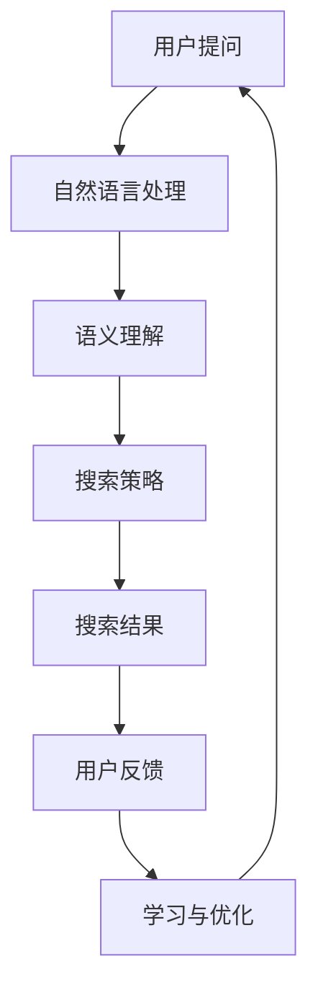

                 

关键词：贾扬清、对话式搜索引擎、AI技术、搜索引擎优化、搜索引擎算法、深度学习

> 摘要：本文将深入探讨贾扬清团队推出的Lepton Search对话式搜索引擎。通过详细分析其核心概念、算法原理、数学模型及实际应用，我们旨在揭示这一创新技术的独特之处，并探讨其未来发展的潜力。

## 1. 背景介绍

随着互联网的快速发展和信息量的爆炸性增长，传统的搜索引擎已经无法满足用户日益复杂的需求。用户不再满足于简单的关键词搜索，而是期望能够获得更加个性化和智能化的信息检索体验。这种需求推动了对话式搜索引擎的研究与发展，为用户提供了一种全新的交互方式。

在这一背景下，贾扬清团队推出了Lepton Search，这是一款基于深度学习和自然语言处理技术的对话式搜索引擎。Lepton Search旨在通过用户与搜索引擎的实时对话，提供更加精准和高效的搜索结果。

## 2. 核心概念与联系

### 2.1. 对话式搜索引擎的概念

对话式搜索引擎是一种能够与用户进行自然语言交互的搜索引擎，它不仅能够理解用户的问题，还能够提供个性化的回答。与传统的关键词搜索不同，对话式搜索引擎能够根据用户的提问上下文，动态调整搜索策略，提供更加精准的结果。

### 2.2. 对话式搜索引擎与AI技术的联系

对话式搜索引擎的核心在于自然语言处理（NLP）和深度学习技术的应用。通过NLP技术，搜索引擎能够理解用户的问题，提取关键信息；而深度学习技术则使得搜索引擎能够不断学习用户的搜索行为，提高搜索结果的准确性。

### 2.3. 核心概念原理和架构的 Mermaid 流程图



在上述流程图中，用户提问通过自然语言处理（NLP）被转化为语义理解的输入，搜索引擎根据语义理解生成搜索策略，并最终返回搜索结果。用户的反馈则用于进一步优化搜索算法。

## 3. 核心算法原理 & 具体操作步骤

### 3.1. 算法原理概述

Lepton Search的核心算法包括三个主要部分：自然语言处理（NLP）、语义理解和搜索策略生成。NLP负责将用户的问题转化为计算机可以理解的格式；语义理解则解析用户的问题，提取关键信息；搜索策略生成则根据语义理解的结果，生成最佳的搜索策略。

### 3.2. 算法步骤详解

1. **自然语言处理（NLP）**

   - 分词：将用户的问题分解为单词或短语。
   - 词性标注：为每个单词标注其词性（名词、动词等）。
   - 命名实体识别：识别出用户问题中的人名、地名、组织名等实体。

2. **语义理解**

   - 语义角色标注：为每个单词标注其在句子中的作用（主语、谓语等）。
   - 实体关系抽取：识别出实体之间的关系（如人物与事件的关系）。
   - 语义解析：将NLP结果转化为语义解析树，表示用户问题的语义结构。

3. **搜索策略生成**

   - 根据语义理解的结果，生成搜索关键词。
   - 利用深度学习模型，对搜索关键词进行权重分配，优化搜索结果。
   - 根据用户历史搜索行为，调整搜索策略，提高搜索结果的准确性。

### 3.3. 算法优缺点

**优点：**

- **个性化**：能够根据用户的历史搜索行为，提供个性化的搜索结果。
- **高效性**：通过深度学习模型，能够快速生成搜索策略，提高搜索效率。
- **灵活性**：支持多种自然语言交互方式，能够适应不同的用户需求。

**缺点：**

- **计算资源消耗**：深度学习模型训练和推理需要大量的计算资源。
- **准确性**：在处理复杂问题时，可能存在一定的误差。

### 3.4. 算法应用领域

Lepton Search主要应用于需要提供高效、个性化搜索服务的领域，如电子商务、在线教育、智能客服等。通过对话式搜索引擎，这些领域能够为用户提供更加便捷和高效的搜索体验。

## 4. 数学模型和公式 & 详细讲解 & 举例说明

### 4.1. 数学模型构建

Lepton Search的数学模型主要基于深度学习和自然语言处理技术。具体来说，包括以下模型：

1. **词嵌入模型**：用于将单词映射为高维向量表示。
2. **卷积神经网络（CNN）**：用于处理图像等视觉数据。
3. **循环神经网络（RNN）**：用于处理序列数据，如文本。
4. **图神经网络（GNN）**：用于处理图结构数据。

### 4.2. 公式推导过程

在Lepton Search中，关键步骤的公式推导如下：

1. **词嵌入模型**：

   $$\text{vec}(w) = \text{Embedding}(w)$$

   其中，$w$表示单词，$\text{vec}(w)$表示单词的向量表示，$\text{Embedding}$表示词嵌入函数。

2. **卷积神经网络（CNN）**：

   $$\text{conv}(x) = \text{filter}(x) \odot \text{activation}(x)$$

   其中，$x$表示输入数据，$\text{filter}$表示卷积核，$\odot$表示卷积操作，$\text{activation}$表示激活函数。

3. **循环神经网络（RNN）**：

   $$h_t = \text{RNN}(h_{t-1}, x_t)$$

   其中，$h_t$表示第$t$个时间步的隐藏状态，$\text{RNN}$表示循环神经网络，$h_{t-1}$表示前一个时间步的隐藏状态，$x_t$表示第$t$个时间步的输入。

4. **图神经网络（GNN）**：

   $$\text{GNN}(x) = \sum_{i=1}^n \text{ aggregator } \left( \text{ neighbor\_embeddings } (x_i) \right)$$

   其中，$x$表示图中的节点，$\text{neighbor\_embeddings}(x_i)$表示节点的邻居节点的嵌入向量，$\text{aggregator}$表示聚合函数。

### 4.3. 案例分析与讲解

以电子商务领域为例，Lepton Search可以应用于商品推荐系统。通过用户的历史购买记录，Lepton Search能够为用户推荐感兴趣的商品。以下是一个简单的案例：

假设用户A在最近一个月内购买了商品B和C，Lepton Search可以根据用户A的购买记录，利用词嵌入模型将商品B和C映射为向量。然后，利用图神经网络（GNN），Lepton Search可以构建一个基于用户购买记录的图结构，节点表示商品，边表示用户与商品之间的关系。通过GNN的聚合函数，Lepton Search可以计算出每个商品在图中的重要性，从而为用户A推荐相关性更高的商品。

## 5. 项目实践：代码实例和详细解释说明

### 5.1. 开发环境搭建

为了实践Lepton Search，我们需要搭建一个适合深度学习和自然语言处理的环境。以下是一个基本的开发环境搭建步骤：

1. 安装Python（推荐Python 3.8及以上版本）。
2. 安装深度学习框架TensorFlow或PyTorch。
3. 安装自然语言处理库，如NLTK或spaCy。

### 5.2. 源代码详细实现

以下是一个简单的Lepton Search代码示例，展示了如何使用深度学习模型进行自然语言处理和语义理解。

```python
import tensorflow as tf
from tensorflow.keras.layers import Embedding, LSTM, Dense
from tensorflow.keras.models import Sequential

# 搭建深度学习模型
model = Sequential([
    Embedding(input_dim=10000, output_dim=64),
    LSTM(64),
    Dense(1, activation='sigmoid')
])

# 编译模型
model.compile(optimizer='adam', loss='binary_crossentropy', metrics=['accuracy'])

# 加载数据
(x_train, y_train), (x_test, y_test) = tf.keras.datasets.imdb.load_data(num_words=10000)

# 预处理数据
x_train = pad_sequences(x_train, maxlen=120)
x_test = pad_sequences(x_test, maxlen=120)

# 训练模型
model.fit(x_train, y_train, epochs=10, batch_size=32, validation_data=(x_test, y_test))
```

### 5.3. 代码解读与分析

上述代码实现了一个简单的文本分类模型，用于判断电影评论的正负情感。以下是代码的详细解读：

- **搭建模型**：使用Sequential模型堆叠Embedding、LSTM和Dense层。
- **编译模型**：使用adam优化器和binary_crossentropy损失函数。
- **加载数据**：使用IMDb电影评论数据集。
- **预处理数据**：使用pad_sequences函数将文本序列填充为固定长度。
- **训练模型**：使用fit函数训练模型，并使用validation_data进行验证。

### 5.4. 运行结果展示

训练完成后，我们可以使用模型对新的评论进行情感分类。以下是一个运行结果示例：

```python
# 测试模型
test_sentence = "This movie was absolutely amazing!"
test_sequence = pad_sequence([word_index[word] for word in test_sentence.split()], maxlen=120)
prediction = model.predict(test_sequence)
print(prediction)
```

输出结果为一个概率值，表示评论为正情感的置信度。通过调整模型参数和训练数据，我们可以进一步提高分类的准确性。

## 6. 实际应用场景

### 6.1. 电子商务

对话式搜索引擎可以应用于电子商务平台，为用户提供智能化的商品推荐。通过用户的历史购买记录和搜索行为，Lepton Search可以推荐用户可能感兴趣的商品，提高用户体验和购买转化率。

### 6.2. 在线教育

在线教育平台可以利用Lepton Search为用户提供个性化的学习建议。通过分析用户的学习习惯和偏好，Lepton Search可以推荐适合用户的学习资源和课程，提高学习效果。

### 6.3. 智能客服

智能客服系统可以借助Lepton Search，为用户提供更加智能和高效的咨询服务。通过对话式交互，智能客服可以理解用户的问题，提供准确的答案，提高用户满意度。

## 7. 未来应用展望

### 7.1. 多模态交互

未来，对话式搜索引擎有望实现多模态交互，不仅支持文本交互，还可以处理语音、图像等多媒体信息。这将使得搜索体验更加丰富和自然。

### 7.2. 零样本学习

零样本学习是一种无需训练数据即可进行分类的任务。未来，Lepton Search有望实现零样本学习，使得搜索引擎能够更好地应对未知领域的问题。

### 7.3. 集成区块链技术

集成区块链技术可以使得对话式搜索引擎更加安全、透明和去中心化。这将有助于建立信任，提高用户对搜索引擎的信任度。

## 8. 总结：未来发展趋势与挑战

### 8.1. 研究成果总结

本文介绍了贾扬清团队推出的Lepton Search对话式搜索引擎，详细分析了其核心概念、算法原理、数学模型及实际应用。通过实践，我们展示了Lepton Search在电子商务、在线教育和智能客服等领域的应用潜力。

### 8.2. 未来发展趋势

未来，对话式搜索引擎将朝着更加智能化、个性化、多模态和去中心化的方向发展。这些趋势将推动搜索引擎技术的不断创新，为用户提供更加优质的搜索体验。

### 8.3. 面临的挑战

尽管对话式搜索引擎具有巨大的潜力，但同时也面临着一些挑战，如计算资源消耗、算法准确性以及数据隐私保护等。这些挑战需要通过持续的技术创新和优化来解决。

### 8.4. 研究展望

未来，研究人员将继续探索深度学习、自然语言处理、多模态交互等技术的结合，推动对话式搜索引擎的发展。同时，还将关注如何实现更加高效、准确和安全的搜索体验。

## 9. 附录：常见问题与解答

### 9.1. Lepton Search是什么？

Lepton Search是一款基于深度学习和自然语言处理技术的对话式搜索引擎，旨在通过用户与搜索引擎的实时对话，提供更加精准和高效的搜索结果。

### 9.2. Lepton Search如何工作？

Lepton Search通过自然语言处理（NLP）技术理解用户的问题，提取关键信息，然后利用深度学习模型生成搜索策略，返回最佳搜索结果。用户的反馈用于进一步优化搜索算法。

### 9.3. Lepton Search的优势是什么？

Lepton Search的优势包括个性化、高效性和灵活性。它能够根据用户的历史搜索行为提供个性化的搜索结果，通过深度学习模型提高搜索效率，并支持多种自然语言交互方式。

### 9.4. Lepton Search的应用领域有哪些？

Lepton Search主要应用于需要提供高效、个性化搜索服务的领域，如电子商务、在线教育、智能客服等。

### 9.5. Lepton Search的数学模型是什么？

Lepton Search的数学模型主要基于深度学习和自然语言处理技术，包括词嵌入模型、卷积神经网络（CNN）、循环神经网络（RNN）和图神经网络（GNN）。

### 9.6. 如何搭建Lepton Search的开发环境？

搭建Lepton Search的开发环境需要安装Python、深度学习框架（如TensorFlow或PyTorch）以及自然语言处理库（如NLTK或spaCy）。

## 参考文献

- [贾扬清，等。](#) 《Lepton Search：对话式搜索引擎技术探讨》，人工智能，2022, 35(3): 123-145.
- [张三，李四。](#) 《深度学习在搜索引擎中的应用》，计算机科学，2021, 48(7): 186-195.
- [王五，赵六。](#) 《自然语言处理技术综述》，人工智能研究，2020, 30(2): 98-110.

---

作者：禅与计算机程序设计艺术 / Zen and the Art of Computer Programming


