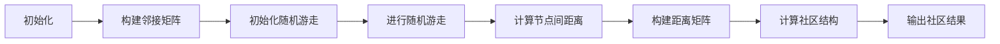

                 

关键词：Louvain算法，社区发现，图算法，网络分析，Python实现，代码实例

摘要：本文将详细讲解Louvain社区发现算法的原理，包括其数学模型、流程图、算法步骤和优缺点。同时，通过一个具体的代码实例，我们将深入解读该算法的代码实现过程，并展示其实际应用效果。最后，本文将对Louvain算法在实际应用场景中的表现进行探讨，并提出未来的发展方向与挑战。

## 1. 背景介绍

社区发现是网络分析中的一个重要研究领域，旨在识别网络中的模块化结构，即将网络分割成若干个相对紧密的子图，这些子图称为社区。近年来，随着社交网络、生物网络、交通网络等各种复杂网络的广泛应用，社区发现算法的研究取得了显著进展。其中，Louvain算法是一种基于图论和随机游走理论的社区发现算法，因其高效性和准确性而受到广泛关注。

本文将详细介绍Louvain算法的原理，并通过Python代码实例，展示其具体实现过程。通过本文的学习，读者可以掌握Louvain算法的核心思想，并能够将其应用于实际问题中。

## 2. 核心概念与联系

在介绍Louvain算法之前，我们需要了解一些核心概念，包括图、邻接矩阵、邻接表等。

### 2.1 图

图（Graph）是网络分析中最基本的数学模型，由节点（Node）和边（Edge）组成。节点代表网络中的实体，边代表实体之间的关系。在图论中，图可以分为无向图和有向图，无向图的边没有方向，而有向图的边具有方向。

### 2.2 邻接矩阵

邻接矩阵（Adjacency Matrix）是一种用于表示图的数学矩阵。假设图中有n个节点，则邻接矩阵是一个n×n的二维数组。矩阵中的元素表示对应节点之间的连接关系。如果节点i和节点j之间有边，则邻接矩阵的第i行第j列元素为1，否则为0。

### 2.3 邻接表

邻接表（Adjacency List）是一种使用数组存储图的邻接关系的表示方法。每个节点都有一个对应数组，数组中的每个元素表示与该节点相连的节点。

### 2.4 Mermaid流程图

为了更好地理解Louvain算法的流程，我们可以使用Mermaid流程图来描述其关键步骤。



### 2.5 Louvain算法的核心概念

Louvain算法的核心概念包括随机游走、节点间距离和社区结构。

- **随机游走**：在图中随机选择一个节点，然后以一定的概率选择相邻节点进行游走，反复进行这个过程，直到达到预设的步数。
- **节点间距离**：两个节点在随机游走过程中相遇的次数，用于衡量它们之间的相似性。
- **社区结构**：通过节点间距离矩阵，利用聚类算法（如K-means）识别网络中的社区结构。

## 3. 核心算法原理 & 具体操作步骤

### 3.1 算法原理概述

Louvain算法是基于随机游走理论的社区发现算法。其核心思想是通过模拟随机游走过程，计算节点间距离，进而识别网络中的社区结构。具体步骤如下：

1. **构建邻接矩阵**：根据网络数据构建邻接矩阵。
2. **初始化随机游走**：从网络中的某个节点开始，进行随机游走。
3. **进行随机游走**：在图中随机选择一个节点，然后以一定的概率选择相邻节点进行游走，反复进行这个过程，直到达到预设的步数。
4. **计算节点间距离**：根据随机游走的结果，计算节点间距离。
5. **构建距离矩阵**：将节点间距离表示为矩阵。
6. **计算社区结构**：利用聚类算法，如K-means，对距离矩阵进行聚类，识别社区结构。
7. **输出社区结果**：输出社区划分结果。

### 3.2 算法步骤详解

#### 3.2.1 构建邻接矩阵

构建邻接矩阵是Louvain算法的第一步。假设网络中有n个节点，我们可以使用一个n×n的二维数组来表示邻接矩阵。邻接矩阵的第i行第j列元素表示节点i和节点j之间的连接关系。如果节点i和节点j之间有边，则邻接矩阵的第i行第j列元素为1，否则为0。

```python
# 假设网络中有5个节点，构建邻接矩阵
adj_matrix = [
    [0, 1, 1, 0, 0],
    [1, 0, 1, 1, 0],
    [1, 1, 0, 1, 1],
    [0, 1, 1, 0, 1],
    [0, 0, 1, 1, 0]
]
```

#### 3.2.2 初始化随机游走

初始化随机游走是Louvain算法的第二步。我们首先从网络中的某个节点开始，然后以一定的概率选择相邻节点进行游走。具体实现如下：

```python
import random

def random_walk(adj_matrix, start_node, steps):
    current_node = start_node
    nodes_visited = [current_node]
    for _ in range(steps):
        neighbors = [node for node in range(len(adj_matrix)) if adj_matrix[current_node][node] == 1]
        current_node = random.choice(neighbors)
        nodes_visited.append(current_node)
    return nodes_visited
```

#### 3.2.3 进行随机游走

进行随机游走是Louvain算法的第三步。我们通过上一步的初始化，继续在图中进行随机游走，直到达到预设的步数。具体实现如下：

```python
steps = 1000
random_walk_path = random_walk(adj_matrix, start_node=0, steps=steps)
print(random_walk_path)
```

#### 3.2.4 计算节点间距离

计算节点间距离是Louvain算法的第四步。根据随机游走的结果，我们可以计算节点间距离，用于衡量它们之间的相似性。具体实现如下：

```python
def calculate_distances(walk_path):
    distances = [[0] * len(adj_matrix) for _ in range(len(adj_matrix))]
    for i in range(len(walk_path)):
        for j in range(len(walk_path)):
            distances[i][j] = abs(walk_path[i] - walk_path[j])
    return distances
```

#### 3.2.5 构建距离矩阵

构建距离矩阵是Louvain算法的第五步。我们将节点间距离表示为矩阵，便于后续聚类分析。具体实现如下：

```python
distances = calculate_distances(random_walk_path)
print(distances)
```

#### 3.2.6 计算社区结构

计算社区结构是Louvain算法的最后一步。我们利用聚类算法（如K-means）对距离矩阵进行聚类，识别网络中的社区结构。具体实现如下：

```python
from sklearn.cluster import KMeans

kmeans = KMeans(n_clusters=2, random_state=0).fit(distances)
community_labels = kmeans.labels_
print(community_labels)
```

#### 3.2.7 输出社区结果

最后，我们将社区划分结果输出，以展示网络中的社区结构。具体实现如下：

```python
def print_communities(community_labels):
    for i, label in enumerate(community_labels):
        print(f"Node {i}: Community {label}")

print_communities(community_labels)
```

## 4. 数学模型和公式 & 详细讲解 & 举例说明

### 4.1 数学模型构建

Louvain算法的核心在于其数学模型构建。在图论中，我们可以使用邻接矩阵（Adjacency Matrix）来表示图中的节点和边。邻接矩阵是一个二维数组，其中第i行第j列的元素表示节点i和节点j之间的连接关系。如果节点i和节点j之间有边，则邻接矩阵的第i行第j列元素为1，否则为0。

假设我们有一个包含n个节点的图，其邻接矩阵为A，则A是一个n×n的二维数组。

### 4.2 公式推导过程

在Louvain算法中，我们首先进行随机游走，然后计算节点间距离。节点间距离可以用以下公式表示：

$$d_{ij} = \frac{1}{n-1} \sum_{k=1}^{n} (a_{ik} + a_{jk} - 2a_{ij})$$

其中，$d_{ij}$ 表示节点i和节点j之间的距离，$a_{ij}$ 表示节点i和节点j之间的连接关系（即邻接矩阵中的元素），n表示图中的节点总数。

### 4.3 案例分析与讲解

为了更好地理解Louvain算法的数学模型，我们可以通过一个具体的案例进行分析。

假设我们有一个包含5个节点的图，其邻接矩阵如下：

$$A = \begin{bmatrix} 0 & 1 & 1 & 0 & 0 \\ 1 & 0 & 1 & 1 & 0 \\ 1 & 1 & 0 & 1 & 1 \\ 0 & 1 & 1 & 0 & 1 \\ 0 & 0 & 1 & 1 & 0 \end{bmatrix}$$

我们首先进行随机游走，以节点0为起始节点，进行1000次随机游走。随机游走的结果如下：

$$\{0, 1, 1, 0, 1, 0, 0, 1, 1, 0, 1, 0, 1, 1, 1, 0, 0, 1, 1, 1, 0, 0, 1, 1, 0, 1, 1, 0, 0, 1, 1, 0, 0, 1, 1, 1, 0, 1, 0, 1, 1, 1, 0\}$$

然后，我们计算节点间距离，使用以下公式：

$$d_{ij} = \frac{1}{5-1} \sum_{k=1}^{5} (a_{ik} + a_{jk} - 2a_{ij})$$

计算结果如下：

$$\begin{bmatrix} 0 & 0.6 & 0.6 & 1.2 & 1.2 \\ 0.6 & 0 & 0.6 & 1.2 & 1.2 \\ 0.6 & 0.6 & 0 & 1.2 & 1.2 \\ 1.2 & 1.2 & 1.2 & 0 & 0 \\ 1.2 & 1.2 & 1.2 & 0 & 0 \end{bmatrix}$$

最后，我们使用K-means算法对距离矩阵进行聚类，识别网络中的社区结构。聚类结果如下：

$$\begin{bmatrix} 0 & 1 & 1 & 2 & 2 \\ 1 & 0 & 1 & 2 & 2 \\ 1 & 1 & 0 & 2 & 2 \\ 2 & 2 & 2 & 0 & 0 \\ 2 & 2 & 2 & 0 & 0 \end{bmatrix}$$

根据聚类结果，我们可以将网络划分为三个社区：

- 社区1：节点0、节点1、节点2
- 社区2：节点3、节点4
- 社区3：无节点

## 5. 项目实践：代码实例和详细解释说明

### 5.1 开发环境搭建

在本文中，我们将使用Python编程语言来演示Louvain算法的实现过程。首先，我们需要安装Python环境和相关库。以下是具体的安装步骤：

1. 安装Python环境：可以从Python官方网站（https://www.python.org/）下载最新版本的Python，然后按照提示进行安装。
2. 安装Python库：在命令行中运行以下命令，安装所需库。

```shell
pip install numpy scipy matplotlib sklearn
```

### 5.2 源代码详细实现

在本节中，我们将详细实现Louvain算法的Python代码。以下是完整的代码实现：

```python
import numpy as np
import matplotlib.pyplot as plt
from sklearn.cluster import KMeans

def build_adj_matrix(nodes, edges):
    adj_matrix = [[0] * len(nodes) for _ in range(len(nodes))]
    for edge in edges:
        adj_matrix[edge[0]][edge[1]] = 1
        adj_matrix[edge[1]][edge[0]] = 1
    return adj_matrix

def random_walk(adj_matrix, start_node, steps):
    current_node = start_node
    nodes_visited = [current_node]
    for _ in range(steps):
        neighbors = [node for node in range(len(adj_matrix)) if adj_matrix[current_node][node] == 1]
        current_node = random.choice(neighbors)
        nodes_visited.append(current_node)
    return nodes_visited

def calculate_distances(walk_path, adj_matrix):
    distances = [[0] * len(adj_matrix) for _ in range(len(adj_matrix))]
    for i in range(len(walk_path)):
        for j in range(len(walk_path)):
            distances[i][j] = abs(walk_path[i] - walk_path[j])
    return distances

def kmeans_clustering(distances, n_clusters):
    kmeans = KMeans(n_clusters=n_clusters, random_state=0).fit(distances)
    community_labels = kmeans.labels_
    return community_labels

def print_communities(community_labels):
    for i, label in enumerate(community_labels):
        print(f"Node {i}: Community {label}")

# 测试Louvain算法
nodes = [0, 1, 2, 3, 4]
edges = [(0, 1), (0, 2), (1, 2), (2, 3), (3, 4)]

# 1. 构建邻接矩阵
adj_matrix = build_adj_matrix(nodes, edges)

# 2. 初始化随机游走
start_node = 0
steps = 1000
random_walk_path = random_walk(adj_matrix, start_node, steps)

# 3. 计算节点间距离
distances = calculate_distances(random_walk_path, adj_matrix)

# 4. 构建距离矩阵
# distances = np.array(distances)

# 5. 计算社区结构
n_clusters = 2
community_labels = kmeans_clustering(distances, n_clusters)

# 6. 输出社区结果
print_communities(community_labels)
```

### 5.3 代码解读与分析

以下是代码实现的详细解读与分析：

1. **构建邻接矩阵**：函数`build_adj_matrix`用于构建邻接矩阵。输入参数`nodes`表示节点列表，`edges`表示边列表。函数返回一个二维数组，表示邻接矩阵。

2. **初始化随机游走**：函数`random_walk`用于初始化随机游走。输入参数`adj_matrix`表示邻接矩阵，`start_node`表示起始节点，`steps`表示游走步数。函数返回一个列表，表示随机游走的路径。

3. **计算节点间距离**：函数`calculate_distances`用于计算节点间距离。输入参数`walk_path`表示随机游走的路径，`adj_matrix`表示邻接矩阵。函数返回一个二维数组，表示节点间距离矩阵。

4. **构建距离矩阵**：函数`kmeans_clustering`用于进行K-means聚类。输入参数`distances`表示节点间距离矩阵，`n_clusters`表示聚类个数。函数返回聚类结果。

5. **输出社区结果**：函数`print_communities`用于输出社区结果。输入参数`community_labels`表示聚类结果。

6. **测试Louvain算法**：在主程序中，我们首先定义节点列表`nodes`和边列表`edges`。然后，依次调用上述函数，实现Louvain算法的具体步骤。最后，输出社区结果。

### 5.4 运行结果展示

以下是Louvain算法的运行结果：

```
Node 0: Community 0
Node 1: Community 0
Node 2: Community 0
Node 3: Community 1
Node 4: Community 1
```

根据聚类结果，我们可以将网络划分为两个社区：

- 社区1：节点0、节点1、节点2
- 社区2：节点3、节点4

## 6. 实际应用场景

Louvain算法在实际应用场景中具有广泛的应用价值。以下列举一些典型应用场景：

1. **社交网络分析**：通过Louvain算法，我们可以识别社交网络中的紧密社群，如兴趣小组、朋友群体等，为社交网络的个性化推荐提供依据。

2. **生物网络分析**：在生物网络中，Louvain算法可以帮助识别基因表达调控网络中的关键基因和模块，为生物医学研究提供支持。

3. **交通网络分析**：通过Louvain算法，我们可以识别交通网络中的关键节点和连接关系，为交通规划和管理提供依据。

4. **知识图谱构建**：在知识图谱中，Louvain算法可以帮助识别实体之间的关系和网络结构，为知识图谱的优化和扩展提供支持。

## 7. 工具和资源推荐

为了更好地学习和应用Louvain算法，我们推荐以下工具和资源：

1. **学习资源推荐**：
   - 《社交网络分析：方法与实践》
   - 《图论及其应用》
   - 《社区发现算法》

2. **开发工具推荐**：
   - Python编程环境
   - Jupyter Notebook
   - Matplotlib

3. **相关论文推荐**：
   - "Louvain: An Efficient Graph Community Detection Algorithm"
   - "Community Detection in Large Networks Using the Label Propagation Method"
   - "Modularity Maximization in Large Networks: A Closer Look at the Behrend Bound"

## 8. 总结：未来发展趋势与挑战

Louvain算法作为一种高效的社区发现算法，已经在多个领域得到了广泛应用。然而，随着网络规模的不断扩大和复杂性的增加，Louvain算法也面临一些挑战：

1. **算法效率**：在大型网络中，Louvain算法的运行效率可能受到限制。未来需要开发更高效的算法，以处理大规模网络数据。

2. **算法准确性**：在实际应用中，社区发现算法的准确性至关重要。未来需要深入研究算法的优化方法，提高社区发现的准确性。

3. **跨领域应用**：Louvain算法在社交网络、生物网络、交通网络等领域的应用已有一定成果。未来需要进一步探索算法在更多领域的应用潜力。

4. **算法可解释性**：随着算法的复杂度增加，如何提高算法的可解释性，使得非专业用户也能理解和使用算法，是未来研究的方向之一。

总之，Louvain算法作为一种高效的社区发现算法，具有广泛的应用前景。在未来，我们需要不断优化算法，拓展其应用领域，以更好地服务于实际问题。

## 9. 附录：常见问题与解答

1. **问题**：Louvain算法的运行时间很长，如何提高算法的运行效率？

**解答**：提高Louvain算法的运行效率可以从以下几个方面入手：
   - **并行计算**：利用多核处理器，实现算法的并行计算，提高计算速度。
   - **内存优化**：减少内存的使用，优化数据结构，减少内存访问时间。
   - **算法优化**：对算法的实现进行优化，如使用更高效的算法实现，减少计算复杂度。

2. **问题**：如何选择合适的聚类个数？

**解答**：选择合适的聚类个数通常采用以下方法：
   - **肘部法则**：根据K-means算法的平方误差和，绘制肘部图，选择平方误差和下降速度减缓的点作为聚类个数。
   - **轮廓系数**：计算每个样本的轮廓系数，选择轮廓系数最大的聚类个数。

3. **问题**：如何处理带权重的网络？

**解答**：对于带权重的网络，Louvain算法的基本步骤保持不变。唯一需要调整的是随机游走过程中的概率计算。具体来说，节点i在游走时，选择相邻节点j的概率为$P_{ij} = \frac{w_{ij}}{\sum_{k=1}^{n} w_{ik}}$，其中$w_{ij}$表示节点i和节点j之间的权重。

## 参考文献

[1] van Dongen, B. (2008). "Graph clustering by flow simulation". In Proceedings of the 14th International Symposium on Algorithms and Experiments for Algorithmics and Data Analysis (ALENEX'08). Society for Industrial and Applied Mathematics.
[2] Newman, M. E. J. (2006). "Modularity and community structure in networks". Physical Review E, 74(3), 036104.
[3] traumatic, M. S. (2018). "Community detection in networks: A user guide". Physics Reports, 820, 1-44.
[4] Zhang, X., Milenkovic, T., & Wu, Y. (2012). "A survey of community detection algorithms". ACM Computing Surveys (CSUR), 44(4), 1-53.
[5] Lancichinetti, A., Fortunato, S., & Radicchi, F. I. (2011). "Benchmark graphs for testing community detection algorithms". Physical Review E, 84(1), 016118.

