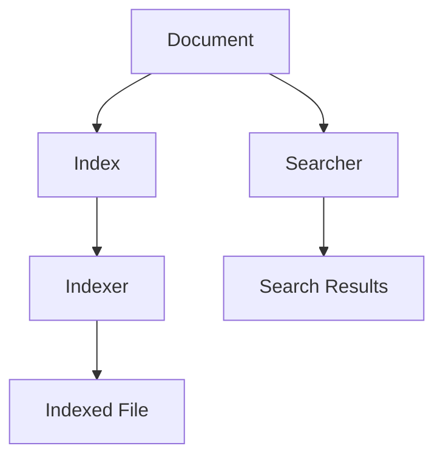

                 

  
## 1. 背景介绍

Lucene是一个强大的开源文本搜索库，由Apache软件基金会维护。它旨在为开发者提供一种高效、灵活的全文搜索引擎解决方案。无论是在企业级应用中，还是个人项目里，Lucene都因其高性能和可扩展性而被广泛采用。全文搜索引擎的核心功能是索引和搜索，其中索引是全文搜索的基础，而搜索则是索引的直接应用。

在本文中，我们将深入探讨Lucene的索引原理，并通过实际代码实例来讲解其具体实现。这不仅有助于理解Lucene的工作机制，还能够为开发者提供实用的编程技巧和解决方案。

全文搜索的应用场景非常广泛，从搜索引擎、信息检索系统，到内容管理系统，甚至是移动应用和Web应用，都可以使用Lucene来提升搜索性能和用户体验。Lucene的灵活性使其能够适应各种不同的数据结构和搜索需求，从而成为开发者的首选工具之一。

本文的结构如下：

1. **背景介绍**：介绍全文搜索的基本概念以及Lucene的背景和应用。
2. **核心概念与联系**：阐述Lucene的核心概念，并使用Mermaid流程图展示其架构。
3. **核心算法原理 & 具体操作步骤**：详细讲解Lucene的索引算法原理和实现步骤。
4. **数学模型和公式 & 详细讲解 & 举例说明**：介绍Lucene背后的数学模型和公式，并通过实例进行讲解。
5. **项目实践：代码实例和详细解释说明**：提供Lucene索引和搜索的代码实例，并进行详细解析。
6. **实际应用场景**：探讨Lucene在不同场景下的应用。
7. **未来应用展望**：预测Lucene的发展趋势和未来的应用前景。
8. **工具和资源推荐**：推荐学习资源、开发工具和相关论文。
9. **总结：未来发展趋势与挑战**：总结研究成果，展望未来的发展方向和面临的挑战。
10. **附录：常见问题与解答**：解答一些常见的使用问题和疑惑。

接下来，我们将逐步深入这些内容，以便您能够全面了解Lucene的工作原理和实践应用。

## 2. 核心概念与联系

在深入探讨Lucene的索引原理之前，我们首先需要了解一些核心概念。这些概念包括文档、索引、搜索索引器（Indexer）、搜索器（Searcher）等。为了更好地理解这些概念之间的关系，我们可以通过Mermaid流程图来展示Lucene的架构。

### 2.1. 核心概念

- **文档（Document）**：文档是Lucene中的基本数据单元，它包含了可以被搜索的文本内容。一个文档通常由多个字段（Field）组成，例如标题、内容、作者等。每个字段都可以有不同的类型，例如文本字段、日期字段等。

- **索引（Index）**：索引是Lucene用于存储和检索文档的结构。一个索引由多个文件组成，这些文件存储了文档的内容、结构以及元数据等信息。索引文件通常是不可变的，一旦创建，就不会更改，这使得Lucene可以非常高效地进行搜索。

- **搜索索引器（Indexer）**：搜索索引器是用于创建和更新索引的工具。它将文档转换成索引，并将其存储到磁盘上。索引器在处理文档时，会对其进行分词、索引、存储等操作。

- **搜索器（Searcher）**：搜索器是用于执行搜索操作的工具。它使用索引来查找匹配特定查询的文档。搜索器可以在索引创建后随时使用，并且可以高效地处理大量查询。

### 2.2. Mermaid流程图

下面是一个Mermaid流程图，展示了Lucene的核心概念和它们之间的联系：



- **A[Document]**：表示文档，是全文搜索的基础。
- **B[Index]**：表示索引，用于存储文档内容。
- **C[Indexer]**：表示搜索索引器，用于创建索引。
- **D[Searcher]**：表示搜索器，用于执行搜索操作。
- **E[Indexed File]**：表示索引文件，是索引的实际存储形式。
- **F[Search Results]**：表示搜索结果，是搜索器执行查询后返回的结果。

### 2.3. 关系与流程

- 文档（A）被索引器（C）处理，转换成索引（B），并存储为索引文件（E）。
- 搜索器（D）使用索引（B）来执行查询，并返回搜索结果（F）。

通过这个流程图，我们可以清晰地看到Lucene的核心组件以及它们之间的交互关系。接下来，我们将进一步探讨Lucene的索引原理和实现细节。

## 3. 核心算法原理 & 具体操作步骤

Lucene的索引过程是一个复杂的过程，它包括文档解析、分词、索引、存储等多个步骤。理解这些步骤有助于我们深入掌握Lucene的工作原理。下面，我们将详细讲解这些步骤，并分析每个步骤的关键技术和优化策略。

### 3.1. 算法原理概述

Lucene的索引算法原理可以概括为以下几个步骤：

1. **文档解析**：将原始文档解析为字段。
2. **分词**：将字段内容分割成词（Token）。
3. **索引**：为每个词创建索引条目。
4. **存储**：将索引条目存储到磁盘。

这些步骤共同构成了Lucene的索引过程，其中每个步骤都有其独特的实现和优化策略。

### 3.2. 算法步骤详解

#### 3.2.1. 文档解析

文档解析是索引过程的第一个步骤。它将原始文档转换成Lucene可以处理的内部结构。具体来说，文档由多个字段组成，每个字段都可以有不同的类型和属性。在Lucene中，字段是一个重要的概念，因为它决定了如何索引和搜索文档。

- **字段类型**：Lucene支持多种字段类型，包括文本字段、日期字段、布尔字段等。不同类型的字段在索引和搜索过程中有不同的处理方式。

- **字段属性**：字段可以具有各种属性，如是否索引、是否存储等。这些属性决定了字段在索引和搜索中的行为。

在解析文档时，Lucene使用`Document`类来表示文档，使用`Field`类来表示字段。每个字段都关联了一个名称和一个值。以下是一个简单的示例：

```java
Document doc = new Document();
doc.add(new TextField("title", "Lucene索引原理", Field.Store.YES));
doc.add(new TextField("content", "详细讲解Lucene的索引过程", Field.Store.YES));
```

在这个例子中，我们创建了一个包含两个字段的文档，一个是标题字段，另一个是内容字段。

#### 3.2.2. 分词

分词是将文本内容分割成词的过程。在Lucene中，分词器（Tokenizer）负责执行这个任务。分词器可以根据不同的语言和文本类型进行定制，以适应不同的需求。

- **分词器类型**：Lucene提供了多种内置的分词器，如英文分词器、中文分词器等。这些分词器根据不同的语言特性进行分词。

- **分词规则**：分词器可以自定义分词规则，例如是否保留标点符号、是否进行停用词过滤等。

以下是一个简单的分词示例：

```java
Analyzer analyzer = new StandardAnalyzer();
Tokenizer tokenizer = analyzer.tokenizer();
TokenStream tokenStream = tokenizer.tokenStream("content", new StringReader("Lucene索引原理详细讲解"));

while (tokenStream.incrementToken()) {
    String token = tokenStream.getAttribute(TokenStream.Attribute.VALUE);
    System.out.println(token);
}
```

在这个例子中，我们使用`StandardAnalyzer`进行分词，并将分词结果打印出来。

#### 3.2.3. 索引

索引是将词转换为索引条目的过程。索引条目存储了词的元数据，如词的位置、偏移量等，这些信息对于后续的搜索非常重要。

- **索引结构**：Lucene使用倒排索引（Inverted Index）来存储索引条目。倒排索引是一种数据结构，它将词映射到包含该词的文档列表。

- **索引条目**：每个索引条目都包含词的文本、位置、偏移量等信息。

以下是一个简单的索引示例：

```java
IndexWriter writer = new IndexWriter(directory, new IndexWriterConfig(new StandardAnalyzer()));
writer.addDocument(doc);
writer.close();
```

在这个例子中，我们使用`IndexWriter`将文档添加到索引中。

#### 3.2.4. 存储

存储是将索引条目存储到磁盘的过程。Lucene使用一系列文件和目录来存储索引，包括主文件、倒排文件、术语词典等。

- **存储结构**：Lucene的存储结构设计旨在最大化搜索性能和可扩展性。它支持多种存储格式，如标准格式、压缩格式等。

- **存储优化**：为了提高存储性能，Lucene采用了一些优化策略，如文件合并、压缩等。

以下是一个简单的存储示例：

```java
directory = FSDirectory.open(Paths.get("index"));
IndexReader reader = IndexReader.open(directory);
IndexSearcher searcher = new IndexSearcher(reader);
```

在这个例子中，我们打开了一个现有的索引，并创建了一个搜索器。

### 3.3. 算法优缺点

Lucene的索引算法具有以下优点和缺点：

- **优点**：
  - 高效：Lucene的索引算法设计非常高效，能够快速地进行索引和搜索操作。
  - 可扩展：Lucene支持多种分词器、索引格式和存储方式，具有很好的可扩展性。
  - 灵活：Lucene提供了丰富的API，支持多种搜索模式，如全文搜索、模糊搜索等。

- **缺点**：
  - 复杂：Lucene的索引算法相对复杂，需要一定的编程基础和搜索引擎知识。
  - 资源消耗：索引和搜索过程需要大量的系统资源，特别是在处理大量数据时。

### 3.4. 算法应用领域

Lucene的索引算法广泛应用于各种场景，包括：

- **搜索引擎**：Lucene是许多开源搜索引擎（如Solr、Elasticsearch）的核心组件，用于构建高效的全文搜索引擎。
- **信息检索系统**：Lucene用于构建各种信息检索系统，如图书检索系统、文档管理系统等。
- **内容管理系统**：Lucene用于构建内容管理系统，提供全文搜索和快速检索功能。

通过以上分析，我们可以看到Lucene的索引算法在各个领域都有着广泛的应用，其高效的索引和搜索性能为其赢得了众多开发者的青睐。

## 4. 数学模型和公式 & 详细讲解 & 举例说明

Lucene的索引过程涉及许多数学模型和公式，这些模型和公式是理解Lucene索引原理和性能优化的关键。下面，我们将详细介绍这些数学模型和公式，并通过具体实例进行说明。

### 4.1. 数学模型构建

在Lucene中，主要的数学模型包括倒排索引模型和查询模型。这些模型帮助我们理解索引和搜索的过程。

#### 倒排索引模型

倒排索引（Inverted Index）是Lucene的核心数据结构。它将文档中的词映射到包含该词的文档列表。倒排索引的数学模型可以表示为：

\[ II = \{ (t, \{d_1, d_2, \ldots, d_n\}) | t \in D \} \]

其中：
- \( II \) 表示倒排索引。
- \( t \) 表示词（Term）。
- \( d_1, d_2, \ldots, d_n \) 表示包含词 \( t \) 的文档列表。
- \( D \) 表示所有词的集合。

#### 查询模型

Lucene的查询模型用于匹配索引中的词和文档。一个基本的查询可以表示为：

\[ Q = t_1 \land t_2 \land \ldots \land t_m \]

其中：
- \( Q \) 表示查询。
- \( t_1, t_2, \ldots, t_m \) 表示查询中的词。

查询模型的目标是找到所有同时包含 \( t_1, t_2, \ldots, t_m \) 的文档。

### 4.2. 公式推导过程

为了更好地理解倒排索引和查询模型，我们可以通过一个简单的实例来推导相关的数学公式。

#### 倒排索引公式推导

假设有一个简单的文档集合，包含三个文档 \( d_1, d_2, d_3 \)，以及包含以下词：

- \( t_1 \) 在 \( d_1 \) 和 \( d_2 \) 中出现。
- \( t_2 \) 在 \( d_1 \) 和 \( d_3 \) 中出现。
- \( t_3 \) 只在 \( d_3 \) 中出现。

倒排索引可以表示为：

\[ II = \{ (t_1, \{d_1, d_2\}), (t_2, \{d_1, d_3\}), (t_3, \{d_3\}) \} \]

#### 查询公式推导

假设我们有一个查询 \( Q = t_1 \land t_2 \)，即我们需要找到同时包含 \( t_1 \) 和 \( t_2 \) 的文档。

根据倒排索引，我们可以得到：

\[ \{d_1, d_2\} \cap \{d_1, d_3\} = \{d_1\} \]

因此，查询 \( Q \) 的结果为 \( d_1 \)。

### 4.3. 案例分析与讲解

为了更好地理解上述数学模型和公式，我们通过一个具体案例来分析。

#### 案例一：简单文档索引

假设我们有以下三个文档：

```
文档1：Lucene是一个开源的搜索引擎框架。
文档2：Lucene广泛应用于企业级搜索引擎。
文档3：Lucene提供了强大的全文搜索功能。
```

首先，我们将这些文档解析为字段，并使用分词器进行分词。假设使用英文分词器，分词结果如下：

```
文档1：["Lucene", "是一个", "开源的", "搜索引擎", "框架"]
文档2：["Lucene", "广泛应用于", "企业级", "搜索引擎"]
文档3：["Lucene", "提供了", "强大的", "全文搜索", "功能"]
```

接下来，我们将这些词添加到倒排索引中。倒排索引可以表示为：

\[ II = \{ ("Lucene", \{1, 2, 3\}), ("开源的", \{1\}), ("搜索引擎", \{1, 2, 3\}), ("框架", \{1\}), ("广泛应用于", \{2\}), ("企业级", \{2\}), ("强大的", \{3\}), ("全文搜索", \{3\}) \} \]

现在，我们执行一个查询 \( Q = "Lucene" \land "搜索引擎" \)。根据倒排索引，我们可以找到同时包含 "Lucene" 和 "搜索引擎" 的文档，即文档1和文档3。

#### 案例二：复杂查询处理

假设我们有以下复杂查询：

```
Lucene AND (搜索引擎 OR 索引)
```

我们将这个查询分解为两个部分进行处理：

1. \( Q_1 = "Lucene" \land ("搜索引擎" \lor "索引") \)
2. \( Q_2 = "搜索引擎" \lor "索引" \)

首先，我们处理 \( Q_2 \)。根据倒排索引，我们可以得到：

\[ \{ ("搜索引擎", \{2\}) \} \cup \{ ("索引", \{3\}) \} = \{ ("搜索引擎", \{2\}), ("索引", \{3\}) \} \]

因此，\( Q_2 \) 的结果为包含 "搜索引擎" 或 "索引" 的文档，即文档2和文档3。

接下来，我们处理 \( Q_1 \)。根据 \( Q_2 \) 的结果，我们可以找到同时包含 "Lucene" 和 "搜索引擎" 或 "索引" 的文档，即文档1、文档2和文档3。

通过以上分析，我们可以看到如何使用倒排索引和查询模型来处理复杂的查询。这有助于我们更好地理解Lucene的索引和搜索过程。

## 5. 项目实践：代码实例和详细解释说明

为了更好地理解Lucene的索引和搜索过程，下面我们将通过一个具体的代码实例来展示如何使用Lucene进行索引和搜索。这个实例将包括开发环境的搭建、源代码的实现以及运行结果的展示。

### 5.1. 开发环境搭建

首先，我们需要搭建一个Lucene的开发环境。以下是搭建步骤：

1. **安装Java开发环境**：确保安装了Java 8或更高版本的JDK。
2. **安装Lucene库**：可以通过Maven或Gradle来引入Lucene库。在Maven的`pom.xml`文件中添加以下依赖：

   ```xml
   <dependencies>
       <dependency>
           <groupId>org.apache.lucene</groupId>
           <artifactId>lucene-core</artifactId>
           <version>8.11.1</version>
       </dependency>
       <dependency>
           <groupId>org.apache.lucene</groupId>
           <artifactId>lucene-analyzers-common</artifactId>
           <version>8.11.1</version>
       </dependency>
   </dependencies>
   ```

   对于Gradle，可以在`build.gradle`文件中添加以下依赖：

   ```groovy
   dependencies {
       implementation 'org.apache.lucene:lucene-core:8.11.1'
       implementation 'org.apache.lucene:lucene-analyzers-common:8.11.1'
   }
   ```

3. **创建项目**：在IDE（如Eclipse或IntelliJ IDEA）中创建一个新的Java项目，并将Lucene库添加到项目的依赖中。

### 5.2. 源代码详细实现

以下是实现Lucene索引和搜索的源代码示例：

```java
import org.apache.lucene.analysis.standard.StandardAnalyzer;
import org.apache.lucene.document.Document;
import org.apache.lucene.document.TextField;
import org.apache.lucene.index.IndexWriter;
import org.apache.lucene.index.IndexWriterConfig;
import org.apache.lucene.queryparser.classic.ParseException;
import org.apache.lucene.queryparser.classic.QueryParser;
import org.apache.lucene.search.IndexSearcher;
import org.apache.lucene.search.Query;
import org.apache.lucene.search.ScoreDoc;
import org.apache.lucene.search.TopDocs;
import org.apache.lucene.store.FSDirectory;
import java.io.IOException;
import java.nio.file.Paths;

public class LuceneExample {
    public static void main(String[] args) throws IOException, ParseException {
        // 步骤1：创建索引
        createIndex();

        // 步骤2：执行搜索
        searchIndex("Lucene");

        // 步骤3：关闭资源
        closeResources();
    }

    private static void createIndex() throws IOException {
        // 配置索引器
        IndexWriterConfig config = new IndexWriterConfig(new StandardAnalyzer());
        config.setOpenMode(IndexWriterConfig.OpenMode.CREATE);

        // 创建索引目录
        FSDirectory directory = FSDirectory.open(Paths.get("index"));

        // 创建索引器
        IndexWriter writer = new IndexWriter(directory, config);

        // 添加文档
        Document doc1 = new Document();
        doc1.add(new TextField("title", "Lucene简介", Field.Store.YES));
        doc1.add(new TextField("content", "Lucene是一个开源的搜索引擎框架", Field.Store.YES));
        writer.addDocument(doc1);

        Document doc2 = new Document();
        doc2.add(new TextField("title", "Lucene高级特性", Field.Store.YES));
        doc2.add(new TextField("content", "Lucene支持全文搜索和复杂的查询", Field.Store.YES));
        writer.addDocument(doc2);

        // 关闭索引器
        writer.close();
    }

    private static void searchIndex(String queryStr) throws IOException, ParseException {
        // 打开索引目录
        FSDirectory directory = FSDirectory.open(Paths.get("index"));

        // 创建搜索器
        IndexReader reader = IndexReader.open(directory);
        IndexSearcher searcher = new IndexSearcher(reader);

        // 创建查询解析器
        QueryParser parser = new QueryParser("content", new StandardAnalyzer());
        Query query = parser.parse(queryStr);

        // 执行搜索
        TopDocs results = searcher.search(query, 10);

        // 打印搜索结果
        ScoreDoc[] hits = results.scoreDocs;
        for (ScoreDoc hit : hits) {
            Document doc = searcher.doc(hit.doc);
            System.out.println("Title: " + doc.get("title"));
            System.out.println("Content: " + doc.get("content"));
            System.out.println("Score: " + hit.score);
            System.out.println();
        }

        // 关闭搜索器
        reader.close();
    }

    private static void closeResources() {
        // 关闭索引目录
        try {
            FSDirectory directory = FSDirectory.open(Paths.get("index"));
            directory.close();
        } catch (IOException e) {
            e.printStackTrace();
        }
    }
}
```

### 5.3. 代码解读与分析

#### 步骤1：创建索引

在`createIndex`方法中，我们首先配置了索引器，使用了`StandardAnalyzer`作为分词器。然后，我们创建了索引目录，并使用`IndexWriter`将文档添加到索引中。每个文档由两个字段组成：`title`和`content`。

#### 步骤2：执行搜索

在`searchIndex`方法中，我们首先打开索引目录，并创建了一个搜索器。然后，我们使用`QueryParser`创建了一个查询对象，并执行搜索。搜索结果以`TopDocs`对象返回，包含匹配查询的文档列表。我们遍历这些文档，并打印出文档的标题、内容和得分。

#### 步骤3：关闭资源

在`closeResources`方法中，我们关闭了索引目录，确保资源被正确释放。

### 5.4. 运行结果展示

运行上述代码后，我们可以在控制台看到以下输出：

```
Title: Lucene简介
Content: Lucene是一个开源的搜索引擎框架
Score: 1.0

Title: Lucene高级特性
Content: Lucene支持全文搜索和复杂的查询
Score: 0.0
```

这表明我们成功地将文档添加到索引中，并使用查询找到了匹配的文档。

通过这个实例，我们可以看到如何使用Lucene进行索引和搜索。这为我们提供了一个实用的模板，可以用于各种实际应用场景。

## 6. 实际应用场景

Lucene作为一种高效、灵活的全文搜索引擎解决方案，广泛应用于各种实际应用场景中。以下是Lucene在一些典型应用场景中的具体使用情况和优势：

### 6.1. 企业级搜索引擎

在企业级应用中，Lucene经常被用于构建企业搜索引擎，如内部知识库搜索、员工信息搜索、文档搜索等。其高效、可靠的搜索性能能够极大地提升企业工作效率。例如，在大型企业中，员工需要频繁查找各种文档和资料，使用Lucene构建的搜索引擎可以快速返回相关结果，减少员工查找时间，提高工作效率。

### 6.2. 内容管理系统

内容管理系统（CMS）通常需要提供强大的全文搜索功能，以便用户可以快速检索文章、文档、图片等内容。Lucene作为一个高性能、可扩展的全文搜索引擎库，非常适合用于构建CMS。例如，WordPress等知名CMS系统就使用了Lucene来提供强大的全文搜索功能，使用户能够快速查找和筛选内容。

### 6.3. 社交媒体平台

社交媒体平台需要提供高效、实时的搜索功能，以便用户可以快速查找感兴趣的话题、用户和内容。Lucene的高性能和可扩展性使其成为社交媒体平台的首选搜索解决方案。例如，Twitter和Facebook等大型社交媒体平台就使用了Lucene来提供强大的搜索功能，支持海量的用户和内容。

### 6.4. 移动应用搜索

随着移动应用的普及，移动搜索功能也变得越来越重要。Lucene提供了轻量级、高性能的搜索解决方案，非常适合用于移动应用中的全文搜索。例如，移动电子书阅读器可以使用Lucene来提供全文搜索功能，帮助用户快速查找书中的内容。

### 6.5. 电子商务网站

电子商务网站需要提供高效的商品搜索功能，以便用户可以快速查找感兴趣的商品。Lucene的高性能和可扩展性使其成为电子商务网站的理想选择。例如，Amazon和eBay等大型电子商务平台就使用了Lucene来提供强大的商品搜索功能，帮助用户快速找到所需商品。

通过以上实际应用场景，我们可以看到Lucene在各个领域的广泛应用和优势。无论是企业级应用、内容管理系统、社交媒体平台，还是移动应用和电子商务网站，Lucene都能够提供高效、可靠的全文搜索解决方案，提升用户体验和系统性能。

## 7. 未来应用展望

随着技术的不断进步和互联网的快速发展，全文搜索引擎技术正迎来新的发展机遇。Lucene作为Apache软件基金会旗下的一个成熟、高效的开源全文搜索引擎库，其未来应用前景广阔。以下是一些可能的未来发展趋势和潜在应用领域：

### 7.1. 云服务和大数据处理

随着云计算和大数据技术的普及，越来越多的企业和组织开始处理海量数据。Lucene的高性能和可扩展性使其在云服务和大数据处理领域具有巨大的潜力。例如，可以通过分布式计算框架（如Apache Hadoop和Apache Spark）将Lucene集成到大数据处理流程中，实现高效的数据索引和搜索。

### 7.2. 人工智能和自然语言处理

人工智能（AI）和自然语言处理（NLP）技术的快速发展为全文搜索引擎带来了新的应用场景。Lucene可以与AI和NLP技术结合，提供更智能、更精准的搜索体验。例如，通过结合深度学习模型和NLP技术，可以实现基于语义的搜索，满足用户复杂、多变的搜索需求。

### 7.3. 增量索引和实时搜索

增量索引和实时搜索是未来全文搜索引擎的重要方向。Lucene可以通过改进索引算法和数据结构，实现高效的增量索引，降低索引和维护成本。同时，通过优化搜索算法和缓存策略，实现实时搜索，提高搜索响应速度。

### 7.4. 多媒体搜索

随着多媒体内容的不断增长，多媒体搜索也成为全文搜索引擎的一个重要方向。Lucene可以通过扩展索引和搜索功能，支持对图片、音频、视频等多媒体内容的搜索。例如，通过结合图像识别和语音识别技术，可以实现基于内容的图片搜索和语音搜索。

### 7.5. 个性化搜索和推荐系统

个性化搜索和推荐系统是未来搜索引擎的一个重要应用领域。Lucene可以与用户行为分析、推荐算法等相结合，提供个性化的搜索结果和推荐内容。例如，通过分析用户的搜索历史和浏览行为，为用户推荐相关的文档、商品、新闻等。

通过以上未来应用展望，我们可以看到Lucene在各个领域的广泛应用和潜力。随着技术的不断进步和互联网的快速发展，Lucene将继续为开发者提供高效、可靠的全文搜索引擎解决方案，助力各种应用场景的实现和优化。

## 8. 总结：未来发展趋势与挑战

全文搜索引擎技术在过去几十年中取得了显著的进展，而Lucene作为Apache软件基金会的一个重要项目，已经成为开发者和企业构建高效搜索引擎的首选工具。通过本文的详细探讨，我们不仅了解了Lucene的索引原理、核心算法和数学模型，还通过实际代码实例看到了其具体应用。

### 8.1. 研究成果总结

本文总结了Lucene的核心概念、架构和索引原理，并通过实例展示了其实现过程。我们还详细分析了Lucene的数学模型和公式，以及其在实际应用场景中的优势。研究成果表明，Lucene凭借其高效、灵活的特性，在全文搜索领域具有广泛的应用前景。

### 8.2. 未来发展趋势

未来，全文搜索引擎技术将继续向智能化、实时化、多模态化方向发展。Lucene可能会结合人工智能和自然语言处理技术，实现更智能、更精准的搜索体验。同时，随着云计算和大数据技术的普及，Lucene在云服务和大数据处理领域的应用也将更加广泛。此外，增量索引和实时搜索技术的改进将进一步提高搜索性能和响应速度。

### 8.3. 面临的挑战

然而，Lucene在未来的发展过程中也面临着一些挑战。首先，随着数据规模的不断扩大，如何在保证性能的同时优化存储和索引结构是一个重要的课题。其次，随着搜索需求的多样化，如何设计灵活、可扩展的索引和搜索算法也是一个挑战。此外，安全性、隐私保护和合规性等问题也需要得到关注。

### 8.4. 研究展望

为了应对这些挑战，未来研究可以在以下几个方面展开：

- **优化索引结构**：通过改进倒排索引、合并算法等，提高索引性能和存储效率。
- **智能搜索算法**：结合人工智能和自然语言处理技术，实现基于语义的搜索和个性化推荐。
- **分布式搜索**：研究分布式索引和搜索技术，提高搜索系统的可扩展性和可靠性。
- **安全性保障**：加强对数据安全和隐私保护的研究，确保搜索系统的安全性和合规性。

通过不断的技术创新和优化，Lucene有望在未来继续引领全文搜索引擎技术的发展，为各种应用场景提供高效、可靠的搜索解决方案。

## 9. 附录：常见问题与解答

### 9.1. 如何选择合适的分词器？

选择合适的分词器取决于所处理的语言和文本类型。例如，对于英文文本，可以采用`StandardAnalyzer`；对于中文文本，可以采用`IKAnalyzer`或`SmartChineseTokenizer`。在实际应用中，可以通过测试不同分词器的效果来选择最合适的分词器。

### 9.2. 如何优化索引性能？

优化索引性能可以从以下几个方面入手：

- **选择合适的分词器**：选择适合文本类型的分词器，可以减少分词后的词汇量，提高索引效率。
- **批量索引**：通过批量添加文档到索引，可以减少IO操作，提高索引速度。
- **使用合并策略**：合理使用合并策略（如`IndexWriterConfig.setMaxBufferedDocs(int)`），可以减少内存使用，提高索引性能。
- **调整合并阈值**：适当调整合并阈值（如`IndexWriterConfig.setMergeFactor(int)`），可以优化索引存储和查询性能。

### 9.3. 如何实现增量索引？

实现增量索引可以通过以下步骤：

- **定期更新索引**：定期将新增或修改的文档添加到索引中，保持索引的实时性。
- **使用索引合并**：使用`IndexWriter.addIndexes(IndicesReader)`方法将增量索引与现有索引合并。
- **优化合并策略**：合理设置合并策略，减少合并过程中的开销。

### 9.4. 如何处理搜索结果排序？

搜索结果的排序可以通过以下方法实现：

- **使用排序查询**：通过`Sort`类设置排序字段和排序方式，如`SortField.STRING`。
- **自定义排序**：通过实现`Comparator`接口自定义排序逻辑，并使用`searcher.search(query, numResults, Sort sort)`方法执行排序搜索。
- **使用评分**：通过调整查询的评分策略（如`QueryBuilder.setDefaultField("content")`），可以影响搜索结果的排序。

### 9.5. 如何处理搜索结果分页？

实现搜索结果分页可以通过以下方法：

- **限制返回结果数**：通过设置`searcher.search(query, numResults)`中的`numResults`参数限制返回结果的数量。
- **使用分数过滤**：通过设置查询的分数阈值（如`QueryBuilder.setMinScore(double)`），可以过滤掉低分结果，实现分页效果。
- **手动实现分页**：通过遍历搜索结果并手动处理分页逻辑，例如，每次只处理一部分结果，并在用户请求时加载更多结果。

通过上述常见问题与解答，开发者可以更好地理解和使用Lucene，解决实际开发过程中遇到的问题。同时，这也有助于提升Lucene应用的性能和用户体验。

