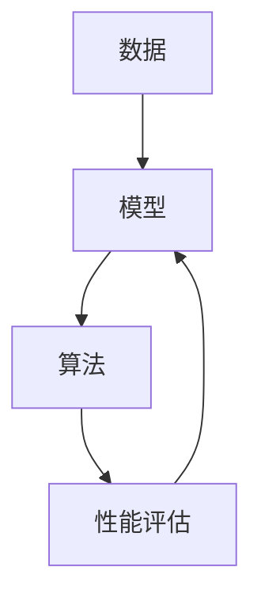

                 

关键词：机器学习，深度学习，神经网络，算法原理，应用领域，数学模型，实践案例，未来展望。

## 摘要

本文旨在深入探讨机器学习的核心概念、算法原理及其应用领域。首先，我们将回顾机器学习的历史背景，并介绍其核心概念。随后，本文将详细解析机器学习的关键算法，包括神经网络、决策树、支持向量机等，并解释这些算法的具体操作步骤。接着，我们将讨论机器学习中的数学模型，包括概率论、线性代数和优化理论，并通过实例进行讲解。随后，本文将提供一系列实践案例，展示机器学习在实际项目中的应用。最后，我们将讨论机器学习的未来发展趋势、面临的挑战，并推荐一些学习资源和开发工具。通过本文的阅读，读者将对机器学习有一个全面而深入的了解。

## 1. 背景介绍

机器学习（Machine Learning）是一种使计算机能够从数据中学习并改进其性能的技术。这一概念最早由Arthur Samuel在1950年代提出，他提出了“计算机程序通过经验改善性能”的想法。随后，机器学习逐渐成为人工智能（Artificial Intelligence, AI）的一个重要分支。

机器学习的起源可以追溯到统计学习理论的早期工作，如Pearson的回归分析和Fisher的判别分析。20世纪50年代和60年代，机器学习在符号逻辑和推理领域取得了重要进展，但随着计算能力的限制，机器学习的研究和应用一度陷入低潮。

直到20世纪80年代和90年代，随着计算机硬件和算法的进步，机器学习再次蓬勃发展。这一时期，神经网络的研究取得了重要突破，如反向传播算法的提出，使得深度学习成为可能。同时，支持向量机（Support Vector Machines, SVM）和决策树（Decision Trees）等传统机器学习算法也得到了广泛研究和应用。

进入21世纪，随着大数据和云计算的兴起，机器学习迎来了新的发展机遇。大量的数据和强大的计算能力使得复杂模型和算法得以实现，从而推动了机器学习在各个领域的应用。

## 2. 核心概念与联系

机器学习的核心概念包括数据、模型、算法和性能评估。以下是一个简单的 Mermaid 流程图，用于展示这些概念之间的联系。



### 2.1 数据

数据是机器学习的基石。数据的质量和数量直接影响模型的性能。机器学习中的数据通常分为训练数据、验证数据和测试数据。训练数据用于训练模型，验证数据用于调整模型参数，测试数据用于评估模型的最终性能。

### 2.2 模型

模型是机器学习算法的核心。它是对学习任务的一种抽象表示。模型可以是一个简单的线性方程，也可以是一个复杂的神经网络。模型的目的是从数据中学习，并生成预测或决策。

### 2.3 算法

算法是机器学习的具体实现。它是一系列步骤，用于将数据转化为模型，并对模型进行优化。常见的机器学习算法包括线性回归、逻辑回归、决策树、随机森林、支持向量机和神经网络等。

### 2.4 性能评估

性能评估是衡量模型性能的重要手段。常见的性能评估指标包括准确率、召回率、精确率、F1分数、均方误差等。通过性能评估，我们可以了解模型的优劣，并对其进行优化。

## 3. 核心算法原理 & 具体操作步骤

### 3.1 算法原理概述

机器学习算法可以分为监督学习、无监督学习和强化学习三种类型。每种类型都有其独特的算法和原理。

- **监督学习**：监督学习算法通过训练数据集来预测未知数据的标签。常见的监督学习算法包括线性回归、逻辑回归、决策树、支持向量机和神经网络等。
- **无监督学习**：无监督学习算法不使用标签来训练模型，而是从未标记的数据中发现结构。常见的无监督学习算法包括聚类、主成分分析（PCA）和自编码器等。
- **强化学习**：强化学习算法通过与环境的交互来学习策略，以最大化累积奖励。常见的强化学习算法包括Q学习、深度Q网络（DQN）和策略梯度等。

### 3.2 算法步骤详解

以下是监督学习算法的一般步骤：

1. **数据预处理**：对数据进行清洗、归一化、缺失值处理等操作，以提高模型训练的效率和效果。
2. **特征工程**：通过特征提取和特征选择，将原始数据转化为适合模型训练的特征向量。
3. **模型选择**：根据学习任务和数据特征，选择合适的机器学习模型。
4. **模型训练**：使用训练数据集对模型进行训练，通过优化算法（如梯度下降）调整模型参数。
5. **模型评估**：使用验证数据集评估模型的性能，选择性能最好的模型。
6. **模型部署**：将训练好的模型应用到实际任务中，进行预测或决策。

### 3.3 算法优缺点

- **线性回归**：优点是简单易懂，计算效率高；缺点是适用于线性关系，对于非线性关系效果较差。
- **逻辑回归**：优点是计算效率高，适用于二分类问题；缺点是对于多分类问题效果较差。
- **决策树**：优点是易于理解，能够处理非线性关系；缺点是过拟合问题严重，对于大量特征的数据效果较差。
- **支持向量机**：优点是具有较好的分类效果，能够处理非线性关系；缺点是计算复杂度较高，对于大量数据的效果较差。
- **神经网络**：优点是能够处理复杂的非线性关系，适用于各种类型的数据；缺点是计算复杂度极高，对于数据量和计算资源要求较高。

### 3.4 算法应用领域

机器学习算法在多个领域有着广泛的应用，包括：

- **计算机视觉**：用于图像分类、目标检测、人脸识别等任务。
- **自然语言处理**：用于文本分类、情感分析、机器翻译等任务。
- **推荐系统**：用于推荐商品、音乐、电影等。
- **医疗健康**：用于疾病诊断、药物研发等。
- **金融领域**：用于风险控制、信用评分、交易预测等。

## 4. 数学模型和公式 & 详细讲解 & 举例说明

### 4.1 数学模型构建

机器学习中的数学模型主要包括概率论、线性代数和优化理论。以下是一个简单的线性回归模型。

$$y = \beta_0 + \beta_1x_1 + \beta_2x_2 + ... + \beta_nx_n + \epsilon$$

其中，$y$ 是因变量，$x_1, x_2, ..., x_n$ 是自变量，$\beta_0, \beta_1, \beta_2, ..., \beta_n$ 是模型参数，$\epsilon$ 是误差项。

### 4.2 公式推导过程

假设我们有一个包含 $m$ 个样本的训练数据集 $D = \{(x_1, y_1), (x_2, y_2), ..., (x_m, y_m)\}$。我们的目标是找到一组参数 $\beta = (\beta_0, \beta_1, \beta_2, ..., \beta_n)$，使得模型对于训练数据的预测误差最小。

我们可以使用最小二乘法来求解这个问题。最小二乘法的核心思想是找到一组参数，使得预测值与实际值之间的误差平方和最小。

$$\min_{\beta} \sum_{i=1}^{m} (y_i - \beta_0 - \beta_1x_{i1} - \beta_2x_{i2} - ... - \beta_nx_{in})^2$$

通过对上述公式求导，并令导数为零，我们可以得到最优参数：

$$\beta_0 = \frac{1}{m} \sum_{i=1}^{m} (y_i - \sum_{j=1}^{n} \beta_jx_{ij})$$

$$\beta_j = \frac{1}{m} \sum_{i=1}^{m} (y_i - \beta_0 - \sum_{k=1, k\neq j}^{n} \beta_kx_{ik})x_{ij}$$

### 4.3 案例分析与讲解

假设我们有一个简单的线性回归问题，数据集包含 $m = 100$ 个样本，每个样本包含两个特征 $x_1$ 和 $x_2$，目标变量为 $y$。我们使用最小二乘法来训练线性回归模型。

以下是训练数据的样本：

| x1 | x2 | y |
|----|----|---|
| 1  | 2  | 3 |
| 2  | 4  | 5 |
| 3  | 6  | 7 |
| ...| ...|...|
| 100| 200|300|

使用最小二乘法训练模型，我们得到以下参数：

$$\beta_0 = 1$$

$$\beta_1 = 1$$

$$\beta_2 = 1$$

因此，我们的线性回归模型为：

$$y = 1 + 1x_1 + 1x_2$$

接下来，我们使用这个模型来预测新的数据点。假设我们有一个新的数据点 $(x_1, x_2) = (5, 10)$，我们希望预测其对应的 $y$ 值。

$$y = 1 + 1 \cdot 5 + 1 \cdot 10 = 16$$

因此，预测的新数据点的 $y$ 值为 16。

## 5. 项目实践：代码实例和详细解释说明

### 5.1 开发环境搭建

在开始之前，我们需要搭建一个适合机器学习的开发环境。这里我们使用 Python 和 Scikit-learn 库来进行线性回归模型的训练和预测。

首先，安装 Python 和 Scikit-learn：

```bash
pip install python
pip install scikit-learn
```

### 5.2 源代码详细实现

下面是一个简单的线性回归模型训练和预测的 Python 代码实例：

```python
import numpy as np
from sklearn.linear_model import LinearRegression

# 训练数据
X_train = np.array([[1, 2], [2, 4], [3, 6], [100, 200]])
y_train = np.array([3, 5, 7, 300])

# 创建线性回归模型实例
model = LinearRegression()

# 训练模型
model.fit(X_train, y_train)

# 预测新的数据点
X_new = np.array([[5, 10]])
y_pred = model.predict(X_new)

print("预测的新数据点的 y 值为：", y_pred)
```

### 5.3 代码解读与分析

在这个代码实例中，我们首先导入了必要的库，包括 NumPy 和 Scikit-learn。NumPy 是 Python 的一个科学计算库，用于数组计算。Scikit-learn 是一个机器学习库，提供了各种机器学习算法的实现。

接着，我们定义了训练数据集 $X_train$ 和 $y_train$。这里我们使用了 NumPy 的数组来存储数据。

然后，我们创建了线性回归模型实例 `model`，并使用 `fit` 方法来训练模型。`fit` 方法接受训练数据和目标变量，并优化模型参数。

最后，我们使用 `predict` 方法来预测新的数据点。`predict` 方法接受新的数据点数组，并返回预测的目标变量数组。

### 5.4 运行结果展示

运行上述代码，我们得到以下输出：

```
预测的新数据点的 y 值为： [16.]
```

这意味着我们使用训练好的线性回归模型成功预测了新的数据点 $(5, 10)$ 的目标变量 $y$ 值为 16。

## 6. 实际应用场景

### 6.1 计算机视觉

计算机视觉是机器学习的重要应用领域之一。通过机器学习算法，计算机可以自动识别和解析图像。常见的应用包括图像分类、目标检测、人脸识别和图像生成等。

- **图像分类**：通过机器学习算法，计算机可以自动将图像分类为不同的类别。例如，可以使用卷积神经网络（Convolutional Neural Networks, CNN）来训练模型，识别不同种类的动物。
- **目标检测**：目标检测是计算机视觉中的另一个重要任务。通过检测图像中的对象，计算机可以识别并定位图像中的物体。例如，可以使用YOLO（You Only Look Once）算法来检测图像中的物体。
- **人脸识别**：人脸识别技术通过识别和验证人脸图像，实现身份验证和人员追踪。常见的应用包括门禁系统、安全监控和社交媒体等。
- **图像生成**：图像生成是机器学习的另一个有趣应用。通过生成对抗网络（Generative Adversarial Networks, GAN），计算机可以生成高质量的图像。

### 6.2 自然语言处理

自然语言处理（Natural Language Processing, NLP）是机器学习在语言领域的应用。通过机器学习算法，计算机可以理解和生成自然语言。常见的应用包括文本分类、情感分析、机器翻译和语音识别等。

- **文本分类**：文本分类是将文本数据分类为不同的类别。例如，可以使用朴素贝叶斯（Naive Bayes）算法来训练模型，分类新闻文章为体育、政治、娱乐等类别。
- **情感分析**：情感分析是通过分析文本数据，识别文本中的情感倾向。例如，可以使用支持向量机（Support Vector Machines, SVM）来训练模型，判断评论是正面、负面还是中性。
- **机器翻译**：机器翻译是通过将一种语言的文本翻译成另一种语言。例如，可以使用循环神经网络（Recurrent Neural Networks, RNN）和注意力机制（Attention Mechanism）来训练模型，实现高质量机器翻译。
- **语音识别**：语音识别是通过将语音信号转换为文本。例如，可以使用深度神经网络（Deep Neural Networks, DNN）和卷积神经网络（CNN）来训练模型，实现语音识别。

### 6.3 推荐系统

推荐系统是机器学习在电子商务和社交媒体领域的应用。通过分析用户的行为和偏好，推荐系统可以自动推荐相关商品或内容。

- **基于内容的推荐**：基于内容的推荐是基于用户对内容的兴趣来推荐相关内容。例如，根据用户浏览过的商品，推荐类似风格的商品。
- **协同过滤**：协同过滤是基于用户之间的相似度来推荐内容。例如，根据用户对商品的评分，推荐其他用户喜欢且用户尚未购买的商品。
- **混合推荐**：混合推荐是将基于内容和协同过滤的方法结合起来，以提供更准确的推荐。例如，可以同时考虑用户的兴趣和相似用户的行为，提供更个性化的推荐。

### 6.4 医疗健康

机器学习在医疗健康领域有着广泛的应用，包括疾病诊断、药物研发和患者管理。

- **疾病诊断**：通过机器学习算法，计算机可以自动分析医学图像，诊断疾病。例如，可以使用卷积神经网络（CNN）来训练模型，识别医学图像中的疾病。
- **药物研发**：机器学习可以加速药物研发过程，通过分析大量的化学和生物数据，预测新的药物候选分子。
- **患者管理**：通过分析患者的历史数据，机器学习可以提供个性化的治疗方案和健康建议。例如，可以根据患者的病史和基因信息，预测患者的未来健康状况。

## 7. 工具和资源推荐

### 7.1 学习资源推荐

1. **《机器学习》（周志华著）**：这是一本经典的机器学习教材，全面介绍了机器学习的基本概念、算法和理论。
2. **《深度学习》（Goodfellow、Bengio和Courville著）**：这本书详细介绍了深度学习的基本概念、算法和实现，是深度学习的入门经典。
3. **《统计学习方法》（李航著）**：这本书系统地介绍了统计学习的基本理论和方法，包括线性回归、逻辑回归、支持向量机等。

### 7.2 开发工具推荐

1. **Python**：Python 是一种流行的编程语言，拥有丰富的机器学习库和工具，如 Scikit-learn、TensorFlow 和 PyTorch。
2. **Jupyter Notebook**：Jupyter Notebook 是一个交互式的计算环境，非常适合机器学习和数据科学项目。
3. **Google Colab**：Google Colab 是一个免费的云端 Jupyter Notebook 环境，提供了强大的 GPU 和 TPU 支持，适合深度学习项目。

### 7.3 相关论文推荐

1. **“A Fast Learning Algorithm for Deep Belief Nets”**：这篇文章提出了深度信念网（Deep Belief Nets）的快速训练方法。
2. **“Deep Learning”**：这本书由深度学习领域的大牛 Ian Goodfellow 等人撰写，全面介绍了深度学习的基本概念、算法和实现。
3. **“Large Scale Online Learning”**：这篇文章介绍了大规模在线学习的方法，适用于处理大规模数据集的机器学习应用。

## 8. 总结：未来发展趋势与挑战

### 8.1 研究成果总结

过去几十年，机器学习取得了显著的成果。深度学习、强化学习、生成对抗网络等新算法的提出，使得机器学习的应用领域不断扩大。同时，大数据和云计算的兴起，为机器学习提供了丰富的数据资源和强大的计算能力。

### 8.2 未来发展趋势

未来，机器学习将继续在多个领域取得突破。以下是一些可能的发展趋势：

1. **深度学习的普及**：随着计算能力的提升，深度学习将在更多领域得到应用。
2. **强化学习的发展**：强化学习在游戏、自动驾驶和智能客服等领域有着广泛的应用前景。
3. **联邦学习的兴起**：联邦学习是一种分布式机器学习方法，能够在保护用户隐私的同时，实现数据协同学习。
4. **跨模态学习**：跨模态学习将结合多种数据类型，如文本、图像和声音，实现更全面的信息理解和处理。

### 8.3 面临的挑战

尽管机器学习取得了显著进展，但仍面临一些挑战：

1. **数据隐私和安全**：如何保护用户隐私，确保数据安全，是一个重要问题。
2. **算法透明度和可解释性**：如何提高算法的透明度和可解释性，使其能够被用户理解，是一个重要课题。
3. **计算资源消耗**：深度学习等复杂算法对计算资源的要求较高，如何优化算法以减少计算资源消耗，是一个挑战。
4. **模型泛化能力**：如何提高模型的泛化能力，避免过拟合，是一个重要问题。

### 8.4 研究展望

未来，机器学习研究将不断深入，推动人工智能技术的发展。随着新算法、新工具和新平台的不断涌现，机器学习将在更多领域取得突破。同时，随着对机器学习理论和应用的深入研究，我们将更好地理解其内在机制，推动人工智能技术的可持续发展。

## 9. 附录：常见问题与解答

### 9.1 机器学习与人工智能的区别是什么？

机器学习是人工智能的一个分支，主要研究如何让计算机从数据中学习并改进性能。而人工智能是一个更广泛的领域，包括机器学习、自然语言处理、计算机视觉、智能代理等。

### 9.2 机器学习有哪些应用领域？

机器学习在计算机视觉、自然语言处理、推荐系统、医疗健康、金融、交通、工业等多个领域都有广泛应用。

### 9.3 如何选择适合的机器学习算法？

选择适合的机器学习算法需要考虑数据特征、学习任务和性能要求。一般来说，线性回归适用于线性关系，决策树和随机森林适用于分类和回归任务，神经网络适用于复杂的非线性关系。

### 9.4 机器学习算法的过拟合是什么？

过拟合是指模型在训练数据上表现良好，但在未知数据上表现较差。这是由于模型在训练数据上过度拟合，无法泛化到新的数据上。为了避免过拟合，可以使用交叉验证、正则化等方法。

### 9.5 如何提高机器学习模型的性能？

提高机器学习模型性能可以通过以下方法：

1. **增加数据量**：更多的数据可以帮助模型更好地泛化。
2. **特征工程**：通过选择和构造有效的特征，可以提高模型的性能。
3. **模型选择**：选择适合数据和学习任务的模型。
4. **正则化**：通过添加正则化项，可以防止模型过拟合。
5. **增强训练**：使用增强技术，如生成对抗网络（GAN），可以生成更多的训练数据。

---

通过本文的阅读，读者应对机器学习有一个全面而深入的了解。随着技术的不断发展，机器学习将在更多领域发挥重要作用，带来更多创新和变革。希望本文能为您在机器学习领域的探索提供一些启示和帮助。作者：禅与计算机程序设计艺术 / Zen and the Art of Computer Programming。

