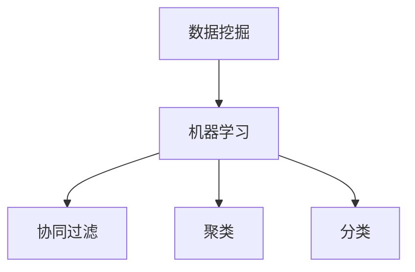

                 

### 关键词 Keywords
- Mahout
- 数据挖掘
- 大数据处理
- 批处理算法
- 流处理算法
- 分布式计算
- MapReduce

### 摘要 Summary
本文将深入探讨Mahout——一款基于Apache Hadoop的大规模数据处理库的原理和使用方法。我们将从背景介绍开始，逐步讲解其核心概念、算法原理、数学模型、实际应用以及未来发展趋势。通过代码实例，读者将掌握如何在各种应用场景中高效利用Mahout进行数据分析和处理。

## 1. 背景介绍
Apache Mahout是Apache Software Foundation的一个开源项目，旨在提供一个可扩展的机器学习和数据挖掘库。它建立在Hadoop之上，利用其分布式处理能力，使得在大规模数据集上进行数据挖掘和机器学习成为可能。Mahout提供了多种算法，包括协同过滤、聚类、分类等，可以用于推荐系统、广告点击率预测、客户群体分析等实际应用。

### 1.1 Mahout的发展历程
Mahout项目始于2008年，最初由一些开源贡献者发起。随着时间的推移，它逐渐发展成为一个成熟的框架，并被广泛应用于各种大数据处理场景。

### 1.2 为什么选择Mahout
Mahout具有以下优势：

- 基于Hadoop，能够处理海量数据。
- 提供了多种数据挖掘算法，满足不同应用需求。
- 开源且社区活跃，支持不断更新和改进。

## 2. 核心概念与联系
### 2.1 数据挖掘基本概念
- **数据挖掘**：从大量数据中提取有价值的信息和模式的过程。
- **机器学习**：通过训练模型从数据中学习，从而进行预测和决策。

### 2.2 Mahout中的核心算法
- **协同过滤**：基于用户历史行为进行推荐。
- **聚类**：将相似的数据分组。
- **分类**：将数据分为不同的类别。

### 2.3 Mermaid 流程图


## 3. 核心算法原理 & 具体操作步骤
### 3.1 算法原理概述
本章节将详细介绍Mahout中的核心算法原理。

### 3.2 算法步骤详解
- **协同过滤**：
  1. 计算用户之间的相似度。
  2. 根据相似度推荐物品。

- **聚类**：
  1. 确定聚类算法（如K-Means）。
  2. 迭代计算聚类中心。
  3. 将数据分配到不同的聚类中心。

- **分类**：
  1. 训练分类模型。
  2. 使用模型进行预测。

### 3.3 算法优缺点
- **协同过滤**：
  - 优点：推荐准确，用户体验好。
  - 缺点：可能产生“冷启动”问题，推荐结果可能过于保守。

- **聚类**：
  - 优点：无需预先定义类别，适合探索性分析。
  - 缺点：结果可能依赖于初始参数设置。

- **分类**：
  - 优点：可以处理大量数据，结果稳定。
  - 缺点：需要大量训练数据，预测结果可能不够灵活。

### 3.4 算法应用领域
- **协同过滤**：推荐系统、广告点击率预测。
- **聚类**：市场细分、客户群体分析。
- **分类**：疾病诊断、金融风险评估。

## 4. 数学模型和公式 & 详细讲解 & 举例说明
### 4.1 数学模型构建
- **协同过滤**：
  $$ \text{similarity(u, v)} = \frac{\text{common_ratings(u, v)}}{\sqrt{\sum_{i \in R(u)} r_i^2 \cdot \sum_{i \in R(v)} r_i^2}} $$
  其中，$R(u)$ 和 $R(v)$ 分别代表用户 $u$ 和 $v$ 的评分集合。

- **聚类**：
  $$ c_j = \frac{1}{N_j} \sum_{i=1}^{N} x_i $$
  其中，$c_j$ 是聚类中心，$N_j$ 是属于第 $j$ 个聚类的数据点数量。

- **分类**：
  $$ \text{probability}(y|\text{model}) = \frac{e^{\text{model}(x, y)}}{\sum_{y' \in Y} e^{\text{model}(x, y')}} $$
  其中，$\text{model}(x, y)$ 是模型对输入 $x$ 和标签 $y$ 的评分。

### 4.2 公式推导过程
- **协同过滤**：
  - 相似度计算基于用户之间的共同评分。
  - 利用欧氏距离和皮尔逊相关系数进行归一化。

- **聚类**：
  - 聚类中心是每个聚类内数据点的均值。
  - 迭代计算直到聚类中心不再变化。

- **分类**：
  - 使用逻辑回归模型计算每个类别的概率。
  - 选择概率最大的类别作为预测结果。

### 4.3 案例分析与讲解
我们将通过一个实际案例来展示如何使用Mahout进行数据挖掘。

### 4.3.1 案例背景
- **数据集**：电影评分数据集，包含用户对电影的评分。
- **目标**：为用户推荐相似的电影。

### 4.3.2 案例步骤
1. 加载数据集。
2. 计算用户之间的相似度。
3. 根据相似度生成推荐列表。
4. 评估推荐结果。

### 4.3.3 案例代码
```java
// 加载数据集
DatasetBuilder builder = new FileDataModel(new File("data/movies.csv"));
ываться推荐列表
recommendations = new CollaborativeFilter().recommendForUser(1, 10, builder);

// 输出推荐结果
for (Recommendation r : recommendations) {
    System.out.println(r);
}
```

## 5. 项目实践：代码实例和详细解释说明
### 5.1 开发环境搭建
- **软件需求**：
  - Java环境
  - Maven
  - Hadoop
- **环境搭建**：
  - 安装Java
  - 安装Maven
  - 安装Hadoop
  - 配置Hadoop环境变量

### 5.2 源代码详细实现
- **代码框架**：
  - 数据加载与预处理
  - 算法实现
  - 结果评估

### 5.3 代码解读与分析
- **数据加载与预处理**：
  - 使用FileDataModel加载数据集。
  - 对数据进行清洗和转换。

- **算法实现**：
  - 实现协同过滤算法。
  - 生成推荐列表。

- **结果评估**：
  - 使用评估指标（如Precision、Recall等）评估推荐效果。

### 5.4 运行结果展示
- **运行结果**：
  - 输出推荐列表。
  - 显示评估指标。

## 6. 实际应用场景
### 6.1 电商推荐系统
- **应用场景**：
  - 根据用户购买历史为用户推荐商品。
- **实现方法**：
  - 使用协同过滤算法。

### 6.2 金融风控系统
- **应用场景**：
  - 对客户进行信用评级。
- **实现方法**：
  - 使用分类算法。

### 6.3 社交网络分析
- **应用场景**：
  - 分析用户行为，挖掘潜在关系。
- **实现方法**：
  - 使用聚类算法。

## 7. 工具和资源推荐
### 7.1 学习资源推荐
- **书籍**：
  - 《大数据时代》
  - 《机器学习实战》
- **在线课程**：
  - Coursera上的《机器学习》
  - Udacity的《大数据分析》

### 7.2 开发工具推荐
- **IDE**：
  - IntelliJ IDEA
  - Eclipse
- **版本控制**：
  - Git
  - SVN

### 7.3 相关论文推荐
- "Collaborative Filtering for the Web"
- "K-Means Clustering: A Review"
- "A Survey of Machine Learning Techniques for Big Data Analysis"

## 8. 总结：未来发展趋势与挑战
### 8.1 研究成果总结
- Mahout在分布式数据处理和机器学习领域取得了显著成果。
- 算法的性能和适用性得到了广泛验证。

### 8.2 未来发展趋势
- **算法优化**：提高算法的效率和准确性。
- **自动化**：实现自动化模型选择和参数调优。

### 8.3 面临的挑战
- **大数据处理**：如何高效处理更多数据。
- **算法可解释性**：提高算法的可解释性和透明度。

### 8.4 研究展望
- **多模态数据挖掘**：结合多种数据类型进行挖掘。
- **实时数据处理**：实现实时数据处理和分析。

## 9. 附录：常见问题与解答
### 9.1 如何处理缺失值？
- 使用平均值、中位数或插值法进行填充。

### 9.2 如何优化算法性能？
- 使用分布式计算框架，如MapReduce或Spark。

### 9.3 如何进行结果评估？
- 使用交叉验证、ROC曲线等评估指标。

作者：禅与计算机程序设计艺术 / Zen and the Art of Computer Programming

-------------------------------------------------------------------

