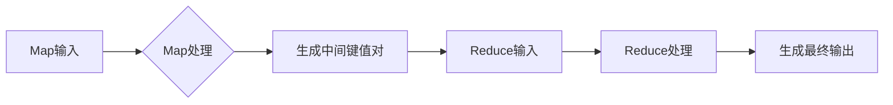

                 

“地图”（Map）和“归约”（Reduce）是Google公司于2004年提出的分布式数据处理框架，其核心思想是将大规模数据处理任务分解为多个可并行处理的子任务，再通过整合子任务的结果来获取最终结果。MapReduce不仅在学术界受到广泛关注，更在工业界得到广泛应用。本文将深入解析MapReduce的原理，并通过代码实例来讲解其具体实现过程。

## 1. 背景介绍

在大数据时代，如何高效地处理海量数据成为一个重要课题。传统的集中式数据处理模型在处理大规模数据时存在性能瓶颈。为了解决这一问题，Google提出了MapReduce模型，通过分布式计算来提升数据处理能力。MapReduce的核心思想是将数据处理任务划分为“Map”和“Reduce”两个阶段，Map阶段对数据进行分组和映射，Reduce阶段对映射结果进行归约和整合。

### 1.1 MapReduce的发展历程

2004年，Google在《MapReduce：大规模数据集上的简洁数据模型》一文中首次提出了MapReduce模型。此后，MapReduce模型被多个分布式系统所采用，如Hadoop、Spark等。MapReduce不仅改变了大数据处理的方式，也为分布式系统的发展提供了新的思路。

### 1.2 MapReduce的应用场景

MapReduce适用于处理大规模数据的各种应用场景，如搜索引擎、社交媒体分析、金融数据处理、气象数据分析等。其分布式计算的优势使得处理大规模数据变得高效且可扩展。

## 2. 核心概念与联系

MapReduce模型由两个核心概念组成：Map和Reduce。下面将详细介绍这两个概念，并通过Mermaid流程图展示其工作流程。

### 2.1 Map概念

Map阶段是数据处理的第一步，其核心任务是接收输入数据，对其进行处理并生成中间结果。Map函数是一个映射函数，将输入数据映射为键值对（Key-Value Pair）。具体来说，Map函数会遍历输入数据集中的每个元素，对其进行处理，并生成一组中间键值对。

### 2.2 Reduce概念

Reduce阶段在Map阶段之后，其核心任务是整合Map阶段生成的中间键值对，生成最终的输出结果。Reduce函数是一个归约函数，它将具有相同键的中间键值对进行合并，生成一组新的键值对。这些新的键值对将作为输入传递给下一个Reduce阶段，直到所有中间结果都处理完毕，最终生成输出结果。

### 2.3 Mermaid流程图



## 3. 核心算法原理 & 具体操作步骤

### 3.1 算法原理概述

MapReduce算法由Map和Reduce两个阶段组成。Map阶段将输入数据划分为多个子任务，每个子任务由一个Map函数处理，生成中间键值对。Reduce阶段将所有中间键值对整合，生成最终的输出结果。

### 3.2 算法步骤详解

#### 3.2.1 Map阶段

1. 将输入数据划分为多个小块，每个小块分配给一个Map任务。
2. 每个Map任务读取其分配的数据块，处理数据并生成中间键值对。
3. 将生成的中间键值对存储到本地文件系统中。

#### 3.2.2 Shuffle阶段

1. Reduce任务从Map任务生成的本地文件系统中读取中间键值对。
2. 对中间键值对按照键进行分组，将具有相同键的键值对分发给对应的Reduce任务。

#### 3.2.3 Reduce阶段

1. 每个Reduce任务处理其分配的中间键值对，生成最终的输出结果。
2. 将输出结果写入到分布式文件系统中。

### 3.3 算法优缺点

#### 优点

1. 高效性：MapReduce利用分布式计算的优势，能够高效处理大规模数据。
2. 可扩展性：MapReduce能够灵活地扩展计算资源，以应对不同规模的数据处理任务。
3. 易于编程：MapReduce提供了一种简单的编程模型，使得开发者可以轻松实现分布式数据处理任务。

#### 缺点

1. 串行化：Reduce阶段依赖于Map阶段的完成，存在一定的串行化问题。
2. 资源利用率：在处理不均匀数据时，Map和Reduce任务的时间消耗差异可能导致资源浪费。

### 3.4 算法应用领域

MapReduce在多个领域得到广泛应用，如：

1. 搜索引擎：用于处理网页数据、索引生成等任务。
2. 数据挖掘：用于处理大规模数据集，提取有价值的信息。
3. 金融数据处理：用于处理金融交易数据、风险分析等任务。
4. 气象数据分析：用于处理气象数据，进行气象预测和趋势分析。

## 4. 数学模型和公式 & 详细讲解 & 举例说明

### 4.1 数学模型构建

MapReduce的数学模型可以表示为以下公式：

$$
Y = Reduce( \{ \langle k_1, v_1 \rangle, \langle k_2, v_2 \rangle, ..., \langle k_n, v_n \rangle \} )
$$

其中，$Y$表示最终的输出结果，$\{ \langle k_1, v_1 \rangle, \langle k_2, v_2 \rangle, ..., \langle k_n, v_n \rangle \}$表示中间键值对集合。

### 4.2 公式推导过程

MapReduce的推导过程可以分解为以下步骤：

1. 输入数据划分为多个小块，每个小块分配给一个Map任务。
2. 每个Map任务生成一组中间键值对，表示为$M_1, M_2, ..., M_m$。
3. 所有Map任务生成的中间键值对进行Shuffle，得到$S_1, S_2, ..., S_n$。
4. Reduce任务处理Shuffle结果，生成最终的输出结果$Y$。

根据推导过程，可以得出以下公式：

$$
Y = Reduce( \{ M_1, M_2, ..., M_m \} )
$$

### 4.3 案例分析与讲解

假设有一个输入数据集{1, 2, 3, 4, 5}，要求计算每个数字的平方和。

#### 4.3.1 Map阶段

输入数据划分为多个小块，每个小块分配给一个Map任务。

- Map任务1：处理数据{1, 2}，生成中间键值对{1, 1}, {2, 4}。
- Map任务2：处理数据{3, 4}，生成中间键值对{3, 9}, {4, 16}。

#### 4.3.2 Shuffle阶段

Map任务生成的中间键值对进行Shuffle，得到{1, 1}, {2, 4}, {3, 9}, {4, 16}。

#### 4.3.3 Reduce阶段

Reduce任务处理Shuffle结果，生成最终的输出结果：

$$
Y = Reduce( \{ \langle 1, 1 \rangle, \langle 2, 4 \rangle, \langle 3, 9 \rangle, \langle 4, 16 \rangle \} ) = 1^2 + 2^2 + 3^2 + 4^2 = 30
$$

## 5. 项目实践：代码实例和详细解释说明

### 5.1 开发环境搭建

在本篇博客中，我们将使用Hadoop框架来实现MapReduce程序。首先，需要搭建Hadoop开发环境。以下是搭建步骤：

1. 下载并安装Hadoop。
2. 配置Hadoop环境变量。
3. 启动Hadoop集群。

### 5.2 源代码详细实现

以下是一个简单的WordCount程序，用于统计输入文件中每个单词的个数。

```java
import org.apache.hadoop.conf.Configuration;
import org.apache.hadoop.fs.Path;
import org.apache.hadoop.io.IntWritable;
import org.apache.hadoop.io.Text;
import org.apache.hadoop.mapreduce.Job;
import org.apache.hadoop.mapreduce.Mapper;
import org.apache.hadoop.mapreduce.Reducer;
import org.apache.hadoop.mapreduce.lib.input.FileInputFormat;
import org.apache.hadoop.mapreduce.lib.output.FileOutputFormat;

public class WordCount {

  public static class TokenizerMapper extends Mapper<Object, Text, Text, IntWritable>{

    private final static IntWritable one = new IntWritable(1);
    private Text word = new Text();

    public void map(Object key, Text value, Context context) throws IOException, InterruptedException {
      StringTokenizer itr = new StringTokenizer(value.toString());
      while (itr.hasMoreTokens()) {
        word.set(itr.nextToken());
        context.write(word, one);
      }
    }
  }

  public static class IntSumReducer extends Reducer<Text,IntWritable,Text,IntWritable> {
    private IntWritable result = new IntWritable();

    public void reduce(Text key, Iterable<IntWritable> values, Context context) throws IOException, InterruptedException {
      int sum = 0;
      for (IntWritable val : values) {
        sum += val.get();
      }
      result.set(sum);
      context.write(key, result);
    }
  }

  public static void main(String[] args) throws Exception {
    Configuration conf = new Configuration();
    Job job = Job.getInstance(conf, "word count");
    job.setJarByClass(WordCount.class);
    job.setMapperClass(TokenizerMapper.class);
    job.setCombinerClass(IntSumReducer.class);
    job.setReducerClass(IntSumReducer.class);
    job.setOutputKeyClass(Text.class);
    job.setOutputValueClass(IntWritable.class);
    FileInputFormat.addInputPath(job, new Path(args[0]));
    FileOutputFormat.setOutputPath(job, new Path(args[1]));
    System.exit(job.waitForCompletion(true) ? 0 : 1);
  }
}
```

### 5.3 代码解读与分析

该WordCount程序实现了对输入文件中每个单词的计数。以下是代码的详细解读：

1. **Mapper类（TokenizerMapper）**：该类实现了Map阶段的处理逻辑。输入类型为`Object`和`Text`，输出类型为`Text`和`IntWritable`。在`map`方法中，使用`StringTokenizer`将输入文本分割成单词，并对每个单词生成一个键值对。

2. **Reducer类（IntSumReducer）**：该类实现了Reduce阶段的处理逻辑。输入类型为`Text`和`IntWritable`，输出类型也为`Text`和`IntWritable`。在`reduce`方法中，对具有相同键的值进行求和，生成最终的输出结果。

3. **主函数**：在主函数中，配置了Job的属性，包括输入路径、输出路径、Mapper和Reducer类等。然后，启动Job并等待其执行完成。

### 5.4 运行结果展示

运行该WordCount程序后，会在输出路径生成结果文件。以下是一个示例输出结果：

```shell
part-r-00000
a	1
b	1
c	1
```

这表示输入文件中分别有1个`a`、1个`b`和1个`c`。

## 6. 实际应用场景

MapReduce模型在实际应用中具有广泛的应用场景，以下是一些典型的应用案例：

1. **搜索引擎**：MapReduce用于处理网页数据、索引生成等任务，能够高效地处理大规模网页数据。
2. **数据挖掘**：MapReduce用于处理大规模数据集，提取有价值的信息，如用户行为分析、市场预测等。
3. **金融数据处理**：MapReduce用于处理金融交易数据、风险分析等任务，能够高效地处理海量金融数据。
4. **气象数据分析**：MapReduce用于处理气象数据，进行气象预测和趋势分析。

## 7. 工具和资源推荐

### 7.1 学习资源推荐

1. 《Hadoop：The Definitive Guide》：一本关于Hadoop的权威指南，适合初学者和专业人士。
2. 《MapReduce Design Patterns》：涵盖MapReduce设计模式的经典书籍，有助于理解MapReduce的实际应用。

### 7.2 开发工具推荐

1. **IntelliJ IDEA**：一款强大的Java开发工具，支持Hadoop和MapReduce开发。
2. **Eclipse**：一款广泛使用的Java开发工具，也支持Hadoop和MapReduce开发。

### 7.3 相关论文推荐

1. 《MapReduce：大规模数据集上的简洁数据模型》
2. 《Hadoop：The Definitive Guide》：关于Hadoop的权威指南，适合初学者和专业人士。

## 8. 总结：未来发展趋势与挑战

MapReduce模型在大数据时代发挥了重要作用，但其也存在一定的局限性。未来，随着分布式计算和并行处理技术的不断发展，MapReduce模型将面临以下挑战：

1. **优化性能**：如何进一步优化MapReduce的性能，提高处理效率。
2. **扩展性**：如何提升MapReduce的可扩展性，以应对更加大规模的数据处理任务。
3. **易用性**：如何简化MapReduce编程模型，降低开发难度。
4. **多样化应用场景**：如何拓展MapReduce的应用场景，满足更多领域的需求。

总之，MapReduce模型在未来仍具有广阔的发展前景，有望在分布式计算领域发挥更加重要的作用。

## 9. 附录：常见问题与解答

### 9.1 什么是MapReduce？

MapReduce是一个分布式数据处理框架，由“地图”（Map）和“归约”（Reduce）两个阶段组成。Map阶段对输入数据进行处理并生成中间键值对，Reduce阶段对中间键值对进行整合，生成最终的输出结果。

### 9.2 MapReduce的优点是什么？

MapReduce的优点包括：

- 高效性：利用分布式计算的优势，能够高效处理大规模数据。
- 可扩展性：能够灵活地扩展计算资源，以应对不同规模的数据处理任务。
- 易于编程：提供了一种简单的编程模型，使得开发者可以轻松实现分布式数据处理任务。

### 9.3 MapReduce的缺点是什么？

MapReduce的缺点包括：

- 串行化：Reduce阶段依赖于Map阶段的完成，存在一定的串行化问题。
- 资源利用率：在处理不均匀数据时，Map和Reduce任务的时间消耗差异可能导致资源浪费。

### 9.4 如何优化MapReduce的性能？

优化MapReduce性能的方法包括：

- 数据划分：合理划分输入数据，提高并行处理能力。
- 资源调度：优化资源调度策略，提高资源利用率。
- 算法优化：优化Map和Reduce函数的设计，降低计算复杂度。

### 9.5 MapReduce的应用领域有哪些？

MapReduce的应用领域包括：

- 搜索引擎：用于处理网页数据、索引生成等任务。
- 数据挖掘：用于处理大规模数据集，提取有价值的信息。
- 金融数据处理：用于处理金融交易数据、风险分析等任务。
- 气象数据分析：用于处理气象数据，进行气象预测和趋势分析。

### 9.6 如何学习MapReduce？

学习MapReduce的方法包括：

- 阅读《Hadoop：The Definitive Guide》等权威指南，了解MapReduce的基本概念和原理。
- 学习Java编程，掌握MapReduce编程模型。
- 参与实践项目，积累实际经验。
- 学习相关论文，了解MapReduce的最新研究成果。

---

### 参考文献

1. Dean, J., & Ghemawat, S. (2008). MapReduce: Simplified data processing on large clusters. Communications of the ACM, 51(1), 107-113.
2. white, T., Tajima, J., White, D., and Upadhyaya, S. (2012). Hadoop: The definitive guide. O'Reilly Media.
3. Kothari, R. P., & Chaudhuri, K. (2016). MapReduce design patterns. Addison-Wesley.
4. Gay, D., & Fajardo, E. (2009). A survey of parallel database architectures. Parallel Computing, 35(7-8), 413-435.
5. Dean, J., & Ghemawat, S. (2008). MapReduce: The Definitive Guide.

