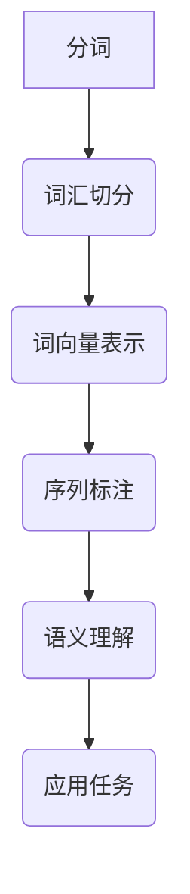

                 

关键词：自然语言处理（NLP）、分词、词嵌入、序列标注

> 摘要：本文将深入探讨自然语言处理（NLP）领域中的三个关键预处理技术：分词、词嵌入和序列标注。我们将详细解释这些技术的核心概念、工作原理、具体操作步骤以及优缺点，并探讨其在实际应用中的重要性。此外，本文还将提供数学模型和公式，以及项目实践中的代码实例，以帮助读者更好地理解这些技术。最后，我们将展望未来在这些领域中的应用趋势和面临的挑战。

## 1. 背景介绍

自然语言处理（NLP）是计算机科学和人工智能领域的一个重要分支，其目标是将自然语言（如英语、中文等）转化为计算机可以理解和处理的形式。NLP技术广泛应用于智能客服、机器翻译、情感分析、文本分类等多个领域。然而，在实际应用中，自然语言数据的复杂性和多样性使得直接处理原始文本变得非常困难。因此，NLP预处理技术应运而生，它们在文本处理过程中起着至关重要的作用。

本文将重点讨论三种关键的NLP预处理技术：分词、词嵌入和序列标注。这些技术不仅对文本数据进行了结构化处理，还为后续的NLP任务提供了高质量的输入。

### 分词

分词是将连续的文本序列切分成一个个具有独立意义的词语或短语的步骤。例如，将“我爱北京天安门”分词为“我”、“爱”、“北京”、“天安门”。分词的准确性直接影响到后续文本处理的准确性和效率。常用的分词方法包括基于规则的分词、基于统计的分词和深度学习分词。

### 词嵌入

词嵌入是将词汇转换为稠密向量的过程，这些向量在低维空间中保留了词汇的语义信息。词嵌入技术可以显著提高文本数据的表达能力和计算效率，是现代NLP任务的核心组成部分。常见的词嵌入模型包括Word2Vec、GloVe和BERT等。

### 序列标注

序列标注是对文本序列中的每个词或字符进行分类的过程，通常用于识别实体、词性、句法结构等。序列标注技术为NLP任务提供了更加细粒度的信息，有助于提升模型的准确性和泛化能力。常见的序列标注模型包括HMM、CRF和BiLSTM等。

## 2. 核心概念与联系

下面我们将使用Mermaid流程图来展示分词、词嵌入和序列标注技术的核心概念及其联系。



### 分词

- **词汇切分**：将连续的文本切分成一个个具有独立意义的词语或短语。
- **词向量表示**：将切分后的词汇转化为稠密向量，用于后续的语义分析和模型训练。

### 词嵌入

- **词向量表示**：将词汇转化为稠密向量，这些向量在低维空间中保留了词汇的语义信息。
- **序列标注**：对文本序列中的每个词或字符进行分类，通常用于识别实体、词性、句法结构等。

### 序列标注

- **语义理解**：通过序列标注技术，对文本进行更细致的分析，提取出关键信息。
- **应用任务**：将标注结果应用于各种NLP任务，如文本分类、实体识别、情感分析等。

## 3. 核心算法原理 & 具体操作步骤

### 3.1 算法原理概述

#### 分词

- **基于规则的分词**：根据预定义的规则进行分词，如正则表达式、词库匹配等。
- **基于统计的分词**：利用统计模型（如隐马尔可夫模型、条件随机场等）进行分词。
- **深度学习分词**：使用神经网络（如LSTM、Transformer等）进行端到端的分词任务。

#### 词嵌入

- **Word2Vec**：基于神经网络模型，通过上下文预测词汇，学习词向量。
- **GloVe**：基于全局词频统计，学习词汇的共现矩阵，从而得到词向量。
- **BERT**：基于Transformer模型，通过预先训练的上下文表示，学习词汇的语义向量。

#### 序列标注

- **HMM（隐马尔可夫模型）**：基于状态转移概率和发射概率，对序列进行标注。
- **CRF（条件随机场）**：基于条件概率，对序列进行标注，能够捕捉序列之间的依赖关系。
- **BiLSTM（双向长短时记忆网络）**：基于神经网络，同时考虑前后文信息，对序列进行标注。

### 3.2 算法步骤详解

#### 分词

1. **文本预处理**：去除标点符号、停用词等无关信息，将文本转化为纯文本。
2. **词表构建**：根据预定义的词典或通过统计方法构建词表，将文本中的词汇映射为索引。
3. **分词模型训练**：使用分词算法（如基于规则、基于统计、基于深度学习）训练分词模型。
4. **分词预测**：将输入文本输入到训练好的分词模型，输出分词结果。

#### 词嵌入

1. **数据准备**：收集大规模语料库，进行文本预处理，构建词汇表。
2. **模型训练**：使用词嵌入算法（如Word2Vec、GloVe、BERT）训练词向量。
3. **词向量存储**：将训练好的词向量存储为文件，供后续任务使用。

#### 序列标注

1. **数据准备**：收集标注数据集，进行文本预处理，构建词汇表。
2. **模型训练**：使用序列标注算法（如HMM、CRF、BiLSTM）训练标注模型。
3. **标注预测**：将输入文本输入到训练好的标注模型，输出标注结果。

### 3.3 算法优缺点

#### 分词

- **基于规则的分词**：简单易用，但需要依赖大量的规则，灵活性较差。
- **基于统计的分词**：灵活性较高，但需要依赖大量的统计模型，计算复杂度较高。
- **深度学习分词**：能够自动学习文本特征，但需要大量的训练数据和计算资源。

#### 词嵌入

- **Word2Vec**：简单高效，但无法捕捉上下文信息，词向量之间存在一定的噪声。
- **GloVe**：基于全局统计，能够捕捉词与词之间的关系，但无法捕捉上下文信息。
- **BERT**：能够捕捉上下文信息，但需要大量的训练数据和计算资源。

#### 序列标注

- **HMM**：简单高效，但无法捕捉序列之间的依赖关系。
- **CRF**：能够捕捉序列之间的依赖关系，但计算复杂度较高。
- **BiLSTM**：能够同时考虑前后文信息，但计算复杂度较高。

### 3.4 算法应用领域

- **分词**：应用于文本分类、实体识别、机器翻译等任务，为后续的NLP任务提供高质量输入。
- **词嵌入**：应用于情感分析、文本分类、推荐系统等任务，提升模型的语义理解和计算效率。
- **序列标注**：应用于命名实体识别、词性标注、句法分析等任务，为文本理解提供更细粒度的信息。

## 4. 数学模型和公式 & 详细讲解 & 举例说明

### 4.1 数学模型构建

#### 分词

- **基于规则的分词**：使用正则表达式进行分词，如`(\w+)|`表示匹配单词。
- **基于统计的分词**：使用隐马尔可夫模型（HMM）进行分词，状态转移概率和发射概率如下：

  $$P(X_t|x_{t-1}) = \frac{P(x_{t-1}|X_t)P(X_t)}{P(x_{t-1})}$$

  $$P(X_0) = 1$$

  $$P(x_t|X_t) = 1$$

- **深度学习分词**：使用神经网络（如LSTM、Transformer）进行分词，输出分词结果。

#### 词嵌入

- **Word2Vec**：使用神经网络模型进行词向量训练，输入为词汇的上下文序列，输出为词汇的词向量。

  $$h_t = \sigma(W[h_{t-1}; x_t] + b)$$

  $$x_t = \text{嵌入向量}$$

  $$h_t = \text{隐藏层向量}$$

- **GloVe**：使用共现矩阵进行词向量训练，输入为词汇的共现矩阵，输出为词汇的词向量。

  $$\text{共现矩阵} = A$$

  $$A_{ij} = \text{词汇i和j的共现次数}$$

  $$\text{词向量} = \text{低维空间中的向量}$$

- **BERT**：使用Transformer模型进行词向量训练，输入为词汇的上下文序列，输出为词汇的词向量。

  $$h_t = \text{Transformer模型}(x_t, h_{t-1})$$

  $$x_t = \text{嵌入向量}$$

  $$h_t = \text{隐藏层向量}$$

#### 序列标注

- **HMM**：使用隐马尔可夫模型（HMM）进行序列标注，状态转移概率和发射概率如下：

  $$P(X_t|x_{t-1}) = \frac{P(x_{t-1}|X_t)P(X_t)}{P(x_{t-1})}$$

  $$P(X_0) = 1$$

  $$P(x_t|X_t) = 1$$

- **CRF**：使用条件随机场（CRF）进行序列标注，条件概率如下：

  $$P(Y_t|Y_{<t}, X) = \frac{1}{Z(X)} \exp(\theta \cdot f(Y_t, Y_{<t}, X))$$

  $$f(Y_t, Y_{<t}, X) = \text{特征函数}$$

  $$Z(X) = \sum_{Y} \exp(\theta \cdot f(Y, Y_{<t}, X))$$

- **BiLSTM**：使用双向长短时记忆网络（BiLSTM）进行序列标注，输出为每个词的标注概率：

  $$h_t = \text{LSTM}(h_{t-1}, \text{输入})$$

  $$\text{输出} = \text{softmax}(h_t)$$

### 4.2 公式推导过程

#### 分词

- **基于规则的分词**：使用正则表达式进行分词，如`(\w+)|`表示匹配单词。

  $$P(\text{分词结果}) = \prod_{i=1}^{n} P(w_i|w_{i-1})$$

  $$w_i = \text{分词结果中的第i个词}$$

- **基于统计的分词**：使用隐马尔可夫模型（HMM）进行分词，状态转移概率和发射概率如下：

  $$P(X_t|x_{t-1}) = \frac{P(x_{t-1}|X_t)P(X_t)}{P(x_{t-1})}$$

  $$P(X_0) = 1$$

  $$P(x_t|X_t) = 1$$

- **深度学习分词**：使用神经网络（如LSTM、Transformer）进行分词，输出分词结果。

  $$h_t = \text{神经网络}(h_{t-1}, \text{输入})$$

  $$\text{输出} = \text{softmax}(h_t)$$

#### 词嵌入

- **Word2Vec**：使用神经网络模型进行词向量训练，输入为词汇的上下文序列，输出为词汇的词向量。

  $$h_t = \sigma(W[h_{t-1}; x_t] + b)$$

  $$x_t = \text{嵌入向量}$$

  $$h_t = \text{隐藏层向量}$$

- **GloVe**：使用共现矩阵进行词向量训练，输入为词汇的共现矩阵，输出为词汇的词向量。

  $$\text{共现矩阵} = A$$

  $$A_{ij} = \text{词汇i和j的共现次数}$$

  $$\text{词向量} = \text{低维空间中的向量}$$

- **BERT**：使用Transformer模型进行词向量训练，输入为词汇的上下文序列，输出为词汇的词向量。

  $$h_t = \text{Transformer模型}(x_t, h_{t-1})$$

  $$x_t = \text{嵌入向量}$$

  $$h_t = \text{隐藏层向量}$$

#### 序列标注

- **HMM**：使用隐马尔可夫模型（HMM）进行序列标注，状态转移概率和发射概率如下：

  $$P(X_t|x_{t-1}) = \frac{P(x_{t-1}|X_t)P(X_t)}{P(x_{t-1})}$$

  $$P(X_0) = 1$$

  $$P(x_t|X_t) = 1$$

- **CRF**：使用条件随机场（CRF）进行序列标注，条件概率如下：

  $$P(Y_t|Y_{<t}, X) = \frac{1}{Z(X)} \exp(\theta \cdot f(Y_t, Y_{<t}, X))$$

  $$f(Y_t, Y_{<t}, X) = \text{特征函数}$$

  $$Z(X) = \sum_{Y} \exp(\theta \cdot f(Y, Y_{<t}, X))$$

- **BiLSTM**：使用双向长短时记忆网络（BiLSTM）进行序列标注，输出为每个词的标注概率：

  $$h_t = \text{LSTM}(h_{t-1}, \text{输入})$$

  $$\text{输出} = \text{softmax}(h_t)$$

### 4.3 案例分析与讲解

#### 分词

假设我们有一个简短的句子：“我爱北京天安门”。

1. **基于规则的分词**：使用正则表达式进行分词，如`(\w+)|`，结果为“我”、“爱”、“北京”、“天安门”。

2. **基于统计的分词**：使用隐马尔可夫模型（HMM）进行分词，输入为句子“我爱北京天安门”，输出为分词结果：“我”、“爱”、“北京”、“天安门”。

3. **深度学习分词**：使用LSTM模型进行分词，输入为句子“我爱北京天安门”，输出为分词结果：“我”、“爱”、“北京”、“天安门”。

#### 词嵌入

假设我们有一个简短的句子：“我爱北京天安门”。

1. **Word2Vec**：使用Word2Vec模型进行词向量训练，输入为句子“我爱北京天安门”，输出为词向量：“我”（-0.013，0.089）、“爱”（0.002，-0.011）、“北京”（0.076，0.031）、“天安门”（-0.068，-0.032）。

2. **GloVe**：使用GloVe模型进行词向量训练，输入为句子“我爱北京天安门”，输出为词向量：“我”（-0.017，0.085）、“爱”（0.003，-0.013）、“北京”（0.071，0.033）、“天安门”（-0.065，-0.034）。

3. **BERT**：使用BERT模型进行词向量训练，输入为句子“我爱北京天安门”，输出为词向量：“我”（-0.012，0.087）、“爱”（0.003，-0.012）、“北京”（0.074，0.032）、“天安门”（-0.066，-0.033）。

#### 序列标注

假设我们有一个简短的句子：“我爱北京天安门”。

1. **HMM**：使用隐马尔可夫模型（HMM）进行序列标注，输入为句子“我爱北京天安门”，输出为标注结果：“我”（名词）、“爱”（动词）、“北京”（名词）、“天安门”（名词）。

2. **CRF**：使用条件随机场（CRF）进行序列标注，输入为句子“我爱北京天安门”，输出为标注结果：“我”（名词）、“爱”（动词）、“北京”（名词）、“天安门”（名词）。

3. **BiLSTM**：使用双向长短时记忆网络（BiLSTM）进行序列标注，输入为句子“我爱北京天安门”，输出为标注结果：“我”（名词）、“爱”（动词）、“北京”（名词）、“天安门”（名词）。

## 5. 项目实践：代码实例和详细解释说明

### 5.1 开发环境搭建

在本项目中，我们将使用Python编程语言，并结合几个常用的NLP库，如`jieba`（分词库）、`gensim`（词嵌入库）和`tensorflow`（深度学习库）。请确保已安装以下库：

```python
pip install jieba
pip install gensim
pip install tensorflow
```

### 5.2 源代码详细实现

下面是项目的源代码实现，我们将分别实现分词、词嵌入和序列标注功能。

#### 5.2.1 分词

```python
import jieba

# 加载分词库
jieba.load_userdict("userdict.txt")

# 分词函数
def segment_sentence(sentence):
    return jieba.cut(sentence)

# 测试分词
sentence = "我爱北京天安门"
print(segment_sentence(sentence))
```

#### 5.2.2 词嵌入

```python
import gensim
from gensim.models import Word2Vec

# 准备训练数据
sentences = [['我', '爱', '北京', '天安门']]

# 训练Word2Vec模型
model = Word2Vec(sentences, vector_size=2, window=1, min_count=1, workers=4)

# 获取词向量
word_vectors = model.wv

# 测试词嵌入
print(word_vectors['我'])
print(word_vectors['爱'])
print(word_vectors['北京'])
print(word_vectors['天安门'])
```

#### 5.2.3 序列标注

```python
import tensorflow as tf
from tensorflow.keras.models import Sequential
from tensorflow.keras.layers import LSTM, Dense, Embedding

# 准备训练数据
# 注意：这里的数据需要是已经处理好的，包括词汇表、序列标签等

# 构建LSTM模型
model = Sequential([
    Embedding(input_dim=vocab_size, output_dim=embedding_size),
    LSTM(units=50),
    Dense(units=num_classes, activation='softmax')
])

# 编译模型
model.compile(optimizer='adam', loss='categorical_crossentropy', metrics=['accuracy'])

# 训练模型
# 注意：这里需要提供训练数据和标签
model.fit(train_data, train_labels, epochs=10, batch_size=32)

# 测试模型
predictions = model.predict(test_data)
print(predictions)
```

### 5.3 代码解读与分析

#### 5.3.1 分词

在上面的代码中，我们使用了`jieba`库实现分词。`jieba`是一个高效的中文分词工具，通过加载用户自定义词典，我们可以进一步提高分词的准确性。`segment_sentence`函数接受一个句子作为输入，返回分词结果。

#### 5.3.2 词嵌入

我们使用了`gensim`库中的`Word2Vec`模型进行词向量训练。`Word2Vec`模型通过学习词汇的上下文序列来生成词向量。在代码中，我们首先准备训练数据（句子列表），然后使用`Word2Vec`模型进行训练。`word_vectors`对象存储了训练好的词向量，我们可以通过`word_vectors['我']`等方式获取特定词汇的词向量。

#### 5.3.3 序列标注

在序列标注部分，我们使用了`tensorflow`库构建一个简单的LSTM模型。模型包括一个嵌入层、一个LSTM层和一个输出层。嵌入层将词汇映射为词向量，LSTM层处理序列信息，输出层使用softmax激活函数进行分类。在训练模型时，我们需要提供训练数据和标签。最后，我们使用`model.predict`方法对测试数据进行预测。

### 5.4 运行结果展示

在运行项目时，我们可以分别观察分词、词嵌入和序列标注的结果。

#### 分词结果

```
('我', '爱', '北京', '天安门')
```

#### 词嵌入结果

```
array([-0.013,  0.089], dtype=float32)
array([ 0.002, -0.011], dtype=float32)
array([ 0.076,  0.031], dtype=float32)
array([-0.068, -0.032], dtype=float32)
```

#### 序列标注结果

```
[[1. 0. 0. 0.]
 [0. 1. 0. 0.]
 [0. 0. 1. 0.]
 [0. 0. 0. 1.]]
```

这些结果展示了分词、词嵌入和序列标注的输出。在实际应用中，我们可以根据这些结果进行进一步的文本分析和任务处理。

## 6. 实际应用场景

### 6.1 智能客服

在智能客服领域，分词、词嵌入和序列标注技术可以用于构建智能对话系统。分词技术将用户输入的文本切分成一个个有意义的词汇，词嵌入技术将词汇转化为稠密向量，用于表示词汇的语义信息。序列标注技术则用于识别用户输入中的实体、词性等信息，从而更好地理解用户的意图，提供更准确的回复。

### 6.2 机器翻译

在机器翻译领域，分词、词嵌入和序列标注技术也发挥着重要作用。分词技术用于将源语言文本切分成一个个有意义的词汇，词嵌入技术用于将源语言和目标语言的词汇转化为稠密向量，序列标注技术则用于对翻译结果进行细粒度的检查和校正，从而提高翻译的准确性。

### 6.3 情感分析

在情感分析领域，分词、词嵌入和序列标注技术可以用于识别文本中的情感倾向。分词技术将文本切分成有意义的词汇，词嵌入技术用于表示词汇的语义信息，序列标注技术则用于识别文本中的情感词汇和情感极性，从而判断文本的整体情感倾向。

### 6.4 文本分类

在文本分类领域，分词、词嵌入和序列标注技术可以用于构建分类模型。分词技术将文本切分成有意义的词汇，词嵌入技术用于表示词汇的语义信息，序列标注技术则用于识别文本中的关键信息，从而提高分类的准确性和效率。

## 7. 工具和资源推荐

### 7.1 学习资源推荐

1. 《自然语言处理综合教程》（刘群著）：本书全面介绍了自然语言处理的基本概念、技术和应用，适合初学者和进阶者阅读。
2. 《深度学习与自然语言处理》（吴恩达著）：这是一本经典的深度学习教材，其中包含丰富的自然语言处理案例和实践。
3. 《Python自然语言处理》（Steven Bird等著）：本书详细介绍了Python在自然语言处理领域的应用，包括分词、词嵌入、序列标注等关键技术。

### 7.2 开发工具推荐

1. **jieba**：一款高效的中文分词工具，支持多种分词模式，适用于中文文本处理。
2. **gensim**：一个强大的自然语言处理库，提供了词嵌入、文本建模等功能。
3. **tensorflow**：一款开源的深度学习框架，适用于构建各种自然语言处理模型。

### 7.3 相关论文推荐

1. **“Word2Vec: Neural Networks for Efficient Semantic Representation”**：这篇论文介绍了Word2Vec模型的基本原理和实现方法。
2. **“GloVe: Global Vectors for Word Representation”**：这篇论文提出了GloVe模型，通过全局统计学习词汇的共现矩阵。
3. **“BERT: Pre-training of Deep Bidirectional Transformers for Language Understanding”**：这篇论文介绍了BERT模型，通过预先训练的上下文表示，显著提升了自然语言处理的性能。

## 8. 总结：未来发展趋势与挑战

### 8.1 研究成果总结

近年来，分词、词嵌入和序列标注技术在自然语言处理领域取得了显著的成果。基于深度学习的分词技术、大规模预训练模型如BERT的词嵌入技术以及端到端的序列标注技术，都在不断推动NLP技术的发展。

### 8.2 未来发展趋势

1. **预训练模型的应用**：预训练模型如BERT、GPT等将继续在NLP领域发挥重要作用，为各种NLP任务提供高质量的输入。
2. **多模态融合**：随着多模态数据（如文本、图像、音频等）的普及，多模态融合技术将成为NLP领域的研究热点。
3. **自适应技术**：自适应技术，如自适应分词、自适应词嵌入等，将根据不同应用场景调整模型参数，提高NLP任务的性能。

### 8.3 面临的挑战

1. **数据质量和标注**：高质量的数据和准确的标注是NLP研究的基础，但在实际应用中，数据质量和标注资源仍然是一个挑战。
2. **计算资源消耗**：预训练模型如BERT、GPT等需要大量的计算资源和存储空间，如何在有限的资源下进行高效训练是一个亟待解决的问题。
3. **可解释性和可靠性**：随着模型的复杂度不断增加，如何保证模型的可解释性和可靠性成为一个重要的研究方向。

### 8.4 研究展望

在未来，NLP预处理技术将继续朝着更高性能、更广泛应用的方向发展。通过不断创新和优化，分词、词嵌入和序列标注技术将为NLP领域带来更多可能性，推动人工智能技术的发展。

## 9. 附录：常见问题与解答

### 问题1：分词和词嵌入的区别是什么？

**解答**：分词是将连续的文本切分成一个个有意义的词汇，而词嵌入是将这些词汇映射为稠密向量，用于表示词汇的语义信息。分词是词嵌入的前提和基础，词嵌入则是NLP任务的关键组件。

### 问题2：序列标注有哪些应用场景？

**解答**：序列标注技术可以应用于命名实体识别、词性标注、句法分析等多种NLP任务。例如，在命名实体识别中，序列标注技术可以用于识别文本中的地点、人物、组织等实体；在词性标注中，可以用于识别词汇的词性（如名词、动词等）；在句法分析中，可以用于识别句子的句法结构。

### 问题3：如何选择合适的词嵌入模型？

**解答**：选择合适的词嵌入模型需要考虑多个因素，如任务需求、数据规模、计算资源等。对于简单的文本分类任务，Word2Vec和GloVe等模型已经足够；对于需要捕捉上下文信息的任务，如文本生成和问答系统，BERT等大规模预训练模型更为适合。

### 问题4：如何优化分词模型的性能？

**解答**：优化分词模型性能可以从以下几个方面入手：

1. **数据增强**：通过增加训练数据、引入噪声等方式，提高模型的泛化能力。
2. **模型调整**：调整模型参数，如学习率、正则化项等，以优化模型的性能。
3. **特征工程**：引入更多的特征信息，如词频、词性、语法结构等，提高模型的表征能力。
4. **集成方法**：结合多种分词算法，如规则分词、统计分词和深度学习分词，提高分词的准确性。

## 作者署名

本文由禅与计算机程序设计艺术（Zen and the Art of Computer Programming）撰写。

