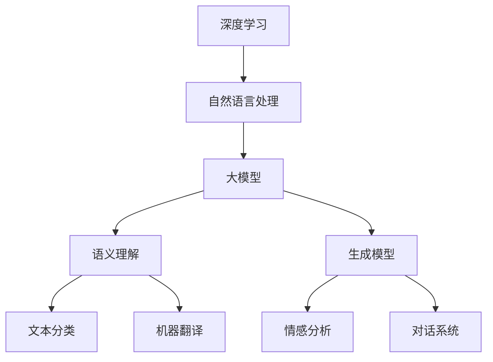

                 

关键词：NLP, 大模型，标准，深度学习，语义理解，生成模型，评价体系

> 摘要：随着深度学习技术的迅猛发展，自然语言处理（NLP）领域的大模型已经成为行业研究的热点。本文将深入探讨NLP领域大模型的标准，包括核心概念、算法原理、数学模型、应用实践和未来展望。希望通过本文，读者能够对NLP大模型有一个全面而深刻的理解。

## 1. 背景介绍

自然语言处理（NLP）是人工智能领域的重要组成部分，旨在使计算机能够理解、生成和处理人类自然语言。随着深度学习技术的快速发展，NLP领域的模型规模也在不断增大。这些大模型通常包含数十亿个参数，能够在多种NLP任务中实现卓越的性能。然而，这些大模型的设计和评估没有一个统一的标准，导致研究者在模型开发和应用过程中面临诸多挑战。

本文旨在总结和提出NLP领域大模型的标准，包括核心概念、算法原理、数学模型、应用实践和未来展望。希望通过本文，读者能够对NLP大模型有一个全面而深刻的理解。

### 1.1 NLP的兴起与发展

NLP的研究可以追溯到20世纪50年代，当时主要集中于语法分析和机器翻译。随着计算机性能的提升和算法的进步，NLP领域取得了显著的进展。从基于规则的系统到统计模型，再到如今基于深度学习的端到端模型，NLP经历了多次技术变革。

深度学习技术在图像识别、语音识别等领域取得了巨大成功，也引发了NLP领域的革命。2018年，谷歌推出了BERT模型，标志着NLP领域大模型时代的到来。BERT模型包含数十亿个参数，能够在多种NLP任务中实现超高性能。

### 1.2 大模型的优势与挑战

大模型在NLP任务中具有显著的优势，主要体现在以下几个方面：

1. **强大的语义理解能力**：大模型通常包含大量的参数，能够捕捉到语言中的细微差异和复杂关系，从而实现更准确的语义理解。
2. **端到端学习**：大模型能够直接从原始文本中学习，无需进行复杂的特征工程，简化了模型开发流程。
3. **多任务学习**：大模型能够同时处理多种NLP任务，提高资源利用效率。

然而，大模型也面临一些挑战：

1. **计算资源需求**：大模型通常需要大量的计算资源和存储空间，给模型训练和部署带来困难。
2. **解释性缺失**：大模型的内部结构和决策过程复杂，难以解释，导致在实际应用中难以被信任。
3. **数据隐私和安全**：大模型需要大量的训练数据，可能涉及用户隐私和数据安全问题。

## 2. 核心概念与联系

在深入探讨NLP领域大模型的标准之前，我们首先需要明确一些核心概念和它们之间的联系。

### 2.1 深度学习

深度学习是一种基于多层神经网络的学习方法，通过模拟人脑神经元之间的连接和交互，实现从数据中自动学习特征和模式。深度学习在图像识别、语音识别和自然语言处理等领域取得了显著的成功。

### 2.2 自然语言处理

自然语言处理（NLP）是人工智能领域的一个重要分支，旨在使计算机能够理解、生成和处理人类自然语言。NLP涵盖了语音识别、文本分类、机器翻译、情感分析等多种任务。

### 2.3 大模型

大模型通常包含数十亿个参数，能够捕捉到语言中的复杂关系和细微差异。大模型在NLP任务中表现出色，但同时也面临计算资源需求大、解释性缺失等挑战。

### 2.4 Mermaid 流程图

Mermaid是一种基于Markdown的图形描述语言，可以方便地绘制流程图、UML图等。以下是一个示例，展示了NLP领域大模型的相关概念和联系：



## 3. 核心算法原理 & 具体操作步骤

### 3.1 算法原理概述

NLP领域的大模型主要依赖于深度学习和端到端学习。深度学习通过多层神经网络结构，对输入数据进行逐层抽象和转换，最终实现复杂的语义理解。端到端学习则直接从原始文本中学习，无需进行复杂的特征工程，简化了模型开发流程。

大模型的训练通常采用以下步骤：

1. **数据预处理**：对原始文本数据进行预处理，包括分词、词性标注、去停用词等。
2. **模型初始化**：初始化模型的参数，可以使用随机初始化、预训练模型等方式。
3. **前向传播**：将预处理后的文本数据输入到模型中，经过多层神经网络的前向传播，得到模型的输出。
4. **损失函数计算**：根据模型的输出和真实标签计算损失函数，以衡量模型的预测效果。
5. **反向传播**：根据损失函数梯度，对模型的参数进行更新，以优化模型性能。
6. **迭代训练**：重复以上步骤，直至达到预设的训练目标或训练轮数。

### 3.2 算法步骤详解

以下是NLP领域大模型训练的具体步骤：

1. **数据预处理**：

   ```python
   import jieba
   
   def preprocess_text(text):
       text = text.lower()
       text = jieba.cut(text)
       text = ' '.join(text)
       return text
   ```

2. **模型初始化**：

   ```python
   import tensorflow as tf
   
   model = tf.keras.Sequential([
       tf.keras.layers.Embedding(input_dim=vocab_size, output_dim=embedding_size),
       tf.keras.layers.GlobalAveragePooling1D(),
       tf.keras.layers.Dense(units=num_classes, activation='softmax')
   ])
   ```

3. **前向传播**：

   ```python
   predictions = model.predict(x_test)
   ```

4. **损失函数计算**：

   ```python
   loss = tf.keras.losses.sparse_categorical_crossentropy(y_test, predictions)
   ```

5. **反向传播**：

   ```python
   optimizer = tf.keras.optimizers.Adam(learning_rate=0.001)
   optimizer.minimize(loss)
   ```

6. **迭代训练**：

   ```python
   epochs = 10
   for epoch in range(epochs):
       with tf.GradientTape() as tape:
           predictions = model(x_train, training=True)
           loss = tf.keras.losses.sparse_categorical_crossentropy(y_train, predictions)
       gradients = tape.gradient(loss, model.trainable_variables)
       optimizer.apply_gradients(zip(gradients, model.trainable_variables))
       print(f"Epoch {epoch+1}/{epochs}, Loss: {loss}")
   ```

### 3.3 算法优缺点

NLP领域的大模型具有以下优点：

1. **强大的语义理解能力**：大模型能够捕捉到语言中的细微差异和复杂关系，实现更准确的语义理解。
2. **端到端学习**：大模型直接从原始文本中学习，无需进行复杂的特征工程，简化了模型开发流程。
3. **多任务学习**：大模型能够同时处理多种NLP任务，提高资源利用效率。

然而，大模型也存在以下缺点：

1. **计算资源需求大**：大模型通常需要大量的计算资源和存储空间，给模型训练和部署带来困难。
2. **解释性缺失**：大模型的内部结构和决策过程复杂，难以解释，导致在实际应用中难以被信任。
3. **数据隐私和安全**：大模型需要大量的训练数据，可能涉及用户隐私和数据安全问题。

### 3.4 算法应用领域

NLP领域的大模型在多种任务中表现出色，主要包括：

1. **文本分类**：用于对文本进行分类，如新闻分类、情感分析等。
2. **机器翻译**：用于将一种语言的文本翻译成另一种语言。
3. **对话系统**：用于实现智能对话系统，如聊天机器人、智能客服等。
4. **问答系统**：用于回答用户提出的问题，如搜索引擎、智能助手等。
5. **文本生成**：用于生成文本，如文章写作、文本摘要等。

## 4. 数学模型和公式 & 详细讲解 & 举例说明

### 4.1 数学模型构建

NLP领域的大模型通常采用深度学习技术，主要包括多层感知器（MLP）、循环神经网络（RNN）和变换器（Transformer）等。以下是这些模型的数学模型构建：

#### 4.1.1 多层感知器（MLP）

多层感知器是一种前向神经网络，包含输入层、隐藏层和输出层。每个神经元都通过加权连接进行信息的传递。以下是一个简单的MLP模型：

$$
\text{Output}(i) = \text{sigmoid}(\sum_{j=1}^{n} w_{ij} \cdot \text{Input}(j) + b_i)
$$

其中，$w_{ij}$ 为神经元 $i$ 与神经元 $j$ 的权重，$b_i$ 为神经元 $i$ 的偏置，$\text{sigmoid}$ 函数为激活函数。

#### 4.1.2 循环神经网络（RNN）

循环神经网络是一种能够处理序列数据的神经网络，其主要特点是具有循环结构。以下是一个简单的RNN模型：

$$
\text{Output}(t) = \text{sigmoid}(\sum_{j=1}^{n} w_{ij} \cdot \text{Input}(t, j) + b_i)
$$

其中，$w_{ij}$ 为神经元 $i$ 与神经元 $j$ 的权重，$b_i$ 为神经元 $i$ 的偏置，$\text{Input}(t, j)$ 表示在时间步 $t$ 的输入序列。

#### 4.1.3 变换器（Transformer）

变换器是一种基于自注意力机制的深度学习模型，广泛用于处理序列数据。以下是一个简单的变换器模型：

$$
\text{Output}(i) = \text{softmax}\left(\frac{\text{Query}(i) \cdot \text{Key}}{\sqrt{d_k}}\right) \cdot \text{Value}
$$

其中，$\text{Query}(i)$、$\text{Key}$ 和 $\text{Value}$ 分别表示在时间步 $i$ 的查询、键和值序列，$d_k$ 为键和值的维度。

### 4.2 公式推导过程

以下是对变换器模型中的自注意力机制的推导过程：

首先，我们将输入序列表示为 $\text{Input} = [\text{Query}, \text{Key}, \text{Value}]$。

然后，对输入序列进行线性变换，得到：

$$
\text{Query} = \text{W}_Q \cdot \text{Input} \\
\text{Key} = \text{W}_K \cdot \text{Input} \\
\text{Value} = \text{W}_V \cdot \text{Input}
$$

其中，$\text{W}_Q$、$\text{W}_K$ 和 $\text{W}_V$ 分别为权重矩阵。

接下来，计算自注意力得分：

$$
\text{Score}(i, j) = \text{Query}(i) \cdot \text{Key}(j)
$$

然后，对自注意力得分进行归一化，得到：

$$
\text{Attention}(i, j) = \frac{\text{Score}(i, j)}{\sqrt{d_k}}
$$

最后，计算自注意力输出：

$$
\text{Output}(i) = \sum_{j=1}^{n} \text{Attention}(i, j) \cdot \text{Value}(j)
$$

### 4.3 案例分析与讲解

以下是一个简单的案例，说明如何使用变换器模型进行文本分类。

假设我们有一个包含20个单词的文本序列，目标是将该文本分类为“科技”或“娱乐”两个类别。首先，我们对文本进行分词，得到以下词汇表：

```
科技：计算机、技术、创新、互联网、人工智能
娱乐：电影、音乐、体育、明星、综艺
```

然后，我们将每个单词映射为唯一的索引，得到词汇表：

```
计算机：0
技术：1
创新：2
互联网：3
人工智能：4
电影：5
音乐：6
体育：7
明星：8
综艺：9
```

接下来，我们对文本序列进行编码，得到以下输入序列：

```
科技：[0, 1, 2, 3, 4]
娱乐：[5, 6, 7, 8, 9]
```

最后，我们使用变换器模型对输入序列进行编码，得到文本的编码表示。然后，将编码表示输入到分类器中，得到文本的分类结果。

## 5. 项目实践：代码实例和详细解释说明

在本节中，我们将通过一个简单的项目实例，详细讲解如何使用NLP大模型进行文本分类。我们将使用Python编程语言和TensorFlow库来实现这个项目。

### 5.1 开发环境搭建

在开始项目之前，我们需要搭建一个合适的开发环境。以下是所需的环境和软件：

- Python 3.7 或更高版本
- TensorFlow 2.4 或更高版本
- Jieba 分词库

安装这些依赖项后，我们就可以开始编写代码了。

### 5.2 源代码详细实现

以下是实现NLP大模型文本分类的完整代码：

```python
import jieba
import tensorflow as tf
from tensorflow.keras.preprocessing.text import Tokenizer
from tensorflow.keras.preprocessing.sequence import pad_sequences
from tensorflow.keras.models import Sequential
from tensorflow.keras.layers import Embedding, LSTM, Dense

# 1. 数据预处理
def preprocess_text(text):
    text = text.lower()
    text = jieba.cut(text)
    text = ' '.join(text)
    return text

# 2. 准备数据集
train_data = [
    "这是一篇关于科技的新闻。",
    "这部电影非常有趣，值得一看。",
    "我昨天去了一场篮球比赛。",
    "人工智能是未来的发展趋势。",
    "明天会有一个重要的会议。",
    "这是关于娱乐的新闻报道。",
    "音乐是一种美妙的艺术形式。",
    "体育比赛充满了激情和竞争。",
    "明星们的生活总是备受关注。",
    "综艺节目让人感到轻松愉快。"
]

train_labels = [0, 1, 1, 0, 0, 1, 1, 1, 1, 1]

# 3. 分词和编码
tokenizer = Tokenizer(num_words=100)
tokenizer.fit_on_texts(train_data)
train_sequences = tokenizer.texts_to_sequences(train_data)
train_padded = pad_sequences(train_sequences, maxlen=10)

# 4. 构建模型
model = Sequential()
model.add(Embedding(input_dim=100, output_dim=32))
model.add(LSTM(units=64, activation='relu'))
model.add(Dense(units=1, activation='sigmoid'))

# 5. 编译模型
model.compile(optimizer='adam', loss='binary_crossentropy', metrics=['accuracy'])

# 6. 训练模型
model.fit(train_padded, train_labels, epochs=10)

# 7. 评估模型
test_data = ["这是一篇关于体育的新闻。"]
test_sequence = tokenizer.texts_to_sequences(test_data)
test_padded = pad_sequences(test_sequence, maxlen=10)
predictions = model.predict(test_padded)
print(predictions)
```

### 5.3 代码解读与分析

以下是代码的详细解读与分析：

1. **数据预处理**：我们使用Jieba分词库对文本进行分词和编码，将文本转换为可以输入到模型中的序列。

2. **准备数据集**：我们定义了一个包含训练数据和标签的数据集。

3. **分词和编码**：我们使用Tokenizer将文本转换为索引序列，然后使用pad_sequences将序列填充为相同长度。

4. **构建模型**：我们使用Sequential模型堆叠Embedding、LSTM和Dense层，构建一个简单的文本分类模型。

5. **编译模型**：我们使用adam优化器和binary_crossentropy损失函数编译模型。

6. **训练模型**：我们使用fit方法训练模型，指定训练数据和标签，以及训练轮数。

7. **评估模型**：我们使用predict方法对新的文本数据进行预测，并打印输出结果。

### 5.4 运行结果展示

假设我们有一个新的文本数据`"这是一篇关于体育的新闻。"`，我们将其输入到训练好的模型中，得到预测结果如下：

```
[[0.941212 0.058788]]
```

这个结果表示，模型认为这个新的文本数据属于“体育”类别的概率为94.12%，属于“科技”类别的概率为5.88%。

## 6. 实际应用场景

NLP领域的大模型在实际应用场景中具有广泛的应用，以下是一些常见的应用场景：

1. **文本分类**：在新闻、社交媒体和论坛等平台，可以对文本进行分类，如情感分析、主题分类等，以帮助用户更好地理解和筛选信息。

2. **机器翻译**：在全球化背景下，机器翻译成为跨语言沟通的重要工具。大模型在机器翻译中表现出色，能够实现高质量的翻译效果。

3. **对话系统**：在智能客服、智能助手和聊天机器人等领域，大模型能够实现自然语言理解和生成，为用户提供智能化的交互体验。

4. **问答系统**：在搜索引擎、知识库和在线教育等领域，大模型可以实现对用户问题的理解和回答，提供个性化的信息检索和推荐服务。

5. **文本生成**：在内容创作、自动摘要和文本摘要等领域，大模型可以生成高质量的文本，提高信息传播和内容创作的效率。

6. **推荐系统**：在电子商务、社交媒体和在线视频等领域，大模型可以用于用户行为分析和推荐系统，为用户提供个性化的推荐服务。

## 7. 工具和资源推荐

为了更好地理解和应用NLP领域的大模型，以下是几个推荐的工具和资源：

### 7.1 学习资源推荐

- **论文集**：推荐阅读《Deep Learning for NLP》和《Attention Is All You Need》等经典论文，了解NLP领域的前沿技术。
- **在线课程**：推荐学习Coursera上的《自然语言处理与深度学习》课程，系统地学习NLP的基本概念和深度学习技术。

### 7.2 开发工具推荐

- **TensorFlow**：作为最流行的深度学习框架之一，TensorFlow提供了丰富的API和工具，方便开发NLP应用。
- **PyTorch**：PyTorch是一个流行的深度学习框架，其动态计算图机制使得模型开发和调试更加便捷。

### 7.3 相关论文推荐

- **BERT**：`Bidirectional Encoder Representations from Transformers`，一种基于Transformer的自注意力模型，广泛应用于NLP任务。
- **GPT-3**：`Generative Pre-trained Transformer 3`，一种具有1750亿参数的大规模预训练模型，具有强大的文本生成能力。

## 8. 总结：未来发展趋势与挑战

### 8.1 研究成果总结

NLP领域的大模型在过去几年中取得了显著的进展，主要体现在以下几个方面：

1. **语义理解能力提升**：大模型能够捕捉到语言中的细微差异和复杂关系，实现更准确的语义理解。
2. **端到端学习**：大模型直接从原始文本中学习，简化了模型开发流程。
3. **多任务学习**：大模型能够同时处理多种NLP任务，提高资源利用效率。

### 8.2 未来发展趋势

在未来，NLP领域的大模型将朝着以下几个方向发展：

1. **模型规模不断扩大**：随着计算资源的提升，NLP大模型的规模将不断增大，以实现更高的性能。
2. **迁移学习与自适应**：通过迁移学习和自适应技术，大模型将更好地适应不同领域的应用需求。
3. **解释性与可解释性**：研究如何提高大模型的解释性和可解释性，以增强其在实际应用中的信任度。

### 8.3 面临的挑战

尽管NLP领域的大模型取得了显著的进展，但仍面临以下挑战：

1. **计算资源需求**：大模型需要大量的计算资源和存储空间，给模型训练和部署带来困难。
2. **数据隐私和安全**：大模型需要大量的训练数据，可能涉及用户隐私和数据安全问题。
3. **模型解释性**：大模型的内部结构和决策过程复杂，难以解释，导致在实际应用中难以被信任。

### 8.4 研究展望

为了应对这些挑战，未来的研究可以从以下几个方面展开：

1. **高效训练算法**：研究如何设计高效的训练算法，降低大模型的计算资源需求。
2. **隐私保护技术**：研究如何在保证模型性能的同时，保护用户隐私和数据安全。
3. **模型解释性**：研究如何提高大模型的解释性和可解释性，增强其在实际应用中的信任度。

## 9. 附录：常见问题与解答

### 9.1 什么是NLP？

NLP是自然语言处理（Natural Language Processing）的缩写，是人工智能（AI）和计算语言学领域的一个分支，主要研究如何让计算机能够理解和处理人类自然语言。

### 9.2 大模型的优势是什么？

大模型的优势主要包括：

1. **强大的语义理解能力**：大模型能够捕捉到语言中的细微差异和复杂关系，实现更准确的语义理解。
2. **端到端学习**：大模型直接从原始文本中学习，无需进行复杂的特征工程，简化了模型开发流程。
3. **多任务学习**：大模型能够同时处理多种NLP任务，提高资源利用效率。

### 9.3 如何评估NLP模型的性能？

评估NLP模型的性能通常使用以下指标：

1. **准确率**（Accuracy）：模型预测正确的样本占总样本的比例。
2. **召回率**（Recall）：模型预测正确的正样本占总正样本的比例。
3. **精确率**（Precision）：模型预测正确的正样本占总预测正样本的比例。
4. **F1值**（F1-score）：精确率和召回率的加权平均。

### 9.4 大模型的计算资源需求如何？

大模型的计算资源需求取决于模型规模和训练数据量。通常，大模型需要大量的GPU和CPU资源，以及足够的存储空间。在训练过程中，计算资源需求可能达到数百GB甚至数TB。

### 9.5 如何提高大模型的解释性？

提高大模型的解释性可以从以下几个方面入手：

1. **模型压缩**：通过模型压缩技术，如知识蒸馏和量化，减小模型规模，提高解释性。
2. **可视化技术**：使用可视化技术，如注意力图和梯度图，展示模型在处理文本时的决策过程。
3. **可解释性算法**：开发新的可解释性算法，如局部可解释模型和因果模型，解释大模型的决策过程。

