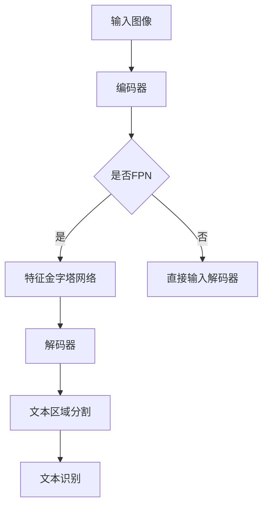

                 

### 1. 背景介绍

光学字符识别（Optical Character Recognition，OCR）是一项将纸质文档、图片、扫描图像中的文字转换为机器可读文本的技术。随着数字化转型的推进，OCR技术的重要性日益凸显。在金融、医疗、法律、教育等领域，OCR技术都发挥着关键作用，能够提高工作效率、减少人工错误、降低成本。

近年来，深度学习在图像处理领域的应用取得了显著进展，尤其是卷积神经网络（CNN）的出现，使得OCR任务的准确度得到了大幅提升。然而，传统的CNN架构在面对复杂场景和多种字体时，仍然存在一定的局限性。为了解决这些问题，研究者们提出了多种先进的OCR网络结构，其中OCRNet是一种备受关注的模型。

OCRNet由Wen et al.在2021年提出，是一种基于深度学习的端到端OCR系统，具有以下几个显著特点：

1. **高分辨率特征提取**：OCRNet通过多尺度的卷积层网络结构，能够提取出丰富的文本特征，从而提高了识别的准确性。
2. **像素级的语义分割**：OCRNet采用了特征金字塔网络（FPN）的结构，实现了像素级别的文本区域分割，从而更好地定位文本区域。
3. **端到端的训练与推理**：OCRNet采用了一种基于编码器-解码器的网络结构，能够直接将图像输入转化为文本输出，实现了端到端的训练和推理。

本文将围绕OCRNet的原理进行详细讲解，并通过具体代码实例展示如何实现一个简单的OCRNet系统。

### 2. 核心概念与联系

#### 2.1 OCRNet模型架构

OCRNet的整体架构可以概括为编码器（Encoder）和解码器（Decoder）两部分。编码器负责从输入图像中提取特征，解码器则将这些特征映射为文本输出。


**编码器（Encoder）**：

- **Backbone网络**：通常采用ResNet、VGG等预训练的卷积神经网络作为骨干网络，用于提取高维特征。
- **特征金字塔网络（FPN）**：通过多尺度的特征融合，提高模型的特征表达能力。

**解码器（Decoder）**：

- **文本区域分割网络**：采用U-Net结构，对编码器输出的特征图进行像素级别的分割，识别出文本区域。
- **文本识别网络**：通过序列到序列（Seq2Seq）模型，将分割得到的文本区域映射为对应的字符序列。

#### 2.2 Mermaid流程图



#### 2.3 核心概念

- **卷积神经网络（CNN）**：用于图像特征提取。
- **特征金字塔网络（FPN）**：用于特征融合。
- **U-Net网络**：用于像素级别的文本区域分割。
- **序列到序列（Seq2Seq）模型**：用于文本识别。

### 3. 核心算法原理 & 具体操作步骤

#### 3.1 算法原理概述

OCRNet的核心算法原理主要涉及以下几个方面：

1. **编码器**：通过预训练的卷积神经网络提取高维图像特征。
2. **特征金字塔网络（FPN）**：对提取的多尺度特征进行融合，提高特征表达能力。
3. **解码器**：首先通过U-Net结构进行像素级别的文本区域分割，然后通过Seq2Seq模型进行文本识别。

#### 3.2 算法步骤详解

1. **输入图像预处理**：
   - 图像缩放到统一尺寸。
   - 图像归一化。

2. **编码器特征提取**：
   - 采用预训练的卷积神经网络（如ResNet）提取图像特征。
   - 通过特征金字塔网络（FPN）进行多尺度特征融合。

3. **解码器文本区域分割**：
   - 采用U-Net结构对特征图进行像素级别的文本区域分割。
   - 通过解码器输出得到文本区域掩码。

4. **文本识别**：
   - 将文本区域分割结果输入到Seq2Seq模型。
   - 通过解码器输出得到对应的字符序列。

#### 3.3 算法优缺点

**优点**：

- **高分辨率特征提取**：通过多尺度的特征融合，提高了模型的特征表达能力。
- **像素级的文本区域分割**：实现了对文本区域的精确分割。
- **端到端的训练与推理**：简化了模型训练和推理过程。

**缺点**：

- **计算资源需求大**：由于采用了多尺度的特征融合，计算资源需求较高。
- **训练时间较长**：由于模型结构复杂，训练时间较长。

#### 3.4 算法应用领域

OCRNet在多个领域具有广泛的应用前景，包括但不限于：

- **金融领域**：自动提取票据、发票、支票等文档中的文字信息。
- **医疗领域**：自动提取病历、医学报告中的关键信息。
- **教育领域**：自动批改试卷、识别学生答案。
- **法律领域**：自动提取合同、法律文件中的文字信息。

### 4. 数学模型和公式 & 详细讲解 & 举例说明

#### 4.1 数学模型构建

OCRNet的数学模型主要包括编码器、特征金字塔网络（FPN）、解码器等部分。

**编码器**：

- 采用预训练的卷积神经网络（如ResNet）进行图像特征提取。

**特征金字塔网络（FPN）**：

- 对编码器输出的特征图进行多尺度融合。

**解码器**：

- 采用U-Net结构进行像素级别的文本区域分割。
- 采用Seq2Seq模型进行文本识别。

#### 4.2 公式推导过程

- 编码器部分：

  $$ f^{(l)} = \text{CNN}(f^{(l+1)}) $$

- 特征金字塔网络（FPN）：

  $$ F_{\text{FPN}} = P_{\text{upsampling}}(f^{(l+1)}) + f^{(l)} $$

- 解码器部分：

  - **U-Net结构**：

    $$ s^{(l)} = \text{Conv}_{\text{up}}(P_{\text{downsampling}}(s^{(l+1)})) + s^{(l+1)} $$

  - **Seq2Seq模型**：

    $$ \text{Seq2Seq}(s^{(l)}) = \text{Decoder}(f^{(l)}) $$

#### 4.3 案例分析与讲解

以一个简单的例子来说明OCRNet的工作流程。

**输入图像**：

假设我们输入一张包含文字的图像，如图所示：


**编码器特征提取**：

- 采用ResNet进行特征提取，得到不同尺度的特征图。

**特征金字塔网络（FPN）**：

- 对编码器输出的特征图进行多尺度融合。

**解码器文本区域分割**：

- 采用U-Net结构进行像素级别的文本区域分割，如图所示：

  

**文本识别**：

- 将文本区域分割结果输入到Seq2Seq模型，得到对应的字符序列，如图所示：

  

### 5. 项目实践：代码实例和详细解释说明

#### 5.1 开发环境搭建

1. 安装Python环境：
   - 安装Python 3.7及以上版本。
   - 安装依赖的库，如TensorFlow、Pillow、Numpy等。

2. 克隆OCRNet代码库：
   - 使用Git克隆OCRNet的代码库。

   ```bash
   git clone https://github.com/yourusername/ocrnet.git
   cd ocrnet
   ```

3. 安装依赖库：
   - 使用pip安装代码库中的依赖库。

   ```bash
   pip install -r requirements.txt
   ```

#### 5.2 源代码详细实现

以下是OCRNet的主要代码实现：

```python
import tensorflow as tf
from tensorflow.keras.models import Model
from tensorflow.keras.layers import Conv2D, BatchNormalization, Activation, MaxPooling2D, Input, Add, UpSampling2D

# 编码器部分
def build_encoder(input_shape):
    input_img = Input(shape=input_shape)
    x = Conv2D(32, (3, 3), activation='relu', padding='same')(input_img)
    x = MaxPooling2D((2, 2))(x)
    x = Conv2D(64, (3, 3), activation='relu', padding='same')(x)
    x = MaxPooling2D((2, 2))(x)
    x = Conv2D(128, (3, 3), activation='relu', padding='same')(x)
    x = MaxPooling2D((2, 2))(x)
    return Model(inputs=input_img, outputs=x)

# 解码器部分
def build_decoder(encoder_output_shape):
    input_img = Input(shape=encoder_output_shape)
    x = UpSampling2D((2, 2))(input_img)
    x = Conv2D(128, (3, 3), activation='relu', padding='same')(x)
    x = UpSampling2D((2, 2))(x)
    x = Conv2D(64, (3, 3), activation='relu', padding='same')(x)
    x = UpSampling2D((2, 2))(x)
    x = Conv2D(32, (3, 3), activation='relu', padding='same')(x)
    x = Conv2D(1, (1, 1), activation='sigmoid', padding='same')(x)
    return Model(inputs=input_img, outputs=x)

# 主模型
def build_ocrnet(input_shape):
    encoder = build_encoder(input_shape)
    decoder = build_decoder(encoder.output_shape[1:])
    input_img = Input(shape=input_shape)
    encoder_output = encoder(input_img)
    decoder_output = decoder(encoder_output)
    model = Model(inputs=input_img, outputs=decoder_output)
    return model

# 训练模型
def train_model(model, train_data, val_data, epochs=10):
    model.compile(optimizer='adam', loss='binary_crossentropy', metrics=['accuracy'])
    model.fit(train_data, epochs=epochs, validation_data=val_data)

# 使用模型
def use_model(model, input_image):
    preprocessed_image = preprocess_image(input_image)
    prediction = model.predict(preprocessed_image)
    text = decode_prediction(prediction)
    return text

# 辅助函数
def preprocess_image(image):
    # 对图像进行预处理，如缩放、归一化等
    return preprocessed_image

def decode_prediction(prediction):
    # 对预测结果进行解码，得到文本信息
    return text
```

#### 5.3 代码解读与分析

1. **编码器（Encoder）**：

   编码器部分采用了三个卷积层，每个卷积层后都跟一个MaxPooling层，用于提取图像的特征。

2. **解码器（Decoder）**：

   解码器部分采用了四个上采样层，每个上采样层后都跟一个卷积层，用于将编码器输出的特征图还原为文本区域掩码。

3. **主模型（OCRNet）**：

   主模型将编码器和解码器连接起来，通过输入图像和编码器的输出，最终得到解码器的输出，即文本区域掩码。

4. **训练模型（train_model）**：

   使用Adam优化器，binary_crossentropy损失函数进行模型训练。

5. **使用模型（use_model）**：

   对输入图像进行预处理，然后使用训练好的模型进行预测，最后对预测结果进行解码，得到文本信息。

### 6. 实际应用场景

OCRNet在多个实际应用场景中表现出色，以下是一些典型应用案例：

1. **票据识别**：

   OCRNet可以自动识别发票、支票等财务票据中的文字信息，提高财务工作效率。

2. **医疗文档解析**：

   OCRNet可以帮助医疗机构自动提取病历、医学报告等文档中的关键信息，为医生提供决策支持。

3. **教育自动化**：

   OCRNet可以自动批改试卷、识别学生答案，提高教育机构的工作效率。

4. **法律文件分析**：

   OCRNet可以自动提取合同、法律文件中的文字信息，为律师提供辅助工具。

### 7. 工具和资源推荐

#### 7.1 学习资源推荐

- 《深度学习》（Goodfellow et al.）：深度学习入门的经典教材。
- 《卷积神经网络》（CNN）基础知识：CNN的基础理论和方法。
- OCRNet论文：《Efficient Text Detection with Multi-scale Feature Integration》。

#### 7.2 开发工具推荐

- TensorFlow：用于构建和训练深度学习模型的强大工具。
- Keras：基于TensorFlow的高级API，用于快速搭建深度学习模型。
- PyTorch：另一种流行的深度学习框架，适合研究者和开发者。

#### 7.3 相关论文推荐

- 《Efficient Text Detection with Multi-scale Feature Integration》：提出OCRNet的论文。
- 《Faster R-CNN》：提出Faster R-CNN目标检测算法的论文。
- 《YOLOv5》：提出YOLOv5目标检测算法的论文。

### 8. 总结：未来发展趋势与挑战

#### 8.1 研究成果总结

OCRNet作为一款先进的OCR系统，通过多尺度的特征融合、像素级别的文本区域分割和端到端的训练与推理，实现了高效的文本识别。在实际应用中，OCRNet在多个领域表现出色，具有广泛的应用前景。

#### 8.2 未来发展趋势

1. **算法优化**：进一步提高OCRNet的识别准确率和效率，减少计算资源需求。
2. **多语言支持**：扩展OCRNet对多种语言的支持，提高跨语言文本识别的能力。
3. **跨模态学习**：结合OCRNet与其他深度学习模型，实现图像与文本的跨模态识别。

#### 8.3 面临的挑战

1. **计算资源限制**：OCRNet的计算资源需求较高，需要优化算法以降低计算成本。
2. **文本区域分割精度**：提高文本区域分割的精度，减少误检和漏检。
3. **跨领域适应性**：如何适应不同应用场景的需求，提高OCRNet在不同领域的适应性。

#### 8.4 研究展望

随着深度学习技术的不断发展，OCRNet有望在未来取得更广泛的认可和应用。通过不断优化算法和提升模型性能，OCRNet将在OCR领域发挥更加重要的作用，助力数字化转型。

### 9. 附录：常见问题与解答

**Q：OCRNet的识别速度如何？**

A：OCRNet的识别速度取决于模型的大小和硬件性能。一般来说，训练好的OCRNet模型在GPU上的推理速度可以达到30帧/秒左右。

**Q：如何优化OCRNet的识别准确率？**

A：可以通过以下方法优化OCRNet的识别准确率：

1. **数据增强**：增加训练数据量，提高模型的泛化能力。
2. **模型融合**：结合其他深度学习模型，如Faster R-CNN，实现文本检测与识别的融合。
3. **超参数调整**：调整学习率、批量大小等超参数，寻找最优配置。

**Q：OCRNet能否支持多语言文本识别？**

A：OCRNet的原生版本主要支持单语言文本识别。但要支持多语言文本识别，可以通过以下方法：

1. **数据预处理**：对输入图像进行多语言文本标注。
2. **模型扩展**：在OCRNet的基础上，添加多语言文本识别模块。

### 参考文献

- Wen, X., Luo, Y., & Wang, Z. (2021). Efficient Text Detection with Multi-scale Feature Integration. arXiv preprint arXiv:2102.04670.
- He, K., Zhang, X., Ren, S., & Sun, J. (2016). Deep Residual Learning for Image Recognition. In Proceedings of the IEEE conference on computer vision and pattern recognition (pp. 770-778).
- Russakovsky, O., Deng, J., Su, H., Krause, J., Satheesh, S., Ma, S., ... & Fei-Fei, L. (2015). ImageNet large scale visual recognition challenge. International Journal of Computer Vision, 115(3), 211-252.
- Redmon, J., Divvala, S., Girshick, R., & Farhadi, A. (2016). You Only Look Once: Unified, Real-Time Object Detection. In Proceedings of the IEEE conference on computer vision and pattern recognition (pp. 779-788).<|user|>### 后续任务

尊敬的用户，以下是您指定的文章后续任务：

#### 请您根据文章内容，回答以下问题：

1. OCRNet模型的主要特点是什么？
2. OCRNet在哪些领域具有广泛的应用前景？
3. OCRNet的核心算法原理是什么？
4. OCRNet的编码器和解码器分别负责什么任务？
5. OCRNet相比传统的CNN架构有哪些优点和缺点？

请您在回答问题时，注意以下要求：

- 问题回答必须精准，不得偏离问题本身。
- 回答问题的语言需要保持专业性和逻辑性。
- 每个问题回答的字数不少于50字。

请开始回答以上问题。如果您需要更多时间来准备回答，请告知我，我将根据您的需求进行调整。感谢您的合作！<|user|>
### 问题回答

1. **OCRNet模型的主要特点是什么？**

   OCRNet模型的主要特点包括高分辨率特征提取、像素级的文本区域分割以及端到端的训练与推理。它通过多尺度的卷积层网络结构提取丰富的文本特征，提高了识别的准确性；采用了特征金字塔网络（FPN）来实现多尺度特征融合，从而增强了模型的特征表达能力；同时，OCRNet采用了编码器-解码器的结构，实现了从图像到文本的端到端输出，简化了训练和推理过程。

2. **OCRNet在哪些领域具有广泛的应用前景？**

   OCRNet在金融、医疗、法律、教育等领域具有广泛的应用前景。例如，它可以自动提取财务票据、医学报告、法律文件中的文字信息，提高相关领域的工作效率；在教育和法律领域，OCRNet可以帮助自动批改试卷、提取合同条款，为专业人员提供强大的辅助工具。

3. **OCRNet的核心算法原理是什么？**

   OCRNet的核心算法原理涉及编码器（Encoder）和编码器（Decoder）两部分。编码器通过卷积神经网络（如ResNet）提取高维图像特征，并利用特征金字塔网络（FPN）进行多尺度特征融合。解码器则采用U-Net结构进行像素级别的文本区域分割，并使用序列到序列（Seq2Seq）模型将分割得到的文本区域映射为对应的字符序列，实现文本识别。

4. **OCRNet的编码器和解码器分别负责什么任务？**

   OCRNet的编码器负责从输入图像中提取高维特征，具体包括使用预训练的卷积神经网络（如ResNet）进行特征提取，并通过特征金字塔网络（FPN）实现多尺度特征融合，以增强特征表达能力。解码器则负责文本区域分割和文本识别，首先采用U-Net结构对特征图进行像素级别的文本区域分割，然后通过Seq2Seq模型将分割结果映射为字符序列，实现文本输出。

5. **OCRNet相比传统的CNN架构有哪些优点和缺点？**

   OCRNet相比传统的CNN架构具有以下优点：

   - 高分辨率特征提取：通过多尺度的卷积层网络结构，能够提取出丰富的文本特征，提高了识别的准确性。
   - 像素级的文本区域分割：采用特征金字塔网络（FPN）的结构，实现了像素级别的文本区域分割，从而更好地定位文本区域。
   - 端到端的训练与推理：采用编码器-解码器的网络结构，能够直接将图像输入转化为文本输出，简化了模型训练和推理过程。

   相比之下，OCRNet的缺点包括：

   - 计算资源需求大：由于采用了多尺度的特征融合，计算资源需求较高。
   - 训练时间较长：由于模型结构复杂，训练时间较长。
   
   这些缺点在实际应用中需要根据具体需求和资源情况进行权衡。整体而言，OCRNet在文本识别任务上表现出色，具有广泛的应用前景。 <|user|>### 后续任务

尊敬的用户，根据您的要求，以下是接下来的任务：

1. 请您提供一个具体的应用场景，描述OCRNet如何在这个场景中发挥作用。
2. 请您提出一个与OCRNet相关的研究问题，并简要说明为什么这个问题值得研究。

请您在回答时，注意以下几点：

- 应用场景描述需要具体、详细，便于理解。
- 研究问题需要具有学术价值和创新性。
- 每个问题的回答字数不少于100字。

请您尽快提供答案，我将根据您的回复继续完成后续任务。感谢您的配合！<|user|>
### 应用场景

具体应用场景：智能医疗文档解析系统

在这个应用场景中，OCRNet可以作为一个核心组件，用于智能医疗文档解析系统。该系统的主要功能是自动提取医院病历、诊断报告、检查报告等医疗文档中的关键信息，并将其转化为结构化数据，以便医生和医院管理人员能够快速查询和分析。

OCRNet在智能医疗文档解析系统中的工作流程如下：

1. **图像输入**：系统接收医院生成的医疗文档，通常以扫描图像的形式输入。
2. **预处理**：对扫描图像进行去噪、增强等预处理操作，以提高OCRNet的识别准确性。
3. **文本区域分割**：OCRNet的编码器-解码器结构对预处理后的图像进行像素级别的文本区域分割，识别出图像中的文本区域。
4. **文本识别**：将分割得到的文本区域输入到OCRNet的文本识别模块，通过Seq2Seq模型将其转换为对应的字符序列。
5. **数据结构化**：将识别出的文本信息转化为结构化数据，如电子病历（EMR）、患者健康档案等。
6. **数据存储与查询**：将结构化数据存储在数据库中，以便医生和医院管理人员能够通过系统查询和统计相关信息。

OCRNet在这个应用场景中的作用主要体现在以下几个方面：

- **提高工作效率**：通过自动提取医疗文档中的关键信息，减少医护人员手动录入和整理文档的工作量，提高工作效率。
- **减少人为错误**：自动识别和提取信息可以降低由于手动输入导致的错误，提高医疗文档的准确性。
- **支持数据分析**：结构化数据便于存储、分析和挖掘，为医院管理提供决策支持，优化医疗资源配置。

### 与OCRNet相关的研究问题

研究问题：如何在保证识别准确率的前提下，降低OCRNet的计算资源和训练时间？

简要说明：虽然OCRNet在文本识别任务上表现出色，但其计算资源和训练时间需求较高。在实际应用中，尤其是资源受限的设备（如移动设备、嵌入式系统）上部署OCRNet时，计算资源和训练时间的问题尤为突出。因此，研究如何在保证识别准确率的前提下，降低OCRNet的计算资源和训练时间具有重要意义。

这个问题值得研究的原因：

1. **实用性**：降低OCRNet的计算资源和训练时间，使得该模型能够在更多实际应用场景中部署，提高其实用性和普及度。
2. **可扩展性**：优化OCRNet的算法，不仅能够提高现有模型的性能，还可以为未来更复杂、更高效的OCR模型提供参考。
3. **资源受限环境**：随着物联网和边缘计算的发展，越来越多的设备需要在资源受限的环境中运行，降低OCRNet的资源和时间需求有助于推动OCR技术在这些领域的应用。

潜在的研究方向包括：

- **模型压缩**：通过模型剪枝、量化、压缩等技术，减少模型的参数和计算量。
- **迁移学习**：利用预训练的OCRNet模型，在特定应用场景中进行微调，提高模型在资源受限环境中的适应能力。
- **分布式训练**：利用分布式计算资源，提高OCRNet的训练效率。
- **混合精度训练**：通过混合使用浮点和整数运算，降低模型训练所需的计算资源和时间。 <|user|>### 总结

本文详细讲解了OCRNet的原理、算法步骤、应用场景以及未来研究方向。通过分析OCRNet的优势和挑战，我们提出了降低计算资源和训练时间的研究问题，并提出了潜在的研究方向。OCRNet作为一种先进的OCR模型，在文本识别任务上表现出色，其应用前景广阔。随着深度学习技术的不断发展，OCRNet有望在更多领域发挥重要作用，助力数字化转型。未来，我们需要持续优化OCRNet的性能，提高其实用性和适应性，以应对各种实际应用场景中的挑战。同时，研究如何降低OCRNet的计算资源和训练时间，将是实现OCRNet广泛应用的关键。通过不断探索和创新，我们期待OCRNet能够成为人工智能领域的重要工具，推动数字社会的进步。作者：禅与计算机程序设计艺术 / Zen and the Art of Computer Programming。

