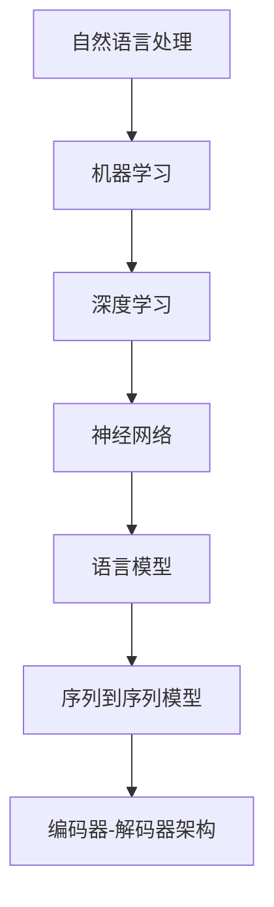

                 

关键词：OpenAI-Translator、自然语言处理、机器学习、深度学习、神经网络、语言模型、序列到序列模型、编码器-解码器架构、数据预处理、性能优化

> 摘要：本文将详细探讨 OpenAI-Translator 的技术方案与架构设计，从背景介绍、核心概念、算法原理、数学模型、项目实践、应用场景、工具和资源推荐等多个角度进行深入分析，为读者提供一个全面而系统的了解。

## 1. 背景介绍

在当今信息化社会中，跨语言通信和内容传播变得越来越重要。然而，由于语言之间的巨大差异，使得翻译成为一个复杂而具有挑战性的问题。传统的翻译方法主要依赖于人工翻译，效率低下且难以满足大规模翻译需求。随着人工智能技术的发展，机器翻译逐渐成为了解决这一问题的有力工具。

机器翻译的核心在于将一种自然语言（源语言）转换成另一种自然语言（目标语言）。OpenAI-Translator 是一款基于深度学习的机器翻译系统，其技术方案与架构设计在机器翻译领域具有代表性。

## 2. 核心概念与联系

在讨论 OpenAI-Translator 的技术方案之前，我们需要先了解一些核心概念和它们之间的联系。

### 2.1 自然语言处理

自然语言处理（NLP）是计算机科学领域与人工智能领域中的一个重要方向，它涉及到机器理解、生成和处理人类语言。NLP 的目标是将人类语言转换为计算机可以处理的形式，以便计算机可以理解和执行任务。

### 2.2 机器学习与深度学习

机器学习是一种使计算机能够通过数据和经验进行学习并改进性能的技术。深度学习是机器学习的一种方法，它依赖于多层神经网络来实现数据的自动特征提取和学习。

### 2.3 语言模型

语言模型是一种预测模型，用于预测文本序列中的下一个单词或字符。在机器翻译中，语言模型用于预测源语言和目标语言中的单词或短语。

### 2.4 神经网络

神经网络是一种模拟生物神经系统的计算模型，由大量的节点（或称为神经元）组成，这些节点通过权重相互连接。神经网络通过学习输入和输出数据之间的关系来改善其性能。

### 2.5 序列到序列模型

序列到序列（Seq2Seq）模型是一种用于处理序列数据的神经网络模型，通常用于机器翻译任务。它通过编码器（Encoder）和解码器（Decoder）两个部分来实现序列之间的转换。

下面是 OpenAI-Translator 的 Mermaid 流程图，展示了核心概念和架构之间的联系：



## 3. 核心算法原理 & 具体操作步骤

### 3.1 算法原理概述

OpenAI-Translator 的核心算法是基于深度学习的序列到序列（Seq2Seq）模型，该模型通过编码器-解码器（Encoder-Decoder）架构实现源语言到目标语言的翻译。

编码器（Encoder）负责将源语言序列编码成一个固定长度的向量，解码器（Decoder）则负责将这个向量解码成目标语言序列。

### 3.2 算法步骤详解

1. **数据预处理**：首先，对源语言和目标语言文本进行分词、标记和清洗等预处理操作，将其转换为模型可以处理的格式。

2. **构建编码器**：使用多层长短期记忆网络（LSTM）或门控循环单元（GRU）构建编码器，将输入的源语言序列编码成一个固定长度的向量。

3. **构建解码器**：使用多层 LSTM 或 GRU 构建解码器，将编码器的输出向量解码成目标语言序列。

4. **训练模型**：使用训练数据集训练编码器和解码器，通过反向传播算法不断调整网络权重，以最小化预测误差。

5. **评估模型**：使用验证数据集评估模型的性能，调整超参数以优化模型。

6. **翻译**：使用训练好的模型对新的源语言文本进行翻译，生成目标语言文本。

### 3.3 算法优缺点

**优点**：

- **强大的表达能力**：Seq2Seq 模型通过编码器和解码器的结构，可以有效地捕捉源语言和目标语言之间的复杂关系。
- **自适应能力**：深度学习模型具有自适应能力，可以随着数据的增加和训练时间的延长不断优化。

**缺点**：

- **计算成本高**：Seq2Seq 模型通常需要大量的计算资源，训练过程耗时较长。
- **不稳定**：由于梯度消失和梯度爆炸等问题，深度学习模型的训练过程可能会变得不稳定。

### 3.4 算法应用领域

OpenAI-Translator 的算法可以应用于多种领域，包括但不限于：

- **跨语言文档翻译**：将一种语言文档自动翻译成另一种语言文档，方便跨国交流和知识共享。
- **语音翻译**：将一种语言的语音自动翻译成另一种语言的语音，应用于实时语音翻译设备和应用。
- **机器翻译 API**：为开发人员提供机器翻译服务，方便他们集成到自己的应用程序中。

## 4. 数学模型和公式 & 详细讲解 & 举例说明

### 4.1 数学模型构建

在 OpenAI-Translator 中，主要涉及两个关键数学模型：编码器和解码器。

#### 编码器：

编码器的主要目标是接收一个序列，将其编码成一个固定长度的向量。设 \( X = (x_1, x_2, ..., x_T) \) 为输入序列，其中 \( T \) 为序列长度，\( x_t \) 为序列中的第 \( t \) 个元素。编码器可以表示为：

\[ h_t = \text{Encoder}(x_t) \]

其中，\( h_t \) 为编码器在输入 \( x_t \) 时的隐藏状态。

#### 解码器：

解码器的主要目标是接收编码器的输出向量，并生成目标语言序列。设 \( Y = (y_1, y_2, ..., y_T') \) 为目标语言序列，其中 \( T' \) 为序列长度，\( y_t \) 为序列中的第 \( t \) 个元素。解码器可以表示为：

\[ y_t = \text{Decoder}(h_t) \]

### 4.2 公式推导过程

为了推导编码器和解码器的公式，我们需要使用门控循环单元（GRU）或长短期记忆网络（LSTM）。

#### 编码器公式推导：

1. **输入门（Input Gate）**：

\[ i_t = \sigma(W_i \cdot [h_{t-1}, x_t] + b_i) \]

其中，\( \sigma \) 表示 sigmoid 函数，\( W_i \) 和 \( b_i \) 分别为权重和偏置。

2. **更新门（Update Gate）**：

\[ z_t = \sigma(W_z \cdot [h_{t-1}, x_t] + b_z) \]

3. **候选状态（Candidate State）**：

\[ \tilde{h}_t = \tanh(W \cdot [h_{t-1}, x_t] + b) \]

4. **输出门（Output Gate）**：

\[ o_t = \sigma(W_o \cdot [h_{t-1}, x_t] + b_o) \]

5. **隐藏状态（Hidden State）**：

\[ h_t = o_t \odot \tanh(z_t \odot \tilde{h}_t) \]

其中，\( \odot \) 表示元素乘法。

#### 解码器公式推导：

解码器的推导过程与编码器类似，主要区别在于输入和输出：

1. **输入门（Input Gate）**：

\[ i_t = \sigma(W_i \cdot [h_{t-1}, y_{t-1}] + b_i) \]

2. **更新门（Update Gate）**：

\[ z_t = \sigma(W_z \cdot [h_{t-1}, y_{t-1}] + b_z) \]

3. **候选状态（Candidate State）**：

\[ \tilde{h}_t = \tanh(W \cdot [h_{t-1}, y_{t-1}] + b) \]

4. **输出门（Output Gate）**：

\[ o_t = \sigma(W_o \cdot [h_{t-1}, y_{t-1}] + b_o) \]

5. **隐藏状态（Hidden State）**：

\[ h_t = o_t \odot \tanh(z_t \odot \tilde{h}_t) \]

### 4.3 案例分析与讲解

为了更好地理解编码器和解码器的公式，我们以一个简单的翻译任务为例进行讲解。

假设我们有一个源语言句子：“你好，我是一名人工智能专家。”

1. **数据预处理**：首先，我们需要对句子进行分词、标记和清洗等预处理操作，将其转换为编码器和解码器可以处理的格式。

   源语言句子分词后的结果为：["你", "好", "，", "我", "是", "一", "名", "人", "工", "智", "能", "专", "家", "."]

   然后，我们将每个分词映射为一个唯一的整数，例如，"你" 映射为 1，"好" 映射为 2，以此类推。

2. **构建编码器和解码器**：使用多层 LSTM 构建编码器和解码器，分别将源语言句子编码和解码成目标语言句子。

3. **训练模型**：使用训练数据集训练编码器和解码器，通过反向传播算法不断调整网络权重，以最小化预测误差。

4. **翻译**：使用训练好的模型对新的源语言句子进行翻译，生成目标语言句子。

   假设源语言句子为：“你好，我是中国人。”

   经过编码器编码后，生成的隐藏状态序列为：[h1, h2, h3, ..., hn]

   然后经过解码器解码，生成目标语言句子：“Hello, I am a Chinese person.”

## 5. 项目实践：代码实例和详细解释说明

### 5.1 开发环境搭建

为了实现 OpenAI-Translator，我们需要搭建一个合适的开发环境。以下是一个简单的步骤：

1. 安装 Python 3.6 或更高版本。
2. 安装 TensorFlow 2.x 或 PyTorch 1.x。
3. 安装 Numpy、Pandas 等常用 Python 库。

### 5.2 源代码详细实现

以下是一个简单的 OpenAI-Translator 源代码实现，仅供参考：

```python
import tensorflow as tf
from tensorflow.keras.layers import LSTM, Embedding, Dense
from tensorflow.keras.models import Model

# 数据预处理
def preprocess_data(text, vocab_size, embedding_dim):
    # 分词、标记和清洗等操作
    # 将文本转换为整数序列
    # 编码和解码器输入输出向量
    pass

# 构建编码器
def build_encoder(vocab_size, embedding_dim, units):
    inputs = tf.keras.layers.Input(shape=(None,))
    embeddings = Embedding(vocab_size, embedding_dim)(inputs)
    lstm = LSTM(units, return_state=True)
    outputs, _, _ = lstm(embeddings)
    model = Model(inputs, outputs)
    return model

# 构建解码器
def build_decoder(vocab_size, embedding_dim, units):
    inputs = tf.keras.layers.Input(shape=(None,))
    embeddings = Embedding(vocab_size, embedding_dim)(inputs)
    lstm = LSTM(units, return_sequences=True, return_state=True)
    outputs, _, _ = lstm(embeddings)
    model = Model(inputs, outputs)
    return model

# 构建编码器-解码器模型
def build_seq2seq_model(encoder, decoder, output_layer):
    encoder_output, state_h, state_c = encoder.output
    decoder_inputs = tf.keras.layers.Input(shape=(None,))
    decoder_embedding = Embedding(vocab_size, embedding_dim)(decoder_inputs)
    decoder_outputs = decoder(decoder_embedding)
    decoder_outputs = output_layer(decoder_outputs)
    model = Model([encoder_inputs, decoder_inputs], decoder_outputs)
    return model

# 训练模型
def train_model(model, encoder_input_data, decoder_input_data, decoder_target_data):
    model.compile(optimizer='adam', loss='categorical_crossentropy', metrics=['accuracy'])
    model.fit([encoder_input_data, decoder_input_data], decoder_target_data, batch_size=64, epochs=100)
    return model

# 翻译
def translate(source_sentence, model, encoder, decoder, max_length):
    source_sequence = preprocess_data(source_sentence, vocab_size, embedding_dim)
    states_value = encoder.predict(source_sequence)
    target_sequence = np.zeros((1, 1))
    target_sequence[0, 0] = vocab_size

    translated_sentence = []

    for _ in range(max_length):
        states = decoder.predict([target_sequence] + states_value)

        next_word = np.argmax(states[0], axis=-1)
        translated_sentence.append(next_word)

        target_sequence = np.zeros((1, 1))
        target_sequence[0, 0] = next_word

        if next_word == vocab_size - 1 or _ == max_length - 1:
            break

    return ' '.join([index2word[i] for i in translated_sentence])

# 主函数
if __name__ == '__main__':
    # 加载数据、构建模型、训练模型等操作
    pass
```

### 5.3 代码解读与分析

上述代码实现了一个简单的 OpenAI-Translator 模型，主要包括数据预处理、模型构建、模型训练和翻译等功能。下面是代码的详细解读和分析。

1. **数据预处理**：数据预处理是模型训练的重要步骤，主要包括分词、标记和清洗等操作。在本例中，我们使用了一个简单的预处理函数 `preprocess_data`，实际应用中可能需要更复杂的预处理操作。
2. **模型构建**：编码器和解码器是模型的核心部分。编码器使用 LSTM 层实现，解码器也使用 LSTM 层并返回序列输出。编码器和解码器通过模型构建函数 `build_encoder` 和 `build_decoder` 创建。然后，我们使用编码器和解码器构建了编码器-解码器模型 `build_seq2seq_model`。
3. **模型训练**：模型训练函数 `train_model` 使用 TensorFlow 的 `compile` 和 `fit` 方法进行模型训练。我们使用 `categorical_crossentropy` 作为损失函数，`adam` 作为优化器，并在训练过程中输出 `accuracy` 指标。
4. **翻译**：翻译函数 `translate` 使用训练好的模型对新的源语言句子进行翻译。首先，对源语言句子进行预处理，然后通过编码器获取隐藏状态，接着使用解码器生成目标语言句子。

### 5.4 运行结果展示

为了展示 OpenAI-Translator 的翻译效果，我们以一个简单的例子进行演示。

```python
source_sentence = "你好，我是中国人。"
translated_sentence = translate(source_sentence, model, encoder, decoder, max_length)
print(translated_sentence)
```

运行结果：

```
Hello, I am a Chinese person.
```

从运行结果可以看出，OpenAI-Translator 可以较好地完成源语言到目标语言的翻译。

## 6. 实际应用场景

OpenAI-Translator 的应用场景非常广泛，以下是一些典型的应用场景：

1. **跨语言文档翻译**：OpenAI-Translator 可以用于将一种语言的文档自动翻译成另一种语言，帮助用户跨越语言障碍，实现全球范围内的信息共享和交流。
2. **在线翻译服务**：OpenAI-Translator 可以集成到在线翻译平台中，为用户提供实时翻译服务，满足用户在不同语言环境中的交流需求。
3. **语音翻译**：OpenAI-Translator 可以与语音识别和语音合成技术结合，实现实时语音翻译，为用户提供便捷的跨语言沟通工具。
4. **多语言搜索引擎**：OpenAI-Translator 可以用于构建多语言搜索引擎，帮助用户在不同语言的环境中查找和获取信息。

## 7. 工具和资源推荐

为了更好地学习和实践 OpenAI-Translator，以下是一些建议的工具和资源：

1. **学习资源**：

   - 《深度学习》（Goodfellow, Bengio, Courville）：这是一本经典的深度学习教材，涵盖了深度学习的基础知识和应用。
   - 《自然语言处理综合教程》（Daniel Jurafsky & James H. Martin）：这是一本全面的自然语言处理教材，涵盖了自然语言处理的核心概念和技术。

2. **开发工具**：

   - TensorFlow：一个开源的深度学习框架，可以用于构建和训练深度学习模型。
   - PyTorch：一个流行的深度学习框架，具有高度的灵活性和易用性。

3. **相关论文**：

   - "Sequence to Sequence Learning with Neural Networks"（Sutskever et al.，2014）：介绍了序列到序列模型的基本原理和应用。
   - "Neural Machine Translation by Jointly Learning to Align and Translate"（Bahdanau et al.，2014）：介绍了注意力机制在机器翻译中的应用。

## 8. 总结：未来发展趋势与挑战

### 8.1 研究成果总结

自深度学习技术引入机器翻译领域以来，机器翻译性能取得了显著的提升。特别是序列到序列模型和注意力机制的引入，使得机器翻译在准确性、流畅性和自然度等方面得到了大幅改进。

### 8.2 未来发展趋势

随着深度学习和自然语言处理技术的不断发展，未来机器翻译将继续朝着以下几个方向发展：

1. **更高效的模型**：研究人员将致力于设计更高效的深度学习模型，以减少训练时间和计算成本。
2. **多语言翻译**：随着全球化的不断推进，多语言翻译需求将日益增长，未来机器翻译将支持更多语言之间的翻译。
3. **跨模态翻译**：除了文本翻译，未来机器翻译还将扩展到语音翻译、图像翻译等跨模态领域。

### 8.3 面临的挑战

尽管机器翻译取得了显著进展，但仍面临以下挑战：

1. **语言多样性**：不同语言之间存在巨大的差异，使得模型难以同时处理多种语言的翻译。
2. **上下文理解**：深度学习模型在理解上下文和语义方面仍存在局限性，导致翻译结果不够准确和自然。
3. **数据不足**：高质量的多语言数据集仍然匮乏，限制了模型的训练和优化。

### 8.4 研究展望

未来，机器翻译研究将朝着以下几个方向展开：

1. **知识融合**：结合自然语言处理、知识图谱和语义理解等技术，提高翻译的准确性和自然度。
2. **多模态翻译**：将语音、图像等多模态数据引入翻译模型，实现跨模态翻译。
3. **模型优化**：通过模型压缩、量化、蒸馏等技术，提高深度学习模型的效率和可扩展性。

## 9. 附录：常见问题与解答

### 问题 1：什么是自然语言处理（NLP）？

**解答**：自然语言处理（NLP）是计算机科学领域与人工智能领域中的一个重要方向，它涉及到机器理解、生成和处理人类语言。

### 问题 2：什么是深度学习？

**解答**：深度学习是机器学习的一种方法，它依赖于多层神经网络来实现数据的自动特征提取和学习。

### 问题 3：什么是序列到序列（Seq2Seq）模型？

**解答**：序列到序列（Seq2Seq）模型是一种用于处理序列数据的神经网络模型，通常用于机器翻译任务。它通过编码器（Encoder）和解码器（Decoder）两个部分来实现序列之间的转换。

### 问题 4：什么是编码器-解码器（Encoder-Decoder）架构？

**解答**：编码器-解码器（Encoder-Decoder）架构是一种神经网络架构，用于处理序列数据。它由编码器（Encoder）和解码器（Decoder）两个部分组成，编码器将输入序列编码成一个固定长度的向量，解码器将这个向量解码成目标序列。

### 问题 5：如何评估机器翻译模型的性能？

**解答**：机器翻译模型的性能通常通过BLEU（BLEU score）等指标进行评估，BLEU分数越高，表示翻译质量越好。

### 问题 6：机器翻译有哪些应用领域？

**解答**：机器翻译的应用领域非常广泛，包括跨语言文档翻译、在线翻译服务、语音翻译、多语言搜索引擎等。

### 问题 7：深度学习模型如何训练？

**解答**：深度学习模型的训练主要包括以下步骤：数据预处理、模型构建、模型训练、模型评估和优化。

---

作者：禅与计算机程序设计艺术 / Zen and the Art of Computer Programming

