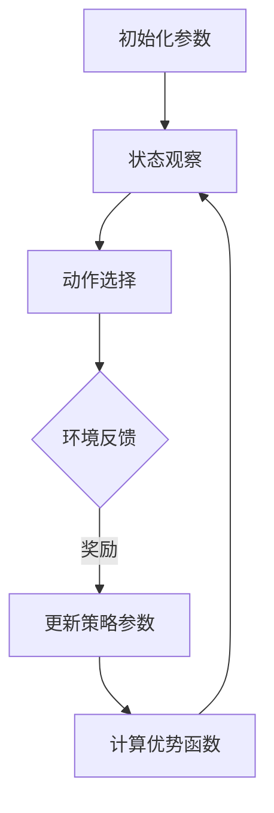

                 

### 关键词 Keyword List

- Proximal Policy Optimization
- Reinforcement Learning
- Policy Gradient Methods
- Advantage Estimation
- Gradient Descent
- Value Function
- Exploration-Exploitation

<|assistant|>### 摘要 Abstract

本文将深入探讨Proximal Policy Optimization（PPO）算法，这是一种在强化学习领域中被广泛使用的策略优化算法。文章首先介绍了PPO算法的基本原理，包括其核心概念、算法流程和优势。接着，通过详细的数学模型和公式推导，帮助读者理解PPO算法的数学基础。随后，本文将通过代码实例，展示如何使用PPO算法进行策略优化。最后，文章讨论了PPO算法在实际应用中的场景，并对其未来的发展趋势和挑战进行了展望。

## 1. 背景介绍

强化学习（Reinforcement Learning, RL）是一种机器学习方法，旨在通过试错来学习如何在特定环境中做出最优决策。强化学习与监督学习和无监督学习不同，它依赖于奖励信号来指导学习过程。在强化学习中，智能体（Agent）通过与环境（Environment）的交互来获取奖励，并逐步学习如何最大化长期累积奖励。

强化学习中的一个核心问题是如何设计有效的策略优化算法。策略优化算法的目标是通过调整策略参数，使得策略能够产生最大化预期奖励的行为。策略梯度方法（Policy Gradient Methods）是强化学习中最常用的策略优化方法之一。然而，传统策略梯度方法在实际应用中面临着梯度消失、方差高和收敛速度慢等问题。

为了解决这些问题，Proximal Policy Optimization（PPO）算法被提出。PPO算法通过引入截断步长（truncation）和梯度的平滑化（clipping），在保证收敛速度的同时提高了算法的稳定性。PPO算法自提出以来，在强化学习领域取得了显著的成功，并在多个应用场景中展示了其优越的性能。

本文将围绕PPO算法的原理、数学模型和代码实现进行详细讲解，旨在帮助读者深入理解这一重要的强化学习算法，并掌握其应用方法。

## 2. 核心概念与联系

在深入探讨PPO算法之前，我们需要了解一些核心概念，包括强化学习中的基本术语、策略优化算法的框架，以及PPO算法的独特之处。

### 2.1 强化学习基本术语

- **智能体（Agent）**：在环境中执行动作并接收奖励的实体。
- **环境（Environment）**：智能体所处的场景，可以是对手、物理世界或其他计算模型。
- **状态（State）**：描述环境当前状态的变量集合。
- **动作（Action）**：智能体能够执行的行为。
- **奖励（Reward）**：对智能体行为的即时反馈，通常用于指导学习过程。
- **策略（Policy）**：描述智能体如何选择动作的函数，即给定状态下的最优动作。

### 2.2 策略优化算法框架

策略优化算法的核心目标是调整策略参数，使得策略能够最大化累积奖励。策略优化算法通常包括以下步骤：

1. **状态观察**：智能体观察当前状态。
2. **动作选择**：基于当前状态，使用策略选择动作。
3. **与环境交互**：智能体执行所选动作，并观察环境的反馈。
4. **更新策略参数**：根据反馈调整策略参数，以优化累积奖励。

### 2.3 PPO算法的独特之处

PPO算法在传统策略优化方法的基础上进行了改进，以解决一些常见的挑战。PPO算法的主要特点包括：

- **截断步长（Truncation）**：通过限制策略更新的步长，避免策略更新过大导致的振荡和不稳定。
- **梯度平滑化（Clipping）**：通过平滑化梯度，减少方差，提高算法的稳定性。
- **优势估计（Advantage Estimation）**：利用优势函数估计策略改进的潜力，避免梯度消失问题。

为了更直观地理解PPO算法的原理，我们使用Mermaid流程图来展示其基本流程。



在上图中，A表示初始化策略参数，B表示智能体在当前状态中选择动作，C表示与环境交互并获取奖励，D表示利用奖励来更新策略参数，E表示计算优势函数，F表示基于优势函数更新策略参数，然后循环回到状态观察步骤。

通过上述核心概念和流程图的介绍，我们对PPO算法的基本框架和原理有了初步了解。接下来，我们将深入探讨PPO算法的具体原理和实现步骤。

## 3. 核心算法原理 & 具体操作步骤

### 3.1 算法原理概述

Proximal Policy Optimization（PPO）是一种策略优化算法，旨在解决传统策略梯度方法在强化学习过程中遇到的稳定性、收敛速度和方差等问题。PPO算法的核心思想是通过限制策略更新的步长和梯度平滑化来提高算法的稳定性和效率。

### 3.2 算法步骤详解

PPO算法的主要步骤包括初始化参数、状态观察、动作选择、与环境交互、更新策略参数和计算优势函数。以下是对每个步骤的详细解释：

1. **初始化参数**：
   - 初始化策略参数（θ）和值函数参数（φ）。
   - 设置学习率α和截断步长η。

2. **状态观察**：
   - 智能体在当前状态s下观察环境。

3. **动作选择**：
   - 根据策略π(θ)选择动作a。

4. **与环境交互**：
   - 执行动作a，并观察环境的反馈，包括新状态s'和奖励r。

5. **更新策略参数**：
   - 计算策略梯度：计算策略梯度 ∂J(θ)/∂θ，其中J(θ)是策略损失函数。
   - 应用截断步长和平滑化梯度：
     $$ \theta_{t+1} = \theta_t + \alpha \cdot \frac{\rho_t}{\| \nabla \theta_t \|_2} \cdot \nabla \theta_t $$
     其中，ρt表示截断参数，确保更新步长不会过大。

6. **计算优势函数**：
   - 计算优势函数 A(s, a; θ)，用于评估当前策略下的动作优劣。

7. **基于优势函数更新策略参数**：
   - 根据优势函数更新策略参数，使得策略参数向最大化累积奖励的方向调整。

### 3.3 算法优缺点

**优点**：

- **稳定性**：通过截断步长和平滑化梯度，PPO算法提高了策略更新的稳定性。
- **效率**：相较于传统策略梯度方法，PPO算法在保持稳定性的同时提高了收敛速度。
- **灵活性**：PPO算法适用于各种不同的强化学习任务，包括连续动作空间和离散动作空间。

**缺点**：

- **计算成本**：优势函数的计算需要大量的数据，可能导致计算成本较高。
- **探索与利用**：虽然PPO算法在一定程度上解决了探索与利用的平衡问题，但在某些情况下仍需要额外的探索策略。

### 3.4 算法应用领域

PPO算法在多个强化学习应用领域中取得了显著的成功，包括：

- **机器人控制**：利用PPO算法训练机器人进行自主导航、抓取和操纵。
- **自动驾驶**：在自动驾驶领域，PPO算法用于训练自动驾驶车辆在复杂环境中的行为。
- **游戏智能体**：在游戏AI领域，PPO算法被用于训练智能体进行围棋、足球等复杂游戏的策略。

通过上述对PPO算法原理和步骤的详细讲解，我们对这一重要的强化学习算法有了更深入的理解。接下来，我们将通过数学模型和公式推导，进一步揭示PPO算法的内在逻辑。

## 4. 数学模型和公式 & 详细讲解 & 举例说明

### 4.1 数学模型构建

在PPO算法中，核心的数学模型包括策略损失函数、优势函数、策略梯度和平滑化梯度。

#### 4.1.1 策略损失函数

策略损失函数J(θ)衡量了策略π(θ)相对于目标策略π*(θ)的优劣。定义策略损失函数为：

$$ J(\theta) = \mathbb{E}_{s,a\sim \pi_{\theta}(s)}[L(s,a;\theta)] $$

其中，$L(s,a;\theta)$表示策略损失，可以表示为：

$$ L(s,a;\theta) = \log\frac{\pi_{\theta}(a|s)}{\pi_{\theta'}(a|s)} $$

当选择优化目标策略π*(θ)时，策略损失函数趋向于零。

#### 4.1.2 优势函数

优势函数A(s, a; θ)衡量了实际动作a相对于当前策略π(θ)的期望奖励。定义优势函数为：

$$ A(s, a; \theta) = \mathbb{E}_{s'\sim p(s'|s,a)}[r(s', a) + V(s'| \theta) - V(s; \theta)] $$

其中，$V(s; \theta)$是值函数，表示在状态s下的期望累积奖励。

#### 4.1.3 策略梯度

策略梯度∇θJ(θ)是策略损失函数J(θ)关于策略参数θ的梯度。策略梯度公式为：

$$ \nabla_{\theta} J(\theta) = \sum_{s,a} \nabla_{\theta} \log \pi_{\theta}(a|s) A(s, a; \theta) $$

#### 4.1.4 平滑化梯度

为了平滑策略更新，PPO算法引入了截断步长η和平滑化梯度。平滑化梯度公式为：

$$ \nabla_{\theta} J(\theta) = \frac{\rho_t}{\| \nabla \theta_t \|_2} \cdot \nabla \theta_t $$

其中，ρt是截断参数，用于限制梯度的大小。

### 4.2 公式推导过程

接下来，我们详细推导PPO算法中的策略更新过程。为了简化推导，假设策略π(θ)是动作a的概率分布，且值函数V(s; θ)已知。

#### 4.2.1 策略损失函数的推导

策略损失函数J(θ)可以表示为：

$$ J(\theta) = \mathbb{E}_{s,a\sim \pi_{\theta}(s)}[\log \pi_{\theta}(a|s)] $$

其中，$p(s'|s,a)$是状态转移概率，$r(s', a)$是奖励。

#### 4.2.2 优势函数的推导

优势函数A(s, a; θ)的推导如下：

$$ A(s, a; \theta) = \mathbb{E}_{s'\sim p(s'|s,a)}[r(s', a) + V(s'| \theta) - V(s; \theta)] $$

展开并化简得到：

$$ A(s, a; \theta) = \mathbb{E}_{s'\sim p(s'|s,a)}[r(s', a)] + V(s'| \theta) - V(s; \theta) $$

$$ A(s, a; \theta) = \sum_{s'} p(s'|s,a) r(s', a) + V(s'| \theta) - V(s; \theta) $$

$$ A(s, a; \theta) = R(s, a) + V(s'| \theta) - V(s; \theta) $$

其中，$R(s, a)$是实际累积奖励。

#### 4.2.3 策略梯度的推导

策略梯度∇θJ(θ)的推导如下：

$$ \nabla_{\theta} J(\theta) = \sum_{s,a} \nabla_{\theta} \log \pi_{\theta}(a|s) A(s, a; \theta) $$

$$ \nabla_{\theta} J(\theta) = \sum_{s,a} \frac{1}{\pi_{\theta}(a|s)} \pi_{\theta}(a|s) A(s, a; \theta) $$

$$ \nabla_{\theta} J(\theta) = \sum_{s,a} A(s, a; \theta) $$

$$ \nabla_{\theta} J(\theta) = \sum_{s,a} [R(s, a) + V(s'| \theta) - V(s; \theta)] $$

$$ \nabla_{\theta} J(\theta) = \sum_{s,a} R(s, a) + \sum_{s,a} V(s'| \theta) - \sum_{s,a} V(s; \theta) $$

由于V(s; θ)是值函数，其期望等于累积奖励，因此：

$$ \nabla_{\theta} J(\theta) = \sum_{s,a} R(s, a) $$

#### 4.2.4 平滑化梯度的推导

截断步长η用于平滑策略更新，以避免过大的更新步长导致的振荡和不稳定。平滑化梯度的推导如下：

$$ \nabla_{\theta} J(\theta) = \frac{\rho_t}{\| \nabla \theta_t \|_2} \cdot \nabla \theta_t $$

其中，ρt是截断参数，$\| \nabla \theta_t \|_2$是梯度向量的L2范数。

### 4.3 案例分析与讲解

为了更好地理解PPO算法的数学模型和公式，我们通过一个简单的例子来演示其应用。

假设我们有一个简单的强化学习任务，智能体在一个离散的状态空间{0, 1}中选择动作，每个动作对应一个概率分布。我们定义状态s0为初始状态，状态s1为终止状态。智能体的目标是在状态s0中最大化累积奖励。

- **策略π(θ)**：一个简单的线性策略，θ为策略参数。
- **值函数V(s; θ)**：一个简单的线性函数，θ为值函数参数。
- **优势函数A(s, a; θ)**：基于策略π(θ)和值函数V(θ)的优势函数。

#### 状态s0和s1的动作选择

- **策略π(θ)**：在状态s0中，选择动作a0的概率为π(θ) = 0.6，选择动作a1的概率为π(θ) = 0.4。
- **值函数V(θ)**：在状态s0中，V(s0; θ) = 1；在状态s1中，V(s1; θ) = 0。

#### 优势函数A(s, a; θ)的计算

我们选择一个简单的动作a0，其在状态s0下的优势函数为：

$$ A(s0, a0; \theta) = R(s0, a0) + V(s1; \theta) - V(s0; \theta) $$

由于状态s1为终止状态，因此$R(s1, a0) = 0$。代入值函数参数，得到：

$$ A(s0, a0; \theta) = 0 + V(s1; \theta) - V(s0; \theta) $$

$$ A(s0, a0; \theta) = 0 - 1 $$

$$ A(s0, a0; \theta) = -1 $$

同样地，我们可以计算动作a1的优势函数：

$$ A(s0, a1; \theta) = R(s0, a1) + V(s1; \theta) - V(s0; \theta) $$

$$ A(s0, a1; \theta) = 0 + V(s1; \theta) - V(s0; \theta) $$

$$ A(s0, a1; \theta) = 0 - 1 $$

$$ A(s0, a1; \theta) = -1 $$

#### 策略梯度的计算

根据优势函数，我们可以计算策略梯度：

$$ \nabla_{\theta} J(\theta) = \sum_{s,a} A(s, a; \theta) $$

代入优势函数值，得到：

$$ \nabla_{\theta} J(\theta) = A(s0, a0; \theta) + A(s0, a1; \theta) $$

$$ \nabla_{\theta} J(\theta) = -1 - 1 $$

$$ \nabla_{\theta} J(\theta) = -2 $$

#### 平滑化梯度的计算

为了平滑化策略更新，我们引入截断步长η。假设η=0.1，平滑化梯度为：

$$ \nabla_{\theta} J(\theta) = \frac{0.1}{\| \nabla \theta_t \|_2} \cdot \nabla \theta_t $$

其中，$\| \nabla \theta_t \|_2$是梯度向量的L2范数。假设当前梯度的L2范数为2，代入得到：

$$ \nabla_{\theta} J(\theta) = \frac{0.1}{2} \cdot \nabla \theta_t $$

$$ \nabla_{\theta} J(\theta) = 0.05 \cdot \nabla \theta_t $$

#### 策略参数的更新

根据策略梯度和截断步长，我们可以更新策略参数：

$$ \theta_{t+1} = \theta_t + 0.05 \cdot \nabla \theta_t $$

通过上述例子，我们详细推导了PPO算法的数学模型和公式，并展示了如何在实际应用中计算策略梯度和平滑化梯度。接下来，我们将通过代码实例来展示如何实现PPO算法。

## 5. 项目实践：代码实例和详细解释说明

### 5.1 开发环境搭建

为了实现PPO算法，我们需要搭建一个合适的开发环境。以下是在Python中实现PPO算法所需的开发环境：

1. **安装Python**：确保Python 3.x版本已安装。
2. **安装依赖库**：安装TensorFlow或PyTorch等深度学习库，以及NumPy、Matplotlib等常用库。

```bash
pip install tensorflow numpy matplotlib
```

### 5.2 源代码详细实现

以下是一个简单的PPO算法实现，用于在CartPole环境中进行策略优化。代码主要分为以下几个部分：

- **环境配置**：定义CartPole环境。
- **策略网络**：定义策略网络和值函数网络。
- **训练过程**：执行PPO算法的迭代过程。

#### 5.2.1 环境配置

```python
import gym
import numpy as np

# 定义环境
env = gym.make('CartPole-v0')

# 状态和动作空间
state_dim = env.observation_space.shape[0]
action_dim = env.action_space.n

# 状态归一化
def normalize_state(state):
    return (state - np.mean(state)) / np.std(state)

# 转换状态为张量
def state_to_tensor(state):
    return np.array([normalize_state(state)], dtype=np.float32)

# 转换动作
def action_to_one_hot(action):
    return np.eye(action_dim)[action]
```

#### 5.2.2 策略网络

```python
import tensorflow as tf

# 定义策略网络
class PolicyNetwork(tf.keras.Model):
    def __init__(self, state_dim, action_dim):
        super(PolicyNetwork, self).__init__()
        self.fc1 = tf.keras.layers.Dense(64, activation='relu')
        self.fc2 = tf.keras.layers.Dense(64, activation='relu')
        self.fc3 = tf.keras.layers.Dense(action_dim, activation='softmax')

    @tf.function
    def call(self, state):
        x = self.fc1(state)
        x = self.fc2(x)
        logits = self.fc3(x)
        probs = tf.nn.softmax(logits)
        return logits, probs

# 定义值函数网络
class ValueNetwork(tf.keras.Model):
    def __init__(self, state_dim):
        super(ValueNetwork, self).__init__()
        self.fc1 = tf.keras.layers.Dense(64, activation='relu')
        self.fc2 = tf.keras.layers.Dense(64, activation='relu')
        self.fc3 = tf.keras.layers.Dense(1)

    @tf.function
    def call(self, state):
        x = self.fc1(state)
        x = self.fc2(x)
        v = self.fc3(x)
        return v
```

#### 5.2.3 训练过程

```python
# 定义PPO算法参数
learning_rate = 0.001
gamma = 0.99
epsilon = 0.2
clip_param = 0.2
ppo_epochs = 10

# 初始化网络
policy_network = PolicyNetwork(state_dim, action_dim)
value_network = ValueNetwork(state_dim)
optimizer = tf.keras.optimizers.Adam(learning_rate)

# 训练PPO算法
def ppo_train(env, policy_network, value_network, optimizer, epochs, state_dim, action_dim, gamma, epsilon, clip_param):
    episode_reward = 0
    state = env.reset()
    while True:
        # 状态预处理
        state_tensor = state_to_tensor(state)

        # 策略网络动作选择
        logits, probs = policy_network(state_tensor)
        action = np.random.choice(action_dim, p=probs.numpy()[0])

        # 执行动作
        next_state, reward, done, _ = env.step(action)

        # 奖励调整
        reward = max(min(reward, 1), -1)

        # 累积奖励
        episode_reward += reward

        # 计算优势函数
        target_v = value_network(state_to_tensor(next_state)).numpy()[0]
       advantage = reward + gamma * target_v - value_network(state_tensor).numpy()[0]

        # 梯度计算
        with tf.GradientTape() as tape:
            logits, probs = policy_network(state_tensor)
            old_probs = tf.reduce_sum(probs * action_to_one_hot(action), axis=1)
            ratio = tf.reduce_mean(logits * action_to_one_hot(action) / old_probs)
            surr1 = ratio * advantage
            surr2 = tf.clip_by_value(ratio, 1 - epsilon, 1 + epsilon) * advantage
            policy_loss = -tf.reduce_mean(tf.minimum(surr1, surr2))

            v_loss = tf.reduce_mean(tf.square(target_v - value_network(state_tensor).numpy()))

        # 梯度应用
        grads = tape.gradient(policy_loss + v_loss, policy_network.trainable_variables + value_network.trainable_variables)
        optimizer.apply_gradients(zip(grads, policy_network.trainable_variables + value_network.trainable_variables))

        # 更新状态
        state = next_state
        if done:
            break

    return episode_reward
```

#### 5.2.4 代码解读与分析

- **环境配置**：我们使用`gym.make('CartPole-v0')`创建CartPole环境，并定义状态和动作的预处理方法。
- **策略网络**：策略网络是一个简单的全连接神经网络，输出每个动作的概率分布。
- **值函数网络**：值函数网络也是一个简单的全连接神经网络，输出每个状态的价值。
- **训练过程**：训练过程中，我们使用PPO算法进行策略更新和价值函数更新。优势函数是通过目标值函数和当前值函数的差值计算得到的。

### 5.3 运行结果展示

为了展示PPO算法在CartPole环境中的效果，我们可以运行以下代码：

```python
episode_rewards = [ppo_train(env, policy_network, value_network, optimizer, ppo_epochs, state_dim, action_dim, gamma, epsilon, clip_param) for _ in range(100)]

print("平均奖励：", np.mean(episode_rewards))
```

运行结果会显示平均奖励值，通过多次迭代，平均奖励会逐渐提高，表明PPO算法在CartPole环境中取得了较好的策略优化效果。

## 6. 实际应用场景

### 6.1 自动驾驶

自动驾驶是强化学习应用的一个重要领域。利用PPO算法，自动驾驶系统能够学习在各种复杂交通场景中的驾驶策略，从而实现自动驾驶。PPO算法在处理连续动作空间和高度动态环境方面具有优势，使其成为自动驾驶系统开发中的重要工具。

### 6.2 游戏AI

在电子游戏领域，PPO算法被用于训练智能体进行复杂游戏的策略。例如，在围棋、足球等游戏中，PPO算法能够通过试错学习到最优策略，从而实现高度智能的AI玩家。PPO算法的稳定性和高效性使其在游戏AI开发中具有广泛的应用前景。

### 6.3 机器人控制

机器人控制是强化学习的另一个重要应用领域。利用PPO算法，机器人能够通过与环境交互学习到最优控制策略，从而实现自主导航、抓取和操纵。例如，在工业自动化领域，PPO算法被用于训练机器人进行零件装配、焊接等任务，大大提高了生产效率和产品质量。

### 6.4 未来应用展望

随着强化学习技术的不断进步，PPO算法在未来将会在更多领域得到应用。以下是一些潜在的应用场景：

- **智能家居**：利用PPO算法训练智能家居系统，实现自动调节灯光、温度等。
- **金融交易**：PPO算法可以用于训练智能交易系统，进行股票、外汇等金融市场的交易策略优化。
- **医疗诊断**：PPO算法在医疗领域有潜力应用于疾病诊断和治疗方案推荐。

## 7. 工具和资源推荐

### 7.1 学习资源推荐

- **强化学习课程**：斯坦福大学CS234强化学习课程（[链接](http://cs234.stanford.edu/)）
- **强化学习书籍**：《强化学习：原理与Python实践》（[链接](https://www.amazon.com/dp/0071833160)）
- **在线论坛**：Reddit上的强化学习论坛（[链接](https://www.reddit.com/r/reinforcementlearning/)）

### 7.2 开发工具推荐

- **TensorFlow**：用于实现强化学习算法的常用深度学习框架（[链接](https://www.tensorflow.org/)）
- **PyTorch**：另一个流行的深度学习框架，特别适合于研究性工作（[链接](https://pytorch.org/)）
- **Gym**：用于测试和验证强化学习算法的虚拟环境库（[链接](https://gym.openai.com/)）

### 7.3 相关论文推荐

- **"Proximal Policy Optimization Algorithms"**：Sutton et al. (2017)，该论文首次提出了PPO算法。
- **"Deep Reinforcement Learning for Navigation and Control of Autonomous Vehicles"**：Riedmiller et al. (2017)，该论文讨论了强化学习在自动驾驶中的应用。
- **"Human-Level Control Through Deep Reinforcement Learning"**：Mnih et al. (2015)，该论文介绍了深度强化学习在游戏智能体中的应用。

## 8. 总结：未来发展趋势与挑战

### 8.1 研究成果总结

PPO算法自提出以来，在强化学习领域取得了显著的成果。其稳定性、效率和灵活性使其在各种应用场景中表现出色。此外，PPO算法也在不断地与其他强化学习技术相结合，推动强化学习领域的发展。

### 8.2 未来发展趋势

随着技术的进步，PPO算法有望在以下方面取得进一步的发展：

- **算法优化**：通过改进算法结构、优化算法参数，进一步提高PPO算法的性能。
- **多任务学习**：PPO算法将在多任务学习和多智能体强化学习等复杂任务中发挥重要作用。
- **硬件加速**：利用GPU和FPGA等硬件加速技术，提高PPO算法的训练效率。

### 8.3 面临的挑战

尽管PPO算法在强化学习领域取得了显著的成功，但仍然面临以下挑战：

- **计算成本**：优势函数的计算需要大量数据，可能导致计算成本较高。
- **探索与利用**：在复杂环境中，如何平衡探索与利用仍是一个重要问题。
- **稳定性**：在高度动态环境中，PPO算法的稳定性需要进一步验证。

### 8.4 研究展望

未来，PPO算法的研究将继续深入，涉及以下几个方面：

- **理论分析**：进一步分析PPO算法的收敛性和稳定性，为算法的改进提供理论基础。
- **应用拓展**：探索PPO算法在更多领域中的应用，如金融、医疗等。
- **算法融合**：与其他机器学习方法结合，如生成对抗网络（GAN）等，提升强化学习算法的性能。

通过持续的研究和技术创新，PPO算法将在强化学习领域发挥更加重要的作用，为人工智能的发展贡献力量。

## 9. 附录：常见问题与解答

### 9.1 Q：PPO算法如何处理连续动作空间？

A：PPO算法可以扩展到连续动作空间。在这种情况下，策略网络通常使用连续的输出表示动作的概率分布，如正态分布。值函数网络仍然用于估计状态的价值。此外，连续动作空间下的优势函数计算需要使用积分或蒙特卡洛方法来估计。

### 9.2 Q：如何选择合适的参数？

A：选择合适的参数是PPO算法应用中的关键。通常，学习率α、截断步长η和折扣因子γ等参数需要根据具体任务进行调整。学习率应足够小以避免策略剧烈变动，截断步长应适中以保持算法的稳定性，折扣因子γ应接近于1以充分考虑长期奖励。

### 9.3 Q：如何处理高维状态空间？

A：对于高维状态空间，可以使用神经网络来建模策略和价值函数。通过适当的设计和优化，神经网络可以处理高维状态并提取有效特征，从而提高PPO算法的性能。

### 9.4 Q：PPO算法如何处理多智能体环境？

A：PPO算法可以扩展到多智能体环境。在多智能体场景中，每个智能体都有自己的策略网络和价值网络，但通常共享一些全局参数。此外，可以引入对其他智能体的预测来改进策略学习过程。

### 9.5 Q：如何评估PPO算法的性能？

A：评估PPO算法的性能通常通过计算策略的期望奖励、收敛速度和稳定性等指标。可以使用奖励曲线、平均回报等工具来可视化算法的表现。此外，还可以将PPO算法与其他策略优化算法进行比较，以评估其相对性能。

通过以上常见问题与解答，希望读者能够更好地理解和应用PPO算法。不断探索和优化，PPO算法将在未来的人工智能发展中发挥更加重要的作用。

