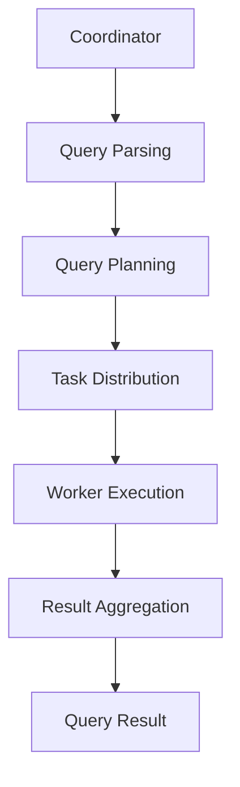

                 

关键词：Presto，UDF，用户自定义函数，原理讲解，代码实例

> 摘要：本文将深入探讨Presto用户自定义函数（UDF）的实现原理，通过具体的代码实例，详细解释如何在Presto中开发和使用UDF，帮助读者更好地理解和使用这一强大工具。

## 1. 背景介绍

随着大数据技术的发展，数据仓库和大数据处理引擎变得越来越重要。Presto是一个开源的高性能分布式查询引擎，旨在处理大规模数据集的快速查询。它广泛应用于各种场景，如企业级数据湖、实时数据分析等。Presto提供了一种强大的扩展机制——用户自定义函数（UDF），使得开发人员可以根据特定的业务需求，扩展Presto的功能。

用户自定义函数（User-Defined Functions，简称UDF）允许用户将自定义的函数集成到Presto中，从而扩展其处理数据的范围和方式。UDF在Presto中有着广泛的应用，如文本处理、图像识别、地理空间计算等。

## 2. 核心概念与联系

在深入探讨UDF之前，我们需要了解一些核心概念和Presto的整体架构。

### 2.1. 核心概念

- **Presto执行模型**：Presto采用分布式计算模型，由Coordinator和Workers组成。Coordinator负责解析查询、生成执行计划，并将任务分配给Workers。Workers负责执行具体的计算任务，并将结果返回给Coordinator。

- **表达式（Expressions）**：在Presto中，表达式是一系列操作符和操作数的组合，用于定义数据的计算逻辑。

- **函数（Functions）**：函数是一组预定义的或者用户自定义的操作，用于处理数据。

- **用户自定义函数（UDF）**：UDF是用户定义的函数，可以扩展Presto的功能。

### 2.2. 核心概念原理与架构的 Mermaid 流程图

以下是一个简化的Presto执行架构流程图：



### 2.3. UDF在Presto中的联系

在Presto的执行过程中，UDF可以作为表达式的一部分，被插入到执行计划中。当Coordinator生成执行计划时，如果发现执行计划中包含UDF，它会将这个任务分配给相应的Worker进行执行。Worker在执行这个任务时，会调用用户定义的函数来处理数据。

## 3. 核心算法原理 & 具体操作步骤

### 3.1. 算法原理概述

Presto UDF的实现原理主要涉及以下几个方面：

1. **定义UDF**：使用Java编写UDF，并将其打包成JAR文件。
2. **注册UDF**：在Presto中注册UDF，使其可以被查询语句使用。
3. **执行UDF**：在查询执行过程中，Presto会调用注册的UDF来处理数据。

### 3.2. 算法步骤详解

#### 3.2.1. 定义UDF

定义UDF的第一步是创建一个Java类，这个类需要实现`com.facebook.presto.spi.function.LambdaFunction`接口。以下是一个简单的示例：

```java
import com.facebook.presto.spi.function.LambdaFunction;
import com.facebook.presto.spi.function.SqlInvocable;

@FunctionalInterface
public interface MyFunction {
    int apply(int a, int b);
}

@LambdaFunction
public class MyFunctionImpl implements MyFunction {
    @Override
    public int apply(int a, int b) {
        return a + b;
    }
}
```

#### 3.2.2. 注册UDF

定义好UDF之后，需要将其打包成JAR文件，并注册到Presto集群中。注册UDF的步骤如下：

1. 将UDF的JAR文件上传到Presto的lib目录下。
2. 重启Presto Coordinator和Worker。

#### 3.2.3. 执行UDF

在查询语句中，可以使用`my_function`调用UDF。例如：

```sql
SELECT my_function(a, b) FROM my_table;
```

当Coordinator生成执行计划时，如果发现执行计划中包含`my_function`，它会将这个任务分配给相应的Worker进行执行。Worker会调用`MyFunctionImpl`类中的`apply`方法来处理数据。

### 3.3. 算法优缺点

#### 优点

1. **灵活性强**：可以通过自定义函数，扩展Presto的功能，满足特定的业务需求。
2. **高性能**：Presto内置了对UDF的支持，UDF可以在分布式环境中高效执行。

#### 缺点

1. **开发成本较高**：需要编写Java代码，并进行打包、注册等操作。
2. **兼容性问题**：由于Presto的版本更新，UDF可能需要适配不同的版本。

### 3.4. 算法应用领域

UDF在Presto中有着广泛的应用领域，如：

1. **文本处理**：对文本数据进行复杂的处理，如分词、正则表达式匹配等。
2. **图像处理**：对图像数据进行处理，如识别图像中的物体、计算图像的相似度等。
3. **地理空间计算**：对地理空间数据进行处理，如计算两点之间的距离、判断两个区域是否重叠等。

## 4. 数学模型和公式 & 详细讲解 & 举例说明

### 4.1. 数学模型构建

在Presto UDF中，我们常常需要使用数学模型来表示数据处理的逻辑。以下是一个简单的数学模型示例：

假设我们有一个函数`f(x) = x^2`，我们需要在Presto中实现这个函数。

### 4.2. 公式推导过程

根据函数的定义，我们有：

$$ f(x) = x^2 $$

我们可以将这个公式嵌入到Presto UDF中，使其可以处理输入的数值。

### 4.3. 案例分析与讲解

以下是一个使用Presto UDF实现`f(x) = x^2`的示例：

```java
@LambdaFunction
public class SquareFunction implements Function {
    @Override
    public int apply(int x) {
        return x * x;
    }
}
```

在这个示例中，我们定义了一个名为`SquareFunction`的Java类，实现了`Function`接口。在`apply`方法中，我们使用了简单的数学运算来计算输入的平方值。

## 5. 项目实践：代码实例和详细解释说明

### 5.1. 开发环境搭建

为了实践Presto UDF，我们需要搭建一个Presto开发环境。以下是搭建步骤：

1. 安装Java环境（版本要求与Presto兼容）。
2. 下载并解压Presto的安装包。
3. 配置Presto的配置文件，如`config.properties`。
4. 启动Presto Coordinator和Worker。

### 5.2. 源代码详细实现

以下是一个简单的Presto UDF示例，用于计算输入数字的平方：

```java
import com.facebook.presto.spi.function.LambdaFunction;

@LambdaFunction
public class SquareFunction {
    public int apply(int x) {
        return x * x;
    }
}
```

在这个示例中，我们定义了一个名为`SquareFunction`的Java类，实现了`LambdaFunction`接口。在`apply`方法中，我们使用了简单的数学运算来计算输入的平方值。

### 5.3. 代码解读与分析

在这个示例中，`SquareFunction`类实现了`LambdaFunction`接口，这个接口是Presto用于定义UDF的关键接口。在`apply`方法中，我们使用了简单的数学运算来计算输入的平方值。

### 5.4. 运行结果展示

在Presto中，我们可以使用以下查询语句来测试UDF：

```sql
SELECT square_function(a) FROM my_table;
```

假设`my_table`中有一列名为`a`的整数列，运行上述查询语句后，我们可以得到每个数字的平方值。

## 6. 实际应用场景

Presto UDF在实际应用场景中有着广泛的应用。以下是一些典型的应用场景：

1. **数据清洗**：使用UDF对数据进行清洗，如去除空值、填补缺失值等。
2. **数据转换**：使用UDF对数据进行转换，如将字符串转换为日期、将数字进行四舍五入等。
3. **数据聚合**：使用UDF对数据进行聚合，如计算平均值、标准差等。
4. **数据可视化**：使用UDF生成可视化数据，如图表、地图等。

## 7. 工具和资源推荐

### 7.1. 学习资源推荐

- [Presto官方文档](https://prestodb.io/docs.html)
- [Apache Spark官方文档](https://spark.apache.org/docs/latest/)
- [Java并发编程实战](《Java Concurrency in Practice》)
- [深度学习入门](《Deep Learning》)

### 7.2. 开发工具推荐

- [IntelliJ IDEA](https://www.jetbrains.com/idea/)
- [Eclipse](https://www.eclipse.org/)
- [Git](https://git-scm.com/)

### 7.3. 相关论文推荐

- [Presto: A Distributed SQL Engine for Big Data](https://www.usenix.org/conference/fast13/technical-sessions/presentation/bortnikov)
- [Spark: Cluster Computing with Working Sets](https://www.mpi-sws.org/~esmeckes/papers/2014-fast-spark.pdf)
- [The Java Language Specification](https://docs.oracle.com/javase/specs/jls/index.html)

## 8. 总结：未来发展趋势与挑战

### 8.1. 研究成果总结

本文深入探讨了Presto UDF的实现原理，并通过具体的代码实例，详细解释了如何在Presto中开发和使用UDF。通过本文，读者可以更好地理解UDF的核心概念和原理，掌握其在实际应用中的使用方法。

### 8.2. 未来发展趋势

随着大数据技术的不断发展，Presto UDF的应用领域将越来越广泛。未来，Presto可能会引入更多的UDF扩展机制，如支持Python、R等编程语言，以提高开发效率和灵活性。

### 8.3. 面临的挑战

Presto UDF在开发和使用过程中仍然面临一些挑战，如兼容性问题、性能优化等。未来，我们需要在这些方面进行更多的研究和优化，以提高UDF的稳定性和性能。

### 8.4. 研究展望

随着大数据技术的不断发展，Presto UDF将在数据仓库和大数据处理领域发挥越来越重要的作用。未来，我们将继续深入探讨UDF的实现原理和优化方法，为大数据处理提供更强大的工具。

## 9. 附录：常见问题与解答

### 9.1. 如何在Presto中注册UDF？

在Presto中注册UDF的主要步骤如下：

1. 将UDF的Java类打包成JAR文件。
2. 将JAR文件上传到Presto的lib目录下。
3. 重启Presto Coordinator和Worker。

### 9.2. 如何在Presto中使用UDF？

在Presto中，使用UDF的步骤如下：

1. 编写Java类，实现UDF接口。
2. 打包并注册UDF。
3. 在查询语句中使用UDF。

例如：

```sql
SELECT my_function(a, b) FROM my_table;
```

### 9.3. UDF的性能如何优化？

优化UDF的性能可以从以下几个方面入手：

1. **代码优化**：对Java代码进行优化，提高执行效率。
2. **数据缓存**：使用数据缓存减少重复计算。
3. **并行计算**：利用多线程或多进程提高计算效率。

### 9.4. UDF有哪些限制？

Presto UDF的一些限制包括：

1. **兼容性**：由于Java语言的限制，UDF可能无法在所有操作系统上运行。
2. **性能**：UDF的性能可能不如预编译的函数库。
3. **资源消耗**：UDF可能需要消耗更多的系统资源，如内存和CPU。

以上是对Presto UDF原理与代码实例讲解的完整文章。希望本文能够帮助读者更好地理解Presto UDF的核心概念和原理，掌握其实际应用方法。随着大数据技术的不断发展，Presto UDF将在数据仓库和大数据处理领域发挥越来越重要的作用。让我们共同期待UDF的未来发展！
----------------------------------------------------------------
### 作者署名

作者：禅与计算机程序设计艺术 / Zen and the Art of Computer Programming

