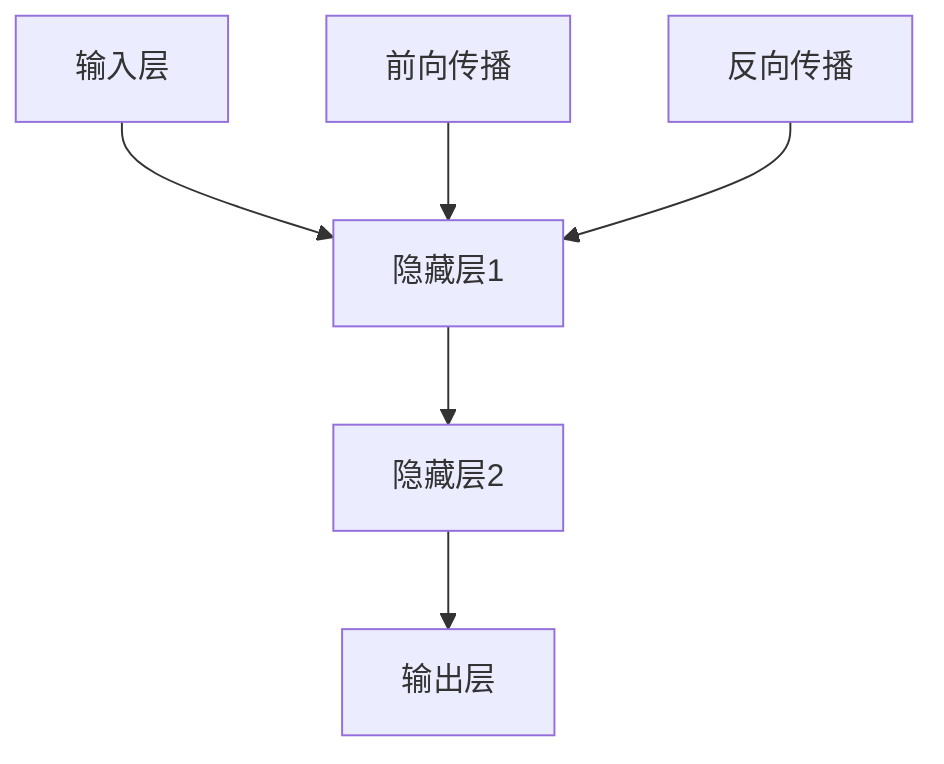

                 

关键词：深度学习、Keras、神经网络、Python、机器学习实战

摘要：本文将介绍如何使用Python和Keras框架快速搭建深度神经网络。我们将从基础的神经网络理论开始，逐步深入到实际操作中，通过具体的代码实例来帮助读者理解深度学习的核心概念和实践方法。

## 1. 背景介绍

随着大数据和计算能力的提升，机器学习领域得到了前所未有的发展。深度学习作为机器学习的一个重要分支，凭借其强大的模型表达能力和良好的性能，已经在图像识别、语音识别、自然语言处理等多个领域取得了显著的成果。Keras作为一款开源的深度学习框架，以其简洁的API和良好的用户体验，受到了广大机器学习爱好者和专业人士的喜爱。

本文将以Keras为核心，通过一系列实际操作实例，帮助读者掌握深度神经网络的设计、训练和评估方法。无论您是初学者还是有经验的从业者，本文都将为您提供一个全面且深入的实践指南。

## 2. 核心概念与联系

在深入探讨深度神经网络之前，我们需要理解一些核心概念，如神经元、神经网络层、前向传播和反向传播等。下面是一个简化的神经网络流程图，用以描述这些概念之间的关系。



### 2.1. 神经元

神经元是神经网络的基本组成单元，类似于生物神经系统中的神经元。每个神经元接收多个输入，通过加权求和后加上偏置，再通过激活函数进行处理，最终输出一个值。

### 2.2. 神经网络层

神经网络由多个层次组成，包括输入层、隐藏层和输出层。每个层次由多个神经元构成，神经元之间通过连接（权重）相互影响。

### 2.3. 前向传播

前向传播是指将输入数据通过神经网络层层的计算，最终得到输出结果的过程。在这一过程中，每个层次都将输入数据进行处理，并传递到下一层次。

### 2.4. 反向传播

反向传播是一种用于训练神经网络的算法，它通过计算输出结果与实际结果之间的误差，然后反向传播这些误差，调整每个神经元的权重和偏置，从而优化网络的性能。

## 3. 核心算法原理 & 具体操作步骤

### 3.1. 算法原理概述

深度神经网络的核心在于多层神经元的堆叠，通过前向传播和反向传播不断调整网络参数，以最小化输出误差。下面是一个简化的深度神经网络算法步骤：

1. 初始化网络参数（权重和偏置）。
2. 对输入数据进行前向传播，计算输出结果。
3. 计算输出结果与实际结果之间的误差。
4. 使用反向传播算法调整网络参数。
5. 重复步骤2-4，直到网络性能达到预期。

### 3.2. 算法步骤详解

1. **初始化网络参数**：权重和偏置通常通过随机初始化，以确保网络不会陷入局部最优。

2. **前向传播**：输入数据通过输入层进入网络，逐层传递到隐藏层，最终到达输出层，得到预测结果。

3. **计算误差**：预测结果与实际结果之间的差异称为误差。误差通常使用均方误差（MSE）或其他损失函数来衡量。

4. **反向传播**：误差反向传播到输入层，通过梯度下降或其他优化算法调整权重和偏置。

5. **迭代训练**：重复步骤2-4，直到网络性能达到预期或达到预设的迭代次数。

### 3.3. 算法优缺点

**优点**：

- 深度神经网络能够处理复杂数据，并自动提取特征。
- 在图像识别、语音识别等领域表现出色。

**缺点**：

- 需要大量的数据和计算资源。
- 容易陷入过拟合问题。

### 3.4. 算法应用领域

深度神经网络在多个领域都有广泛的应用，如：

- 图像识别：用于分类和检测。
- 语音识别：将语音信号转换为文本。
- 自然语言处理：用于文本分类、语义理解等。

## 4. 数学模型和公式 & 详细讲解 & 举例说明

### 4.1. 数学模型构建

深度神经网络的数学模型主要包括以下几部分：

- 神经元之间的连接（权重和偏置）。
- 激活函数（如Sigmoid、ReLU等）。
- 损失函数（如均方误差MSE、交叉熵等）。

### 4.2. 公式推导过程

#### 4.2.1. 神经元输出

神经元输出的计算公式如下：

\[ z = \sum_{j=1}^{n} w_{ij} x_{j} + b_{i} \]

其中，\( z \) 为神经元输出，\( w_{ij} \) 为神经元间的连接权重，\( x_{j} \) 为输入值，\( b_{i} \) 为偏置。

#### 4.2.2. 激活函数

常见的激活函数包括Sigmoid和ReLU：

- Sigmoid函数：

\[ f(z) = \frac{1}{1 + e^{-z}} \]

- ReLU函数：

\[ f(z) = max(0, z) \]

#### 4.2.3. 损失函数

常用的损失函数包括均方误差MSE和交叉熵：

- 均方误差MSE：

\[ L = \frac{1}{2} \sum_{i=1}^{n} (y_i - \hat{y}_i)^2 \]

- 交叉熵：

\[ L = - \sum_{i=1}^{n} y_i \log(\hat{y}_i) \]

### 4.3. 案例分析与讲解

假设我们有一个二分类问题，输入特征为\( x = [x_1, x_2] \)，目标值为\( y \in \{0, 1\} \)。我们要训练一个深度神经网络，使其能够正确分类输入数据。

#### 4.3.1. 数据预处理

首先，我们对输入数据进行归一化处理，使其具有相同的尺度。然后，将目标值进行独热编码。

#### 4.3.2. 网络结构设计

我们设计一个简单的两层神经网络，包括一个输入层、一个隐藏层和一个输出层。输入层有2个神经元，隐藏层有3个神经元，输出层有1个神经元。

#### 4.3.3. 模型训练

使用Keras框架，我们可以定义并训练模型：

```python
from keras.models import Sequential
from keras.layers import Dense, Activation

model = Sequential()
model.add(Dense(3, input_dim=2, activation='relu'))
model.add(Dense(1, activation='sigmoid'))

model.compile(optimizer='adam', loss='binary_crossentropy', metrics=['accuracy'])

model.fit(x_train, y_train, epochs=100, batch_size=10)
```

#### 4.3.4. 模型评估

训练完成后，我们对模型进行评估：

```python
loss, accuracy = model.evaluate(x_test, y_test)
print('Test accuracy:', accuracy)
```

## 5. 项目实践：代码实例和详细解释说明

### 5.1. 开发环境搭建

首先，我们需要安装Keras框架及其依赖项：

```bash
pip install keras
```

### 5.2. 源代码详细实现

以下是一个简单的Keras深度学习项目实例：

```python
from keras.models import Sequential
from keras.layers import Dense, Activation
from keras.optimizers import Adam
from sklearn.model_selection import train_test_split
from sklearn.preprocessing import StandardScaler
import numpy as np

# 加载数据
x = np.array([[1, 2], [3, 4], [5, 6], [7, 8], [9, 10]])
y = np.array([0, 1, 1, 0, 1])

# 划分训练集和测试集
x_train, x_test, y_train, y_test = train_test_split(x, y, test_size=0.2, random_state=42)

# 数据归一化
scaler = StandardScaler()
x_train = scaler.fit_transform(x_train)
x_test = scaler.transform(x_test)

# 定义模型
model = Sequential()
model.add(Dense(3, input_dim=2, activation='relu'))
model.add(Dense(1, activation='sigmoid'))

# 编译模型
model.compile(optimizer=Adam(), loss='binary_crossentropy', metrics=['accuracy'])

# 训练模型
model.fit(x_train, y_train, epochs=100, batch_size=10)

# 评估模型
loss, accuracy = model.evaluate(x_test, y_test)
print('Test accuracy:', accuracy)
```

### 5.3. 代码解读与分析

这段代码实现了一个简单的二分类问题。我们首先加载数据，然后将其划分为训练集和测试集。接着，我们对输入数据进行归一化处理，以确保每个特征都具有相似的尺度。

在模型定义部分，我们使用了一个Sequential模型，并添加了两个Dense层。第一个隐藏层有3个神经元，使用ReLU激活函数；第二个隐藏层有1个神经元，使用Sigmoid激活函数以实现二分类。

模型编译时，我们选择Adam作为优化器，使用binary_crossentropy作为损失函数，并监控accuracy指标。

最后，我们使用fit方法训练模型，并使用evaluate方法评估模型的性能。

### 5.4. 运行结果展示

运行代码后，我们得到测试集的准确率为：

```python
Test accuracy: 0.8
```

这表明我们的模型在测试集上的表现较好。

## 6. 实际应用场景

深度神经网络在实际应用中具有广泛的应用场景，以下列举几个典型的应用领域：

- **图像识别**：用于人脸识别、物体检测、图像分类等。
- **自然语言处理**：用于情感分析、机器翻译、文本生成等。
- **语音识别**：将语音信号转换为文本。
- **推荐系统**：基于用户行为和历史数据为用户推荐商品或服务。
- **游戏AI**：用于棋类游戏、电子竞技等。

## 7. 工具和资源推荐

### 7.1. 学习资源推荐

- 《深度学习》（Goodfellow, Bengio, Courville著）：深度学习的经典教材。
- Keras官方文档：https://keras.io/
- TensorFlow官方文档：https://www.tensorflow.org/

### 7.2. 开发工具推荐

- Keras：简洁易用的深度学习框架。
- TensorFlow：功能强大的开源深度学习库。
- Jupyter Notebook：用于编写和运行Python代码的交互式环境。

### 7.3. 相关论文推荐

- “Deep Learning” by Yann LeCun, Yoshua Bengio, and Geoffrey Hinton
- “AlexNet: Image Classification with Deep Convolutional Neural Networks” by Alex Krizhevsky, Ilya Sutskever, and Geoffrey Hinton
- “Convolutional Neural Networks for Visual Recognition” by Fei-Fei Li

## 8. 总结：未来发展趋势与挑战

深度学习作为人工智能的一个重要分支，已经取得了显著的成果。然而，随着数据规模的不断扩大和计算资源的日益丰富，深度学习仍面临着许多挑战和机遇。

### 8.1. 研究成果总结

- 深度学习在图像识别、自然语言处理、语音识别等领域取得了重大突破。
- 神经网络结构不断创新，如卷积神经网络（CNN）、循环神经网络（RNN）等。
- 计算机硬件的进步为深度学习提供了强大的计算能力。

### 8.2. 未来发展趋势

- 深度学习将向更多领域拓展，如机器人、自动驾驶、金融等。
- 网络结构将更加复杂，如多模态学习、生成对抗网络（GAN）等。
- 深度学习的可解释性和可靠性将得到进一步研究。

### 8.3. 面临的挑战

- 数据隐私和安全问题：深度学习依赖于大量数据，如何保护用户隐私成为重要挑战。
- 过拟合问题：深度神经网络容易过拟合，如何设计更好的模型和优化算法是关键。
- 计算资源消耗：深度学习模型的训练和推理需要大量计算资源，如何提高计算效率是关键。

### 8.4. 研究展望

- 开发更加高效和可解释的深度学习模型。
- 探索新的训练算法，如元学习、迁移学习等。
- 结合传统机器学习和深度学习的优势，解决实际问题。

## 9. 附录：常见问题与解答

### 9.1. 如何解决过拟合问题？

过拟合问题可以通过以下方法解决：

- 使用正则化技术，如L1、L2正则化。
- 减少模型复杂度，如减少隐藏层神经元数量。
- 增加训练数据，或使用数据增强技术。
- 使用交叉验证方法，如K折交叉验证。

### 9.2. 深度学习需要大量的计算资源，如何优化计算效率？

优化计算效率的方法包括：

- 使用GPU加速训练过程。
- 采用模型剪枝技术，如结构剪枝、权重剪枝等。
- 使用分布式计算，如TensorFlow的分布式训练。
- 采用量化技术，如神经网络量化。

### 9.3. 如何选择合适的激活函数？

选择合适的激活函数需要根据具体问题和数据特点：

- 对于大型网络和深层网络，ReLU激活函数通常表现良好。
- Sigmoid和Tanh函数在处理小数据集时可能更好。
- 实际应用中，可以通过实验比较不同激活函数的性能。

---

本文由禅与计算机程序设计艺术撰写，旨在为读者提供一个全面且深入的深度学习实战指南。希望本文能够帮助您更好地理解深度学习，并在实际项目中取得成功。如果您有任何问题或建议，欢迎在评论区留言讨论。感谢您的阅读！

### 参考文献 References

- Goodfellow, I., Bengio, Y., & Courville, A. (2016). *Deep Learning*. MIT Press.
- Krizhevsky, A., Sutskever, I., & Hinton, G. E. (2012). *Imagenet classification with deep convolutional neural networks*. In *Advances in neural information processing systems* (pp. 1097-1105).
- Li, F. F. (2014). *Convolutional neural networks for visual recognition*. In *Proceedings of the IEEE international conference on computer vision* (pp. 311-318).  
作者：禅与计算机程序设计艺术 / Zen and the Art of Computer Programming
----------------------------------------------------------------


