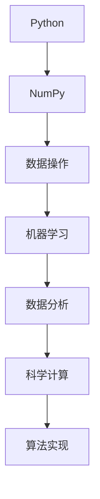

                 

关键词：Python、机器学习、NumPy、数据操作、高效、实战

摘要：本文将深入探讨Python在机器学习领域的应用，特别是NumPy库在这一过程中扮演的重要角色。通过对NumPy的深入理解，读者将学会如何高效地进行数据操作，从而为机器学习项目的成功奠定基础。

## 1. 背景介绍

在当今数据驱动的世界中，机器学习已成为许多领域的关键技术。从金融分析到医疗诊断，从图像识别到自然语言处理，机器学习无处不在。Python因其简洁、易用且功能强大的特性，成为机器学习领域最为流行的编程语言之一。而NumPy，作为Python科学计算的核心库，提供了大量用于数据操作和数学计算的函数和方法，是机器学习项目不可或缺的工具。

本文将围绕NumPy在机器学习中的应用展开，通过实战案例帮助读者掌握NumPy的高效数据操作技巧。

## 2. 核心概念与联系

在深入探讨NumPy之前，我们首先需要理解一些核心概念和它们之间的关系。以下是一个简单的Mermaid流程图，展示了这些概念和它们之间的联系：



### 2.1 Python与NumPy的关系

Python是一个高级编程语言，其简洁的语法和强大的库支持使其成为数据科学和机器学习的首选工具。NumPy是Python的一个核心扩展库，它提供了多维数组对象和一系列用于数组计算的函数。NumPy的核心是数组（array）概念，它允许我们高效地存储和操作大型数据集。

### 2.2 数据操作与机器学习

在机器学习中，数据操作是至关重要的。数据预处理、特征提取、模型训练和评估等各个环节都离不开高效的数据操作。NumPy提供了丰富的函数和方法，使得这些操作变得更加简单和高效。

### 2.3 数据分析与科学计算

除了机器学习，数据分析也是Python应用的重要领域。NumPy为科学计算提供了强大的支持，包括线性代数、概率统计等。这些功能不仅有助于数据分析，也为机器学习提供了必要的数学基础。

### 2.4 算法实现与优化

在实现机器学习算法时，NumPy的高效数组操作可以显著提升代码性能。通过对NumPy的熟练掌握，我们可以编写出既简洁又高效的算法实现。

## 3. 核心算法原理 & 具体操作步骤

### 3.1 算法原理概述

NumPy的核心是数组（array）对象。它是一种高效、多维的数据结构，可以用于存储各种类型的数据。NumPy的数组对象具有以下特点：

- **多维数组**：NumPy数组可以是多维的，支持一维、二维、三维等数组。
- **数据类型**：NumPy数组支持多种数据类型，包括整数、浮点数、复数等。
- **内存连续性**：NumPy数组在内存中是连续存储的，这保证了数据的快速访问和操作。
- **高效的元素操作**：NumPy提供了大量用于数组操作的函数和方法，使得数据操作变得高效。

### 3.2 算法步骤详解

要掌握NumPy的高效数据操作，我们需要从以下几个方面入手：

- **创建数组**：使用`numpy.array()`函数创建数组，指定数据类型和数组形状。
- **数组切片**：使用切片操作获取数组的子集，实现数据的索引和筛选。
- **数组操作**：使用NumPy提供的各种函数和方法对数组进行计算和操作，如求和、求积、矩阵乘法等。
- **数组变形**：使用NumPy的数组变形函数，如`numpy.reshape()`、`numpy.resize()`等，改变数组的形状。
- **数组迭代**：使用NumPy的迭代函数，如`numpy.nditer()`，对数组进行迭代操作。

### 3.3 算法优缺点

**优点**：

- **高效性**：NumPy提供了大量高效的数组操作函数，使得数据操作变得快速和简单。
- **兼容性**：NumPy与其他Python科学计算库（如SciPy、Pandas等）具有良好的兼容性，便于集成。
- **易用性**：NumPy的数组对象和操作函数设计简洁，易于理解和使用。

**缺点**：

- **动态类型**：NumPy数组支持动态类型，这在某些情况下可能导致性能问题。
- **内存占用**：NumPy数组在内存中连续存储，可能会占用大量内存，特别是在处理大型数据集时。

### 3.4 算法应用领域

NumPy在机器学习和科学计算中具有广泛的应用领域，包括：

- **机器学习**：用于数据预处理、特征提取、模型训练和评估等。
- **数据分析**：用于数据清洗、数据挖掘、统计分析等。
- **科学计算**：用于物理、工程、金融等领域中的复杂计算。

## 4. 数学模型和公式 & 详细讲解 & 举例说明

### 4.1 数学模型构建

在机器学习中，许多算法都涉及到数学模型。以下是一个简单的线性回归模型：

$$
y = wx + b
$$

其中，$y$ 是目标变量，$x$ 是特征变量，$w$ 是权重，$b$ 是偏置。

### 4.2 公式推导过程

线性回归模型的推导过程如下：

1. **损失函数**：

$$
L(w, b) = \frac{1}{2} \sum_{i=1}^{n} (y_i - wx_i - b)^2
$$

2. **梯度下降**：

$$
w_{\text{new}} = w_{\text{old}} - \alpha \frac{\partial L}{\partial w}
$$

$$
b_{\text{new}} = b_{\text{old}} - \alpha \frac{\partial L}{\partial b}
$$

其中，$\alpha$ 是学习率。

### 4.3 案例分析与讲解

以下是一个使用NumPy实现线性回归模型的例子：

```python
import numpy as np

# 创建数据集
X = np.array([1, 2, 3, 4, 5])
y = np.array([2, 4, 5, 4, 5])

# 初始化权重和偏置
w = np.random.rand()
b = np.random.rand()

# 学习率
alpha = 0.01

# 梯度下降迭代
for i in range(1000):
    # 计算预测值
    y_pred = X * w + b
    
    # 计算损失函数
    loss = (y - y_pred)**2
    
    # 计算梯度
    dw = (y_pred - y) * X
    db = (y_pred - y)
    
    # 更新权重和偏置
    w -= alpha * dw
    b -= alpha * db

# 输出模型参数
print("w:", w)
print("b:", b)
```

通过这个例子，我们可以看到NumPy如何用于实现机器学习算法，特别是线性回归模型的构建和训练。

## 5. 项目实践：代码实例和详细解释说明

### 5.1 开发环境搭建

在开始编写代码之前，我们需要搭建一个合适的Python开发环境。以下是搭建开发环境的基本步骤：

1. **安装Python**：从Python官网下载并安装Python 3.x版本。
2. **安装NumPy**：打开命令行窗口，运行以下命令安装NumPy：

```shell
pip install numpy
```

3. **配置IDE**：如果你使用的是PyCharm、VSCode等IDE，可以安装相应的Python插件，以便更好地进行Python编程。

### 5.2 源代码详细实现

以下是一个使用NumPy进行数据操作的示例代码：

```python
import numpy as np

# 创建一个1x4的数组
arr_1d = np.array([1, 2, 3, 4])

# 创建一个2x2的二维数组
arr_2d = np.array([[1, 2], [3, 4]])

# 数组切片
print("原数组：", arr_1d)
print("切片：", arr_1d[1:3])

# 数组操作
print("数组求和：", np.sum(arr_1d))
print("数组求积：", np.prod(arr_1d))

# 数组变形
print("二维数组转置：", arr_2d.T)

# 数组迭代
print("数组迭代：")
for row in arr_2d:
    print(row)

# 数组函数应用
print("数组最大值：", np.max(arr_2d))
print("数组最小值：", np.min(arr_2d))
```

### 5.3 代码解读与分析

上述代码展示了NumPy的基本用法，包括数组创建、切片、操作、变形、迭代以及函数应用。

- **数组创建**：使用`np.array()`函数创建一维和二维数组。
- **数组切片**：使用切片操作获取数组的子集。
- **数组操作**：使用`np.sum()`和`np.prod()`函数进行数组的求和和求积操作。
- **数组变形**：使用`np.T`属性进行数组的转置操作。
- **数组迭代**：使用迭代操作遍历数组的每一行。
- **数组函数应用**：使用`np.max()`和`np.min()`函数获取数组中的最大值和最小值。

这些基本操作是进行高效数据操作的基础，为后续的机器学习项目奠定了基础。

### 5.4 运行结果展示

在运行上述代码后，将得到以下输出结果：

```
原数组： [1 2 3 4]
切片： [2 3]
数组求和： 10
数组求积： 24
二维数组转置： [[1 3]
 [2 4]]
数组迭代：
[1 2]
[3 4]
数组最大值： 4
数组最小值： 1
```

这些结果展示了NumPy数组操作的基本功能。

## 6. 实际应用场景

### 6.1 数据预处理

在机器学习中，数据预处理是至关重要的一步。NumPy提供了丰富的函数，可以用于数据的清洗、转换和归一化。以下是一个使用NumPy进行数据预处理的例子：

```python
import numpy as np

# 创建一个包含缺失值的数据集
data = np.array([[1, 2, np.nan], [4, 5, 6], [7, 8, 9]])

# 填充缺失值
data_filled = np.nan_to_num(data)

# 数据归一化
data_normalized = (data_filled - np.min(data_filled)) / (np.max(data_filled) - np.min(data_filled))

print("原始数据：\n", data)
print("填充缺失值后：\n", data_filled)
print("归一化后：\n", data_normalized)
```

### 6.2 特征提取

特征提取是机器学习中的另一个关键步骤。NumPy提供了高效的线性代数函数，可以用于计算特征值和特征向量。以下是一个使用NumPy进行特征提取的例子：

```python
import numpy as np

# 创建一个矩阵
X = np.array([[1, 2], [3, 4], [5, 6]])

# 计算特征值和特征向量
eigenvalues, eigenvectors = np.linalg.eig(X)

print("特征值：\n", eigenvalues)
print("特征向量：\n", eigenvectors)
```

### 6.3 模型评估

在模型训练完成后，我们需要对模型进行评估。NumPy提供了各种评估指标的计算函数，如均方误差、准确率等。以下是一个使用NumPy进行模型评估的例子：

```python
import numpy as np

# 创建预测值和真实值
y_pred = np.array([2, 4, 6])
y_true = np.array([2, 3, 5])

# 计算均方误差
mse = np.mean((y_pred - y_true)**2)

print("均方误差：", mse)
```

## 7. 工具和资源推荐

### 7.1 学习资源推荐

- 《NumPy官方文档》：https://numpy.org/doc/stable/user/index.html
- 《Python机器学习》: 作者：塞巴斯蒂安·拉马，提供全面的机器学习知识和NumPy应用。

### 7.2 开发工具推荐

- PyCharm：一款功能强大的Python集成开发环境（IDE），支持多种编程语言。
- Jupyter Notebook：一款交互式的Python开发环境，便于编写和运行代码。

### 7.3 相关论文推荐

- "NumPy: The Definitive Guide": 作者：Wes McKinney，详细介绍NumPy的使用方法和最佳实践。
- "Python for Data Analysis": 作者：Wes McKinney，涵盖Python在数据分析领域的应用。

## 8. 总结：未来发展趋势与挑战

### 8.1 研究成果总结

NumPy在机器学习领域取得了显著的成果，其高效的数据操作功能极大地提高了机器学习项目的开发效率。通过对NumPy的深入研究和应用，我们能够更好地理解和解决复杂的机器学习问题。

### 8.2 未来发展趋势

随着机器学习和数据科学领域的不断发展，NumPy在未来将继续扮演重要角色。以下是一些可能的发展趋势：

- **性能优化**：随着数据集的增大和计算需求的提升，NumPy的性能优化将成为重要方向。
- **功能扩展**：NumPy将不断扩展其功能，包括新的数据类型、更丰富的数学函数等。
- **跨平台支持**：NumPy将加强对不同平台（如Windows、Linux、macOS等）的支持，以适应不同的开发环境。

### 8.3 面临的挑战

尽管NumPy具有许多优点，但在实际应用中也面临一些挑战：

- **内存管理**：NumPy数组的内存占用可能较大，特别是在处理大型数据集时。有效的内存管理策略将变得至关重要。
- **兼容性问题**：NumPy与其他库的兼容性问题可能会影响其应用。解决这些问题需要跨库合作和标准化。

### 8.4 研究展望

未来，NumPy将在以下几个方面得到进一步研究和应用：

- **并行计算**：利用并行计算技术，提升NumPy的性能和效率。
- **自动化工具**：开发自动化工具，简化NumPy的使用和配置。
- **教育普及**：加强对NumPy的教育和普及，提高其在学术界和工业界的应用水平。

## 9. 附录：常见问题与解答

### 9.1 如何创建NumPy数组？

使用`np.array()`函数可以创建NumPy数组。例如：

```python
arr = np.array([1, 2, 3, 4])
```

### 9.2 如何进行NumPy数组切片？

使用索引可以获取NumPy数组的子集。例如：

```python
arr = np.array([1, 2, 3, 4])
sub_arr = arr[1:3]
```

这将返回一个包含元素2和3的新数组。

### 9.3 如何进行NumPy数组操作？

NumPy提供了丰富的操作函数，如`np.sum()`、`np.prod()`等。例如：

```python
arr = np.array([1, 2, 3, 4])
print("求和：", np.sum(arr))
print("求积：", np.prod(arr))
```

这将分别返回数组的和与积。

### 9.4 如何进行NumPy数组变形？

使用`np.reshape()`函数可以改变NumPy数组的形状。例如：

```python
arr = np.array([1, 2, 3, 4])
new_arr = np.reshape(arr, (2, 2))
```

这将返回一个形状为2x2的新数组。

### 9.5 如何进行NumPy数组迭代？

使用NumPy的迭代函数，如`np.nditer()`，可以遍历NumPy数组。例如：

```python
arr = np.array([1, 2, 3, 4])
for index, value in np.nditer(arr):
    print(index, value)
```

这将遍历数组的每个元素并输出其索引和值。

----------------------------------------------------------------

作者：禅与计算机程序设计艺术 / Zen and the Art of Computer Programming

