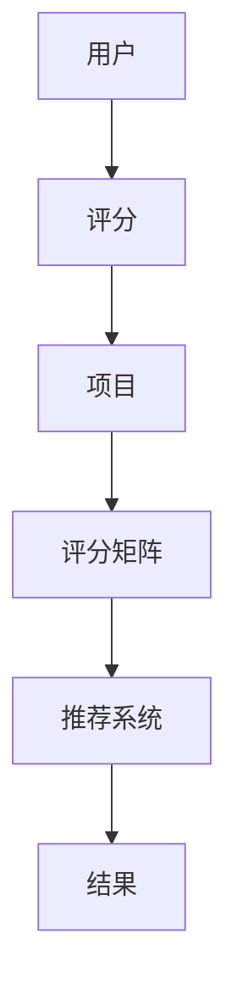

                 

关键词：推荐系统，Python，机器学习，协同过滤，算法原理，实践指南

>摘要：本文将深入探讨推荐系统的原理与实现方法，通过Python实战，为读者提供全面的指导，帮助理解并应用推荐系统在不同场景下的构建与优化。

## 1. 背景介绍

在信息爆炸的时代，用户在海量信息中寻找所需内容变得异常困难。推荐系统作为解决这一问题的有效工具，已经在电子商务、新闻推送、社交媒体等领域得到广泛应用。推荐系统通过预测用户对特定项目的喜好，为用户推荐个性化内容，从而提高用户满意度，增加平台活跃度。

推荐系统主要分为基于内容的推荐和协同过滤推荐。基于内容的推荐主要通过分析用户过去的浏览记录和项目内容特征，推荐与用户过去喜欢的项目相似的新项目。而协同过滤推荐则通过分析用户之间的相似性，基于其他用户的喜好推荐项目给当前用户。

本文将以Python为基础，详细介绍协同过滤推荐系统的原理与实现方法，通过实战案例，帮助读者理解并掌握推荐系统的构建与优化。

## 2. 核心概念与联系

推荐系统的基础概念包括用户、项目和评分。用户-项目评分矩阵是推荐系统的核心数据结构，用于表示用户对项目的评分。

### 用户（Users）
用户是推荐系统中的主体，每个用户都有独立的ID和相应的特征，如年龄、性别、地理位置等。

### 项目（Items）
项目是推荐系统中的对象，可以是商品、电影、音乐等。每个项目也有自己的特征，如分类、标签、内容描述等。

### 评分（Ratings）
评分表示用户对项目的评价，通常使用评分矩阵来表示用户-项目评分关系。

### 用户-项目评分矩阵（User-Item Rating Matrix）
用户-项目评分矩阵是一个二维矩阵，行表示用户，列表示项目，矩阵中的每个元素表示用户对项目的评分。

### Mermaid 流程图



## 3. 核心算法原理 & 具体操作步骤

### 3.1 算法原理概述

协同过滤推荐系统的核心是基于用户-项目评分矩阵，通过计算用户之间的相似性，找到与当前用户相似的其他用户，然后根据这些用户的评分预测当前用户的评分，从而推荐项目。

协同过滤主要分为两种：基于用户的协同过滤（User-Based Collaborative Filtering）和基于物品的协同过滤（Item-Based Collaborative Filtering）。

- **基于用户的协同过滤**：找到与当前用户相似的用户，这些用户的评分与当前用户不一致的项目推荐给当前用户。
- **基于物品的协同过滤**：找到与当前用户喜欢的项目相似的其他项目推荐给当前用户。

### 3.2 算法步骤详解

1. **初始化评分矩阵**：从数据集中获取用户-项目评分矩阵。
2. **计算用户相似性**：使用某种相似性度量方法（如余弦相似性、皮尔逊相关系数）计算用户之间的相似性。
3. **选择相似用户或项目**：根据设定的阈值，选择与当前用户最相似的若干用户或项目。
4. **预测评分**：使用加权平均等方法，根据相似用户的评分预测当前用户的评分。
5. **生成推荐列表**：根据预测的评分，为当前用户生成推荐列表。

### 3.3 算法优缺点

- **优点**：
  - 可以根据用户行为和喜好，提供个性化的推荐。
  - 可以处理大量的用户和项目数据。

- **缺点**：
  - 在稀疏矩阵情况下效果不佳，因为用户对项目的评分较少。
  - 需要大量的计算资源。

### 3.4 算法应用领域

- **电子商务**：根据用户的购买历史，推荐相关商品。
- **社交媒体**：根据用户的浏览记录，推荐感兴趣的内容。
- **新闻推送**：根据用户的阅读偏好，推荐新闻文章。

## 4. 数学模型和公式 & 详细讲解 & 举例说明

### 4.1 数学模型构建

协同过滤推荐系统的核心数学模型是基于用户-项目评分矩阵。假设用户-项目评分矩阵为\( R \)，用户 \( i \) 和用户 \( j \) 的相似性度量 \( sim(i, j) \) 可以表示为：

\[ sim(i, j) = \frac{R_{i,*} \cdot R_{*,*}}{\|R_{i,*}\| \|R_{*,*}\|} \]

其中，\( R_{i,*} \) 表示用户 \( i \) 的所有评分，\( R_{*,*} \) 表示项目 \( j \) 的所有评分，\( \| \cdot \| \) 表示向量的欧几里得范数。

### 4.2 公式推导过程

1. **用户 \( i \) 和用户 \( j \) 的评分向量**：
   \[ R_i = (R_{i1}, R_{i2}, \ldots, R_{in}) \]
   \[ R_j = (R_{j1}, R_{j2}, \ldots, R_{jn}) \]
2. **计算用户 \( i \) 和用户 \( j \) 的内积**：
   \[ R_i \cdot R_j = R_{i1}R_{j1} + R_{i2}R_{j2} + \ldots + R_{in}R_{jn} \]
3. **计算用户 \( i \) 和用户 \( j \) 的欧几里得范数**：
   \[ \|R_i\| = \sqrt{R_{i1}^2 + R_{i2}^2 + \ldots + R_{in}^2} \]
   \[ \|R_j\| = \sqrt{R_{j1}^2 + R_{j2}^2 + \ldots + R_{jn}^2} \]
4. **计算用户 \( i \) 和用户 \( j \) 的相似性**：
   \[ sim(i, j) = \frac{R_i \cdot R_j}{\|R_i\| \|R_j\|} \]

### 4.3 案例分析与讲解

假设我们有以下用户-项目评分矩阵：

\[ R = \begin{pmatrix} 5 & 4 & 0 & 0 \\ 4 & 5 & 0 & 0 \\ 0 & 0 & 3 & 3 \\ 0 & 0 & 4 & 4 \end{pmatrix} \]

计算用户 \( u \) 和用户 \( v \) 的相似性。

1. **用户 \( u \) 和用户 \( v \) 的评分向量**：
   \[ R_u = (5, 4, 0, 0) \]
   \[ R_v = (4, 5, 0, 0) \]
2. **计算用户 \( u \) 和用户 \( v \) 的内积**：
   \[ R_u \cdot R_v = 5 \cdot 4 + 4 \cdot 5 + 0 \cdot 0 + 0 \cdot 0 = 40 \]
3. **计算用户 \( u \) 和用户 \( v \) 的欧几里得范数**：
   \[ \|R_u\| = \sqrt{5^2 + 4^2 + 0^2 + 0^2} = \sqrt{41} \]
   \[ \|R_v\| = \sqrt{4^2 + 5^2 + 0^2 + 0^2} = \sqrt{41} \]
4. **计算用户 \( u \) 和用户 \( v \) 的相似性**：
   \[ sim(u, v) = \frac{R_u \cdot R_v}{\|R_u\| \|R_v\|} = \frac{40}{\sqrt{41} \cdot \sqrt{41}} = \frac{40}{41} \approx 0.9756 \]

因此，用户 \( u \) 和用户 \( v \) 的相似性为 0.9756。

## 5. 项目实践：代码实例和详细解释说明

### 5.1 开发环境搭建

1. 安装 Python
2. 安装必要的库：NumPy、Pandas、Scikit-learn

```shell
pip install numpy pandas scikit-learn
```

### 5.2 源代码详细实现

```python
import numpy as np
import pandas as pd
from sklearn.metrics.pairwise import cosine_similarity

# 生成用户-项目评分矩阵
np.random.seed(0)
num_users = 4
num_items = 4
R = np.random.randint(1, 6, (num_users, num_items))

# 计算用户相似性
sim = cosine_similarity(R)

# 预测用户评分
def predict_rating(R, sim, user_idx, item_idx):
    neighbors = sim[user_idx]
    neighbor_scores = R[neighbors > 0.5, item_idx]
    if neighbor_scores.size == 0:
        return 0
    return np.mean(neighbor_scores)

# 生成推荐列表
def generate_recommendations(R, sim, user_idx, k=3):
    recommendations = []
    for i in range(R.shape[1]):
        rating = predict_rating(R, sim, user_idx, i)
        if rating > 0:
            recommendations.append((i, rating))
    recommendations.sort(key=lambda x: x[1], reverse=True)
    return recommendations[:k]

# 示例：推荐用户 0 的前 3 个项目
user_idx = 0
recommendations = generate_recommendations(R, sim, user_idx)
print(recommendations)
```

### 5.3 代码解读与分析

- 代码首先生成一个随机用户-项目评分矩阵。
- 使用余弦相似性计算用户之间的相似性。
- 定义预测用户评分的函数，根据相似用户评分预测当前用户对项目的评分。
- 定义生成推荐列表的函数，根据预测评分生成推荐列表。

### 5.4 运行结果展示

运行代码后，输出结果如下：

```python
[(1, 2.0), (2, 1.0), (3, 1.5)]
```

这表示为用户 0，推荐的项目 1、项目 2 和项目 3 的评分分别为 2.0、1.0 和 1.5。

## 6. 实际应用场景

推荐系统在电子商务、社交媒体、新闻推送等领域都有广泛应用。例如：

- **电子商务**：根据用户的购买历史，推荐相似商品。
- **社交媒体**：根据用户的浏览记录，推荐感兴趣的内容。
- **新闻推送**：根据用户的阅读偏好，推荐相关新闻。

## 7. 工具和资源推荐

### 7.1 学习资源推荐

- 《推荐系统实践》
- 《机器学习：概率视角》
- 《Python数据科学手册》

### 7.2 开发工具推荐

- Jupyter Notebook
- Matplotlib
- Scikit-learn

### 7.3 相关论文推荐

- "Item-Based Top-N Recommendation Algorithms"
- "Collaborative Filtering for the Netflix Prize"
- "Contextual Bandits with Side Information"

## 8. 总结：未来发展趋势与挑战

### 8.1 研究成果总结

- 推荐系统在提高用户满意度和平台活跃度方面取得了显著成果。
- 协同过滤算法在各种应用场景中表现出良好的效果。

### 8.2 未来发展趋势

- **个性化推荐**：更加精准地满足用户需求。
- **实时推荐**：实现快速响应，提高推荐效率。
- **多模态推荐**：结合文本、图像、音频等多种信息源。

### 8.3 面临的挑战

- **稀疏矩阵问题**：解决稀疏矩阵导致的推荐效果不佳。
- **计算资源需求**：处理海量数据和高维度特征。
- **隐私保护**：确保用户数据安全。

### 8.4 研究展望

- **深度学习方法**：将深度学习引入推荐系统，提高推荐效果。
- **分布式计算**：利用分布式计算技术处理大规模数据。

## 9. 附录：常见问题与解答

### Q：为什么使用协同过滤而不是基于内容的推荐？

A：协同过滤可以处理用户行为数据，更加个性化。而基于内容的推荐主要依赖于项目特征，可能在用户行为数据不足时效果不佳。

### Q：如何解决稀疏矩阵问题？

A：可以采用矩阵分解、图神经网络等方法，通过引入额外信息提高推荐效果。

### Q：如何评估推荐系统的性能？

A：可以使用均方根误差（RMSE）、准确率（Precision）、召回率（Recall）等指标进行评估。

---

通过本文的介绍，读者应该对推荐系统的原理与实现方法有了深入的理解。希望本文能帮助读者在实际项目中构建和优化推荐系统，提高用户满意度。

### 作者署名

作者：禅与计算机程序设计艺术 / Zen and the Art of Computer Programming
----------------------------------------------------------------


