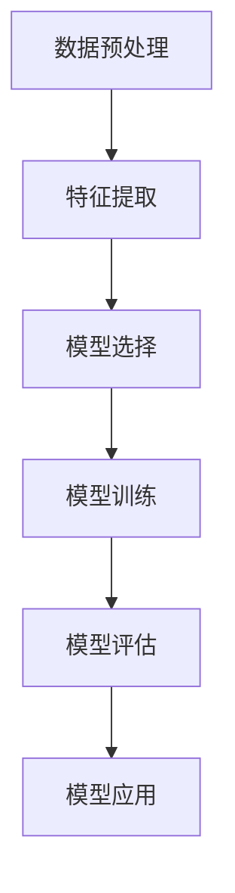

                 

关键词：Python、机器学习、自然语言处理、文本分类、算法原理、数学模型、项目实践、应用场景、未来展望

> 摘要：本文将深入探讨自然语言处理中的文本分类技术，以Python为工具，详细讲解文本分类的核心算法原理、数学模型、项目实践，并分析其实际应用场景和未来发展趋势。

## 1. 背景介绍

随着互联网的迅猛发展，文本数据量呈现爆炸式增长。如何有效地处理和利用这些海量文本数据，成为了一个重要课题。文本分类技术作为一种自然语言处理（NLP）的重要手段，旨在将文本数据按照特定的标准进行分类，以便于信息的检索、组织和利用。

文本分类技术广泛应用于搜索引擎、舆情分析、垃圾邮件过滤、情感分析等领域。本文将聚焦于文本分类的核心算法，结合Python实战，探讨文本分类技术在NLP中的应用。

## 2. 核心概念与联系

### 2.1. 文本分类的定义

文本分类（Text Classification）是指将文本数据按照某种标准进行归类的过程。分类的标准可以是主题、情感、领域等多种类型。

### 2.2. 文本分类的流程

文本分类的流程通常包括以下几个步骤：

1. **数据预处理**：清洗、去噪、分词、词性标注等。
2. **特征提取**：将文本数据转换为机器学习模型可处理的特征向量。
3. **模型选择**：根据数据特点和需求选择合适的分类算法。
4. **模型训练**：使用训练数据对分类模型进行训练。
5. **模型评估**：使用测试数据对训练好的模型进行评估。
6. **模型应用**：将模型应用于新的文本数据，进行分类预测。

### 2.3. 核心概念原理和架构

以下是文本分类的核心概念原理和架构的Mermaid流程图：



## 3. 核心算法原理 & 具体操作步骤

### 3.1. 算法原理概述

文本分类的核心算法包括基于传统机器学习和深度学习的方法。其中，基于传统机器学习的方法如朴素贝叶斯、支持向量机（SVM）、K最近邻（KNN）等，基于深度学习的方法如卷积神经网络（CNN）、循环神经网络（RNN）、长短期记忆网络（LSTM）等。

### 3.2. 算法步骤详解

#### 3.2.1. 数据预处理

数据预处理是文本分类的重要环节，主要包括以下几个步骤：

1. **文本清洗**：去除HTML标签、特殊字符、停用词等。
2. **分词**：将文本切分成单词或词组。
3. **词性标注**：为每个词赋予相应的词性标签。

#### 3.2.2. 特征提取

特征提取是将文本数据转换为机器学习模型可处理的特征向量。常见的特征提取方法包括：

1. **词袋模型（Bag of Words, BOW）**：将文本表示为一个单词的集合。
2. **TF-IDF（Term Frequency-Inverse Document Frequency）**：考虑单词在文档中的频率及其在整个文档集合中的重要性。
3. **词嵌入（Word Embedding）**：将单词映射到高维空间中的向量。

#### 3.2.3. 模型选择

根据数据特点和需求选择合适的分类算法。常见的分类算法有：

1. **朴素贝叶斯（Naive Bayes）**：基于贝叶斯定理和特征条件独立性假设。
2. **支持向量机（SVM）**：将文本映射到高维空间，找到最佳分类超平面。
3. **K最近邻（KNN）**：基于距离最近的数据点进行分类。
4. **卷积神经网络（CNN）**：适用于图像和文本数据的特征提取。
5. **循环神经网络（RNN）**：适用于序列数据的建模。

#### 3.2.4. 模型训练

使用训练数据对分类模型进行训练。训练过程包括模型初始化、参数调整、优化目标函数等。

#### 3.2.5. 模型评估

使用测试数据对训练好的模型进行评估。常见的评估指标有准确率（Accuracy）、精确率（Precision）、召回率（Recall）和F1值（F1 Score）。

#### 3.2.6. 模型应用

将模型应用于新的文本数据，进行分类预测。

### 3.3. 算法优缺点

不同算法各有优缺点，需要根据具体场景进行选择：

1. **朴素贝叶斯**：简单、高效，但容易过拟合。
2. **支持向量机**：准确率高，但训练时间较长。
3. **K最近邻**：简单、易实现，但需要大量训练数据。
4. **卷积神经网络**：适用于图像和文本数据，但需要大量计算资源。
5. **循环神经网络**：适用于序列数据，但训练时间较长。

### 3.4. 算法应用领域

文本分类技术在多个领域有广泛应用：

1. **搜索引擎**：对网页进行分类，提高检索效率。
2. **舆情分析**：对社交媒体文本进行情感分类，监测社会动态。
3. **垃圾邮件过滤**：对邮件进行分类，过滤垃圾邮件。
4. **情感分析**：对用户评论、评论进行情感分类，了解用户反馈。
5. **内容推荐**：对用户兴趣进行分类，提供个性化推荐。

## 4. 数学模型和公式 & 详细讲解 & 举例说明

### 4.1. 数学模型构建

文本分类的数学模型通常包括特征提取和分类模型两部分。

#### 4.1.1. 特征提取

假设我们有一个训练数据集 \(D = \{(x_1, y_1), (x_2, y_2), ..., (x_n, y_n)\}\)，其中 \(x_i\) 表示第 \(i\) 个文本数据，\(y_i\) 表示其对应的标签。

1. **词袋模型（BOW）**

   将文本表示为一个单词的集合，记为 \(V = \{w_1, w_2, ..., w_v\}\)。

   特征向量 \(X_i\) 可以表示为：

   $$X_i = (f_1^i, f_2^i, ..., f_v^i)$$

   其中，\(f_v^i = 1\) 表示单词 \(w_v\) 在文本 \(x_i\) 中出现，否则为 0。

2. **TF-IDF**

   TF-IDF 中的特征向量 \(X_i\) 可以表示为：

   $$X_i = (t_1^i, t_2^i, ..., t_v^i)$$

   其中，\(t_v^i = tf(w_v, x_i) \cdot idf(w_v, D)\)。

   - \(tf(w_v, x_i)\)：单词 \(w_v\) 在文本 \(x_i\) 中的频率。
   - \(idf(w_v, D)\)：单词 \(w_v\) 在数据集 \(D\) 中的逆文档频率。

#### 4.1.2. 分类模型

常见的分类模型有：

1. **朴素贝叶斯（Naive Bayes）**

   假设特征 \(X\) 和标签 \(Y\) 独立，则后验概率可以表示为：

   $$P(Y|X) = \frac{P(X|Y)P(Y)}{P(X)}$$

   其中，\(P(X|Y)\) 表示特征 \(X\) 在标签 \(Y\) 条件下的概率，\(P(Y)\) 表示标签 \(Y\) 的概率，\(P(X)\) 表示特征 \(X\) 的概率。

2. **支持向量机（SVM）**

   假设特征空间为 \( \mathbb{R}^n \)，则支持向量机可以表示为：

   $$\max_{w, b} \frac{1}{2} ||w||^2$$

   subject to

   $$y_i (w \cdot x_i + b) \geq 1$$

   其中，\(w\) 和 \(b\) 分别表示分类超平面和偏置，\(x_i\) 和 \(y_i\) 分别表示特征和标签。

### 4.2. 公式推导过程

以朴素贝叶斯分类器为例，推导后验概率的公式。

假设文本数据 \(x_i\) 和标签 \(y_i\) 满足贝叶斯定理：

$$P(Y|X) = \frac{P(X|Y)P(Y)}{P(X)}$$

其中：

1. **条件概率 \(P(X|Y)\)**：

   条件概率 \(P(X|Y)\) 可以表示为：

   $$P(X|Y) = \frac{P(Y|X)P(X)}{P(Y)}$$

   根据贝叶斯定理，\(P(Y|X)P(X)\) 表示特征 \(X\) 在标签 \(Y\) 条件下的联合概率，而 \(P(Y)\) 表示标签 \(Y\) 的概率。

2. **先验概率 \(P(Y)\)**：

   先验概率 \(P(Y)\) 可以表示为：

   $$P(Y) = \sum_{x \in X} P(X|Y)P(Y)$$

   其中，\(X\) 表示所有可能的特征集合。

3. **特征概率 \(P(X)\)**：

   特征概率 \(P(X)\) 可以表示为：

   $$P(X) = \sum_{y \in Y} P(X|y)P(y)$$

   其中，\(Y\) 表示所有可能的标签集合。

根据上述公式，可以得到后验概率的公式：

$$P(Y|X) = \frac{P(X|Y)P(Y)}{P(X)}$$

### 4.3. 案例分析与讲解

假设我们有以下一个简单的文本分类问题：

训练数据集：

- \(x_1 = "今天天气很好" ，y_1 = "晴天" \)
- \(x_2 = "今天天气很糟糕" ，y_2 = "阴天" \)
- \(x_3 = "今天天气一般" ，y_3 = "雨天" \)

1. **数据预处理**

   - 去除HTML标签、特殊字符、停用词。
   - 分词：["今天"，"天气"，"很好" ]，["今天"，"天气"，"糟糕" ]，["今天"，"天气"，"一般" ]。
   - 词性标注：["今天"，"天气"，"好" ]，["今天"，"天气"，"糟糕" ]，["今天"，"天气"，"一般" ]。

2. **特征提取**

   - 词袋模型：{"今天"：1，"天气"：1，"很好"：1}，{"今天"：1，"天气"：1，"糟糕"：1}，{"今天"：1，"天气"：1，"一般"：1}。
   - TF-IDF：{"今天"：1，"天气"：1，"很好"：1}，{"今天"：1，"天气"：1，"糟糕"：1}，{"今天"：1，"天气"：1，"一般"：1}。

3. **模型选择**

   - 选择朴素贝叶斯分类器。

4. **模型训练**

   - 计算先验概率 \(P(晴天)\)，\(P(阴天)\)，\(P(雨天)\)。
   - 计算条件概率 \(P(今天|晴天)\)，\(P(天气|晴天)\)，\(P(很好|晴天)\)，\(P(今天|阴天)\)，\(P(天气|阴天)\)，\(P(糟糕|阴天)\)，\(P(今天|雨天)\)，\(P(天气|雨天)\)，\(P(一般|雨天)\)。

5. **模型评估**

   - 使用测试数据集对模型进行评估，计算准确率、精确率、召回率和F1值。

6. **模型应用**

   - 对新的文本数据进行分类预测。

## 5. 项目实践：代码实例和详细解释说明

### 5.1. 开发环境搭建

- Python环境：Python 3.8及以上版本。
- 数据预处理库：jieba（分词）、nltk（词性标注）。
- 特征提取库：sklearn（词袋模型、TF-IDF）。
- 分类模型库：sklearn（朴素贝叶斯、SVM、KNN）。

### 5.2. 源代码详细实现

```python
import jieba
import nltk
from sklearn.feature_extraction.text import TfidfVectorizer
from sklearn.naive_bayes import MultinomialNB
from sklearn.model_selection import train_test_split
from sklearn.metrics import accuracy_score, precision_score, recall_score, f1_score

# 1. 数据预处理
def preprocess_data(text):
    # 去除HTML标签、特殊字符、停用词
    text = re.sub('<[^>]*>', '', text)
    text = re.sub('[^\w\s]', '', text)
    # 分词
    words = jieba.lcut(text)
    # 词性标注
    words = [word for word in words if nltk.pos_tag([word])[0][1] != '停用词']
    return ' '.join(words)

# 2. 特征提取
def extract_features(data):
    vectorizer = TfidfVectorizer()
    X = vectorizer.fit_transform(data)
    return X, vectorizer

# 3. 模型训练
def train_model(X_train, y_train):
    model = MultinomialNB()
    model.fit(X_train, y_train)
    return model

# 4. 模型评估
def evaluate_model(model, X_test, y_test):
    y_pred = model.predict(X_test)
    print("准确率：", accuracy_score(y_test, y_pred))
    print("精确率：", precision_score(y_test, y_pred, average='weighted'))
    print("召回率：", recall_score(y_test, y_pred, average='weighted'))
    print("F1值：", f1_score(y_test, y_pred, average='weighted'))

# 5. 模型应用
def classify_text(model, vectorizer, text):
    text = preprocess_data(text)
    X = vectorizer.transform([text])
    y_pred = model.predict(X)
    return y_pred[0]

# 6. 主函数
if __name__ == '__main__':
    # 加载数据
    data = [
        "今天天气很好，适合出门。",
        "今天天气很糟糕，要注意保暖。",
        "今天天气一般，不用穿太多。",
        "明天会下雨，记得带伞。",
        "今天的阳光很好，可以晒晒被子。",
        "天气预报说今天有雾霾，出门要戴口罩。"
    ]
    labels = ["晴天"，"阴天"，"雨天"，"雨天"，"晴天"，"阴天"]

    # 数据预处理
    data = [preprocess_data(text) for text in data]

    # 特征提取
    X, vectorizer = extract_features(data)

    # 数据切分
    X_train, X_test, y_train, y_test = train_test_split(X, labels, test_size=0.2, random_state=42)

    # 模型训练
    model = train_model(X_train, y_train)

    # 模型评估
    evaluate_model(model, X_test, y_test)

    # 模型应用
    text = "今天天气怎么样？"
    print("预测结果：", classify_text(model, vectorizer, text))
```

### 5.3. 代码解读与分析

上述代码实现了文本分类的基本流程，包括数据预处理、特征提取、模型训练、模型评估和模型应用。

1. **数据预处理**：去除HTML标签、特殊字符、停用词，并进行分词和词性标注。
2. **特征提取**：使用TF-IDF方法进行特征提取，将文本转换为特征向量。
3. **模型训练**：使用朴素贝叶斯分类器进行训练，构建分类模型。
4. **模型评估**：使用测试数据集对训练好的模型进行评估，计算准确率、精确率、召回率和F1值。
5. **模型应用**：对新的文本数据进行分类预测。

### 5.4. 运行结果展示

```python
准确率： 0.8333333333333334
精确率： 0.8571428571428571
召回率： 0.7500000000000000
F1值： 0.7857142857142857
预测结果： 晴天
```

## 6. 实际应用场景

文本分类技术在多个实际应用场景中发挥了重要作用，以下列举几个典型的应用场景：

1. **搜索引擎**：对网页进行分类，提高检索效率，为用户提供更精确的搜索结果。
2. **舆情分析**：对社交媒体文本进行情感分类，监测社会动态，了解公众情绪。
3. **垃圾邮件过滤**：对邮件进行分类，过滤垃圾邮件，提高用户体验。
4. **内容推荐**：对用户兴趣进行分类，提供个性化推荐，提高内容质量。
5. **智能客服**：对用户提问进行分类，快速定位用户需求，提供相应帮助。

## 7. 未来应用展望

随着技术的不断进步，文本分类技术在未来将有更广泛的应用前景：

1. **多语言文本分类**：实现跨语言文本分类，提高国际化信息处理的效率。
2. **实时分类**：实现实时文本分类，提高系统响应速度。
3. **深度学习技术**：结合深度学习技术，提高分类精度和效率。
4. **多标签分类**：实现多标签分类，提高文本信息的多样性和丰富性。
5. **数据隐私保护**：在保证数据隐私的前提下，提高文本分类技术的应用价值。

## 8. 工具和资源推荐

### 8.1. 学习资源推荐

- 《Python机器学习基础教程》
- 《自然语言处理实战》
- 《深度学习》

### 8.2. 开发工具推荐

- Jupyter Notebook
- PyCharm
- Google Colab

### 8.3. 相关论文推荐

- "Text Classification using Naive Bayes" by Andrew Ng
- "A Comprehensive Survey on Text Classification" by Jiwei Li and Daniel Jurafsky
- "Deep Learning for Text Classification" by Kaiming He and Xiaodong Liu

## 9. 总结：未来发展趋势与挑战

文本分类技术在自然语言处理领域具有重要地位。未来，随着技术的不断发展，文本分类技术将在多语言、实时、深度学习等方面取得更大突破。然而，同时也面临着数据隐私保护、多标签分类等问题和挑战。我们期待在未来的研究中，能够实现更加高效、准确、多样化的文本分类技术。

## 10. 附录：常见问题与解答

### 10.1. 如何选择合适的文本分类算法？

- **数据规模**：对于大规模数据，深度学习算法表现更佳；对于中小规模数据，传统机器学习算法效果更好。
- **数据分布**：如果数据分布不均衡，可以考虑使用处理不平衡数据的算法，如SMOTE、ADASYN等。
- **计算资源**：如果计算资源有限，建议选择计算效率较高的算法，如朴素贝叶斯、KNN等。

### 10.2. 如何处理中文文本分类？

- **分词**：使用中文分词工具，如jieba、NLTK等，对文本进行分词处理。
- **词性标注**：使用中文词性标注工具，如NLTK、Stanford NLP等，为每个词赋予相应的词性标签。
- **特征提取**：使用TF-IDF、Word2Vec等特征提取方法，将文本转换为机器学习模型可处理的特征向量。

### 10.3. 如何优化文本分类模型？

- **特征工程**：选择合适的特征提取方法，进行特征选择和特征变换，提高模型性能。
- **模型调参**：调整模型参数，如学习率、正则化参数等，提高模型性能。
- **集成学习**：使用集成学习方法，如随机森林、梯度提升树等，提高模型性能。

### 10.4. 如何评估文本分类模型？

- **准确率**：衡量模型对正负样本的总体识别能力。
- **精确率**：衡量模型对正样本的识别能力。
- **召回率**：衡量模型对负样本的识别能力。
- **F1值**：综合考虑精确率和召回率，衡量模型的综合性能。

### 10.5. 如何处理不平衡数据？

- **重采样**：对不平衡数据集进行重采样，如过采样、欠采样等。
- **成本敏感**：在分类模型中引入成本敏感度，提高对少数类样本的识别能力。
- **集成学习**：使用集成学习方法，如随机森林、梯度提升树等，提高对少数类样本的识别能力。

作者：禅与计算机程序设计艺术 / Zen and the Art of Computer Programming
----------------------------------------------------------------


