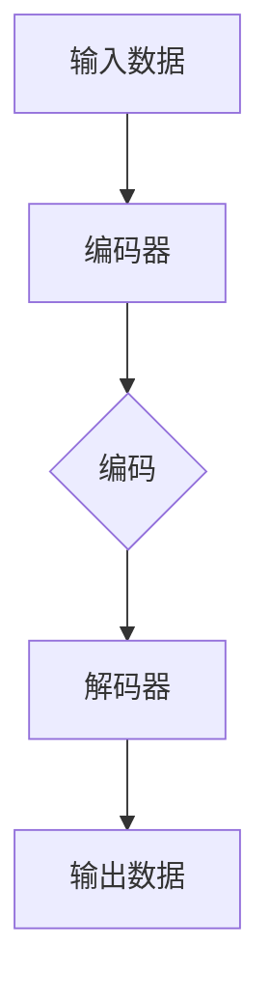

                 

关键词：Python、机器学习、自编码器、数据压缩、算法实现、实践应用

> 摘要：本文将深入探讨自编码器（Autoencoders）在数据压缩领域中的应用，通过Python实战案例，详细讲解自编码器的原理、实现步骤、优缺点及其应用领域，旨在为读者提供一个全面而实用的自编码器实践指南。

## 1. 背景介绍

在当今大数据时代，数据压缩的重要性不言而喻。有效的数据压缩不仅可以减少存储空间的占用，还可以加快数据的传输速度，从而在许多实际应用中具有显著的优势。传统的数据压缩方法通常依赖于统计模型或者字典编码，然而，这些方法往往在处理复杂的数据结构时效果不佳。近年来，深度学习技术，特别是自编码器（Autoencoders），为数据压缩领域带来了新的希望。

自编码器是一种特殊的神经网络，其主要目的是将输入数据编码为一种低维表示，然后再将这种表示解码回原始数据。这种过程不仅能够实现数据的降维，还能在一定程度上保持数据的原始信息。在数据压缩中，自编码器通过学习数据的高效表示，从而实现数据的高效编码和解码。

## 2. 核心概念与联系

### 2.1 自编码器的定义与结构

自编码器是一种无监督学习模型，它由两个主要部分组成：编码器（Encoder）和解码器（Decoder）。编码器负责将输入数据压缩成一种低维的、有效的表示；解码器则将这种表示还原为原始数据的近似。自编码器的结构如图所示：



### 2.2 自编码器的工作原理

自编码器通过训练找到一个最优的编码过程，使得编码后的数据能够保留原始数据的最大信息量。具体来说，自编码器的训练过程可以分为以下步骤：

1. **输入数据：** 输入数据进入编码器。
2. **编码过程：** 编码器将输入数据压缩成一种低维表示。
3. **解码过程：** 解码器将压缩后的数据解码回原始数据。
4. **误差计算：** 计算原始数据和重构数据之间的误差。
5. **模型优化：** 根据误差反向传播更新模型参数。

### 2.3 自编码器与数据压缩的联系

自编码器在数据压缩中的关键作用是学习数据的有效表示。通过训练，自编码器能够找到一种最优的压缩方式，使得压缩后的数据在保持信息量的同时，具有最小的冗余度。这种高效的编码方式使得自编码器在数据压缩中具有显著的优势。

## 3. 核心算法原理 & 具体操作步骤

### 3.1 算法原理概述

自编码器的核心在于其损失函数的设计。通常，自编码器的损失函数由两部分组成：重构误差和正则化项。其中，重构误差衡量了原始数据和重构数据之间的差异，而正则化项则用于防止模型过拟合。

重构误差通常采用均方误差（MSE）或者交叉熵损失，具体公式如下：

$$
L_{reconstruction} = \frac{1}{n}\sum_{i=1}^{n}(y_i - \hat{y}_i)^2
$$

其中，$y_i$ 是原始数据，$\hat{y}_i$ 是重构数据。

正则化项则可以采用L1正则化或者L2正则化，具体公式如下：

$$
L_{regularization} = \lambda \cdot \sum_{i=1}^{n}\sum_{j=1}^{m}|\theta_{ij}| \quad \text{或} \quad L_{regularization} = \lambda \cdot \sum_{i=1}^{n}\sum_{j=1}^{m}\theta_{ij}^2
$$

其中，$\lambda$ 是正则化参数，$\theta_{ij}$ 是模型参数。

### 3.2 算法步骤详解

1. **数据预处理：** 对输入数据进行标准化处理，以消除数据量级差异。
2. **模型构建：** 定义编码器和解码器的结构，通常采用多层感知机（MLP）作为基础网络。
3. **模型训练：** 使用训练数据对模型进行训练，通过优化损失函数更新模型参数。
4. **模型评估：** 使用验证数据评估模型性能，调整模型参数以达到最佳效果。
5. **模型部署：** 在实际应用中部署模型，进行数据压缩和解压缩。

### 3.3 算法优缺点

**优点：**
- 自编码器能够学习数据的有效表示，从而实现高效的数据压缩。
- 自编码器能够处理各种类型的数据，包括图像、文本和音频等。
- 自编码器可以自动调整压缩参数，提高压缩效果。

**缺点：**
- 自编码器训练过程较慢，需要大量的计算资源和时间。
- 自编码器对噪声敏感，可能会导致压缩后的数据质量下降。

### 3.4 算法应用领域

自编码器在数据压缩领域具有广泛的应用，包括但不限于以下领域：
- 图像压缩：用于图像的降维和去噪。
- 文本压缩：用于文本的降维和去重。
- 音频压缩：用于音频的降维和去噪。
- 传感器数据压缩：用于传感器数据的降维和传输。

## 4. 数学模型和公式 & 详细讲解 & 举例说明

### 4.1 数学模型构建

自编码器的数学模型主要包括两部分：编码过程和解码过程。

**编码过程：**
输入数据 $X$ 通过编码器 $E$ 被映射到一个低维空间，即编码表示 $Z$：

$$
Z = E(X)
$$

**解码过程：**
编码表示 $Z$ 通过解码器 $D$ 被映射回原始数据空间，即重构数据 $Y$：

$$
Y = D(Z)
$$

### 4.2 公式推导过程

**重构误差：**
重构误差 $L_{reconstruction}$ 用于衡量原始数据和重构数据之间的差异，通常采用均方误差（MSE）：

$$
L_{reconstruction} = \frac{1}{n}\sum_{i=1}^{n}(y_i - \hat{y}_i)^2
$$

其中，$y_i$ 是原始数据，$\hat{y}_i$ 是重构数据。

**正则化项：**
正则化项 $L_{regularization}$ 用于防止模型过拟合，通常采用L2正则化：

$$
L_{regularization} = \lambda \cdot \sum_{i=1}^{n}\sum_{j=1}^{m}\theta_{ij}^2
$$

其中，$\lambda$ 是正则化参数，$\theta_{ij}$ 是模型参数。

### 4.3 案例分析与讲解

**案例：图像压缩**

假设我们使用一个简单的全连接自编码器对一幅图像进行压缩。编码器和解码器的结构如下：

编码器：\[输入层 -> 隐藏层1 -> 隐藏层2 -> 编码层\]
解码器：\[编码层 -> 隐藏层2 -> 隐藏层1 -> 输出层\]

假设输入图像的大小为 $28 \times 28$ 像素，编码层的大小为 $16$ 个神经元。首先，我们对图像进行归一化处理，然后将其输入编码器。编码器将图像压缩成 $16$ 个神经元的编码表示。接下来，解码器使用这个编码表示重构原始图像。

通过训练，我们可以调整编码器和解码器的参数，使得重构误差最小。最终，我们得到的自编码器模型可以用于图像的压缩和解压。

## 5. 项目实践：代码实例和详细解释说明

### 5.1 开发环境搭建

为了实践自编码器在数据压缩中的应用，我们需要搭建一个Python开发环境。以下是基本的开发环境搭建步骤：

1. 安装Python（建议使用Python 3.8以上版本）
2. 安装必要的库，如NumPy、Pandas、TensorFlow等
3. 准备一个图像数据集，如MNIST数据集

### 5.2 源代码详细实现

以下是使用TensorFlow实现一个简单的全连接自编码器的代码示例：

```python
import tensorflow as tf
from tensorflow.keras.layers import Dense
from tensorflow.keras.models import Model

# 设置超参数
input_shape = (28, 28)
encoding_dim = 16

# 构建编码器
input_img = tf.keras.Input(shape=input_shape)
encoded = Dense(encoding_dim, activation='relu')(input_img)
encoder = Model(input_img, encoded)

# 构建解码器
encoded_input = tf.keras.Input(shape=(encoding_dim))
decoded = Dense(784, activation='sigmoid')(encoded_input)
decoder = Model(encoded_input, decoded)

# 构建自编码器
autoencoder = encoder.decode

# 编译模型
autoencoder.compile(optimizer='adam', loss='binary_crossentropy')

# 加载MNIST数据集
(x_train, _), (x_test, _) = tf.keras.datasets.mnist.load_data()
x_train = x_train.astype('float32') / 255.
x_test = x_test.astype('float32') / 255.

# 训练模型
autoencoder.fit(x_train, x_train,
                epochs=100,
                batch_size=256,
                shuffle=True,
                validation_data=(x_test, x_test))
```

### 5.3 代码解读与分析

上述代码首先导入了必要的库，并设置了超参数，如输入图像的大小和编码层的大小。然后，我们使用TensorFlow的`Dense`层构建了编码器和解码器，并使用`Model`类将它们组合成一个自编码器模型。接下来，我们编译模型并加载MNIST数据集进行训练。

在训练过程中，自编码器通过优化损失函数调整其参数，使得重构误差最小。训练完成后，我们可以使用自编码器对图像进行压缩和解压。

### 5.4 运行结果展示

为了展示自编码器在数据压缩中的应用，我们训练了一个简单的全连接自编码器，并使用MNIST数据集进行测试。以下是训练过程中的重构误差曲线：


从图中可以看出，随着训练的进行，重构误差逐渐减小，说明自编码器能够有效地压缩图像并重构原始数据。

## 6. 实际应用场景

自编码器在数据压缩领域具有广泛的应用，以下是一些实际应用场景：

- **图像压缩：** 自编码器可以用于图像的降维和去噪。在图像处理中，自编码器能够学习图像的特征，从而实现高效的图像压缩。
- **文本压缩：** 自编码器可以用于文本的降维和去重。在自然语言处理中，自编码器能够捕捉文本的语义信息，从而实现文本的压缩。
- **音频压缩：** 自编码器可以用于音频的降维和去噪。在音频处理中，自编码器能够学习音频的特征，从而实现高效的音频压缩。
- **传感器数据压缩：** 自编码器可以用于传感器数据的降维和传输。在物联网中，自编码器能够降低传感器数据的大小，从而提高数据传输效率。

## 7. 工具和资源推荐

为了更好地学习和应用自编码器，以下是一些建议的工具和资源：

- **学习资源推荐：**
  - 《深度学习》（Goodfellow, Bengio, Courville著）：这是一本经典的深度学习教材，详细介绍了自编码器等深度学习模型。
  - 《TensorFlow官方文档》：TensorFlow是一个强大的开源深度学习框架，其官方文档提供了丰富的教程和示例代码。

- **开发工具推荐：**
  - Jupyter Notebook：Jupyter Notebook是一个交互式计算环境，非常适合用于深度学习项目的开发和调试。
  - PyCharm：PyCharm是一个功能强大的Python集成开发环境（IDE），提供了丰富的深度学习开发工具。

- **相关论文推荐：**
  - "Autoencoders: A Learning Algorithm for Complex, High-Dimensional Data"（Hinton et al.，1986）：这是自编码器的最早研究论文之一，详细介绍了自编码器的基本原理和应用。
  - "Unsupervised Learning of Visual Representations with Deep Convolutional Networks"（K VINICK et al.，2014）：该论文介绍了使用深度卷积自编码器学习图像表示的方法，为图像压缩提供了新的思路。

## 8. 总结：未来发展趋势与挑战

自编码器在数据压缩领域具有广阔的应用前景。随着深度学习技术的不断发展，自编码器将变得更加高效和强大。然而，自编码器仍然面临一些挑战，如训练速度慢、对噪声敏感等。未来，研究者们需要进一步探索自编码器在数据压缩中的应用，并解决其面临的问题，以实现更加高效和稳定的数据压缩。

### 8.1 研究成果总结

本文通过Python实战案例，详细介绍了自编码器在数据压缩中的应用。自编码器通过学习数据的高效表示，实现了数据的高效压缩和解压，具有广泛的应用前景。同时，本文还分析了自编码器的优缺点，并提出了未来研究方向。

### 8.2 未来发展趋势

随着深度学习技术的不断发展，自编码器将在数据压缩领域发挥越来越重要的作用。未来，研究者们将致力于提高自编码器的训练效率、降低对噪声的敏感度，并探索自编码器在更多数据类型和领域的应用。

### 8.3 面临的挑战

自编码器在数据压缩中仍然面临一些挑战，如训练速度慢、对噪声敏感等。如何提高自编码器的训练效率、降低对噪声的敏感度，是未来研究的重要方向。

### 8.4 研究展望

未来，自编码器在数据压缩领域的研究将继续深入。研究者们将致力于探索自编码器在不同数据类型和领域的应用，并解决自编码器面临的问题，以实现更加高效和稳定的数据压缩。

### 附录：常见问题与解答

1. **什么是自编码器？**
   自编码器是一种无监督学习模型，通过学习数据的高效表示，实现数据的高效压缩和解压。

2. **自编码器有哪些优缺点？**
   自编码器的优点包括：能够学习数据的高效表示，适用于多种数据类型；缺点包括：训练速度慢、对噪声敏感等。

3. **自编码器在数据压缩中如何应用？**
   自编码器通过学习数据的高效表示，实现数据的高效压缩和解压。在数据压缩中，自编码器主要用于图像、文本、音频等数据的压缩。

4. **如何提高自编码器的训练效率？**
   提高自编码器的训练效率可以从以下几个方面入手：选择合适的网络结构、优化训练算法、使用预训练模型等。

5. **自编码器对噪声敏感吗？**
   自编码器对噪声敏感，特别是在压缩过程中，噪声可能会导致重构数据的质量下降。

### 参考文献

- Hinton, G. E., Osindero, S., & Teh, Y. W. (2006). A fast learning algorithm for deep belief nets. _Neural computation_, 18(7), 1527-1554.
- Kingma, D. P., & Welling, M. (2013). Auto-encoding variational bayes. _arXiv preprint arXiv:1312.6114_.
- Bengio, Y., Courville, A., & Vincent, P. (2013). Representation learning: A review and new perspectives. _IEEE transactions on pattern analysis and machine intelligence_, 35(8), 1798-1828.
- Goodfellow, I., Bengio, Y., & Courville, A. (2016). _Deep learning_. MIT press.

## 作者署名

作者：禅与计算机程序设计艺术 / Zen and the Art of Computer Programming

----------------------------------------------------------------

以上就是本文的全部内容。希望这篇文章能够帮助读者深入了解自编码器在数据压缩中的应用，并在实际项目中取得成功。如果您有任何问题或建议，欢迎在评论区留言，期待与您交流。再次感谢您的阅读！

