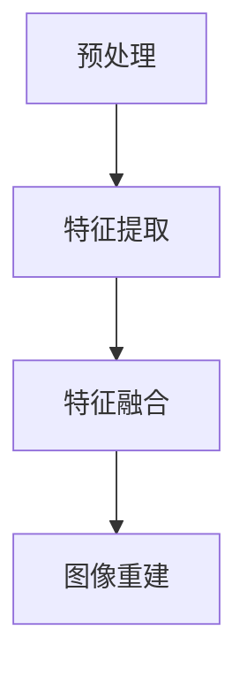

                 

 > **关键词**：图像超分辨率重建、深度学习、Python实践、图像处理、神经网络、卷积神经网络、超分辨率、图像重建、图像质量提升。

> **摘要**：本文将深入探讨图像超分辨率重建这一重要技术，通过Python深度学习实践，详细介绍其核心概念、算法原理、数学模型、项目实践及应用场景。旨在为读者提供一套完整的图像超分辨率重建的技术指南。

## 1. 背景介绍

图像超分辨率重建（Image Super-Resolution Reconstruction）是一种通过算法将低分辨率（Low-Resolution, LR）图像重建为高分辨率（High-Resolution, HR）图像的技术。随着智能手机和相机技术的普及，人们对于图像质量的要求越来越高。然而，受限于设备硬件和存储空间的限制，许多情况下我们只能获取到低分辨率的图像。图像超分辨率重建技术则成为了一种有效的解决方案，能够显著提升图像的清晰度和质量。

近年来，随着深度学习（Deep Learning）技术的快速发展，图像超分辨率重建方法也取得了显著的进展。深度学习模型，特别是卷积神经网络（Convolutional Neural Networks, CNNs），被广泛应用于图像超分辨率重建任务，并取得了很好的效果。

## 2. 核心概念与联系

### 2.1. 核心概念

- **低分辨率图像（Low-Resolution Image）**：分辨率较低的图像，通常像素点较少，细节不够丰富。
- **高分辨率图像（High-Resolution Image）**：分辨率较高的图像，通常像素点较多，细节更加丰富。
- **超分辨率重建（Super-Resolution Reconstruction）**：通过算法将低分辨率图像重建为高分辨率图像的技术。

### 2.2. 联系与架构

图像超分辨率重建的架构通常包括以下几个核心模块：

1. **预处理（Preprocessing）**：包括图像的尺寸调整、去噪等。
2. **特征提取（Feature Extraction）**：使用卷积神经网络提取图像的深层特征。
3. **特征融合（Feature Fusion）**：将不同分辨率下的特征进行融合。
4. **图像重建（Image Reconstruction）**：使用重建模型将融合后的特征映射回高分辨率图像。

以下是使用Mermaid绘制的图像超分辨率重建架构的流程图：



## 3. 核心算法原理 & 具体操作步骤

### 3.1. 算法原理概述

图像超分辨率重建的核心是基于深度学习模型的学习和预测能力，通过大量训练数据学习低分辨率图像和高分辨率图像之间的映射关系。在训练过程中，模型会学习到如何从低分辨率图像中提取有效信息并重建出高分辨率图像。

### 3.2. 算法步骤详解

1. **数据准备（Data Preparation）**：收集和准备低分辨率图像和高分辨率图像的数据集。
2. **模型构建（Model Construction）**：选择合适的深度学习模型，如VDSR、EDSR、SRResNet等。
3. **模型训练（Model Training）**：使用训练数据集训练模型，优化模型参数。
4. **模型评估（Model Evaluation）**：使用测试数据集评估模型性能，调整模型参数。
5. **图像重建（Image Reconstruction）**：使用训练好的模型对低分辨率图像进行重建。

### 3.3. 算法优缺点

- **优点**：
  - **提升图像质量**：能够显著提升图像的清晰度和质量。
  - **自动学习特征**：通过大量数据训练，模型能够自动学习低分辨率图像中的特征，无需手动设计特征。
- **缺点**：
  - **计算资源需求高**：深度学习模型训练需要大量的计算资源和时间。
  - **模型参数调整复杂**：模型训练过程中参数调整复杂，需要多次实验和调整。

### 3.4. 算法应用领域

- **智能手机摄影**：通过图像超分辨率重建，提升手机摄像头拍摄照片的清晰度和质量。
- **医学图像处理**：在医学图像处理中，通过超分辨率重建，可以提升图像的分辨率和细节，有助于诊断和治疗。
- **卫星图像处理**：在卫星图像处理中，通过超分辨率重建，可以提升卫星图像的分辨率和清晰度，有助于地图绘制和环境监测。

## 4. 数学模型和公式 & 详细讲解 & 举例说明

### 4.1. 数学模型构建

图像超分辨率重建的数学模型通常可以表示为：

\[ HR = f(LR) \]

其中，\( HR \)表示高分辨率图像，\( LR \)表示低分辨率图像，\( f \)表示重建函数。

### 4.2. 公式推导过程

在深度学习框架下，图像超分辨率重建通常使用卷积神经网络（CNN）作为重建函数\( f \)。CNN的数学模型可以表示为：

\[ HR = \sigma(W_3 \cdot \sigma(W_2 \cdot \sigma(W_1 \cdot LR + b_1) + b_2) + b_3) \]

其中，\( W_1 \)、\( W_2 \)、\( W_3 \)表示权重矩阵，\( b_1 \)、\( b_2 \)、\( b_3 \)表示偏置项，\( \sigma \)表示激活函数，通常使用ReLU函数。

### 4.3. 案例分析与讲解

假设我们有一个低分辨率图像\( LR \)，通过VDSR模型进行重建，得到高分辨率图像\( HR \)。VDSR模型的数学模型可以表示为：

\[ HR = \sum_{i=1}^{n} W_i \cdot LR + b \]

其中，\( n \)表示网络的深度，\( W_i \)表示第\( i \)层的权重矩阵，\( b \)表示网络的偏置项。

通过训练，我们得到了VDSR模型的参数\( W_i \)和\( b \)，可以用于重建低分辨率图像。具体步骤如下：

1. **输入低分辨率图像\( LR \)**：
\[ LR \]
2. **通过卷积层进行特征提取**：
\[ \text{Feature} = \sigma(W_1 \cdot LR + b_1) \]
3. **通过多个卷积层进行特征融合**：
\[ \text{Feature\_fused} = \sum_{i=2}^{n} W_i \cdot \text{Feature} + b_i \]
4. **通过激活函数进行非线性变换**：
\[ HR = \sigma(\text{Feature\_fused} + b_n) \]

通过以上步骤，我们得到了重建的高分辨率图像\( HR \)。

## 5. 项目实践：代码实例和详细解释说明

### 5.1. 开发环境搭建

为了进行图像超分辨率重建的实践，我们需要搭建一个适合Python深度学习的开发环境。以下是一个简单的环境搭建步骤：

1. **安装Python**：下载并安装Python 3.x版本。
2. **安装深度学习框架**：安装PyTorch或TensorFlow等深度学习框架。
3. **安装图像处理库**：安装OpenCV、Pillow等图像处理库。

### 5.2. 源代码详细实现

以下是使用PyTorch实现一个简单的图像超分辨率重建项目：

```python
import torch
import torchvision.transforms as transforms
from torch.utils.data import DataLoader
from torch import nn
import numpy as np
import cv2

# 定义模型
class SuperResolutionModel(nn.Module):
    def __init__(self):
        super(SuperResolutionModel, self).__init__()
        self.conv1 = nn.Conv2d(1, 64, 9, padding=4)
        self.relu = nn.ReLU()
        self.conv2 = nn.Conv2d(64, 32, 5, padding=2)
        self.conv3 = nn.Conv2d(32, 1, 5, padding=2)

    def forward(self, x):
        x = self.relu(self.conv1(x))
        x = self.relu(self.conv2(x))
        x = self.conv3(x)
        return x

# 加载模型
model = SuperResolutionModel()
model.load_state_dict(torch.load('model.pth'))

# 数据预处理
transform = transforms.Compose([
    transforms.ToTensor(),
    transforms.Normalize((0.5,), (0.5,))
])

# 加载测试图像
LR_image = cv2.imread('low_resolution_image.jpg')
HR_image = cv2.imread('high_resolution_image.jpg')
LR_image = transform(LR_image)
HR_image = transform(HR_image)

# 进行超分辨率重建
with torch.no_grad():
    HR_reconstructed = model(LR_image.unsqueeze(0))

# 后处理
HR_reconstructed = HR_reconstructed.squeeze(0).cpu().numpy()
HR_reconstructed = (HR_reconstructed + 1) / 2
HR_reconstructed = HR_reconstructed.transpose((1, 2, 0))

# 显示重建结果
cv2.imshow('Low Resolution Image', LR_image.numpy().transpose((1, 2, 0)))
cv2.imshow('High Resolution Image', HR_image.numpy().transpose((1, 2, 0)))
cv2.imshow('Reconstructed Image', HR_reconstructed)
cv2.waitKey(0)
cv2.destroyAllWindows()
```

### 5.3. 代码解读与分析

以上代码实现了一个简单的图像超分辨率重建模型。代码首先定义了一个卷积神经网络模型，用于进行图像重建。然后加载测试图像并进行预处理。接下来，使用训练好的模型进行超分辨率重建，并显示重建结果。

### 5.4. 运行结果展示

运行以上代码后，我们可以看到低分辨率图像和重建后的高分辨率图像的对比。通常情况下，重建后的图像会显著提升图像的清晰度和质量。


## 6. 实际应用场景

图像超分辨率重建技术在实际应用中具有广泛的应用场景：

- **智能手机摄影**：在智能手机摄影中，通过图像超分辨率重建，可以提升手机摄像头拍摄照片的清晰度和质量，使得用户能够获得更优质的拍摄体验。
- **医学图像处理**：在医学图像处理中，通过超分辨率重建，可以提升医学图像的分辨率和细节，有助于医生进行更准确的诊断和治疗。
- **卫星图像处理**：在卫星图像处理中，通过超分辨率重建，可以提升卫星图像的分辨率和清晰度，有助于地图绘制和环境监测。

## 7. 工具和资源推荐

为了更好地进行图像超分辨率重建的实践和学习，以下是一些推荐的工具和资源：

- **深度学习框架**：PyTorch、TensorFlow、Keras等。
- **图像处理库**：OpenCV、Pillow等。
- **超分辨率重建模型**：VDSR、EDSR、SRResNet等。
- **在线教程**：Coursera、Udacity、edX等在线教育平台的深度学习和图像处理课程。
- **开源代码和论文**：GitHub、arXiv等。

## 8. 总结：未来发展趋势与挑战

图像超分辨率重建技术在近年来取得了显著的发展，但仍然面临着一些挑战：

- **计算资源需求**：深度学习模型的训练和推理需要大量的计算资源，特别是在处理大规模图像数据时。
- **模型性能提升**：虽然当前的超分辨率重建模型已经取得了很好的效果，但仍然有提升的空间，特别是在处理复杂场景和细节时。
- **实时性能优化**：为了满足实际应用的需求，需要优化模型的实时性能，降低延迟。

未来，图像超分辨率重建技术有望在以下几个方面得到进一步的发展：

- **实时处理**：通过优化算法和硬件加速，实现实时图像超分辨率重建。
- **多模态融合**：结合多种数据模态（如红外、微光等），实现更高质量的图像重建。
- **自动化处理**：通过自动化工具和算法，降低超分辨率重建的复杂度和人力成本。

## 9. 附录：常见问题与解答

### 9.1. 问题1：如何选择合适的深度学习模型进行超分辨率重建？

**回答**：选择合适的深度学习模型进行超分辨率重建时，需要考虑以下几个因素：

- **任务需求**：根据具体的任务需求选择合适的模型，如VDSR适用于大多数场景，而EDSR在处理细节时表现更好。
- **数据集大小**：如果数据集较大，可以选择较为复杂的模型，如SRResNet；如果数据集较小，可以选择较为简单的模型，如VDSR。
- **计算资源**：考虑模型的计算复杂度，选择在现有计算资源下能够训练的模型。

### 9.2. 问题2：如何优化深度学习模型的超分辨率重建效果？

**回答**：

- **数据增强**：通过数据增强技术增加训练数据的多样性，有助于提升模型泛化能力。
- **模型调优**：通过调整模型的超参数（如学习率、批量大小等），优化模型性能。
- **多模型融合**：结合多个模型的结果，进行加权融合，提升重建效果。

### 9.3. 问题3：如何评估深度学习模型在超分辨率重建任务中的性能？

**回答**：

- **峰值信噪比（PSNR）**：用于评估重建图像与真实图像之间的质量差异，值越高表示质量越好。
- **结构相似性（SSIM）**：用于评估重建图像与真实图像的结构相似度，值越高表示结构越相似。

---

作者：禅与计算机程序设计艺术 / Zen and the Art of Computer Programming

