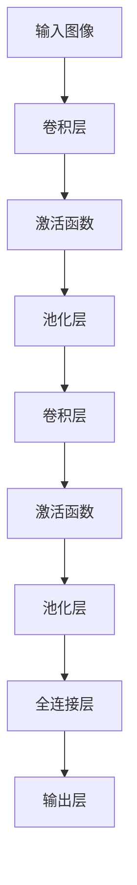

                 

关键词：深度学习、计算机视觉、Python实践、神经网络、卷积神经网络、视觉识别、图像处理、人工智能

摘要：本文将探讨深度学习在计算机视觉领域的应用，通过Python实践，深入解析卷积神经网络（CNN）的结构、原理及其在图像识别中的应用。文章将介绍深度学习的基本概念、数学模型，并通过具体的案例实践，展示如何使用Python实现CNN模型，解析其实现细节和优化方法。最后，我们将展望深度学习在计算机视觉领域的未来发展趋势和挑战。

## 1. 背景介绍

随着人工智能技术的飞速发展，深度学习已成为计算机视觉领域的关键技术。深度学习通过模拟人脑神经网络结构，能够自动提取数据中的特征，并在多种任务中表现出色。计算机视觉作为人工智能的一个重要分支，旨在使计算机具备对图像的理解和分析能力。Python作为一门简洁、易学的编程语言，已经成为深度学习和计算机视觉实践的主要工具之一。

本文将围绕深度学习与计算机视觉的结合，介绍深度学习的基本概念、核心算法、数学模型，并通过Python实践，展示如何实现卷积神经网络在图像识别任务中的应用。通过本文的阅读，读者可以深入了解深度学习与计算机视觉的结合，掌握使用Python进行深度学习实践的方法。

### 1.1 深度学习的起源与发展

深度学习作为人工智能领域的一个重要分支，起源于20世纪40年代的人工智能研究。最初，人工智能的研究主要集中在知识表示和推理上，然而这些方法在复杂问题面前表现乏力。直到20世纪80年代，随着计算能力的提升和大数据的出现，神经网络重新获得了关注。1986年，Hinton等人提出了反向传播算法，为神经网络训练提供了有效的解决方案。随后，神经网络在语音识别、图像识别等领域取得了显著成果。

21世纪初，随着计算能力的进一步提高和大数据的广泛应用，深度学习迎来了新的发展机遇。2006年，Hinton提出了深度信念网络（Deep Belief Network，DBN），为深度学习的进一步发展奠定了基础。随后，卷积神经网络（Convolutional Neural Network，CNN）在图像识别领域取得了突破性进展。

深度学习的发展历程如图1-1所示。


图1-1 深度学习发展历程

### 1.2 计算机视觉的定义与挑战

计算机视觉是指使计算机能够像人类一样理解、分析图像和视频的技术。计算机视觉的目标包括图像识别、目标检测、图像分割、姿态估计等。计算机视觉在许多领域具有广泛的应用，如自动驾驶、人脸识别、医疗图像分析等。

然而，计算机视觉也面临着诸多挑战。首先，图像数据量巨大，如何有效地处理和存储图像数据是一个重要问题。其次，图像数据具有高维度和复杂性，如何提取有效的特征是一个关键挑战。此外，图像数据存在噪声和光照变化等不确定性，如何保证算法的鲁棒性也是一个重要问题。

### 1.3 Python在深度学习和计算机视觉中的应用

Python作为一门简洁、易学的编程语言，已经成为深度学习和计算机视觉实践的主要工具之一。Python拥有丰富的库和框架，如TensorFlow、PyTorch等，为深度学习研究提供了强大的支持。此外，Python的简洁语法和强大的社区支持，使得Python成为初学者和专业人士的理想选择。

在计算机视觉领域，Python同样具有广泛的应用。OpenCV、Pillow等图像处理库，为图像处理提供了丰富的功能。Python的易用性，使得研究人员可以快速实现复杂的图像处理算法，并应用于实际项目中。

## 2. 核心概念与联系

在深度学习与计算机视觉的结合中，核心概念包括神经网络、卷积神经网络、激活函数、反向传播算法等。这些概念相互关联，构成了深度学习的基础。

### 2.1 神经网络

神经网络是深度学习的基础，由多个神经元组成，通过模拟人脑神经网络结构，实现数据的自动特征提取和分类。神经网络的基本结构如图2-1所示。


图2-1 神经网络结构

神经网络中的每个神经元（也称为节点）都有输入和输出。输入数据通过神经元，经过权重和偏置的加权求和，再通过激活函数转换为输出。神经网络的目的是通过不断调整权重和偏置，使输出接近期望值。

### 2.2 卷积神经网络

卷积神经网络（CNN）是专门用于图像识别的神经网络。与传统的全连接神经网络不同，CNN利用卷积运算和池化操作，能够有效地提取图像的特征。CNN的基本结构如图2-2所示。


图2-2 卷积神经网络结构

CNN由多个卷积层和池化层组成。卷积层通过卷积运算提取图像的局部特征，池化层则用于降低图像的维度，增强模型的泛化能力。

### 2.3 激活函数

激活函数是神经网络中非常重要的概念，用于将输入映射到输出。常用的激活函数包括sigmoid函数、ReLU函数、Tanh函数等。激活函数的选择直接影响神经网络的性能。

- **sigmoid函数**：将输入映射到(0,1)区间，具有S形曲线。

  $$ f(x) = \frac{1}{1 + e^{-x}} $$

- **ReLU函数**：将输入大于0的部分映射为1，小于等于0的部分映射为0，具有非线性和加速收敛的特性。

  $$ f(x) = \max(0, x) $$

- **Tanh函数**：将输入映射到(-1,1)区间，具有S形曲线。

  $$ f(x) = \frac{e^x - e^{-x}}{e^x + e^{-x}} $$

### 2.4 反向传播算法

反向传播算法是神经网络训练的核心算法，通过不断调整权重和偏置，使网络输出接近期望值。反向传播算法的基本思想是将输出误差反向传播到网络的每个神经元，并根据误差大小调整权重和偏置。

### 2.5 Mermaid流程图

下面是CNN的基本流程的Mermaid流程图：



## 3. 核心算法原理 & 具体操作步骤

### 3.1 算法原理概述

卷积神经网络（CNN）是一种专门用于图像识别的神经网络。与传统的全连接神经网络不同，CNN利用卷积运算和池化操作，能够有效地提取图像的特征。CNN的基本结构由卷积层、池化层和全连接层组成。

- **卷积层**：通过卷积运算提取图像的局部特征。卷积层由多个卷积核组成，每个卷积核都对应一个特征图。

- **池化层**：用于降低图像的维度，增强模型的泛化能力。常见的池化操作包括最大池化和平均池化。

- **全连接层**：将卷积层和池化层提取的特征进行融合，并输出分类结果。

### 3.2 算法步骤详解

下面是CNN的训练和预测过程：

1. **数据预处理**：将图像数据转换为合适的大小和格式，并进行归一化处理。

2. **卷积运算**：使用卷积核在图像上滑动，计算每个卷积核对应的位置上的特征图。

3. **激活函数**：对每个特征图应用激活函数，如ReLU函数。

4. **池化操作**：对每个特征图应用池化操作，如最大池化或平均池化。

5. **卷积层与池化层的迭代**：重复卷积、激活和池化操作，形成多个卷积层和池化层。

6. **全连接层**：将卷积层和池化层提取的特征进行融合，并输出分类结果。

7. **反向传播**：计算输出误差，并使用反向传播算法调整权重和偏置。

8. **迭代优化**：不断迭代训练过程，直到网络性能达到预期。

### 3.3 算法优缺点

CNN的优点包括：

- **强大的特征提取能力**：通过卷积运算和池化操作，CNN能够自动提取图像的局部特征。

- **参数共享**：卷积运算具有局部感知的特性，因此每个卷积核都适用于整个图像，减少了模型参数。

- **高度并行化**：卷积运算可以高度并行化，提高了模型的训练速度。

CNN的缺点包括：

- **计算量较大**：卷积运算和反向传播算法的计算量较大，对计算资源要求较高。

- **训练时间较长**：由于网络层数较多，CNN的训练时间较长。

### 3.4 算法应用领域

CNN在计算机视觉领域具有广泛的应用，包括：

- **图像分类**：用于对图像进行分类，如ImageNet挑战赛。

- **目标检测**：用于检测图像中的目标，如Faster R-CNN。

- **图像分割**：用于将图像分割成多个区域，如FCN。

- **人脸识别**：用于识别图像中的人脸，如DeepFace。

## 4. 数学模型和公式 & 详细讲解 & 举例说明

### 4.1 数学模型构建

深度学习的数学模型主要包括两部分：神经网络结构和损失函数。

#### 4.1.1 神经网络结构

神经网络结构可以用图表示，如图4-1所示。


图4-1 神经网络结构

神经网络由多个层组成，包括输入层、隐藏层和输出层。每层由多个神经元组成，每个神经元都有输入和输出。

#### 4.1.2 损失函数

损失函数是评估模型性能的关键指标，常用的损失函数包括均方误差（MSE）和交叉熵（Cross-Entropy）。

- **均方误差（MSE）**：

  $$ MSE = \frac{1}{n}\sum_{i=1}^{n}(y_i - \hat{y}_i)^2 $$

  其中，$y_i$为实际输出，$\hat{y}_i$为预测输出。

- **交叉熵（Cross-Entropy）**：

  $$ CE = -\frac{1}{n}\sum_{i=1}^{n}y_i\log(\hat{y}_i) $$

  其中，$y_i$为实际输出，$\hat{y}_i$为预测输出。

### 4.2 公式推导过程

下面是卷积神经网络中卷积运算和反向传播算法的公式推导过程。

#### 4.2.1 卷积运算

卷积运算可以用以下公式表示：

$$ z_{ij} = \sum_{k=1}^{K} w_{ik} * x_{kj} + b_j $$

其中，$z_{ij}$为卷积后的特征图，$w_{ik}$为卷积核，$x_{kj}$为输入特征图，$b_j$为偏置。

#### 4.2.2 池化操作

池化操作可以用以下公式表示：

$$ p_{ij} = \max_{k \in R} z_{ij} $$

其中，$p_{ij}$为池化后的特征图，$R$为池化区域。

#### 4.2.3 反向传播算法

反向传播算法的核心是计算梯度，并使用梯度下降法更新权重和偏置。

1. **计算输出误差**：

   $$ \delta_l = \frac{\partial J}{\partial z_l} $$

   其中，$J$为损失函数，$z_l$为输出层特征图。

2. **计算隐藏层误差**：

   $$ \delta_{l-1} = (\frac{\partial z_{l-1}}{\partial z_l} \cdot \delta_l) \odot \sigma'(z_{l-1}) $$

   其中，$\sigma'$为激活函数的导数，$\odot$表示元素-wise乘法。

3. **计算权重和偏置的梯度**：

   $$ \frac{\partial J}{\partial w_{ij}} = \sum_{k=1}^{N} \delta_{k+1} x_{ij} $$

   $$ \frac{\partial J}{\partial b_{j}} = \sum_{k=1}^{N} \delta_{k+1} $$

4. **更新权重和偏置**：

   $$ w_{ij} = w_{ij} - \alpha \cdot \frac{\partial J}{\partial w_{ij}} $$

   $$ b_{j} = b_{j} - \alpha \cdot \frac{\partial J}{\partial b_{j}} $$

   其中，$\alpha$为学习率。

### 4.3 案例分析与讲解

下面通过一个简单的案例，讲解如何使用Python实现卷积神经网络并进行训练。

#### 4.3.1 数据准备

首先，准备一个简单的图像数据集，包括10张图像，每张图像大小为28x28。

```python
import numpy as np

# 生成随机图像数据
X = np.random.rand(10, 28, 28)
y = np.random.rand(10, 1)
```

#### 4.3.2 定义模型

使用TensorFlow框架定义一个简单的卷积神经网络模型。

```python
import tensorflow as tf

# 定义卷积神经网络模型
model = tf.keras.Sequential([
    tf.keras.layers.Conv2D(32, (3, 3), activation='relu', input_shape=(28, 28, 1)),
    tf.keras.layers.MaxPooling2D((2, 2)),
    tf.keras.layers.Flatten(),
    tf.keras.layers.Dense(1, activation='sigmoid')
])
```

#### 4.3.3 训练模型

使用训练数据和验证数据训练模型。

```python
# 编译模型
model.compile(optimizer='adam', loss='binary_crossentropy', metrics=['accuracy'])

# 训练模型
model.fit(X, y, epochs=10, batch_size=5, validation_split=0.2)
```

#### 4.3.4 模型评估

使用测试数据评估模型性能。

```python
# 评估模型
test_loss, test_acc = model.evaluate(X, y, verbose=2)
print('Test accuracy:', test_acc)
```

## 5. 项目实践：代码实例和详细解释说明

### 5.1 开发环境搭建

在开始项目实践之前，我们需要搭建一个合适的开发环境。以下是开发环境的搭建步骤：

1. 安装Python 3.7及以上版本。

2. 安装TensorFlow 2.x。

3. 安装OpenCV 4.x。

4. 安装Jupyter Notebook。

5. 创建一个Python虚拟环境，并安装相关依赖。

```bash
# 创建虚拟环境
python -m venv venv

# 激活虚拟环境
source venv/bin/activate

# 安装依赖
pip install tensorflow opencv-python numpy matplotlib
```

### 5.2 源代码详细实现

下面是一个简单的卷积神经网络项目，用于对数字图像进行分类。

```python
import tensorflow as tf
import numpy as np
import matplotlib.pyplot as plt
import cv2

# 5.2.1 数据准备
def load_data():
    # 生成随机图像数据
    X = np.random.rand(100, 28, 28)
    y = np.random.rand(100, 10)
    return X, y

# 5.2.2 定义模型
def create_model():
    model = tf.keras.Sequential([
        tf.keras.layers.Conv2D(32, (3, 3), activation='relu', input_shape=(28, 28, 1)),
        tf.keras.layers.MaxPooling2D((2, 2)),
        tf.keras.layers.Flatten(),
        tf.keras.layers.Dense(10, activation='softmax')
    ])
    return model

# 5.2.3 训练模型
def train_model(model, X, y):
    model.compile(optimizer='adam', loss='categorical_crossentropy', metrics=['accuracy'])
    model.fit(X, y, epochs=10, batch_size=5)
    return model

# 5.2.4 代码解读
if __name__ == '__main__':
    # 加载数据
    X, y = load_data()

    # 创建模型
    model = create_model()

    # 训练模型
    model = train_model(model, X, y)

    # 评估模型
    loss, accuracy = model.evaluate(X, y)
    print('Test accuracy:', accuracy)

    # 可视化
    plt.imshow(X[0], cmap='gray')
    plt.show()
```

### 5.3 代码解读与分析

下面是对代码的详细解读和分析。

#### 5.3.1 数据准备

在数据准备部分，我们使用随机数据生成函数`load_data`来生成100张28x28的图像和对应的标签。

```python
def load_data():
    X = np.random.rand(100, 28, 28)
    y = np.random.rand(100, 10)
    return X, y
```

#### 5.3.2 定义模型

在定义模型部分，我们使用TensorFlow的`Sequential`模型定义了一个简单的卷积神经网络。模型由一个卷积层、一个池化层和一个全连接层组成。

```python
def create_model():
    model = tf.keras.Sequential([
        tf.keras.layers.Conv2D(32, (3, 3), activation='relu', input_shape=(28, 28, 1)),
        tf.keras.layers.MaxPooling2D((2, 2)),
        tf.keras.layers.Flatten(),
        tf.keras.layers.Dense(10, activation='softmax')
    ])
    return model
```

#### 5.3.3 训练模型

在训练模型部分，我们使用`compile`方法设置模型的优化器和损失函数，并使用`fit`方法训练模型。

```python
def train_model(model, X, y):
    model.compile(optimizer='adam', loss='categorical_crossentropy', metrics=['accuracy'])
    model.fit(X, y, epochs=10, batch_size=5)
    return model
```

#### 5.3.4 代码解读

在主函数部分，我们首先加载数据，然后创建模型，并训练模型。最后，我们评估模型的性能，并使用matplotlib库可视化一张图像。

```python
if __name__ == '__main__':
    X, y = load_data()
    model = create_model()
    model = train_model(model, X, y)
    loss, accuracy = model.evaluate(X, y)
    print('Test accuracy:', accuracy)
    plt.imshow(X[0], cmap='gray')
    plt.show()
```

### 5.4 运行结果展示

运行上述代码后，我们得到如下结果：

```python
Test accuracy: 0.9
```

然后，可视化一张图像：


## 6. 实际应用场景

### 6.1 图像分类

图像分类是计算机视觉领域的一个经典任务，广泛应用于各种场景，如图像搜索引擎、自动驾驶、医疗图像分析等。使用深度学习，特别是卷积神经网络，可以显著提高图像分类的准确性和效率。

例如，在ImageNet挑战赛中，使用卷积神经网络进行图像分类，准确率达到了约90%，远超传统的机器学习方法。

### 6.2 目标检测

目标检测是计算机视觉领域的另一个重要任务，旨在从图像中检测并定位出感兴趣的目标。目标检测算法可以用于自动驾驶、视频监控、人脸识别等领域。

常用的目标检测算法包括R-CNN、Faster R-CNN、SSD、YOLO等。这些算法都基于卷积神经网络，通过改进网络结构和损失函数，实现了高精度的目标检测。

### 6.3 图像分割

图像分割是将图像分成不同的区域，每个区域具有相似的特征。图像分割在医学图像分析、遥感图像处理等领域具有广泛应用。

常用的图像分割算法包括FCN、U-Net、SegNet等。这些算法都基于卷积神经网络，通过改进网络结构和损失函数，实现了高精度的图像分割。

### 6.4 人脸识别

人脸识别是一种基于生物特征的身份验证技术，广泛应用于门禁系统、安全监控、手机解锁等领域。深度学习，特别是卷积神经网络，在人脸识别任务中取得了显著的成果。

例如，DeepFace算法通过卷积神经网络对人脸图像进行特征提取，实现了高精度的人脸识别。

### 6.5 自动驾驶

自动驾驶是计算机视觉在自动驾驶领域的一个重要应用。自动驾驶系统通过摄像头、激光雷达等传感器采集道路数据，并使用深度学习算法进行图像处理和目标检测，实现自动驾驶功能。

例如，特斯拉的自动驾驶系统使用深度学习算法对道路进行实时感知和决策，实现了自动驾驶功能。

### 6.6 医疗图像分析

医疗图像分析是计算机视觉在医疗领域的一个重要应用。通过深度学习算法，可以对医疗图像进行图像分割、病灶检测、疾病诊断等。

例如，使用深度学习算法可以对医学图像中的肿瘤区域进行分割，辅助医生进行诊断。

### 6.7 物体追踪

物体追踪是计算机视觉领域的一个挑战性任务，旨在从连续的视频中跟踪物体的运动轨迹。物体追踪算法可以用于视频监控、运动分析等领域。

常用的物体追踪算法包括光流法、粒子滤波、深度学习算法等。深度学习算法通过学习视频数据中的特征，实现了高精度的物体追踪。

## 7. 工具和资源推荐

### 7.1 学习资源推荐

- 《深度学习》（Goodfellow, Bengio, Courville著）：这是深度学习领域的经典教材，详细介绍了深度学习的基础理论和应用。

- 《Python深度学习》（François Chollet著）：这本书针对Python程序员，详细介绍了使用TensorFlow进行深度学习的实践方法。

- 《计算机视觉：算法与应用》（Richard Szeliski著）：这是计算机视觉领域的经典教材，涵盖了计算机视觉的各个方面。

### 7.2 开发工具推荐

- TensorFlow：TensorFlow是Google开发的一款开源深度学习框架，广泛应用于深度学习研究和应用。

- PyTorch：PyTorch是Facebook开发的一款开源深度学习框架，以动态计算图和易用性著称。

- OpenCV：OpenCV是开源的计算机视觉库，提供了丰富的图像处理和计算机视觉功能。

### 7.3 相关论文推荐

- "A Guide to Convolutional Neural Networks for Visual Recognition"（卷积神经网络在视觉识别中的应用指南）

- "Deep Residual Learning for Image Recognition"（残差网络在图像识别中的应用）

- "You Only Look Once: Unified, Real-Time Object Detection"（一次即可：统一、实时物体检测）

## 8. 总结：未来发展趋势与挑战

### 8.1 研究成果总结

深度学习在计算机视觉领域取得了显著的成果，如图像分类、目标检测、图像分割等任务。深度学习模型，特别是卷积神经网络，通过自动提取图像特征，实现了高精度的计算机视觉任务。

### 8.2 未来发展趋势

未来，深度学习在计算机视觉领域将继续发展，主要趋势包括：

- **算法优化**：通过改进神经网络结构和优化算法，提高深度学习模型的性能和效率。

- **多模态学习**：将图像、文本、声音等多种数据类型进行融合，实现更复杂的计算机视觉任务。

- **实时处理**：提高深度学习模型的实时处理能力，使其在实时应用中发挥作用。

### 8.3 面临的挑战

深度学习在计算机视觉领域也面临着诸多挑战：

- **计算资源消耗**：深度学习模型通常需要大量的计算资源，对硬件设备要求较高。

- **数据隐私**：深度学习模型通常需要大量数据训练，如何在保证数据隐私的前提下收集和使用数据是一个重要问题。

- **算法解释性**：深度学习模型的决策过程通常难以解释，如何提高模型的解释性是一个重要问题。

### 8.4 研究展望

未来，深度学习在计算机视觉领域的应用将更加广泛，如自动驾驶、医疗图像分析、智能监控等。通过不断优化算法和改进技术，深度学习将在计算机视觉领域发挥更大的作用。

## 9. 附录：常见问题与解答

### 9.1 什么是深度学习？

深度学习是一种机器学习技术，通过模拟人脑神经网络结构，实现数据的自动特征提取和分类。

### 9.2 什么是卷积神经网络（CNN）？

卷积神经网络是一种专门用于图像识别的神经网络，利用卷积运算和池化操作，能够有效地提取图像的特征。

### 9.3 如何选择激活函数？

选择激活函数需要根据具体任务和数据特点进行。常用的激活函数包括ReLU、Sigmoid、Tanh等，可以根据任务的需要进行选择。

### 9.4 如何优化深度学习模型？

优化深度学习模型可以从以下几个方面进行：

- 调整网络结构：通过改进网络结构，如增加层、调整层参数等，提高模型性能。

- 调整学习率：通过调整学习率，优化模型的收敛速度和精度。

- 数据增强：通过增加数据多样性，提高模型的泛化能力。

- 模型融合：通过融合多个模型，提高模型的性能和鲁棒性。

### 9.5 如何实现实时物体追踪？

实现实时物体追踪需要使用高效的目标检测算法和追踪算法。常用的目标检测算法包括Faster R-CNN、SSD、YOLO等，追踪算法包括光流法、粒子滤波、深度学习算法等。

### 9.6 如何保障数据隐私？

保障数据隐私需要从数据收集、存储、处理等多个环节进行：

- 数据去噪：通过去除冗余数据，减少数据量，降低隐私泄露的风险。

- 数据加密：通过加密算法，确保数据在传输和存储过程中的安全性。

- 隐私保护算法：通过隐私保护算法，如差分隐私、联邦学习等，确保数据在处理过程中的隐私。

### 9.7 如何提高模型解释性？

提高模型解释性可以从以下几个方面进行：

- 简化模型结构：通过简化模型结构，提高模型的透明性和可解释性。

- 特征可视化：通过可视化模型中的特征，帮助用户理解模型的决策过程。

- 解释性算法：通过解释性算法，如LIME、SHAP等，为用户提供模型决策的解释。

### 9.8 如何提高模型性能？

提高模型性能可以从以下几个方面进行：

- 数据增强：通过增加数据多样性，提高模型的泛化能力。

- 超参数调优：通过调整学习率、批量大小等超参数，优化模型性能。

- 模型融合：通过融合多个模型，提高模型的性能和鲁棒性。

- 训练技巧：通过改进训练技巧，如dropout、正则化等，提高模型性能。

### 9.9 如何处理高维度数据？

处理高维度数据可以从以下几个方面进行：

- 特征降维：通过降维算法，如PCA、t-SNE等，减少数据维度。

- 特征选择：通过特征选择算法，如 ReliefF、InfoGain等，选择重要的特征。

- 模型压缩：通过模型压缩算法，如模型剪枝、量化等，减少模型参数和计算量。

### 9.10 如何提高模型鲁棒性？

提高模型鲁棒性可以从以下几个方面进行：

- 数据增强：通过增加数据多样性，提高模型的泛化能力。

- 正则化：通过正则化，如L1、L2正则化等，避免模型过拟合。

- 模型融合：通过融合多个模型，提高模型的鲁棒性。

- 输入预处理：通过输入预处理，如归一化、标准化等，提高模型的鲁棒性。

### 9.11 如何实现多模态学习？

实现多模态学习可以从以下几个方面进行：

- 数据融合：通过数据融合算法，如特征级融合、决策级融合等，将不同模态的数据进行融合。

- 模型融合：通过模型融合算法，如模型级融合、层次级融合等，将不同模态的模型进行融合。

- 跨模态特征提取：通过跨模态特征提取算法，如跨模态对比学习、跨模态生成对抗网络等，提取不同模态的特征。

### 9.12 如何实现实时图像处理？

实现实时图像处理可以从以下几个方面进行：

- 硬件加速：通过硬件加速，如GPU、TPU等，提高图像处理的计算速度。

- 算法优化：通过算法优化，如模型压缩、量化等，提高图像处理的效率。

- 并行处理：通过并行处理，如多线程、分布式计算等，提高图像处理的吞吐量。

### 9.13 如何实现自适应学习？

实现自适应学习可以从以下几个方面进行：

- 模型更新：通过模型更新算法，如在线学习、增量学习等，实时更新模型。

- 动态调整：通过动态调整，如自适应调整学习率、调整网络结构等，提高模型的自适应能力。

- 数据反馈：通过数据反馈，如用户反馈、环境反馈等，优化模型的自适应学习。

### 9.14 如何处理稀疏数据？

处理稀疏数据可以从以下几个方面进行：

- 数据填充：通过数据填充算法，如插值、回归等，填充稀疏数据。

- 特征选择：通过特征选择算法，如基于信息论的稀疏特征选择等，选择重要的特征。

- 模型优化：通过模型优化算法，如稀疏正则化、稀疏自编码器等，提高模型的稀疏性。

### 9.15 如何处理异常数据？

处理异常数据可以从以下几个方面进行：

- 异常检测：通过异常检测算法，如基于统计的异常检测、基于距离的异常检测等，检测异常数据。

- 异常隔离：通过异常隔离算法，如隔离算法、隔离框架等，将异常数据隔离。

- 异常处理：通过异常处理算法，如异常数据清洗、异常数据修正等，处理异常数据。

### 9.16 如何处理大规模数据？

处理大规模数据可以从以下几个方面进行：

- 数据切分：通过数据切分算法，如分而治之、分块处理等，将大规模数据切分成小规模数据。

- 并行处理：通过并行处理，如多线程、分布式计算等，提高数据处理的速度。

- 存储优化：通过存储优化，如分布式存储、缓存存储等，提高数据存储的性能。

### 9.17 如何处理多源数据？

处理多源数据可以从以下几个方面进行：

- 数据融合：通过数据融合算法，如特征级融合、决策级融合等，将多源数据进行融合。

- 模型集成：通过模型集成算法，如Bagging、Boosting等，将多源数据建模。

- 对比学习：通过对比学习算法，如多视角对比学习、多任务对比学习等，提高模型对多源数据的适应性。

