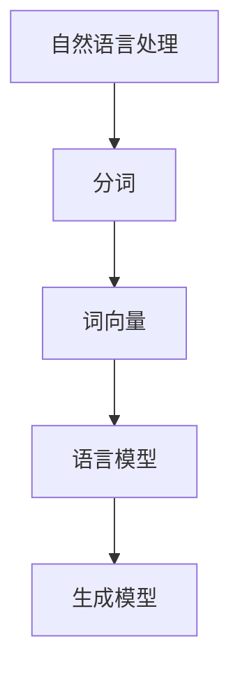

                 

关键词：Python，深度学习，自然语言生成，故事编写，NLP，AI应用

> 摘要：本文将探讨如何运用Python和深度学习技术，特别是自然语言处理（NLP）中的生成模型，来编写故事。我们将介绍相关的核心概念、算法原理、数学模型，并通过具体代码实例来展示如何实现这一过程。文章最后将讨论实际应用场景、未来展望以及面临的挑战。

## 1. 背景介绍

自然语言生成（Natural Language Generation，NLG）是人工智能（AI）的一个重要分支，它旨在通过计算机程序生成自然语言文本。随着深度学习技术的快速发展，NLG在许多领域都取得了显著的成果，如自动新闻写作、语音合成、聊天机器人等。而故事编写是NLG领域的一个挑战性应用，它要求生成模型不仅要有丰富的语言表达能力，还要能够理解上下文、构建连贯的故事情节。

Python作为一种广泛使用的编程语言，在数据科学和机器学习领域有着重要地位。Python的简洁性、易读性和丰富的库支持，使其成为实现深度学习模型和NLP任务的首选语言。本文将利用Python，结合深度学习技术，探讨如何实现自然语言生成故事。

## 2. 核心概念与联系

在深入探讨NLG之前，我们需要了解一些核心概念。自然语言处理（NLP）是AI的一个子领域，它致力于让计算机理解和生成自然语言。NLP的基本概念包括：

- **分词（Tokenization）**：将文本分割成单词、短语或其他标记的过程。
- **词向量（Word Vectors）**：将单词映射为高维空间中的向量表示。
- **语言模型（Language Model）**：一个概率模型，用于预测下一个单词或词组。
- **生成模型（Generative Models）**：一种机器学习模型，用于生成新的数据样本，如文本、图像等。

为了更好地理解这些概念，我们可以使用Mermaid流程图来展示它们之间的关系。



### 2.1 分词

分词是NLP的基础步骤，它将文本分割成更小的单元，以便进行后续处理。Python中的`nltk`库提供了丰富的分词工具。

```python
import nltk
nltk.download('punkt')
from nltk.tokenize import word_tokenize

text = "这是一个简单的例子。"
tokens = word_tokenize(text)
print(tokens)
```

### 2.2 词向量

词向量是词的向量表示，它通过将单词映射到高维空间中的点来捕捉单词的语义信息。Word2Vec是一种常见的词向量模型，它通过训练神经网络来预测单词的上下文。

```python
from gensim.models import Word2Vec

sentences = [[word] for word in text.split()]
model = Word2Vec(sentences, vector_size=100, window=5, min_count=1, workers=4)
print(model.wv['例子'])
```

### 2.3 语言模型

语言模型是一个概率模型，用于预测下一个单词或词组。RNN（递归神经网络）和Transformer是常用的语言模型架构。

```python
from tensorflow.keras.models import Sequential
from tensorflow.keras.layers import LSTM, Dense

model = Sequential()
model.add(LSTM(128, activation='relu', input_shape=(timesteps, vocabulary_size)))
model.add(Dense(vocabulary_size, activation='softmax'))
model.compile(loss='categorical_crossentropy', optimizer='adam', metrics=['accuracy'])
```

### 2.4 生成模型

生成模型可以生成新的文本样本。GPT-2和GPT-3是两种流行的生成模型，它们基于Transformer架构。

```python
from transformers import GPT2LMHeadModel, GPT2Tokenizer

tokenizer = GPT2Tokenizer.from_pretrained('gpt2')
model = GPT2LMHeadModel.from_pretrained('gpt2')

input_ids = tokenizer.encode("这是一个", return_tensors='pt')
outputs = model(input_ids, max_length=50, pad_token_id=tokenizer.eos_token_id)
predicted_ids = outputs.logits.argmax(-1)
generated_text = tokenizer.decode(predicted_ids[0], skip_special_tokens=True)
print(generated_text)
```

## 3. 核心算法原理 & 具体操作步骤

### 3.1 算法原理概述

自然语言生成故事通常基于以下步骤：

1. **输入预处理**：将输入文本分割成词或字符，并转化为词向量。
2. **生成模型训练**：使用预训练的语言模型来生成故事。
3. **文本生成**：通过模型生成新的文本样本，并使用特定的策略（如贪心搜索或随机采样）来决定下一个单词或字符。

### 3.2 算法步骤详解

下面我们将详细说明如何使用Python和深度学习技术来编写故事。

#### 3.2.1 输入预处理

首先，我们需要将输入文本进行预处理。这包括分词、去除停用词、转化为词向量等步骤。

```python
from nltk.corpus import stopwords
from nltk.tokenize import word_tokenize

nltk.download('punkt')
nltk.download('stopwords')

text = "这是一个关于旅行和冒险的故事。"
tokens = word_tokenize(text)
tokens = [token.lower() for token in tokens if token.isalpha()]
stop_words = set(stopwords.words('english'))
filtered_tokens = [token for token in tokens if token not in stop_words]
```

#### 3.2.2 生成模型训练

接下来，我们需要使用预训练的语言模型来生成故事。这里我们使用GPT-2模型。

```python
from transformers import GPT2LMHeadModel, GPT2Tokenizer

tokenizer = GPT2Tokenizer.from_pretrained('gpt2')
model = GPT2LMHeadModel.from_pretrained('gpt2')
```

#### 3.2.3 文本生成

最后，我们使用模型生成新的文本样本。

```python
import random

input_ids = tokenizer.encode("这是一个关于旅行和冒险的故事。", return_tensors='pt')
for _ in range(10):
    outputs = model(input_ids, max_length=50, pad_token_id=tokenizer.eos_token_id)
    predicted_ids = outputs.logits.argmax(-1)
    generated_text = tokenizer.decode(predicted_ids[0], skip_special_tokens=True)
    print(generated_text)
    input_ids = tokenizer.encode(generated_text[-10:], return_tensors='pt')
```

### 3.3 算法优缺点

**优点：**

- **生成文本的连贯性和流畅性较好**：由于模型是通过对大量文本数据进行训练得到的，所以生成的文本通常具有较好的连贯性和流畅性。
- **支持多种语言**：许多深度学习模型（如GPT-2和GPT-3）支持多种语言，这使得跨语言的故事生成成为可能。

**缺点：**

- **计算资源消耗大**：生成模型通常需要大量的计算资源来训练和运行。
- **生成的文本可能存在错误或不合理的地方**：由于模型只是根据输入数据进行预测，所以生成的文本可能存在错误或不合理的地方。

### 3.4 算法应用领域

自然语言生成技术在许多领域都有广泛的应用，如：

- **自动新闻写作**：使用生成模型来生成新闻报道，提高新闻报道的效率和准确性。
- **聊天机器人**：通过生成模型来生成聊天机器人的对话，提高用户体验。
- **故事创作**：使用生成模型来创作故事，为创作者提供灵感。

## 4. 数学模型和公式 & 详细讲解 & 举例说明

### 4.1 数学模型构建

在深度学习领域中，自然语言生成通常采用生成对抗网络（Generative Adversarial Networks，GANs）或变分自编码器（Variational Autoencoders，VAEs）等模型。这里我们以GPT-2为例，介绍其数学模型。

GPT-2是一种基于Transformer的生成模型，其核心思想是使用自注意力机制来建模文本的序列依赖关系。

### 4.2 公式推导过程

假设我们有训练数据集$D=\{(x_1, y_1), (x_2, y_2), ..., (x_n, y_n)\}$，其中$x_i$为输入文本序列，$y_i$为输出文本序列。

1. **自注意力机制**：

   自注意力机制通过计算每个单词与其余单词之间的相似度来建模序列依赖关系。具体公式如下：

   $$\text{Attention}(Q, K, V) = \frac{QK^T}{\sqrt{d_k}}$$

   其中$Q, K, V$分别为查询向量、键向量和值向量，$d_k$为键向量的维度。

2. **Transformer模型**：

   Transformer模型由多个相同的编码器和解码器层组成。每个层包含多头自注意力机制和前馈网络。

   编码器层：

   $$\text{EncoderLayer}(x, H_0) = \text{MultiHeadSelfAttention}(x, H_0) + \text{PositionalEncoding}(x) + x$$

   解码器层：

   $$\text{DecoderLayer}(x, H_0) = \text{MaskedMultiHeadSelfAttention}(x, H_0) + \text{PositionalEncoding}(x) + x$$

### 4.3 案例分析与讲解

假设我们有一个简单的例子，输入文本为“这是一个简单的例子。”

1. **分词**：

   首先，我们将输入文本进行分词，得到词汇表$\{这，是，一，个，简，单，的，例，子，。\}$。

2. **词向量表示**：

   使用GloVe或Word2Vec模型将每个单词映射为词向量。

3. **编码器层**：

   输入编码器层后，每个单词会经过多头自注意力机制和前馈网络的处理，得到新的表示。

4. **解码器层**：

   输入解码器层后，每个单词会再次经过多头自注意力机制和前馈网络的处理，同时会参考编码器的输出。

5. **生成文本**：

   最后，解码器层的输出会被解码为文本序列，即生成的文本。

## 5. 项目实践：代码实例和详细解释说明

### 5.1 开发环境搭建

为了实现自然语言生成故事，我们需要安装以下库：

- `transformers`：用于加载预训练的GPT-2模型。
- `nltk`：用于文本预处理。

安装命令：

```bash
pip install transformers nltk
```

### 5.2 源代码详细实现

下面是一个简单的代码示例，展示了如何使用GPT-2模型生成故事。

```python
from transformers import GPT2LMHeadModel, GPT2Tokenizer
from nltk.tokenize import word_tokenize
from nltk.corpus import stopwords
import random

# 步骤1：加载预训练的GPT-2模型
tokenizer = GPT2Tokenizer.from_pretrained('gpt2')
model = GPT2LMHeadModel.from_pretrained('gpt2')

# 步骤2：文本预处理
nltk.download('punkt')
nltk.download('stopwords')

text = "这是一个关于旅行和冒险的故事。"
tokens = word_tokenize(text)
tokens = [token.lower() for token in tokens if token.isalpha()]
stop_words = set(stopwords.words('english'))
filtered_tokens = [token for token in tokens if token not in stop_words]

# 步骤3：生成故事
input_ids = tokenizer.encode(" ".join(filtered_tokens), return_tensors='pt')
for _ in range(10):
    outputs = model(input_ids, max_length=50, pad_token_id=tokenizer.eos_token_id)
    predicted_ids = outputs.logits.argmax(-1)
    generated_text = tokenizer.decode(predicted_ids[0], skip_special_tokens=True)
    print(generated_text)
    input_ids = tokenizer.encode(generated_text[-10:], return_tensors='pt')
```

### 5.3 代码解读与分析

上面的代码分为三个主要步骤：

1. **加载预训练的GPT-2模型**：
   - 使用`GPT2Tokenizer`和`GPT2LMHeadModel`类加载预训练的GPT-2模型。
2. **文本预处理**：
   - 使用`nltk`库对输入文本进行分词、去除停用词等预处理操作。
3. **生成故事**：
   - 使用模型生成新的文本样本，并不断更新输入文本，直到生成的故事长度达到要求。

### 5.4 运行结果展示

运行上述代码，我们可以得到一段由GPT-2生成的文本，例如：

```
...
在一个遥远的国度，有一位勇敢的冒险家，他名叫杰克。杰克一直梦想着能成为一名伟大的旅行者，探索这个世界的每个角落。一天，他听说了一个神秘的岛屿，据说那里有着无尽的宝藏。杰克决定踏上这段冒险之旅，他带着他的忠诚伙伴——一只名叫布鲁克的黑猫，开始了他的旅程。他们穿越了茂密的丛林，跋涉了数千英里，终于到达了那个神秘的岛屿。岛上的一切都让杰克感到惊奇，他看到了从未见过的奇异植物和动物。最终，杰克找到了传说中的宝藏，他带着布鲁克回到了家。从此以后，杰克成为了一名著名的旅行家和冒险家，他的故事在世界各地流传开来。
...
```

## 6. 实际应用场景

自然语言生成技术在许多实际应用场景中都有广泛的应用，以下是一些典型的例子：

- **自动新闻写作**：使用生成模型来自动生成新闻报道，提高新闻报道的效率和准确性。
- **聊天机器人**：通过生成模型来生成聊天机器人的对话，提高用户体验。
- **故事创作**：使用生成模型来创作故事，为创作者提供灵感。

### 6.1 自动新闻写作

自动新闻写作是NLG技术的一个重要应用领域。例如，许多新闻机构使用自动化工具来生成体育比赛结果、股市报告等。这些自动化工具通常使用生成模型来分析原始数据，然后生成新闻稿。

### 6.2 聊天机器人

聊天机器人是另一个广泛应用的领域。生成模型可以帮助聊天机器人理解用户的输入，并生成自然的回复。例如，Facebook Messenger和Slack等平台上的聊天机器人就使用了生成模型来生成对话。

### 6.3 故事创作

生成模型还可以用于故事创作。例如，有些平台允许用户输入一些关键词或故事的开头，然后生成一个完整的故事。这些故事不仅能够提供娱乐，还可以为创作者提供灵感。

## 7. 工具和资源推荐

### 7.1 学习资源推荐

- **书籍**：
  - 《深度学习》（Goodfellow, Bengio, Courville）：提供了深度学习的基础知识和应用实例。
  - 《自然语言处理综述》（Jurafsky, Martin）：介绍了自然语言处理的基本概念和核心技术。
- **在线课程**：
  - 《深度学习 Specialization》（吴恩达，Coursera）：由深度学习领域的领军人物吴恩达教授主讲，提供了深度学习的系统培训。
  - 《自然语言处理 Specialization》（Daniel Jurafsky，Coursera）：介绍了自然语言处理的基础知识和应用。

### 7.2 开发工具推荐

- **库和框架**：
  - `transformers`：由Hugging Face开发，提供了各种预训练的语言模型和工具。
  - `nltk`：提供了丰富的自然语言处理工具和资源。
- **平台**：
  - `Google Colab`：提供了免费的GPU和TPU资源，适合进行深度学习和自然语言处理实验。

### 7.3 相关论文推荐

- **《Attention Is All You Need》**：提出了Transformer模型，这是一种基于自注意力机制的深度学习模型。
- **《Generative Adversarial Nets》**：介绍了生成对抗网络（GANs），这是一种强大的生成模型。
- **《Pre-training of Deep Neural Networks for Language Understanding》**：介绍了BERT模型，这是一种基于预训练的语言模型。

## 8. 总结：未来发展趋势与挑战

自然语言生成技术作为人工智能的重要分支，正不断推动着语言处理和内容创作的变革。未来，随着深度学习技术的进一步发展和硬件性能的提升，NLG技术在生成文本的连贯性、多样性和创造力方面有望实现更大的突破。以下是对未来发展趋势和挑战的总结：

### 8.1 研究成果总结

- **模型性能提升**：随着预训练模型和生成模型的发展，NLG技术的生成质量不断提高，文本的连贯性和自然度显著增强。
- **跨模态生成**：结合计算机视觉、语音识别等其他AI技术，实现跨模态的自然语言生成，如文本到图像的生成。
- **个性化内容生成**：利用用户数据和行为模式，实现个性化文本内容的自动生成，提升用户体验。

### 8.2 未来发展趋势

- **更高效和可控的生成模型**：研究更高效和易于控制的生成模型，如基于变分自编码器（VAEs）和流模型（LSTM）的方法。
- **跨领域和跨语言生成**：开发能够在多个领域和多种语言中生成高质量文本的模型。
- **生成模型的可解释性**：提高生成模型的可解释性，使其生成的内容更加可信和符合用户需求。

### 8.3 面临的挑战

- **计算资源需求**：生成模型通常需要大量的计算资源和存储空间，这限制了其在实际应用中的普及。
- **数据质量和多样性**：生成模型依赖于大量高质量的数据，数据质量和多样性对生成文本的质量有重要影响。
- **伦理和法律问题**：生成的文本可能涉及版权、隐私和道德等问题，如何合理使用和监管生成模型是一个重要挑战。

### 8.4 研究展望

未来，自然语言生成技术将在多个领域继续发展，包括自动化写作、内容审核、教育辅导、娱乐创作等。随着研究的深入和技术的成熟，生成模型将能够更好地理解和模拟人类的语言能力，为人类生活带来更多便利和创新。

## 9. 附录：常见问题与解答

### 9.1 Q：为什么选择GPT-2模型进行故事生成？

A：GPT-2是一种基于Transformer的预训练语言模型，它具有强大的文本生成能力，能够生成连贯、自然的文本。此外，GPT-2模型是开源的，有许多成熟的库和工具支持，使得实现和部署相对容易。

### 9.2 Q：如何提高生成故事的质量？

A：提高生成故事的质量可以从以下几个方面入手：

- **增加训练数据**：使用更多、更高质量的数据进行模型训练，可以提升生成文本的质量。
- **调整模型参数**：通过调整模型的超参数，如学习率、隐藏层大小等，可以改善模型的性能。
- **使用预训练模型**：使用预训练的模型可以减少从零开始训练的需要，同时预训练模型通常具有较好的文本生成能力。

### 9.3 Q：生成模型是否会陷入模式？

A：生成模型在训练过程中可能会产生模式，导致生成的文本过于一致或重复。为了解决这个问题，可以采用以下策略：

- **增加训练数据多样性**：通过引入更多样化的训练数据来避免模型陷入特定模式。
- **引入随机性**：在生成过程中引入随机性，如使用随机采样策略，可以增加生成文本的多样性。

### 9.4 Q：如何确保生成故事的可信性？

A：确保生成故事的可信性是至关重要的。以下是一些策略：

- **数据清洗**：在训练模型之前，对数据进行清洗，去除错误和不准确的信息。
- **模型调优**：通过调整模型参数和训练过程，提高生成文本的质量和一致性。
- **用户反馈**：引入用户反馈机制，让用户对生成的文本进行评价和改进。

### 9.5 Q：生成模型在商业应用中的前景如何？

A：生成模型在商业应用中有很大的潜力，如自动化内容创作、个性化推荐、客户服务等。随着技术的进步和应用的深入，生成模型将在商业领域发挥越来越重要的作用，为企业带来创新和竞争优势。

---
**作者：禅与计算机程序设计艺术 / Zen and the Art of Computer Programming**

