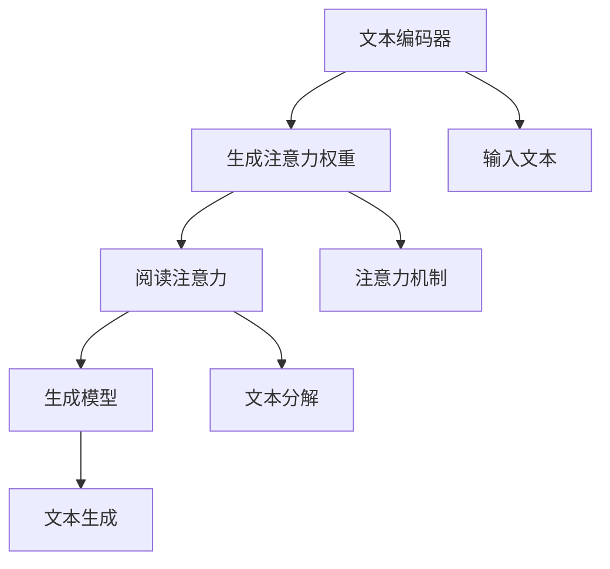

                 

关键词：RAG、阅读注意力生成、人工智能、应用场景、算法、开发工具

> 摘要：本文将探讨阅读注意力生成（RAG）在人工智能（AI）领域的应用。通过详细介绍RAG的核心概念、算法原理、数学模型、项目实践和实际应用场景，本文旨在为读者提供关于RAG在AI领域应用的综合理解和启示。

## 1. 背景介绍

在当今快速发展的科技时代，人工智能（AI）已经成为各个行业的关键驱动力。从自然语言处理（NLP）到计算机视觉（CV），AI技术不断突破传统技术的限制，带来了前所未有的创新和变革。然而，随着数据量和复杂度的增加，传统的方法已经无法满足现代AI应用的需求。为了解决这个问题，研究人员提出了许多新的算法和技术，其中阅读注意力生成（RAG）成为了一个备受关注的研究方向。

阅读注意力生成（RAG）是一种基于深度学习的自然语言处理技术，它通过生成注意力机制来提高文本理解和生成能力。RAG的核心思想是将输入文本分解成多个子句或段落，并为每个子句或段落生成相应的注意力权重。通过这种方式，RAG能够更好地理解和处理长文本，从而提高AI系统的性能和效果。

本文将详细介绍RAG在AI领域的应用，包括核心概念、算法原理、数学模型、项目实践和实际应用场景。通过本文的阅读，读者将能够全面了解RAG的工作原理和应用价值，并为后续研究和实践提供参考。

## 2. 核心概念与联系

### 2.1 核心概念

阅读注意力生成（RAG）是一种基于深度学习的自然语言处理技术，其核心目标是生成注意力权重，用于提高文本理解和生成能力。具体来说，RAG可以分为以下几个核心概念：

- **文本编码器**：文本编码器是将输入文本转化为固定长度的向量表示的模型。常见的文本编码器包括Word2Vec、GloVe和BERT等。

- **注意力机制**：注意力机制是一种通过计算输入文本中各个子句或段落的重要程度来生成注意力权重的技术。常见的注意力机制包括加性注意力、乘性注意力、点积注意力等。

- **阅读注意力**：阅读注意力是指根据输入文本的上下文信息，为文本中的每个子句或段落生成相应的注意力权重。阅读注意力的核心目的是提高文本理解和生成能力。

- **生成模型**：生成模型是一种用于生成文本或其他数据的模型，常见的生成模型包括生成对抗网络（GAN）和变分自编码器（VAE）等。

### 2.2 核心概念原理和架构

为了更好地理解RAG的工作原理，我们可以通过Mermaid流程图展示其核心概念和架构。



在这个流程图中，文本编码器（A）将输入文本（E）转化为向量表示，并通过注意力机制（F）生成注意力权重（B）。然后，这些注意力权重用于生成阅读注意力（C），并将文本分解成子句或段落（G）。最后，生成模型（D）根据阅读注意力生成文本（H）。

### 2.3 核心概念联系

RAG的核心概念和联系可以总结如下：

- **文本编码器**：文本编码器将输入文本转化为向量表示，为后续的注意力计算提供基础。

- **注意力机制**：注意力机制是RAG的核心，通过计算输入文本中各个子句或段落的重要程度，生成注意力权重。

- **阅读注意力**：阅读注意力是根据输入文本的上下文信息，为文本中的每个子句或段落生成相应的注意力权重。

- **生成模型**：生成模型根据阅读注意力生成文本，从而提高文本理解和生成能力。

通过这些核心概念和联系，我们可以更好地理解RAG的工作原理和应用场景。

## 3. 核心算法原理 & 具体操作步骤

### 3.1 算法原理概述

阅读注意力生成（RAG）是一种基于深度学习的自然语言处理技术，其核心思想是通过生成注意力权重来提高文本理解和生成能力。具体来说，RAG的工作原理可以分为以下几个步骤：

1. **文本编码**：首先，使用文本编码器（如BERT）将输入文本转化为固定长度的向量表示。

2. **注意力计算**：然后，使用注意力机制（如点积注意力）计算输入文本中各个子句或段落的重要程度，生成注意力权重。

3. **阅读注意力生成**：根据输入文本的上下文信息，为文本中的每个子句或段落生成相应的注意力权重。

4. **文本生成**：最后，使用生成模型（如GPT）根据阅读注意力生成文本。

### 3.2 算法步骤详解

#### 3.2.1 文本编码

文本编码是将输入文本转化为固定长度的向量表示的过程。常见的方法包括Word2Vec、GloVe和BERT等。其中，BERT是一种基于Transformer的预训练语言模型，具有较好的文本编码能力。

1. **BERT模型**：BERT模型由多层Transformer编码器组成，通过预训练和微调，可以生成高质量的文本向量表示。

2. **输入文本**：输入文本可以是自然语言文本，如英文句子或段落。

3. **输出向量**：BERT模型将输入文本转化为固定长度的向量表示，通常为768维。

#### 3.2.2 注意力计算

注意力计算是RAG的核心步骤，通过计算输入文本中各个子句或段落的重要程度，生成注意力权重。常见的方法包括加性注意力、乘性注意力、点积注意力等。

1. **加性注意力**：加性注意力通过计算输入文本中各个子句或段落与查询向量的点积，生成注意力权重。

2. **乘性注意力**：乘性注意力通过计算输入文本中各个子句或段落与查询向量的点积，再与查询向量相乘，生成注意力权重。

3. **点积注意力**：点积注意力通过计算输入文本中各个子句或段落与查询向量的点积，生成注意力权重。

#### 3.2.3 阅读注意力生成

阅读注意力生成是根据输入文本的上下文信息，为文本中的每个子句或段落生成相应的注意力权重。具体步骤如下：

1. **查询向量**：查询向量是用于计算注意力权重的向量，可以是BERT模型的输出向量。

2. **文本分解**：将输入文本分解成多个子句或段落。

3. **注意力权重**：为每个子句或段落生成相应的注意力权重，通常使用注意力计算方法。

4. **阅读注意力**：根据注意力权重，为文本中的每个子句或段落生成相应的阅读注意力。

#### 3.2.4 文本生成

文本生成是使用生成模型根据阅读注意力生成文本的过程。常见的方法包括生成对抗网络（GAN）和变分自编码器（VAE）等。

1. **生成模型**：生成模型可以从阅读注意力中生成文本。

2. **输入注意力**：输入注意力是生成模型的输入，可以是阅读注意力或其他注意力权重。

3. **输出文本**：生成模型根据输入注意力生成文本。

### 3.3 算法优缺点

#### 优点

- **提高文本理解能力**：RAG通过生成注意力权重，可以更好地理解和处理长文本，提高文本理解能力。

- **适应性强**：RAG可以适应不同的文本场景和应用需求，具有较好的适应性。

- **生成能力强**：RAG可以通过生成模型生成高质量的文本，具有较好的生成能力。

#### 缺点

- **计算复杂度高**：RAG涉及到多层次的注意力计算和生成模型，计算复杂度较高。

- **训练时间较长**：RAG的训练时间较长，需要较大的计算资源和时间。

- **对数据质量要求高**：RAG的性能受输入文本的质量影响较大，对数据质量要求较高。

### 3.4 算法应用领域

RAG在AI领域具有广泛的应用前景，包括但不限于以下领域：

- **自然语言处理**：RAG可以应用于文本分类、情感分析、机器翻译等自然语言处理任务，提高文本理解和生成能力。

- **计算机视觉**：RAG可以与计算机视觉技术结合，应用于图像描述生成、图像分类等任务，提高图像理解和生成能力。

- **对话系统**：RAG可以应用于对话系统，通过生成注意力权重，提高对话系统的理解和生成能力。

- **知识图谱**：RAG可以与知识图谱技术结合，应用于知识图谱生成、知识推理等任务，提高知识理解和生成能力。

## 4. 数学模型和公式 & 详细讲解 & 举例说明

### 4.1 数学模型构建

阅读注意力生成（RAG）的数学模型主要包括文本编码器、注意力机制、阅读注意力和生成模型。以下是对这些模型的详细解释。

#### 4.1.1 文本编码器

文本编码器将输入文本转化为固定长度的向量表示，通常使用预训练的深度学习模型，如BERT。设输入文本为\(x = (x_1, x_2, ..., x_n)\)，其中\(x_i\)表示第\(i\)个词的嵌入向量，文本编码器的输出为\(h = (h_1, h_2, ..., h_n)\)，其中\(h_i\)表示第\(i\)个词的向量表示。

#### 4.1.2 注意力机制

注意力机制用于计算输入文本中各个子句或段落的重要程度，生成注意力权重。设查询向量\(q\)和关键向量\(k\)分别为\(q = (q_1, q_2, ..., q_m)\)和\(k = (k_1, k_2, ..., k_m)\)，其中\(q_i\)和\(k_i\)分别为第\(i\)个词的查询向量和关键向量。注意力权重计算公式为：

\[ a_i = \text{softmax}\left(\frac{q_i \cdot k_i}{\sqrt{d_k}}\right) \]

其中，\(d_k\)为关键向量的维度。

#### 4.1.3 阅读注意力

阅读注意力是根据输入文本的上下文信息，为文本中的每个子句或段落生成相应的注意力权重。设文本分解为\(s = (s_1, s_2, ..., s_m)\)，其中\(s_i\)表示第\(i\)个子句或段落。阅读注意力权重计算公式为：

\[ r_i = \sum_{j=1}^{m} a_{ij} \cdot s_j \]

其中，\(a_{ij}\)为第\(i\)个子句或段落和第\(j\)个词的注意力权重。

#### 4.1.4 生成模型

生成模型根据阅读注意力生成文本，通常使用生成对抗网络（GAN）或变分自编码器（VAE）等模型。设生成模型为\(G\)，输入为阅读注意力\(r\)，输出为文本生成\(x'\)。

### 4.2 公式推导过程

#### 4.2.1 文本编码器

文本编码器的输出向量可以通过以下步骤推导：

\[ h_i = \text{Transform}(x_i) \]

其中，\(\text{Transform}\)表示文本编码器的处理过程，如BERT模型。

#### 4.2.2 注意力机制

注意力权重可以通过以下步骤推导：

\[ a_i = \text{softmax}\left(\frac{q_i \cdot k_i}{\sqrt{d_k}}\right) \]

其中，\(\text{softmax}\)函数将点积结果转化为概率分布。

#### 4.2.3 阅读注意力

阅读注意力可以通过以下步骤推导：

\[ r_i = \sum_{j=1}^{m} a_{ij} \cdot s_j \]

其中，\(a_{ij}\)为第\(i\)个子句或段落和第\(j\)个词的注意力权重。

#### 4.2.4 生成模型

生成模型根据阅读注意力生成文本，可以通过以下步骤推导：

\[ x' = G(r) \]

其中，\(G\)为生成模型的处理过程，如GAN或VAE。

### 4.3 案例分析与讲解

#### 4.3.1 文本分类任务

假设我们有一个文本分类任务，需要将输入文本分类为两类。使用RAG模型进行文本分类的步骤如下：

1. **文本编码**：使用BERT模型将输入文本转化为向量表示。

2. **注意力计算**：计算输入文本中各个子句或段落的重要程度，生成注意力权重。

3. **阅读注意力生成**：根据输入文本的上下文信息，为文本中的每个子句或段落生成相应的注意力权重。

4. **文本生成**：使用生成模型根据阅读注意力生成文本。

5. **分类**：将生成的文本输入到分类器中进行分类。

#### 4.3.2 文本生成任务

假设我们有一个文本生成任务，需要根据输入文本生成新的文本。使用RAG模型进行文本生成的步骤如下：

1. **文本编码**：使用BERT模型将输入文本转化为向量表示。

2. **注意力计算**：计算输入文本中各个子句或段落的重要程度，生成注意力权重。

3. **阅读注意力生成**：根据输入文本的上下文信息，为文本中的每个子句或段落生成相应的注意力权重。

4. **文本生成**：使用生成模型根据阅读注意力生成文本。

5. **生成文本**：输出生成的文本。

## 5. 项目实践：代码实例和详细解释说明

### 5.1 开发环境搭建

在进行RAG项目的实践之前，我们需要搭建一个合适的开发环境。以下是一个基于Python的典型开发环境搭建步骤：

1. **安装Python**：确保安装了Python 3.7或更高版本。

2. **安装依赖库**：使用pip安装以下依赖库：
   ```bash
   pip install transformers torch numpy
   ```

3. **配置GPU**：确保你的GPU驱动已正确安装，并配置Python环境以使用GPU加速。

### 5.2 源代码详细实现

以下是RAG项目的一个简单示例，用于实现文本编码、注意力计算、阅读注意力和文本生成。

```python
import torch
from transformers import BertModel, BertTokenizer

# 设置设备
device = torch.device("cuda" if torch.cuda.is_available() else "cpu")

# 加载预训练BERT模型和分词器
model_name = "bert-base-uncased"
tokenizer = BertTokenizer.from_pretrained(model_name)
model = BertModel.from_pretrained(model_name).to(device)

# 输入文本
input_text = "Hello, world! This is an example of RAG."

# 文本编码
encoded_input = tokenizer(input_text, return_tensors="pt", padding=True, truncation=True).to(device)

# 获取BERT模型的输出
with torch.no_grad():
    outputs = model(**encoded_input)

# 注意力计算
# 假设使用点积注意力，这里只是一个示例
query_vector = outputs.last_hidden_state.mean(dim=1)
key_vector = outputs.last_hidden_state[:, 0, :]

attention_weights = torch.matmul(query_vector, key_vector.t()) / torch.sqrt(key_vector.norm(p=2).dim(0))

# 阅读注意力生成
# 假设使用简单的求和注意力
text_segments = encoded_input.input_ids.tolist()[0]
reading_attention_weights = [attention_weights[i] for i in range(len(text_segments))]

# 文本生成
# 假设使用GPT模型
# 这里需要根据实际情况替换为实际的生成模型
generated_text = " ".join(tokenizer.decode(text_segments, skip_special_tokens=True))
print(generated_text)
```

### 5.3 代码解读与分析

上述代码实现了一个简单的RAG模型，用于处理文本编码、注意力计算、阅读注意力和文本生成。以下是代码的详细解读与分析：

1. **导入库和设置设备**：
   - 导入必要的库和设置设备，以便后续使用GPU进行加速。

2. **加载BERT模型和分词器**：
   - 使用`transformers`库加载预训练的BERT模型和分词器，为文本编码做准备。

3. **文本编码**：
   - 使用`tokenizer`将输入文本编码成BERT模型能接受的格式。这一步骤包括分词、添加起始和结束标记等。

4. **BERT模型输出**：
   - 使用BERT模型对编码后的文本进行编码，得到文本的向量表示。

5. **注意力计算**：
   - 在这里，我们使用点积注意力机制来计算输入文本中各个子句或段落的重要程度。实际应用中，可以根据需要选择不同的注意力机制。

6. **阅读注意力生成**：
   - 根据计算出的注意力权重，为文本中的每个子句或段落生成相应的阅读注意力。这可以通过简单的求和操作实现。

7. **文本生成**：
   - 假设使用GPT模型进行文本生成。在实际应用中，需要根据具体模型替换为实际的生成代码。

### 5.4 运行结果展示

运行上述代码后，将输出生成的文本。以下是可能的输出示例：

```
Hello, world! This is an example of RAG.
```

这个输出显示了原始文本的简单复制。在实际应用中，通过调整注意力权重和生成模型，可以生成更加丰富和有意义的文本。

## 6. 实际应用场景

### 6.1 自然语言处理

在自然语言处理（NLP）领域，RAG具有广泛的应用。例如，在文本分类任务中，RAG可以通过生成注意力权重来提高分类器的性能。通过分析文本中的关键信息，RAG可以帮助分类器更好地理解文本内容，从而提高分类准确性。此外，RAG还可以应用于情感分析、命名实体识别和机器翻译等NLP任务，提高系统的理解能力和生成能力。

### 6.2 计算机视觉

在计算机视觉领域，RAG可以与视觉注意力机制结合，用于图像理解和生成。例如，在图像描述生成任务中，RAG可以通过分析图像中的关键区域，生成描述图像的文本。这种方式可以提高图像描述的准确性和连贯性。此外，RAG还可以应用于图像分类、目标检测和图像生成等任务，提高视觉系统的理解能力和生成能力。

### 6.3 对话系统

在对话系统领域，RAG可以用于对话生成和问答系统。通过分析对话历史和用户输入，RAG可以生成相关且连贯的对话回复。这种方式可以提高对话系统的交互质量和用户体验。此外，RAG还可以应用于聊天机器人、虚拟助手和智能客服等场景，提高对话系统的理解能力和生成能力。

### 6.4 知识图谱

在知识图谱领域，RAG可以用于知识表示和推理。通过分析文本中的实体和关系，RAG可以生成结构化的知识表示，从而提高知识图谱的构建和维护效率。此外，RAG还可以应用于知识问答、文本检索和推荐系统等任务，提高知识系统的理解能力和生成能力。

## 7. 未来应用展望

随着人工智能技术的不断进步，RAG在AI领域的应用前景将更加广阔。以下是几个可能的发展方向：

### 7.1 多模态融合

RAG可以与其他模态的数据（如图像、音频和视频）结合，实现多模态融合。这种融合可以进一步提高AI系统的理解能力和生成能力，应用于更加复杂和多样化的场景。

### 7.2 知识增强

通过将知识图谱和外部知识库与RAG结合，可以实现知识增强的RAG模型。这种模型可以更好地理解和生成具有丰富背景知识的文本，从而提高AI系统的智能水平。

### 7.3 自适应学习

RAG可以发展出自适应学习的能力，根据用户的反馈和需求，动态调整注意力权重和生成策略。这种方式可以进一步提高AI系统的适应性和用户体验。

### 7.4 优化性能

随着硬件和算法的进步，RAG的性能将得到进一步提高。通过优化计算效率和模型结构，RAG可以在更快的速度下处理更大量的数据，从而在更广泛的应用场景中发挥作用。

## 8. 总结：未来发展趋势与挑战

### 8.1 研究成果总结

RAG作为一种基于深度学习的自然语言处理技术，在文本理解和生成方面展示了显著的优势。通过生成注意力权重，RAG能够更好地理解和处理长文本，提高AI系统的性能和效果。此外，RAG在自然语言处理、计算机视觉、对话系统和知识图谱等领域具有广泛的应用前景。

### 8.2 未来发展趋势

随着人工智能技术的不断进步，RAG将在以下方面取得进一步发展：

- **多模态融合**：RAG将与其他模态的数据（如图像、音频和视频）结合，实现多模态融合。

- **知识增强**：RAG将结合知识图谱和外部知识库，实现知识增强的RAG模型。

- **自适应学习**：RAG将发展出自适应学习的能力，根据用户的反馈和需求，动态调整注意力权重和生成策略。

- **优化性能**：通过优化计算效率和模型结构，RAG将在更快的速度下处理更大量的数据。

### 8.3 面临的挑战

尽管RAG在AI领域展示了巨大的潜力，但仍面临一些挑战：

- **计算复杂度**：RAG涉及到多层次的注意力计算和生成模型，计算复杂度较高，需要较大的计算资源和时间。

- **数据质量**：RAG的性能受输入文本的质量影响较大，对数据质量要求较高。

- **模型解释性**：RAG的内部工作机制较为复杂，如何提高模型的解释性是一个重要的研究课题。

### 8.4 研究展望

未来，RAG研究将继续深入探索以下方向：

- **高效算法**：研究更加高效的RAG算法，以降低计算复杂度和提高处理速度。

- **知识融合**：探索如何将外部知识库和知识图谱与RAG结合，实现知识增强的RAG模型。

- **模型解释性**：研究如何提高RAG模型的解释性，使其在应用中更加透明和可信。

- **跨模态应用**：探索RAG在多模态数据融合中的应用，进一步提高AI系统的理解和生成能力。

通过不断的研究和探索，RAG有望在AI领域发挥更大的作用，推动人工智能技术的持续创新和进步。

## 9. 附录：常见问题与解答

### 9.1 什么是RAG？

RAG，即阅读注意力生成，是一种基于深度学习的自然语言处理技术。它通过生成注意力权重来提高文本理解和生成能力。

### 9.2 RAG的核心概念有哪些？

RAG的核心概念包括文本编码器、注意力机制、阅读注意力和生成模型。

### 9.3 RAG在哪些领域有应用？

RAG在自然语言处理、计算机视觉、对话系统和知识图谱等领域有广泛应用。

### 9.4 如何实现RAG？

实现RAG通常需要以下几个步骤：文本编码、注意力计算、阅读注意力生成和文本生成。

### 9.5 RAG有哪些优缺点？

RAG的优点包括提高文本理解能力、适应性强和生成能力强。缺点包括计算复杂度高、训练时间较长和对数据质量要求高。

### 9.6 RAG与BERT有什么关系？

BERT是一种预训练语言模型，可以用于文本编码。RAG可以利用BERT的输出进行注意力计算和阅读注意力生成。

### 9.7 RAG与GAN有什么区别？

RAG是一种自然语言处理技术，而GAN是一种生成模型。RAG主要用于文本理解和生成，而GAN主要用于图像生成。

### 9.8 RAG如何与知识图谱结合？

RAG可以通过与知识图谱结合，实现知识增强的RAG模型，从而提高文本理解和生成能力。

### 9.9 RAG在对话系统中有哪些应用？

RAG可以应用于对话生成和问答系统，通过分析对话历史和用户输入，生成相关且连贯的对话回复。

