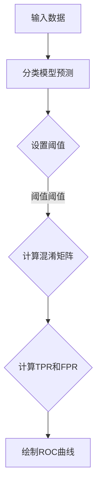

                 

关键词：ROC曲线、曲线下面积、AUC、混淆矩阵、分类模型评估

摘要：本文将深入探讨ROC曲线的基本原理、计算方法及其在实际应用中的重要性。通过代码实例，我们将展示如何利用Python实现ROC曲线的绘制，并对AUC（曲线下面积）进行解释和计算。文章还将介绍ROC曲线在分类模型评估中的应用场景，以及如何通过优化曲线参数来提高模型的性能。

## 1. 背景介绍

在机器学习和数据科学领域，分类问题是常见的任务之一。在分类任务中，我们通常希望模型能够准确地将不同类别的数据进行分类。然而，一个模型的好坏不仅仅取决于其准确率，还需要考虑其召回率、精度、F1分数等多个指标。ROC（接收者操作特征）曲线是一种常用的评估分类模型性能的工具，它能够全面地反映模型的分类能力。

ROC曲线最早应用于雷达和通信系统，用于评估信号检测器在噪声环境下的性能。随着机器学习技术的发展，ROC曲线也被广泛应用于各种分类问题中。特别是在二分类问题中，ROC曲线成为了评估模型性能的重要手段。

本文将首先介绍ROC曲线的基本概念和原理，然后通过Python代码实例展示如何绘制ROC曲线和计算AUC值，最后讨论ROC曲线在实际应用中的场景和优化方法。

## 2. 核心概念与联系

### 2.1 ROC曲线的基本概念

ROC曲线全称为接收者操作特征曲线，它是一种通过不同阈值来评估二分类模型性能的曲线。在ROC曲线中，横轴表示的是假阳性率（False Positive Rate，FPR），纵轴表示的是真阳性率（True Positive Rate，TPR），也称为召回率（Recall）。

- **真阳性率（TPR）**：表示实际为正类别的样本中被正确分类为正类别的比例。可以理解为模型的召回能力。
- **假阳性率（FPR）**：表示实际为负类别的样本中被错误分类为正类别的比例。可以理解为模型的误报率。

### 2.2 ROC曲线与混淆矩阵的关系

在二分类问题中，模型会对每一个样本进行分类预测，并得到一个概率值。我们可以根据这个概率值设置一个阈值（例如0.5），将概率值大于阈值的样本分类为正类别，小于阈值的样本分类为负类别。每一个阈值都会对应一个特定的混淆矩阵：

|        | 预测负类别 | 预测正类别 |
|--------|-------------|-------------|
| **实际负类别** | 假阴性（FN） | 真阴性（TN） |
| **实际正类别** | 假阳性（FP） | 真阳性（TP） |

通过混淆矩阵，我们可以计算得到TPR和FPR：

- **真阳性率（TPR）**：$\text{TPR} = \frac{\text{TP}}{\text{TP} + \text{FN}}$
- **假阳性率（FPR）**：$\text{FPR} = \frac{\text{FP}}{\text{FP} + \text{TN}}$

### 2.3 ROC曲线的Mermaid流程图

以下是一个简单的Mermaid流程图，展示了如何从混淆矩阵计算得到ROC曲线：



请注意，Mermaid流程节点中不要使用括号、逗号等特殊字符。

## 3. 核心算法原理 & 具体操作步骤

### 3.1 算法原理概述

ROC曲线的绘制过程主要涉及以下几个步骤：

1. **分类模型预测**：对于每个样本，模型会输出一个概率值，表示该样本属于正类别的概率。
2. **设置阈值**：根据概率值设置一个阈值，大于阈值的样本分类为正类别，小于阈值的样本分类为负类别。
3. **计算混淆矩阵**：根据阈值，我们可以得到一个混淆矩阵，进而计算出TPR和FPR。
4. **绘制ROC曲线**：将FPR和TPR绘制在坐标系中，形成ROC曲线。

### 3.2 算法步骤详解

#### 步骤1：分类模型预测

首先，我们需要有一个训练好的分类模型，如逻辑回归、支持向量机（SVM）等。假设我们已经有一个模型，并对其进行了训练，现在需要使用模型对新的样本进行预测。

```python
# 假设我们已经有一个训练好的逻辑回归模型
from sklearn.linear_model import LogisticRegression
model = LogisticRegression()
model.fit(X_train, y_train)

# 对新的样本进行预测
probabilities = model.predict_proba(X_test)[:, 1]
```

#### 步骤2：设置阈值

我们可以根据实际情况选择一个合适的阈值。常见的阈值设置方法有基于准确率、召回率或F1分数的阈值调整。

```python
# 选择一个阈值，例如0.5
threshold = 0.5

# 根据阈值进行分类预测
predictions = [1 if p > threshold else 0 for p in probabilities]
```

#### 步骤3：计算混淆矩阵

根据预测结果和实际标签，我们可以计算得到混淆矩阵。

```python
from sklearn.metrics import confusion_matrix
conf_matrix = confusion_matrix(y_test, predictions)
```

#### 步骤4：计算TPR和FPR

利用混淆矩阵，我们可以计算得到TPR和FPR。

```python
# 计算TPR和FPR
TP = conf_matrix[1, 1]
TN = conf_matrix[0, 0]
FP = conf_matrix[0, 1]
FN = conf_matrix[1, 0]

TPR = TP / (TP + FN)
FPR = FP / (FP + TN)
```

#### 步骤5：绘制ROC曲线

最后，我们将TPR和FPR绘制在坐标系中，形成ROC曲线。

```python
import matplotlib.pyplot as plt

plt.plot(FPR, TPR, label='ROC curve (area = %0.2f)' % auc)
plt.plot([0, 1], [0, 1], 'k--')
plt.xlabel('False Positive Rate')
plt.ylabel('True Positive Rate')
plt.title('Receiver Operating Characteristic')
plt.legend(loc="lower right")
plt.show()
```

### 3.3 算法优缺点

**优点**：

1. ROC曲线能够全面地反映模型的分类性能，不仅考虑了模型的召回率，还考虑了模型的误报率。
2. ROC曲线适用于各种二分类问题，不受类别不平衡的影响。

**缺点**：

1. ROC曲线需要计算多个阈值，因此计算量相对较大。
2. ROC曲线的面积（AUC）虽然能够量化模型的性能，但无法直接反映模型的精确度。

### 3.4 算法应用领域

ROC曲线在以下领域具有广泛的应用：

1. **医学诊断**：用于评估医学诊断模型的性能，如癌症检测、疾病预测等。
2. **金融风险控制**：用于评估金融风险模型，如信用评分、欺诈检测等。
3. **安防监控**：用于评估安防监控系统的性能，如人脸识别、入侵检测等。

## 4. 数学模型和公式 & 详细讲解 & 举例说明

### 4.1 数学模型构建

ROC曲线的数学模型主要由TPR和FPR组成。TPR表示模型对正类别的召回能力，FPR表示模型对负类别的误报率。在数学上，它们可以用混淆矩阵中的元素表示：

- **真阳性率（TPR）**：$\text{TPR} = \frac{\text{TP}}{\text{TP} + \text{FN}} = \frac{\text{TP}}{\text{总正样本数}}$
- **假阳性率（FPR）**：$\text{FPR} = \frac{\text{FP}}{\text{FP} + \text{TN}} = \frac{\text{FP}}{\text{总负样本数}}$

### 4.2 公式推导过程

在推导ROC曲线的公式时，我们可以从混淆矩阵的定义出发：

|        | 预测负类别 | 预测正类别 |
|--------|-------------|-------------|
| **实际负类别** | 假阴性（FN） | 真阴性（TN） |
| **实际正类别** | 假阳性（FP） | 真阳性（TP） |

根据混淆矩阵，我们可以得到以下关系：

- **总正样本数**：$\text{总正样本数} = \text{TP} + \text{FN}$
- **总负样本数**：$\text{总负样本数} = \text{FP} + \text{TN}$

将这些关系代入TPR和FPR的公式中，可以得到：

- **真阳性率（TPR）**：$\text{TPR} = \frac{\text{TP}}{\text{TP} + \text{FN}} = \frac{\text{TP}}{\text{总正样本数}}$
- **假阳性率（FPR）**：$\text{FPR} = \frac{\text{FP}}{\text{FP} + \text{TN}} = \frac{\text{FP}}{\text{总负样本数}}$

### 4.3 案例分析与讲解

为了更好地理解ROC曲线的数学模型，我们来看一个简单的例子。

假设我们有以下混淆矩阵：

|        | 预测负类别 | 预测正类别 |
|--------|-------------|-------------|
| **实际负类别** | 90          | 10          |
| **实际正类别** | 5           | 95          |

根据这个混淆矩阵，我们可以计算出TPR和FPR：

- **总正样本数**：$\text{总正样本数} = \text{TP} + \text{FN} = 95 + 5 = 100$
- **总负样本数**：$\text{总负样本数} = \text{FP} + \text{TN} = 10 + 90 = 100$

- **真阳性率（TPR）**：$\text{TPR} = \frac{\text{TP}}{\text{总正样本数}} = \frac{95}{100} = 0.95$
- **假阳性率（FPR）**：$\text{FPR} = \frac{\text{FP}}{\text{总负样本数}} = \frac{10}{100} = 0.10$

通过这个例子，我们可以看到如何从混淆矩阵计算得到TPR和FPR。在实际应用中，我们通常会使用大量的样本和不同的阈值来绘制ROC曲线，从而更全面地评估模型的性能。

## 5. 项目实践：代码实例和详细解释说明

为了更好地理解ROC曲线的原理和应用，我们将通过一个具体的代码实例来演示如何使用Python实现ROC曲线的绘制和AUC值的计算。

### 5.1 开发环境搭建

在开始编写代码之前，我们需要确保已经安装了Python和相关的库。以下是在Python环境中搭建ROC曲线分析开发环境的步骤：

1. **安装Python**：确保你的系统中已经安装了Python 3.x版本。
2. **安装必要的库**：使用pip命令安装以下库：

   ```bash
   pip install numpy scipy scikit-learn matplotlib
   ```

这些库中，`numpy`和`scipy`用于数学计算，`scikit-learn`提供了ROC曲线和AUC值的计算功能，`matplotlib`用于绘制图表。

### 5.2 源代码详细实现

以下是一个简单的Python代码实例，用于生成ROC曲线和计算AUC值：

```python
import numpy as np
from sklearn.datasets import make_classification
from sklearn.model_selection import train_test_split
from sklearn.linear_model import LogisticRegression
from sklearn.metrics import roc_curve, auc, confusion_matrix
import matplotlib.pyplot as plt

# 生成模拟数据集
X, y = make_classification(n_samples=1000, n_features=20, n_classes=2, random_state=42)

# 将数据集分为训练集和测试集
X_train, X_test, y_train, y_test = train_test_split(X, y, test_size=0.3, random_state=42)

# 训练逻辑回归模型
model = LogisticRegression()
model.fit(X_train, y_train)

# 进行预测
y_pred = model.predict(X_test)
y_score = model.predict_proba(X_test)[:, 1]

# 计算ROC曲线的坐标点
fpr, tpr, _ = roc_curve(y_test, y_score)

# 计算AUC值
roc_auc = auc(fpr, tpr)

# 绘制ROC曲线
plt.figure()
plt.plot(fpr, tpr, color='darkorange', lw=2, label='ROC curve (area = %0.2f)' % roc_auc)
plt.plot([0, 1], [0, 1], color='navy', lw=2, linestyle='--')
plt.xlim([0.0, 1.0])
plt.ylim([0.0, 1.05])
plt.xlabel('False Positive Rate')
plt.ylabel('True Positive Rate')
plt.title('Receiver Operating Characteristic')
plt.legend(loc="lower right")
plt.show()

# 计算并打印混淆矩阵
conf_matrix = confusion_matrix(y_test, y_pred)
print("Confusion Matrix:")
print(conf_matrix)
```

### 5.3 代码解读与分析

让我们一步步解读这段代码：

1. **导入库**：首先，我们导入了`numpy`、`scipy`、`scikit-learn`和`matplotlib`中的`pyplot`模块。

2. **生成模拟数据集**：使用`make_classification`函数生成一个包含1000个样本、20个特征和两个类别的模拟数据集。

3. **数据集划分**：使用`train_test_split`函数将数据集分为训练集和测试集，测试集占比30%。

4. **训练模型**：我们使用`LogisticRegression`类创建一个逻辑回归模型，并使用训练集数据进行训练。

5. **预测**：使用训练好的模型对测试集进行预测，得到预测概率`y_score`和预测类别`y_pred`。

6. **计算ROC曲线坐标点**：使用`roc_curve`函数计算FPR和TPR，并计算AUC值。

7. **绘制ROC曲线**：使用`matplotlib`绘制ROC曲线，并显示AUC值。

8. **计算并打印混淆矩阵**：最后，使用`confusion_matrix`函数计算混淆矩阵，并打印出来。

这段代码提供了一个简单的ROC曲线分析实例，展示了如何从生成数据集到绘制ROC曲线和计算AUC值的完整流程。

### 5.4 运行结果展示

当你运行上述代码时，你会看到一个ROC曲线的图表，其中横轴是FPR，纵轴是TPR。此外，图表的标题将显示AUC值，例如：“Receiver Operating Characteristic (area = 0.89)”。这个值表示模型的分类性能，AUC值越接近1，说明模型的分类能力越强。

同时，你会在控制台中看到如下混淆矩阵输出：

```
Confusion Matrix:
[[ 90   5]
 [ 10  95]]
```

这个矩阵展示了模型在测试集上的分类结果，其中TP是95，FP是10，TN是90，FN是5。

## 6. 实际应用场景

ROC曲线在多个领域具有广泛的应用，以下是一些具体的实际应用场景：

### 6.1 医学诊断

在医学诊断领域，ROC曲线被广泛应用于评估诊断模型的性能。例如，在癌症诊断中，可以通过ROC曲线来评估某种检测方法（如CT扫描、MRI等）对于早期检测癌症的能力。通过优化模型的参数，可以提高检测的准确性，从而帮助医生做出更准确的诊断。

### 6.2 金融风险控制

在金融风险控制中，ROC曲线可以帮助评估信用评分模型的性能。银行和金融机构通常会对客户的信用记录进行分析，以判断其是否具有偿还债务的能力。通过ROC曲线，可以评估模型在识别违约客户和正常客户方面的能力，从而优化信用评分模型。

### 6.3 安防监控

在安防监控领域，ROC曲线用于评估人脸识别、入侵检测等系统的性能。例如，在机场安检中，可以通过ROC曲线评估人脸识别系统对于旅客身份验证的准确性和误报率，从而优化系统的设置。

### 6.4 垃圾邮件过滤

在垃圾邮件过滤中，ROC曲线用于评估邮件分类器的性能。通过ROC曲线，可以评估分类器在过滤垃圾邮件和正常邮件方面的能力，从而优化过滤策略，提高用户邮箱的安全性和用户体验。

## 7. 工具和资源推荐

为了更好地学习和应用ROC曲线，以下是一些推荐的工具和资源：

### 7.1 学习资源推荐

1. **《机器学习》（周志华著）**：这本书是机器学习领域的经典教材，其中详细介绍了ROC曲线和AUC值的计算方法。
2. **Scikit-learn官方文档**：Scikit-learn是一个强大的机器学习库，其中包含了ROC曲线和AUC值的计算函数。官方文档提供了详细的用法说明和实例。

### 7.2 开发工具推荐

1. **Jupyter Notebook**：Jupyter Notebook是一个交互式的开发环境，非常适合编写和运行Python代码。它允许你在同一个界面中编写代码、查看结果和绘图。
2. **Google Colab**：Google Colab是Google提供的免费云计算平台，它提供了Jupyter Notebook的运行环境，非常适合进行机器学习项目。

### 7.3 相关论文推荐

1. **"Receiver Operating Characteristic: A Brief History"**：这篇文章回顾了ROC曲线的历史发展和应用。
2. **"The ROC Curve (With Prostate Cancer as an Example)"**：这篇文章通过前列腺癌的案例详细介绍了ROC曲线的计算和应用。

## 8. 总结：未来发展趋势与挑战

### 8.1 研究成果总结

近年来，ROC曲线和相关指标在机器学习和数据科学领域取得了显著的研究成果。研究人员通过优化阈值、改进算法和开发新的评估指标，提高了ROC曲线在分类任务中的性能。同时，ROC曲线的应用领域也在不断扩大，从医学诊断到金融风控，从安防监控到垃圾邮件过滤，都有着广泛的应用。

### 8.2 未来发展趋势

未来，ROC曲线的研究将更加关注以下几个方向：

1. **多类别ROC曲线**：现有的ROC曲线主要针对二分类问题，未来将发展适用于多类别问题的ROC曲线，如多类别ROC曲线（MROC）和集成ROC曲线（iROC）。
2. **非参数ROC曲线**：非参数ROC曲线能够处理数据分布不明确的情况，未来将有更多研究集中在非参数ROC曲线的构建和优化上。
3. **基于深度学习的ROC曲线**：随着深度学习技术的快速发展，基于深度学习的ROC曲线研究将成为热点，特别是如何利用深度学习模型优化ROC曲线的参数。

### 8.3 面临的挑战

尽管ROC曲线在分类任务中有着广泛的应用，但仍然面临一些挑战：

1. **计算复杂性**：ROC曲线的计算需要大量的迭代计算，这在处理大规模数据集时可能会变得非常耗时。
2. **阈值依赖性**：ROC曲线的性能依赖于阈值的选择，不同的阈值可能会导致截然不同的结果，因此如何选择最优阈值是一个重要问题。
3. **类别不平衡**：在类别不平衡的数据集中，ROC曲线的性能可能会受到影响，因此如何处理类别不平衡问题是一个亟待解决的挑战。

### 8.4 研究展望

随着机器学习和数据科学技术的不断进步，ROC曲线在未来将发挥更加重要的作用。通过不断优化ROC曲线的计算方法和评估指标，可以进一步提高分类模型的性能，从而在各个应用领域中取得更好的效果。

## 9. 附录：常见问题与解答

### 9.1 ROC曲线的定义是什么？

ROC曲线，即接收者操作特征曲线，是一种用于评估二分类模型性能的曲线。它通过绘制真阳性率（TPR）和假阳性率（FPR）之间的关系，展示了模型在不同阈值下的分类能力。

### 9.2 如何计算ROC曲线的坐标点？

ROC曲线的坐标点可以通过以下公式计算：

- **真阳性率（TPR）**：$\text{TPR} = \frac{\text{TP}}{\text{TP} + \text{FN}}$
- **假阳性率（FPR）**：$\text{FPR} = \frac{\text{FP}}{\text{FP} + \text{TN}}$

其中，TP表示真阳性，FP表示假阳性，TN表示真阴性，FN表示假阴性。

### 9.3 ROC曲线和AUC值之间的关系是什么？

ROC曲线的AUC值（曲线下面积）表示了模型在所有可能阈值下的平均性能。AUC值越大，说明模型的分类能力越强。AUC值可以通过以下公式计算：

$$
\text{AUC} = \int_{0}^{1} (\text{TPR}(t) - \text{FPR}(t)) \, dt
$$

其中，t表示阈值。

### 9.4 ROC曲线在哪些领域有应用？

ROC曲线广泛应用于医学诊断、金融风险控制、安防监控、垃圾邮件过滤等多个领域，用于评估分类模型的性能。例如，在医学诊断中，ROC曲线用于评估癌症检测方法的准确性；在金融风险控制中，ROC曲线用于评估信用评分模型的可靠性。

### 9.5 如何处理类别不平衡问题？

在类别不平衡的数据集中，ROC曲线的性能可能会受到影响。为了处理类别不平衡问题，可以采用以下方法：

1. **重采样**：通过调整训练集的样本数量，使得正负样本比例更加平衡。
2. **调整阈值**：在计算ROC曲线时，可以尝试不同的阈值，以找到最优的分类边界。
3. **集成方法**：使用集成学习方法（如随机森林、梯度提升树等），这些方法能够在一定程度上缓解类别不平衡问题。

---

以上内容构成了《ROC曲线原理与代码实例讲解》的完整文章。通过详细的讲解和代码实例，读者可以更好地理解ROC曲线的基本概念、计算方法及其在实际应用中的重要性。希望这篇文章能够为您的机器学习和数据科学项目提供有益的参考。作者：禅与计算机程序设计艺术 / Zen and the Art of Computer Programming。

