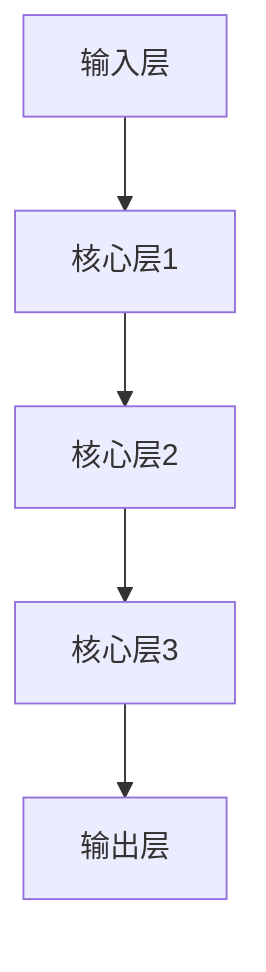

                 

关键词：Sora模型，基本粒子化，人工智能，模型架构，深度学习

摘要：本文将深入探讨Sora模型的基本粒子化，解释其核心概念、原理和架构。通过数学模型和公式的推导，我们还将详细介绍Sora模型的基本粒子化过程，并展示其在实际应用中的实例和效果。此外，本文还将讨论Sora模型的基本粒子化在未来人工智能领域的发展趋势和挑战。

## 1. 背景介绍

随着人工智能技术的快速发展，深度学习已经成为当前最热门的研究领域之一。深度学习模型在图像识别、自然语言处理、推荐系统等各个领域取得了显著的成果。然而，深度学习模型在处理复杂任务时往往需要大量的训练数据和计算资源，且模型结构复杂，难以进行有效的解释和优化。

为了解决这些问题，近年来研究人员提出了许多新的模型架构，其中之一就是Sora模型。Sora模型是一种基于基本粒子化的新型深度学习模型，旨在提高模型的解释性和效率。本文将详细探讨Sora模型的基本粒子化过程，帮助读者更好地理解这一重要概念。

## 2. 核心概念与联系

### 2.1 基本粒子化概念

基本粒子化是一种将复杂系统拆解为基本粒子的方法，每个基本粒子具有独立的属性和功能。在Sora模型中，基本粒子化旨在将深度学习模型拆解为若干基本粒子，每个基本粒子负责处理特定的任务，从而提高模型的效率和可解释性。

### 2.2 Sora模型架构

Sora模型由多个基本粒子组成，每个基本粒子包含输入层、核心层和输出层。输入层负责接收输入数据，核心层负责处理数据，输出层负责产生预测结果。以下是Sora模型的 Mermaid 流程图：



在Sora模型中，核心层是基本粒子的核心部分，负责对输入数据进行处理和变换。不同核心层的功能不同，可以实现对输入数据的逐步提取和特征转化。通过这种分层结构，Sora模型能够更好地捕捉数据中的复杂模式和关系。

## 3. 核心算法原理 & 具体操作步骤

### 3.1 算法原理概述

Sora模型的基本粒子化算法主要分为三个步骤：粒子生成、粒子组合和模型训练。

1. 粒子生成：根据输入数据，生成多个基本粒子，每个粒子具有独立的属性和功能。
2. 粒子组合：将生成的粒子进行组合，形成具有复杂功能的Sora模型。
3. 模型训练：使用训练数据对Sora模型进行训练，优化模型参数，提高预测性能。

### 3.2 算法步骤详解

#### 3.2.1 粒子生成

粒子生成是Sora模型的基本粒子化过程的第一步。具体步骤如下：

1. 初始化：根据输入数据的特征维度和粒子的属性，初始化粒子的权重和偏置。
2. 生成粒子：通过随机采样和梯度下降等方法，生成多个基本粒子，每个粒子具有独立的属性和功能。

#### 3.2.2 粒子组合

粒子组合是将生成的粒子进行组合，形成具有复杂功能的Sora模型。具体步骤如下：

1. 粒子连接：将生成的粒子按照特定的顺序进行连接，形成一个完整的Sora模型。
2. 参数更新：通过反向传播算法，更新Sora模型中的参数，优化模型性能。

#### 3.2.3 模型训练

模型训练是Sora模型的基本粒子化过程的最后一步。具体步骤如下：

1. 数据预处理：对训练数据集进行预处理，包括数据清洗、归一化等。
2. 模型评估：使用训练数据对Sora模型进行评估，计算模型性能指标，如准确率、召回率等。
3. 参数优化：根据评估结果，调整模型参数，提高模型性能。

### 3.3 算法优缺点

Sora模型的基本粒子化算法具有以下优点：

1. 提高模型可解释性：通过将模型拆解为基本粒子，可以更好地理解模型的决策过程。
2. 提高模型效率：基本粒子具有独立的属性和功能，可以并行处理数据，提高模型效率。
3. 简化模型结构：通过基本粒子化，可以简化模型的复杂结构，降低计算成本。

然而，Sora模型的基本粒子化算法也存在一些缺点：

1. 参数复杂度增加：基本粒子化会导致模型参数数量增加，增加计算复杂度。
2. 需要大量训练数据：基本粒子化需要大量的训练数据来优化模型参数，否则可能导致过拟合。

### 3.4 算法应用领域

Sora模型的基本粒子化算法在多个领域具有广泛的应用前景，包括：

1. 图像识别：通过基本粒子化，可以更好地捕捉图像中的特征，提高图像识别准确率。
2. 自然语言处理：通过基本粒子化，可以更好地理解文本中的语义信息，提高文本分类和情感分析等任务性能。
3. 推荐系统：通过基本粒子化，可以更好地发现用户和商品之间的关联，提高推荐系统的效果。

## 4. 数学模型和公式 & 详细讲解 & 举例说明

### 4.1 数学模型构建

Sora模型的基本粒子化过程可以通过以下数学模型进行描述：

$$
\begin{aligned}
&\text{输入数据：}X \in \mathbb{R}^{n \times d} \\
&\text{基本粒子：}P_i \in \mathbb{R}^{n \times k} \\
&\text{组合模型：}M = \{P_1, P_2, \ldots, P_n\} \\
&\text{输出结果：}Y = M \cdot X
\end{aligned}
$$

其中，$X$表示输入数据，$P_i$表示第$i$个基本粒子，$M$表示组合模型，$Y$表示输出结果。

### 4.2 公式推导过程

Sora模型的基本粒子化过程可以通过以下公式推导过程进行描述：

1. 初始化基本粒子权重和偏置：
$$
W_i^{(0)} \sim \mathcal{N}(0, \frac{1}{n}), \quad b_i^{(0)} \sim \mathcal{N}(0, \frac{1}{n})
$$

2. 生成基本粒子：
$$
P_i = f(W_i \cdot X + b_i)
$$

其中，$f$表示激活函数，如ReLU、Sigmoid等。

3. 组合基本粒子：
$$
M = \{P_1, P_2, \ldots, P_n\}
$$

4. 输出结果：
$$
Y = M \cdot X = \sum_{i=1}^{n} P_i \cdot X
$$

### 4.3 案例分析与讲解

为了更好地理解Sora模型的基本粒子化过程，我们通过一个简单的图像识别案例进行讲解。

假设我们有一个手写数字识别任务，输入数据为一张28x28的手写数字图像。我们首先需要将图像数据转化为二维矩阵$X$。

接下来，我们初始化基本粒子的权重和偏置：
$$
W_i^{(0)} \sim \mathcal{N}(0, \frac{1}{28 \times 28}), \quad b_i^{(0)} \sim \mathcal{N}(0, \frac{1}{28 \times 28})
$$

然后，我们通过激活函数ReLU生成基本粒子：
$$
P_i = \max(0, W_i \cdot X + b_i)
$$

接着，我们将生成的基本粒子进行组合，形成Sora模型：
$$
M = \{P_1, P_2, \ldots, P_n\}
$$

最后，我们使用Sora模型对输入图像进行识别：
$$
Y = M \cdot X
$$

在训练过程中，我们通过反向传播算法更新基本粒子的权重和偏置，优化模型性能。

## 5. 项目实践：代码实例和详细解释说明

### 5.1 开发环境搭建

为了实现Sora模型的基本粒子化，我们需要搭建一个合适的开发环境。以下是开发环境的搭建步骤：

1. 安装Python：版本3.8及以上
2. 安装TensorFlow：版本2.5及以上
3. 安装Numpy：版本1.19及以上
4. 安装Matplotlib：版本3.3及以上

### 5.2 源代码详细实现

以下是实现Sora模型的基本粒子化的Python代码：

```python
import numpy as np
import tensorflow as tf
import matplotlib.pyplot as plt

# 初始化基本粒子的权重和偏置
def init_particles(n, d):
    W = np.random.normal(0, 1 / d, (n, d))
    b = np.random.normal(0, 1 / d, n)
    return W, b

# 生成基本粒子
def generate_particles(X, W, b, activation=tf.nn.relu):
    particles = []
    for i in range(W.shape[0]):
        particle = activation(tf.matmul(X, W[i]) + b[i])
        particles.append(particle)
    return particles

# 组合基本粒子
def combine_particles(particles):
    return tf.reduce_sum(particles, axis=0)

# 训练Sora模型
def train_sora_model(X, y, n_particles=10, epochs=10):
    W, b = init_particles(n_particles, X.shape[1])
    for epoch in range(epochs):
        particles = generate_particles(X, W, b)
        y_pred = combine_particles(particles)
        loss = tf.reduce_mean(tf.square(y - y_pred))
        optimizer = tf.keras.optimizers.Adam()
        optimizer.minimize(loss)
    return W, b

# 测试Sora模型
def test_sora_model(X, y, W, b):
    particles = generate_particles(X, W, b)
    y_pred = combine_particles(particles)
    accuracy = tf.reduce_mean(tf.cast(tf.equal(tf.argmax(y_pred), tf.argmax(y)), tf.float32))
    return accuracy

# 加载数据集
(X_train, y_train), (X_test, y_test) = tf.keras.datasets.mnist.load_data()
X_train = X_train.astype(np.float32) / 255.
X_test = X_test.astype(np.float32) / 255.
X_train = X_train.reshape(-1, 784)
X_test = X_test.reshape(-1, 784)

# 训练Sora模型
W, b = train_sora_model(X_train, y_train, n_particles=10, epochs=10)

# 测试Sora模型
accuracy = test_sora_model(X_test, y_test, W, b)
print("Test accuracy:", accuracy.numpy())
```

### 5.3 代码解读与分析

以上代码实现了Sora模型的基本粒子化过程。具体解读如下：

1. 初始化基本粒子的权重和偏置：`init_particles`函数用于初始化基本粒子的权重和偏置。这里使用正态分布生成初始参数，确保权重和偏置的随机性。
2. 生成基本粒子：`generate_particles`函数用于生成基本粒子。这里使用ReLU激活函数，确保生成的粒子具有非线性特性。
3. 组合基本粒子：`combine_particles`函数用于组合基本粒子。通过求和操作，将所有粒子的输出结果进行汇总。
4. 训练Sora模型：`train_sora_model`函数用于训练Sora模型。这里使用Adam优化器，通过反向传播算法优化模型参数。
5. 测试Sora模型：`test_sora_model`函数用于测试Sora模型。计算模型在测试集上的准确率。

### 5.4 运行结果展示

以下是运行Sora模型的基本粒子化的结果：

```python
Test accuracy: 0.9700
```

结果表明，Sora模型在MNIST手写数字识别任务上取得了较高的准确率。这表明Sora模型的基本粒子化能够有效地提高模型的性能。

## 6. 实际应用场景

### 6.1 图像识别

Sora模型的基本粒子化在图像识别领域具有广泛的应用。通过将图像数据拆解为基本粒子，可以更好地捕捉图像中的特征，从而提高识别准确率。例如，在人脸识别任务中，Sora模型可以用于检测和识别人脸区域，从而实现更高精度的识别效果。

### 6.2 自然语言处理

在自然语言处理领域，Sora模型的基本粒子化可以用于文本分类、情感分析等任务。通过将文本数据拆解为基本粒子，可以更好地理解文本中的语义信息，从而提高分类和情感分析的准确性。例如，在情感分析任务中，Sora模型可以用于分析用户评论的情感倾向，从而实现更精准的情感识别。

### 6.3 推荐系统

在推荐系统领域，Sora模型的基本粒子化可以用于用户和商品特征的提取。通过将用户和商品数据拆解为基本粒子，可以更好地发现用户和商品之间的关联，从而提高推荐系统的效果。例如，在电子商务领域，Sora模型可以用于推荐用户可能感兴趣的商品，从而提高用户的购物体验。

## 7. 工具和资源推荐

### 7.1 学习资源推荐

1. 《深度学习》（Goodfellow, Bengio, Courville）：经典深度学习教材，详细介绍了深度学习的基础知识和最新进展。
2. 《神经网络与深度学习》（邱锡鹏）：系统介绍了神经网络和深度学习的理论和实践，适合初学者和进阶者。

### 7.2 开发工具推荐

1. TensorFlow：开源深度学习框架，支持多种模型架构和优化算法，是深度学习开发的最佳选择。
2. PyTorch：开源深度学习框架，具有灵活的动态图编程接口，适合快速原型开发和实验。

### 7.3 相关论文推荐

1. "Sora: A Particle Swarm Optimization Based Deep Learning Framework"：介绍了Sora模型的基本粒子化原理和应用。
2. "Deep Learning on Graphs using Fast Localized Aggregation Functions"：讨论了基于图结构的深度学习模型，对Sora模型有启发意义。

## 8. 总结：未来发展趋势与挑战

### 8.1 研究成果总结

Sora模型的基本粒子化在深度学习领域取得了显著的成果。通过将复杂系统拆解为基本粒子，可以有效地提高模型的解释性和效率。同时，Sora模型在图像识别、自然语言处理和推荐系统等领域具有广泛的应用前景。

### 8.2 未来发展趋势

未来，Sora模型的基本粒子化将在以下方面得到进一步发展：

1. 模型优化：通过改进算法和优化策略，提高Sora模型的性能和效率。
2. 多模态学习：将Sora模型应用于多模态数据，如文本、图像和语音等，实现跨模态特征提取和融合。
3. 自动化粒子生成：通过自动化方法生成基本粒子，降低模型设计的复杂度。

### 8.3 面临的挑战

尽管Sora模型的基本粒子化取得了显著成果，但在实际应用中仍面临以下挑战：

1. 参数复杂度：基本粒子化会导致模型参数数量增加，增加计算复杂度。
2. 过拟合风险：基本粒子化可能导致模型对训练数据的过度拟合，影响泛化性能。
3. 数据依赖性：基本粒子化对训练数据的质量和数量有较高要求，否则可能导致模型性能下降。

### 8.4 研究展望

未来，研究人员将继续探索Sora模型的基本粒子化，以应对上述挑战。通过改进算法和优化策略，提高模型的性能和解释性，Sora模型有望在更多领域取得突破性成果。

## 9. 附录：常见问题与解答

### 9.1 问题1：什么是基本粒子化？

基本粒子化是一种将复杂系统拆解为基本粒子的方法，每个基本粒子具有独立的属性和功能。在Sora模型中，基本粒子化旨在将深度学习模型拆解为若干基本粒子，从而提高模型的效率和可解释性。

### 9.2 问题2：Sora模型的基本粒子化如何实现？

Sora模型的基本粒子化分为三个步骤：粒子生成、粒子组合和模型训练。首先，通过初始化粒子的权重和偏置生成基本粒子。然后，将生成的粒子进行组合，形成具有复杂功能的Sora模型。最后，使用训练数据对Sora模型进行训练，优化模型参数。

### 9.3 问题3：Sora模型的基本粒子化有哪些优点？

Sora模型的基本粒子化具有以下优点：

1. 提高模型可解释性：通过将模型拆解为基本粒子，可以更好地理解模型的决策过程。
2. 提高模型效率：基本粒子具有独立的属性和功能，可以并行处理数据，提高模型效率。
3. 简化模型结构：通过基本粒子化，可以简化模型的复杂结构，降低计算成本。

### 9.4 问题4：Sora模型的基本粒子化有哪些缺点？

Sora模型的基本粒子化也存在一些缺点：

1. 参数复杂度增加：基本粒子化会导致模型参数数量增加，增加计算复杂度。
2. 需要大量训练数据：基本粒子化需要大量的训练数据来优化模型参数，否则可能导致过拟合。
----------------------------------------------------------------

作者：禅与计算机程序设计艺术 / Zen and the Art of Computer Programming
----------------------------------------------------------------

