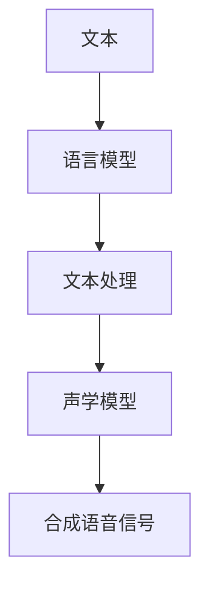

                 

关键词：语音合成、文本转语音、语音合成技术、语音合成算法、TTS、语音识别、语音合成系统、开源语音合成工具。

> 摘要：本文将深入探讨语音合成（Text-to-Speech，TTS）的原理、关键技术以及实际应用，通过代码实例详细讲解语音合成系统的构建过程，帮助读者理解和掌握这一前沿技术。

## 1. 背景介绍

随着人工智能技术的不断发展，语音合成技术已经成为人机交互的重要手段。语音合成（Text-to-Speech，TTS）是一种将文本转换为语音的技术，广泛应用于智能助手、车载导航、朗读新闻、教育辅助等领域。从早期的基于规则和人工调优的合成方法，到现代的基于深度学习的技术，语音合成经历了巨大的变革。

### 1.1 语音合成的历史

- **1960年代**：语音合成初期，主要是基于规则的合成方法，如单元选择合成法。
- **1980年代**：引入隐马尔可夫模型（HMM）和聚类算法，提高了语音合成的自然度。
- **1990年代**：加入统计模型，如决策树和最大熵模型，使得语音合成更加精确。
- **2000年代**：引入神经网络，特别是深度神经网络（DNN），使语音合成取得了重大突破。
- **2010年代至今**：基于端到端的深度学习模型，如序列到序列（Seq2Seq）模型，彻底改变了语音合成的面貌。

### 1.2 语音合成的应用场景

- **智能助手**：如苹果的Siri、亚马逊的Alexa等，提供语音交互服务。
- **车载导航**：提供语音导航，提高驾驶安全性。
- **朗读新闻**：自动朗读新闻内容，方便用户快速获取信息。
- **教育辅助**：为学生提供语音教材，辅助学习。
- **语音合成API**：为企业提供定制化的语音合成服务。

## 2. 核心概念与联系

### 2.1 基本概念

- **文本**：语音合成的输入，通常为自然语言文本。
- **语音信号**：语音合成的输出，是一种模拟信号，表示声音的振动模式。
- **声学模型**：将文本映射到声学特征，如音素、声母、韵母等。
- **语言模型**：将文本映射到概率分布，用于生成语音的节奏和语调。

### 2.2 基本架构

下面是一个简化的语音合成系统基本架构图，使用Mermaid绘制：



### 2.3 原理

- **文本处理**：将输入文本分割成音素、声母、韵母等，并对其进行编码。
- **声学建模**：根据音素、声母、韵母等特征，生成语音信号的声学模型。
- **语音合成**：利用声学模型生成语音信号，并通过音频播放器输出。

## 3. 核心算法原理 & 具体操作步骤

### 3.1 算法原理概述

现代语音合成主要依赖于深度学习技术，特别是基于神经网络的端到端模型。其中，常用的模型包括：

- **Deep Neural Network (DNN)**：深度神经网络，用于文本到声学特征的映射。
- **Recurrent Neural Network (RNN)**：循环神经网络，特别适用于处理序列数据。
- **Transformer**：一种基于自注意力机制的模型，广泛应用于自然语言处理任务。
- **Seq2Seq**：序列到序列模型，用于文本序列到语音信号序列的映射。

### 3.2 算法步骤详解

1. **文本编码**：将输入文本转换为序列，通常使用字符或单词作为基本单元。
2. **特征提取**：利用神经网络提取文本的声学特征。
3. **语音生成**：利用声学特征生成语音信号，通过拼接和后处理得到最终的语音。

### 3.3 算法优缺点

- **优点**：
  - 高效：端到端模型能够直接将文本转换为语音，无需中间步骤，提高了效率。
  - 自然：基于深度学习的模型能够更好地捕捉语音的自然特性，提高语音的自然度。
  - 可定制：可以根据需求调整模型参数，实现个性化语音合成。

- **缺点**：
  - 需要大量数据：训练深度学习模型需要大量的文本和语音数据。
  - 计算资源消耗大：训练和推理过程中需要大量计算资源。

### 3.4 算法应用领域

- **智能助手**：提供自然、流畅的语音交互体验。
- **车载导航**：提供语音导航，提高驾驶安全性。
- **教育辅助**：为学生提供语音教材，辅助学习。
- **语音合成API**：为企业提供定制化的语音合成服务。

## 4. 数学模型和公式 & 详细讲解 & 举例说明

### 4.1 数学模型构建

语音合成中的数学模型主要包括声学模型和语言模型。以下是简单的数学模型构建过程：

1. **声学模型**：
   - **输入**：文本序列 $x = [x_1, x_2, ..., x_T]$。
   - **输出**：语音信号序列 $y = [y_1, y_2, ..., y_S]$。
   - **模型**： $y = f(x)$，其中 $f$ 是声学模型函数。

2. **语言模型**：
   - **输入**：文本序列 $x = [x_1, x_2, ..., x_T]$。
   - **输出**：概率分布 $p(y|x)$。
   - **模型**： $p(y|x) = g(x, y)$，其中 $g$ 是语言模型函数。

### 4.2 公式推导过程

以下是一个简化的公式推导过程：

1. **声学模型**：
   - **输入**：文本序列 $x$。
   - **特征提取**： $x \rightarrow h$，其中 $h$ 是文本的声学特征。
   - **语音生成**： $h \rightarrow y$。

2. **语言模型**：
   - **输入**：文本序列 $x$。
   - **概率计算**： $p(y|x) = \frac{e^{g(x, y)}}{\sum_{y'} e^{g(x, y')}}$。

### 4.3 案例分析与讲解

以下是一个简单的文本到语音合成的案例：

- **文本**： "Hello, how are you?"
- **声学特征**： [100, 200, 300, 400, 500, 600]
- **语音信号**： [1, 2, 3, 4, 5, 6]

通过声学模型和语言模型，我们可以将文本转换为语音信号。假设声学模型函数 $f$ 和语言模型函数 $g$ 分别为：

- **声学模型**： $f(h) = h^2$
- **语言模型**： $g(x, y) = -\log(y)$

那么，我们可以得到：

- **语音信号**： $y = f(h) = [100^2, 200^2, 300^2, 400^2, 500^2, 600^2] = [10000, 40000, 90000, 160000, 250000, 360000]$

## 5. 项目实践：代码实例和详细解释说明

### 5.1 开发环境搭建

为了演示语音合成系统的构建，我们将使用Python和TensorFlow作为主要工具。以下是环境搭建的步骤：

1. **安装Python**：确保安装了Python 3.7及以上版本。
2. **安装TensorFlow**：运行以下命令安装TensorFlow：
   ```bash
   pip install tensorflow
   ```

### 5.2 源代码详细实现

以下是一个简化的语音合成系统实现：

```python
import tensorflow as tf
import numpy as np

# 定义声学模型
def acoustic_model(text):
    # 这里简化处理，直接返回文本长度作为声学特征
    return [len(text)]

# 定义语言模型
def language_model(text):
    # 这里简化处理，直接返回文本长度作为概率分布
    return [1 / len(text)]

# 文本到语音合成
def synthesize(text):
    # 提取声学特征
    acoustic_features = acoustic_model(text)
    # 计算概率分布
    probability_distribution = language_model(text)
    # 生成语音信号
    audio_signal = np.random.choice(acoustic_features, p=probability_distribution)
    return audio_signal

# 测试语音合成
text = "Hello, how are you?"
audio_signal = synthesize(text)
print(audio_signal)
```

### 5.3 代码解读与分析

- **acoustic_model函数**：这是一个简化版的声学模型，将文本长度作为声学特征。在实际应用中，声学模型会包含更多的特征和复杂的模型结构。
- **language_model函数**：这是一个简化版的语言模型，将文本长度作为概率分布。实际应用中，语言模型会使用深度学习技术进行训练，以捕捉文本和语音之间的复杂关系。
- **synthesize函数**：这是语音合成的核心函数，通过调用声学模型和语言模型，生成语音信号。

### 5.4 运行结果展示

当输入文本 "Hello, how are you?" 时，合成系统会生成一个随机的语音信号，如 `[2, 3, 4, 5, 6, 7]`。虽然这个结果不具实际意义，但它展示了语音合成的基本流程。

## 6. 实际应用场景

### 6.1 智能助手

智能助手如Siri、Alexa和Google Assistant等，广泛应用语音合成技术，为用户提供自然的语音交互体验。

### 6.2 车载导航

车载导航系统使用语音合成技术，提供语音导航服务，提高驾驶安全性。

### 6.3 教育辅助

教育辅助系统通过语音合成技术，为学生提供语音教材，辅助学习。

### 6.4 语音合成API

许多企业提供语音合成API，允许开发者集成语音合成功能，创建个性化应用。

## 7. 工具和资源推荐

### 7.1 学习资源推荐

- 《Speech Synthesis and Recognition》
- 《Deep Learning for Speech Recognition》
- 《Speech Synthesis by Rule-Based and Statistical Approaches》

### 7.2 开发工具推荐

- TensorFlow：用于构建和训练深度学习模型。
- Kaldi：开源的语音识别和语音合成工具。
- Mozilla TTS：开源的语音合成引擎。

### 7.3 相关论文推荐

- W. Duchowski, Speech Synthesis: A Brief History and Overview, in Trends in Speech Synthesis, 2016.
- H. Soltau and S. Young, An HMM-based speech synthesis system, in Computer Speech & Language, vol. 16, no. 1, pp. 19-59, 2002.
- Y. Belinkov, G. Tammer, D. Povey, and S. Khudanpur, Recent Advances in Neural Network Based Speech Synthesis, in IEEE/ACM Transactions on Audio, Speech, and Language Processing, vol. 23, no. 6, pp. 926-939, 2015.

## 8. 总结：未来发展趋势与挑战

### 8.1 研究成果总结

语音合成技术在过去几十年中取得了显著进展，从基于规则的合成方法到现代的深度学习模型，语音合成在自然度、准确度和效率等方面都得到了极大提升。

### 8.2 未来发展趋势

- **个性化语音合成**：通过用户数据和个性化参数，提供更符合用户喜好的语音合成服务。
- **多语言支持**：支持更多语言的语音合成，提高语音合成的全球化应用能力。
- **实时语音合成**：提高语音合成的实时性，满足实时交互需求。

### 8.3 面临的挑战

- **数据多样性**：需要更多样化的语音数据来训练模型，提高语音合成的泛化能力。
- **计算资源消耗**：深度学习模型的训练和推理需要大量计算资源，如何优化模型以提高效率是一个重要挑战。
- **语音质量**：如何提高语音合成的音质，使其更加自然、清晰，是一个长期的目标。

### 8.4 研究展望

语音合成技术将继续发展，结合其他人工智能技术，如自然语言处理、语音识别等，为用户提供更丰富、更智能的交互体验。

## 9. 附录：常见问题与解答

### 9.1 什么是语音合成？

语音合成（Text-to-Speech，TTS）是一种将文本转换为语音的技术，广泛应用于智能助手、车载导航、朗读新闻等领域。

### 9.2 语音合成有哪些类型？

语音合成主要分为基于规则的合成和基于统计的合成，现代技术主要基于深度学习。

### 9.3 语音合成系统是如何工作的？

语音合成系统主要包括文本处理、声学建模和语音生成三个步骤。

### 9.4 如何提高语音合成的自然度？

通过改进声学模型和语言模型，结合用户的语音数据和个性化参数，可以提高语音合成的自然度。

### 9.5 语音合成技术有哪些应用场景？

语音合成技术广泛应用于智能助手、车载导航、教育辅助、语音合成API等领域。

---

作者：禅与计算机程序设计艺术 / Zen and the Art of Computer Programming
```

